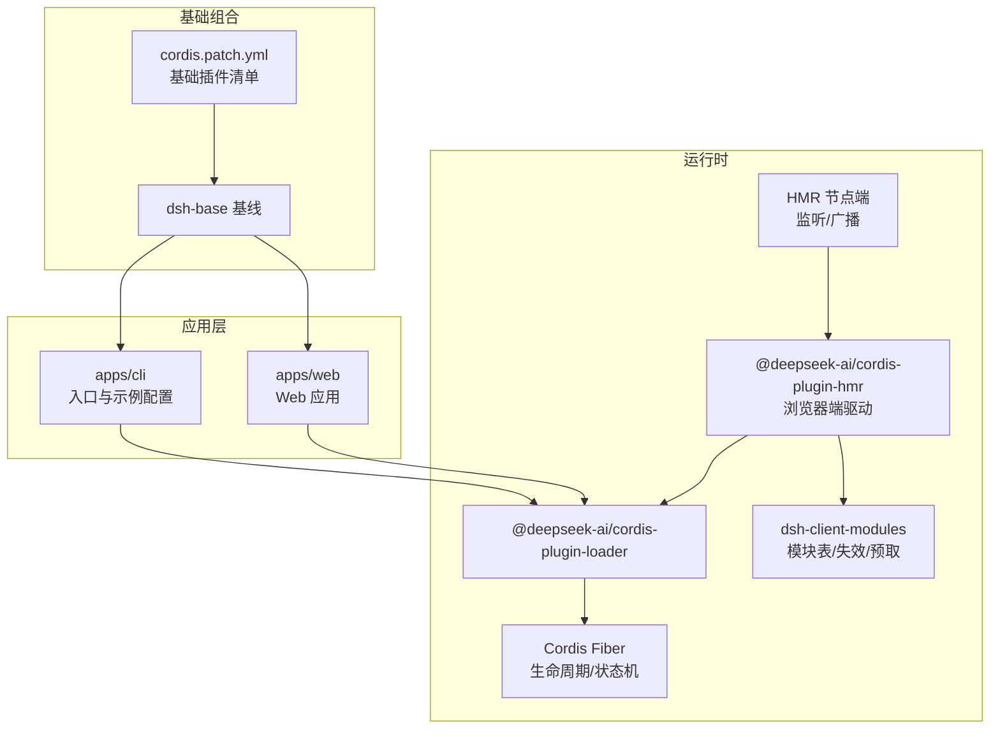
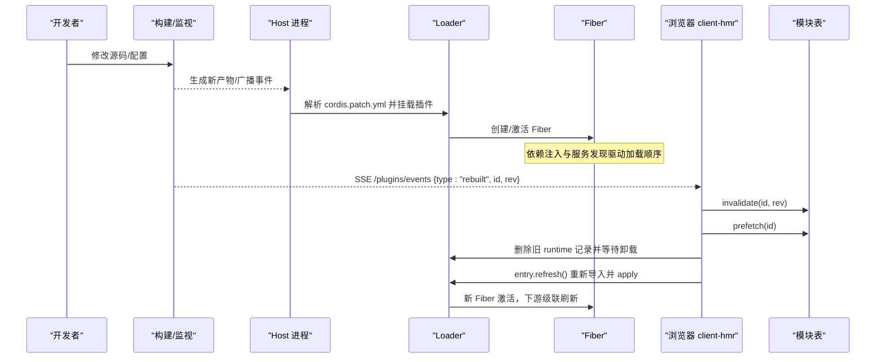
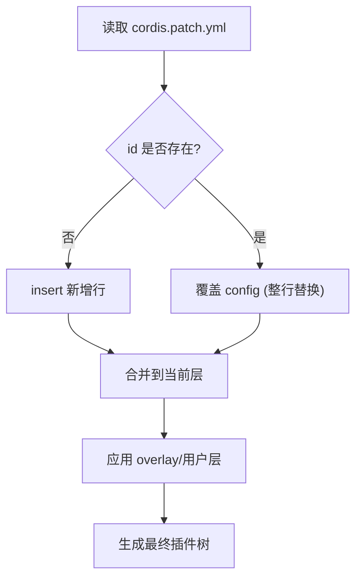
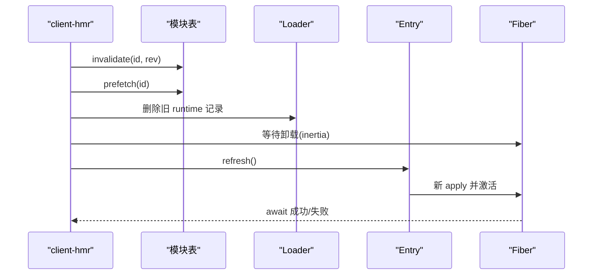
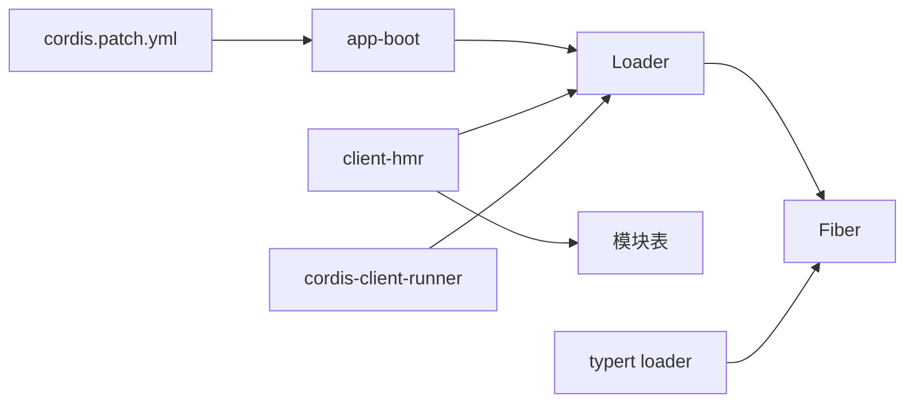

# 组合与热重载

<cite>
**本文引用的文件**
- [apps/cli/composition.md](file://apps/cli/composition.md)
- [packages/bundle/base/cordis.patch.yml](file://packages/bundle/base/cordis.patch.yml)
- [docs/cordis-tutorial/06-composition-and-hmr.md](file://docs/cordis-tutorial/06-composition-and-hmr.md)
- [packages/client/hmr/src/client/index.ts](file://packages/client/hmr/src/client/index.ts)
- [packages/extensions/cordis-client-runner/src/client/runtime.ts](file://packages/extensions/cordis-client-runner/src/client/runtime.ts)
- [packages/boot/app-boot/src/index.ts](file://packages/boot/app-boot/src/index.ts)
- [packages/typert/loader/src/index.ts](file://packages/typert/loader/src/index.ts)
- [scripts/publish-npm-baseline.ts](file://scripts/publish-npm-baseline.ts)
</cite>

## 目录
1. [简介](#简介)
2. [项目结构](#项目结构)
3. [核心组件](#核心组件)
4. [架构总览](#架构总览)
5. [详细组件分析](#详细组件分析)
6. [依赖关系分析](#依赖关系分析)
7. [性能考虑](#性能考虑)
8. [故障排查指南](#故障排查指南)
9. [结论](#结论)
10. [附录](#附录)

## 简介
本文件聚焦于插件组合与热重载机制，围绕以下目标展开：
- 解释插件的组合模式与编排策略（条件加载、动态装配）。
- 详述热重载的工作原理与实现细节（代码更新、状态保持、依赖重建）。
- 提供开发环境调试技巧与性能优化方法。
- 说明生产环境的部署策略与版本管理。
- 给出故障恢复、回滚机制与监控告警的实现方案。
- 展示如何构建可扩展的应用架构。

## 项目结构
该仓库采用多包（monorepo）组织，插件系统基于 Cordis 的上下文与 Fiber 模型，通过配置驱动进行组合；热重载在客户端由独立 HMR 插件驱动，结合模块表与 Loader 完成无感替换。

图表来源
- [packages/bundle/base/cordis.patch.yml:1-502](file://packages/bundle/base/cordis.patch.yml#L1-L502)
- [apps/cli/composition.md:1-277](file://apps/cli/composition.md#L1-L277)

章节来源
- [packages/bundle/base/cordis.patch.yml:1-502](file://packages/bundle/base/cordis.patch.yml#L1-L502)
- [apps/cli/composition.md:1-277](file://apps/cli/composition.md#L1-L277)

## 核心组件
- 插件清单与补丁：通过 cordis.patch.yml 声明基础插件树，支持按 id 覆盖与插入，形成可叠加的配置层。
- 启动引导：app-boot 负责安装 Loader、执行 prepare、挂载配置树并断言所有条目已加载。
- 客户端 HMR：client-hmr 订阅 SSE 事件，对指定 entry 执行“失效→预取→卸载旧 fiber→清理样式→刷新新 fiber”的原子替换流程。
- 动态运行器：cordis-client-runner 负责动态包的加载、失效、移除与样式清理，确保重复注册安全。
- 类型加载器：typert loader 监听内部插件事件，将变更纳入脏集并批量处理，避免污染其他条目。

章节来源
- [packages/bundle/base/cordis.patch.yml:15-502](file://packages/bundle/base/cordis.patch.yml#L15-L502)
- [packages/boot/app-boot/src/index.ts:666-693](file://packages/boot/app-boot/src/index.ts#L666-L693)
- [packages/client/hmr/src/client/index.ts:1-186](file://packages/client/hmr/src/client/index.ts#L1-L186)
- [packages/extensions/cordis-client-runner/src/client/runtime.ts:361-467](file://packages/extensions/cordis-client-runner/src/client/runtime.ts#L361-L467)
- [packages/typert/loader/src/index.ts:392-422](file://packages/typert/loader/src/index.ts#L392-L422)

## 架构总览
下图展示了从配置到运行时、再到热重载的关键路径：

图表来源
- [packages/client/hmr/src/client/index.ts:98-186](file://packages/client/hmr/src/client/index.ts#L98-L186)
- [packages/extensions/cordis-client-runner/src/client/runtime.ts:361-467](file://packages/extensions/cordis-client-runner/src/client/runtime.ts#L361-L467)
- [packages/boot/app-boot/src/index.ts:772-788](file://packages/boot/app-boot/src/index.ts#L772-L788)

## 详细组件分析

### 插件组合与编排策略
- 基础清单：通过 cordis.patch.yml 以 id 为键插入或覆盖插件行，后续 bundle 与用户层可按 id 精准覆写，实现“最后写入获胜”。
- 条件加载：通过 disabled 字段与平台判断表达式控制插件是否挂载（如 bash-sandbox 在 Windows 禁用）。
- 动态装配：不同 profile/overlay 通过 patch 叠加，最终形成完整插件树；web/headless/sdk/acp 等共享 dsh-base 并通过各自模式层定制。
- 服务依赖驱动：加载顺序不依赖行序，而由服务可用性决定；PENDING 表示依赖尚未满足。

图表来源
- [packages/bundle/base/cordis.patch.yml:1-502](file://packages/bundle/base/cordis.patch.yml#L1-L502)

章节来源
- [packages/bundle/base/cordis.patch.yml:15-502](file://packages/bundle/base/cordis.patch.yml#L15-L502)
- [apps/cli/composition.md:1-277](file://apps/cli/composition.md#L1-L277)

### 热重载工作原理（客户端）
- 事件通道：client-hmr 订阅系统 SSE 通道 GET /plugins/events，接收 rebuilt 帧。
- 原子替换流程：
  - 失效：调用模块表 invalidate 丢弃旧工厂与实例化记录。
  - 预取：prefetch 加载新工厂（无副作用，惰性 CJS）。
  - 卸载：先删除 registry 中的 runtime 回调，再等待旧 fiber 的卸载惯性结束，清理 owned 样式。
  - 刷新：entry.refresh() 重新导入并 apply，随后 await 新 fiber 激活结果。
- 失败策略：不回滚；import 失败保留旧 fiber 继续运行，apply 失败标记 FAILED 并由 shell 投影显示。
- 级联刷新：下游 fiber 基于 provider fiber uid 的激活纪元自动级联，无需额外 HMR 记账。

图表来源
- [packages/client/hmr/src/client/index.ts:98-186](file://packages/client/hmr/src/client/index.ts#L98-L186)
- [packages/extensions/cordis-client-runner/src/client/runtime.ts:361-467](file://packages/extensions/cordis-client-runner/src/client/runtime.ts#L361-L467)

章节来源
- [packages/client/hmr/src/client/index.ts:1-186](file://packages/client/hmr/src/client/index.ts#L1-L186)
- [packages/extensions/cordis-client-runner/src/client/runtime.ts:361-467](file://packages/extensions/cordis-client-runner/src/client/runtime.ts#L361-L467)

### 状态保持与依赖重建
- 状态保持：HMR 仅替换 entry 对应的 fiber，不重启页面；CSS 注入通过稳定 tag id 保证幂等，避免重复注入。
- 依赖重建：下游 fiber 通过 provider fiber uid 感知变化，自动触发重新激活，数据层插件刷新会级联到 UI 依赖。
- 类型加载器：typert loader 监听 internal/plugin 事件，将变更加入脏集并微任务批处理，避免单个损坏条目污染整体。

章节来源
- [packages/client/hmr/src/client/index.ts:118-140](file://packages/client/hmr/src/client/index.ts#L118-L140)
- [packages/typert/loader/src/index.ts:392-422](file://packages/typert/loader/src/index.ts#L392-L422)

### 启动与诊断
- 启动引导：boot 安装 Loader，执行 prepare，挂载配置树，并在完成后审计未加载条目，抛出带标签的错误信息。
- 诊断 PENDING：通过遍历 registry 中 fiber.state 为 PENDING 的条目，定位缺失的服务提供者。

章节来源
- [packages/boot/app-boot/src/index.ts:666-693](file://packages/boot/app-boot/src/index.ts#L666-L693)
- [docs/cordis-tutorial/06-composition-and-hmr.md:61-110](file://docs/cordis-tutorial/06-composition-and-hmr.md#L61-L110)

## 依赖关系分析
- 组合层：cordis.patch.yml 定义基础插件集合，各模式层与用户层通过 patch 叠加。
- 运行层：Loader 管理 Entry/Fiber，client-hmr 依赖 Loader 与模块表；cordis-client-runner 负责动态包的加载/卸载。
- 工具链：typert loader 与 HMR 协同，确保类型相关资源随插件变更刷新。

图表来源
- [packages/bundle/base/cordis.patch.yml:15-502](file://packages/bundle/base/cordis.patch.yml#L15-L502)
- [packages/boot/app-boot/src/index.ts:772-788](file://packages/boot/app-boot/src/index.ts#L772-L788)
- [packages/client/hmr/src/client/index.ts:98-186](file://packages/client/hmr/src/client/index.ts#L98-L186)
- [packages/extensions/cordis-client-runner/src/client/runtime.ts:361-467](file://packages/extensions/cordis-client-runner/src/client/runtime.ts#L361-L467)
- [packages/typert/loader/src/index.ts:392-422](file://packages/typert/loader/src/index.ts#L392-L422)

章节来源
- [packages/bundle/base/cordis.patch.yml:15-502](file://packages/bundle/base/cordis.patch.yml#L15-L502)
- [packages/boot/app-boot/src/index.ts:772-788](file://packages/boot/app-boot/src/index.ts#L772-L788)

## 性能考虑
- 懒加载与惰性工厂：模块表采用惰性 CJS，prefetch 阶段仅注册工厂，副作用在 materialization 时执行，减少热更开销。
- 批量刷新：typert loader 使用脏集+微任务批处理，降低频繁变更带来的抖动。
- 最小化重绘：HMR 在卸载后清理 owned 样式，再注入新样式，利用稳定 tag id 保证幂等，避免重复渲染。
- 事件节流：SSE 事件串行化处理，避免并发 reload 导致的状态竞争。

[本节为通用指导，不直接分析具体文件]

## 故障排查指南
- 插件未加载：检查 boot 的断言输出，确认是否有条目 fiber 为空且非 disabled；查看 Loader 日志与 fiber 状态。
- 依赖缺失导致 PENDING：使用教程中的诊断脚本遍历 registry，打印 PENDING 条目及其所需服务。
- HMR 失败：关注 client-hmr 的 warn/error 日志；若 import 失败，旧 fiber 仍运行，下一次 rebuilt 会重试；若 apply 失败，fiber 进入 FAILED，需检查新代码。
- 样式冲突：确认样式标签 data-plugin 属性是否正确清理与注入；必要时手动刷新页面。

章节来源
- [packages/boot/app-boot/src/index.ts:666-693](file://packages/boot/app-boot/src/index.ts#L666-L693)
- [docs/cordis-tutorial/06-composition-and-hmr.md:61-110](file://docs/cordis-tutorial/06-composition-and-hmr.md#L61-L110)
- [packages/client/hmr/src/client/index.ts:145-186](file://packages/client/hmr/src/client/index.ts#L145-L186)

## 结论
该插件体系通过配置驱动的补丁机制实现高度可组合的应用架构；HMR 借助模块表与 Loader 的惰性模型，实现了安全的无感热更与级联刷新。配合完善的启动断言与诊断能力，可在开发与生产环境中获得稳定的扩展性与可维护性。

[本节为总结，不直接分析具体文件]

## 附录

### 开发环境调试技巧
- 启用 HMR：在 cordis.yml 中加入 hmr 插件并设置 root 监听目录；使用 tsx 运行以支持热更。
- 诊断 PENDING：编写诊断插件遍历 registry，打印 PENDING 条目及所需服务。
- 观察事件流：打开浏览器控制台，查看 /plugins/events 的 SSE 消息与 client-hmr 日志。

章节来源
- [docs/cordis-tutorial/06-composition-and-hmr.md:23-59](file://docs/cordis-tutorial/06-composition-and-hmr.md#L23-L59)
- [docs/cordis-tutorial/06-composition-and-hmr.md:61-110](file://docs/cordis-tutorial/06-composition-and-hmr.md#L61-L110)

### 生产环境部署策略与版本管理
- 发布流程：pack 阶段生成不可变产物与校验和，publish 阶段消费验证后的 tarball，确保制品一致性。
- 版本策略：使用精确版本号与 dist-tag 管理；内部依赖锁定为同一版本，避免漂移。
- 回滚机制：基于 tag 与制品索引快速回滚至已知稳定版本；发布前在隔离环境执行安装态探测与集成测试。

章节来源
- [scripts/publish-npm-baseline.ts:284-302](file://scripts/publish-npm-baseline.ts#L284-L302)

### 监控告警与故障恢复
- 遥测默认策略：默认反馈门控上传，仅在用户记录反馈时上报会话记录，保护隐私同时便于诊断。
- 关闭超时：OTel 后端设置 shutdownTimeoutMillis，确保进程退出时优雅收尾，避免阻塞。
- 恢复策略：插件卸载期间停止重连并注销工具；崩溃后通过重生服务器恢复，保证工具唯一性与无泄漏。

章节来源
- [packages/session/session-telemetry-otel/src/index.ts:113-139](file://packages/session/session-telemetry-otel/src/index.ts#L113-L139)