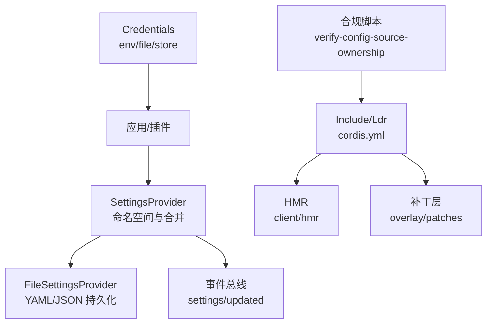
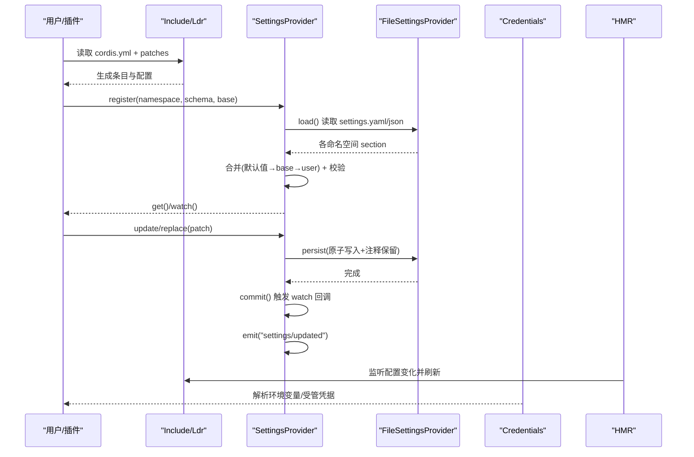
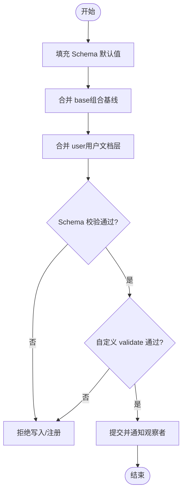
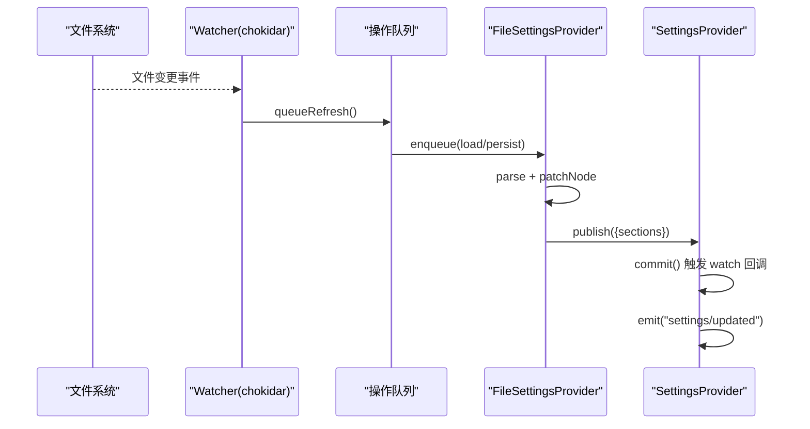
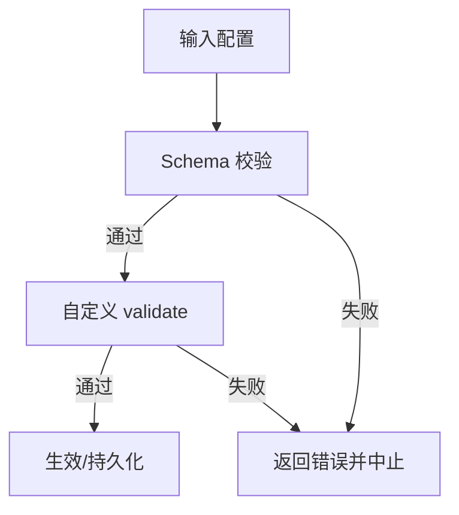
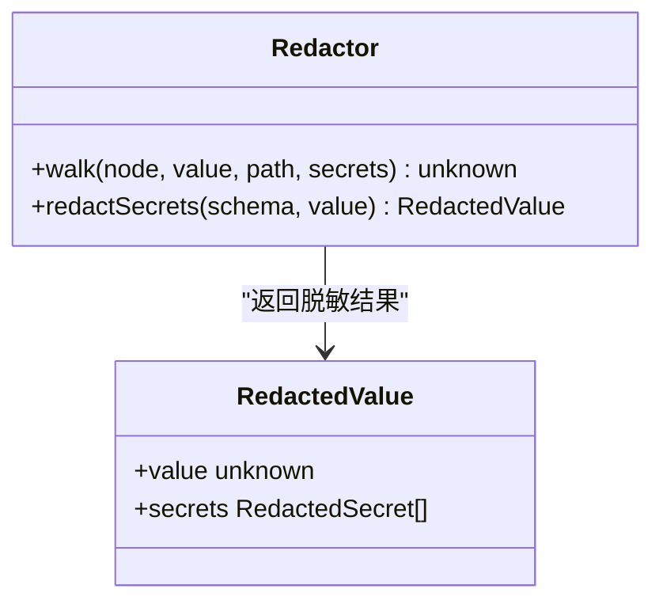
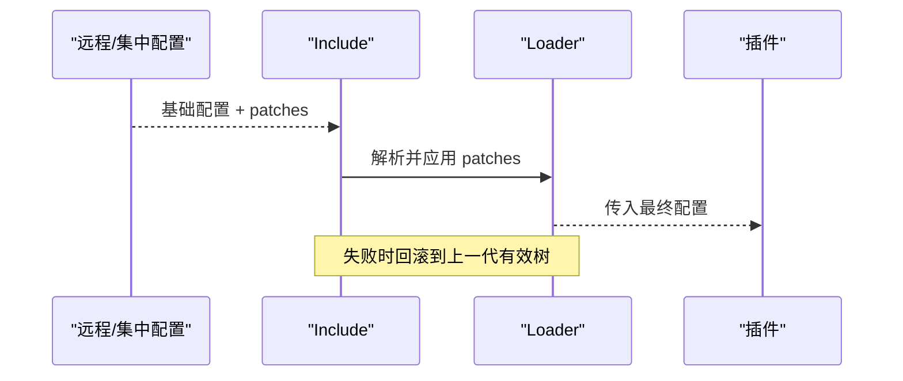
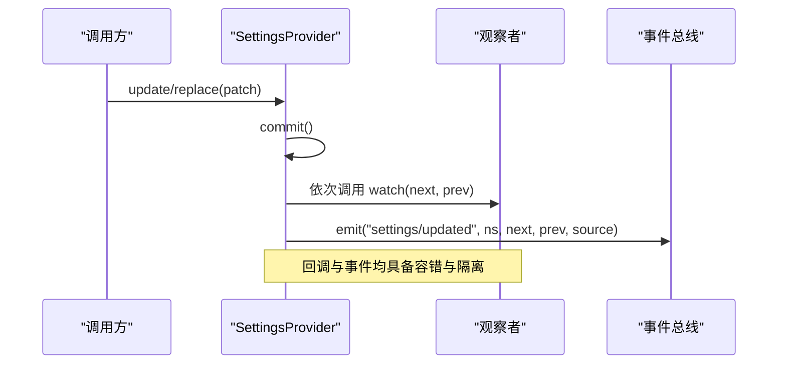
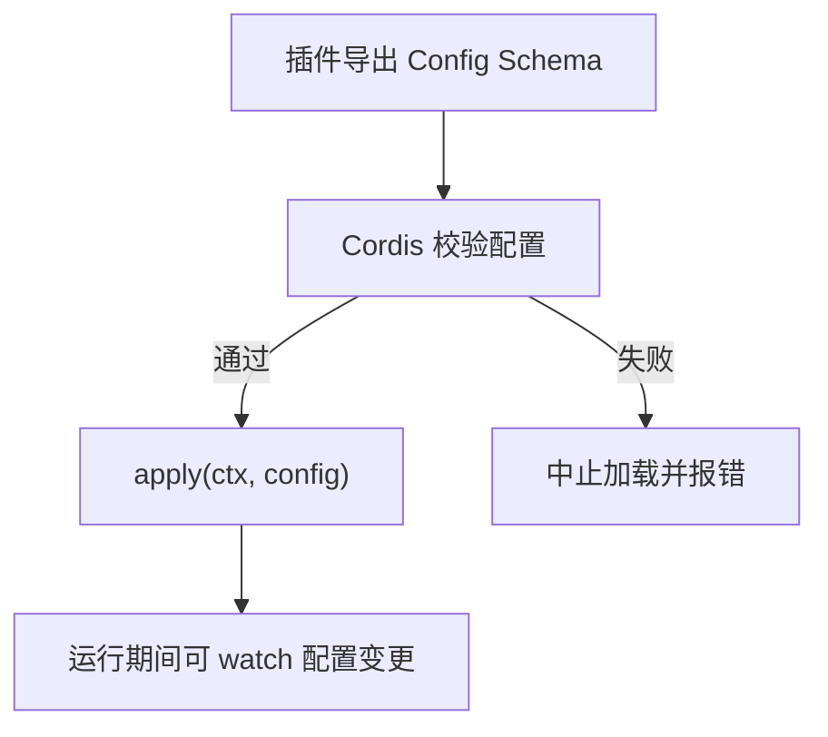
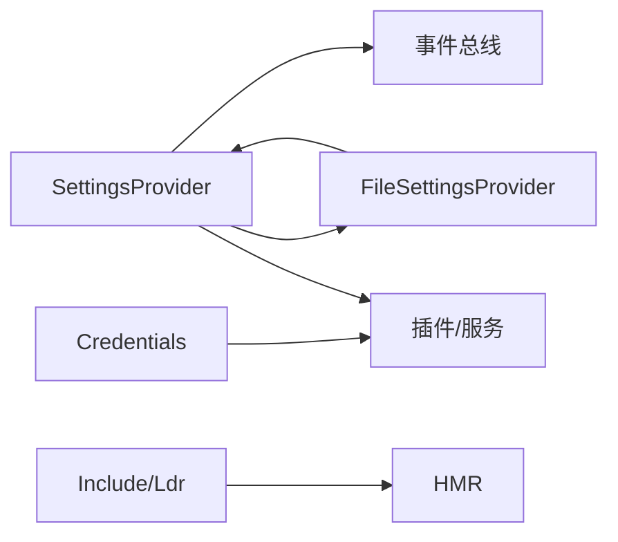

# 配置系统

<cite>
**本文引用的文件**
- [packages/settings/settings/src/index.ts](file://packages/settings/settings/src/index.ts)
- [packages/settings/settings/src/redact.ts](file://packages/settings/settings/src/redact.ts)
- [packages/settings/settings-file/src/index.ts](file://packages/settings/settings-file/src/index.ts)
- [packages/boot/app-boot/tests/config-reload.spec.ts](file://packages/boot/app-boot/tests/config-reload.spec.ts)
- [packages/client/hmr/src/index.ts](file://packages/client/hmr/src/index.ts)
- [scripts/verify-config-source-ownership.ts](file://scripts/verify-config-source-ownership.ts)
- [docs/cordis-tutorial/05-config.md](file://docs/cordis-tutorial/05-config.md)
- [docs/subsystems/credentials.md](file://docs/subsystems/credentials.md)
- [packages/credentials/credentials/src/index.ts](file://packages/credentials/credentials/src/index.ts)
</cite>

## 目录
1. [简介](#简介)
2. [项目结构](#项目结构)
3. [核心组件](#核心组件)
4. [架构总览](#架构总览)
5. [详细组件分析](#详细组件分析)
6. [依赖关系分析](#依赖关系分析)
7. [性能考虑](#性能考虑)
8. [故障排查指南](#故障排查指南)
9. [结论](#结论)
10. [附录](#附录)

## 简介
本文件系统性说明该仓库中的“配置系统”，覆盖以下主题：
- 配置的层次结构与合并策略：默认值、组合基线（base）、用户文档层（user）的优先级与合并顺序。
- 配置的验证与类型检查：基于 Schema 的运行时校验、跨字段校验、失败时的回滚与保护。
- 热重载机制：文件监听、增量持久化、HMR 事件广播与失败恢复。
- 加密与敏感信息处理：通过 schema 标注 secret 并自动脱敏输出。
- 环境变量集成：凭据解析链与环境变量来源，以及禁止在 shipped 配置中内联环境变量的约束。
- 远程配置更新：通过 Include/Patches 实现可插拔的配置叠加与热替换。
- 配置变更的事件通知与响应：watch、settings/updated 事件、并发安全与序列化。
- 最佳实践与安全建议：如何构建可配置的服务与插件架构。

## 项目结构
配置系统由多个协作模块组成：
- settings（核心服务定义）：提供命名空间注册、分层合并、变更观察、事件发布、冲突检测等能力。
- settings-file（文件提供者）：将配置持久化为 YAML/JSON，支持外部编辑的热重载与原子写入。
- boot/app-boot（加载器与热重载）：对 cordis.yml 进行包含、补丁、热更新与回滚。
- client/hmr（开发时 HMR）：监听配置变化并广播到客户端。
- credentials（凭据子系统）：统一的环境变量与受管存储的解析链，避免硬编码密钥。
- scripts/verify-config-source-ownership（合规脚本）：禁止在 shipped 配置中直接内联环境变量。

图表来源
- [packages/settings/settings/src/index.ts:1-200](file://packages/settings/settings/src/index.ts#L1-L200)
- [packages/settings/settings-file/src/index.ts:1-200](file://packages/settings/settings-file/src/index.ts#L1-L200)
- [packages/boot/app-boot/tests/config-reload.spec.ts:61-172](file://packages/boot/app-boot/tests/config-reload.spec.ts#L61-L172)
- [packages/client/hmr/src/index.ts:63-91](file://packages/client/hmr/src/index.ts#L63-L91)
- [scripts/verify-config-source-ownership.ts:24-55](file://scripts/verify-config-source-ownership.ts#L24-L55)

章节来源
- [packages/settings/settings/src/index.ts:1-200](file://packages/settings/settings/src/index.ts#L1-L200)
- [packages/settings/settings-file/src/index.ts:1-200](file://packages/settings/settings-file/src/index.ts#L1-L200)
- [packages/boot/app-boot/tests/config-reload.spec.ts:61-172](file://packages/boot/app-boot/tests/config-reload.spec.ts#L61-L172)
- [packages/client/hmr/src/index.ts:63-91](file://packages/client/hmr/src/index.ts#L63-L91)
- [scripts/verify-config-source-ownership.ts:24-55](file://scripts/verify-config-source-ownership.ts#L24-L55)

## 核心组件
- SettingsProvider（核心服务）
  - 命名空间注册与描述：每个插件注册一个命名空间及其 Schema，得到当前已解析的值、Schema 描述、修订号、作用时机等。
  - 分层合并：按“Schema 默认值 → base（组合基线）→ user（用户文档层）”的顺序合并，最终通过 Schema 校验得到强类型值。
  - 变更观察与事件：watch 回调串行执行；提交后发出 settings/updated 事件，携带 next/prev/source。
  - 冲突检测：写操作可携带 expectedRevision，若命名空间已变更则抛出冲突错误。
  - 脱敏输出：describe 时可剥离 role('secret') 字段并返回 secrets 位置清单。

- FileSettingsProvider（文件提供者）
  - 单一文档多命名空间：所有命名空间的 section 保存在同一 YAML/JSON 文件中。
  - 原子写入与注释保留：使用最小差异 patch 写入，保持注释与格式。
  - 热重载：chokidar 监听文件变化，队列化重读与持久化，避免竞态。
  - 路径与格式：支持 .yaml/.yml/.json，默认位于 harness home 下的 settings.yaml。

- Include/Ldr 与 HMR（加载器与热更新）
  - Include 支持从基础配置引入并通过 patches 叠加多层配置（bundle/user 层）。
  - 热更新失败会回滚到上一代有效树，保证运行稳定性。
  - HMR 监听配置变化并广播 hmr/config-update-failed 等事件，供上层处理。

- Credentials（凭据子系统）
  - 统一的凭据解析链：进程环境、受管存储、.env 文件等多层来源。
  - 空值规则：空存储值视为未配置，避免误判。
  - 记录级元数据：kind/env 等可持久化，便于声明式配置。

章节来源
- [packages/settings/settings/src/index.ts:1-200](file://packages/settings/settings/src/index.ts#L1-L200)
- [packages/settings/settings/src/index.ts:748-799](file://packages/settings/settings/src/index.ts#L748-L799)
- [packages/settings/settings-file/src/index.ts:1-200](file://packages/settings/settings-file/src/index.ts#L1-L200)
- [packages/boot/app-boot/tests/config-reload.spec.ts:61-172](file://packages/boot/app-boot/tests/config-reload.spec.ts#L61-L172)
- [packages/client/hmr/src/index.ts:63-91](file://packages/client/hmr/src/index.ts#L63-L91)
- [docs/subsystems/credentials.md:123-131](file://docs/subsystems/credentials.md#L123-L131)
- [packages/credentials/credentials/src/index.ts:93-122](file://packages/credentials/credentials/src/index.ts#L93-L122)

## 架构总览
下图展示了配置从来源到消费的全链路：Include 读取基础配置与补丁，SettingsProvider 合并并校验，FileSettingsProvider 持久化与热重载，Credentials 提供环境变量与受管凭据，HMR 负责开发期热更新。

图表来源
- [packages/settings/settings/src/index.ts:748-799](file://packages/settings/settings/src/index.ts#L748-L799)
- [packages/settings/settings-file/src/index.ts:1-200](file://packages/settings/settings-file/src/index.ts#L1-L200)
- [packages/boot/app-boot/tests/config-reload.spec.ts:61-172](file://packages/boot/app-boot/tests/config-reload.spec.ts#L61-L172)
- [packages/client/hmr/src/index.ts:63-91](file://packages/client/hmr/src/index.ts#L63-L91)
- [docs/subsystems/credentials.md:123-131](file://docs/subsystems/credentials.md#L123-L131)

## 详细组件分析

### 配置分层与合并策略
- 层级顺序
  - Schema 默认值：确保缺失字段有合理默认。
  - base（组合基线）：插件或框架注入的只读基线，优先于用户层但低于 Schema 默认值。
  - user（用户文档层）：来自 settings.yaml/json 的 section，可覆盖 base 与默认值。
- 合并与校验
  - 合并后的候选值通过 Schema 运行时校验，再执行可选的 validate（跨字段校验）。
  - 校验失败不会持久化，调用方在 update/replace/mutate 处获知。
- 可见性与脱敏
  - describe 时可剥离 role('secret') 字段，仅暴露 secrets 位置清单，用于 UI 展示与审计。

图表来源
- [packages/settings/settings/src/index.ts:696-710](file://packages/settings/settings/src/index.ts#L696-L710)
- [packages/settings/settings/src/index.ts:748-799](file://packages/settings/settings/src/index.ts#L748-L799)

章节来源
- [packages/settings/settings/src/index.ts:1-200](file://packages/settings/settings/src/index.ts#L1-L200)
- [packages/settings/settings/src/index.ts:696-710](file://packages/settings/settings/src/index.ts#L696-L710)
- [packages/settings/settings/src/index.ts:748-799](file://packages/settings/settings/src/index.ts#L748-L799)

### 热重载与持久化
- 文件监听与队列化
  - chokidar 监听 settings.yaml/json，外部编辑触发重读。
  - 所有读写操作进入单例 Promise 队列，避免并发导致的半写状态。
- 增量持久化与注释保留
  - 使用最小差异 patch 写入，保留注释与锚点。
  - 原子写入保证跨进程一致性。
- Include 热更新与回滚
  - 修改 cordis.yml 后，Include 重新解析并应用 patches。
  - 任何阶段失败都会回滚到上一代有效树，保障运行稳定。

图表来源
- [packages/settings/settings-file/src/index.ts:1-200](file://packages/settings/settings-file/src/index.ts#L1-L200)
- [packages/settings/settings/src/index.ts:748-799](file://packages/settings/settings/src/index.ts#L748-L799)

章节来源
- [packages/settings/settings-file/src/index.ts:1-200](file://packages/settings/settings-file/src/index.ts#L1-L200)
- [packages/boot/app-boot/tests/config-reload.spec.ts:61-172](file://packages/boot/app-boot/tests/config-reload.spec.ts#L61-L172)

### 配置验证与类型检查
- Schema 驱动的类型与校验
  - 插件导出 Schema 作为 Config，Cordis 在 apply 前校验，失败即中止加载。
  - 支持 default、array/object/dict/array 等容器类型。
- 跨字段校验
  - 通过 validate(value) 进行业务约束，如互斥字段、条件必填等。
- 失败行为
  - 校验失败不持久化，调用方在更新接口处收到错误；注册阶段失败直接拒绝。

图表来源
- [docs/cordis-tutorial/05-config.md:1-85](file://docs/cordis-tutorial/05-config.md#L1-L85)
- [packages/settings/settings/src/index.ts:36-62](file://packages/settings/settings/src/index.ts#L36-L62)

章节来源
- [docs/cordis-tutorial/05-config.md:1-85](file://docs/cordis-tutorial/05-config.md#L1-L85)
- [packages/settings/settings/src/index.ts:36-62](file://packages/settings/settings/src/index.ts#L36-L62)

### 敏感信息与加密
- 标注与脱敏
  - 通过 schema 的 role('secret') 标记敏感字段。
  - redactSecrets 遍历对象/字典/数组，移除敏感值并收集其路径。
- 安全输出
  - 对外暴露的 descriptor.value/base/user 均支持脱敏，secrets 列表用于审计与提示。

图表来源
- [packages/settings/settings/src/redact.ts:50-109](file://packages/settings/settings/src/redact.ts#L50-L109)
- [packages/settings/settings/src/index.ts:92-100](file://packages/settings/settings/src/index.ts#L92-L100)

章节来源
- [packages/settings/settings/src/redact.ts:50-109](file://packages/settings/settings/src/redact.ts#L50-L109)
- [packages/settings/settings/src/index.ts:92-100](file://packages/settings/settings/src/index.ts#L92-L100)

### 环境变量集成与远程配置更新
- 环境变量集成
  - 凭据子系统提供统一解析链：进程环境、受管存储、.env 文件。
  - 空值视为未配置，避免误用。
  - 禁止在 shipped 配置中直接内联环境变量，强制走凭据解析链。
- 远程配置更新
  - Include 支持从基础配置引入并通过 patches 叠加多层配置（bundle/user 层），实现远程/集中式配置覆盖。
  - 热更新失败会回滚到上一代有效树，保证稳定性。

图表来源
- [packages/boot/app-boot/tests/config-reload.spec.ts:282-388](file://packages/boot/app-boot/tests/config-reload.spec.ts#L282-L388)
- [scripts/verify-config-source-ownership.ts:24-55](file://scripts/verify-config-source-ownership.ts#L24-L55)
- [docs/subsystems/credentials.md:123-131](file://docs/subsystems/credentials.md#L123-L131)

章节来源
- [packages/boot/app-boot/tests/config-reload.spec.ts:282-388](file://packages/boot/app-boot/tests/config-reload.spec.ts#L282-L388)
- [scripts/verify-config-source-ownership.ts:24-55](file://scripts/verify-config-source-ownership.ts#L24-L55)
- [docs/subsystems/credentials.md:123-131](file://docs/subsystems/credentials.md#L123-L131)

### 配置变更的事件通知与响应处理
- 观察与订阅
  - 每个命名空间支持 watch(next, prev)，回调串行执行，避免竞态。
- 事件广播
  - 提交变更后发出 settings/updated 事件，携带 ns、next、prev、source。
  - 事件监听器异常被捕获并告警，不影响后续监听器执行。
- 冲突与版本
  - 写操作可携带 expectedRevision，若命名空间已变更则抛出冲突错误。

图表来源
- [packages/settings/settings/src/index.ts:748-799](file://packages/settings/settings/src/index.ts#L748-L799)

章节来源
- [packages/settings/settings/src/index.ts:748-799](file://packages/settings/settings/src/index.ts#L748-L799)

### 构建可配置的服务与插件架构
- 插件配置
  - 插件导出 name、Config Schema、apply(ctx, config)。
  - Cordis 在 apply 前校验配置，失败即中止加载，避免半配置运行。
- 组合与继承
  - 通过 base 注入框架级只读基线，用户层可覆盖。
  - Include 支持多层 patches，允许 bundle/user 层共同影响最终配置。
- 热更新与回滚
  - Include/HMR 支持热更新，失败回滚到上一代有效树。

图表来源
- [docs/cordis-tutorial/05-config.md:1-85](file://docs/cordis-tutorial/05-config.md#L1-L85)
- [packages/boot/app-boot/tests/config-reload.spec.ts:61-172](file://packages/boot/app-boot/tests/config-reload.spec.ts#L61-L172)

章节来源
- [docs/cordis-tutorial/05-config.md:1-85](file://docs/cordis-tutorial/05-config.md#L1-L85)
- [packages/boot/app-boot/tests/config-reload.spec.ts:61-172](file://packages/boot/app-boot/tests/config-reload.spec.ts#L61-L172)

## 依赖关系分析
- 组件耦合
  - SettingsProvider 与 FileSettingsProvider：前者定义抽象能力，后者提供文件持久化实现。
  - Include/Ldr 与 HMR：Include 管理配置树，HMR 监听变化并触发刷新。
  - Credentials：为插件与适配器提供统一的环境变量与受管凭据解析。
- 外部依赖
  - chokidar：文件监听。
  - yaml：解析与注释保留的文档操作。
  - schemastery：Schema 校验与类型推导。
- 循环依赖
  - 未发现循环依赖迹象；模块职责清晰，边界明确。

图表来源
- [packages/settings/settings/src/index.ts:1-200](file://packages/settings/settings/src/index.ts#L1-L200)
- [packages/settings/settings-file/src/index.ts:1-200](file://packages/settings/settings-file/src/index.ts#L1-L200)
- [packages/client/hmr/src/index.ts:63-91](file://packages/client/hmr/src/index.ts#L63-L91)
- [docs/subsystems/credentials.md:123-131](file://docs/subsystems/credentials.md#L123-L131)

章节来源
- [packages/settings/settings/src/index.ts:1-200](file://packages/settings/settings/src/index.ts#L1-L200)
- [packages/settings/settings-file/src/index.ts:1-200](file://packages/settings/settings-file/src/index.ts#L1-L200)
- [packages/client/hmr/src/index.ts:63-91](file://packages/client/hmr/src/index.ts#L63-L91)
- [docs/subsystems/credentials.md:123-131](file://docs/subsystems/credentials.md#L123-L131)

## 性能考虑
- 合并与校验
  - 合并仅在变更时发生；Schema 校验在提交前进行，避免无效值传播。
- 持久化
  - 原子写入与注释保留的最小差异 patch，减少磁盘 IO 与格式破坏风险。
- 监听与队列
  - chokidar 监听配合单例 Promise 队列，避免并发竞争与重复工作。
- 事件与观察者
  - 观察者回调串行执行，防止慢回调阻塞后续变更；事件监听器异常隔离。

[本节为通用指导，不直接分析具体文件]

## 故障排查指南
- 配置校验失败
  - 现象：加载失败并打印精确错误路径。
  - 处理：修正 Schema 类型或补充必填字段；必要时调整 validate 逻辑。
- Include 热更新失败
  - 现象：refresh/update 抛出错误，但运行态保持上一代有效树。
  - 处理：检查新增/修改的条目与 patches；确认导入路径与 apply 逻辑。
- 文件监听无响应
  - 现象：外部编辑未触发重读。
  - 处理：确认 watcher 已启动、路径正确、权限正常；检查 debounceMs 设置。
- 冲突错误
  - 现象：update/replace 抛出 SETTINGS_CONFLICT。
  - 处理：获取最新 revision 并重试；确保并发写串行化。
- 敏感信息泄露
  - 现象：UI 或日志中出现密钥。
  - 处理：确保使用 redactSecrets 输出；检查 schema 是否标注 role('secret')。

章节来源
- [packages/settings/settings/src/index.ts:748-799](file://packages/settings/settings/src/index.ts#L748-L799)
- [packages/boot/app-boot/tests/config-reload.spec.ts:61-172](file://packages/boot/app-boot/tests/config-reload.spec.ts#L61-L172)
- [packages/settings/settings/src/redact.ts:50-109](file://packages/settings/settings/src/redact.ts#L50-L109)

## 结论
该配置系统以 Schema 为核心，结合分层合并、原子持久化、热重载与事件通知，提供了高内聚、低耦合的可配置基础设施。通过 Include/Patches 实现灵活的远程配置叠加，通过 Credentials 统一环境变量与受管凭据解析，并通过合规脚本与脱敏机制保障安全。遵循本文的最佳实践，可构建健壮、可演进的服务与插件架构。

[本节为总结性内容，不直接分析具体文件]

## 附录
- 最佳实践
  - 始终为插件导出明确的 Config Schema，并在 validate 中进行跨字段校验。
  - 使用 base 注入框架级只读基线，避免用户层覆盖关键参数。
  - 通过 Include/Patches 组织多层配置，保持 bundle/user 层的可维护性。
  - 使用 Credentials 解析环境变量与受管凭据，禁止在 shipped 配置中内联环境变量。
  - 对外暴露配置时使用 redactSecrets，仅输出必要信息。
  - 利用 watch 与 settings/updated 事件实现热响应，注意回调串行与异常隔离。
- 安全考虑
  - 严格区分只读基线与可写用户层。
  - 对敏感字段进行标注与脱敏，避免日志与 UI 泄露。
  - 通过合规脚本扫描 shipped 配置，杜绝硬编码密钥。

[本节为通用指导，不直接分析具体文件]