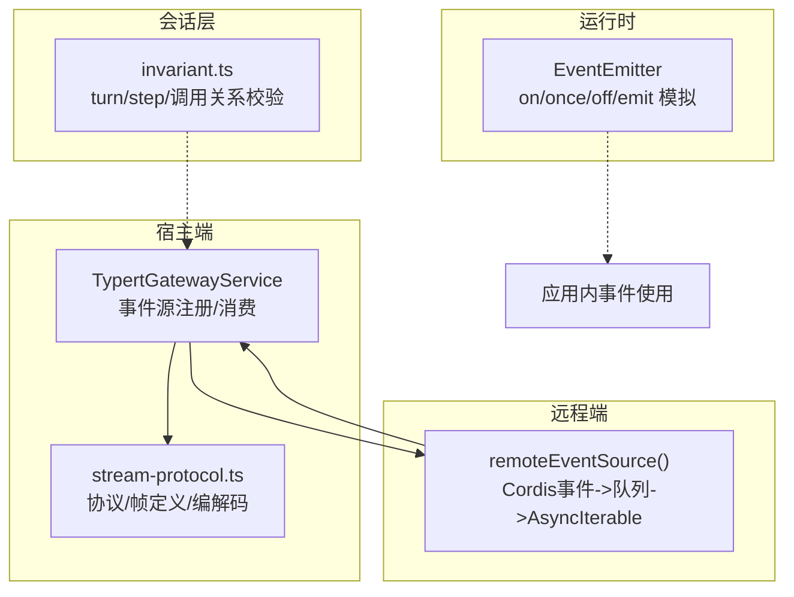
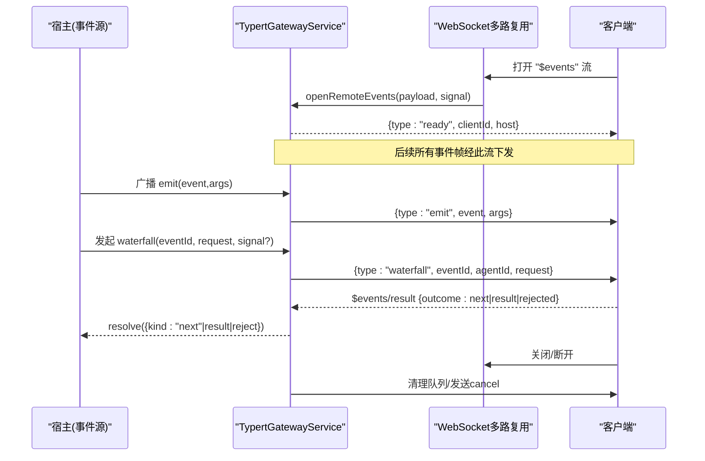
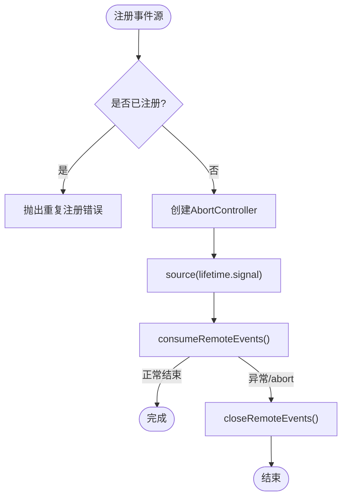
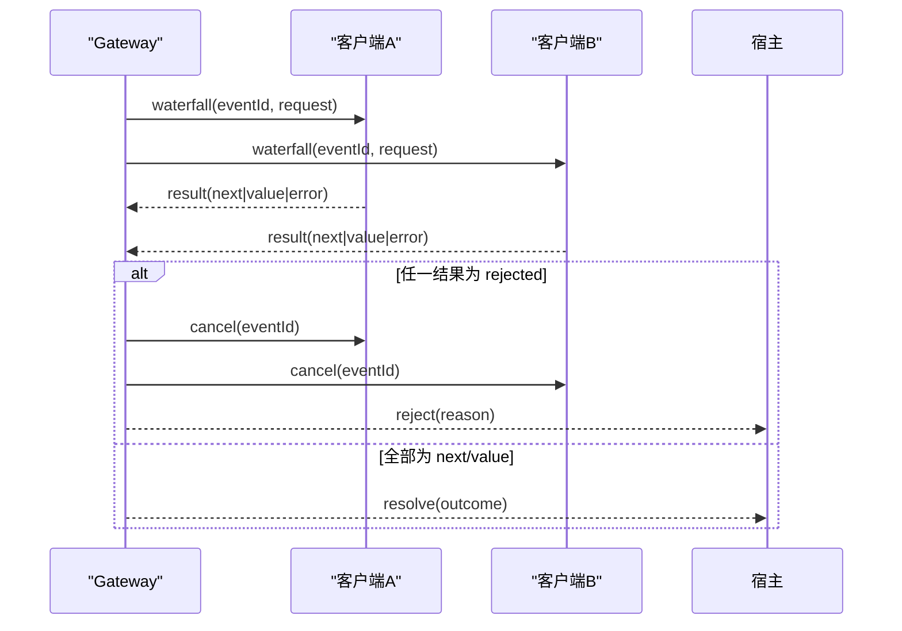
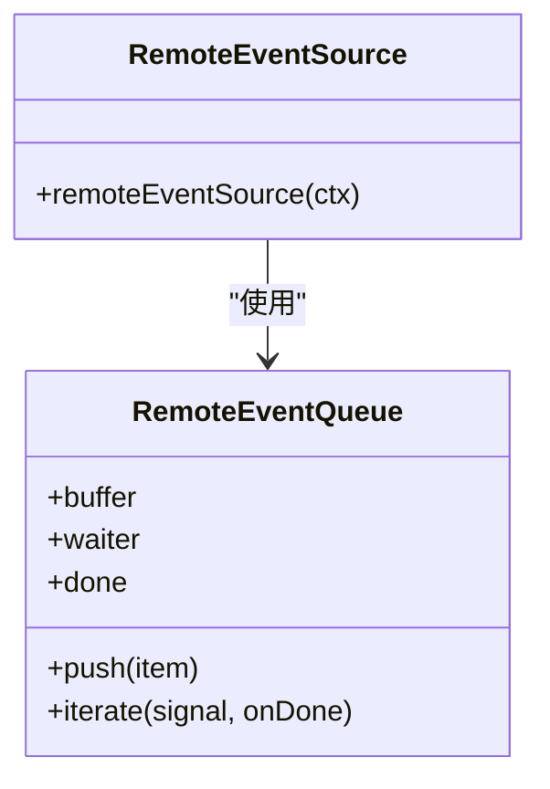
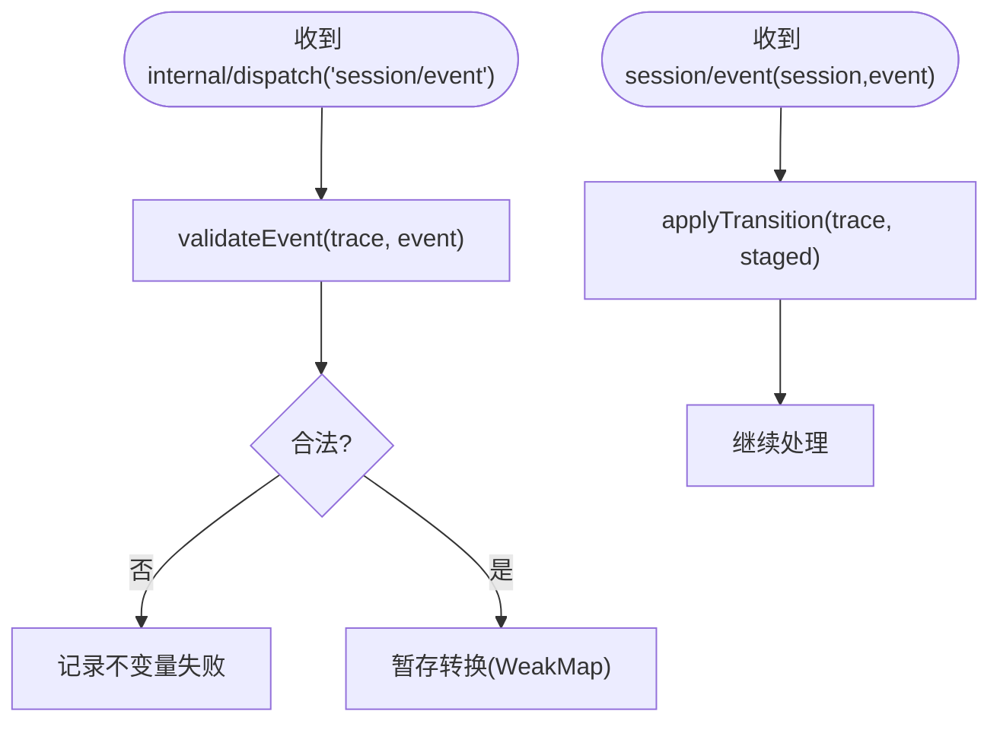
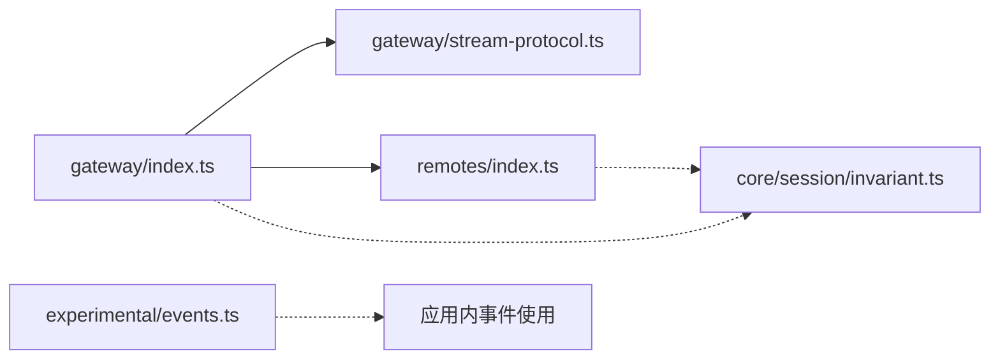

# 事件处理器开发

<cite>
**本文引用的文件**
- [packages/api/gateway/src/index.ts](file://packages/api/gateway/src/index.ts)
- [packages/api/gateway/src/stream-protocol.ts](file://packages/api/gateway/src/stream-protocol.ts)
- [packages/api/remotes/src/index.ts](file://packages/api/remotes/src/index.ts)
- [packages/core/session/src/invariant.ts](file://packages/core/session/src/invariant.ts)
- [packages/experimental/webworker-runtime/src/node/builtin_modules/implemented/events.ts](file://packages/experimental/webworker-runtime/src/node/builtin_modules/implemented/events.ts)
</cite>

## 目录
1. [简介](#简介)
2. [项目结构](#项目结构)
3. [核心组件](#核心组件)
4. [架构总览](#架构总览)
5. [详细组件分析](#详细组件分析)
6. [依赖关系分析](#依赖关系分析)
7. [性能考量](#性能考量)
8. [故障排查指南](#故障排查指南)
9. [结论](#结论)
10. [附录](#附录)

## 简介
本文件面向 DeepSeek Harness 的事件处理器开发者，系统性阐述事件处理器的注册机制与生命周期管理，覆盖同步、异步与流式三种处理器模式；说明错误处理、重试与超时控制策略；提供测试与调试建议；并通过具体代码路径示例展示如何编写高质量的事件处理器。文档同时给出架构图、时序图与流程图，帮助读者快速理解并落地实现。

## 项目结构
围绕事件处理的核心位于 API Gateway 层（负责事件流的建立、分发与结果回传）、Remote 侧（将宿主事件桥接到远程客户端）以及会话不变量校验（保障事件顺序与关系正确性）。此外，WebWorker 运行时提供了最小化的 EventEmitter 以兼容 Node events 行为。

图表来源
- [packages/api/gateway/src/index.ts:236-432](file://packages/api/gateway/src/index.ts#L236-L432)
- [packages/api/gateway/src/stream-protocol.ts:1-120](file://packages/api/gateway/src/stream-protocol.ts#L1-L120)
- [packages/api/remotes/src/index.ts:44-84](file://packages/api/remotes/src/index.ts#L44-L84)
- [packages/core/session/src/invariant.ts:54-165](file://packages/core/session/src/invariant.ts#L54-L165)
- [packages/experimental/webworker-runtime/src/node/builtin_modules/implemented/events.ts:16-91](file://packages/experimental/webworker-runtime/src/node/builtin_modules/implemented/events.ts#L16-L91)

章节来源
- [packages/api/gateway/src/index.ts:173-234](file://packages/api/gateway/src/index.ts#L173-L234)
- [packages/api/gateway/src/stream-protocol.ts:1-120](file://packages/api/gateway/src/stream-protocol.ts#L1-L120)
- [packages/api/remotes/src/index.ts:44-84](file://packages/api/remotes/src/index.ts#L44-L84)
- [packages/core/session/src/invariant.ts:54-165](file://packages/core/session/src/invariant.ts#L54-L165)
- [packages/experimental/webworker-runtime/src/node/builtin_modules/implemented/events.ts:16-91](file://packages/experimental/webworker-runtime/src/node/builtin_modules/implemented/events.ts#L16-L91)

## 核心组件
- TypertGatewayService：提供 registerRemoteEvents 注册唯一的应用级事件源，维护客户端连接、待处理事件、取消与完成语义，并通过 WebSocket 多路复用暴露事件流。
- stream-protocol.ts：定义事件流协议帧（ready/emit/waterfall/cancel）、结果回传格式、请求投影与拒绝序列化/反序列化、消息解析与校验。
- remoteEventSource（Remote 侧）：订阅 Cordis 上下文事件，将 emit 类型事件推入队列，将 waterfall 类型事件通过上下文转发到宿主，形成 AsyncIterable 供客户端消费。
- invariant.ts：对会话事件日志进行强一致性校验，确保 turn/step 嵌套、工具调用成对出现等关系约束。
- EventEmitter（WebWorker 运行时）：提供 on/once/prependListener/off/removeListener/emit 的最小实现，保证监听器顺序与 once 的自删除语义。

章节来源
- [packages/api/gateway/src/index.ts:236-432](file://packages/api/gateway/src/index.ts#L236-L432)
- [packages/api/gateway/src/stream-protocol.ts:1-120](file://packages/api/gateway/src/stream-protocol.ts#L1-L120)
- [packages/api/remotes/src/index.ts:44-84](file://packages/api/remotes/src/index.ts#L44-L84)
- [packages/core/session/src/invariant.ts:54-165](file://packages/core/session/src/invariant.ts#L54-L165)
- [packages/experimental/webworker-runtime/src/node/builtin_modules/implemented/events.ts:16-91](file://packages/experimental/webworker-runtime/src/node/builtin_modules/implemented/events.ts#L16-L91)

## 架构总览
下图展示了“宿主事件源 -> Gateway -> 客户端”的端到端流程，包括事件流打开、事件广播、作用域事件瀑布流、结果回传与取消。

图表来源
- [packages/api/gateway/src/index.ts:388-432](file://packages/api/gateway/src/index.ts#L388-L432)
- [packages/api/gateway/src/index.ts:434-585](file://packages/api/gateway/src/index.ts#L434-L585)
- [packages/api/gateway/src/stream-protocol.ts:1-120](file://packages/api/gateway/src/stream-protocol.ts#L1-L120)

章节来源
- [packages/api/gateway/src/index.ts:388-585](file://packages/api/gateway/src/index.ts#L388-L585)
- [packages/api/gateway/src/stream-protocol.ts:1-120](file://packages/api/gateway/src/stream-protocol.ts#L1-L120)

## 详细组件分析

### 事件源注册与生命周期管理
- 注册入口：registerRemoteEvents(source, host)。仅允许单一事件源注册，重复注册会抛错。内部创建 AbortController 作为生命周期信号，启动 consumeRemoteEvents 消费源产生的事件。
- 生命周期：
  - 启动：source(signal) 返回 AsyncIterable，Gateway 持续迭代；若源意外结束且未因 abort 结束，则抛出错误并关闭。
  - 移除：返回的 dispose 函数可安全注销事件源，触发 lifetime.abort(error)，并关闭所有活跃客户端流。
  - 异常传播：consumeRemoteEvents 捕获错误后，关闭远端事件并中止生命周期。
- 客户端连接：openRemoteEvents 校验空参数 payload，分配 clientId，建立队列，发送 ready 帧，随后通过队列迭代推送事件帧；连接关闭时清理队列与待处理事件。

图表来源
- [packages/api/gateway/src/index.ts:236-268](file://packages/api/gateway/src/index.ts#L236-L268)
- [packages/api/gateway/src/index.ts:434-449](file://packages/api/gateway/src/index.ts#L434-L449)

章节来源
- [packages/api/gateway/src/index.ts:236-268](file://packages/api/gateway/src/index.ts#L236-L268)
- [packages/api/gateway/src/index.ts:434-449](file://packages/api/gateway/src/index.ts#L434-L449)

### 事件分发与结果回传
- 广播事件：broadcastRemoteEvent 将 emit 事件帧推送到所有客户端队列。
- 作用域事件瀑布流：startRemoteEvent 校验上下文与作用域 Agent，投影请求（去除 agent/signal），生成 eventId，向所有客户端投递 waterfall 帧；监听客户端结果或取消。
- 结果回传：receiveRemoteEventResult 解析客户端 $events/result，根据 outcome 决定 settle（成功/继续）或 cancel（拒绝），并通知宿主端 source.resolve/reject。
- 取消与清理：finishRemoteEvent 释放信号与上下文，向所有相关客户端发送 cancel 帧；removeRemoteEventClient 在连接关闭时清理队列与待处理事件。

图表来源
- [packages/api/gateway/src/index.ts:461-585](file://packages/api/gateway/src/index.ts#L461-L585)
- [packages/api/gateway/src/stream-protocol.ts:86-137](file://packages/api/gateway/src/stream-protocol.ts#L86-L137)

章节来源
- [packages/api/gateway/src/index.ts:461-585](file://packages/api/gateway/src/index.ts#L461-L585)
- [packages/api/gateway/src/stream-protocol.ts:86-137](file://packages/api/gateway/src/stream-protocol.ts#L86-L137)

### Remote 侧事件桥接（异步/流式）
- 事件源工厂：remoteEventSource(ctx) 返回一个以 signal 为生命周期的 AsyncIterable。内部维护 RemoteEventQueue，将 Cordis 的 emit 事件推入队列，将 waterfall 事件通过上下文转发到宿主。
- 队列迭代：iterate 支持 pull-driven 消费，配合 AbortSignal 实现取消；当源被移除时，清理所有监听器。

图表来源
- [packages/api/remotes/src/index.ts:44-84](file://packages/api/remotes/src/index.ts#L44-L84)

章节来源
- [packages/api/remotes/src/index.ts:44-84](file://packages/api/remotes/src/index.ts#L44-L84)

### 会话事件不变量校验
- 目的：确保 session/event 序列满足 turn/step 嵌套、工具调用成对出现等关系约束，避免乱序或非法状态。
- 机制：在 internal/dispatch 阶段预验证事件并暂存转换；在 session/event 提交时再应用转换，保证原子性与一致性。

图表来源
- [packages/core/session/src/invariant.ts:54-165](file://packages/core/session/src/invariant.ts#L54-L165)
- [packages/core/session/src/invariant.ts:220-241](file://packages/core/session/src/invariant.ts#L220-L241)

章节来源
- [packages/core/session/src/invariant.ts:54-165](file://packages/core/session/src/invariant.ts#L54-L165)
- [packages/core/session/src/invariant.ts:220-241](file://packages/core/session/src/invariant.ts#L220-L241)

### 同步/异步/流式处理器模式
- 同步处理器：直接响应 emit 事件，无返回值或返回简单值；适合轻量副作用（如日志、指标上报）。
- 异步处理器：await 外部 I/O 或计算，注意超时与取消；可通过 AbortSignal 感知取消。
- 流式处理器：返回 AsyncIterable，按批次产出数据；需保证有序、可中断、可恢复（必要时持久化进度）。

最佳实践要点
- 明确处理器职责边界，避免阻塞事件循环。
- 对长耗时操作使用流式输出，降低内存峰值。
- 对关键路径增加幂等与去重保护。

章节来源
- [packages/api/gateway/src/index.ts:434-459](file://packages/api/gateway/src/index.ts#L434-L459)
- [packages/api/gateway/src/stream-protocol.ts:145-172](file://packages/api/gateway/src/stream-protocol.ts#L145-L172)

### 错误处理、重试与超时控制
- 错误分类：
  - 协议/参数错误：arguments-invalid、service-unavailable 等，由 Gateway 抛出。
  - 业务拒绝：客户端通过 $events/result 返回 rejected，携带 name/message/code/details。
  - 取消：AbortSignal 触发或显式 cancel 帧。
- 重试策略：
  - 建议在业务层实现指数退避重试，结合最大重试次数与抖动。
  - 对幂等操作可重试；非幂等需引入 idempotency key。
- 超时控制：
  - 使用 AbortSignal 统一控制取消；对网络/IO 设置超时并在超时后尽快释放资源。
  - 对长流式任务，定期检测信号并优雅退出。

章节来源
- [packages/api/gateway/src/index.ts:127-154](file://packages/api/gateway/src/index.ts#L127-L154)
- [packages/api/gateway/src/stream-protocol.ts:174-204](file://packages/api/gateway/src/stream-protocol.ts#L174-L204)
- [packages/api/gateway/src/index.ts:493-523](file://packages/api/gateway/src/index.ts#L493-L523)

### 测试策略与调试技巧
- 单元测试：
  - 针对事件处理器分别覆盖同步、异步、流式分支。
  - 使用虚拟时间/定时器控制超时与重试节奏。
  - 断言事件顺序与不变量（借助 invariant 逻辑）。
- 集成测试：
  - 构造 Gateway 与 Remote 两端，验证 ready/emit/waterfall/cancel 全链路。
  - 注入错误场景（无效参数、服务不可用、连接断开）。
- 调试技巧：
  - 打印事件 ID、客户端 ID、Agent 身份，便于追踪跨进程事件。
  - 对长时间运行的流式处理器，采样输出进度与背压情况。
  - 利用 AbortSignal 的 reason 定位取消原因。

章节来源
- [packages/api/gateway/src/index.ts:388-432](file://packages/api/gateway/src/index.ts#L388-L432)
- [packages/api/gateway/src/stream-protocol.ts:101-137](file://packages/api/gateway/src/stream-protocol.ts#L101-L137)

### 代码示例（以路径引用代替具体代码）
- 注册事件源与生命周期管理
  - [packages/api/gateway/src/index.ts:236-268](file://packages/api/gateway/src/index.ts#L236-L268)
- 打开事件流与帧协议
  - [packages/api/gateway/src/index.ts:388-432](file://packages/api/gateway/src/index.ts#L388-L432)
  - [packages/api/gateway/src/stream-protocol.ts:1-120](file://packages/api/gateway/src/stream-protocol.ts#L1-L120)
- 作用域事件瀑布流与结果回传
  - [packages/api/gateway/src/index.ts:461-585](file://packages/api/gateway/src/index.ts#L461-L585)
  - [packages/api/gateway/src/stream-protocol.ts:86-137](file://packages/api/gateway/src/stream-protocol.ts#L86-L137)
- Remote 侧事件桥接
  - [packages/api/remotes/src/index.ts:44-84](file://packages/api/remotes/src/index.ts#L44-L84)
- 会话事件不变量校验
  - [packages/core/session/src/invariant.ts:54-165](file://packages/core/session/src/invariant.ts#L54-L165)
  - [packages/core/session/src/invariant.ts:220-241](file://packages/core/session/src/invariant.ts#L220-L241)
- WebWorker 事件发射器（用于本地/沙箱环境）
  - [packages/experimental/webworker-runtime/src/node/builtin_modules/implemented/events.ts:16-91](file://packages/experimental/webworker-runtime/src/node/builtin_modules/implemented/events.ts#L16-L91)

## 依赖关系分析
- 耦合点：
  - Gateway 依赖 stream-protocol 定义的帧与校验函数。
  - Remote 侧依赖 Cordis 上下文与事件系统，将宿主事件桥接为 AsyncIterable。
  - 会话不变量模块与事件发布管线耦合，确保事件序列一致。
- 外部依赖：
  - WebSocket 多路复用（Gateway 内部实现）。
  - AbortSignal 用于统一取消与超时控制。
- 潜在风险：
  - 事件源重复注册导致状态混乱（已通过守卫阻止）。
  - 客户端连接异常导致待处理事件泄漏（已在关闭路径清理）。

图表来源
- [packages/api/gateway/src/index.ts:1-70](file://packages/api/gateway/src/index.ts#L1-L70)
- [packages/api/gateway/src/stream-protocol.ts:1-120](file://packages/api/gateway/src/stream-protocol.ts#L1-L120)
- [packages/api/remotes/src/index.ts:44-84](file://packages/api/remotes/src/index.ts#L44-L84)
- [packages/core/session/src/invariant.ts:54-165](file://packages/core/session/src/invariant.ts#L54-L165)
- [packages/experimental/webworker-runtime/src/node/builtin_modules/implemented/events.ts:16-91](file://packages/experimental/webworker-runtime/src/node/builtin_modules/implemented/events.ts#L16-L91)

章节来源
- [packages/api/gateway/src/index.ts:1-70](file://packages/api/gateway/src/index.ts#L1-L70)
- [packages/api/gateway/src/stream-protocol.ts:1-120](file://packages/api/gateway/src/stream-protocol.ts#L1-L120)
- [packages/api/remotes/src/index.ts:44-84](file://packages/api/remotes/src/index.ts#L44-L84)
- [packages/core/session/src/invariant.ts:54-165](file://packages/core/session/src/invariant.ts#L54-L165)
- [packages/experimental/webworker-runtime/src/node/builtin_modules/implemented/events.ts:16-91](file://packages/experimental/webworker-runtime/src/node/builtin_modules/implemented/events.ts#L16-L91)

## 性能考量
- 背压与缓冲：
  - 客户端队列应限制大小，避免内存膨胀；必要时丢弃低优先级事件或降级。
- 并发与吞吐：
  - 避免在事件处理器中执行阻塞 I/O；使用异步与流式输出提升吞吐。
- 心跳与保活：
  - Gateway 配置了 WebSocket 心跳间隔，防止空闲连接被中间设备回收。
- 资源释放：
  - 及时移除监听器、关闭流、释放上下文 effect，避免泄漏。

章节来源
- [packages/api/gateway/src/index.ts:116-124](file://packages/api/gateway/src/index.ts#L116-L124)
- [packages/api/gateway/src/index.ts:209-233](file://packages/api/gateway/src/index.ts#L209-L233)

## 故障排查指南
- 常见问题
  - 重复注册事件源：检查是否多次调用 registerRemoteEvents。
  - 参数无效：确认打开事件流的 payload 为空对象 args。
  - 服务不可用：确认事件源已注册且未被移除。
  - 作用域事件上下文缺失：确保 scoped 事件的上下文包含有效 Agent 身份。
  - 连接断开：检查客户端是否正确关闭并清理队列。
- 定位方法
  - 查看错误码与字段：TypertGatewayError.code/field 有助于快速定位问题。
  - 跟踪事件 ID 与客户端 ID：在 waterfall/cancel/result 中保持一致性。
  - 使用不变量校验：关注 session 事件顺序与工具调用配对。

章节来源
- [packages/api/gateway/src/index.ts:127-154](file://packages/api/gateway/src/index.ts#L127-L154)
- [packages/api/gateway/src/index.ts:388-432](file://packages/api/gateway/src/index.ts#L388-L432)
- [packages/api/gateway/src/stream-protocol.ts:101-137](file://packages/api/gateway/src/stream-protocol.ts#L101-L137)
- [packages/core/session/src/invariant.ts:54-165](file://packages/core/session/src/invariant.ts#L54-L165)

## 结论
DeepSeek Harness 的事件处理器体系以 Gateway 为核心，通过严格的协议帧与生命周期管理，实现了跨进程/跨边界的事件分发与结果回传。开发者应遵循同步/异步/流式三种模式的约定，结合错误处理、重试与超时控制，构建健壮、高性能的事件处理器。借助不变量校验与完善的测试策略，可有效保障事件处理的正确性与可维护性。

## 附录
- 术语
  - 事件源：宿主端产生事件的唯一入口。
  - 事件流：Gateway 提供的双向通道，承载事件与结果。
  - 瀑布流：作用域事件的一次性请求-响应链。
  - 不变量：对事件序列关系的强约束。
- 参考路径
  - 事件源注册与生命周期：[packages/api/gateway/src/index.ts:236-268](file://packages/api/gateway/src/index.ts#L236-L268)
  - 事件流协议与帧：[packages/api/gateway/src/stream-protocol.ts:1-120](file://packages/api/gateway/src/stream-protocol.ts#L1-L120)
  - 作用域事件与结果回传：[packages/api/gateway/src/index.ts:461-585](file://packages/api/gateway/src/index.ts#L461-L585)
  - Remote 侧桥接：[packages/api/remotes/src/index.ts:44-84](file://packages/api/remotes/src/index.ts#L44-L84)
  - 会话不变量：[packages/core/session/src/invariant.ts:54-165](file://packages/core/session/src/invariant.ts#L54-L165)
  - WebWorker 事件发射器：[packages/experimental/webworker-runtime/src/node/builtin_modules/implemented/events.ts:16-91](file://packages/experimental/webworker-runtime/src/node/builtin_modules/implemented/events.ts#L16-L91)