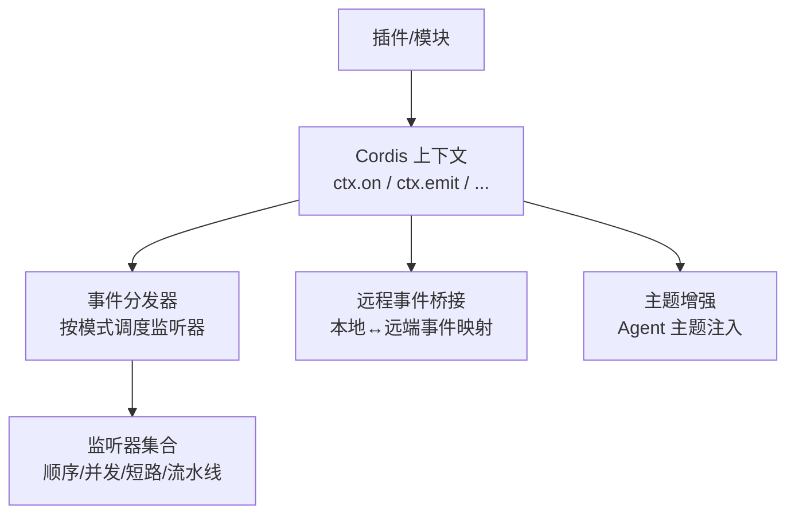
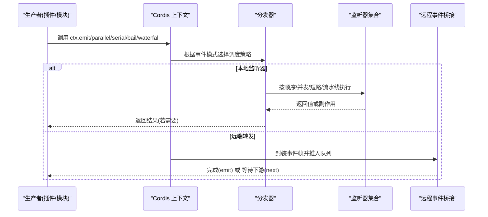
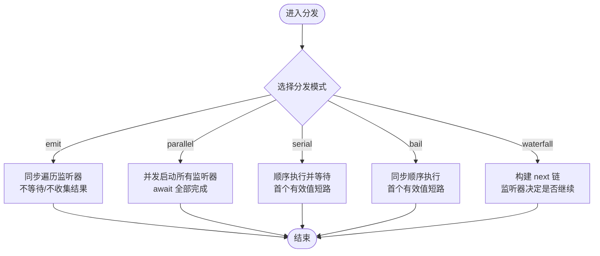
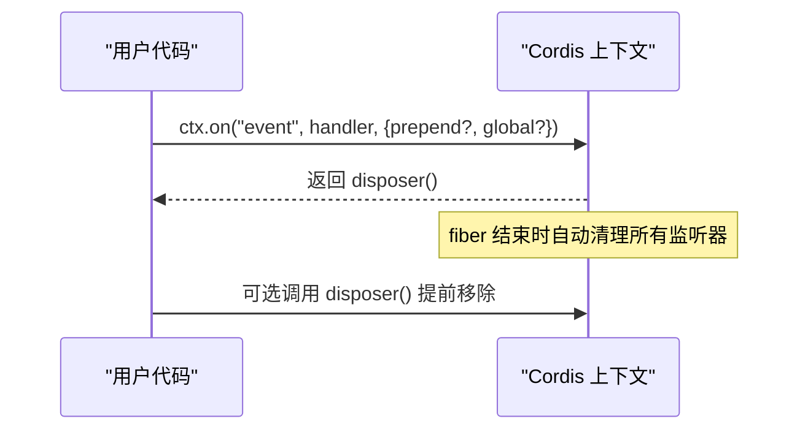
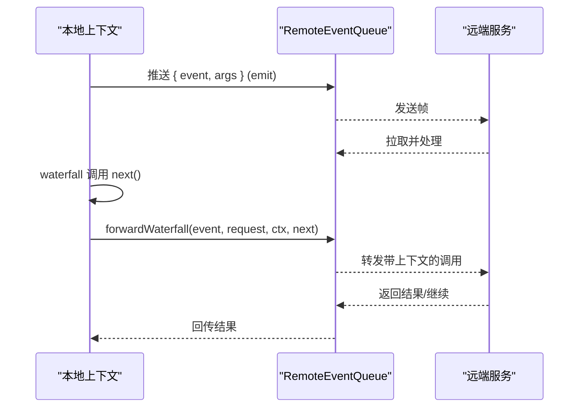
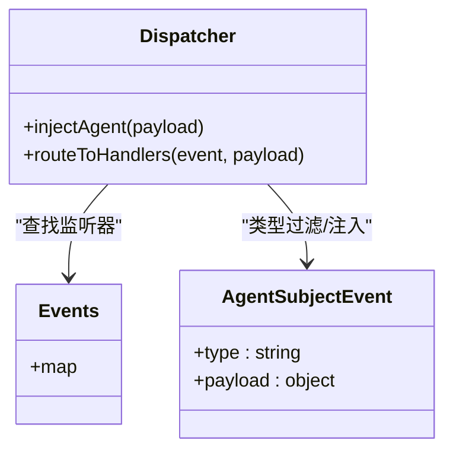
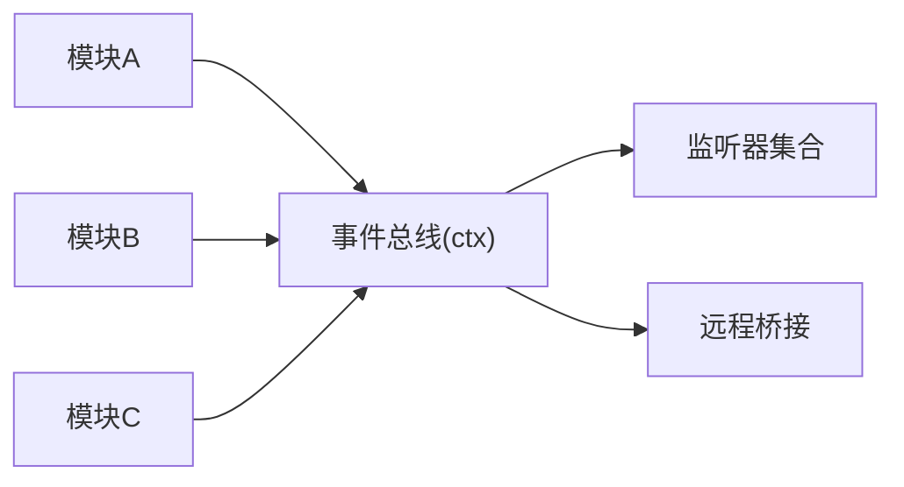

# 事件总线实现

<cite>
**本文引用的文件**
- [docs/cordis-api/events.md](file://docs/cordis-api/events.md)
- [docs/event-producer-consumer.md](file://docs/event-producer-consumer.md)
- [packages/api/remotes/src/index.ts](file://packages/api/remotes/src/index.ts)
- [packages/core/agent/src/dispatch.ts](file://packages/core/agent/src/dispatch.ts)
- [docs/cordis-tutorial/04-events.md](file://docs/cordis-tutorial/04-events.md)
- [docs/user/develop/framework/events.zh.md](file://docs/user/develop/framework/events.zh.md)
</cite>

## 目录
1. [简介](#简介)
2. [项目结构](#项目结构)
3. [核心组件](#核心组件)
4. [架构总览](#架构总览)
5. [详细组件分析](#详细组件分析)
6. [依赖关系分析](#依赖关系分析)
7. [性能考量](#性能考量)
8. [故障排查指南](#故障排查指南)
9. [结论](#结论)
10. [附录](#附录)

## 简介
本文件面向DeepSeek Harness的事件总线实现，聚焦于基于Cordis上下文的事件机制。文档围绕生产者-消费者模式、事件的发布与订阅、路由与分发、五种分发模式（emit、parallel、serial、bail、waterfall）、监听器的注册/注销/生命周期管理、以及扩展点与自定义处理器开发进行系统化说明，并给出可落地的实践建议与排障指引。

## 项目结构
事件总线在项目中以“声明 + 分发”的方式组织：
- 事件声明与API契约：由Cordis上下文提供统一的事件API（ctx.on/once/emit/parallel/serial/bail/waterfall），并在文档中生成类型化参考。
- 事件矩阵：通过自动生成文档维护各子系统对事件的声明、派发与监听关系，便于理解跨包耦合。
- 运行时桥接：远程事件源将本地事件转发到远端，或把远端事件映射为本地事件流，保持跨进程一致性。
- 主题增强：针对Agent主题的事件在派发时注入主题信息，确保调用方与接收方的作用域一致。

图表来源
- [docs/cordis-api/events.md:8-123](file://docs/cordis-api/events.md#L8-L123)
- [packages/api/remotes/src/index.ts:44-78](file://packages/api/remotes/src/index.ts#L44-L78)
- [packages/core/agent/src/dispatch.ts:20-47](file://packages/core/agent/src/dispatch.ts#L20-L47)

章节来源
- [docs/cordis-api/events.md:8-123](file://docs/cordis-api/events.md#L8-L123)
- [docs/event-producer-consumer.md:8-74](file://docs/event-producer-consumer.md#L8-L74)

## 核心组件
- 上下文事件API：提供on/once/emit/parallel/serial/bail/waterfall等能力，所有方法均受类型系统约束，保证事件名与参数类型安全。
- 分发模式：每种模式定义监听器的执行语义（同步广播、并发等待、顺序短路、同步短路、中间件式流水线）。
- 事件矩阵：自动生成的表格列出每个事件的声明位置、派发方式、监听者，帮助定位事件流向。
- 远程事件桥接：将本地事件转换为远端队列消息，或将远端事件拉取为本地异步迭代流，支持emit与waterfall两种转发策略。
- Agent主题事件：对携带Agent主题的事件进行类型过滤与注入，避免误匹配零参或任意payload事件。

章节来源
- [docs/cordis-api/events.md:8-123](file://docs/cordis-api/events.md#L8-L123)
- [docs/event-producer-consumer.md:8-74](file://docs/event-producer-consumer.md#L8-L74)
- [packages/api/remotes/src/index.ts:44-78](file://packages/api/remotes/src/index.ts#L44-L78)
- [packages/core/agent/src/dispatch.ts:20-47](file://packages/core/agent/src/dispatch.ts#L20-L47)

## 架构总览
下图展示事件从生产到消费的关键路径，包括本地分发与远程桥接：

图表来源
- [docs/cordis-api/events.md:8-123](file://docs/cordis-api/events.md#L8-L123)
- [packages/api/remotes/src/index.ts:44-78](file://packages/api/remotes/src/index.ts#L44-L78)

## 详细组件分析

### 事件API与分发模式
- emit：同步广播，忽略监听器返回值，适合无副作用的日志、指标上报等场景。
- parallel：并发执行所有监听器，统一等待全部完成，适合独立且可并行的处理任务。
- serial：按注册顺序依次执行并等待，首个非空/非false/非undefined的返回值会短路后续监听器，适合优先级决策链。
- bail：serial的同步版本，用于快速短路。
- waterfall：中间件式流水线，最后一个参数是next回调；监听器必须调用next才能继续下游，不调用即拦截，适合请求/响应式的处理链。

图表来源
- [docs/cordis-api/events.md:8-123](file://docs/cordis-api/events.md#L8-L123)
- [docs/cordis-tutorial/04-events.md:80-92](file://docs/cordis-tutorial/04-events.md#L80-L92)

章节来源
- [docs/cordis-api/events.md:8-123](file://docs/cordis-api/events.md#L8-L123)
- [docs/cordis-tutorial/04-events.md:80-92](file://docs/cordis-tutorial/04-events.md#L80-L92)

### 监听器注册、注销与生命周期
- ctx.on(name, listener, options?)：在当前fiber下注册监听器，支持prepend和global选项；返回一个disposer函数，调用后可移除监听器。
- ctx.once(name, listener, options?)：一次性监听，首次触发后自动注销。
- 生命周期：监听器随当前fiber的生命周期自动清理，无需手动维护removeListener，降低内存泄漏风险。

图表来源
- [docs/cordis-api/events.md:125-187](file://docs/cordis-api/events.md#L125-L187)

章节来源
- [docs/cordis-api/events.md:125-187](file://docs/cordis-api/events.md#L125-L187)

### 远程事件桥接
- 本地事件→远端：将emit事件打包为帧推入队列，供远端消费；对于waterfall事件，通过forwardWaterfall将本地上下文与next传递到远端。
- 远端事件→本地：通过RemoteEventQueue迭代远端事件，驱动本地监听器执行。
- 作用域传播：waterfall模式下会提取载体对象的上下文，确保远端调用能访问到正确的Context与作用域。

图表来源
- [packages/api/remotes/src/index.ts:44-78](file://packages/api/remotes/src/index.ts#L44-L78)

章节来源
- [packages/api/remotes/src/index.ts:44-78](file://packages/api/remotes/src/index.ts#L44-L78)

### Agent主题事件增强
- 类型筛选：仅当事件签名满足“第一个参数为包含agent字段的有效载荷，且this为Scoped<Agent>”时，才视为Agent主题事件。
- 注入职责：派发侧会注入agent字段，确保主题与作用域键一致，避免误匹配零参或任意payload事件。
- 收益：提升类型安全与运行期稳定性，减少错误路由。

图表来源
- [packages/core/agent/src/dispatch.ts:20-47](file://packages/core/agent/src/dispatch.ts#L20-L47)

章节来源
- [packages/core/agent/src/dispatch.ts:20-47](file://packages/core/agent/src/dispatch.ts#L20-L47)

### 事件矩阵与子系统协作
- 事件矩阵文档列出了每个事件的声明位置、派发模式、派发者与监听者，体现多对多的复杂关系。
- 典型示例：
  - agent/pre-step 使用waterfall，多个子系统参与预处理。
  - session/flush 使用parallel，持久化与遥测并行写入。
  - tools/execute 使用waterfall，形成工具执行的完整处理链。

章节来源
- [docs/event-producer-consumer.md:8-74](file://docs/event-producer-consumer.md#L8-L74)

## 依赖关系分析
- 低耦合：事件作为解耦通信手段，模块间通过事件名与类型约定交互，避免直接引用。
- 集中式分发：所有事件通过Cordis上下文统一分发，便于监控、调试与测试。
- 远程依赖：通过桥接层将事件扩展到远端，保持接口一致性与透明性。
- 主题约束：Agent主题事件通过类型系统与运行时注入双重保障，降低误用风险。

图表来源
- [docs/cordis-api/events.md:8-123](file://docs/cordis-api/events.md#L8-L123)
- [packages/api/remotes/src/index.ts:44-78](file://packages/api/remotes/src/index.ts#L44-L78)

章节来源
- [docs/cordis-api/events.md:8-123](file://docs/cordis-api/events.md#L8-L123)
- [packages/api/remotes/src/index.ts:44-78](file://packages/api/remotes/src/index.ts#L44-L78)

## 性能考量
- emit：开销最小，适合高频、轻量、无副作用的通知。
- parallel：高吞吐但需关注资源竞争与背压，适用于独立任务并行。
- serial/bail：顺序执行带来确定性，短路可减少不必要计算，适合优先级决策。
- waterfall：中间件链会带来额外调用栈与next控制成本，应谨慎设计链路长度与复杂度。
- 远程桥接：网络往返与序列化带来延迟，建议批量与节流策略。

[本节为通用指导，不直接分析具体文件]

## 故障排查指南
- 监听器未触发：检查事件名是否一致、是否在同一上下文作用域内注册、是否被一次性监听器消耗。
- 串行短路异常：确认监听器返回值是否符合短路条件（非null/false/undefined）。
- 水流失效：确保waterfall监听器正确调用next，否则下游不会执行。
- 远程事件丢失：检查RemoteEventQueue是否仍在迭代、信号是否正确传递、上下文是否存活。
- 主题事件误匹配：确认事件签名与this类型符合Agent主题要求。

章节来源
- [docs/cordis-api/events.md:8-123](file://docs/cordis-api/events.md#L8-L123)
- [packages/api/remotes/src/index.ts:44-78](file://packages/api/remotes/src/index.ts#L44-L78)
- [packages/core/agent/src/dispatch.ts:20-47](file://packages/core/agent/src/dispatch.ts#L20-L47)

## 结论
DeepSeek Harness的事件总线以Cordis上下文为核心，提供类型安全、模式丰富、生命周期可控的事件机制。通过emit/parallel/serial/bail/waterfall五种模式，覆盖从简单通知到复杂流水线的多种场景；结合事件矩阵与远程桥接，实现了跨模块、跨进程的松耦合通信。遵循最佳实践与排障指南，可在保证性能与稳定性的前提下高效扩展系统行为。

[本节为总结性内容，不直接分析具体文件]

## 附录
- 快速上手：参考教程中的基本用法与事件模式示例，快速掌握ctx.on/ctx.emit及不同模式的调用方式。
- 参考文档：查阅事件API文档获取完整的类型签名与使用说明。
- 事件矩阵：通过自动生成的事件矩阵了解各子系统间的依赖关系与事件流向。

章节来源
- [docs/user/develop/framework/events.zh.md:1-77](file://docs/user/develop/framework/events.zh.md#L1-L77)
- [docs/cordis-api/events.md:8-123](file://docs/cordis-api/events.md#L8-L123)
- [docs/event-producer-consumer.md:8-74](file://docs/event-producer-consumer.md#L8-L74)