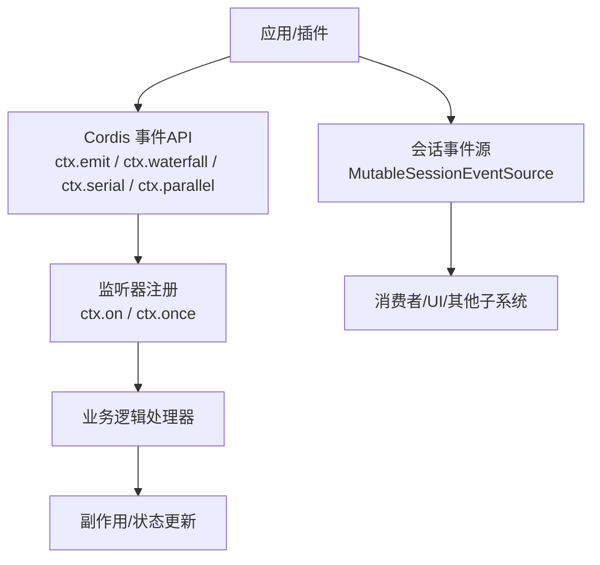
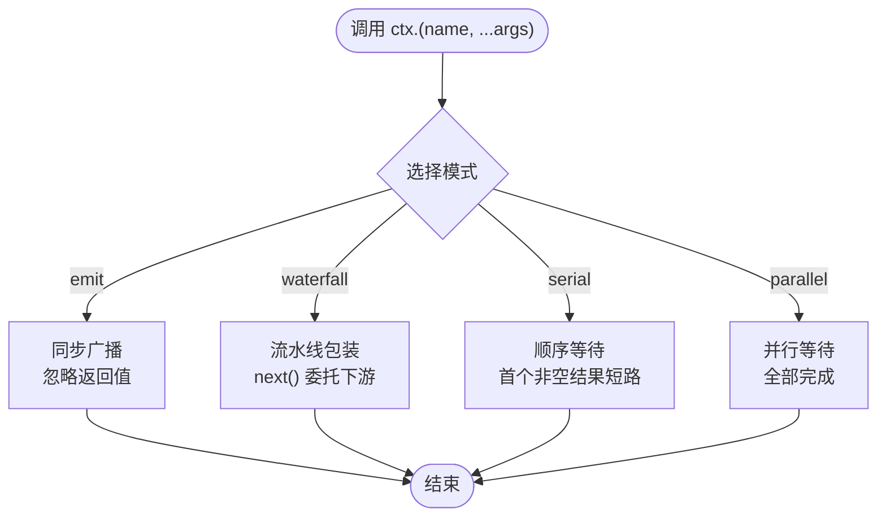
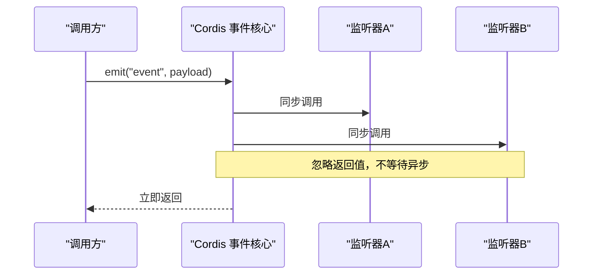
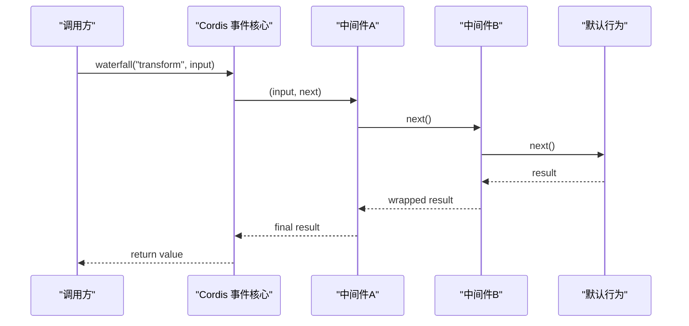
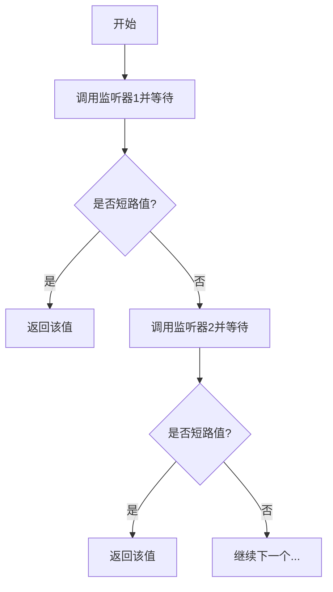
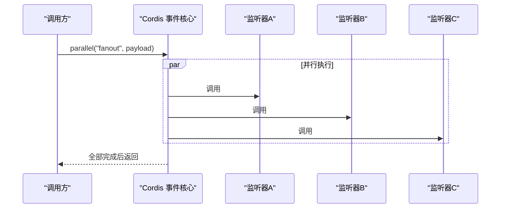
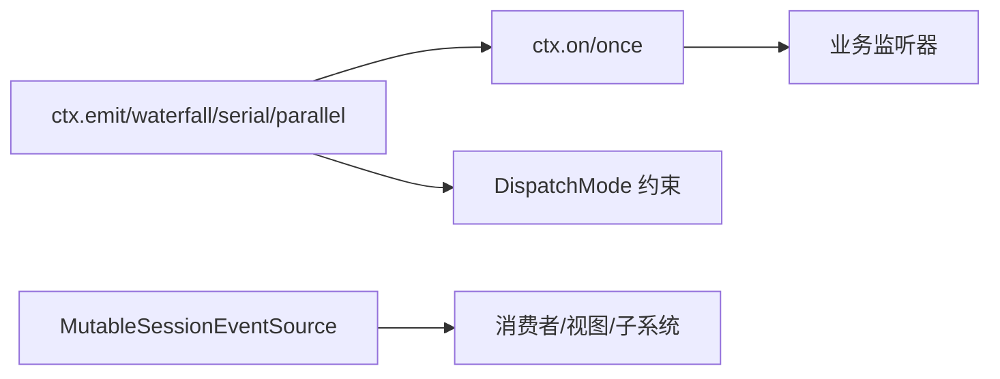

# 事件模式详解

<cite>
**本文引用的文件**
- [docs/cordis-primer.md](file://docs/cordis-primer.md)
- [docs/cordis-api/events.md](file://docs/cordis-api/events.md)
- [docs/user/develop/framework/events.zh.md](file://docs/user/develop/framework/events.zh.md)
- [packages/api/session-controller/src/client/contract/events.ts](file://packages/api/session-controller/src/client/contract/events.ts)
</cite>

## 目录
1. [简介](#简介)
2. [项目结构](#项目结构)
3. [核心组件](#核心组件)
4. [架构总览](#架构总览)
5. [详细组件分析](#详细组件分析)
6. [依赖关系分析](#依赖关系分析)
7. [性能考量](#性能考量)
8. [故障排查指南](#故障排查指南)
9. [结论](#结论)
10. [附录](#附录)

## 简介
本文件围绕 DeepSeek Harness（基于 Cordis）的事件系统，聚焦 emit、waterfall、serial、parallel 四种核心事件模式的实现原理与使用场景。文档从执行流程、性能特征、适用场景、组合与转换方式、错误处理、超时控制与重试机制等维度进行系统化说明，并通过流程图与时序图帮助读者快速掌握如何在不同业务需求下选择合适的模式。

## 项目结构
DeepSeek Harness 的事件能力由 Cordis 提供，并在 Harness 中通过上下文 ctx 暴露 emit、waterfall、serial、parallel、bail 等方法。事件声明与分发策略在文档中被生成并维护，确保事件契约与调用点一致。此外，会话侧的 MutableSessionEventSource 展示了事件窗口式发布订阅的实现思路，便于理解“流式事件”的组织方式。

图表来源
- [docs/cordis-api/events.md:8-123](file://docs/cordis-api/events.md#L8-L123)
- [docs/cordis-primer.md:15-35](file://docs/cordis-primer.md#L15-L35)
- [packages/api/session-controller/src/client/contract/events.ts:94-158](file://packages/api/session-controller/src/client/contract/events.ts#L94-L158)

章节来源
- [docs/cordis-api/events.md:8-123](file://docs/cordis-api/events.md#L8-L123)
- [docs/cordis-primer.md:15-35](file://docs/cordis-primer.md#L15-L35)
- [packages/api/session-controller/src/client/contract/events.ts:94-158](file://packages/api/session-controller/src/client/contract/events.ts#L94-L158)

## 核心组件
- 事件分发 API：ctx.emit、ctx.waterfall、ctx.serial、ctx.parallel、ctx.bail
- 监听器注册：ctx.on、ctx.once（支持 prepend/global 选项）
- 事件模式类型：DispatchMode = 'emit' | 'parallel' | 'serial' | 'bail' | 'waterfall'
- 会话事件窗口：MutableSessionEventSource 提供 replace/prepend/append 的同步发布

这些组件共同构成 Harness 的扩展点与松耦合通信机制。

章节来源
- [docs/cordis-api/events.md:8-123](file://docs/cordis-api/events.md#L8-L123)
- [docs/cordis-api/events.md:173-187](file://docs/cordis-api/events.md#L173-L187)
- [docs/cordis-api/events.md:189-207](file://docs/cordis-api/events.md#L189-L207)
- [packages/api/session-controller/src/client/contract/events.ts:94-158](file://packages/api/session-controller/src/client/contract/events.ts#L94-L158)

## 架构总览
下图展示四种核心模式在上下文中的位置与职责边界：

图表来源
- [docs/cordis-api/events.md:8-123](file://docs/cordis-api/events.md#L8-L123)
- [docs/cordis-primer.md:15-35](file://docs/cordis-primer.md#L15-L35)

## 详细组件分析

### emit — 广播模式
- 执行流程
  - 同步调用所有已注册的监听器
  - 不等待异步结果，忽略返回值
  - 按注册顺序触发
- 性能特征
  - 开销最小，适合纯通知型事件
  - 不适合需要聚合或决策的场景
- 适用场景
  - 日志记录、指标上报、UI 提示等非关键路径通知
- 示例参考
  - 参见：[用户开发指南-事件系统:27-39](file://docs/user/develop/framework/events.zh.md#L27-L39)

图表来源
- [docs/cordis-api/events.md:31-49](file://docs/cordis-api/events.md#L31-L49)
- [docs/user/develop/framework/events.zh.md:27-39](file://docs/user/develop/framework/events.zh.md#L27-L39)

章节来源
- [docs/cordis-api/events.md:31-49](file://docs/cordis-api/events.md#L31-L49)
- [docs/user/develop/framework/events.zh.md:27-39](file://docs/user/develop/framework/events.zh.md#L27-L39)

### waterfall — 瀑布式流水线
- 执行流程
  - 最后一个参数为 next 回调
  - 每个监听器可包装/修改数据后调用 next() 委托给下游
  - 不调用 next 即短路，阻止后续处理
- 性能特征
  - 串行链路，但允许中间件式装饰
  - 可通过短路优化避免不必要计算
- 适用场景
  - 请求/响应链路的预处理、校验、缓存命中、权限检查、结果改写
- 示例参考
  - 参见：[用户开发指南-事件系统:64-77](file://docs/user/develop/framework/events.zh.md#L64-L77)

图表来源
- [docs/cordis-api/events.md:97-123](file://docs/cordis-api/events.md#L97-L123)
- [docs/cordis-primer.md:29-35](file://docs/cordis-primer.md#L29-L35)
- [docs/user/develop/framework/events.zh.md:64-77](file://docs/user/develop/framework/events.zh.md#L64-L77)

章节来源
- [docs/cordis-api/events.md:97-123](file://docs/cordis-api/events.md#L97-L123)
- [docs/cordis-primer.md:29-35](file://docs/cordis-primer.md#L29-L35)
- [docs/user/develop/framework/events.zh.md:64-77](file://docs/user/develop/framework/events.zh.md#L64-L77)

### serial — 顺序等待
- 执行流程
  - 按注册顺序依次调用监听器并等待其 Promise
  - 遇到第一个非 null/false/undefined 的结果时停止后续执行
- 性能特征
  - 严格串行，延迟取决于最慢的前置步骤
  - 短路可显著降低整体耗时
- 适用场景
  - 配置合并、策略决策、优先级路由、多阶段初始化
- 示例参考
  - 参见：[用户开发指南-事件系统:56-62](file://docs/user/develop/framework/events.zh.md#L56-L62)

图表来源
- [docs/cordis-api/events.md:51-72](file://docs/cordis-api/events.md#L51-L72)
- [docs/user/develop/framework/events.zh.md:56-62](file://docs/user/develop/framework/events.zh.md#L56-L62)

章节来源
- [docs/cordis-api/events.md:51-72](file://docs/cordis-api/events.md#L51-L72)
- [docs/user/develop/framework/events.zh.md:56-62](file://docs/user/develop/framework/events.zh.md#L56-L62)

### parallel — 并行等待
- 执行流程
  - 同时启动所有监听器并等待全部完成
  - 不关心返回值（通常用于副作用）
- 性能特征
  - 吞吐高，受限于并发度与外部资源
  - 任一失败会传播异常，需在上层统一处理
- 适用场景
  - 多路独立任务（如并行拉取多个数据源、并发刷新缓存）
- 示例参考
  - 参见：[事件API文档:8-29](file://docs/cordis-api/events.md#L8-L29)

图表来源
- [docs/cordis-api/events.md:8-29](file://docs/cordis-api/events.md#L8-L29)

章节来源
- [docs/cordis-api/events.md:8-29](file://docs/cordis-api/events.md#L8-L29)

### 模式间的转换与组合
- 将 waterfall 视为“带 next 的串行”，可在每个节点内决定短路或透传
- 将 serial 视为“有短路语义的串行等待”，适合决策链
- 将 parallel 用于“无副作用聚合”的并发场景；若需聚合结果，可在上层收集
- 组合示例
  - 先用 waterfall 做前置校验与缓存命中，未命中再进入 serial 决策链
  - 在 serial 的某个阶段使用 parallel 并发获取多个依赖
- 注意
  - 不同模式对返回值和等待语义不同，混用时需明确契约
  - 避免在 waterfall 中引入长耗时阻塞，必要时拆分为 serial/parallel

章节来源
- [docs/cordis-primer.md:15-35](file://docs/cordis-primer.md#L15-L35)
- [docs/cordis-api/events.md:8-123](file://docs/cordis-api/events.md#L8-L123)

## 依赖关系分析
- 事件 API 与监听器注册解耦：通过 ctx.on/once 注册，ctx.* 方法分发
- 事件模式作为公共契约：通过 @mode 标记与生成目录保证一致性
- 会话事件源：MutableSessionEventSource 以不可变快照+增量变更的方式发布事件窗口，体现“流式事件”的组织形态

图表来源
- [docs/cordis-api/events.md:125-187](file://docs/cordis-api/events.md#L125-L187)
- [docs/cordis-api/events.md:189-207](file://docs/cordis-api/events.md#L189-L207)
- [packages/api/session-controller/src/client/contract/events.ts:94-158](file://packages/api/session-controller/src/client/contract/events.ts#L94-L158)

章节来源
- [docs/cordis-api/events.md:125-187](file://docs/cordis-api/events.md#L125-L187)
- [docs/cordis-api/events.md:189-207](file://docs/cordis-api/events.md#L189-L207)
- [packages/api/session-controller/src/client/contract/events.ts:94-158](file://packages/api/session-controller/src/client/contract/events.ts#L94-L158)

## 性能考量
- emit
  - 零等待、低开销；适合高频通知
  - 注意避免在监听器中执行重计算
- waterfall
  - 串行链路，建议将短路径判断前置
  - 合理使用短路减少下游调用
- serial
  - 严格串行，首段短路收益大
  - 适合优先级/策略链
- parallel
  - 并发度高，注意外部资源限流与背压
  - 失败传播需统一捕获与降级

章节来源
- [docs/cordis-api/events.md:8-123](file://docs/cordis-api/events.md#L8-L123)
- [docs/cordis-primer.md:15-35](file://docs/cordis-primer.md#L15-L35)

## 故障排查指南
- 常见问题
  - waterfall 未调用 next 导致流水线中断：确认监听器是否正确委托下游
  - serial 提前短路：检查监听器返回值是否为非空/非 false/非 undefined
  - parallel 部分失败：在上层统一捕获异常并进行降级或补偿
- 调试建议
  - 在 waterfall 各节点打印输入输出，定位短路点
  - 为 serial 的各阶段增加诊断日志，识别哪一阶段短路
  - 为 parallel 的监听器添加成功/失败计数，观察失败分布
- 超时与重试
  - 超时控制：在调用处包裹超时逻辑（例如 Promise.race），或在 waterfall/serial 的单个节点内实现超时
  - 重试机制：对可重试的错误在调用处封装重试策略（指数退避、最大次数）
  - 注意：事件框架本身不提供内置超时与重试，需在业务层实现

章节来源
- [docs/cordis-api/events.md:8-123](file://docs/cordis-api/events.md#L8-L123)
- [docs/cordis-primer.md:15-35](file://docs/cordis-primer.md#L15-L35)

## 结论
- emit 适用于轻量通知；waterfall 适用于可插拔的流水线；serial 适用于有序决策；parallel 适用于并发任务
- 通过合理组合与短路策略，可以在保证正确性的同时获得良好性能
- 超时与重试应在调用侧实现，结合日志与监控提升可观测性

## 附录
- 事件窗口发布订阅示例（会话侧）
  - 通过 replace/prepend/append 构建连续事件窗口，并以同步方式通知订阅者
  - 有助于理解“流式事件”的组织与消费模型

章节来源
- [packages/api/session-controller/src/client/contract/events.ts:94-158](file://packages/api/session-controller/src/client/contract/events.ts#L94-L158)