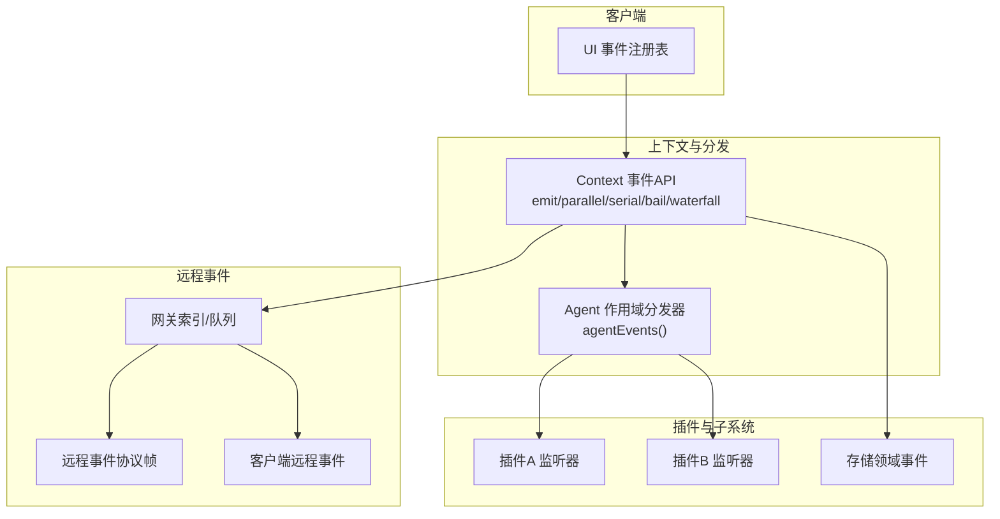
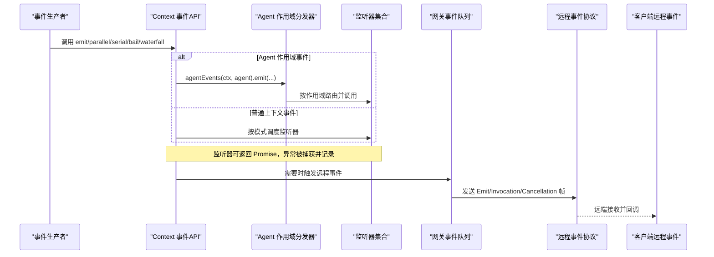
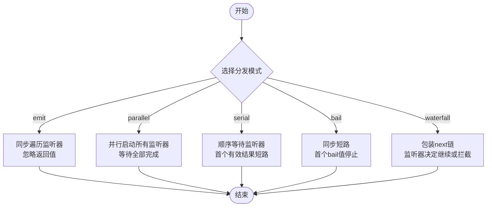
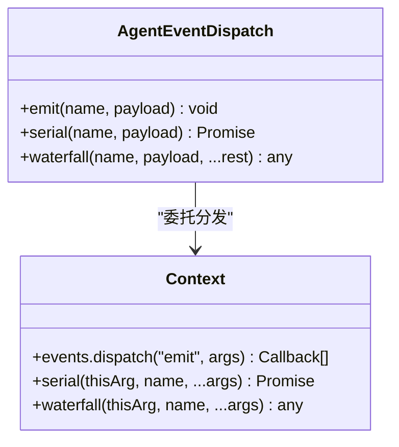
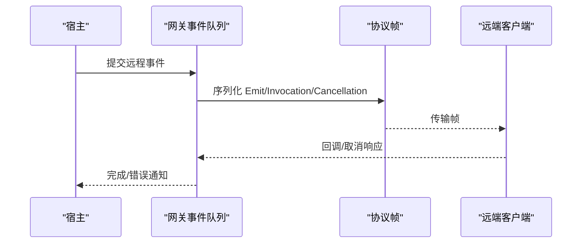
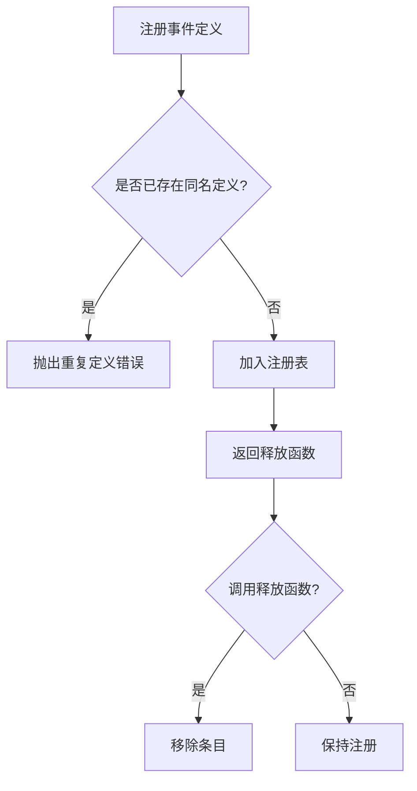
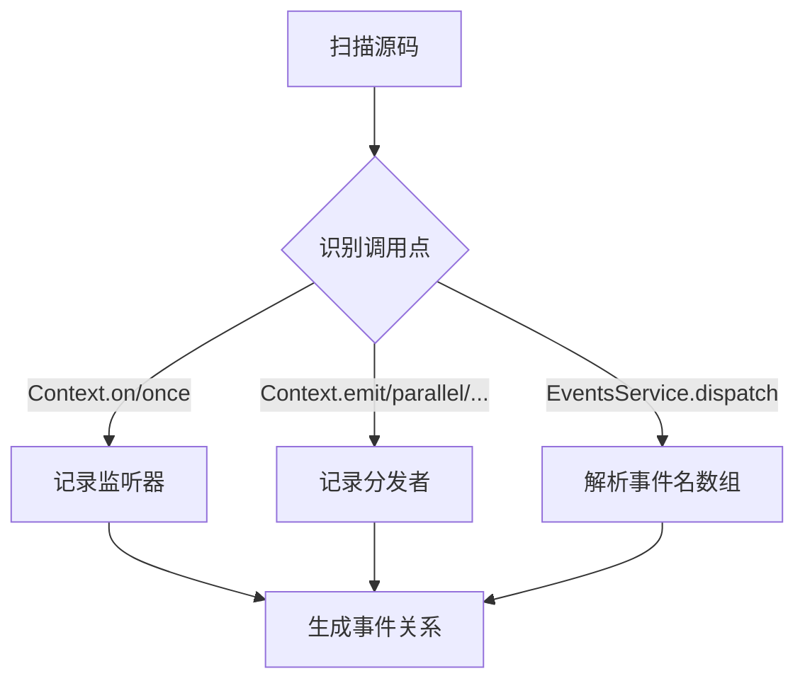
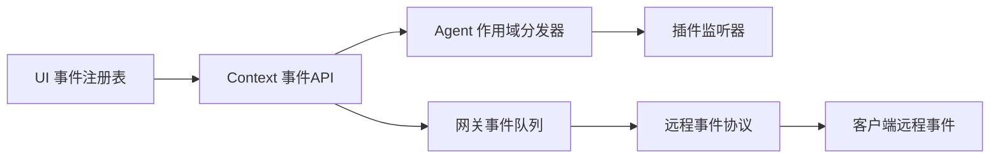

# 事件生命周期管理

<cite>
**本文引用的文件**
- [packages/core/agent/src/dispatch.ts](file://packages/core/agent/src/dispatch.ts)
- [docs/cordis-api/events.md](file://docs/cordis-api/events.md)
- [scripts/gen-doc-graphs.ts](file://scripts/gen-doc-graphs.ts)
- [packages/experimental/webworker-runtime/src/node/builtin_modules/implemented/events.ts](file://packages/experimental/webworker-runtime/src/node/builtin_modules/implemented/events.ts)
- [packages/experimental/webworker-runtime/tests/node/events.spec.ts](file://packages/experimental/webworker-runtime/tests/node/events.spec.ts)
- [packages/api/gateway/src/stream-protocol.ts](file://packages/api/gateway/src/stream-protocol.ts)
- [packages/api/gateway/src/index.ts](file://packages/api/gateway/src/index.ts)
- [packages/api/gateway/src/client/remote-events.ts](file://packages/api/gateway/src/client/remote-events.ts)
- [packages/client/ui-conversation/src/client/conversation/event-registry.ts](file://packages/client/ui-conversation/src/client/conversation/event-registry.ts)
- [packages/storage/storage-domain/src/events.ts](file://packages/storage/storage-domain/src/events.ts)
</cite>

## 目录
1. [简介](#简介)
2. [项目结构](#项目结构)
3. [核心组件](#核心组件)
4. [架构总览](#架构总览)
5. [详细组件分析](#详细组件分析)
6. [依赖关系分析](#依赖关系分析)
7. [性能考量](#性能考量)
8. [故障排查指南](#故障排查指南)
9. [结论](#结论)
10. [附录](#附录)

## 简介
本文件面向 DeepSeek Harness 的事件系统，系统化阐述事件的完整生命周期：创建、发布、路由、分发、处理与清理。重点说明监听器的注册、激活、暂停与销毁机制，解释事件在插件系统中的生命周期策略，并给出事件监控与调试的最佳实践，以及内存泄漏防护与资源清理方案。文档同时覆盖 Agent 作用域事件、Cordis 上下文事件、远程事件流与客户端事件注册等关键路径。

## 项目结构
DeepSeek Harness 的事件能力由多层面组成：
- 上下文事件 API：通过 Context 混入的 emit/parallel/serial/bail/waterfall/on/once 等方法提供统一的事件分发与订阅接口。
- Agent 作用域事件：为 Agent 主题事件注入作用域载体（Scoped<Agent>）与 payload.agent，确保事件路由与作用域一致。
- 远程事件：跨进程/跨端通过协议帧进行事件发射、调用与取消。
- 客户端事件注册：UI 层通过事件注册表管理视图与交互事件的生命周期。
- 存储领域事件：持久化子系统对外暴露的事件契约。
- 构建期分析：脚本对事件使用点进行静态分析，生成事件关系图以辅助治理。

图表来源
- [docs/cordis-api/events.md:8-123](file://docs/cordis-api/events.md#L8-L123)
- [packages/core/agent/src/dispatch.ts:98-149](file://packages/core/agent/src/dispatch.ts#L98-L149)
- [packages/api/gateway/src/stream-protocol.ts:21-66](file://packages/api/gateway/src/stream-protocol.ts#L21-L66)
- [packages/api/gateway/src/index.ts:889-920](file://packages/api/gateway/src/index.ts#L889-L920)
- [packages/api/gateway/src/client/remote-events.ts:62-120](file://packages/api/gateway/src/client/remote-events.ts#L62-L120)
- [packages/client/ui-conversation/src/client/conversation/event-registry.ts](file://packages/client/ui-conversation/src/client/conversation/event-registry.ts)

章节来源
- [docs/cordis-api/events.md:8-123](file://docs/cordis-api/events.md#L8-L123)
- [packages/core/agent/src/dispatch.ts:98-149](file://packages/core/agent/src/dispatch.ts#L98-L149)

## 核心组件
- 上下文事件 API：提供同步/异步并发/串行/水闸式分发模式，以及 on/once 订阅与 EventOptions（prepend/global）。
- Agent 作用域分发器：将 Scoped<Agent> 作为 thisArg 注入，自动注入 payload.agent，保证主题与作用域一致；提供 emit/serial/waterfall 三种分发语义。
- 远程事件协议：定义 RemoteEventEmitFrame/InvocationFrame/CancellationFrame 等帧类型，支撑跨进程事件发射与调用。
- 网关事件队列：维护待处理远程事件队列，协调远端事件投递与取消。
- 客户端远程事件：封装远端事件源打开、事件回调与上下文隔离。
- UI 事件注册表：管理视图相关事件定义与注册，支持重复定义拒绝与一次性释放。
- 存储领域事件：定义存储子系统的对外事件契约。

章节来源
- [docs/cordis-api/events.md:8-123](file://docs/cordis-api/events.md#L8-L123)
- [packages/core/agent/src/dispatch.ts:98-149](file://packages/core/agent/src/dispatch.ts#L98-L149)
- [packages/api/gateway/src/stream-protocol.ts:21-66](file://packages/api/gateway/src/stream-protocol.ts#L21-L66)
- [packages/api/gateway/src/index.ts:889-920](file://packages/api/gateway/src/index.ts#L889-L920)
- [packages/api/gateway/src/client/remote-events.ts:62-120](file://packages/api/gateway/src/client/remote-events.ts#L62-L120)
- [packages/client/ui-conversation/src/client/conversation/event-registry.ts](file://packages/client/ui-conversation/src/client/conversation/event-registry.ts)
- [packages/storage/storage-domain/src/events.ts](file://packages/storage/storage-domain/src/events.ts)

## 架构总览
下图展示事件从创建到清理的全链路：生产者通过上下文或 Agent 分发器发布事件，Cordis 根据分发模式调度监听器；Agent 作用域事件通过 Scoped<Agent> 路由到对应作用域；远程事件通过网关与协议帧转发；客户端通过注册表管理事件生命周期。

图表来源
- [docs/cordis-api/events.md:8-123](file://docs/cordis-api/events.md#L8-L123)
- [packages/core/agent/src/dispatch.ts:98-149](file://packages/core/agent/src/dispatch.ts#L98-L149)
- [packages/api/gateway/src/stream-protocol.ts:21-66](file://packages/api/gateway/src/stream-protocol.ts#L21-L66)
- [packages/api/gateway/src/index.ts:889-920](file://packages/api/gateway/src/index.ts#L889-L920)
- [packages/api/gateway/src/client/remote-events.ts:62-120](file://packages/api/gateway/src/client/remote-events.ts#L62-L120)

## 详细组件分析

### 上下文事件 API（Cordis）
- 分发模式
  - emit：同步执行，忽略返回值，适合通知型事件。
  - parallel：并发执行所有监听器，等待全部完成。
  - serial：顺序等待，首个非空结果即短路。
  - bail：同步短路，遇到第一个“bail”值停止。
  - waterfall：最后一个参数为 next 延续，监听器可决定是否继续链式调用。
- 订阅与选项
  - on/once：在当前 Fiber 下注册监听器，返回释放函数；once 首次调用后自动释放。
  - EventOptions：prepend 控制插入位置，global 跳过上下文过滤。

图表来源
- [docs/cordis-api/events.md:8-123](file://docs/cordis-api/events.md#L8-L123)

章节来源
- [docs/cordis-api/events.md:8-123](file://docs/cordis-api/events.md#L8-L123)

### Agent 作用域事件分发器
- 作用域绑定：通过 Scoped<Agent> 作为 thisArg，确保事件仅路由到该 Agent 作用域的监听器。
- 载荷注入：自动注入 payload.agent，避免调用方误覆盖主题。
- 分发语义：
  - emit：非否决性通知，逐个调用监听器，异常与拒绝均被捕获并记录，不阻塞后续监听器。
  - serial：顺序等待，用于需要短路控制的场景。
  - waterfall：基于 next 的中间件式组合，适合审批/拦截链。

图表来源
- [packages/core/agent/src/dispatch.ts:98-149](file://packages/core/agent/src/dispatch.ts#L98-L149)

章节来源
- [packages/core/agent/src/dispatch.ts:98-149](file://packages/core/agent/src/dispatch.ts#L98-L149)

### 远程事件协议与网关
- 协议帧
  - RemoteEventEmitFrame：远端发射事件。
  - RemoteEventInvocationFrame：远端方法调用。
  - RemoteEventCancellationFrame：取消调用。
- 网关队列：维护 PendingRemoteEvent，负责排队、重放与取消。
- 客户端远程事件：封装远端事件源打开、事件回调与上下文隔离。

图表来源
- [packages/api/gateway/src/stream-protocol.ts:21-66](file://packages/api/gateway/src/stream-protocol.ts#L21-L66)
- [packages/api/gateway/src/index.ts:889-920](file://packages/api/gateway/src/index.ts#L889-L920)
- [packages/api/gateway/src/client/remote-events.ts:62-120](file://packages/api/gateway/src/client/remote-events.ts#L62-L120)

章节来源
- [packages/api/gateway/src/stream-protocol.ts:21-66](file://packages/api/gateway/src/stream-protocol.ts#L21-L66)
- [packages/api/gateway/src/index.ts:889-920](file://packages/api/gateway/src/index.ts#L889-L920)
- [packages/api/gateway/src/client/remote-events.ts:62-120](file://packages/api/gateway/src/client/remote-events.ts#L62-L120)

### 客户端事件注册表
- 职责：管理 UI 相关事件定义与注册，防止重复定义，支持一次性释放。
- 行为：register(definition) 返回 dispose；再次注册同名定义会抛出错误；dispose 后条目清空。

图表来源
- [packages/client/ui-conversation/src/client/conversation/event-registry.ts](file://packages/client/ui-conversation/src/client/conversation/event-registry.ts)

章节来源
- [packages/client/ui-conversation/src/client/conversation/event-registry.ts](file://packages/client/ui-conversation/src/client/conversation/event-registry.ts)

### 存储领域事件
- 职责：定义存储子系统对外事件契约，供其他模块订阅存储变更或状态更新。
- 建议：事件命名遵循“领域.动作”约定，payload 仅包含必要字段，避免携带大对象。

章节来源
- [packages/storage/storage-domain/src/events.ts](file://packages/storage/storage-domain/src/events.ts)

### 构建期事件关系分析
- 目标：静态扫描代码中对事件 API 的使用，识别事件名、分发方式与调用点，生成事件关系图。
- 能力：识别 Context/Agent 分发器调用、EventsService.dispatch 的参数数组中的事件名，统计监听器与分发者归属包。

图表来源
- [scripts/gen-doc-graphs.ts:984-1076](file://scripts/gen-doc-graphs.ts#L984-L1076)

章节来源
- [scripts/gen-doc-graphs.ts:984-1076](file://scripts/gen-doc-graphs.ts#L984-L1076)

## 依赖关系分析
- 耦合与内聚
  - Context 事件 API 与 Cordis 实现解耦，便于替换与测试。
  - Agent 作用域分发器依赖 Context 提供的分发能力，并通过 Scoped<Agent> 实现作用域路由。
  - 远程事件通过协议帧与网关队列解耦宿主与远端。
- 外部依赖
  - 构建期脚本依赖 TypeScript 编译器 API 进行静态分析。
  - 客户端事件注册表依赖 UI 框架的事件模型。

图表来源
- [docs/cordis-api/events.md:8-123](file://docs/cordis-api/events.md#L8-L123)
- [packages/core/agent/src/dispatch.ts:98-149](file://packages/core/agent/src/dispatch.ts#L98-L149)
- [packages/api/gateway/src/stream-protocol.ts:21-66](file://packages/api/gateway/src/stream-protocol.ts#L21-L66)
- [packages/api/gateway/src/index.ts:889-920](file://packages/api/gateway/src/index.ts#L889-L920)
- [packages/api/gateway/src/client/remote-events.ts:62-120](file://packages/api/gateway/src/client/remote-events.ts#L62-L120)

章节来源
- [docs/cordis-api/events.md:8-123](file://docs/cordis-api/events.md#L8-L123)
- [packages/core/agent/src/dispatch.ts:98-149](file://packages/core/agent/src/dispatch.ts#L98-L149)
- [packages/api/gateway/src/stream-protocol.ts:21-66](file://packages/api/gateway/src/stream-protocol.ts#L21-L66)
- [packages/api/gateway/src/index.ts:889-920](file://packages/api/gateway/src/index.ts#L889-L920)
- [packages/api/gateway/src/client/remote-events.ts:62-120](file://packages/api/gateway/src/client/remote-events.ts#L62-L120)

## 性能考量
- 分发模式选择
  - 通知型事件优先使用 emit，避免不必要的 Promise 开销。
  - 高吞吐场景使用 parallel 并发处理，注意监听器内部并发安全。
  - 需要短路控制时使用 serial/bail，减少无效处理。
- 作用域路由
  - 使用 Agent 作用域事件减少无关监听器参与，降低分发成本。
- 远程事件
  - 合理批量化与节流，避免频繁小帧导致网络拥塞。
  - 使用取消帧及时终止长耗时调用。
- 构建期分析
  - 利用脚本生成事件关系图，识别热点事件与潜在循环依赖。

[本节为通用指导，无需特定文件引用]

## 故障排查指南
- 监听器未触发
  - 检查事件名与作用域是否正确；确认 on/once 已注册且未被提前释放。
  - 对于 Agent 作用域事件，确认 Scoped<Agent> 与 payload.agent 一致。
- 事件未到达远端
  - 检查网关队列是否有待处理事件；确认协议帧序列化与传输正常。
  - 查看远端客户端是否成功打开事件源并注册回调。
- 异常与拒绝
  - emit 模式下监听器异常会被捕获并记录，不会阻断后续监听器；检查日志定位问题。
  - serial/waterfall 模式可能因短路或拒绝提前结束，需检查返回值与 next 调用。
- 内存泄漏
  - 确保 on/once 返回的释放函数在合适时机调用；UI 事件注册表需在组件卸载时释放。
  - 远程事件回调中避免持有长生命周期引用；必要时主动取消订阅。

章节来源
- [packages/core/agent/src/dispatch.ts:120-149](file://packages/core/agent/src/dispatch.ts#L120-L149)
- [packages/experimental/webworker-runtime/tests/node/events.spec.ts:1-28](file://packages/experimental/webworker-runtime/tests/node/events.spec.ts#L1-L28)
- [packages/api/gateway/src/index.ts:889-920](file://packages/api/gateway/src/index.ts#L889-L920)
- [packages/api/gateway/src/client/remote-events.ts:62-120](file://packages/api/gateway/src/client/remote-events.ts#L62-L120)

## 结论
DeepSeek Harness 的事件系统通过 Context 统一 API、Agent 作用域路由、远程事件协议与客户端注册表，形成了完整的生命周期管理能力。合理使用分发模式、作用域与远程事件，结合构建期分析与调试手段，可有效提升系统可观测性与稳定性。建议在插件开发中遵循事件契约、严格管理监听器生命周期，并利用日志与协议帧追踪问题根因。

[本节为总结，无需特定文件引用]

## 附录
- 最佳实践
  - 明确事件语义：通知用 emit，协作用 waterfall，决策用 serial/bail。
  - 作用域优先：尽量使用 Agent 作用域事件，减少无关监听器。
  - 远程事件：使用取消帧与超时控制，避免僵尸调用。
  - 资源清理：on/once 返回的释放函数必须成对调用；UI 组件在卸载时释放。
  - 监控与调试：启用事件日志，结合构建期事件关系图定位热点与瓶颈。

[本节为通用指导，无需特定文件引用]