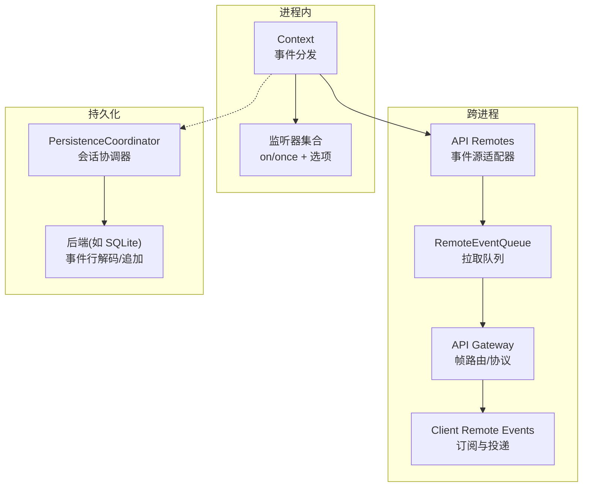
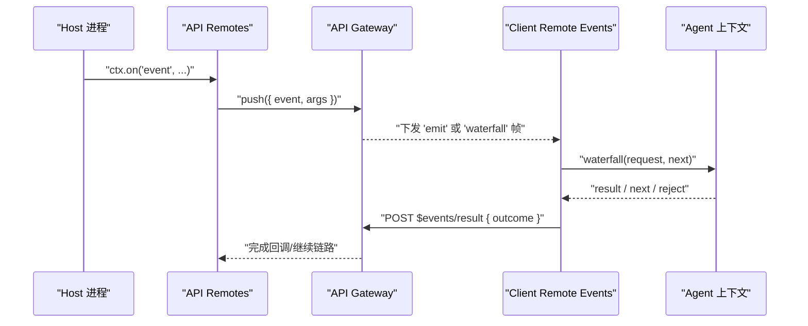
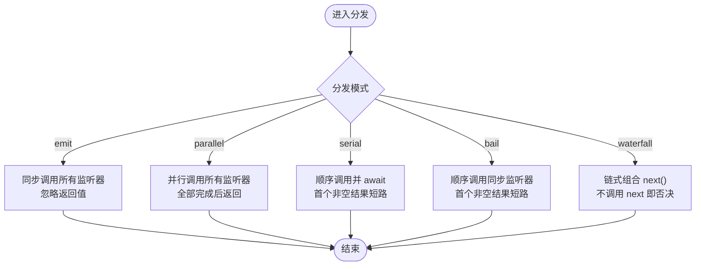
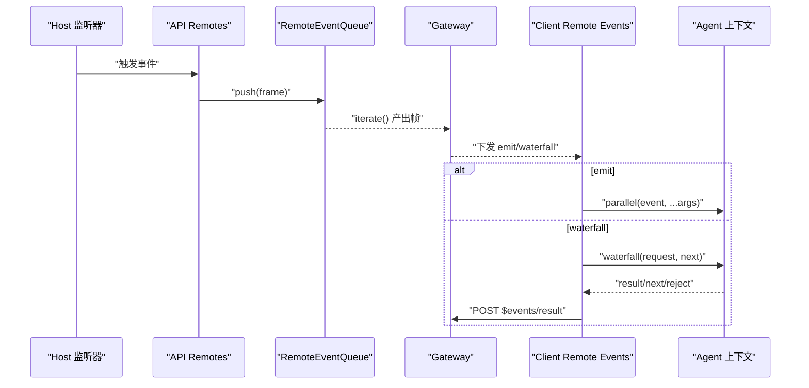
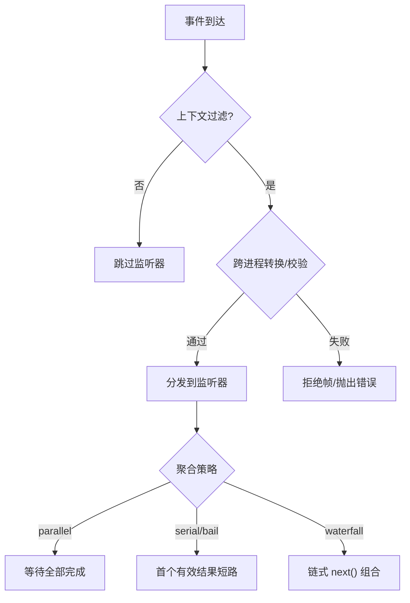
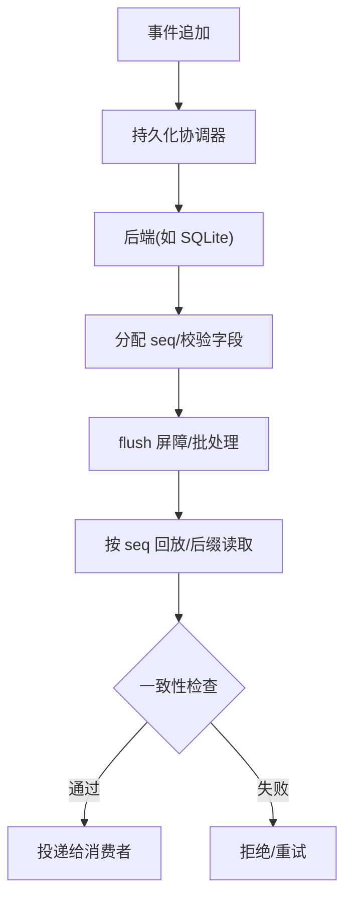
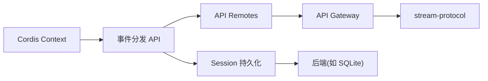

# 事件路由与分发

<cite>
**本文引用的文件**
- [events.md](file://docs/cordis-api/events.md)
- [events.zh.md](file://docs/cordis-api/events.zh.md)
- [index.ts](file://packages/api/remotes/src/index.ts)
- [remote-events.ts](file://packages/api/gateway/src/client/remote-events.ts)
- [stream-protocol.ts](file://packages/api/gateway/src/stream-protocol.ts)
- [events.ts（存储域）](file://packages/storage/storage-domain/src/events.ts)
- [coordinator.ts](file://packages/session/session-persistence/src/coordinator.ts)
- [schema.ts（SQLite 事件行解码）](file://packages/session/session-persistence-sqlite/src/schema.ts)
- [webserver.spec.ts](file://packages/host/webserver/tests/webserver.spec.ts)
- [rpc-host.ts](file://packages/client/connection/src/rpc-host.ts)
</cite>

## 目录
1. [简介](#简介)
2. [项目结构](#项目结构)
3. [核心组件](#核心组件)
4. [架构总览](#架构总览)
5. [详细组件分析](#详细组件分析)
6. [依赖关系分析](#依赖关系分析)
7. [性能考量](#性能考量)
8. [故障排查指南](#故障排查指南)
9. [结论](#结论)
10. [附录](#附录)

## 简介
本文件聚焦 DeepSeek Harness 的事件路由与分发机制，围绕 Cordis 事件模型、跨进程/跨线程通信、匹配与优先级、负载均衡、自定义路由器扩展点、过滤/转换/聚合以及分布式一致性等主题进行系统化说明。内容基于仓库中的 API 文档与实际实现代码，确保可追溯与可验证。

## 项目结构
事件系统由三层构成：
- 进程内事件总线：Cordis Context 提供 emit/parallel/serial/bail/waterfall 等分发模式，监听器通过 ctx.on/ctx.once 注册，支持 prepend 与 global 选项控制优先级与上下文过滤。
- 跨进程事件桥接：API Remotes 将选定的 Cordis 事件桥接到 Gateway 的远程事件流；Gateway 负责帧校验、路由、结果回传。
- 持久化与回放：Session 事件日志通过持久化协调器与后端（如 SQLite）落盘，支持按 seq 的后缀读取与批处理写入，保证回放一致性与恢复能力。

**图表来源**
- [events.md:8-123](file://docs/cordis-api/events.md#L8-L123)
- [index.ts:44-78](file://packages/api/remotes/src/index.ts#L44-L78)
- [remote-events.ts:121-183](file://packages/api/gateway/src/client/remote-events.ts#L121-L183)
- [coordinator.ts:154-176](file://packages/session/session-persistence/src/coordinator.ts#L154-L176)
- [schema.ts:310-341](file://packages/session/session-persistence-sqlite/src/schema.ts#L310-L341)

**章节来源**
- [events.md:8-123](file://docs/cordis-api/events.md#L8-L123)
- [events.zh.md:10-49](file://docs/cordis-api/events.zh.md#L10-L49)
- [index.ts:44-78](file://packages/api/remotes/src/index.ts#L44-L78)
- [remote-events.ts:121-183](file://packages/api/gateway/src/client/remote-events.ts#L121-L183)
- [coordinator.ts:154-176](file://packages/session/session-persistence/src/coordinator.ts#L154-L176)
- [schema.ts:310-341](file://packages/session/session-persistence-sqlite/src/schema.ts#L310-L341)

## 核心组件
- 事件分发模式：emit、parallel、serial、bail、waterfall，分别对应广播、并发等待、有序短路、同步短路、链式组合。
- 监听器注册：ctx.on/ctx.once 支持 prepend（前置优先级）与 global（绕过上下文过滤）。
- 跨进程桥接：API Remotes 将允许列表中的事件以 emit 或 waterfall 模式转发到 Gateway；客户端侧通过 ClientRemoteEvents 订阅并投递到目标 Agent 上下文。
- 协议与校验：Gateway 对远端事件帧进行严格解析与校验，确保请求体为 JSON 安全数据，并维护 clientId/eventId 关联。
- 持久化：Session 事件日志通过协调器统一调度，后端支持 seek-capable 后缀读取与批处理写入，保障回放与恢复。

**章节来源**
- [events.md:8-123](file://docs/cordis-api/events.md#L8-L123)
- [events.md:173-205](file://docs/cordis-api/events.md#L173-L205)
- [index.ts:44-78](file://packages/api/remotes/src/index.ts#L44-L78)
- [remote-events.ts:121-183](file://packages/api/gateway/src/client/remote-events.ts#L121-L183)
- [stream-protocol.ts:96-172](file://packages/api/gateway/src/stream-protocol.ts#L96-L172)
- [coordinator.ts:154-176](file://packages/session/session-persistence/src/coordinator.ts#L154-L176)

## 架构总览
下图展示一次“水闸式”跨进程事件的完整调用链：Host 侧监听器将事件推入队列，Gateway 接收并分发给 Client，Client 在目标 Agent 上下文中执行 waterfull 链，最终将结果经 HTTP RPC 返回 Host。

**图表来源**
- [index.ts:44-78](file://packages/api/remotes/src/index.ts#L44-L78)
- [remote-events.ts:185-248](file://packages/api/gateway/src/client/remote-events.ts#L185-L248)
- [stream-protocol.ts:96-172](file://packages/api/gateway/src/stream-protocol.ts#L96-L172)

## 详细组件分析

### 事件匹配规则与优先级
- 名称匹配：事件名精确匹配，类型由 Events 声明约束。
- 注册顺序与优先级：
  - prepend=true 时插入到同事件监听器之前，获得更高优先级。
  - global=true 时忽略上下文过滤器检查，强制接收事件。
- 分发模式影响“短路”行为：
  - bail：遇到第一个非 null/false/undefined 返回值即停止后续监听器。
  - serial：按注册顺序异步执行，首个非空结果短路。
  - waterfall：每个监听器包裹后续链路，不调用 next() 即否决。

**图表来源**
- [events.md:8-123](file://docs/cordis-api/events.md#L8-L123)
- [events.md:173-205](file://docs/cordis-api/events.md#L173-L205)

**章节来源**
- [events.md:125-185](file://docs/cordis-api/events.md#L125-L185)
- [events.md:189-205](file://docs/cordis-api/events.md#L189-L205)

### 跨进程/跨线程事件通信方案
- Host 侧：API Remotes 根据白名单将 Cordis 事件转为远程事件源，emit 模式直接推送参数，waterfall 模式封装为 Invocation 帧并通过队列迭代。
- Gateway 侧：维护客户端连接与投递队列，解析帧、建立 eventId 与 AbortController 的映射，支持取消传播。
- Client 侧：打开远程事件流，收到 emit 后通过 ctx.parallel 投递到本地监听器；收到 waterfall 后在目标 Agent 上下文执行 waterfull 链，并将结果通过 HTTP RPC 返回。

**图表来源**
- [index.ts:44-78](file://packages/api/remotes/src/index.ts#L44-L78)
- [remote-events.ts:121-183](file://packages/api/gateway/src/client/remote-events.ts#L121-L183)
- [remote-events.ts:185-248](file://packages/api/gateway/src/client/remote-events.ts#L185-L248)

**章节来源**
- [index.ts:44-78](file://packages/api/remotes/src/index.ts#L44-L78)
- [remote-events.ts:121-183](file://packages/api/gateway/src/client/remote-events.ts#L121-L183)
- [remote-events.ts:185-248](file://packages/api/gateway/src/client/remote-events.ts#L185-L248)
- [stream-protocol.ts:96-172](file://packages/api/gateway/src/stream-protocol.ts#L96-L172)

### 事件过滤、转换与聚合
- 过滤：
  - 上下文过滤：ctx.on 默认受上下文范围限制，可通过 global 跳过。
  - 查询过滤：Session 事件查询支持 type/surface/text/time/seq 等过滤条件，用于回放与审计。
- 转换：
  - 跨进程边界对请求/响应进行 JSON 安全投影与校验，移除 agent/signal 等不可序列化字段。
- 聚合：
  - parallel 模式天然并发聚合多个监听器的完成状态。
  - 持久化层对高频事件采用固定窗口批处理，减少 I/O 次数。

**图表来源**
- [events.md:125-185](file://docs/cordis-api/events.md#L125-L185)
- [stream-protocol.ts:139-172](file://packages/api/gateway/src/stream-protocol.ts#L139-L172)
- [coordinator.ts:154-176](file://packages/session/session-persistence/src/coordinator.ts#L154-L176)

**章节来源**
- [events.md:125-185](file://docs/cordis-api/events.md#L125-L185)
- [stream-protocol.ts:139-172](file://packages/api/gateway/src/stream-protocol.ts#L139-L172)
- [coordinator.ts:154-176](file://packages/session/session-persistence/src/coordinator.ts#L154-L176)

### 负载均衡机制
- 进程内：parallel 模式并发执行监听器，适合无副作用或可并行的处理逻辑；serial/bail 提供顺序与短路控制，避免过载。
- 跨进程：Gateway 为每个客户端维护独立队列与投递任务集，支持取消与失败隔离；waterfall 调用通过 AbortSignal 与生命周期信号联动，防止资源泄漏。
- 持久化：协调器按会话标识串行化写入，结合后端 seek-capable 优化读取路径，降低热点竞争。

**章节来源**
- [remote-events.ts:121-183](file://packages/api/gateway/src/client/remote-events.ts#L121-L183)
- [coordinator.ts:154-176](file://packages/session/session-persistence/src/coordinator.ts#L154-L176)

### 自定义路由器开发指南与扩展点
- 事件声明与模式：在子系统页面中声明事件及其分发模式（emit/parallel/serial/bail/waterfall），作为契约约束。
- 监听器注册：使用 ctx.on/ctx.once 注册，利用 prepend/global 控制优先级与上下文过滤。
- 跨进程扩展：在 API Remotes 的白名单中添加事件，选择 emit 或 waterfall 模式；如需复杂路由，可在 Host 侧拦截并改写请求体（保持 JSON 安全）。
- 客户端订阅：通过 ClientRemoteEvents.subscribe 绑定 typed listener，内部会生成私有事件键以避免冲突。
- 协议扩展：遵循 stream-protocol 的帧结构与校验规则，新增帧类型需同时更新两端解析与校验逻辑。

**章节来源**
- [events.md:8-123](file://docs/cordis-api/events.md#L8-L123)
- [events.md:173-205](file://docs/cordis-api/events.md#L173-L205)
- [index.ts:44-78](file://packages/api/remotes/src/index.ts#L44-L78)
- [remote-events.ts:80-97](file://packages/api/gateway/src/client/remote-events.ts#L80-L97)
- [stream-protocol.ts:96-172](file://packages/api/gateway/src/stream-protocol.ts#L96-L172)

### 分布式环境下的事件一致性保证
- 顺序性：同一 domain 的事件在其写链上保持顺序；Session 事件日志按 seq 递增，回放时顺序可复现。
- 幂等与去重：持久化层通过 seq 与 packed 标记区分压缩与原始事件，解码器严格校验字段，避免重复或非法记录。
- 恢复与回放：协调器支持从指定 seq 开始读取后缀，结合 flush 屏障与批处理策略，在崩溃后可恢复到一致状态。
- 跨进程一致性：Gateway 通过 eventId 关联请求与结果，客户端在超时/取消时中止监听任务，避免悬挂结果污染。

**图表来源**
- [coordinator.ts:154-176](file://packages/session/session-persistence/src/coordinator.ts#L154-L176)
- [schema.ts:310-341](file://packages/session/session-persistence-sqlite/src/schema.ts#L310-L341)

**章节来源**
- [coordinator.ts:154-176](file://packages/session/session-persistence/src/coordinator.ts#L154-L176)
- [schema.ts:310-341](file://packages/session/session-persistence-sqlite/src/schema.ts#L310-L341)

## 依赖关系分析
- 事件 API 依赖 Cordis Context，提供统一的 on/emit/parallel/serial/bail/waterfall。
- API Remotes 依赖 Gateway 的远程事件源接口，将进程内事件转换为远端帧。
- Gateway 依赖协议解析与校验模块，确保跨进程传输安全。
- 持久化层依赖 Session 事件模型与后端实现，协调器负责调度与一致性。

**图表来源**
- [events.md:8-123](file://docs/cordis-api/events.md#L8-L123)
- [index.ts:44-78](file://packages/api/remotes/src/index.ts#L44-L78)
- [stream-protocol.ts:96-172](file://packages/api/gateway/src/stream-protocol.ts#L96-L172)
- [coordinator.ts:154-176](file://packages/session/session-persistence/src/coordinator.ts#L154-L176)

**章节来源**
- [events.md:8-123](file://docs/cordis-api/events.md#L8-L123)
- [index.ts:44-78](file://packages/api/remotes/src/index.ts#L44-L78)
- [stream-protocol.ts:96-172](file://packages/api/gateway/src/stream-protocol.ts#L96-L172)
- [coordinator.ts:154-176](file://packages/session/session-persistence/src/coordinator.ts#L154-L176)

## 性能考量
- 并发与短路：优先使用 parallel 提升吞吐，必要时用 serial/bail 控制顺序与提前终止，避免不必要开销。
- 批处理写入：持久化层采用固定窗口批处理，显著降低高频突发场景下的 I/O 次数。
- 跨进程开销：waterfall 模式涉及多次往返，应仅在需要上下文传递时使用；emit 模式更轻量。
- 资源管理：监听器应尽快释放，使用 once 或显式 disposer；Gateway 通过 AbortSignal 与 generation 管理生命周期。

[本节为通用指导，不直接分析具体文件]

## 故障排查指南
- 事件未触发：
  - 检查事件名与类型是否匹配；确认监听器已正确注册且未被 dispose。
  - 若使用全局监听，确认 global 选项设置。
- 跨进程无响应：
  - 检查 Gateway 是否成功注册远程事件源；确认客户端已打开事件流并获得 ready。
  - 查看结果回传是否成功（$events/result），失败时检查协议解析与 JSON 安全校验。
- 回放不一致：
  - 检查 seq 连续性；确认后端解码器未拒绝非法字段。
  - 使用后缀读取从指定 seq 开始回放，定位问题区间。

**章节来源**
- [remote-events.ts:121-183](file://packages/api/gateway/src/client/remote-events.ts#L121-L183)
- [stream-protocol.ts:96-172](file://packages/api/gateway/src/stream-protocol.ts#L96-L172)
- [schema.ts:310-341](file://packages/session/session-persistence-sqlite/src/schema.ts#L310-L341)

## 结论
DeepSeek Harness 的事件系统以 Cordis 为核心，提供丰富的分发模式与灵活的监听器管理；通过 API Remotes 与 Gateway 实现安全的跨进程通信；借助 Session 持久化协调器与后端实现一致的回放与恢复。开发者可基于声明式事件与模式，快速构建可扩展、高性能、可观测的事件驱动架构。

[本节为总结，不直接分析具体文件]

## 附录
- 相关测试与示例：
  - Web 服务器路由优先级测试展示了精确匹配与最长前缀匹配策略，可作为事件路由优先级的参考。
  - RPC 主机侧共享通道处理器展示了按路径与方法的分发逻辑，可用于理解跨进程路由细节。

**章节来源**
- [webserver.spec.ts:202-217](file://packages/host/webserver/tests/webserver.spec.ts#L202-L217)
- [rpc-host.ts:111-132](file://packages/client/connection/src/rpc-host.ts#L111-L132)