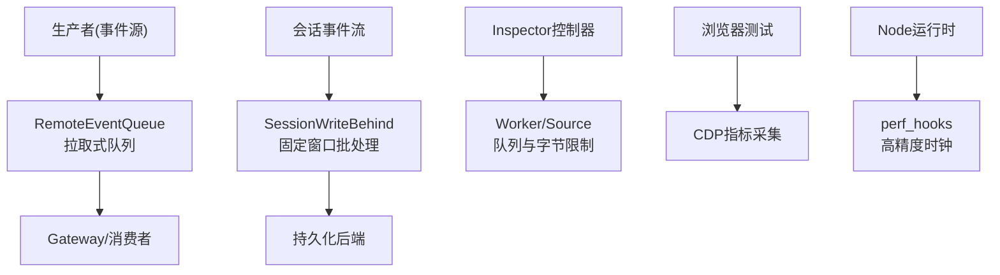
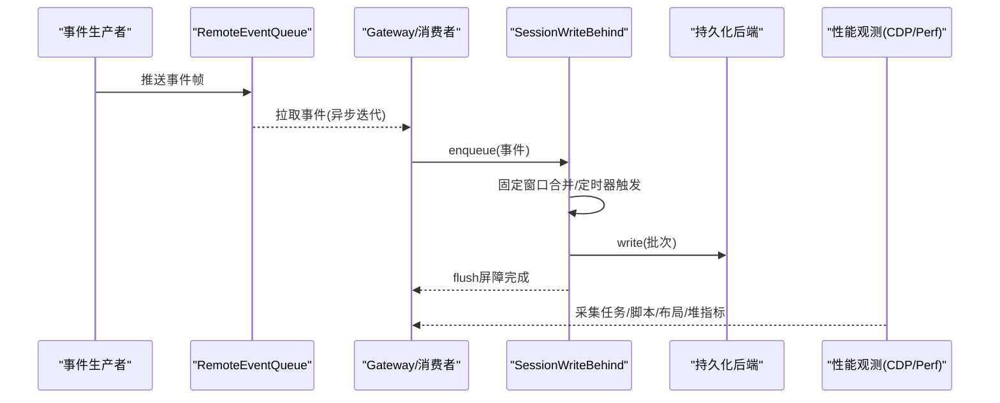
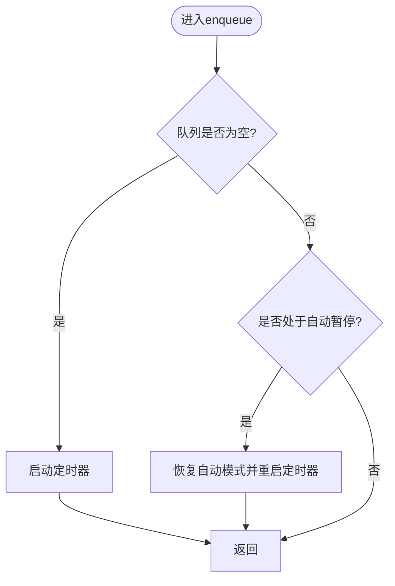
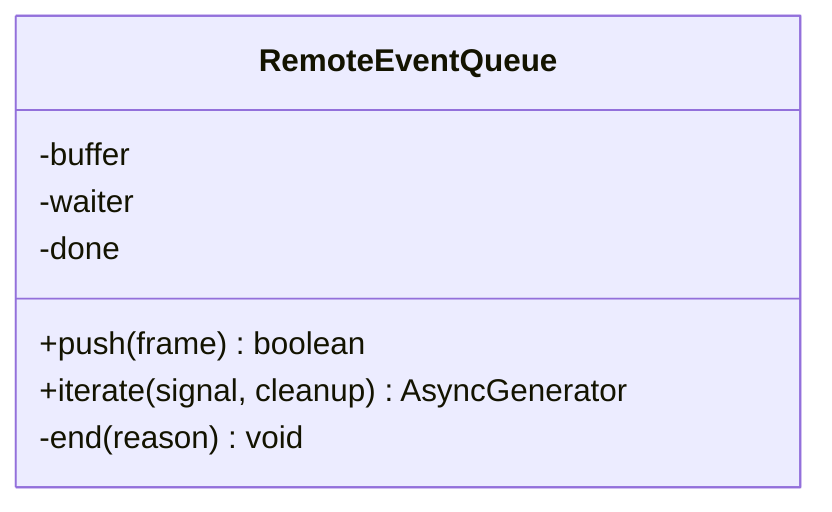
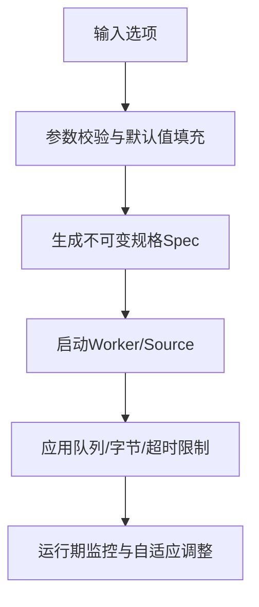
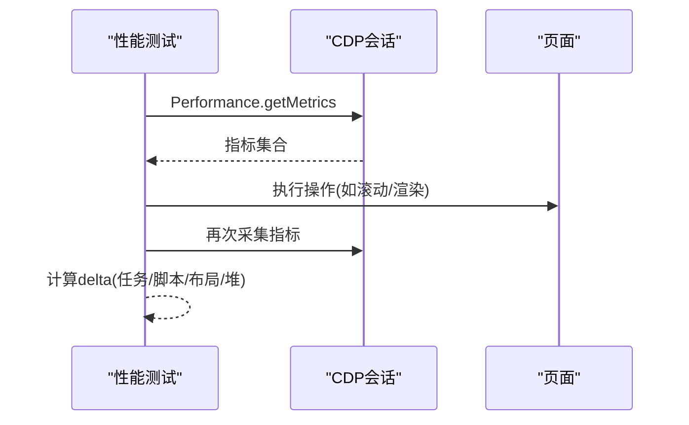

# 性能优化与最佳实践

<cite>
**本文引用的文件**
- [write-behind.ts](file://packages/session/session-persistence/src/write-behind.ts)
- [index.ts](file://packages/api/remotes/src/index.ts)
- [controller.ts](file://packages/experimental/inspector/src/host/bridge/controller.ts)
- [perf_hooks.ts](file://packages/experimental/webworker-runtime/src/node/builtin_modules/implemented/perf_hooks.ts)
- [history-transport.perf.client.ts](file://packages/client/ui-conversation/tests/history-transport.perf.client.ts)
- [complex-history.perf.ts](file://apps/web/tests/complex-history.perf.ts)
</cite>

## 目录
1. [简介](#简介)
2. [项目结构](#项目结构)
3. [核心组件](#核心组件)
4. [架构总览](#架构总览)
5. [详细组件分析](#详细组件分析)
6. [依赖关系分析](#依赖关系分析)
7. [性能考量](#性能考量)
8. [故障排查指南](#故障排查指南)
9. [结论](#结论)
10. [附录](#附录)

## 简介
本文件面向DeepSeek Harness事件总线在高并发场景下的性能优化，聚焦以下目标：
- 事件批处理、背压控制与流量整形的实现策略
- 内存管理与垃圾回收优化技巧
- 性能监控指标与瓶颈分析方法
- 常见性能问题的诊断与解决方案
- 生产环境部署配置与参数调优经验

## 项目结构
围绕事件总线的性能优化，仓库中涉及的关键模块包括：
- 会话持久化写后批处理：SessionWriteBehind，提供固定时间窗口的批量写入与屏障式同步点
- 远程事件桥接：RemoteEventQueue，将同步Cordis监听器转换为拉取式异步迭代，避免阻塞上游
- Inspector控制器：集中管理Worker生命周期与各类队列/字节限制，提供可配置的背压上限
- 性能观测：在浏览器端通过CDP指标采集，在Node侧暴露performance时钟用于高精度计时

**图示来源**
- [index.ts:44-119](file://packages/api/remotes/src/index.ts#L44-L119)
- [write-behind.ts:22-159](file://packages/session/session-persistence/src/write-behind.ts#L22-L159)
- [controller.ts:135-249](file://packages/experimental/inspector/src/host/bridge/controller.ts#L135-L249)
- [complex-history.perf.ts:519-568](file://apps/web/tests/complex-history.perf.ts#L519-L568)
- [perf_hooks.ts:1-28](file://packages/experimental/webworker-runtime/src/node/builtin_modules/implemented/perf_hooks.ts#L1-L28)

**章节来源**
- [index.ts:44-119](file://packages/api/remotes/src/index.ts#L44-L119)
- [write-behind.ts:22-159](file://packages/session/session-persistence/src/write-behind.ts#L22-L159)
- [controller.ts:135-249](file://packages/experimental/inspector/src/host/bridge/controller.ts#L135-L249)
- [complex-history.perf.ts:519-568](file://apps/web/tests/complex-history.perf.ts#L519-L568)
- [perf_hooks.ts:1-28](file://packages/experimental/webworker-runtime/src/node/builtin_modules/implemented/perf_hooks.ts#L1-L28)

## 核心组件
- SessionWriteBehind：按会话维度的写后批处理，提供固定延迟窗口、后台写入、失败重试与屏障式flush，确保有序且可回滚的持久化批次。
- RemoteEventQueue：无锁化的缓冲+唤醒机制，将同步事件转为拉取式迭代，避免同步回调阻塞事件循环。
- Inspector控制器：集中定义并校验所有与队列长度、字节上限、超时等相关的运行期参数，保障高吞吐下的资源可控。
- 性能观测：浏览器端通过CDP获取任务时长、脚本耗时、布局重算、堆大小等；Node侧使用performance进行高精度计时。

**章节来源**
- [write-behind.ts:22-159](file://packages/session/session-persistence/src/write-behind.ts#L22-L159)
- [index.ts:44-119](file://packages/api/remotes/src/index.ts#L44-L119)
- [controller.ts:135-249](file://packages/experimental/inspector/src/host/bridge/controller.ts#L135-L249)
- [complex-history.perf.ts:519-568](file://apps/web/tests/complex-history.perf.ts#L519-L568)
- [perf_hooks.ts:1-28](file://packages/experimental/webworker-runtime/src/node/builtin_modules/implemented/perf_hooks.ts#L1-L28)

## 架构总览
下图展示事件从产生到消费、批处理与背压控制的端到端流程，以及性能观测点。

**图示来源**
- [index.ts:44-119](file://packages/api/remotes/src/index.ts#L44-L119)
- [write-behind.ts:40-159](file://packages/session/session-persistence/src/write-behind.ts#L40-L159)
- [complex-history.perf.ts:519-568](file://apps/web/tests/complex-history.perf.ts#L519-L568)

## 详细组件分析

### 事件批处理：SessionWriteBehind
- 设计要点
  - 固定时间窗口：首次入队时启动定时器，达到maxDelayMs后触发后台写入，避免频繁I/O。
  - 屏障式flush：多个并发flush共享同一屏障，等待当前活跃写入完成后一次性排空已接纳的尾部事件。
  - 失败回滚与自动暂停：写入失败时将批次重新入队，暂停自动调度，防止雪崩。
  - 顺序性与幂等：每次写入前截取pending前缀，保证顺序；失败重试不丢失事件。
- 关键路径
  - enqueue：复制事件入队，必要时重启定时器或恢复自动模式。
  - flush：取消定时器，创建屏障并调用drainBarrier等待活跃写入结束并排空队列。
  - startWrite：提交批次，捕获异常并回滚，设置active以协调并发。
- 复杂度与性能
  - 入队O(1)，批处理减少I/O次数，降低系统调用开销。
  - 定时器与Promise协作，避免忙轮询。

**图示来源**
- [write-behind.ts:40-83](file://packages/session/session-persistence/src/write-behind.ts#L40-L83)

**章节来源**
- [write-behind.ts:22-159](file://packages/session/session-persistence/src/write-behind.ts#L22-L159)

### 背压控制与流量整形：RemoteEventQueue
- 设计要点
  - 拉取式消费：消费者通过iterate主动拉取，避免同步回调阻塞事件循环。
  - 唤醒机制：push时唤醒等待的消费者，减少延迟。
  - 终止传播：AbortSignal驱动关闭，清理待处理的上下文请求，避免悬挂。
- 流量整形建议
  - 结合上层速率限制（如令牌桶）对push频率做整形，避免突发峰值。
  - 在大事件下采用分片发送，配合消费者端的批处理窗口。

**图示来源**
- [index.ts:80-119](file://packages/api/remotes/src/index.ts#L80-L119)

**章节来源**
- [index.ts:44-119](file://packages/api/remotes/src/index.ts#L44-L119)

### 资源上限与背压参数：Inspector控制器
- 关键参数
  - maxQueuedRecords/maxQueuedBytes：单生产者队列的记录数与字节上限，防止内存膨胀。
  - maxSourceFrameBytes/maxSourceRecordsPerFrame：单帧最大编码字节与记录数，控制传输粒度。
  - startupTimeoutMs/stopTimeoutMs：Worker启停超时，保障服务可用性。
  - clientReconnectBaseMs/clientReconnectMaxMs：客户端重连退避范围，缓解风暴。
  - queryTimeoutMs/clientRuntimeTimeoutMs：语义查询与运行时请求超时，避免长尾阻塞。
- 参数校验与约束
  - 端口范围、origin合法性、base与max关系、frame与chunk兼容性检查。

**图示来源**
- [controller.ts:135-178](file://packages/experimental/inspector/src/host/bridge/controller.ts#L135-L178)
- [controller.ts:185-249](file://packages/experimental/inspector/src/host/bridge/controller.ts#L185-L249)

**章节来源**
- [controller.ts:135-249](file://packages/experimental/inspector/src/host/bridge/controller.ts#L135-L249)

### 性能监控指标与瓶颈分析
- 浏览器端（CDP）
  - TaskDuration/ScriptDuration/LayoutDuration/RecalcStyleDuration：识别主线程热点与渲染瓶颈。
  - JSHeapUsedSize/Nodes/JSEventListeners：评估内存占用与DOM压力。
- Node端
  - performance.now/high-resolution clock：高精度计时，定位慢路径。
- 基准方法
  - 强制GC前后对比heapUsed，测量额外峰值，量化优化收益。

**图示来源**
- [complex-history.perf.ts:519-568](file://apps/web/tests/complex-history.perf.ts#L519-L568)
- [history-transport.perf.client.ts:240-283](file://packages/client/ui-conversation/tests/history-transport.perf.client.ts#L240-L283)
- [perf_hooks.ts:1-28](file://packages/experimental/webworker-runtime/src/node/builtin_modules/implemented/perf_hooks.ts#L1-L28)

**章节来源**
- [complex-history.perf.ts:519-568](file://apps/web/tests/complex-history.perf.ts#L519-L568)
- [history-transport.perf.client.ts:240-283](file://packages/client/ui-conversation/tests/history-transport.perf.client.ts#L240-L283)
- [perf_hooks.ts:1-28](file://packages/experimental/webworker-runtime/src/node/builtin_modules/implemented/perf_hooks.ts#L1-L28)

## 依赖关系分析
- 事件总线与批处理耦合点
  - RemoteEventQueue作为上游适配器，解耦同步监听与异步消费，降低事件循环压力。
  - SessionWriteBehind作为下游持久化适配，聚合事件为批次，降低I/O放大。
- 资源边界与隔离
  - Inspector控制器统一收敛队列与字节上限，避免各子系统各自实现导致的资源失控。
- 外部依赖
  - CDP与Node perf_hooks提供观测能力，支撑闭环优化。

**图示来源**
- [index.ts:44-119](file://packages/api/remotes/src/index.ts#L44-L119)
- [write-behind.ts:22-159](file://packages/session/session-persistence/src/write-behind.ts#L22-L159)
- [controller.ts:135-249](file://packages/experimental/inspector/src/host/bridge/controller.ts#L135-L249)

**章节来源**
- [index.ts:44-119](file://packages/api/remotes/src/index.ts#L44-L119)
- [write-behind.ts:22-159](file://packages/session/session-persistence/src/write-behind.ts#L22-L159)
- [controller.ts:135-249](file://packages/experimental/inspector/src/host/bridge/controller.ts#L135-L249)

## 性能考量
- 高并发批处理
  - 合理设置maxDelayMs，平衡延迟与吞吐；在持续高负载下，优先增大批次而非缩短窗口。
  - 使用flush屏障对齐关键路径，确保一致性同时避免不必要的等待。
- 背压与流量整形
  - 在push入口增加速率限制，避免突发导致队列暴涨。
  - 大消息分片发送，配合消费者端批处理窗口，降低单次序列化/网络开销。
- 内存与GC
  - 使用结构化克隆与最小拷贝策略，减少临时对象分配。
  - 通过强制GC基线对比heapUsed峰值，定位内存泄漏与热点路径。
- 观测与回归
  - 建立CDP指标与Node perf的自动化采集，纳入CI，防止性能退化。

[本节为通用指导，无需特定文件引用]

## 故障排查指南
- 症状：事件堆积、延迟升高
  - 检查RemoteEventQueue的push频率与消费者拉取速度，确认是否存在背压不足。
  - 查看Inspector的maxQueuedRecords/maxQueuedBytes是否过小导致频繁丢弃或重传。
- 症状：持久化失败导致抖动
  - 关注SessionWriteBehind的自动暂停与失败回滚逻辑，确认reportBackgroundFailure是否被正确上报。
  - 调整maxDelayMs与重试策略，避免瞬时错误引发雪崩。
- 症状：内存持续增长
  - 使用CDP的JSHeapUsedSize与Nodes指标定位增长源；在Node侧用performance与heap快照辅助定位。
  - 检查是否有未释放的监听器或长期持有的上下文对象。
- 症状：Worker启动/停止缓慢
  - 调整startupTimeoutMs/stopTimeoutMs，观察日志与错误聚合，定位阻塞点。

**章节来源**
- [index.ts:80-119](file://packages/api/remotes/src/index.ts#L80-L119)
- [write-behind.ts:92-159](file://packages/session/session-persistence/src/write-behind.ts#L92-L159)
- [controller.ts:135-249](file://packages/experimental/inspector/src/host/bridge/controller.ts#L135-L249)
- [complex-history.perf.ts:519-568](file://apps/web/tests/complex-history.perf.ts#L519-L568)

## 结论
通过RemoteEventQueue的拉取式消费、SessionWriteBehind的固定窗口批处理与屏障式同步，以及Inspector控制器统一的资源上限管理，DeepSeek Harness事件总线在高并发场景下可实现稳定吞吐与可控延迟。配合CDP与perf_hooks的观测体系，能够持续发现并修复性能瓶颈，保障生产环境的可靠性与效率。

[本节为总结性内容，无需特定文件引用]

## 附录
- 推荐的生产参数起点
  - maxDelayMs：根据业务SLA选择，通常数十至数百毫秒区间
  - maxQueuedRecords/maxQueuedBytes：依据峰值QPS与消息体大小估算，预留安全余量
  - maxSourceFrameBytes/maxSourceRecordsPerFrame：与网络MTU及序列化成本匹配
  - startupTimeoutMs/stopTimeoutMs：根据部署环境与冷启动耗时设定
  - clientReconnectBaseMs/clientReconnectMaxMs：指数退避基础与上限，抑制风暴
- 常用观测指标
  - 任务/脚本/布局耗时、堆大小、节点数量、监听器数量
  - Node侧performance.now的高精度时序，用于定位慢调用链

[本节为补充信息，无需特定文件引用]