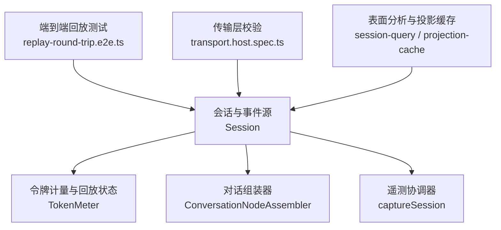
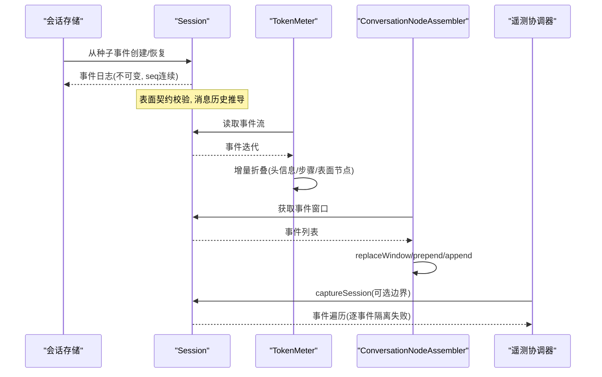
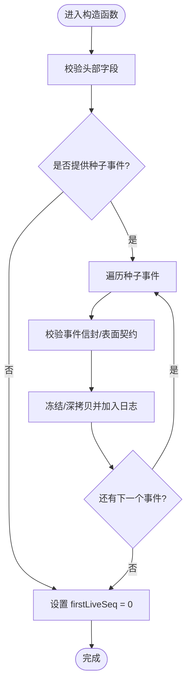
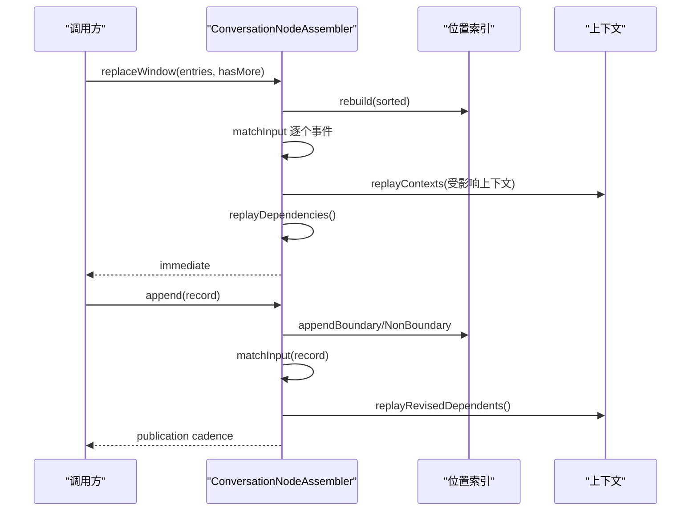
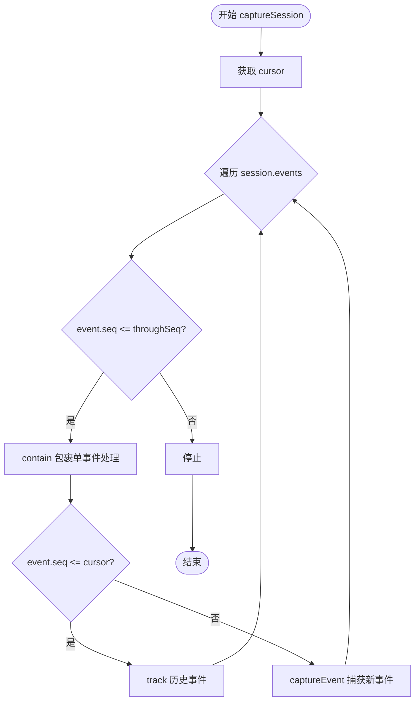
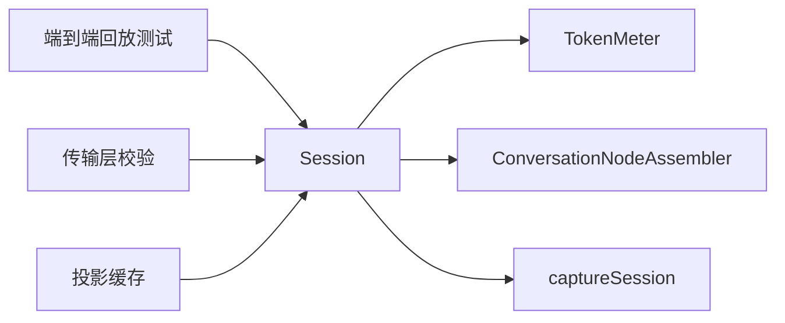

# 事件回放系统

<cite>
**本文引用的文件**
- [packages/core/session/src/index.ts](file://packages/core/session/src/index.ts)
- [packages/llm/token-meter/src/index.ts](file://packages/llm/token-meter/src/index.ts)
- [packages/client/ui-conversation/src/client/conversation/assembler.ts](file://packages/client/ui-conversation/src/client/conversation/assembler.ts)
- [packages/session/session-telemetry/src/coordinator.ts](file://packages/session/session-telemetry/src/coordinator.ts)
- [apps/web/tests/replay-round-trip.e2e.ts](file://apps/web/tests/replay-round-trip.e2e.ts)
- [packages/api/session-controller/tests/transport.host.spec.ts](file://packages/api/session-controller/tests/transport.host.spec.ts)
- [packages/session-query/session-query/src/tracing.ts](file://packages/session-query/session-query/src/tracing.ts)
- [packages/session/session-projection-cache/src/index.ts](file://packages/session/session-projection-cache/src/index.ts)
</cite>

## 目录
1. [简介](#简介)
2. [项目结构](#项目结构)
3. [核心组件](#核心组件)
4. [架构总览](#架构总览)
5. [详细组件分析](#详细组件分析)
6. [依赖关系分析](#依赖关系分析)
7. [性能考量](#性能考量)
8. [故障排查指南](#故障排查指南)
9. [结论](#结论)
10. [附录](#附录)

## 简介
本文件面向 DeepSeek Harness 的事件回放与时间旅行调试能力，系统性阐述以下主题：
- 事件重放的状态恢复机制：如何从持久化事件日志重建会话状态、消息历史与视图上下文。
- 回放过程中的状态重建、工具调用模拟与错误处理：如何在回放中安全地“重放”工具行为并隔离异常。
- 增量回放与全量回放的性能差异：何时使用增量同步、何时需要冷启动全量折叠。
- 自定义回放逻辑的实现方式：通过会话构造、表面投影与视图装配器扩展回放行为。
- 回放与实时执行的同步机制与冲突解决策略：流式追加与历史回放如何共存且保持一致性。
- 回放性能优化与调试技巧：冻结与不可变数据、缓存与增量更新、可观测性与断点定位。

## 项目结构
围绕回放的核心代码分布在以下模块：
- 会话与事件源：Session 类维护追加型事件日志、表面（surface）与派生消息历史，提供 create/fromRestore 等入口以支持回放与分叉。
- 令牌计量与回放状态：TokenMeter 基于会话事件流进行增量折叠，维护每会话的回放状态，用于压力估算与锚点对比。
- 对话组装器：ConversationNodeAssembler 将事件窗口装配为业务 Context 与视图快照，支持 replaceWindow/prepend/append 三种回放/增量模式。
- 遥测协调器：捕获会话日志的“可移交后缀”，在回放/采集时按事件粒度隔离失败，避免阻塞后续事件。
- 端到端回放测试：Web e2e 用例演示记录-回放-刷新闭环，验证 UI 与工具调用的确定性。
- 传输层校验：回放与直播序列间隙检测，保证回放一致性。
- 表面分析与投影缓存：对事件日志进行表面折叠、替换追踪，并提供冷读投影缓存加速回放。



**图表来源**
- [packages/core/session/src/index.ts:497-546](file://packages/core/session/src/index.ts#L497-L546)
- [packages/llm/token-meter/src/index.ts:192-213](file://packages/llm/token-meter/src/index.ts#L192-L213)
- [packages/client/ui-conversation/src/client/conversation/assembler.ts:182-207](file://packages/client/ui-conversation/src/client/conversation/assembler.ts#L182-L207)
- [packages/session/session-telemetry/src/coordinator.ts:128-149](file://packages/session/session-telemetry/src/coordinator.ts#L128-L149)
- [apps/web/tests/replay-round-trip.e2e.ts:51-55](file://apps/web/tests/replay-round-trip.e2e.ts#L51-L55)
- [packages/api/session-controller/tests/transport.host.spec.ts:275-300](file://packages/api/session-controller/tests/transport.host.spec.ts#L275-L300)
- [packages/session-query/session-query/src/tracing.ts:175-214](file://packages/session-query/session-query/src/tracing.ts#L175-L214)
- [packages/session/session-projection-cache/src/index.ts:195-214](file://packages/session/session-projection-cache/src/index.ts#L195-L214)

**章节来源**
- [packages/core/session/src/index.ts:497-546](file://packages/core/session/src/index.ts#L497-L546)
- [packages/llm/token-meter/src/index.ts:192-213](file://packages/llm/token-meter/src/index.ts#L192-L213)
- [packages/client/ui-conversation/src/client/conversation/assembler.ts:182-207](file://packages/client/ui-conversation/src/client/conversation/assembler.ts#L182-L207)
- [packages/session/session-telemetry/src/coordinator.ts:128-149](file://packages/session/session-telemetry/src/coordinator.ts#L128-L149)
- [apps/web/tests/replay-round-trip.e2e.ts:51-55](file://apps/web/tests/replay-round-trip.e2e.ts#L51-L55)
- [packages/api/session-controller/tests/transport.host.spec.ts:275-300](file://packages/api/session-controller/tests/transport.host.spec.ts#L275-L300)
- [packages/session-query/session-query/src/tracing.ts:175-214](file://packages/session-query/session-query/src/tracing.ts#L175-L214)
- [packages/session/session-projection-cache/src/index.ts:195-214](file://packages/session/session-projection-cache/src/index.ts#L195-L214)

## 核心组件
- 会话 Session：追加型事件日志、表面（surface）与派生消息历史；支持从种子事件创建或恢复，确保事件可序列化、seq 连续、表面契约有效。
- 令牌计量 TokenMeter：按会话维护回放状态，增量折叠事件，计算请求压力与表面 token 用量，支持锚点对比与启发式估计。
- 对话组装器 ConversationNodeAssembler：将事件窗口装配为业务上下文与视图快照；支持全量替换、前置追加与尾部追加三种回放/增量路径。
- 遥测协调器 captureSession：按事件粒度捕获会话日志后缀，隔离失败，不影响后续事件回放。
- 端到端回放测试：演示记录-回放-刷新闭环，验证工具调用与 UI 的一致性。
- 传输层校验：检测回放与直播序列间隙，保障回放一致性。
- 表面分析与投影缓存：对事件日志进行表面折叠、替换追踪，并提供冷读投影缓存加速回放。

**章节来源**
- [packages/core/session/src/index.ts:497-546](file://packages/core/session/src/index.ts#L497-L546)
- [packages/llm/token-meter/src/index.ts:192-213](file://packages/llm/token-meter/src/index.ts#L192-L213)
- [packages/client/ui-conversation/src/client/conversation/assembler.ts:182-207](file://packages/client/ui-conversation/src/client/conversation/assembler.ts#L182-L207)
- [packages/session/session-telemetry/src/coordinator.ts:128-149](file://packages/session/session-telemetry/src/coordinator.ts#L128-L149)
- [apps/web/tests/replay-round-trip.e2e.ts:51-55](file://apps/web/tests/replay-round-trip.e2e.ts#L51-L55)
- [packages/api/session-controller/tests/transport.host.spec.ts:275-300](file://packages/api/session-controller/tests/transport.host.spec.ts#L275-L300)
- [packages/session-query/session-query/src/tracing.ts:175-214](file://packages/session-query/session-query/src/tracing.ts#L175-L214)
- [packages/session/session-projection-cache/src/index.ts:195-214](file://packages/session/session-projection-cache/src/index.ts#L195-L214)

## 架构总览
回放系统由“事件源 + 状态折叠 + 视图装配 + 可观测性”构成。事件源提供不可变、有序、可追溯的事件日志；状态折叠负责增量计算（如消息历史、令牌用量）；视图装配器将事件转换为业务上下文与 UI 快照；可观测性在回放过程中捕获、隔离异常，确保整体回放鲁棒。



**图表来源**
- [packages/core/session/src/index.ts:497-546](file://packages/core/session/src/index.ts#L497-L546)
- [packages/llm/token-meter/src/index.ts:192-213](file://packages/llm/token-meter/src/index.ts#L192-L213)
- [packages/client/ui-conversation/src/client/conversation/assembler.ts:182-207](file://packages/client/ui-conversation/src/client/conversation/assembler.ts#L182-L207)
- [packages/session/session-telemetry/src/coordinator.ts:128-149](file://packages/session/session-telemetry/src/coordinator.ts#L128-L149)

## 详细组件分析

### 会话与事件源（Session）
- 事件日志：追加型、不可变、seq 连续；事件 data 必须可 JSON 序列化；表面元数据（surfaceOp/sourceEventSeqs）受控。
- 恢复与创建：fromRestore 接受持久化的种子事件与头部，validateRestoredSessionHeader 严格校验；create 支持种子事件构建离线会话。
- 表面与消息历史：SurfaceManager 维护有序表面节点；deriveMessages 基于表面节点生成 LLM 消息历史，缓存增量更新。
- 首活序列：firstLiveSeq 标记进程内首次追加位置，区分回放种子与直播写入。



**图表来源**
- [packages/core/session/src/index.ts:497-546](file://packages/core/session/src/index.ts#L497-L546)

**章节来源**
- [packages/core/session/src/index.ts:497-546](file://packages/core/session/src/index.ts#L497-L546)

### 令牌计量与回放状态（TokenMeter）
- 回放状态：每个会话独立维护 consumedEvents、header、surface、stepStart、anchor。
- 增量折叠：_sync 循环消费事件，_foldEvent 逐步更新状态；assistant/message 会建立 anchor，便于后续对比。
- 测量：measure 根据当前 surface 与 header 计算 baseline/surfaceDeltaTokens/totalTokens；若 header 匹配则复用 usage 作为基线。

```mermaid
classDiagram
class TokenMeter {
-states : WeakMap~Session, ReplayState~
+measure(session, requestHeader?) TokenMeasurement
-_sync(session) ReplayState
-_foldEvent(session, state, event) void
}
class ReplayState {
+consumedEvents : number
+header : EpochHeader|undefined
+surface : MeterSurfaceNode[]
+stepStart : undefined|{turn, step, nodes}
+anchor : MeasurementAnchor|undefined
}
TokenMeter --> ReplayState : "按会话维护"
```

**图表来源**
- [packages/llm/token-meter/src/index.ts:44-50](file://packages/llm/token-meter/src/index.ts#L44-L50)
- [packages/llm/token-meter/src/index.ts:192-213](file://packages/llm/token-meter/src/index.ts#L192-L213)
- [packages/llm/token-meter/src/index.ts:220-287](file://packages/llm/token-meter/src/index.ts#L220-L287)

**章节来源**
- [packages/llm/token-meter/src/index.ts:192-213](file://packages/llm/token-meter/src/index.ts#L192-L213)
- [packages/llm/token-meter/src/index.ts:220-287](file://packages/llm/token-meter/src/index.ts#L220-L287)

### 对话组装器（ConversationNodeAssembler）
- 全量替换：replaceWindow 清空状态后排序输入、重建位置索引、匹配事件、回放依赖、标记脏集合。
- 增量追加：append 仅处理新事件，必要时触发 location 变更与上下文回放。
- 前置追加：prepend 合并旧页、重建位置索引、应用待处理匹配、回放受影响上下文。
- 视图构建：flush 批量构建/应用视图快照，支持立即发布与动画帧发布。



**图表来源**
- [packages/client/ui-conversation/src/client/conversation/assembler.ts:182-207](file://packages/client/ui-conversation/src/client/conversation/assembler.ts#L182-L207)
- [packages/client/ui-conversation/src/client/conversation/assembler.ts:209-236](file://packages/client/ui-conversation/src/client/conversation/assembler.ts#L209-L236)
- [packages/client/ui-conversation/src/client/conversation/assembler.ts:238-269](file://packages/client/ui-conversation/src/client/conversation/assembler.ts#L238-L269)
- [packages/client/ui-conversation/src/client/conversation/assembler.ts:559-590](file://packages/client/ui-conversation/src/client/conversation/assembler.ts#L559-L590)

**章节来源**
- [packages/client/ui-conversation/src/client/conversation/assembler.ts:182-207](file://packages/client/ui-conversation/src/client/conversation/assembler.ts#L182-L207)
- [packages/client/ui-conversation/src/client/conversation/assembler.ts:209-236](file://packages/client/ui-conversation/src/client/conversation/assembler.ts#L209-L236)
- [packages/client/ui-conversation/src/client/conversation/assembler.ts:238-269](file://packages/client/ui-conversation/src/client/conversation/assembler.ts#L238-L269)
- [packages/client/ui-conversation/src/client/conversation/assembler.ts:559-590](file://packages/client/ui-conversation/src/client/conversation/assembler.ts#L559-L590)

### 遥测协调器（captureSession）
- 捕获会话日志后缀：从 handoffCursor 或 firstLiveSeq 开始，按事件顺序跟踪或捕获。
- 事件级隔离：单个事件失败不会阻塞后续事件回放，保证回放连续性。
- 可选边界：throughSeq 限制捕获范围，便于分段回放与增量采集。



**图表来源**
- [packages/session/session-telemetry/src/coordinator.ts:128-149](file://packages/session/session-telemetry/src/coordinator.ts#L128-L149)

**章节来源**
- [packages/session/session-telemetry/src/coordinator.ts:128-149](file://packages/session/session-telemetry/src/coordinator.ts#L128-L149)

### 端到端回放测试（replay-round-trip）
- 记录模式：DSH_SNAPSHOT=record 重写 session.jsonl，驱动真实工作流并产出固定集。
- 回放模式：DSH_SNAPSHOT=refresh 使用 keyless 回放适配器，验证 UI 与工具调用结果。
- 断言：检查用户提示、工具输出、消息历史、UI 可达性与交互稳定性。

**章节来源**
- [apps/web/tests/replay-round-trip.e2e.ts:51-55](file://apps/web/tests/replay-round-trip.e2e.ts#L51-L55)
- [apps/web/tests/replay-round-trip.e2e.ts:71-102](file://apps/web/tests/replay-round-trip.e2e.ts#L71-L102)
- [apps/web/tests/replay-round-trip.e2e.ts:136-159](file://apps/web/tests/replay-round-trip.e2e.ts#L136-L159)

### 传输层回放一致性校验
- 间隙检测：回放与直播序列出现 gap 时拒绝，防止不一致状态传播。
- 错误码：SESSION_QUERY_CORRUPT_SESSION 表示回放数据损坏或不一致。

**章节来源**
- [packages/api/session-controller/tests/transport.host.spec.ts:275-300](file://packages/api/session-controller/tests/transport.host.spec.ts#L275-L300)

### 表面分析与投影缓存
- 表面折叠：foldSurface 计算当前节点集合与替换关系，辅助诊断与回放分析。
- 冷读投影：coldSnapshot 从完整事件日志构建投影快照，写回缓存以加速后续冷读。

**章节来源**
- [packages/session-query/session-query/src/tracing.ts:175-214](file://packages/session-query/session-query/src/tracing.ts#L175-L214)
- [packages/session/session-projection-cache/src/index.ts:195-214](file://packages/session/session-projection-cache/src/index.ts#L195-L214)

## 依赖关系分析
- Session 是所有回放的基础：提供不可变事件日志、表面与消息历史。
- TokenMeter 依赖 Session 的事件流进行增量折叠，不修改日志。
- ConversationNodeAssembler 依赖 Session 的事件窗口进行上下文装配与视图构建。
- 遥测协调器依赖 Session 的首活序列与事件列表进行捕获。
- 端到端测试依赖会话与回放适配器实现记录-回放闭环。
- 传输层校验依赖会话控制器与回放流的一致性。



**图表来源**
- [packages/core/session/src/index.ts:497-546](file://packages/core/session/src/index.ts#L497-L546)
- [packages/llm/token-meter/src/index.ts:192-213](file://packages/llm/token-meter/src/index.ts#L192-L213)
- [packages/client/ui-conversation/src/client/conversation/assembler.ts:182-207](file://packages/client/ui-conversation/src/client/conversation/assembler.ts#L182-L207)
- [packages/session/session-telemetry/src/coordinator.ts:128-149](file://packages/session/session-telemetry/src/coordinator.ts#L128-L149)
- [apps/web/tests/replay-round-trip.e2e.ts:51-55](file://apps/web/tests/replay-round-trip.e2e.ts#L51-L55)
- [packages/api/session-controller/tests/transport.host.spec.ts:275-300](file://packages/api/session-controller/tests/transport.host.spec.ts#L275-L300)
- [packages/session/session-projection-cache/src/index.ts:195-214](file://packages/session/session-projection-cache/src/index.ts#L195-L214)

**章节来源**
- [packages/core/session/src/index.ts:497-546](file://packages/core/session/src/index.ts#L497-L546)
- [packages/llm/token-meter/src/index.ts:192-213](file://packages/llm/token-meter/src/index.ts#L192-L213)
- [packages/client/ui-conversation/src/client/conversation/assembler.ts:182-207](file://packages/client/ui-conversation/src/client/conversation/assembler.ts#L182-L207)
- [packages/session/session-telemetry/src/coordinator.ts:128-149](file://packages/session/session-telemetry/src/coordinator.ts#L128-L149)
- [apps/web/tests/replay-round-trip.e2e.ts:51-55](file://apps/web/tests/replay-round-trip.e2e.ts#L51-L55)
- [packages/api/session-controller/tests/transport.host.spec.ts:275-300](file://packages/api/session-controller/tests/transport.host.spec.ts#L275-L300)
- [packages/session/session-projection-cache/src/index.ts:195-214](file://packages/session/session-projection-cache/src/index.ts#L195-L214)

## 性能考量
- 全量回放 vs 增量回放：
  - 全量回放（replaceWindow/coldSnapshot）适合冷启动或大范围重算，成本 O(n)。
  - 增量回放（append/prepend/_sync）适合热路径，成本 O(新增事件数)。
- 冻结与不可变数据：Session 事件与消息历史深冻结，避免复制与意外修改，提升回放稳定性。
- 缓存与增量更新：
  - deriveMessages 缓存派生消息，仅对新节点计算。
  - TokenMeter 维护 per-session 回放状态，避免重复折叠。
  - 投影缓存 coldSnapshot 写回以减少后续冷读开销。
- 发布节奏：ConversationNodeAssembler 支持 immediate/animation-frame/none，减少不必要的重绘。
- 事件隔离：captureSession 按事件隔离失败，避免单点故障影响整体回放。

[本节为通用指导，无需特定文件引用]

## 故障排查指南
- 事件格式错误：
  - 种子事件非 JSON 可序列化或 seq 不连续：在 Session 构造阶段抛出错误，需检查持久化数据完整性。
  - 表面契约无效：validateNext 失败，需检查 surfaceOp/sourceEventSeqs 是否正确。
- 回放序列间隙：
  - 传输层检测到 gap 时拒绝回放，需修复事件日志连续性。
- 工具调用异常：
  - 工具执行抛错会被捕获并转化为 tool/result 错误块；回放中保持相同语义。
- 视图构建异常：
  - 上下文 start/update 返回非法状态或键不稳定：组装器会抛出错误，需检查定义实现。
- 遥测捕获失败：
  - 单事件失败被隔离，不影响后续事件；检查 contain 包裹内的具体错误。

**章节来源**
- [packages/core/session/src/index.ts:497-546](file://packages/core/session/src/index.ts#L497-L546)
- [packages/api/session-controller/tests/transport.host.spec.ts:275-300](file://packages/api/session-controller/tests/transport.host.spec.ts#L275-L300)
- [packages/client/ui-conversation/src/client/conversation/assembler.ts:559-590](file://packages/client/ui-conversation/src/client/conversation/assembler.ts#L559-L590)
- [packages/session/session-telemetry/src/coordinator.ts:128-149](file://packages/session/session-telemetry/src/coordinator.ts#L128-L149)

## 结论
DeepSeek Harness 的事件回放系统以追加型事件日志为核心，结合表面契约、不可变数据与增量折叠，实现了高效、可靠的时间旅行调试。通过会话构造、令牌计量、对话组装器与遥测协调器的协同，系统在回放过程中能够准确重建状态、模拟工具调用、隔离错误，并在回放与实时执行之间保持一致性。性能方面，全量与增量回放各有适用场景，配合冻结、缓存与发布节奏控制，可在大规模事件下保持稳定与高效。

[本节为总结，无需特定文件引用]

## 附录
- 自定义回放逻辑示例（路径指引）：
  - 使用 Session.create/fromRestore 传入种子事件与头部，构建离线会话。
  - 通过 ConversationNodeAssembler.replaceWindow 加载历史窗口，或使用 prepend/append 增量回放。
  - 利用 TokenMeter.measure 获取回放中的压力与 token 用量，结合 anchor 进行对比。
  - 使用 captureSession 捕获回放后缀，实现按需采集与隔离失败。
- 参考路径：
  - [packages/core/session/src/index.ts:497-546](file://packages/core/session/src/index.ts#L497-L546)
  - [packages/client/ui-conversation/src/client/conversation/assembler.ts:182-207](file://packages/client/ui-conversation/src/client/conversation/assembler.ts#L182-L207)
  - [packages/llm/token-meter/src/index.ts:192-213](file://packages/llm/token-meter/src/index.ts#L192-L213)
  - [packages/session/session-telemetry/src/coordinator.ts:128-149](file://packages/session/session-telemetry/src/coordinator.ts#L128-L149)

[本节为附录，无需特定文件引用]