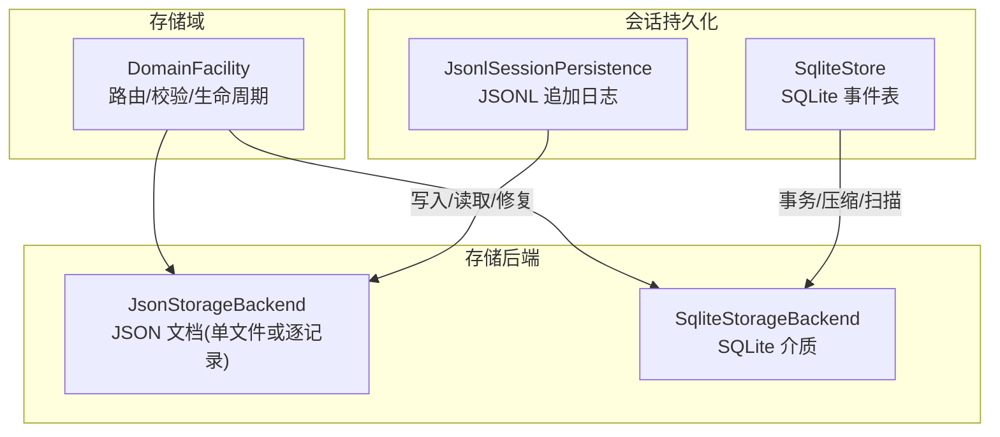
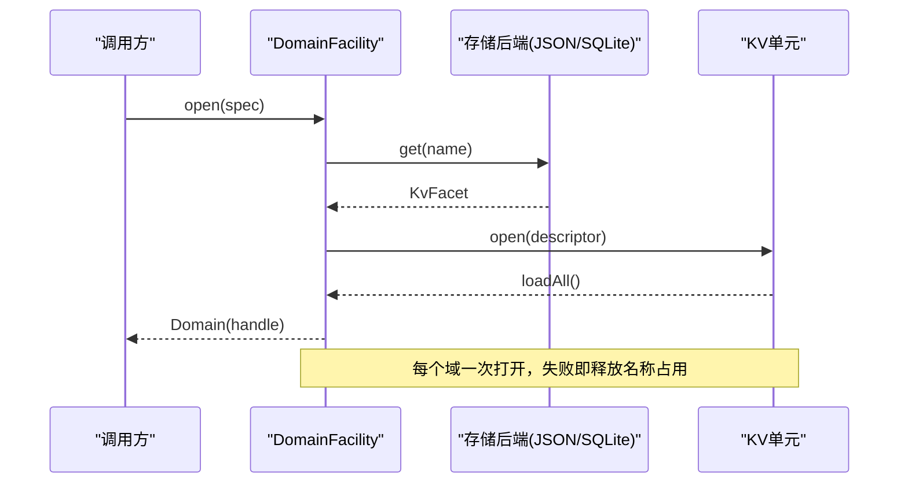
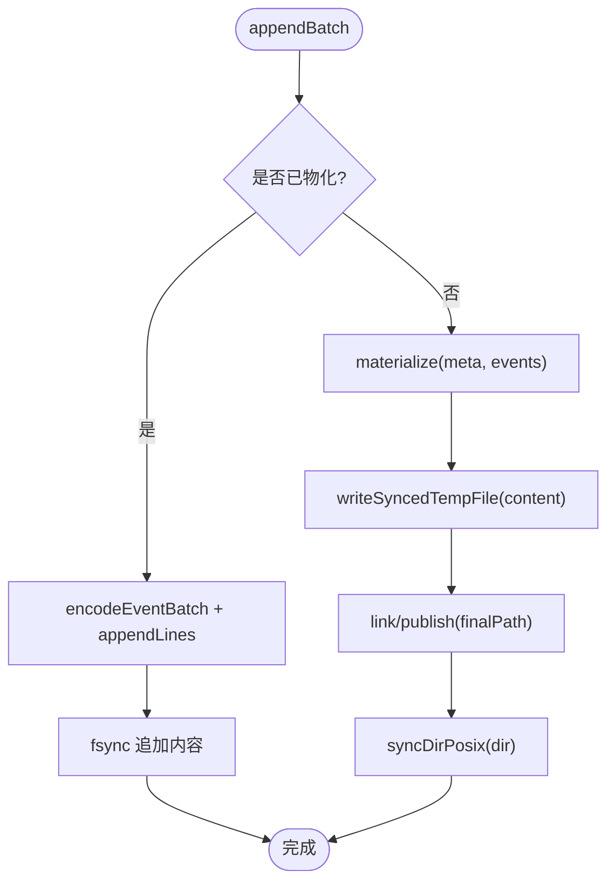
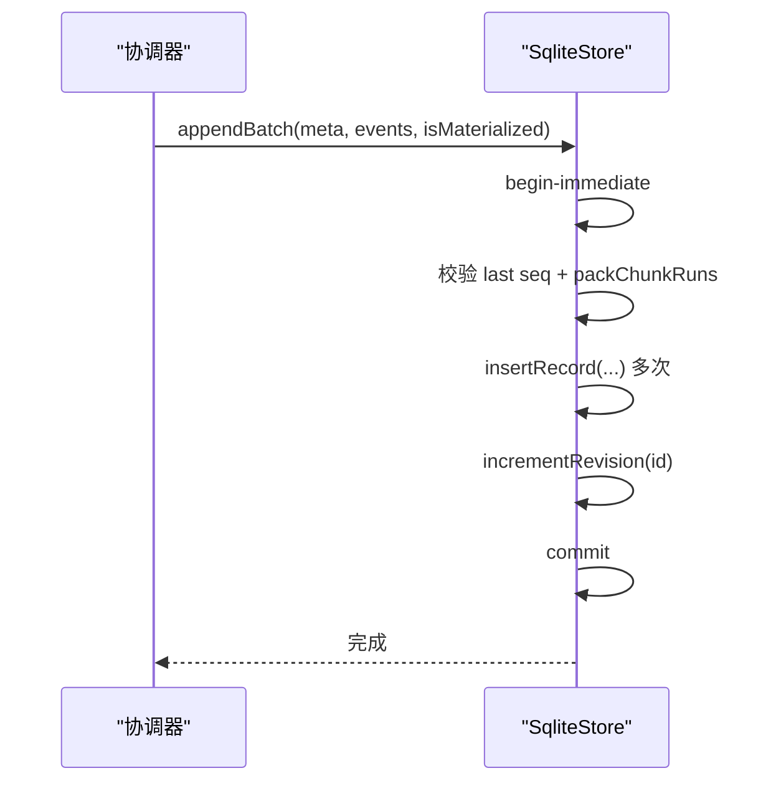
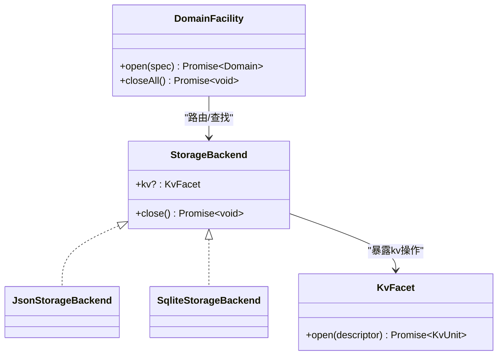
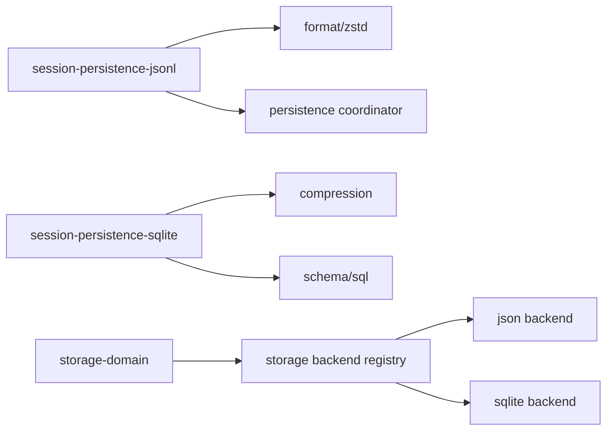

# 事件存储机制

<cite>
**本文引用的文件**
- [packages/storage/storage-domain/src/index.ts](file://packages/storage/storage-domain/src/index.ts)
- [packages/storage/storage-sqlite/src/index.ts](file://packages/storage/storage-sqlite/src/index.ts)
- [packages/storage/storage-json/src/index.ts](file://packages/storage/storage-json/src/index.ts)
- [packages/storage/storage/src/backend.ts](file://packages/storage/storage/src/backend.ts)
- [packages/session/session-persistence-jsonl/src/index.ts](file://packages/session/session-persistence-jsonl/src/index.ts)
- [packages/session/session-persistence-sqlite/src/store.ts](file://packages/session/session-persistence-sqlite/src/store.ts)
- [packages/session/session-persistence-sqlite/src/compression.ts](file://packages/session/session-persistence-sqlite/src/compression.ts)
</cite>

## 目录
1. [简介](#简介)
2. [项目结构](#项目结构)
3. [核心组件](#核心组件)
4. [架构总览](#架构总览)
5. [详细组件分析](#详细组件分析)
6. [依赖关系分析](#依赖关系分析)
7. [性能考虑](#性能考虑)
8. [故障排查指南](#故障排查指南)
9. [结论](#结论)
10. [附录](#附录)

## 简介
本文件系统性说明 DeepSeek Harness 的事件存储机制，重点覆盖：
- 追加式事件日志的实现原理（JSONL 与 SQLite 两种持久化后端）
- 事件序列化格式、压缩策略与存储优化
- 不同存储后端（内存、文件、数据库）的适配实现
- 事件分片、归档与清理策略
- 自定义存储后端的实现方式
- 存储性能、数据一致性与故障恢复机制
- 存储配置选项与监控指标

## 项目结构
DeepSeek Harness 将“通用存储抽象”与“会话事件持久化”解耦：
- 通用存储域（storage-domain）提供键值域模型与路由能力，面向 KV 单元（unit/table）进行版本化、校验与变更事件。
- 存储后端（storage-json、storage-sqlite）注册到存储中心，分别以 JSON 文档或 SQLite 作为介质。
- 会话持久化（session-persistence-jsonl、session-persistence-sqlite）实现追加式事件日志，负责事件序列化、压缩、原子发布、修复与扫描。

图表来源
- [packages/storage/storage-domain/src/index.ts:69-177](file://packages/storage/storage-domain/src/index.ts#L69-L177)
- [packages/storage/storage-json/src/index.ts:38-90](file://packages/storage/storage-json/src/index.ts#L38-L90)
- [packages/storage/storage-sqlite/src/index.ts:55-168](file://packages/storage/storage-sqlite/src/index.ts#L55-L168)
- [packages/session/session-persistence-jsonl/src/index.ts:123-215](file://packages/session/session-persistence-jsonl/src/index.ts#L123-L215)
- [packages/session/session-persistence-sqlite/src/store.ts:55-199](file://packages/session/session-persistence-sqlite/src/store.ts#L55-L199)

章节来源
- [packages/storage/storage-domain/src/index.ts:69-177](file://packages/storage/storage-domain/src/index.ts#L69-L177)
- [packages/storage/storage-json/src/index.ts:38-90](file://packages/storage/storage-json/src/index.ts#L38-L90)
- [packages/storage/storage-sqlite/src/index.ts:55-168](file://packages/storage/storage-sqlite/src/index.ts#L55-L168)
- [packages/session/session-persistence-jsonl/src/index.ts:123-215](file://packages/session/session-persistence-jsonl/src/index.ts#L123-L215)
- [packages/session/session-persistence-sqlite/src/store.ts:55-199](file://packages/session/session-persistence-sqlite/src/store.ts#L55-L199)

## 核心组件
- 存储域设施（DomainFacility）：按声明打开域，路由到具体后端，加载快照并校验记录，维护生命周期与变更事件。
- JSON 存储后端（JsonStorageBackend）：以 JSON 文档为单位，支持“单文件布局”和“逐记录布局”，通过原子重写保证一致性。
- SQLite 存储后端（SqliteStorageBackend）：单一数据库文件承载所有单元，按单元名创建记录表，版本化保护。
- JSONL 会话持久化（JsonlSessionPersistence）：追加式 JSONL 日志，支持 Zstandard 帧压缩、原子发布、崩溃恢复、列表与快照。
- SQLite 会话存储（SqliteStore）：事务化批量插入、行级压缩、从序列号增量读取、修复与重建。

章节来源
- [packages/storage/storage-domain/src/index.ts:69-177](file://packages/storage/storage-domain/src/index.ts#L69-L177)
- [packages/storage/storage-json/src/index.ts:38-90](file://packages/storage/storage-json/src/index.ts#L38-L90)
- [packages/storage/storage-sqlite/src/index.ts:55-168](file://packages/storage/storage-sqlite/src/index.ts#L55-L168)
- [packages/session/session-persistence-jsonl/src/index.ts:123-215](file://packages/session/session-persistence-jsonl/src/index.ts#L123-L215)
- [packages/session/session-persistence-sqlite/src/store.ts:55-199](file://packages/session/session-persistence-sqlite/src/store.ts#L55-L199)

## 架构总览

图表来源
- [packages/storage/storage-domain/src/index.ts:100-156](file://packages/storage/storage-domain/src/index.ts#L100-L156)
- [packages/storage/storage/src/backend.ts:17-43](file://packages/storage/storage/src/backend.ts#L17-L43)

## 详细组件分析

### 追加式 JSONL 事件日志（JSONL 后端）
- 物理格式
  - 每会话一个追加文件，首行为 SessionHeader 的 JSON 行；后续为事件 JSONL 行。
  - 可选压缩：Zstandard 帧（默认）或无压缩。头与事件体各自独立成帧，便于边界修复与只读头部快速解析。
- 写入路径
  - 首次创建：临时文件写入 + fsync + 原子链接/发布到最终路径，确保幂等且防并发覆盖。
  - 追加批次：编码为 JSONL 文本（可打包连续 chunk），按帧压缩后追加并 fsync；失败时回滚到写入前大小。
- 读取路径
  - 稳定读取：stat 前后比较修订号，避免并发写入导致的撕裂文件。
  - 压缩读取：仅解码完整帧；若尾部帧撕裂，尝试恢复部分明文并返回 tornMarker。
- 修复与恢复
  - 对撕裂尾部执行截断并 fsync；将已恢复事件与合成关闭事件追加，完成一致性恢复。
- 列表与快照
  - 仅读取首个帧/行获取元信息，O(1) 级别开销列出会话；快照包含文件修订号用于失效检测。

图表来源
- [packages/session/session-persistence-jsonl/src/index.ts:431-459](file://packages/session/session-persistence-jsonl/src/index.ts#L431-L459)
- [packages/session/session-persistence-jsonl/src/index.ts:529-608](file://packages/session/session-persistence-jsonl/src/index.ts#L529-L608)
- [packages/session/session-persistence-jsonl/src/index.ts:670-720](file://packages/session/session-persistence-jsonl/src/index.ts#L670-L720)

章节来源
- [packages/session/session-persistence-jsonl/src/index.ts:123-215](file://packages/session/session-persistence-jsonl/src/index.ts#L123-L215)
- [packages/session/session-persistence-jsonl/src/index.ts:218-355](file://packages/session/session-persistence-jsonl/src/index.ts#L218-L355)
- [packages/session/session-persistence-jsonl/src/index.ts:431-459](file://packages/session/session-persistence-jsonl/src/index.ts#L431-L459)
- [packages/session/session-persistence-jsonl/src/index.ts:529-608](file://packages/session/session-persistence-jsonl/src/index.ts#L529-L608)
- [packages/session/session-persistence-jsonl/src/index.ts:670-720](file://packages/session/session-persistence-jsonl/src/index.ts#L670-L720)

### SQLite 会话存储（SQLite 后端）
- 物理格式
  - 会话元数据行 + 事件行表；事件数据列采用条件压缩（字符串或二进制）。
  - 支持 packed chunk 行（多事件合并为一行），减少写入与索引压力。
- 写入路径
  - 使用立即事务 begin-immediate，校验逻辑序列号，批量插入 packed 记录，提交并递增版本号。
  - 空会话通过 materializeHeader 写入元数据行。
- 读取路径
  - 全量读取：loadStored 返回 meta + 事件行，scanRows 处理 packed 与撕裂标记。
  - 增量读取：readStoredFrom 基于 fromSeq 选择最小必要物理跨度，过滤出目标序列之后的事件。
- 修复与恢复
  - commitRepair 在事务中删除撕裂尾部、追加合成关闭事件，并更新版本号。
- 安全与一致性
  - 数据库文件与父目录权限校验，拒绝符号链接与不安全模式。
  - 通过 storeIdentity + incarnation + revision 构建强一致性修订标识。

图表来源
- [packages/session/session-persistence-sqlite/src/store.ts:173-199](file://packages/session/session-persistence-sqlite/src/store.ts#L173-L199)
- [packages/session/session-persistence-sqlite/src/store.ts:330-335](file://packages/session/session-persistence-sqlite/src/store.ts#L330-L335)

章节来源
- [packages/session/session-persistence-sqlite/src/store.ts:55-199](file://packages/session/session-persistence-sqlite/src/store.ts#L55-L199)
- [packages/session/session-persistence-sqlite/src/store.ts:214-253](file://packages/session/session-persistence-sqlite/src/store.ts#L214-L253)
- [packages/session/session-persistence-sqlite/src/store.ts:337-364](file://packages/session/session-persistence-sqlite/src/store.ts#L337-L364)
- [packages/session/session-persistence-sqlite/src/compression.ts:77-141](file://packages/session/session-persistence-sqlite/src/compression.ts#L77-L141)

### 存储域与后端路由（KV 域）
- 路由策略：默认后端 + 按域名覆盖；未注册后端或无 kv 能力会报错。
- 版本与形态：KvUnitDescriptor 携带 name/version/tables/layout；后端据此创建/校验介质。
- 生命周期：open 期间保留名称占用，失败释放；closeAll 统一关闭。

图表来源
- [packages/storage/storage/src/backend.ts:17-64](file://packages/storage/storage/src/backend.ts#L17-L64)
- [packages/storage/storage-domain/src/index.ts:69-177](file://packages/storage/storage-domain/src/index.ts#L69-L177)
- [packages/storage/storage-json/src/index.ts:38-90](file://packages/storage/storage-json/src/index.ts#L38-L90)
- [packages/storage/storage-sqlite/src/index.ts:55-168](file://packages/storage/storage-sqlite/src/index.ts#L55-L168)

章节来源
- [packages/storage/storage/src/backend.ts:17-64](file://packages/storage/storage/src/backend.ts#L17-L64)
- [packages/storage/storage-domain/src/index.ts:69-177](file://packages/storage/storage-domain/src/index.ts#L69-L177)

### 事件序列化、压缩与存储优化
- JSONL 后端
  - 事件行：每条事件一行 JSON；可选将连续 assistant/chunk 类事件打包为 text/reasoning/tool-call chunks 行，显著减小体积。
  - 压缩：Zstandard 帧（默认），头与事件体独立帧；读取时仅解码完整帧，支持撕裂尾部恢复。
  - 原子发布：POSIX 使用 link+unlink，Windows 使用专用发布函数，配合目录 fsync 保证崩溃安全。
- SQLite 后端
  - 行级压缩：数据列优先使用 zstd 压缩，仅在压缩后更短时使用二进制；sourceEventSeqs 使用变长差值编码。
  - 批量化：packChunkRuns 将多事件合并为 packed 行，减少写入次数与索引维护成本。
  - 增量读取：根据 fromSeq 计算最小物理跨度，避免全表扫描。

章节来源
- [packages/session/session-persistence-jsonl/src/index.ts:634-651](file://packages/session/session-persistence-jsonl/src/index.ts#L634-L651)
- [packages/session/session-persistence-jsonl/src/index.ts:357-429](file://packages/session/session-persistence-jsonl/src/index.ts#L357-L429)
- [packages/session/session-persistence-sqlite/src/compression.ts:77-141](file://packages/session/session-persistence-sqlite/src/compression.ts#L77-L141)
- [packages/session/session-persistence-sqlite/src/store.ts:337-364](file://packages/session/session-persistence-sqlite/src/store.ts#L337-L364)

### 存储后端适配（内存、文件、数据库）
- 内存后端（测试用）：MemoryStorageBackend 实现 KvFacet，基于内存 Map 模拟 KV 单元，支持 put/delete/setGlobal 与 loadAll。
- 文件后端（JSON）：JsonStorageBackend 支持单文件与逐记录两种布局，按单元名组织根目录下文件树，原子重写保障一致性。
- 数据库后端（SQLite）：SqliteStorageBackend 管理单一数据库连接，按单元名创建记录表，版本化保护，集中关闭。

章节来源
- [packages/storage/storage-domain/tests/helpers/memory-backend.ts:67-120](file://packages/storage/storage-domain/tests/helpers/memory-backend.ts#L67-L120)
- [packages/storage/storage-json/src/index.ts:38-90](file://packages/storage/storage-json/src/index.ts#L38-L90)
- [packages/storage/storage-sqlite/src/index.ts:55-168](file://packages/storage/storage-sqlite/src/index.ts#L55-L168)

### 事件分片、归档与清理策略
- 事件分片（Packing）
  - JSONL：将连续的 chunk 类型事件打包为单行，降低行数与 I/O。
  - SQLite：packChunkRuns 将多事件合并为 packed 行，提升写入吞吐与查询效率。
- 归档
  - 工作区层提供归档接口，可将会话 ID 加入归档集合；重复归档幂等，未知 ID 拒绝写入。
- 清理
  - JSONL：列表/快照仅读取头部，避免全量解析；损坏或半写文件被跳过。
  - SQLite：通过事务与版本号控制，结合 storeIdentity/incarnation/revision 识别有效状态。

章节来源
- [packages/workspace/workspace/tests/workspace.spec.ts:889-912](file://packages/workspace/workspace/tests/workspace.spec.ts#L889-L912)
- [packages/session/session-persistence-jsonl/src/index.ts:462-525](file://packages/session/session-persistence-jsonl/src/index.ts#L462-L525)
- [packages/session/session-persistence-sqlite/src/store.ts:255-275](file://packages/session/session-persistence-sqlite/src/store.ts#L255-L275)

### 自定义存储后端实现指南
- 步骤
  1) 实现 StorageBackend，提供 KvFacet.open，遵循 KV 单元契约（版本、表名、layout）。
  2) 在插件 apply 中向存储中心注册后端名称（如 'custom'）。
  3) 在 storage-domain 配置中将该后端映射到所需域。
- 关键约束
  - 单元名与表名需匹配安全正则；同一单元不可重复打开。
  - 写入必须原子且持久化；close 需幂等并等待未完成写入。
  - 版本不匹配应抛出 version-mismatch；无法解析介质应抛出 malformed-medium。

章节来源
- [packages/storage/storage/src/backend.ts:17-64](file://packages/storage/storage/src/backend.ts#L17-L64)
- [packages/storage/storage-json/src/index.ts:104-119](file://packages/storage/storage-json/src/index.ts#L104-L119)
- [packages/storage/storage-sqlite/src/index.ts:152-168](file://packages/storage/storage-sqlite/src/index.ts#L152-L168)
- [packages/storage/storage-domain/src/index.ts:100-156](file://packages/storage/storage-domain/src/index.ts#L100-L156)

### 存储配置选项
- JSONL 会话持久化
  - root：会话日志根目录（必需）
  - packChunks：是否打包连续 chunk 事件（默认开启）
  - compression：'zstd' | 'none'（默认 'zstd'）
  - preparedSessionCacheSize：冷启动准备缓存大小
  - writeBatchMaxDelayMs：写入批合并窗口上限
- JSON 存储后端
  - root：单元文档根目录（必需）
- SQLite 存储后端
  - path：数据库路径或 ':memory:'
  - journalMode：'wal' | 'delete' | 'truncate' | 'persist'（默认 'wal'）
- SQLite 会话存储
  - path：数据库路径或 ':memory:'
  - journalMode：同上传播
  - busyTimeoutMs：忙超时（毫秒）

章节来源
- [packages/session/session-persistence-jsonl/src/index.ts:61-85](file://packages/session/session-persistence-jsonl/src/index.ts#L61-L85)
- [packages/storage/storage-json/src/index.ts:22-36](file://packages/storage/storage-json/src/index.ts#L22-L36)
- [packages/storage/storage-sqlite/src/index.ts:23-48](file://packages/storage/storage-sqlite/src/index.ts#L23-L48)
- [packages/session/session-persistence-sqlite/src/store.ts:48-53](file://packages/session/session-persistence-sqlite/src/store.ts#L48-L53)

### 监控指标建议
- 写入路径
  - 批大小分布、压缩比（原始字节 vs 压缩后）、fsync 耗时、失败率与回滚次数。
- 读取路径
  - 头部读取耗时、帧解码耗时、撕裂恢复次数、增量读取跨度命中率。
- 一致性
  - 版本冲突/序列号不匹配错误计数、storeIdentity 变更次数。
- 资源
  - 文件句柄数、数据库连接池占用、内存峰值（尤其是大帧解码）。

[本节为通用指导，无需特定文件引用]

## 依赖关系分析

图表来源
- [packages/session/session-persistence-jsonl/src/index.ts:123-215](file://packages/session/session-persistence-jsonl/src/index.ts#L123-L215)
- [packages/session/session-persistence-sqlite/src/store.ts:55-199](file://packages/session/session-persistence-sqlite/src/store.ts#L55-L199)
- [packages/storage/storage-domain/src/index.ts:69-177](file://packages/storage/storage-domain/src/index.ts#L69-L177)
- [packages/storage/storage-json/src/index.ts:38-90](file://packages/storage/storage-json/src/index.ts#L38-L90)
- [packages/storage/storage-sqlite/src/index.ts:55-168](file://packages/storage/storage-sqlite/src/index.ts#L55-L168)

章节来源
- [packages/session/session-persistence-jsonl/src/index.ts:123-215](file://packages/session/session-persistence-jsonl/src/index.ts#L123-L215)
- [packages/session/session-persistence-sqlite/src/store.ts:55-199](file://packages/session/session-persistence-sqlite/src/store.ts#L55-L199)
- [packages/storage/storage-domain/src/index.ts:69-177](file://packages/storage/storage-domain/src/index.ts#L69-L177)

## 性能考虑
- 写入
  - 批合并：增大 writeBatchMaxDelayMs 可减少 fsync 次数，但增加延迟；需权衡实时性。
  - 压缩：Zstandard 帧压缩显著降低磁盘空间与 I/O，但带来 CPU 开销；可按场景切换 'none'。
  - 打包：packChunks 对高频 chunk 事件效果明显；注意解码侧兼容性。
- 读取
  - 列表/快照仅读取头部，避免全量解析；增量读取基于 fromSeq 缩小扫描范围。
  - 大帧解码时分段 yield，防止阻塞事件循环。
- 一致性
  - 原子发布与 fsync 目录项，确保崩溃后不会看到半写文件。
  - SQLite 使用立即事务与版本号，避免并发写入竞争。

[本节为通用指导，无需特定文件引用]

## 故障排查指南
- 常见错误
  - 版本不匹配：后端介质版本与描述符不一致，需迁移或清理旧介质。
  - 介质损坏：JSONL 头部帧无效或 SQLite 存储身份非法，需检查文件权限与完整性。
  - 序列号不连续：追加起始 seq 与期望不符，可能由并发写入或修复不完整导致。
  - 权限问题：SQLite 父目录或数据库文件非当前用户拥有或存在组/世界写位。
- 定位方法
  - 查看 listSnapshots 返回的 revision 变化，确认是否发生外部修改。
  - 检查 readStableFile 的 stat 前后差异，判断是否存在并发写入。
  - 对 SQLite，检查 storeIdentity/incarnation/revision 是否稳定。

章节来源
- [packages/storage/storage-sqlite/src/index.ts:100-110](file://packages/storage/storage-sqlite/src/index.ts#L100-L110)
- [packages/session/session-persistence-jsonl/src/index.ts:294-314](file://packages/session/session-persistence-jsonl/src/index.ts#L294-L314)
- [packages/session/session-persistence-sqlite/src/store.ts:186-199](file://packages/session/session-persistence-sqlite/src/store.ts#L186-L199)
- [packages/session/session-persistence-sqlite/src/store.ts:422-448](file://packages/session/session-persistence-sqlite/src/store.ts#L422-L448)

## 结论
DeepSeek Harness 的事件存储机制通过“通用存储域 + 多后端适配 + 会话持久化”的分层设计，实现了高可靠、高性能的追加式事件日志。JSONL 后端适合人类可读与轻量集成，SQLite 后端适合高吞吐与复杂查询。两者均提供完善的压缩、原子发布、崩溃恢复与一致性保障。通过合理的配置与监控，可在不同部署环境中取得最佳平衡。

[本节为总结，无需特定文件引用]

## 附录
- 参考实现路径
  - JSONL 追加与修复：[packages/session/session-persistence-jsonl/src/index.ts](file://packages/session/session-persistence-jsonl/src/index.ts)
  - SQLite 事务与压缩：[packages/session/session-persistence-sqlite/src/store.ts](file://packages/session/session-persistence-sqlite/src/store.ts)、[packages/session/session-persistence-sqlite/src/compression.ts](file://packages/session/session-persistence-sqlite/src/compression.ts)
  - 存储域与后端注册：[packages/storage/storage-domain/src/index.ts](file://packages/storage/storage-domain/src/index.ts)、[packages/storage/storage-json/src/index.ts](file://packages/storage/storage-json/src/index.ts)、[packages/storage/storage-sqlite/src/index.ts](file://packages/storage/storage-sqlite/src/index.ts)

[本节为导航，无需特定文件引用]