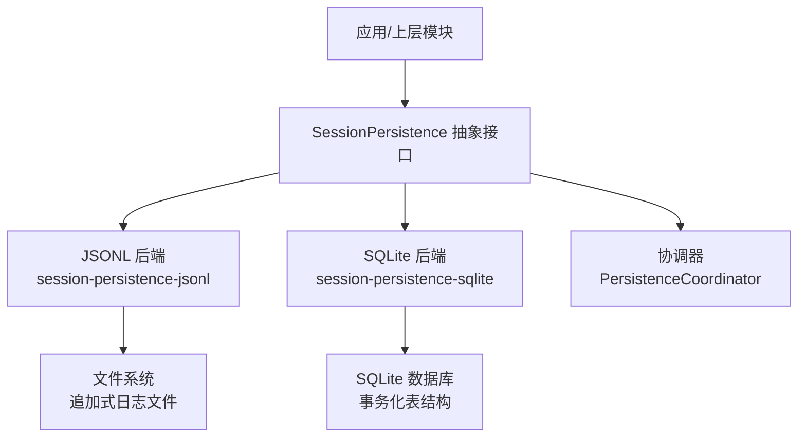
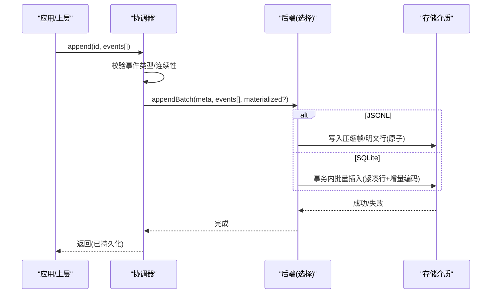
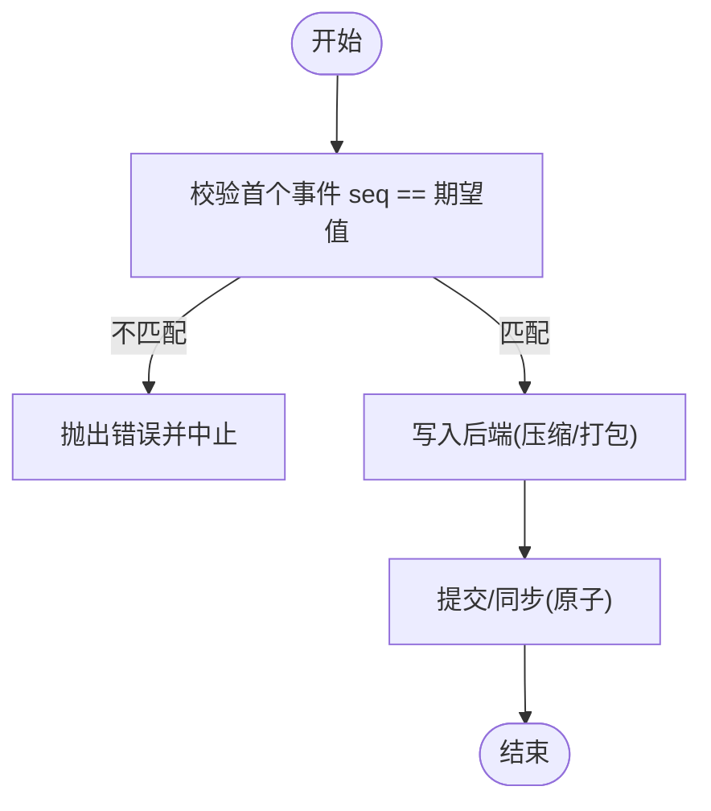
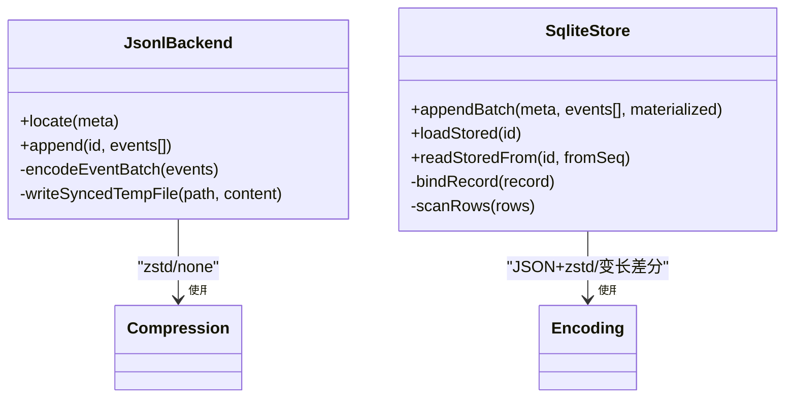
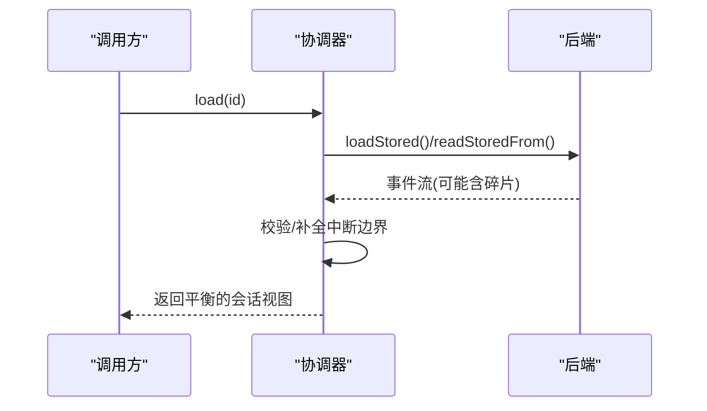
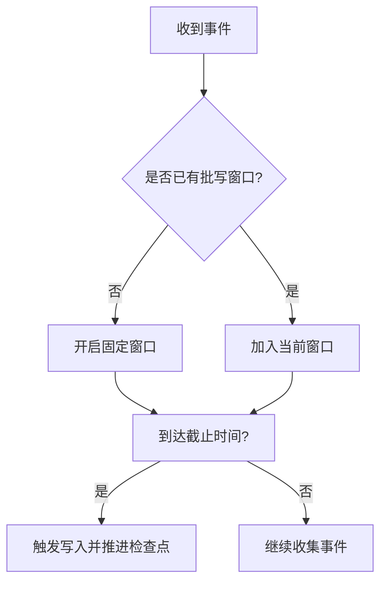
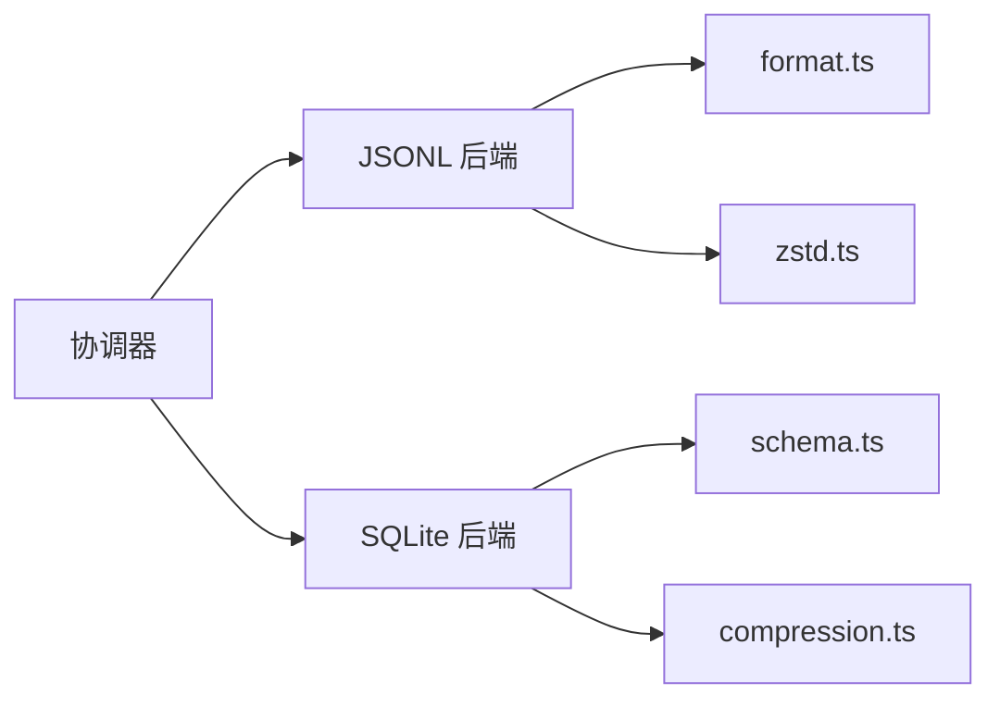

# 事件持久化与回放

<cite>
**本文引用的文件**
- [persistence.md](file://docs/subsystems/persistence.md)
- [persistence-catalog.md](file://docs/persistence-catalog.md)
- [index.ts（JSONL 后端）](file://packages/session/session-persistence-jsonl/src/index.ts)
- [format.ts（JSONL 格式/压缩）](file://packages/session/session-persistence-jsonl/src/format.ts)
- [zstd.ts（Zstandard 编解码）](file://packages/session/session-persistence-jsonl/src/zstd.ts)
- [store.ts（SQLite 存储实现）](file://packages/session/session-persistence-sqlite/src/store.ts)
- [compression.ts（SQLite 压缩/编码）](file://packages/session/session-persistence-sqlite/src/compression.ts)
- [schema.ts（SQLite 模式/行解码）](file://packages/session/session-persistence-sqlite/src/schema.ts)
- [coordinator.ts（协调器追加核心）](file://packages/session/session-persistence/src/coordinator.ts)
</cite>

## 目录
1. [简介](#简介)
2. [项目结构](#项目结构)
3. [核心组件](#核心组件)
4. [架构总览](#架构总览)
5. [详细组件分析](#详细组件分析)
6. [依赖关系分析](#依赖关系分析)
7. [性能考虑](#性能考虑)
8. [故障恢复指南](#故障恢复指南)
9. [结论](#结论)
10. [附录：自定义事件存储后端示例](#附录自定义事件存储后端示例)

## 简介
本文件面向 DeepSeek Harness 的事件持久化与回放能力，聚焦以下目标：
- 解释事件的追加式存储机制与不可变日志设计
- 说明事件序列化格式、压缩策略与存储优化
- 阐述事件回放的实现原理，包括时间旅行调试与状态恢复
- 介绍事件归档、清理与迁移策略
- 提供实现自定义事件存储后端的实践指引
- 总结事件持久化的性能考量与故障恢复机制

## 项目结构
DeepSeek Harness 将“会话事件”的持久化抽象为统一的 `SessionPersistence` 服务，并提供可插拔的后端实现：
- JSONL 后端：每会话一个追加式文件，支持 Zstandard 帧压缩与原子写入
- SQLite 后端：单库多会话，使用紧凑的行结构与增量编码，事务性批量写入
- 协调器：统一编排创建、追加、准备、加载、检查、读取后缀等能力，并处理批写窗口与冷启动修复

图表来源
- [persistence.md:231-237](file://docs/subsystems/persistence.md#L231-L237)
- [index.ts（JSONL 后端）:123-188](file://packages/session/session-persistence-jsonl/src/index.ts#L123-L188)
- [store.ts（SQLite 存储实现）:55-84](file://packages/session/session-persistence-sqlite/src/store.ts#L55-L84)

章节来源
- [persistence.md:1-20](file://docs/subsystems/persistence.md#L1-L20)
- [persistence.md:231-237](file://docs/subsystems/persistence.md#L231-L237)

## 核心组件
- 事件模型与会话头
  - 事件信封包含单调序列号 seq、时间戳 time、数据 data，以及可选 surfaceOp/sourceEventSeqs（仅表面事件携带）
  - 会话头 SessionHeader 独立于事件日志，记录版本、工作目录、父会话、种子边界等元信息
- 持久化服务
  - locate/create/append/prepare/load/inspect/readFrom/list/listSnapshots 等能力
  - 支持原始工件读取（JSONL 后端）
- 协调器
  - 统一追加入口，校验连续性、管理批写窗口、刷新检查点、失效准备缓存
- 后端实现
  - JSONL：追加式文件 + Zstandard 帧压缩 + 原子写入 + 中断轮次恢复
  - SQLite：紧凑行编码 + 增量编码 + 事务批量插入 + 模式校验

章节来源
- [persistence-catalog.md:12-82](file://docs/persistence-catalog.md#L12-L82)
- [persistence.md:39-94](file://docs/subsystems/persistence.md#L39-L94)
- [persistence.md:248-399](file://docs/subsystems/persistence.md#L248-L399)
- [coordinator.ts:705-733](file://packages/session/session-persistence/src/coordinator.ts#L705-L733)

## 架构总览
事件从生产到落盘再到回放的整体流程如下：

图表来源
- [coordinator.ts:705-733](file://packages/session/session-persistence/src/coordinator.ts#L705-L733)
- [index.ts（JSONL 后端）:186-195](file://packages/session/session-persistence-jsonl/src/index.ts#L186-L195)
- [store.ts（SQLite 存储实现）:173-199](file://packages/session/session-persistence-sqlite/src/store.ts#L173-L199)

## 详细组件分析

### 不可变日志与追加式存储
- 不可变性
  - 事件一旦持久化即视为不可变；后续变更通过新增事件表达
  - 表面事件通过 sourceEventSeqs/surfaceOp 描述对有序表面的替换或追加
- 追加式存储
  - JSONL：按会话追加行或压缩帧，保持顺序
  - SQLite：以 seq 为序的紧凑行，批量事务插入
- 连续性约束
  - 协调器在追加前校验首个事件 seq 等于期望值，确保无空洞与乱序

图表来源
- [coordinator.ts:720-733](file://packages/session/session-persistence/src/coordinator.ts#L720-L733)
- [store.ts（SQLite 存储实现）:183-195](file://packages/session/session-persistence-sqlite/src/store.ts#L183-L195)

章节来源
- [persistence-catalog.md:45-82](file://docs/persistence-catalog.md#L45-L82)
- [coordinator.ts:705-733](file://packages/session/session-persistence/src/coordinator.ts#L705-L733)

### 事件序列化格式与压缩
- JSONL 后端
  - 物理表示：首行为会话头，其后为事件行或压缩帧
  - 压缩：默认 Zstandard 帧；可按配置关闭
  - 打包：连续 chunk 事件可打包为紧凑块，显著减小体积
  - 原子写入：临时文件写入后原子替换，避免半写损坏
- SQLite 后端
  - 行编码：事件数据先 JSON 序列化再按需 zstd 压缩，比较短则保留明文
  - 增量编码：sourceEventSeqs 使用变长整数差分编码，减少重复开销
  - 紧凑块：assistant/chunk 等连续事件打包为 text-chunks/reasoning-chunks/tool-call-chunks 行

图表来源
- [index.ts（JSONL 后端）:622-651](file://packages/session/session-persistence-jsonl/src/index.ts#L622-L651)
- [compression.ts（SQLite 压缩/编码）:77-141](file://packages/session/session-persistence-sqlite/src/compression.ts#L77-L141)
- [store.ts（SQLite 存储实现）:173-199](file://packages/session/session-persistence-sqlite/src/store.ts#L173-L199)

章节来源
- [index.ts（JSONL 后端）:123-188](file://packages/session/session-persistence-jsonl/src/index.ts#L123-L188)
- [index.ts（JSONL 后端）:622-651](file://packages/session/session-persistence-jsonl/src/index.ts#L622-L651)
- [compression.ts（SQLite 压缩/编码）:77-141](file://packages/session/session-persistence-sqlite/src/compression.ts#L77-L141)

### 事件回放与时间旅行
- 回放路径
  - load：加载完整逻辑视图，冷启动时自动补全中断轮次边界，保证平衡
  - inspect：只读检查，不提交修复；可复用已准备的会话对象图
  - readFrom：从指定 seq 起读取后缀，适合增量投影恢复
- 时间旅行
  - 基于不可变事件日志，任意位置均可重放得到一致状态
  - 表面事件通过 sourceEventSeqs/surfaceOp 精确重建有序表面
- 恢复语义
  - 冷会话遇到未闭合 turn/start，会合成 turn/end 标记为 interrupted，保持平衡且不截断已持久化事件
  - 未知版本或损坏的前缀拒绝加载，防止静默降级

图表来源
- [persistence.md:13-19](file://docs/subsystems/persistence.md#L13-L19)
- [persistence.md:318-379](file://docs/subsystems/persistence.md#L318-L379)
- [store.ts（SQLite 存储实现）:134-171](file://packages/session/session-persistence-sqlite/src/store.ts#L134-L171)

章节来源
- [persistence.md:13-19](file://docs/subsystems/persistence.md#L13-L19)
- [persistence.md:318-379](file://docs/subsystems/persistence.md#L318-L379)

### 批写窗口与刷新检查点
- 批写窗口
  - 第一个待持久化事件开启固定窗口，后续事件加入而不重置截止时间
  - 显式 flush 取消等待并排空至静默，作为排序与错误观察的检查点
- 刷新语义
  - 后台写入被拒时保留事件并暂停自动重试；新事件开启新窗口
  - 最大限制仅控制批写等待，不影响事件循环调度或后端延迟

图表来源
- [persistence.md:9-12](file://docs/subsystems/persistence.md#L9-L12)

章节来源
- [persistence.md:9-12](file://docs/subsystems/persistence.md#L9-L12)

### 归档、清理与迁移策略
- 归档
  - JSONL 后端可通过 locate 获取绝对路径，便于外部归档工具定位
  - SQLite 后端不支持 per-session 工件，需整体备份数据库
- 清理
  - 未追加任何事件的会话不会留下工件（惰性物化）
  - 列表 API 仅返回已物化会话，便于统计与清理
- 迁移
  - 版本拒绝：当存储格式版本高于当前构建时，明确提示升级 harness
  - 向后兼容：低于当前版本的构建不提供升级路径，直接拒绝
  - 事件词表拒绝：未知事件类型拒绝重建，避免静默跳过导致误读

章节来源
- [persistence.md:21-23](file://docs/subsystems/persistence.md#L21-L23)
- [persistence.md:92-99](file://docs/subsystems/persistence.md#L92-L99)
- [persistence.md:231-237](file://docs/subsystems/persistence.md#L231-L237)

## 依赖关系分析
- 协调器依赖后端实现，屏蔽差异
- JSONL 后端依赖格式与压缩模块，负责文件 I/O 与原子写入
- SQLite 后端依赖 schema/codec/compression，负责事务与紧凑编码
- 上层仅依赖抽象接口，便于替换与测试

图表来源
- [index.ts（JSONL 后端）:123-188](file://packages/session/session-persistence-jsonl/src/index.ts#L123-L188)
- [store.ts（SQLite 存储实现）:55-84](file://packages/session/session-persistence-sqlite/src/store.ts#L55-L84)

章节来源
- [persistence.md:231-237](file://docs/subsystems/persistence.md#L231-L237)

## 性能考虑
- 压缩与打包
  - JSONL：默认 Zstandard 帧压缩；连续 chunk 打包可显著降低体积
  - SQLite：事件数据按需压缩；sourceEventSeqs 使用变长差分编码
- 批写与 I/O
  - 固定窗口批写减少系统调用次数
  - JSONL 原子写入避免部分写入导致的损坏
- 读取优化
  - SQLite 支持从指定 seq 读取后缀，减少不必要解析
  - JSONL 虽顺序扫描，但可通过压缩帧边界与跳过策略提升效率
- 内存与并发
  - 协调器维护轻量 LRU 缓存以减少重复准备
  - 批写窗口与刷新检查点解耦生产者与持久化速度

章节来源
- [index.ts（JSONL 后端）:622-651](file://packages/session/session-persistence-jsonl/src/index.ts#L622-L651)
- [compression.ts（SQLite 压缩/编码）:77-141](file://packages/session/session-persistence-sqlite/src/compression.ts#L77-L141)
- [store.ts（SQLite 存储实现）:160-171](file://packages/session/session-persistence-sqlite/src/store.ts#L160-L171)
- [persistence.md:9-12](file://docs/subsystems/persistence.md#L9-L12)

## 故障恢复指南
- 冷启动恢复
  - 检测到未闭合 turn/start 时，合成 turn/end 并标记为 interrupted，保持平衡
  - 仅对冷会话进行修复；活会话拒绝合成边界
- 版本与完整性
  - 未知版本或损坏前缀拒绝加载，避免静默降级
  - JSONL 首帧必须仅为头行，否则判定为损坏
- 批写失败
  - 后台写入被拒保留事件并暂停自动重试；显式 flush 立即重试并上报错误
- 建议排查步骤
  - 确认事件 seq 连续性
  - 检查后端是否支持原始工件读取（JSONL）
  - 查看最近一次 flush 检查点与批写窗口配置

章节来源
- [persistence.md:13-19](file://docs/subsystems/persistence.md#L13-L19)
- [persistence.md:92-99](file://docs/subsystems/persistence.md#L92-L99)
- [index.ts（JSONL 后端）:48-53](file://packages/session/session-persistence-jsonl/src/index.ts#L48-L53)

## 结论
DeepSeek Harness 通过不可变事件日志与可插拔后端实现了高可靠的事件持久化与回放。JSONL 与 SQLite 两种后端分别满足文件级与数据库级的不同部署需求；协调器统一了批写、刷新与恢复语义。借助紧凑编码、压缩与原子写入，系统在吞吐与体积之间取得良好平衡；同时提供清晰的版本拒绝与恢复策略，保障长期稳定性。

## 附录：自定义事件存储后端示例
要实现自定义事件存储后端，请遵循以下步骤：
- 实现 PersistenceBackend 接口
  - 提供 appendBatch(meta, events[], materialized) 事务性批量写入
  - 提供 loadStored/readStoredFrom 等读取能力（可选）
  - 提供 list/listSnapshots 轻量列举能力（可选）
- 注册到协调器
  - 通过 SessionPersistence 抽象暴露 locate/create/append/prepare/load/inspect 等方法
  - 协调器负责事件类型校验、连续性检查与批写窗口
- 序列化与压缩
  - 可选择 JSON 序列化 + 压缩（如 zstd），或采用紧凑行/块编码
  - 对 sourceEventSeqs 等字段采用高效编码以降低体积
- 原子性与一致性
  - 使用临时文件+原子替换（文件型）或事务（数据库型）确保一致性
  - 在失败时回滚或丢弃不完整片段，避免损坏前缀
- 恢复与迁移
  - 支持冷启动时检测并修复中断边界
  - 拒绝未知版本或事件类型，避免静默降级
- 参考实现
  - JSONL 后端：[index.ts（JSONL 后端）:123-188](file://packages/session/session-persistence-jsonl/src/index.ts#L123-L188)、[index.ts（JSONL 后端）:622-651](file://packages/session/session-persistence-jsonl/src/index.ts#L622-L651)
  - SQLite 后端：[store.ts（SQLite 存储实现）:173-199](file://packages/session/session-persistence-sqlite/src/store.ts#L173-L199)、[compression.ts（SQLite 压缩/编码）:77-141](file://packages/session/session-persistence-sqlite/src/compression.ts#L77-L141)

章节来源
- [persistence.md:248-399](file://docs/subsystems/persistence.md#L248-L399)
- [index.ts（JSONL 后端）:123-188](file://packages/session/session-persistence-jsonl/src/index.ts#L123-L188)
- [store.ts（SQLite 存储实现）:173-199](file://packages/session/session-persistence-sqlite/src/store.ts#L173-L199)
- [compression.ts（SQLite 压缩/编码）:77-141](file://packages/session/session-persistence-sqlite/src/compression.ts#L77-L141)