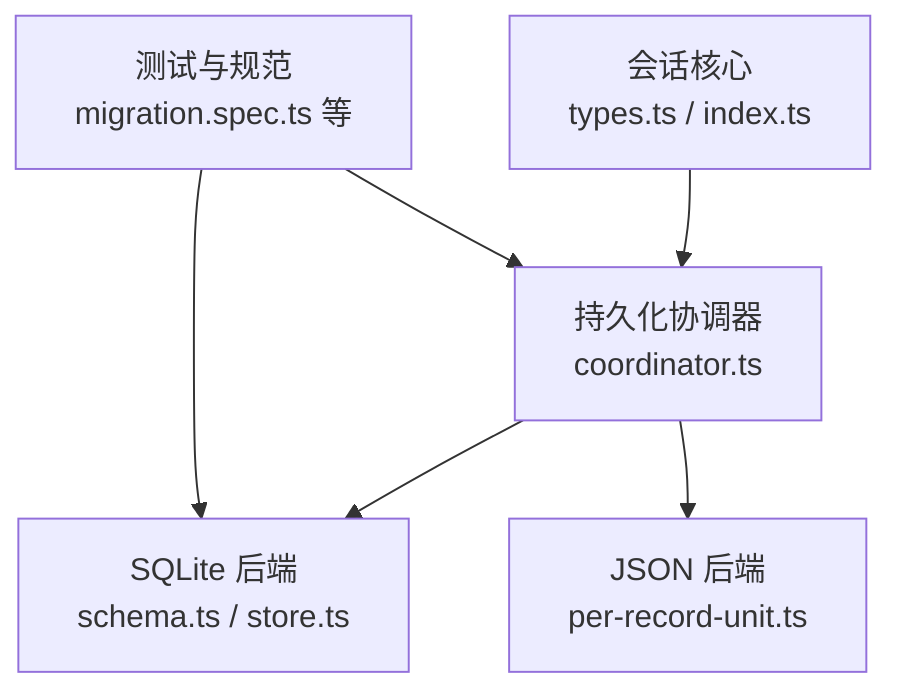
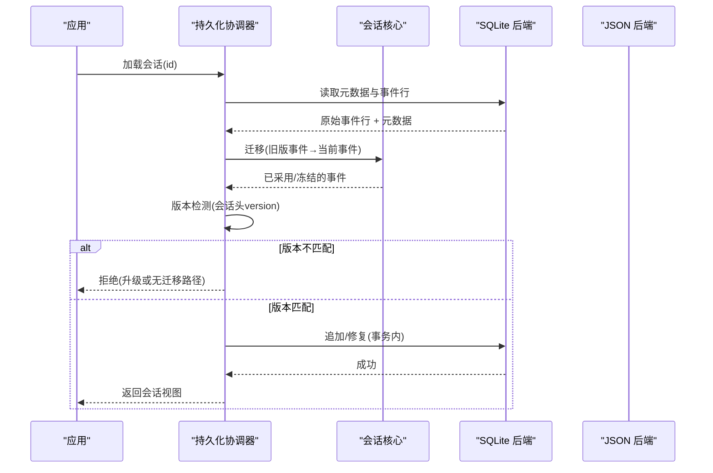
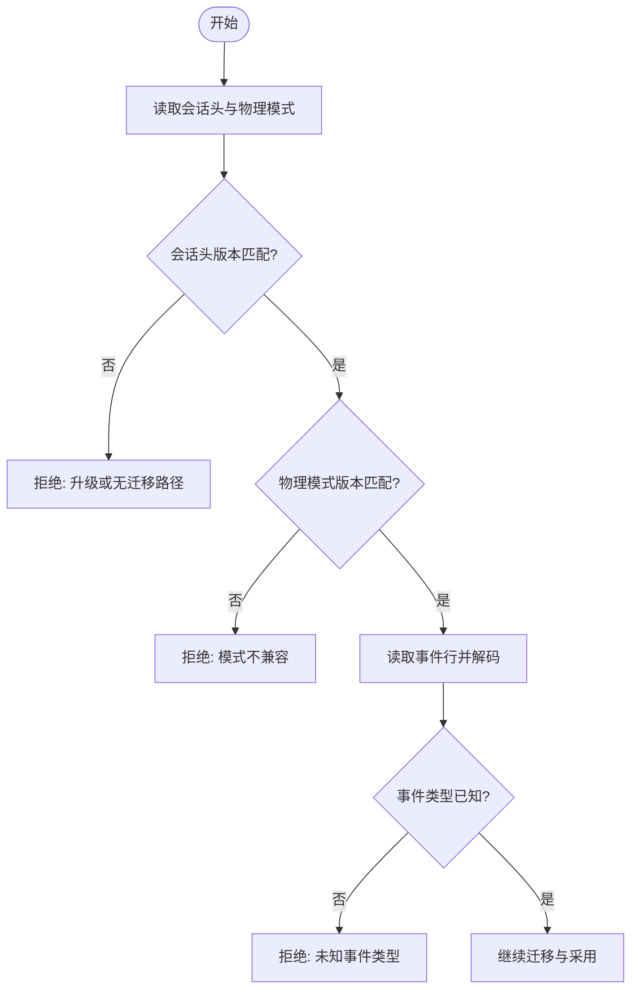
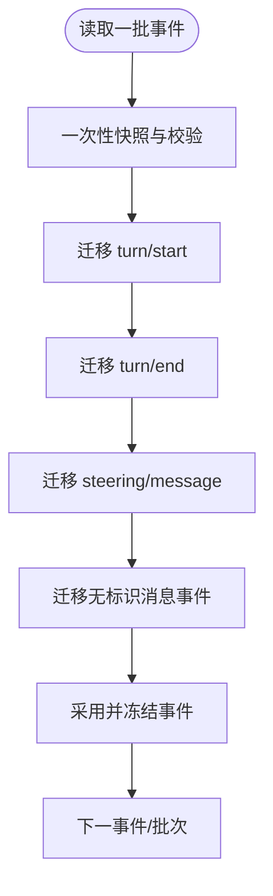
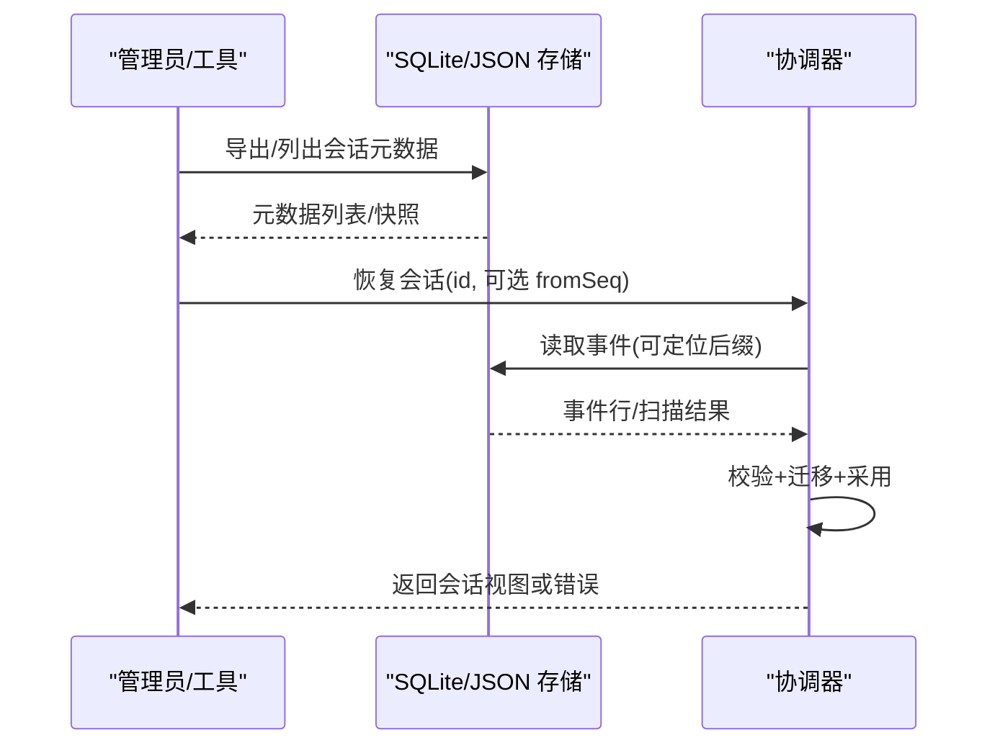
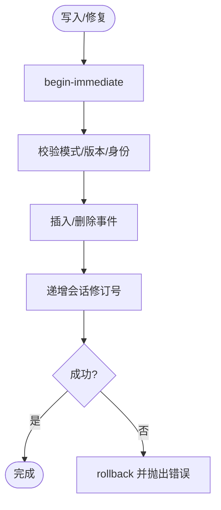
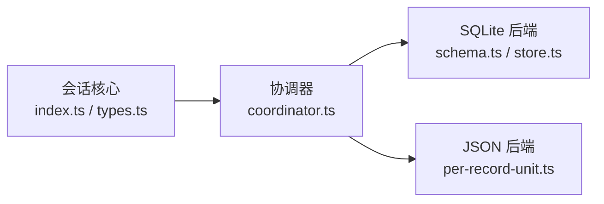

# 事件迁移与版本管理

<cite>
**本文引用的文件**
- [packages/core/session/src/types.ts](file://packages/core/session/src/types.ts)
- [packages/core/session/src/index.ts](file://packages/core/session/src/index.ts)
- [packages/session/session-persistence/src/coordinator.ts](file://packages/session/session-persistence/src/coordinator.ts)
- [packages/session/session-persistence-sqlite/src/schema.ts](file://packages/session/session-persistence-sqlite/src/schema.ts)
- [packages/session/session-persistence-sqlite/src/store.ts](file://packages/session/session-persistence-sqlite/src/store.ts)
- [packages/storage/storage-json/src/per-record-unit.ts](file://packages/storage/storage-json/src/per-record-unit.ts)
- [packages/credentials/credentials-local/tests/migration.spec.ts](file://packages/credentials/credentials-local/tests/migration.spec.ts)
- [.agents/notes/implemented/simplification/2026-08-25-fail-closed-session-event-vocabulary.md](file://.agents/notes/implemented/simplification/2026-08-25-fail-closed-session-event-vocabulary.md)
</cite>

## 目录
1. [简介](#简介)
2. [项目结构](#项目结构)
3. [核心组件](#核心组件)
4. [架构总览](#架构总览)
5. [详细组件分析](#详细组件分析)
6. [依赖关系分析](#依赖关系分析)
7. [性能考量](#性能考量)
8. [故障排除指南](#故障排除指南)
9. [结论](#结论)
10. [附录](#附录)

## 简介
本文件围绕 DeepSeek Harness 的事件迁移与版本管理，系统阐述以下主题：
- 事件格式的向后兼容性设计与版本检测、拒绝策略
- 事件迁移策略与实现（增量迁移、批量迁移）
- 事件数据的备份、恢复与验证流程
- 自定义迁移脚本的实现方式与最佳实践
- 数据完整性保证与回滚机制
- 常见问题与排障指引

当前构建将会话日志格式版本固定为 v0，并在加载时拒绝不兼容的旧/新格式，不提供自动迁移路径。这意味着在预发布阶段，任何对持久化事件结构的破坏性变更都需要通过显式升级或人工迁移完成。

## 项目结构
与事件迁移和版本管理直接相关的代码分布在以下模块：
- 会话核心类型与事件模型：定义会话头版本常量、事件结构与表面操作
- 会话持久化协调器：负责读取、迁移、采用与修复事件流
- SQLite 持久化后端：负责物理存储、模式校验、事务与修订号
- JSON 存储后端：提供按记录单元化的存储与原子写入
- 测试与规范：覆盖迁移、版本冲突与恢复行为

图表来源
- [packages/core/session/src/types.ts:33-56](file://packages/core/session/src/types.ts#L33-L56)
- [packages/core/session/src/index.ts:167-194](file://packages/core/session/src/index.ts#L167-L194)
- [packages/session/session-persistence/src/coordinator.ts:547-576](file://packages/session/session-persistence/src/coordinator.ts#L547-L576)
- [packages/session/session-persistence-sqlite/src/schema.ts:17-21](file://packages/session/session-persistence-sqlite/src/schema.ts#L17-L21)
- [packages/session/session-persistence-sqlite/src/store.ts:173-253](file://packages/session/session-persistence-sqlite/src/store.ts#L173-L253)
- [packages/storage/storage-json/src/per-record-unit.ts:125-142](file://packages/storage/storage-json/src/per-record-unit.ts#L125-L142)

章节来源
- [packages/core/session/src/types.ts:33-56](file://packages/core/session/src/types.ts#L33-L56)
- [packages/core/session/src/index.ts:167-194](file://packages/core/session/src/index.ts#L167-L194)
- [packages/session/session-persistence/src/coordinator.ts:547-576](file://packages/session/session-persistence/src/coordinator.ts#L547-L576)
- [packages/session/session-persistence-sqlite/src/schema.ts:17-21](file://packages/session/session-persistence-sqlite/src/schema.ts#L17-L21)
- [packages/session/session-persistence-sqlite/src/store.ts:173-253](file://packages/session/session-persistence-sqlite/src/store.ts#L173-L253)
- [packages/storage/storage-json/src/per-record-unit.ts:125-142](file://packages/storage/storage-json/src/per-record-unit.ts#L125-L142)

## 核心组件
- 会话格式版本常量：集中声明并作为写端与读端共同权威来源，用于创建会话头与加载时的版本检查
- 会话事件采用与快照：对事件进行一次性 JSON 序列化、校验与冻结，确保不可变性与一致性
- 持久化协调器：统一编排读取、迁移、采用、修复与批写；提供增量与批量处理入口
- SQLite 后端：负责物理行解码、模式校验、事务边界、修订号递增与损坏尾部修复
- JSON 后端：按记录单元原子写入，支持从旧格式文件迁移到新版本结构

章节来源
- [packages/core/session/src/types.ts:33-56](file://packages/core/session/src/types.ts#L33-L56)
- [packages/core/session/src/index.ts:167-194](file://packages/core/session/src/index.ts#L167-L194)
- [packages/session/session-persistence/src/coordinator.ts:547-576](file://packages/session/session-persistence/src/coordinator.ts#L547-L576)
- [packages/session/session-persistence-sqlite/src/schema.ts:284-330](file://packages/session/session-persistence-sqlite/src/schema.ts#L284-L330)
- [packages/session/session-persistence-sqlite/src/store.ts:173-253](file://packages/session/session-persistence-sqlite/src/store.ts#L173-L253)
- [packages/storage/storage-json/src/per-record-unit.ts:125-142](file://packages/storage/storage-json/src/per-record-unit.ts#L125-L142)

## 架构总览
下图展示了“读取—迁移—采用—持久化”的主流程，以及版本检测与拒绝点。

图表来源
- [packages/session/session-persistence/src/coordinator.ts:547-576](file://packages/session/session-persistence/src/coordinator.ts#L547-L576)
- [packages/session/session-persistence-sqlite/src/store.ts:173-253](file://packages/session/session-persistence-sqlite/src/store.ts#L173-L253)
- [packages/core/session/src/index.ts:167-194](file://packages/core/session/src/index.ts#L167-L194)

章节来源
- [packages/session/session-persistence/src/coordinator.ts:547-576](file://packages/session/session-persistence/src/coordinator.ts#L547-L576)
- [packages/session/session-persistence-sqlite/src/store.ts:173-253](file://packages/session/session-persistence-sqlite/src/store.ts#L173-L253)
- [packages/core/session/src/index.ts:167-194](file://packages/core/session/src/index.ts#L167-L194)

## 详细组件分析

### 版本检测与拒绝策略
- 会话头版本：所有新建会话头携带当前格式版本；加载时若检测到不匹配，则拒绝并提供方向性提示（需升级或无迁移路径）
- SQLite 物理模式版本：数据库 user_version 必须等于当前构建期望值，否则拒绝打开
- 未知事件类型：加载时对未知类型严格拒绝，避免静默误读

图表来源
- [packages/core/session/src/types.ts:33-56](file://packages/core/session/src/types.ts#L33-L56)
- [packages/session/session-persistence-sqlite/src/schema.ts:118-135](file://packages/session/session-persistence-sqlite/src/schema.ts#L118-L135)
- [packages/session/session-persistence/src/coordinator.ts:547-576](file://packages/session/session-persistence/src/coordinator.ts#L547-L576)

章节来源
- [packages/core/session/src/types.ts:33-56](file://packages/core/session/src/types.ts#L33-L56)
- [packages/session/session-persistence-sqlite/src/schema.ts:118-135](file://packages/session/session-persistence-sqlite/src/schema.ts#L118-L135)
- [packages/session/session-persistence/src/coordinator.ts:547-576](file://packages/session/session-persistence/src/coordinator.ts#L547-L576)

### 事件迁移策略与实现
- 增量迁移：协调器在读取每条事件时，按顺序执行一系列轻量迁移函数，逐步将旧版事件形状转换为当前事件形状
- 批量迁移：对整批事件进行一次性快照与采用，减少重复拷贝与校验开销
- 迁移范围：包括移除的转向消息、旧的 turn/start/end 包裹、无标识的消息事件等，均映射到当前语义

图表来源
- [packages/session/session-persistence/src/coordinator.ts:547-576](file://packages/session/session-persistence/src/coordinator.ts#L547-L576)
- [packages/core/session/src/index.ts:167-194](file://packages/core/session/src/index.ts#L167-L194)

章节来源
- [packages/session/session-persistence/src/coordinator.ts:547-576](file://packages/session/session-persistence/src/coordinator.ts#L547-L576)
- [packages/core/session/src/index.ts:167-194](file://packages/core/session/src/index.ts#L167-L194)

### 数据备份、恢复与验证
- 备份：SQLite 以物理行存储事件，JSON 以记录单元原子写入；两者均支持列出会话元数据与快照
- 恢复：协调器支持从存储中准备会话，必要时执行修复（截断损坏尾部、追加关闭事件）
- 验证：加载时对事件信封、表面操作、消息字段进行强校验；SQLite 在每次写入前校验模式所有权与版本

图表来源
- [packages/session/session-persistence-sqlite/src/store.ts:134-171](file://packages/session/session-persistence-sqlite/src/store.ts#L134-L171)
- [packages/session/session-persistence/src/coordinator.ts:547-576](file://packages/session/session-persistence/src/coordinator.ts#L547-L576)
- [packages/storage/storage-json/src/per-record-unit.ts:125-142](file://packages/storage/storage-json/src/per-record-unit.ts#L125-L142)

章节来源
- [packages/session/session-persistence-sqlite/src/store.ts:134-171](file://packages/session/session-persistence-sqlite/src/store.ts#L134-L171)
- [packages/session/session-persistence/src/coordinator.ts:547-576](file://packages/session/session-persistence/src/coordinator.ts#L547-L576)
- [packages/storage/storage-json/src/per-record-unit.ts:125-142](file://packages/storage/storage-json/src/per-record-unit.ts#L125-L142)

### 自定义迁移脚本示例
- 目标：在不改变现有 API 的前提下，将旧版事件转换为当前事件形状
- 步骤建议：
  - 在协调器的迁移链中添加新的迁移函数，按顺序处理特定事件类型
  - 使用快照与采用函数保证事件不可变且一致
  - 对缺失字段生成稳定标识（如基于 seq 的遗留消息 ID）
  - 在测试中构造旧版事件，验证迁移后等价于当前事件

参考路径
- 迁移函数位置：[packages/session/session-persistence/src/coordinator.ts:346-538](file://packages/session/session-persistence/src/coordinator.ts#L346-L538)
- 事件采用与快照：[packages/core/session/src/index.ts:167-194](file://packages/core/session/src/index.ts#L167-L194)
- 迁移测试样例（其他领域）：[packages/credentials/credentials-local/tests/migration.spec.ts](file://packages/credentials/credentials-local/tests/migration.spec.ts)

章节来源
- [packages/session/session-persistence/src/coordinator.ts:346-538](file://packages/session/session-persistence/src/coordinator.ts#L346-L538)
- [packages/core/session/src/index.ts:167-194](file://packages/core/session/src/index.ts#L167-L194)
- [packages/credentials/credentials-local/tests/migration.spec.ts](file://packages/credentials/credentials-local/tests/migration.spec.ts)

### 数据完整性保证与回滚机制
- 事务边界：SQLite 写入、修复与查询均在事务中进行，失败时回滚
- 模式校验：每次写入前校验应用身份、模式对象与版本，防止并发篡改
- 修订号：每次写入后递增会话修订号，用于外部一致性检测
- 损坏尾部：支持识别并截断损坏尾部，随后追加关闭事件以恢复连续性

图表来源
- [packages/session/session-persistence-sqlite/src/store.ts:173-253](file://packages/session/session-persistence-sqlite/src/store.ts#L173-L253)
- [packages/session/session-persistence-sqlite/src/schema.ts:261-277](file://packages/session/session-persistence-sqlite/src/schema.ts#L261-L277)

章节来源
- [packages/session/session-persistence-sqlite/src/store.ts:173-253](file://packages/session/session-persistence-sqlite/src/store.ts#L173-L253)
- [packages/session/session-persistence-sqlite/src/schema.ts:261-277](file://packages/session/session-persistence-sqlite/src/schema.ts#L261-L277)

## 依赖关系分析
- 会话核心依赖：事件类型、表面操作、JSON 快照与冻结
- 协调器依赖：会话核心（采用/快照）、持久化后端接口
- SQLite 后端依赖：模式资源、压缩/打包、事务与修订号
- JSON 后端依赖：记录单元、原子写入、版本化序列化

图表来源
- [packages/core/session/src/index.ts:167-194](file://packages/core/session/src/index.ts#L167-L194)
- [packages/core/session/src/types.ts:33-56](file://packages/core/session/src/types.ts#L33-L56)
- [packages/session/session-persistence/src/coordinator.ts:547-576](file://packages/session/session-persistence/src/coordinator.ts#L547-L576)
- [packages/session/session-persistence-sqlite/src/schema.ts:17-21](file://packages/session/session-persistence-sqlite/src/schema.ts#L17-L21)
- [packages/session/session-persistence-sqlite/src/store.ts:173-253](file://packages/session/session-persistence-sqlite/src/store.ts#L173-L253)
- [packages/storage/storage-json/src/per-record-unit.ts:125-142](file://packages/storage/storage-json/src/per-record-unit.ts#L125-L142)

章节来源
- [packages/core/session/src/index.ts:167-194](file://packages/core/session/src/index.ts#L167-L194)
- [packages/core/session/src/types.ts:33-56](file://packages/core/session/src/types.ts#L33-L56)
- [packages/session/session-persistence/src/coordinator.ts:547-576](file://packages/session/session-persistence/src/coordinator.ts#L547-L576)
- [packages/session/session-persistence-sqlite/src/schema.ts:17-21](file://packages/session/session-persistence-sqlite/src/schema.ts#L17-L21)
- [packages/session/session-persistence-sqlite/src/store.ts:173-253](file://packages/session/session-persistence-sqlite/src/store.ts#L173-L253)
- [packages/storage/storage-json/src/per-record-unit.ts:125-142](file://packages/storage/storage-json/src/per-record-unit.ts#L125-L142)

## 性能考量
- 批量快照与采用：一次遍历完成序列化、校验与冻结，避免多次复制
- 后缀读取：SQLite 支持从指定 seq 起读取，减少大日志的全量加载
- 压缩与打包：事件行可按块打包，降低 I/O 与存储占用
- 事务最小化：仅在必要范围内开启事务，尽快提交以减少锁竞争

章节来源
- [packages/core/session/src/index.ts:167-194](file://packages/core/session/src/index.ts#L167-L194)
- [packages/session/session-persistence-sqlite/src/store.ts:160-171](file://packages/session/session-persistence-sqlite/src/store.ts#L160-L171)
- [packages/session/session-persistence-sqlite/src/store.ts:173-253](file://packages/session/session-persistence-sqlite/src/store.ts#L173-L253)

## 故障排除指南
- 版本不匹配
  - 现象：加载会话时报错，提示需要升级或无迁移路径
  - 排查：检查会话头 version 与当前构建期望值；确认 SQLite user_version 是否匹配
  - 解决：升级 Harness 或执行人工迁移；预发布阶段不提供自动迁移
- 未知事件类型
  - 现象：加载时报错，指出包含不支持的旧事件类型
  - 排查：定位具体 seq 与事件类型；确认是否为废弃词汇
  - 解决：升级 Harness 或在协调器中添加迁移函数
- 模式不一致
  - 现象：打开数据库时报错，提示模式对象或版本不符
  - 排查：检查是否有外部程序修改了数据库；确认权限与只读设置
  - 解决：重建数据库或使用受支持的备份恢复
- 损坏尾部
  - 现象：恢复时发现物理尾部不完整
  - 排查：查看 tornMarker 与最近事件；确认是否存在截断
  - 解决：协调器会尝试截断并追加关闭事件；若失败，需从备份恢复

章节来源
- [packages/core/session/src/types.ts:33-56](file://packages/core/session/src/types.ts#L33-L56)
- [packages/session/session-persistence/src/coordinator.ts:547-576](file://packages/session/session-persistence/src/coordinator.ts#L547-L576)
- [packages/session/session-persistence-sqlite/src/schema.ts:118-135](file://packages/session/session-persistence-sqlite/src/schema.ts#L118-L135)
- [packages/session/session-persistence-sqlite/src/store.ts:214-253](file://packages/session/session-persistence-sqlite/src/store.ts#L214-L253)

## 结论
DeepSeek Harness 的事件迁移与版本管理以“严格版本检测 + 增量/批量迁移 + 事务与修订号保障”为核心原则。当前构建将会话格式版本固定为 v0，并在加载时拒绝不兼容日志，确保不会发生静默误读。对于未来正式版本，可在保持此设计的基础上引入多步迁移链与自动化升级流程，同时保留回滚与恢复能力，以兼顾安全性与可用性。

## 附录
- 相关文档与决策记录：fail-closed 事件词汇策略、SQLite 物理行压缩、会话归档等
- 参考路径
  - 版本策略说明：[packages/core/session/src/types.ts:33-56](file://packages/core/session/src/types.ts#L33-L56)
  - 拒绝文本与方向性提示：[packages/session/session-persistence/src/coordinator.ts:67-81](file://packages/session/session-persistence/src/coordinator.ts#L67-L81)
  - SQLite 模式与版本：[packages/session/session-persistence-sqlite/src/schema.ts:17-21](file://packages/session/session-persistence-sqlite/src/schema.ts#L17-L21)
  - 策略笔记：[.agents/notes/implemented/simplification/2026-08-25-fail-closed-session-event-vocabulary.md](file://.agents/notes/implemented/simplification/2026-08-25-fail-closed-session-event-vocabulary.md)