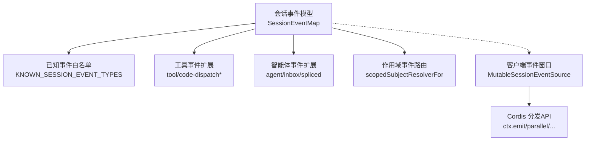
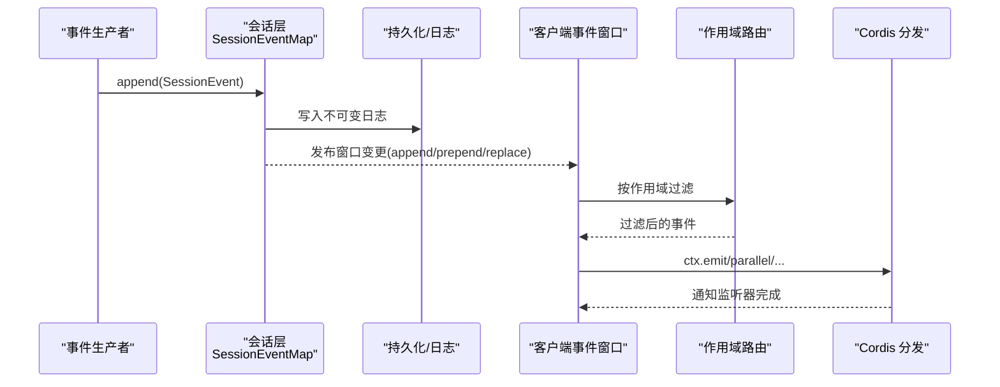
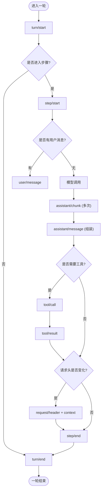
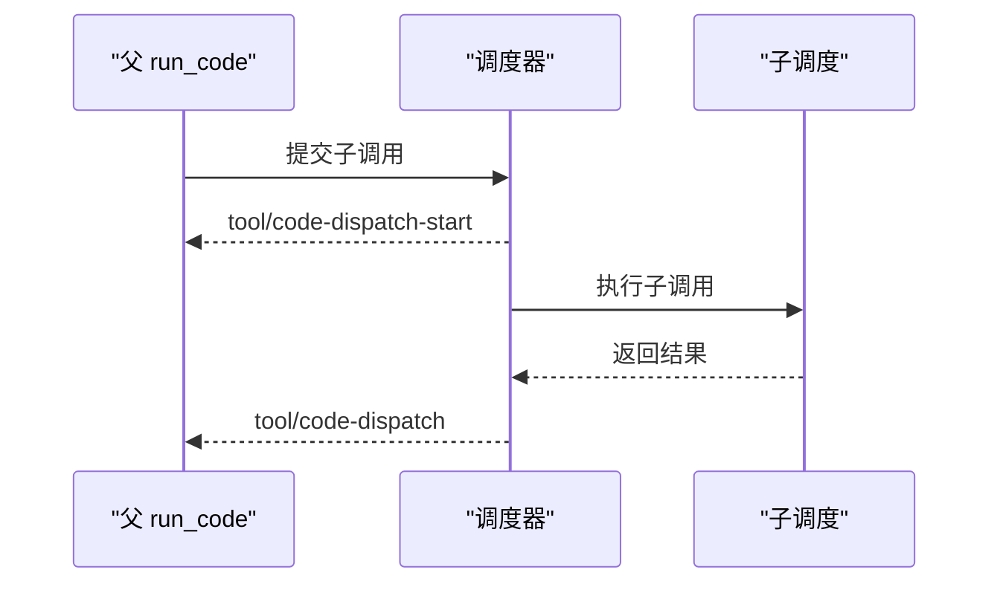
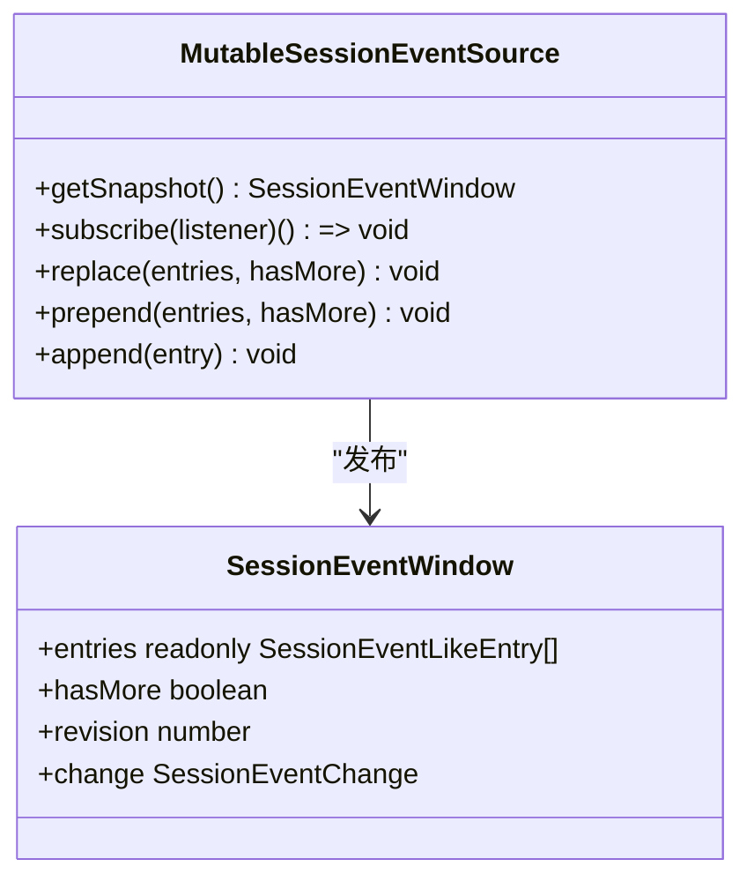
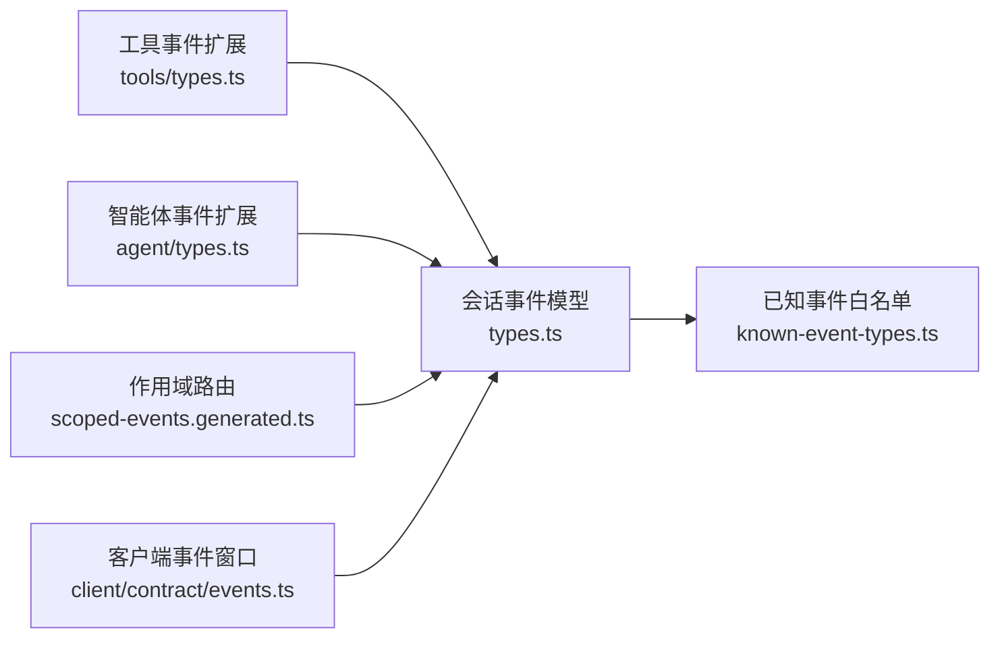

# 事件类型系统

<cite>
**本文引用的文件**
- [packages/core/session/src/types.ts](file://packages/core/session/src/types.ts)
- [packages/core/session/src/known-event-types.ts](file://packages/core/session/src/known-event-types.ts)
- [packages/core/tools/src/types.ts](file://packages/core/tools/src/types.ts)
- [packages/core/agent/src/types.ts](file://packages/core/agent/src/types.ts)
- [packages/core/scope/src/scoped-events.generated.ts](file://packages/core/scope/src/scoped-events.generated.ts)
- [packages/api/session-controller/src/client/contract/events.ts](file://packages/api/session-controller/src/client/contract/events.ts)
- [docs/cordis-api/events.md](file://docs/cordis-api/events.md)
</cite>

## 目录
1. [简介](#简介)
2. [项目结构](#项目结构)
3. [核心组件](#核心组件)
4. [架构总览](#架构总览)
5. [详细组件分析](#详细组件分析)
6. [依赖关系分析](#依赖关系分析)
7. [性能考量](#性能考量)
8. [故障排查指南](#故障排查指南)
9. [结论](#结论)
10. [附录](#附录)

## 简介
本文件系统化阐述 DeepSeek Harness 的事件类型体系，覆盖会话事件、智能体事件、工具事件、文件系统与沙箱等扩展事件的分类、触发时机、数据结构与处理流程；说明事件命名规范与版本兼容策略；给出定义与使用各类事件的实践指引；并解释安全校验机制与错误处理模式。读者可据此理解事件在会话持久化、UI 投影、跨进程传输以及插件扩展中的角色。

## 项目结构
围绕事件类型系统的核心代码分布在以下位置：
- 会话事件模型与持久化契约：packages/core/session/src/types.ts
- 已知会话事件白名单（构建期生成）：packages/core/session/src/known-event-types.ts
- 工具子系统对会话事件的扩展：packages/core/tools/src/types.ts
- 智能体子系统对会话事件的扩展：packages/core/agent/src/types.ts
- 作用域事件路由解析（用于上下文过滤）：packages/core/scope/src/scoped-events.generated.ts
- 客户端侧会话事件窗口与流式消费：packages/api/session-controller/src/client/contract/events.ts
- Cordis 事件分发 API 文档（emit/parallel/serial/bail/waterfall）：docs/cordis-api/events.md

图表来源
- [packages/core/session/src/types.ts:221-418](file://packages/core/session/src/types.ts#L221-L418)
- [packages/core/session/src/known-event-types.ts:18-70](file://packages/core/session/src/known-event-types.ts#L18-L70)
- [packages/core/tools/src/types.ts:25-57](file://packages/core/tools/src/types.ts#L25-L57)
- [packages/core/agent/src/types.ts:31-45](file://packages/core/agent/src/types.ts#L31-L45)
- [packages/core/scope/src/scoped-events.generated.ts:10-50](file://packages/core/scope/src/scoped-events.generated.ts#L10-L50)
- [packages/api/session-controller/src/client/contract/events.ts:94-158](file://packages/api/session-controller/src/client/contract/events.ts#L94-L158)
- [docs/cordis-api/events.md:8-123](file://docs/cordis-api/events.md#L8-L123)

章节来源
- [packages/core/session/src/types.ts:221-418](file://packages/core/session/src/types.ts#L221-L418)
- [packages/core/session/src/known-event-types.ts:18-70](file://packages/core/session/src/known-event-types.ts#L18-L70)
- [packages/core/tools/src/types.ts:25-57](file://packages/core/tools/src/types.ts#L25-L57)
- [packages/core/agent/src/types.ts:31-45](file://packages/core/agent/src/types.ts#L31-L45)
- [packages/core/scope/src/scoped-events.generated.ts:10-50](file://packages/core/scope/src/scoped-events.generated.ts#L10-L50)
- [packages/api/session-controller/src/client/contract/events.ts:94-158](file://packages/api/session-controller/src/client/contract/events.ts#L94-L158)
- [docs/cordis-api/events.md:8-123](file://docs/cordis-api/events.md#L8-L123)

## 核心组件
- 会话事件模型 SessionEventMap：定义所有会话级事件键及其负载，包括 turn/step 边界、用户消息、助手消息、工具调用与结果、请求头快照、种子结束标记等。
- 表面事件 SurfaceEventType：限定可在有序“表面”呈现的事件子集（用户消息、助手消息、工具结果），并附带 surfaceOp/sourceEventSeqs 以支持压缩替换与溯源。
- 已知事件白名单 KNOWN_SESSION_EVENT_TYPES：构建期生成的受信任事件集合，读取持久化日志时拒绝未知类型，避免静默跳过导致重建错误。
- 工具事件扩展：为 PTC（run_code）模式提供 tool/code-dispatch-start 与 tool/code-dispatch，记录子调度的生命周期与结果。
- 智能体事件扩展：记录智能体收件箱的变更（spliced），便于 UI 同步与恢复。
- 作用域事件路由：根据事件负载提取路由键，实现基于 agent/session 的作用域过滤。
- 客户端事件窗口：将事件序列组织为可增量更新的窗口，支持 replace/prepend/append 三种变更语义，并通过 ObservableSnapshot 发布。
- Cordis 事件分发：提供 emit/parallel/serial/bail/waterfall 多种分发模式，供各子系统注册监听器与编排行为。

章节来源
- [packages/core/session/src/types.ts:221-418](file://packages/core/session/src/types.ts#L221-L418)
- [packages/core/session/src/known-event-types.ts:18-70](file://packages/core/session/src/known-event-types.ts#L18-L70)
- [packages/core/tools/src/types.ts:25-57](file://packages/core/tools/src/types.ts#L25-L57)
- [packages/core/agent/src/types.ts:31-45](file://packages/core/agent/src/types.ts#L31-L45)
- [packages/core/scope/src/scoped-events.generated.ts:10-50](file://packages/core/scope/src/scoped-events.generated.ts#L10-L50)
- [packages/api/session-controller/src/client/contract/events.ts:94-158](file://packages/api/session-controller/src/client/contract/events.ts#L94-L158)
- [docs/cordis-api/events.md:8-123](file://docs/cordis-api/events.md#L8-L123)

## 架构总览
下图展示事件从产生到被消费的关键路径：生产者通过会话或上下文事件 API 写入事件；会话层将其纳入不可变日志；客户端侧通过事件窗口订阅增量更新；作用域路由确保事件仅投递给相关上下文；Cordis 分发模式决定监听器的执行顺序与短路策略。

图表来源
- [packages/core/session/src/types.ts:221-418](file://packages/core/session/src/types.ts#L221-L418)
- [packages/api/session-controller/src/client/contract/events.ts:94-158](file://packages/api/session-controller/src/client/contract/events.ts#L94-L158)
- [packages/core/scope/src/scoped-events.generated.ts:10-50](file://packages/core/scope/src/scoped-events.generated.ts#L10-L50)
- [docs/cordis-api/events.md:8-123](file://docs/cordis-api/events.md#L8-L123)

## 详细组件分析

### 会话事件与会话生命周期
- 触发时机
  - turn/start 与 turn/end：每轮对话开始与结束，turn/end 携带 TurnEndReason（completed/aborted/error/max-tokens/interrupted）。
  - step/start 与 step/end：一轮内的单次模型调用及工具执行周期。
  - user/message：用户输入或注入的系统上下文。
  - assistant/chunk 与 assistant/message：流式分片与组装后的助手消息，后者携带 usage 与可能的 interrupted 标记。
  - tool/call 与 tool/result：模型发起的工具调用与工具返回结果（含可选 meta）。
  - request/header 与 request/context：请求头快照与上下文元数据变化。
  - session/end-seed：标记构造种子历史结束，区分种子与后续实时事件。
- 数据结构要点
  - SessionEvent 是严格判别联合，type 精确对应 data 形状。
  - 表面事件（user/message、assistant/message、tool/result）可携带 surfaceOp 与 sourceEventSeqs，用于 UI 投影与压缩替换。
- 处理流程
  - 写入：会话层将事件追加至不可变日志，保证 seq/time 单调递增。
  - 投影：UI 基于表面事件构建消息树，支持 replace 操作进行压缩。
  - 持久化：完整日志原样落盘，加载时由白名单校验类型。

图表来源
- [packages/core/session/src/types.ts:221-325](file://packages/core/session/src/types.ts#L221-L325)

章节来源
- [packages/core/session/src/types.ts:221-418](file://packages/core/session/src/types.ts#L221-L418)

### 工具事件（PTC 子调度）
- 触发时机
  - tool/code-dispatch-start：当 run_code 程序内部启动一个子调度时记录，包含父/子 callId、工具名与标准化参数。
  - tool/code-dispatch：子调度结束时记录，包含最终内容块与是否错误。
- 用途
  - 为 UI 提供细粒度运行态可视化，并与 tool/result 的渲染路径保持一致。
  - 日志中保留完整的子调用轨迹，便于回放与诊断。

图表来源
- [packages/core/tools/src/types.ts:25-57](file://packages/core/tools/src/types.ts#L25-L57)

章节来源
- [packages/core/tools/src/types.ts:25-57](file://packages/core/tools/src/types.ts#L25-L57)

### 智能体事件（收件箱变更）
- 触发时机
  - agent/inbox/spliced：智能体的待处理消息列表发生规范化变更时记录，包含目标队列、插入/删除范围与结果。
- 用途
  - UI 同步待办与消息队列；恢复时可重放以重建状态。

章节来源
- [packages/core/agent/src/types.ts:31-45](file://packages/core/agent/src/types.ts#L31-L45)

### 作用域事件路由
- 功能
  - 根据事件负载提取路由键（如 agent/session），实现作用域内的事件投递与过滤。
  - 某些事件仅做存在性检查（null resolver），不暴露外部路由键。
- 典型事件
  - agent/*、tools/*、session/*、subagent/* 等。

章节来源
- [packages/core/scope/src/scoped-events.generated.ts:10-50](file://packages/core/scope/src/scoped-events.generated.ts#L10-L50)

### 客户端事件窗口与流式消费
- 能力
  - MutableSessionEventSource 维护一个不可变的窗口节点树，支持 replace/prepend/append 三种变更。
  - 每次变更发布新的快照，包含 entries、hasMore、revision 与 change 描述。
- 消费模式
  - 订阅者接收同步变更，适合 UI 增量渲染与滚动加载。

图表来源
- [packages/api/session-controller/src/client/contract/events.ts:94-158](file://packages/api/session-controller/src/client/contract/events.ts#L94-L158)

章节来源
- [packages/api/session-controller/src/client/contract/events.ts:94-158](file://packages/api/session-controller/src/client/contract/events.ts#L94-L158)

### 事件分发模式（Cordis）
- 模式
  - emit：同步派发，忽略返回值。
  - parallel：并发等待所有监听器。
  - serial：依次等待，直到某监听器提前终止。
  - bail：遇到第一个同步提前终止值即停止。
  - waterfall：最后一个参数为 next 回调，监听器可包装调用链。
- 适用场景
  - 审计/遥测常用 parallel；审批/拦截常用 serial/bail；中间件式处理常用 waterfall。

章节来源
- [docs/cordis-api/events.md:8-123](file://docs/cordis-api/events.md#L8-L123)

## 依赖关系分析
- 会话事件模型是核心，其他子系统通过模块声明扩展 SessionEventMap。
- 已知事件白名单由构建脚本生成，与 SessionEventMap 保持同步，用于持久化读取时的类型守卫。
- 客户端事件窗口依赖会话事件类型，但不直接依赖持久化实现。
- 作用域路由依赖事件负载结构，用于上下文过滤。

图表来源
- [packages/core/session/src/types.ts:221-418](file://packages/core/session/src/types.ts#L221-L418)
- [packages/core/session/src/known-event-types.ts:18-70](file://packages/core/session/src/known-event-types.ts#L18-L70)
- [packages/core/tools/src/types.ts:25-57](file://packages/core/tools/src/types.ts#L25-L57)
- [packages/core/agent/src/types.ts:31-45](file://packages/core/agent/src/types.ts#L31-L45)
- [packages/core/scope/src/scoped-events.generated.ts:10-50](file://packages/core/scope/src/scoped-events.generated.ts#L10-L50)
- [packages/api/session-controller/src/client/contract/events.ts:94-158](file://packages/api/session-controller/src/client/contract/events.ts#L94-L158)

章节来源
- [packages/core/session/src/types.ts:221-418](file://packages/core/session/src/types.ts#L221-L418)
- [packages/core/session/src/known-event-types.ts:18-70](file://packages/core/session/src/known-event-types.ts#L18-L70)
- [packages/core/tools/src/types.ts:25-57](file://packages/core/tools/src/types.ts#L25-L57)
- [packages/core/agent/src/types.ts:31-45](file://packages/core/agent/src/types.ts#L31-L45)
- [packages/core/scope/src/scoped-events.generated.ts:10-50](file://packages/core/scope/src/scoped-events.generated.ts#L10-L50)
- [packages/api/session-controller/src/client/contract/events.ts:94-158](file://packages/api/session-controller/src/client/contract/events.ts#L94-L158)

## 性能考量
- 事件追加与窗口合并采用不可变结构，避免深拷贝开销，适合高频增量更新。
- 表面事件支持 replace 压缩，减少 UI 节点数量，提升渲染性能。
- 作用域路由仅在必要时计算路由键，降低无关上下文的监听器开销。
- 分发模式选择影响吞吐与延迟：parallel 提高并发度但需控制监听器成本；serial/bail 可用于快速失败与限流。

## 故障排查指南
- 未知事件类型
  - 现象：加载持久化日志时报错或拒绝读取。
  - 原因：事件类型不在 KNOWN_SESSION_EVENT_TYPES 中。
  - 处理：确保新增事件类型已加入白名单并重新生成。
- 非 JSON 可序列化负载
  - 现象：会话追加失败。
  - 原因：事件负载包含不可序列化的对象。
  - 处理：仅使用 JSON 可序列化数据，或使用 meta 字段承载可序列化信息。
- 作用域过滤导致事件未到达
  - 现象：监听器未收到事件。
  - 原因：事件负载无法提取路由键或被全局选项限制。
  - 处理：检查 scopedSubjectResolverFor 映射与 EventOptions.global 设置。
- 分发模式误用
  - 现象：UI 卡顿或逻辑未按预期短路。
  - 原因：使用了错误的分发模式。
  - 处理：根据需求选择 emit/parallel/serial/bail/waterfall。

章节来源
- [packages/core/session/src/known-event-types.ts:18-70](file://packages/core/session/src/known-event-types.ts#L18-L70)
- [packages/core/session/src/types.ts:221-418](file://packages/core/session/src/types.ts#L221-L418)
- [packages/core/scope/src/scoped-events.generated.ts:10-50](file://packages/core/scope/src/scoped-events.generated.ts#L10-L50)
- [docs/cordis-api/events.md:8-123](file://docs/cordis-api/events.md#L8-L123)

## 结论
DeepSeek Harness 的事件类型系统以会话事件为核心，通过严格的类型系统与构建期白名单保障安全性与可演进性；工具与智能体事件以模块声明方式扩展，保持高内聚低耦合；客户端事件窗口提供高效的增量消费；作用域路由与 Cordis 分发模式共同支撑复杂交互与可扩展生态。遵循命名规范与版本策略，可在不破坏旧运行时的前提下持续演进。

## 附录

### 事件分类与用途速览
- 会话事件
  - turn/step 边界：turn/start、turn/end、step/start、step/end
  - 消息：user/message、assistant/chunk、assistant/message
  - 工具：tool/call、tool/result
  - 请求：request/header、request/context
  - 生命周期：session/end-seed
- 工具事件
  - tool/code-dispatch-start、tool/code-dispatch（PTC 子调度）
- 智能体事件
  - agent/inbox/spliced（收件箱变更）
- 作用域事件
  - agent/*、tools/*、session/*、subagent/* 等（用于上下文过滤）

章节来源
- [packages/core/session/src/types.ts:221-325](file://packages/core/session/src/types.ts#L221-L325)
- [packages/core/tools/src/types.ts:25-57](file://packages/core/tools/src/types.ts#L25-L57)
- [packages/core/agent/src/types.ts:31-45](file://packages/core/agent/src/types.ts#L31-L45)
- [packages/core/scope/src/scoped-events.generated.ts:10-50](file://packages/core/scope/src/scoped-events.generated.ts#L10-L50)

### 命名规范与版本兼容策略
- 命名规范
  - 使用分层命名，如 domain/subdomain/event（例如 tool/code-dispatch、agent/inbox/spliced）。
  - 动词/名词组合表达清晰语义（start/end/call/result/change 等）。
- 版本兼容
  - SESSION_FORMAT_VERSION 作为磁盘格式版本，仅在破坏性变更时递增。
  - 新增普通事件类型不要求版本升级，但会被 KNOWN_SESSION_EVENT_TYPES 白名单保护，旧运行时拒绝未知类型。
  - 表面事件通过 surfaceOp/sourceEventSeqs 支持压缩与溯源，向后兼容。

章节来源
- [packages/core/session/src/types.ts:33-56](file://packages/core/session/src/types.ts#L33-L56)
- [packages/core/session/src/known-event-types.ts:18-70](file://packages/core/session/src/known-event-types.ts#L18-L70)
- [packages/core/session/src/types.ts:335-381](file://packages/core/session/src/types.ts#L335-L381)

### 安全验证与错误处理
- 安全验证
  - 所有事件负载必须为 JSON 可序列化，否则在追加时被拒绝。
  - 持久化读取时仅允许 KNOWN_SESSION_EVENT_TYPES 中的事件类型。
- 错误处理
  - turn/end 的 reason 明确区分 completed/aborted/error/max-tokens/interrupted。
  - tool/result 可携带 error 字段标识工具内部失败。
  - 作用域路由缺失时仅做存在性检查，避免泄露敏感路由键。

章节来源
- [packages/core/session/src/types.ts:152-177](file://packages/core/session/src/types.ts#L152-L177)
- [packages/core/session/src/types.ts:268-286](file://packages/core/session/src/types.ts#L268-L286)
- [packages/core/session/src/known-event-types.ts:18-70](file://packages/core/session/src/known-event-types.ts#L18-L70)

### 代码示例路径（定义与使用）
- 定义会话事件类型（扩展 SessionEventMap）
  - 工具事件扩展：[packages/core/tools/src/types.ts:25-57](file://packages/core/tools/src/types.ts#L25-L57)
  - 智能体事件扩展：[packages/core/agent/src/types.ts:31-45](file://packages/core/agent/src/types.ts#L31-L45)
- 使用事件窗口消费事件
  - 创建与订阅：[packages/api/session-controller/src/client/contract/events.ts:94-158](file://packages/api/session-controller/src/client/contract/events.ts#L94-L158)
- 注册监听器与分发事件
  - 分发模式参考：[docs/cordis-api/events.md:8-123](file://docs/cordis-api/events.md#L8-L123)