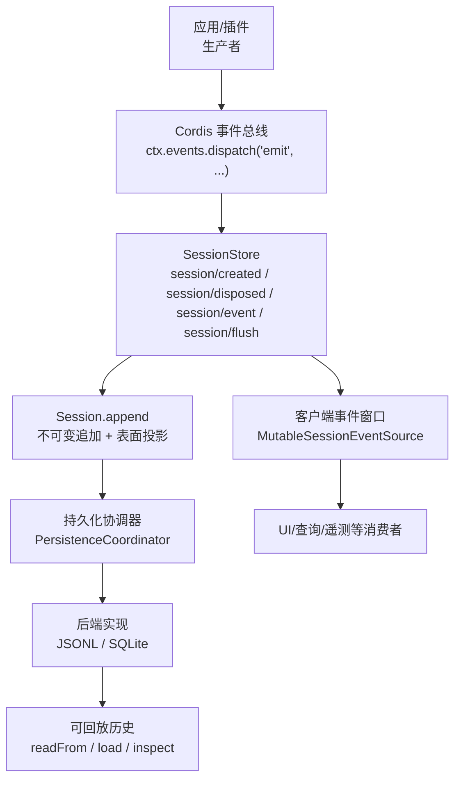
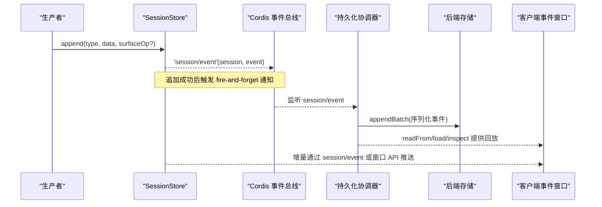
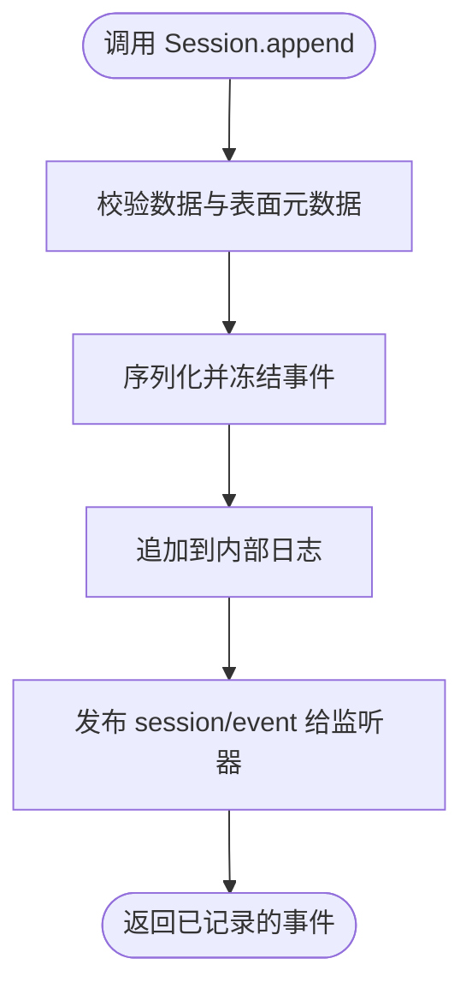
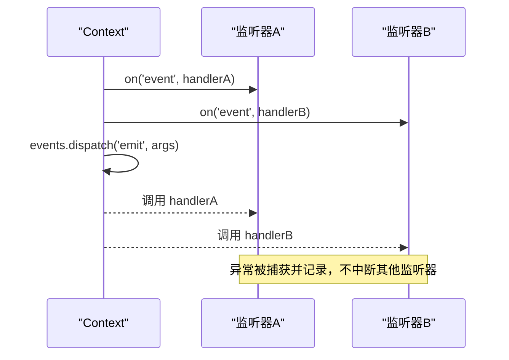
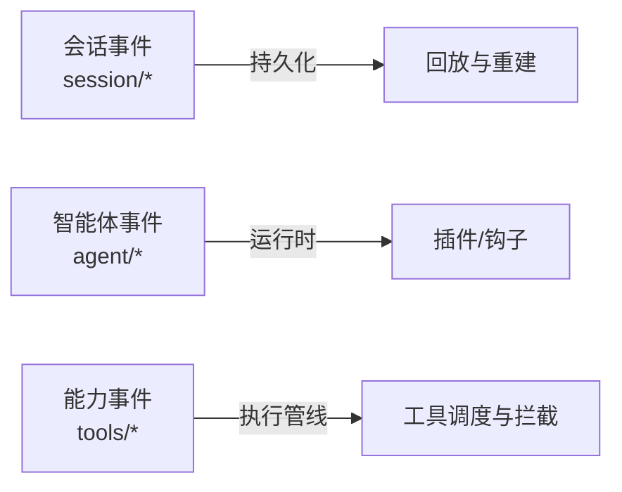
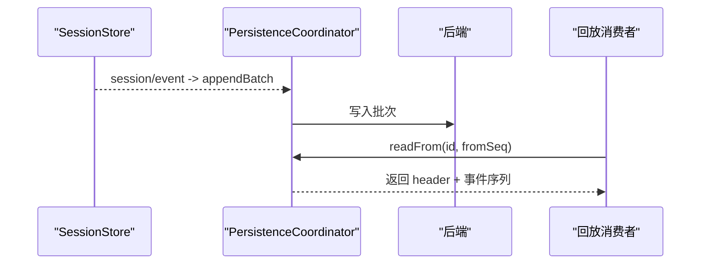
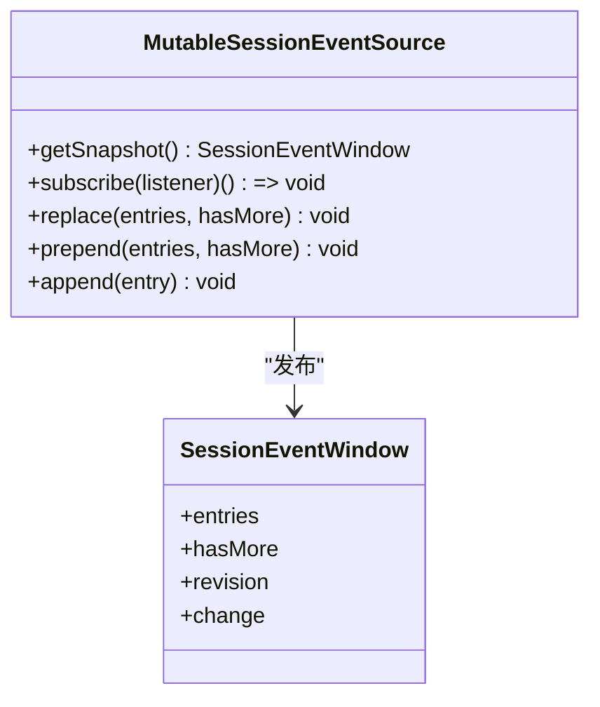
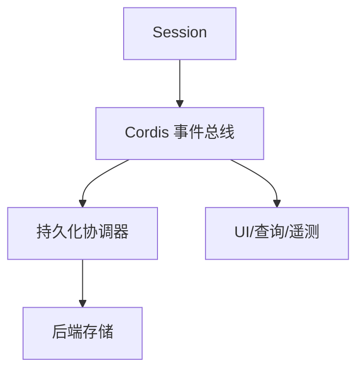

# 事件驱动架构

<cite>
**本文引用的文件**
- [packages/core/session/src/index.ts](file://packages/core/session/src/index.ts)
- [packages/core/session/src/types.ts](file://packages/core/session/src/types.ts)
- [packages/api/session-controller/src/client/contract/events.ts](file://packages/api/session-controller/src/client/contract/events.ts)
- [packages/session/session-persistence/src/coordinator.ts](file://packages/session/session-persistence/src/coordinator.ts)
- [packages/session/session-persistence/src/index.ts](file://packages/session/session-persistence/src/index.ts)
- [packages/session/session-persistence/tests/persistence.spec.ts](file://packages/session/session-persistence/tests/persistence.spec.ts)
- [packages/core/scope/tests/scope.spec.ts](file://packages/core/scope/tests/scope.spec.ts)
- [packages/subagent/subagent/src/lifecycle.ts](file://packages/subagent/subagent/src/lifecycle.ts)
- [packages/extensions/tool-cordis/src/api-catalog.ts](file://packages/extensions/tool-cordis/src/api-catalog.ts)
- [docs/event-producer-consumer.md](file://docs/event-producer-consumer.md)
- [.agents/notes/implemented/architecture/2026-06-30-event-domain-semantics.md](file://.agents/notes/implemented/architecture/2026-06-30-event-domain-semantics.md)
- [.agents/notes/implemented/architecture/2026-06-18-shared-persistence-write-coordinator.md](file://.agents/notes/implemented/architecture/2026-06-18-shared-persistence-write-coordinator.md)
- [.agents/notes/implemented/architecture/2026-08-08-bounded-session-persistence-write-batching.zh.md](file://.agents/notes/implemented/architecture/2026-08-08-bounded-session-persistence-write-batching.zh.md)
- [.agents/notes/implemented/bug-fix/2026-08-04-load-pre-react-loop-sessions.zh.md](file://.agents/notes/implemented/bug-fix/2026-08-04-load-pre-react-loop-sessions.zh.md)
</cite>

## 目录
1. [简介](#简介)
2. [项目结构](#项目结构)
3. [核心组件](#核心组件)
4. [架构总览](#架构总览)
5. [详细组件分析](#详细组件分析)
6. [依赖关系分析](#依赖关系分析)
7. [性能考量](#性能考量)
8. [故障排查指南](#故障排查指南)
9. [结论](#结论)
10. [附录](#附录)

## 简介
本文件面向 DeepSeek Harness 的事件驱动架构，围绕“生产者-消费者模型”和“事件总线”展开，系统阐述会话事件、智能体事件与能力事件的分类与使用场景；说明事件的持久化机制与回放能力；介绍监听器的注册与注销（同步与异步）；并提供发布/订阅事件以及实现自定义事件处理器的实践指引。

## 项目结构
DeepSeek Harness 的事件系统以“会话事件日志”为核心事实源，通过 Cordis 事件总线在进程内广播，并由持久化子系统将事件落盘，形成可回放的历史。关键位置包括：
- 会话事件定义与追加入口：packages/core/session
- 客户端事件窗口与消费视图：packages/api/session-controller
- 持久化协调器与后端抽象：packages/session/session-persistence
- 事件矩阵与领域语义文档：docs 与 .agents/notes

图表来源
- [packages/core/session/src/index.ts:42-86](file://packages/core/session/src/index.ts#L42-L86)
- [packages/core/session/src/index.ts:602-653](file://packages/core/session/src/index.ts#L602-L653)
- [packages/session/session-persistence/src/coordinator.ts:578-606](file://packages/session/session-persistence/src/coordinator.ts#L578-L606)
- [packages/api/session-controller/src/client/contract/events.ts:94-158](file://packages/api/session-controller/src/client/contract/events.ts#L94-L158)

章节来源
- [packages/core/session/src/index.ts:42-86](file://packages/core/session/src/index.ts#L42-L86)
- [packages/core/session/src/index.ts:602-653](file://packages/core/session/src/index.ts#L602-L653)
- [packages/session/session-persistence/src/coordinator.ts:578-606](file://packages/session/session-persistence/src/coordinator.ts#L578-L606)
- [packages/api/session-controller/src/client/contract/events.ts:94-158](file://packages/api/session-controller/src/client/contract/events.ts#L94-L158)

## 核心组件
- 会话与会话存储
  - Session：不可变追加的会话日志，维护有序“表面”用于推导 LLM 消息历史。
  - SessionStore：管理会话生命周期，发布 session/created、session/disposed、session/event、session/flush。
- 事件总线
  - 基于 Cordis 的 ctx.events.dispatch，支持 emit、waterfall、serial、parallel 等模式。
- 持久化协调器
  - PersistenceCoordinator：统一编排写入路径，按会话 ID 串行化，提供 load/inspect/readFrom 等回放原语。
- 客户端事件窗口
  - MutableSessionEventSource：维护连续事件窗口，支持 replace/prepend/append 并同步通知订阅者。

章节来源
- [packages/core/session/src/index.ts:42-86](file://packages/core/session/src/index.ts#L42-L86)
- [packages/core/session/src/index.ts:602-653](file://packages/core/session/src/index.ts#L602-L653)
- [packages/session/session-persistence/src/coordinator.ts:578-606](file://packages/session/session-persistence/src/coordinator.ts#L578-L606)
- [packages/api/session-controller/src/client/contract/events.ts:94-158](file://packages/api/session-controller/src/client/contract/events.ts#L94-L158)

## 架构总览
下图展示事件从生产到消费的完整链路：生产者通过 Session.append 提交事件，SessionStore 发布 session/event 等总线事件；持久化协调器订阅这些事件进行批写与回放；客户端通过事件窗口消费历史与增量。

图表来源
- [packages/core/session/src/index.ts:602-653](file://packages/core/session/src/index.ts#L602-L653)
- [packages/session/session-persistence/src/index.ts:244-263](file://packages/session/session-persistence/src/index.ts#L244-L263)
- [packages/api/session-controller/src/client/contract/events.ts:118-158](file://packages/api/session-controller/src/client/contract/events.ts#L118-L158)

## 详细组件分析

### 会话事件与表面投影
- 事件类型与契约
  - SessionEventMap 定义了所有会话事件（如 turn/start、user/message、assistant/message、tool/result 等），每个事件携带不可变的 seq/time/data。
  - SurfaceEventType 限定可进入“有序表面”的事件类型，配合 surfaceOp 控制追加或替换，从而稳定推导 LLM 消息历史。
- 不可变性与校验
  - Session.append 对数据做 JSON 序列化快照与深度冻结，拒绝非 JSON 值；同时校验请求头格式与消息形状，保证回放一致性。
- 派生历史
  - deriveMessages 基于有序表面节点生成 Message[]，仅包含消息型事件，屏蔽 chunk、边界标记等非消息事件。

图表来源
- [packages/core/session/src/index.ts:602-653](file://packages/core/session/src/index.ts#L602-L653)
- [packages/core/session/src/types.ts:221-325](file://packages/core/session/src/types.ts#L221-L325)
- [packages/core/session/src/types.ts:335-381](file://packages/core/session/src/types.ts#L335-L381)

章节来源
- [packages/core/session/src/types.ts:221-325](file://packages/core/session/src/types.ts#L221-L325)
- [packages/core/session/src/types.ts:335-381](file://packages/core/session/src/types.ts#L335-L381)
- [packages/core/session/src/index.ts:602-653](file://packages/core/session/src/index.ts#L602-L653)

### 事件总线与监听器注册/注销
- 模式与范围
  - emit：单向通知，失败被隔离且不影响其他监听器。
  - waterfall/serial/parallel：用于需要串联、顺序或并行处理的场景（如工具执行管线、持久化 flush）。
  - 作用域过滤：可通过 scope 限制监听器只接收特定上下文的事件。
- 注册与注销
  - 通过 ctx.on 注册监听器，返回取消函数；dispose 时自动清理。
  - 全局监听器 { global: true } 可跨作用域接收事件。

图表来源
- [packages/core/scope/tests/scope.spec.ts:108-142](file://packages/core/scope/tests/scope.spec.ts#L108-L142)
- [packages/subagent/subagent/src/lifecycle.ts:91-123](file://packages/subagent/subagent/src/lifecycle.ts#L91-L123)

章节来源
- [packages/core/scope/tests/scope.spec.ts:108-142](file://packages/core/scope/tests/scope.spec.ts#L108-L142)
- [packages/subagent/subagent/src/lifecycle.ts:91-123](file://packages/subagent/subagent/src/lifecycle.ts#L91-L123)

### 事件分类与使用场景
- 会话事件（session/*）
  - 作为“事实日志”，承载 turn/step、消息、工具调用/结果、请求头等，是回放与重建历史的唯一权威来源。
- 智能体事件（agent/*）
  - 运行时信号，向插件暴露 Agent 句柄，用于流程控制、状态同步等。
- 能力事件（tools/*）
  - 工具注册与执行管线相关事件，支撑工具链路的拦截与增强。

图表来源
- [.agents/notes/implemented/architecture/2026-06-30-event-domain-semantics.md:1-17](file://.agents/notes/implemented/architecture/2026-06-30-event-domain-semantics.md#L1-L17)
- [docs/event-producer-consumer.md:8-74](file://docs/event-producer-consumer.md#L8-L74)

章节来源
- [.agents/notes/implemented/architecture/2026-06-30-event-domain-semantics.md:1-17](file://.agents/notes/implemented/architecture/2026-06-30-event-domain-semantics.md#L1-L17)
- [docs/event-producer-consumer.md:8-74](file://docs/event-producer-consumer.md#L8-L74)

### 持久化机制与回放
- 写入路径
  - 持久化协调器订阅会话事件，按会话 ID 串行化写入，避免并发交错；支持批量窗口与重试。
- 回放接口
  - load/inspect：加载完整前缀；readFrom：从指定 seq 起读取后缀，适合增量重放。
- 兼容性
  - 对旧版会话格式进行投影转换，确保回放视图一致。

图表来源
- [packages/session/session-persistence/src/coordinator.ts:578-606](file://packages/session/session-persistence/src/coordinator.ts#L578-L606)
- [packages/session/session-persistence/src/index.ts:244-263](file://packages/session/session-persistence/src/index.ts#L244-L263)
- [.agents/notes/implemented/bug-fix/2026-08-04-load-pre-react-loop-sessions.zh.md:1-17](file://.agents/notes/implemented/bug-fix/2026-08-04-load-pre-react-loop-sessions.zh.md#L1-L17)

章节来源
- [packages/session/session-persistence/src/coordinator.ts:578-606](file://packages/session/session-persistence/src/coordinator.ts#L578-L606)
- [packages/session/session-persistence/src/index.ts:244-263](file://packages/session/session-persistence/src/index.ts#L244-L263)
- [.agents/notes/implemented/bug-fix/2026-08-04-load-pre-react-loop-sessions.zh.md:1-17](file://.agents/notes/implemented/bug-fix/2026-08-04-load-pre-react-loop-sessions.zh.md#L1-L17)

### 客户端事件窗口与消费
- 窗口模型
  - MutableSessionEventSource 维护一个连续事件窗口，支持 replace（全量替换）、prepend（前置分页）、append（尾部追加）。
- 订阅与更新
  - subscribe 返回取消函数；每次变更同步发布 revision 与 change 描述，便于 UI/查询高效增量渲染。

图表来源
- [packages/api/session-controller/src/client/contract/events.ts:94-158](file://packages/api/session-controller/src/client/contract/events.ts#L94-L158)

章节来源
- [packages/api/session-controller/src/client/contract/events.ts:94-158](file://packages/api/session-controller/src/client/contract/events.ts#L94-L158)

### 代码示例与实践指引
- 发布事件（会话事件）
  - 通过 Session.append(type, data, surfaceOp?) 提交事件；对于消息型事件需指定 surfaceOp 与 sourceEventSeqs。
  - 参考路径：[packages/core/session/src/index.ts:602-653](file://packages/core/session/src/index.ts#L602-L653)、[packages/core/session/src/types.ts:335-381](file://packages/core/session/src/types.ts#L335-L381)
- 订阅事件（会话事件）
  - 使用 ctx.on('session/event', (session, event) => {...}) 监听；失败会被隔离记录。
  - 参考路径：[packages/core/session/src/index.ts:42-86](file://packages/core/session/src/index.ts#L42-L86)
- 订阅事件（智能体/能力事件）
  - 通过 ctx.on('agent/*' | 'tools/*', handler) 订阅；注意不同模式的语义差异。
  - 参考路径：[packages/subagent/subagent/src/lifecycle.ts:91-123](file://packages/subagent/subagent/src/lifecycle.ts#L91-L123)、[docs/event-producer-consumer.md:8-74](file://docs/event-producer-consumer.md#L8-L74)
- 实现自定义事件处理器
  - 在插件中注册监听器，处理业务逻辑；必要时结合 scope 过滤事件范围。
  - 参考路径：[packages/core/scope/tests/scope.spec.ts:108-142](file://packages/core/scope/tests/scope.spec.ts#L108-L142)

章节来源
- [packages/core/session/src/index.ts:42-86](file://packages/core/session/src/index.ts#L42-L86)
- [packages/core/session/src/index.ts:602-653](file://packages/core/session/src/index.ts#L602-L653)
- [packages/core/session/src/types.ts:335-381](file://packages/core/session/src/types.ts#L335-L381)
- [packages/subagent/subagent/src/lifecycle.ts:91-123](file://packages/subagent/subagent/src/lifecycle.ts#L91-L123)
- [packages/core/scope/tests/scope.spec.ts:108-142](file://packages/core/scope/tests/scope.spec.ts#L108-L142)
- [docs/event-producer-consumer.md:8-74](file://docs/event-producer-consumer.md#L8-L74)

## 依赖关系分析
- 松耦合
  - Session 仅负责追加与表面投影；持久化通过事件订阅解耦。
- 明确边界
  - 会话事件为“事实日志”，智能体/能力事件为“运行时通道”，职责清晰。
- 外部依赖
  - Cordis 事件总线、作用域过滤、LLM 消息类型等。

图表来源
- [packages/core/session/src/index.ts:42-86](file://packages/core/session/src/index.ts#L42-L86)
- [packages/session/session-persistence/src/coordinator.ts:578-606](file://packages/session/session-persistence/src/coordinator.ts#L578-L606)

章节来源
- [packages/core/session/src/index.ts:42-86](file://packages/core/session/src/index.ts#L42-L86)
- [packages/session/session-persistence/src/coordinator.ts:578-606](file://packages/session/session-persistence/src/coordinator.ts#L578-L606)

## 性能考量
- 批处理窗口
  - 持久化写入采用固定时间窗口聚合，减少频繁 I/O；高频突发可显著降低写入次数。
- 串行化与隔离
  - 按会话 ID 串行化写入，避免交错；监听器失败隔离，不影响主流程。
- 回放优化
  - readFrom 支持从指定 seq 起读，适合增量重放；前端窗口合并历史与增量，避免重复扫描。

章节来源
- [.agents/notes/implemented/architecture/2026-08-08-bounded-session-persistence-write-batching.zh.md:47-60](file://.agents/notes/implemented/architecture/2026-08-08-bounded-session-persistence-write-batching.zh.md#L47-L60)
- [packages/session/session-persistence/src/index.ts:244-263](file://packages/session/session-persistence/src/index.ts#L244-L263)

## 故障排查指南
- 常见错误
  - 非 JSON 可序列化数据：Session.append 会拒绝并抛出错误。
  - 表面元数据非法：surfaceOp/sourceEventSeqs 不符合约定将被拒绝。
  - 监听器异常：被捕获并记录，不会中断后续监听器。
- 定位方法
  - 检查 Session.append 的入参与 surfaceOp 设置。
  - 查看持久化后端的 reject 原因（如非 JSON 数据）。
  - 通过 readFrom/load/inspect 回放历史，对比期望与真实事件。

章节来源
- [packages/core/session/src/index.ts:602-653](file://packages/core/session/src/index.ts#L602-L653)
- [packages/session/session-persistence/tests/persistence.spec.ts:147-160](file://packages/session/session-persistence/tests/persistence.spec.ts#L147-L160)

## 结论
DeepSeek Harness 的事件驱动架构以“会话事件日志”为中心，借助 Cordis 事件总线实现松耦合的生产者-消费者模型；通过持久化协调器保障可靠写入与回放；客户端事件窗口提供高效的增量消费。该设计清晰区分了会话、智能体与能力三类事件，既满足实时性又具备强一致的回放能力。

## 附录
- 事件矩阵与领域语义
  - 事件矩阵展示了各包对 harness 自有事件的发布与订阅关系。
  - 领域语义明确了 session/*、agent/*、tools/* 的职责边界。

章节来源
- [docs/event-producer-consumer.md:8-74](file://docs/event-producer-consumer.md#L8-L74)
- [.agents/notes/implemented/architecture/2026-06-30-event-domain-semantics.md:1-17](file://.agents/notes/implemented/architecture/2026-06-30-event-domain-semantics.md#L1-L17)