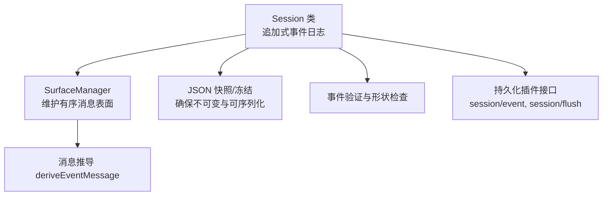
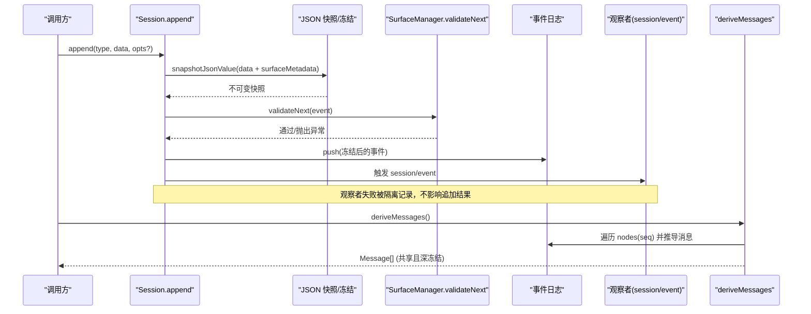
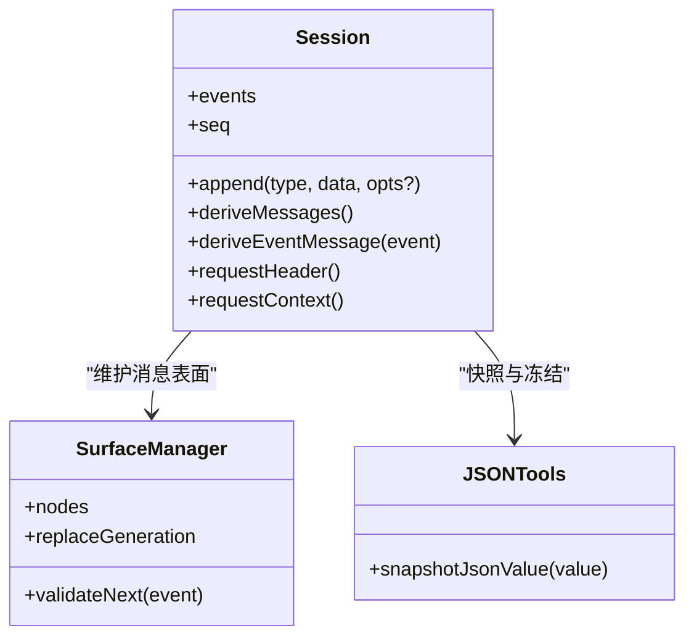
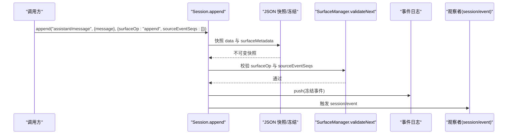
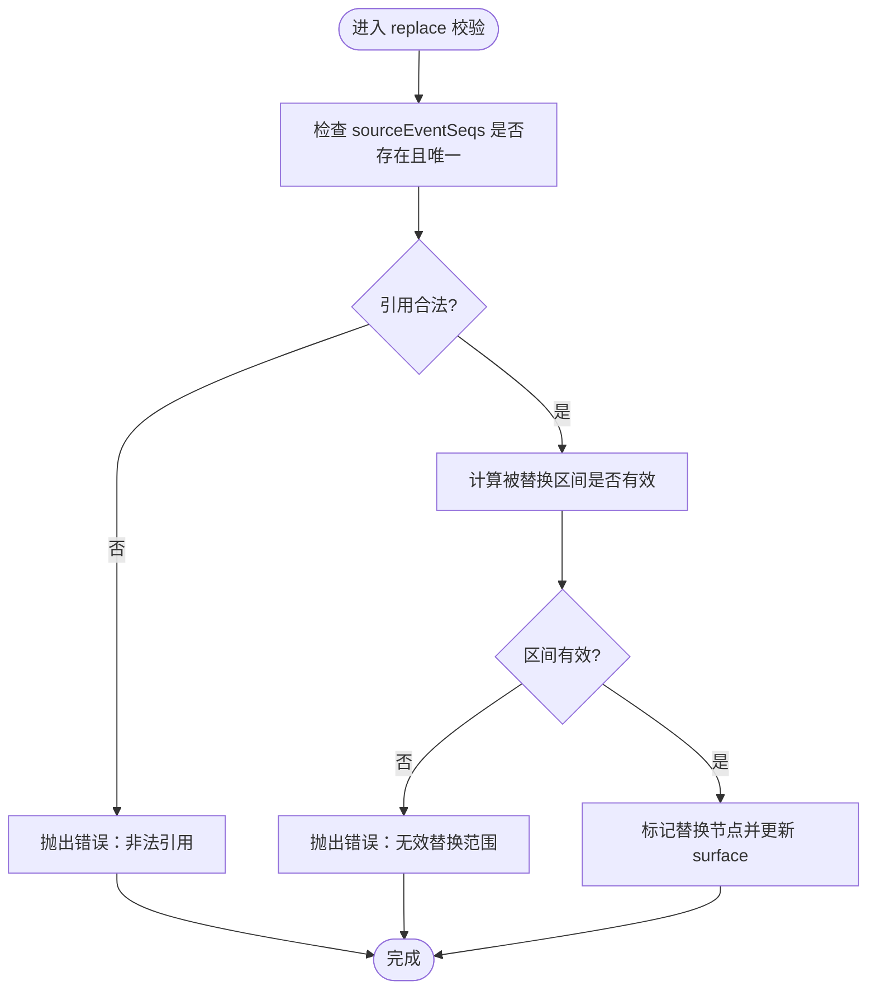
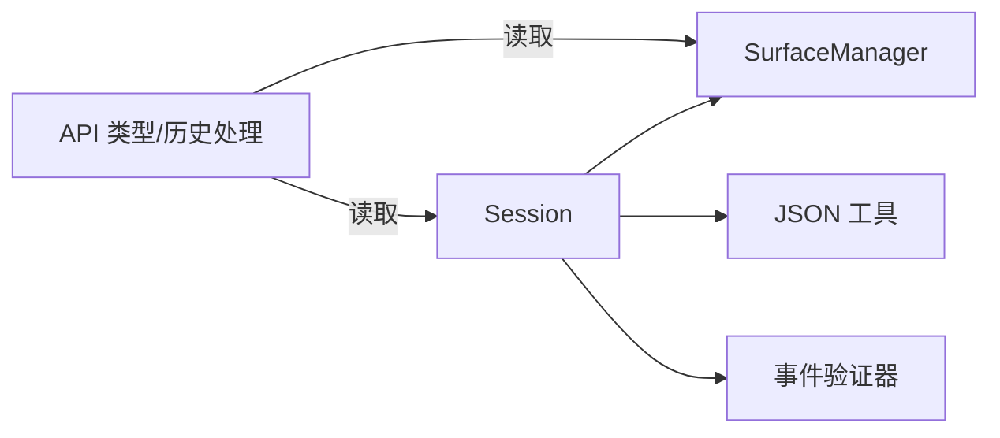

# 事件日志系统

<cite>
**本文引用的文件**
- [packages/core/session/src/index.ts](file://packages/core/session/src/index.ts)
- [packages/core/session/src/surface.ts](file://packages/core/session/src/surface.ts)
- [packages/core/session/src/types.ts](file://packages/core/session/src/types.ts)
- [packages/core/session/src/json.ts](file://packages/core/session/src/json.ts)
- [packages/core/session/src/chunk-rows.ts](file://packages/core/session/src/chunk-rows.ts)
- [packages/api/session-controller/src/types.ts](file://packages/api/session-controller/src/types.ts)
- [packages/api/session-controller/src/history.ts](file://packages/api/session-controller/src/history.ts)
</cite>

## 目录
1. [简介](#简介)
2. [项目结构](#项目结构)
3. [核心组件](#核心组件)
4. [架构总览](#架构总览)
5. [详细组件分析](#详细组件分析)
6. [依赖关系分析](#依赖关系分析)
7. [性能考量](#性能考量)
8. [故障排查指南](#故障排查指南)
9. [结论](#结论)
10. [附录](#附录)

## 简介
本文件为 DeepSeek Harness 的会话事件日志系统提供深入文档，聚焦“追加式事件日志（SessionEvent）”的设计与实现。内容涵盖：
- 事件类型定义、序列号与时间戳机制
- SurfaceEventType 的概念与特性（user/message、assistant/message、tool/result 等消息产生事件）
- SurfaceOp 操作类型（append 与 replace）的工作原理
- sourceEventSeqs 引用关系管理
- 如何正确创建和处理不同类型的事件，并确保 JSON 可序列化性

## 项目结构
会话事件日志的核心位于 @deepseek-ai/dsh-session 包中，围绕 Session 类维护一个不可变的追加式事件日志，并通过 SurfaceManager 将事件投影为有序的消息表面（Surface），最终导出 LLM 对话历史。

图表来源
- [packages/core/session/src/index.ts:423-756](file://packages/core/session/src/index.ts#L423-L756)
- [packages/core/session/src/surface.ts:1-200](file://packages/core/session/src/surface.ts#L1-L200)
- [packages/core/session/src/json.ts:1-200](file://packages/core/session/src/json.ts#L1-L200)

章节来源
- [packages/core/session/src/index.ts:1-120](file://packages/core/session/src/index.ts#L1-L120)

## 核心组件
- Session：封装追加式事件日志，负责事件追加、验证、发布与消息推导缓存。
- SurfaceManager：基于 surfaceOp 维护有序的消息节点序列，支持 append 与 replace 两种操作。
- JSON 工具：对 data 与 surface metadata 进行深拷贝与冻结，保证不可变与 JSON 可序列化。
- 事件验证器：校验事件信封、消息形状、请求头兼容性与 surface 元数据合法性。

章节来源
- [packages/core/session/src/index.ts:159-350](file://packages/core/session/src/index.ts#L159-L350)
- [packages/core/session/src/index.ts:423-756](file://packages/core/session/src/index.ts#L423-L756)
- [packages/core/session/src/json.ts:1-200](file://packages/core/session/src/json.ts#L1-L200)

## 架构总览
下图展示从事件追加到消息推导的关键流程，以及 surfaceOp 如何影响消息表面的构建。

图表来源
- [packages/core/session/src/index.ts:602-653](file://packages/core/session/src/index.ts#L602-L653)
- [packages/core/session/src/index.ts:724-745](file://packages/core/session/src/index.ts#L724-L745)

## 详细组件分析

### 事件类型与消息产生事件（SurfaceEventType）
- 消息产生事件包括 user/message、assistant/message、tool/result。这些事件携带可识别的消息对象，参与消息表面的构建。
- 非消息产生事件（如 turn/start、assistant/chunk 等）不直接出现在消息表面，但可能作为上下文或分片存在。
- 对于消息产生事件，data 中的 message 必须满足角色、来源、内容块等约束；tool/result 还需匹配 tool call id。

章节来源
- [packages/core/session/src/index.ts:298-350](file://packages/core/session/src/index.ts#L298-L350)

### 序列号与时间戳机制
- 每个事件的 seq 等于当前日志长度，保证从 0 开始的连续编号，便于定位与重放。
- time 使用 Date.now() 记录事件写入时间，用于审计与排序辅助。
- 种子事件（seed）在构造时同样要求 seq 连续，否则拒绝加载，确保存储与内存一致性。

章节来源
- [packages/core/session/src/index.ts:514-537](file://packages/core/session/src/index.ts#L514-L537)
- [packages/core/session/src/index.ts:562-565](file://packages/core/session/src/index.ts#L562-L565)
- [packages/core/session/src/index.ts:625-631](file://packages/core/session/src/index.ts#L625-L631)

### SurfaceOp：append 与 replace 的工作原理
- append：将事件作为新的消息节点追加到有序表面末尾，适用于增量生成消息的场景。
- replace：用新事件替换之前由 sourceEventSeqs 指定的若干节点，常用于压缩、重写或删除旧消息片段。
- SurfaceManager 会校验 replace 的目标范围是否有效，并确保覆盖完整、无重叠冲突。

章节来源
- [packages/core/session/src/surface.ts:1-200](file://packages/core/session/src/surface.ts#L1-L200)
- [packages/core/session/src/index.ts:575-600](file://packages/core/session/src/index.ts#L575-L600)

### sourceEventSeqs 引用关系管理
- sourceEventSeqs 列出当前事件所依赖的先前事件的 seq，用于建立引用关系（例如摘要、合并、替换）。
- 校验规则要求引用的 seq 必须存在于日志中且唯一，避免循环与非法引用。
- 当发生 replace 时，sourceEventSeqs 指明被替换的节点集合，从而保证消息表面的一致性。

章节来源
- [packages/core/session/src/index.ts:575-600](file://packages/core/session/src/index.ts#L575-L600)
- [packages/api/session-controller/src/types.ts:427-428](file://packages/api/session-controller/src/types.ts#L427-L428)

### JSON 可序列化性与不可变性
- 所有 data 与 surface metadata 在追加前都会经过 JSON 快照与深冻结，禁止 BigInt、函数、Symbol、undefined、非有限数、循环引用等不可序列化值。
- 恢复路径（fromRestore）与种子加载路径均执行相同严格校验，确保持久化与内存一致。
- 返回的事件 data 是快照副本，读取者不会看到调用方的可变输入。

章节来源
- [packages/core/session/src/index.ts:159-194](file://packages/core/session/src/index.ts#L159-L194)
- [packages/core/session/src/index.ts:514-537](file://packages/core/session/src/index.ts#L514-L537)
- [packages/core/session/src/index.ts:612-631](file://packages/core/session/src/index.ts#L612-L631)
- [packages/core/session/src/json.ts:1-200](file://packages/core/session/src/json.ts#L1-L200)

### 消息推导与缓存
- deriveMessages 基于 SurfaceManager 维护的 nodes 序列，按序推导消息，跳过空内容的 assistant/message。
- 推导结果缓存于实例内，仅在 replaceGeneration 变化时重建，提升重复读取性能。
- 返回的 Message 数组是快照，内部 Message 对象共享且深冻结，防止外部修改。

章节来源
- [packages/core/session/src/index.ts:724-745](file://packages/core/session/src/index.ts#L724-L745)

### 代码级类图（Session 与相关组件）

图表来源
- [packages/core/session/src/index.ts:423-756](file://packages/core/session/src/index.ts#L423-L756)
- [packages/core/session/src/surface.ts:1-200](file://packages/core/session/src/surface.ts#L1-L200)
- [packages/core/session/src/json.ts:1-200](file://packages/core/session/src/json.ts#L1-L200)

### 典型工作流时序（以 assistant/message 为例）

图表来源
- [packages/core/session/src/index.ts:602-653](file://packages/core/session/src/index.ts#L602-L653)

### 复杂逻辑流程图（replace 操作的校验）

图表来源
- [packages/core/session/src/surface.ts:1-200](file://packages/core/session/src/surface.ts#L1-L200)
- [packages/core/session/src/index.ts:575-600](file://packages/core/session/src/index.ts#L575-L600)

## 依赖关系分析
- Session 依赖 SurfaceManager 来维护消息表面，依赖 JSON 工具进行快照与冻结，依赖事件验证器确保数据完整性。
- API 层（session-controller）暴露了 surfaceOp 与 sourceEventSeqs 的类型定义，并在历史处理中读取这些字段以构建视图。

图表来源
- [packages/core/session/src/index.ts:423-756](file://packages/core/session/src/index.ts#L423-L756)
- [packages/api/session-controller/src/types.ts:427-428](file://packages/api/session-controller/src/types.ts#L427-L428)
- [packages/api/session-controller/src/history.ts:300-310](file://packages/api/session-controller/src/history.ts#L300-L310)

章节来源
- [packages/api/session-controller/src/types.ts:427-428](file://packages/api/session-controller/src/types.ts#L427-L428)
- [packages/api/session-controller/src/history.ts:304-304](file://packages/api/session-controller/src/history.ts#L304-L304)

## 性能考量
- 追加路径零 I/O：append 仅做同步验证与日志写入，持久化通过异步观察者缓冲。
- 消息推导缓存：deriveMessages 仅在 replaceGeneration 变化时重建，避免重复计算。
- 深冻结与快照：一次性深拷贝与冻结，减少后续访问成本并保证不可变。
- 大日志场景：建议结合 chunk 行打包与压缩策略，降低存储与传输开销。

[本节为通用指导，无需具体文件分析]

## 故障排查指南
- 事件信封非法：检查 type、seq、time、data 字段是否齐全且类型正确。
- 非 JSON 可序列化：确认 data 不包含 BigInt、函数、Symbol、undefined、非有限数、循环引用等。
- 消息形状不符：user/message、assistant/message、tool/result 需满足角色、来源、内容块约束。
- surfaceOp 非法：确保 surfaceOp 为 append 或 replace，且 sourceEventSeqs 引用合法。
- 重入保护：append 过程中不允许再次进入 append，避免并发竞争。

章节来源
- [packages/core/session/src/index.ts:212-248](file://packages/core/session/src/index.ts#L212-L248)
- [packages/core/session/src/index.ts:298-350](file://packages/core/session/src/index.ts#L298-L350)
- [packages/core/session/src/index.ts:621-624](file://packages/core/session/src/index.ts#L621-L624)

## 结论
DeepSeek Harness 的会话事件日志系统通过追加式日志、严格的 JSON 可序列化与深冻结、以及基于 surfaceOp 的消息表面管理，实现了高可靠、高性能且可重放的会话状态。SurfaceEventType 明确区分消息产生与非消息事件，sourceEventSeqs 提供精确的引用关系，append/replace 操作共同保障消息表面的一致性与可演化性。遵循本文规范创建与处理事件，可确保系统稳定性与可维护性。

[本节为总结，无需具体文件分析]

## 附录
- 最佳实践
  - 始终使用 append 传入合法的 surfaceOp 与 sourceEventSeqs，避免遗漏导致编译期或运行期错误。
  - 对 data 进行预校验，确保 JSON 可序列化；必要时使用提供的 JSON 工具进行快照。
  - 在需要重写历史时使用 replace，并明确 sourceEventSeqs 以覆盖正确的节点集合。
  - 利用 deriveMessages 获取最新消息历史，注意其缓存失效时机（replaceGeneration 变化）。

[本节为概念性指导，无需具体文件分析]