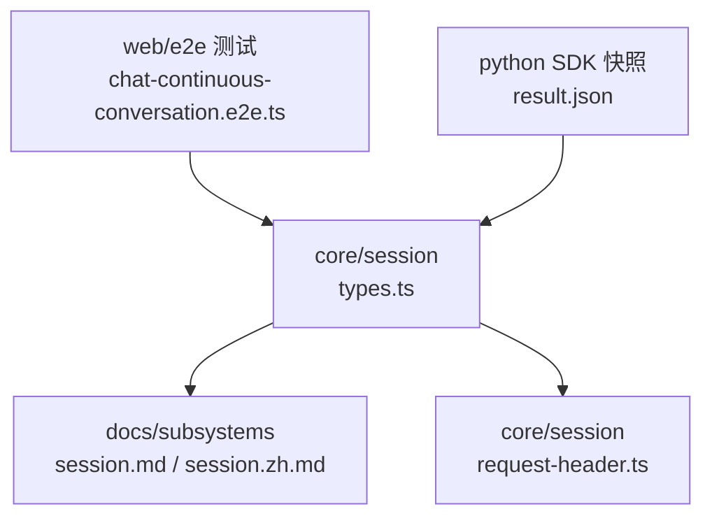
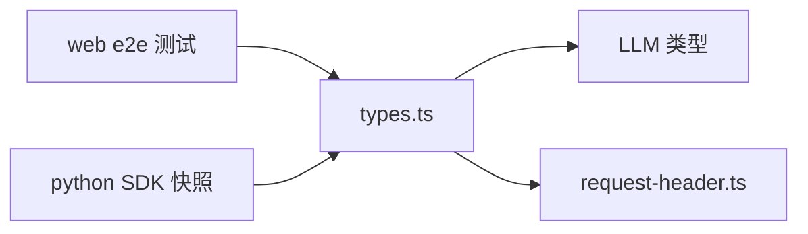

# 事件类型定义

<cite>
**本文引用的文件**
- [packages/core/session/src/types.ts](file://packages/core/session/src/types.ts)
- [docs/subsystems/session.md](file://docs/subsystems/session.md)
- [docs/subsystems/session.zh.md](file://docs/subsystems/session.zh.md)
- [packages/core/session/src/request-header.ts](file://packages/core/session/src/request-header.ts)
- [apps/web/tests/chat-continuous-conversation.e2e.ts](file://apps/web/tests/chat-continuous-conversation.e2e.ts)
- [scripts/snapshots/python-sdk-single-exe/advanced/result.json](file://scripts/snapshots/python-sdk-single-exe/advanced/result.json)
</cite>

## 目录
1. [简介](#简介)
2. [项目结构](#项目结构)
3. [核心组件](#核心组件)
4. [架构总览](#架构总览)
5. [详细组件分析](#详细组件分析)
6. [依赖关系分析](#依赖关系分析)
7. [性能考量](#性能考量)
8. [故障排查指南](#故障排查指南)
9. [结论](#结论)
10. [附录：TypeScript 类型与用法示例](#附录typescript-类型与用法示例)

## 简介
本文件聚焦 DeepSeek Harness 的事件类型系统，围绕 SessionEventMap 中定义的全部事件类型进行系统化说明。内容覆盖会话生命周期事件（turn/start、turn/end、step/start、step/end）、消息相关事件（user/message、assistant/chunk、assistant/message、tool/call、tool/result）、请求元数据事件（request/header、request/context）以及边界事件（session/end-seed）。文档同时提供 TypeScript 类型层面的使用指引，帮助读者以类型安全的方式消费这些事件。

## 项目结构
- 事件类型与核心接口定义位于 core/session 包中，作为所有与会话相关的子系统共享的“唯一真源”。
- 文档子系统提供了对事件语义、持久化契约、派生历史规则等的权威说明。
- 测试与快照用例展示了事件在真实流程中的出现顺序与字段形态，便于对照理解。



图表来源
- [packages/core/session/src/types.ts:221-325](file://packages/core/session/src/types.ts#L221-L325)
- [docs/subsystems/session.md:20-132](file://docs/subsystems/session.md#L20-L132)
- [docs/subsystems/session.zh.md:20-132](file://docs/subsystems/session.zh.md#L20-L132)
- [packages/core/session/src/request-header.ts:33-71](file://packages/core/session/src/request-header.ts#L33-L71)
- [apps/web/tests/chat-continuous-conversation.e2e.ts:91-133](file://apps/web/tests/chat-continuous-conversation.e2e.ts#L91-L133)
- [scripts/snapshots/python-sdk-single-exe/advanced/result.json:2503-2545](file://scripts/snapshots/python-sdk-single-exe/advanced/result.json#L2503-L2545)

章节来源
- [packages/core/session/src/types.ts:221-325](file://packages/core/session/src/types.ts#L221-L325)
- [docs/subsystems/session.md:20-132](file://docs/subsystems/session.md#L20-L132)
- [docs/subsystems/session.zh.md:20-132](file://docs/subsystems/session.zh.md#L20-L132)

## 核心组件
- SessionEventMap：会话事件的“词汇表”，定义了所有可追加的事件类型及其载荷结构。它是合并可扩展的，插件可通过声明合并扩展新事件。
- SessionEvent<T>：一条日志条目，包含 type、seq、time 和 data；对于产生消息的表面事件（SurfaceEventType），还携带 surfaceOp 与 sourceEventSeqs。
- SurfaceEventType：仅 user/message、assistant/message、tool/result 三类事件能进入有序表面并参与派生历史。
- 请求头与上下文：request/header 记录完整请求信封（EpochHeader）及变更原因；request/context 记录路由能力元数据。
- 种子边界：session/end-seed 标记构造种子的结束，区分“种子历史”与“实时写入”。

章节来源
- [packages/core/session/src/types.ts:221-325](file://packages/core/session/src/types.ts#L221-L325)
- [packages/core/session/src/types.ts:327-418](file://packages/core/session/src/types.ts#L327-L418)
- [docs/subsystems/session.md:136-176](file://docs/subsystems/session.md#L136-L176)
- [docs/subsystems/session.zh.md:136-176](file://docs/subsystems/session.zh.md#L136-L176)

## 架构总览
下图展示了一次典型轮次（turn）内的步骤（step）流：从 turn/start 开始，进入 step/start，随后可能产生 assistant/chunk 流式分片，最终汇聚为 assistant/message；若模型发起工具调用，则出现 tool/call 与 tool/result；最后以 step/end 与 turn/end 收尾。请求头与上下文事件穿插其中，用于重建下一次请求的头部与路由信息。

```mermaid
sequenceDiagram
participant Loop as "循环"
participant Sess as "Session"
participant LLM as "LLM 适配器"
participant Tools as "工具执行器"
Loop->>Sess : append('turn/start', {turn})
Loop->>Sess : append('step/start', {turn, step})
Loop->>Sess : append('request/header', {header, reason})
Loop->>Sess : append('request/context', {provider, model, contextWindow?})
LLM-->>Loop : 流式分片
Loop->>Sess : append('assistant/chunk', {turn, step, chunk})
alt 模型请求工具调用
Loop->>Sess : append('tool/call', {turn, step, callId, name, arguments})
Tools-->>Loop : 结果
Loop->>Sess : append('tool/result', {turn, step, message, error?, meta?})
end
Loop->>Sess : append('assistant/message', {turn, step, message, usage?, interrupted?})
Loop->>Sess : append('step/end', {turn, step})
Loop->>Sess : append('turn/end', {turn, reason})
```

图表来源
- [packages/core/session/src/types.ts:221-325](file://packages/core/session/src/types.ts#L221-L325)
- [apps/web/tests/chat-continuous-conversation.e2e.ts:91-133](file://apps/web/tests/chat-continuous-conversation.e2e.ts#L91-L133)
- [scripts/snapshots/python-sdk-single-exe/advanced/result.json:2503-2545](file://scripts/snapshots/python-sdk-single-exe/advanced/result.json#L2503-L2545)

## 详细组件分析

### 生命周期事件
- turn/start：开启一个轮次，表示即将处理一批输入或执行 pre-step。若拒绝、空输入、取消或失败，可能直接关闭而不出现在 step 序列。
- turn/end：关闭轮次，携带 TurnEndReason，指示完成、中止、阻塞、错误、达到最大 token 或崩溃恢复中断等。
- step/start：开启一个步骤，对应一次模型调用及其触发的工具执行集合。
- step/end：关闭该步骤，标志模型调用与工具执行阶段结束。

用途与作用
- 用于界定执行边界、统计耗时、定位异常、回放与修复。
- 与 assistant/chunk、assistant/message、tool/call、tool/result 共同构成完整的单步工作单元。

章节来源
- [packages/core/session/src/types.ts:221-241](file://packages/core/session/src/types.ts#L221-L241)
- [docs/subsystems/session.zh.md:27-47](file://docs/subsystems/session.zh.md#L27-L47)

### 消息相关事件
- user/message：用户侧消息，包括人类提示、注入上下文、目标续接轮次等，原样投影 content，source 标识来源。
- assistant/chunk：原始流式分片，保持 token 级回放保真度。
- assistant/message：按步骤组装后的助手消息，携带 usage（当适配器上报用量时）与 interrupted（中途取消时的前缀冻结）。
- tool/call：模型发起的工具调用，name 与未解析的 arguments 字符串，callId 与后续 result 配对。
- tool/result：工具调用的模型侧结果，可选内部错误标识与工具私有 meta（必须 JSON 可序列化）。

用途与作用
- 构建派生历史（deriveMessages）的核心素材。
- 支持 UI 渲染、审计、遥测与回放。

章节来源
- [packages/core/session/src/types.ts:242-286](file://packages/core/session/src/types.ts#L242-L286)
- [docs/subsystems/session.md:48-92](file://docs/subsystems/session.md#L48-L92)
- [docs/subsystems/session.zh.md:48-92](file://docs/subsystems/session.zh.md#L48-L92)

### 请求元数据事件
- request/header：记录下一次请求的完整信封 EpochHeader（配置、适配器默认值、系统提示词、工具 schema），reason 指示初始/恢复/变更/系列起始；changed 且 startsSeries 时表示开启新的消息系列。
- request/context：记录已解析路由的提供者、模型与上下文窗口容量（若有），仅在变化时追加，不参与请求重建与相等性比较。

作用机制
- 通过 foldRequestHeader 选择最新快照重建请求头；session.requestHeader() 维护增量折叠状态。
- session.requestContext() 返回最新路由元数据。

章节来源
- [packages/core/session/src/types.ts:179-213](file://packages/core/session/src/types.ts#L179-L213)
- [packages/core/session/src/request-header.ts:33-71](file://packages/core/session/src/request-header.ts#L33-L71)
- [docs/subsystems/session.md:136-176](file://docs/subsystems/session.md#L136-L176)
- [docs/subsystems/session.zh.md:136-176](file://docs/subsystems/session.zh.md#L136-L176)

### 边界事件：session/end-seed
- 标记构造种子的结束，是 firstLiveSeq 的持久化投影。其 payload 为空，位置与时间承载含义。
- 仅 Session 构造函数合法写入；用于区分“种子历史”与“实时写入”，避免将未配对的独立开闭括号误判为活跃。

意义
- 对拥有独立开闭括号的插件（如压缩）至关重要，用于判定“已结束的生命周期”与“当前并发会话”的边界。
- 消费者可按此事件划分历史与实时，避免把“拾起会话”视为活动。

章节来源
- [packages/core/session/src/types.ts:302-325](file://packages/core/session/src/types.ts#L302-L325)
- [docs/subsystems/session.md:556-565](file://docs/subsystems/session.md#L556-L565)
- [docs/subsystems/session.zh.md:560-568](file://docs/subsystems/session.zh.md#L560-L568)

### 轮次结束原因：TurnEndReason
- completed：正常完成
- aborted：被取消（含来源）
- blocked：被策略/钩子阻止
- error：结构化失败
- max-tokens：至少一步达到输出 token 上限
- interrupted：崩溃恢复合成，loop 不主动发出

章节来源
- [packages/core/session/src/types.ts:142-177](file://packages/core/session/src/types.ts#L142-L177)
- [docs/subsystems/session.zh.md:515-552](file://docs/subsystems/session.zh.md#L515-L552)

## 依赖关系分析
- types.ts 依赖 LLM 域的类型（AssistantMessage、ToolCallId、StreamChunk、TokenUsage、ToolResultMessage、UserMessage、LlmCallConfig、ToolSchema 等），确保事件载荷与模型协议一致。
- request-header.ts 提供 headerEquals 与 foldRequestHeader，支撑请求头的等价性与重建。
- 测试与快照用例验证了事件在真实流中的顺序与字段形态，尤其是 assistant/chunk 的 usage/finish 分片与 assistant/message 的组装。



图表来源
- [packages/core/session/src/types.ts:1-14](file://packages/core/session/src/types.ts#L1-L14)
- [packages/core/session/src/request-header.ts:33-71](file://packages/core/session/src/request-header.ts#L33-L71)
- [apps/web/tests/chat-continuous-conversation.e2e.ts:91-133](file://apps/web/tests/chat-continuous-conversation.e2e.ts#L91-L133)
- [scripts/snapshots/python-sdk-single-exe/advanced/result.json:2503-2545](file://scripts/snapshots/python-sdk-single-exe/advanced/result.json#L2503-L2545)

章节来源
- [packages/core/session/src/types.ts:1-14](file://packages/core/session/src/types.ts#L1-L14)
- [packages/core/session/src/request-header.ts:33-71](file://packages/core/session/src/request-header.ts#L33-L71)

## 性能考量
- 事件日志是仅追加的，seq 连续且不可过滤（包括 assistant/chunk），保证持久化与回放的确定性。
- 派生历史通过 surface 节点缓存，每个节点仅投影一次；替换操作会触发重建，但总体复杂度与新增节点线性相关。
- request/header 的增量折叠使每次读取成本与新增事件成正比。

[本节为通用指导，无需特定文件引用]

## 故障排查指南
- 若 assistant/message 缺失 sourceEventSeqs，需确认是否为旧格式或外部事件；loop 会为成功模型调用写入该字段。
- 若 tool/call 与 tool/result 未成对出现，检查是否发生中断或错误；assistant/message 的 interrupted 标记可用于识别中途取消的前缀。
- 若请求头不一致导致重建异常，检查 request/header 的 reason 与 startsSeries，并使用 foldRequestHeader 重放校验。
- 若种子边界判断错误，查找存储历史中最后一条 session/end-seed，而非假定其在 firstLiveSeq。

章节来源
- [docs/subsystems/session.md:178-223](file://docs/subsystems/session.md#L178-L223)
- [docs/subsystems/session.zh.md:178-223](file://docs/subsystems/session.zh.md#L178-L223)
- [docs/subsystems/session.md:556-565](file://docs/subsystems/session.md#L556-L565)
- [docs/subsystems/session.zh.md:560-568](file://docs/subsystems/session.zh.md#L560-L568)

## 结论
SessionEventMap 为 DeepSeek Harness 的会话交互提供了统一、可合并扩展、仅追加的事件词汇表。通过 turn/step 边界、消息事件、请求元数据与种子边界事件，系统实现了高保真的回放、稳定的派生历史与清晰的执行语义。结合 TypeScript 类型系统与严格的 JSON 序列化约束，开发者可以以类型安全的方式消费与扩展事件。

[本节为总结，无需特定文件引用]

## 附录：TypeScript 类型与用法示例
以下示例基于仓库中的类型定义与文档片段，展示如何以类型安全的方式处理事件。为避免泄露实现细节，此处仅给出类型与调用签名路径，具体代码请参考对应源码行号。

- 订阅并分发事件
  - 参考：SessionEvent<T> 的可辨识联合与 switch 收窄
  - 路径：[packages/core/session/src/types.ts:396-418](file://packages/core/session/src/types.ts#L396-L418)

- 处理 turn 生命周期
  - 参考：turn/start、turn/end 的数据结构与 TurnEndReason
  - 路径：[packages/core/session/src/types.ts:221-237](file://packages/core/session/src/types.ts#L221-L237)
  - 路径：[packages/core/session/src/types.ts:142-177](file://packages/core/session/src/types.ts#L142-L177)

- 处理 step 与消息流
  - 参考：step/start、step/end、assistant/chunk、assistant/message
  - 路径：[packages/core/session/src/types.ts:238-262](file://packages/core/session/src/types.ts#L238-L262)
  - 参考：assistant/chunk 的 usage/finish 分片形态
  - 路径：[apps/web/tests/chat-continuous-conversation.e2e.ts:91-133](file://apps/web/tests/chat-continuous-conversation.e2e.ts#L91-L133)
  - 路径：[scripts/snapshots/python-sdk-single-exe/advanced/result.json:2503-2545](file://scripts/snapshots/python-sdk-single-exe/advanced/result.json#L2503-L2545)

- 处理工具调用与结果
  - 参考：tool/call、tool/result 的 callId 配对与 meta 可序列化约束
  - 路径：[packages/core/session/src/types.ts:263-286](file://packages/core/session/src/types.ts#L263-L286)

- 处理请求头与上下文
  - 参考：request/header 的 EpochHeader、reason、startsSeries
  - 路径：[packages/core/session/src/types.ts:179-213](file://packages/core/session/src/types.ts#L179-L213)
  - 参考：foldRequestHeader 的重建逻辑
  - 路径：[packages/core/session/src/request-header.ts:33-71](file://packages/core/session/src/request-header.ts#L33-L71)

- 处理种子边界
  - 参考：session/end-seed 的语义与写入时机
  - 路径：[packages/core/session/src/types.ts:302-325](file://packages/core/session/src/types.ts#L302-L325)

- 表面事件与派生历史
  - 参考：SurfaceEventType、SurfaceOp、SurfaceIntent
  - 路径：[packages/core/session/src/types.ts:327-381](file://packages/core/session/src/types.ts#L327-L381)
  - 参考：deriveMessages 的规则与缓存行为
  - 路径：[docs/subsystems/session.md:494-505](file://docs/subsystems/session.md#L494-L505)
  - 路径：[docs/subsystems/session.zh.md:496-505](file://docs/subsystems/session.zh.md#L496-L505)