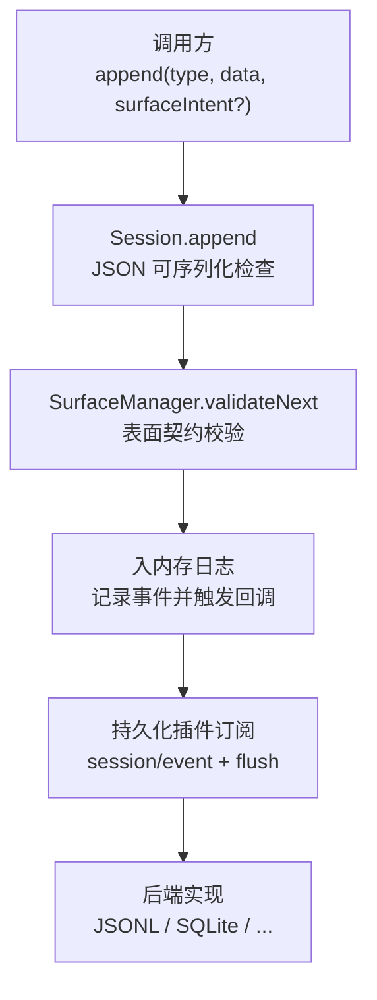
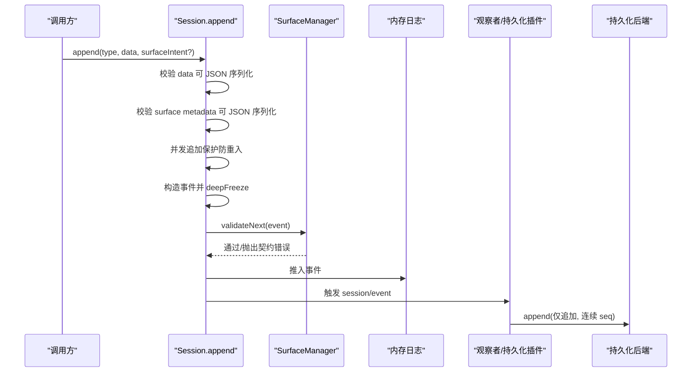
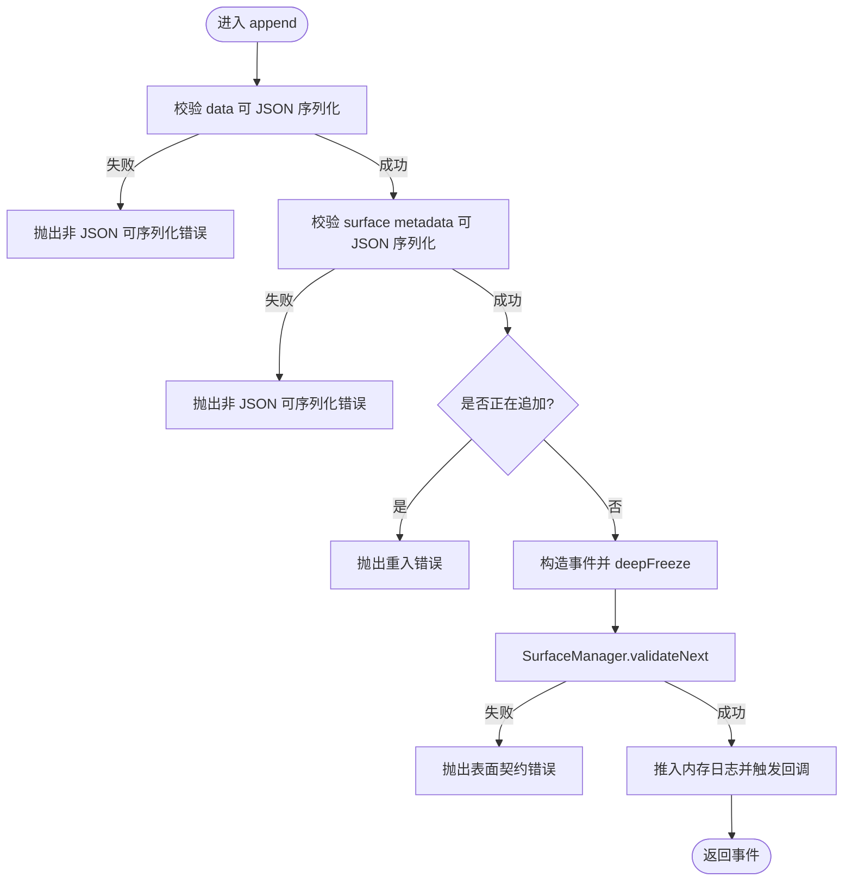
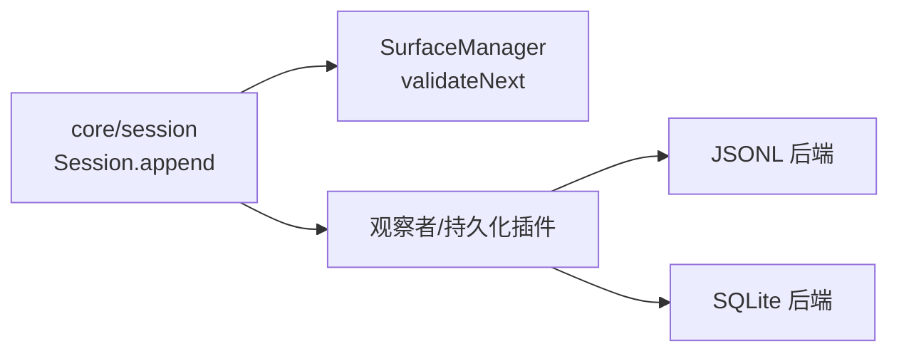

# 事件验证和持久化

<cite>
**本文引用的文件**
- [packages/core/session/src/index.ts](file://packages/core/session/src/index.ts)
- [packages/session/session-persistence/tests/contract.ts](file://packages/session/session-persistence/tests/contract.ts)
- [packages/session/session-persistence-jsonl/tests/jsonl.spec.ts](file://packages/session/session-persistence-jsonl/tests/jsonl.spec.ts)
- [.agents/notes/implemented/architecture/2026-06-14-session-persistence.md](file://.agents/notes/implemented/architecture/2026-06-14-session-persistence.md)
- [.agents/notes/implemented/architecture/2026-08-18-sqlite-physical-chunk-row-compression.md](file://.agents/notes/implemented/architecture/2026-08-18-sqlite-physical-chunk-row-compression.md)
</cite>

## 目录
1. [简介](#简介)
2. [项目结构](#项目结构)
3. [核心组件](#核心组件)
4. [架构总览](#架构总览)
5. [详细组件分析](#详细组件分析)
6. [依赖关系分析](#依赖关系分析)
7. [性能考量](#性能考量)
8. [故障排查指南](#故障排查指南)
9. [结论](#结论)
10. [附录](#附录)

## 简介
本文件聚焦 DeepSeek Harness 的事件验证与持久化机制，围绕 Session.append 的验证流程、持久化合同要求以及错误处理策略进行系统化说明。重点包括：
- JSON 可序列化性检查、表面契约（surface）校验与事件关系校验
- 持久化合同的 seq 连续性保证、assistant/chunk 完整保留与 event.data 的 JSON 序列化要求
- 非序列化数据拒绝、表面契约违规处理与并发写入保护
- 如何正确处理事件验证错误，以及如何实现符合持久化合同的自定义存储后端

## 项目结构
与事件验证和持久化相关的代码主要分布在以下位置：
- 会话与会话事件的核心实现位于 core/session 包中，Session.append 负责事件构建、序列化校验与表面契约校验
- 持久化合同测试位于 session-persistence 包的 tests/contract.ts，用于约束所有后端的通用行为
- JSONL 持久化后端的测试覆盖非 JSON 可序列化数据的拒绝行为
- 架构笔记描述了持久化的整体设计目标、seq 连续性、逻辑恢复与 chunk 保真等关键语义

图表来源
- [packages/core/session/src/index.ts:602-653](file://packages/core/session/src/index.ts#L602-L653)
- [.agents/notes/implemented/architecture/2026-06-14-session-persistence.md:34-37](file://.agents/notes/implemented/architecture/2026-06-14-session-persistence.md#L34-L37)

章节来源
- [packages/core/session/src/index.ts:602-653](file://packages/core/session/src/index.ts#L602-L653)
- [.agents/notes/implemented/architecture/2026-06-14-session-persistence.md:34-37](file://.agents/notes/implemented/architecture/2026-06-14-session-persistence.md#L34-L37)

## 核心组件
- Session.append：事件入口，负责 JSON 可序列化性检查、请求头支持性断言、表面元数据快照、并发追加保护、事件冻结与表面契约校验，最后将事件推入内存日志并通知观察者
- SurfaceManager.validateNext：对表面事件进行顺序与关系校验，确保消息组装、替换与流式分片的一致性
- 持久化插件：通过订阅 session/event 并在 session/flush 或销毁时落盘，遵循统一的 append-only、连续 seq、惰性物化与逻辑恢复等合同

章节来源
- [packages/core/session/src/index.ts:602-653](file://packages/core/session/src/index.ts#L602-L653)

## 架构总览
事件从调用方进入 Session.append，先进行严格的 JSON 可序列化性检查与表面元数据快照；随后交由 SurfaceManager 做表面契约校验；通过后事件被冻结并加入内存日志，同时触发回调。持久化插件在后台监听事件并在合适时机落盘，遵守“仅追加、连续 seq、惰性物化”的持久化合同。SQLite 后端还实现了物理行压缩以高效存储大量 assistant/chunk 事件，但逻辑上每个事件仍被精确保留。

图表来源
- [packages/core/session/src/index.ts:602-653](file://packages/core/session/src/index.ts#L602-L653)
- [.agents/notes/implemented/architecture/2026-06-14-session-persistence.md:34-37](file://.agents/notes/implemented/architecture/2026-06-14-session-persistence.md#L34-L37)
- [.agents/notes/implemented/architecture/2026-08-18-sqlite-physical-chunk-row-compression.md:23-29](file://.agents/notes/implemented/architecture/2026-08-18-sqlite-physical-chunk-row-compression.md#L23-L29)

## 详细组件分析

### Session.append 验证流程
- JSON 可序列化性检查：对 event.data 与 surface metadata 分别执行快照，若不可序列化则立即抛出错误，阻止事件进入日志
- 表面契约校验：调用 SurfaceManager.validateNext，确保表面事件序列满足消息组装、替换与流式分片的顺序与关系约束
- 并发写入保护：维护 appending 标记，防止在同一会话上发生重入式追加，避免并发竞争导致的状态不一致
- 事件冻结与入队：事件对象被 deepFreeze 后推入内存日志，并触发观察者回调

图表来源
- [packages/core/session/src/index.ts:602-653](file://packages/core/session/src/index.ts#L602-L653)

章节来源
- [packages/core/session/src/index.ts:602-653](file://packages/core/session/src/index.ts#L602-L653)

### 持久化合同要求
- 仅追加与连续 seq：每次 append 必须追加新事件，且全局逻辑 seq 严格连续，不得出现空洞或重复
- 惰性物化与逻辑恢复：读取时可按需重建状态，崩溃后可基于完整逻辑日志恢复
- 整数元数据：会话元数据使用整数标识，便于跨进程/重启一致性
- 事件保真度：即使物理层将多个 assistant/chunk 打包到一行，逻辑上每个事件也必须完整保留
- JSON 序列化要求：event.data 必须为 JSON 可序列化值，任何不可序列化值应在入口处拒绝

章节来源
- [.agents/notes/implemented/architecture/2026-06-14-session-persistence.md:34-37](file://.agents/notes/implemented/architecture/2026-06-14-session-persistence.md#L34-L37)
- [.agents/notes/implemented/architecture/2026-08-18-sqlite-physical-chunk-row-compression.md:23-29](file://.agents/notes/implemented/architecture/2026-08-18-sqlite-physical-chunk-row-compression.md#L23-L29)

### 错误处理机制
- 非序列化数据拒绝：当 event.data 或 surface metadata 包含 BigInt、函数、Symbol、Map、循环引用、undefined、Infinity 等不可序列化值时，Session.append 会立即抛出错误，事件不会进入日志
- 表面契约违规：SurfaceManager.validateNext 会在表面事件顺序或关系不合法时抛出错误，阻止后续写入
- 并发写入保护：同一会话上的 append 不允许重入，否则抛出错误，避免并发竞争
- 后端一致性：所有持久化后端必须遵循相同的拒绝策略，确保 round-trip 一致性与数据完整性

章节来源
- [packages/core/session/src/index.ts:602-653](file://packages/core/session/src/index.ts#L602-L653)
- [packages/session/session-persistence/tests/contract.ts:388-415](file://packages/session/session-persistence/tests/contract.ts#L388-L415)
- [packages/session/session-persistence-jsonl/tests/jsonl.spec.ts:1608-1635](file://packages/session/session-persistence-jsonl/tests/jsonl.spec.ts#L1608-L1635)

### 自定义存储后端实现要点
- 接口与行为契约：实现 append-only 写入、严格递增的逻辑 seq、惰性物化、逻辑恢复与整数元数据
- 事件保真：对于 assistant/chunk 等高频事件，可在物理层压缩存储，但逻辑层必须保持每个事件的完整存在
- 事务与一致性：SQLite 后端在 append 时使用 BEGIN IMMEDIATE 获取独占写锁，重新校验 schema 所有权与尾部逻辑 seq，确保并发安全与一致性
- 错误边界：遇到不可序列化数据应直接拒绝，不留下任何副作用；表面契约违规同样应拒绝

章节来源
- [.agents/notes/implemented/architecture/2026-06-14-session-persistence.md:34-37](file://.agents/notes/implemented/architecture/2026-06-14-session-persistence.md#L34-L37)
- [.agents/notes/implemented/architecture/2026-08-18-sqlite-physical-chunk-row-compression.md:23-29](file://.agents/notes/implemented/architecture/2026-08-18-sqlite-physical-chunk-row-compression.md#L23-L29)

## 依赖关系分析
- Session.append 依赖 SurfaceManager 进行表面契约校验
- 持久化插件依赖 session/event 与 session/flush 生命周期钩子
- 不同后端（JSONL、SQLite）共享同一套合同约束，确保行为一致

图表来源
- [packages/core/session/src/index.ts:602-653](file://packages/core/session/src/index.ts#L602-L653)
- [.agents/notes/implemented/architecture/2026-06-14-session-persistence.md:34-37](file://.agents/notes/implemented/architecture/2026-06-14-session-persistence.md#L34-L37)

章节来源
- [packages/core/session/src/index.ts:602-653](file://packages/core/session/src/index.ts#L602-L653)
- [.agents/notes/implemented/architecture/2026-06-14-session-persistence.md:34-37](file://.agents/notes/implemented/architecture/2026-06-14-session-persistence.md#L34-L37)

## 性能考量
- 事件冻结与缓存：事件对象 deepFreeze 后复用，减少拷贝成本；派生消息按节点增量计算并缓存
- 物理层压缩：SQLite 后端对 assistant/chunk 等高频事件进行物理行压缩，降低存储开销
- 追加比例：正常 append 不删除或替换早期事件，物理写入与新批次的数量成正比，避免稳定行数掩盖重复写入

[本节提供一般性指导，无需特定文件分析]

## 故障排查指南
- 非 JSON 可序列化数据：检查 event.data 与 surface metadata 是否包含 BigInt、函数、Symbol、Map、循环引用、undefined、Infinity 等值；这些值会被拒绝并抛出错误
- 表面契约违规：确认表面事件顺序与关系是否符合消息组装、替换与流式分片的规则；SurfaceManager.validateNext 会在此处报错
- 并发写入冲突：确保同一会话上不发生重入式 append；如出现重入错误，需调整调用时序或使用队列串行化
- 后端一致性：验证后端是否遵循 append-only、连续 seq、惰性物化与逻辑恢复等合同；参考合同测试用例进行回归

章节来源
- [packages/core/session/src/index.ts:602-653](file://packages/core/session/src/index.ts#L602-L653)
- [packages/session/session-persistence/tests/contract.ts:388-415](file://packages/session/session-persistence/tests/contract.ts#L388-L415)
- [packages/session/session-persistence-jsonl/tests/jsonl.spec.ts:1608-1635](file://packages/session/session-persistence-jsonl/tests/jsonl.spec.ts#L1608-L1635)

## 结论
DeepSeek Harness 的事件验证与持久化机制通过严格的 JSON 可序列化性检查、表面契约校验与并发保护，确保事件在内存与持久化层的一致性与可靠性。持久化合同定义了仅追加、连续 seq、惰性物化与逻辑恢复等关键语义，并通过 SQLite 的物理压缩在不牺牲逻辑保真度的前提下提升性能。遵循上述规范可实现高可靠、高性能且可替换的存储后端。

[本节总结内容，无需特定文件分析]

## 附录
- 示例路径（不展示代码内容）：
  - 非 JSON 可序列化数据拒绝：参见 [packages/session/session-persistence-jsonl/tests/jsonl.spec.ts:1608-1635](file://packages/session/session-persistence-jsonl/tests/jsonl.spec.ts#L1608-L1635)
  - 合同测试中的非序列化值覆盖：参见 [packages/session/session-persistence/tests/contract.ts:388-415](file://packages/session/session-persistence/tests/contract.ts#L388-L415)
  - Session.append 验证流程：参见 [packages/core/session/src/index.ts:602-653](file://packages/core/session/src/index.ts#L602-L653)
  - 持久化合同与 seq 连续性：参见 [.agents/notes/implemented/architecture/2026-06-14-session-persistence.md:34-37](file://.agents/notes/implemented/architecture/2026-06-14-session-persistence.md#L34-L37)
  - SQLite 物理行压缩与事务追加：参见 [.agents/notes/implemented/architecture/2026-08-18-sqlite-physical-chunk-row-compression.md:23-29](file://.agents/notes/implemented/architecture/2026-08-18-sqlite-physical-chunk-row-compression.md#L23-L29)

[本节列出参考路径，无需特定文件分析]