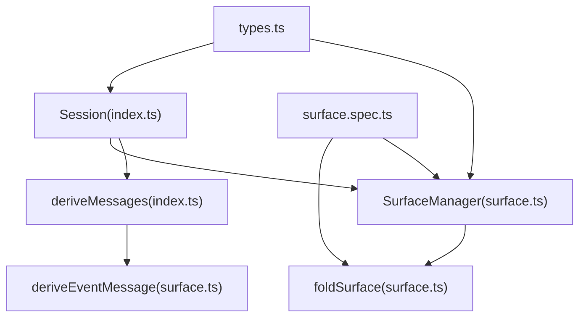
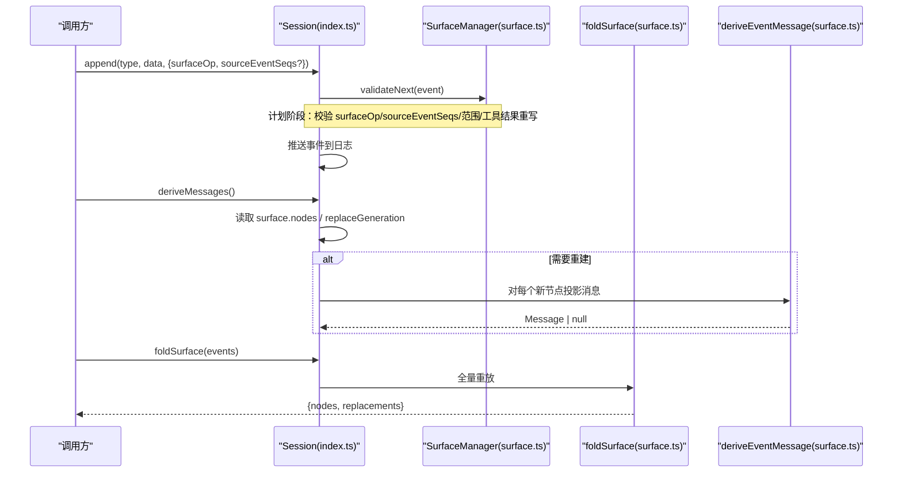
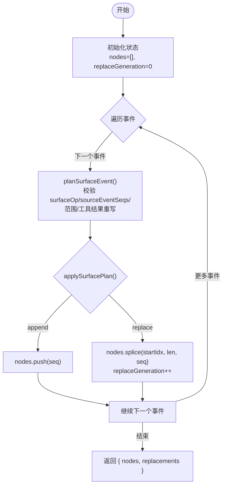
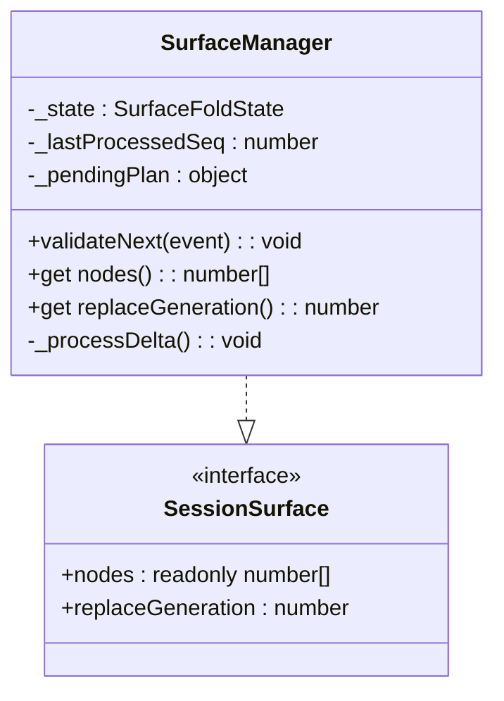
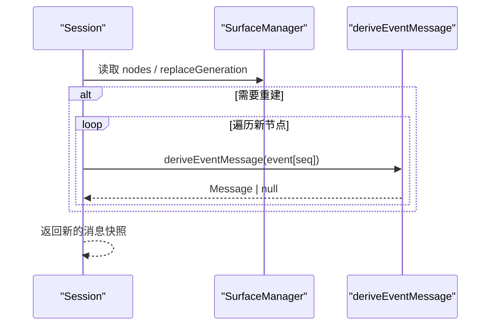
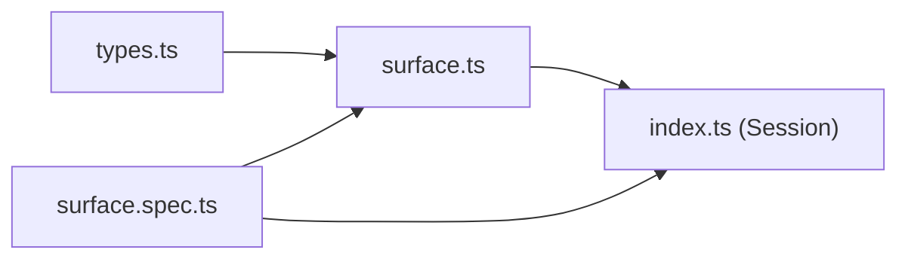

# 会话表面投影

<cite>
**本文引用的文件**
- [packages/core/session/src/surface.ts](file://packages/core/session/src/surface.ts)
- [packages/core/session/src/index.ts](file://packages/core/session/src/index.ts)
- [packages/core/session/src/types.ts](file://packages/core/session/src/types.ts)
- [packages/core/session/tests/surface.spec.ts](file://packages/core/session/tests/surface.spec.ts)
- [docs/subsystems/session-projection.zh.md](file://docs/subsystems/session-projection.zh.md)
</cite>

## 目录
1. [简介](#简介)
2. [项目结构](#项目结构)
3. [核心组件](#核心组件)
4. [架构总览](#架构总览)
5. [详细组件分析](#详细组件分析)
6. [依赖关系分析](#依赖关系分析)
7. [性能考量](#性能考量)
8. [故障排查指南](#故障排查指南)
9. [结论](#结论)
10. [附录：使用示例与最佳实践](#附录使用示例与最佳实践)

## 简介
本文件围绕 DeepSeek Harness 的“会话表面投影”机制展开，聚焦以下目标：
- 解释 SessionSurface 接口的职责，尤其是 nodes 数组中的事件序列号与 replaceGeneration 计数器的作用。
- 说明 SurfaceFoldReplacement 与 SurfaceFoldResult 的结构含义。
- 阐述如何通过 foldSurface 完成一次完整的“表面重放”，以及增量维护机制（SurfaceManager）。
- 给出监听表面变化、处理替换操作、构建自定义表面消费者的具体方式。
- 阐明表面投影与派生历史（deriveMessages）之间的关系。

该机制将“不可变的事件日志”作为唯一事实来源，通过 surfaceOp 标记在有序表面上维护消息可见顺序，并支持对已有片段进行“替换”（如压缩/重写），从而在不破坏日志可追溯性的前提下提供高效、稳定的模型可见视图。

## 项目结构
与表面投影相关的核心代码位于 packages/core/session 包中：
- types.ts：定义 SessionEvent、SurfaceEventType、SurfaceOp、SurfaceIntent 等类型契约。
- surface.ts：实现表面折叠（foldSurface）、事件投影（deriveEventMessage）、增量管理器（SurfaceManager）以及接口 SessionSurface。
- index.ts：Session 类对外暴露 surface 属性与 deriveMessages，内部持有 SurfaceManager 实例，并将表面投影与消息派生缓存联动。
- tests/surface.spec.ts：覆盖表面折叠、替换规则、源事件引用校验、工具结果重写限制等关键行为。
- docs/subsystems/session-projection.zh.md：面向子系统文档，描述更高层的“会话投影”能力（与 surface 不同层，但共享事件驱动思想）。

图表来源
- [packages/core/session/src/index.ts:423-755](file://packages/core/session/src/index.ts#L423-L755)
- [packages/core/session/src/surface.ts:116-461](file://packages/core/session/src/surface.ts#L116-L461)
- [packages/core/session/src/types.ts:327-418](file://packages/core/session/src/types.ts#L327-L418)

章节来源
- [packages/core/session/src/index.ts:423-755](file://packages/core/session/src/index.ts#L423-L755)
- [packages/core/session/src/surface.ts:116-461](file://packages/core/session/src/surface.ts#L116-L461)
- [packages/core/session/src/types.ts:327-418](file://packages/core/session/src/types.ts#L327-L418)

## 核心组件
- SessionSurface：只读的表面视图，包含：
  - nodes：当前模型可见的消息节点序列，元素为事件 seq（即事件在日志中的索引）。
  - replaceGeneration：单调递增的计数器，每当发生“位置替换”时+1，用于触发下游缓存失效或增量更新。
- SurfaceFoldReplacement：记录一次替换操作的元数据：
  - seq：执行替换的事件序号。
  - start/end：被替换的表面节点范围（闭区间）。
  - shadowedSeqs：实际被移除的表面节点序列（按表面顺序）。
- SurfaceFoldResult：完整重放的结果：
  - nodes：最终表面节点序列。
  - replacements：按事件顺序记录的替换历史。
- SurfaceManager：增量维护器，实现 SessionSurface；支持 validateNext 预验证与懒推进，避免重复计算。
- foldSurface：纯函数，从完整事件列表重放表面，返回 SurfaceFoldResult。
- deriveEventMessage：单事件到消息的投影规则，仅对三类“消息产生事件”生效。

章节来源
- [packages/core/session/src/surface.ts:116-142](file://packages/core/session/src/surface.ts#L116-L142)
- [packages/core/session/src/surface.ts:387-461](file://packages/core/session/src/surface.ts#L387-L461)
- [packages/core/session/src/surface.ts:83-114](file://packages/core/session/src/surface.ts#L83-L114)

## 架构总览
表面投影的核心流程如下：
- 事件写入：调用 Session.append 时，先对数据进行 JSON 快照与冻结，再调用 SurfaceManager.validateNext 进行“计划阶段”的合法性检查（不改变状态）。
- 提交与推进：通过后将事件推入日志，并延迟推进 SurfaceManager 的状态（按需访问 nodes/replaceGeneration 时推进）。
- 表面重放：foldSurface 从头遍历事件，应用 append/replace 操作，产出最终 nodes 与 replacements。
- 消息派生：Session.deriveMessages 基于 surface.nodes 与 replaceGeneration 做增量缓存，逐节点调用 deriveEventMessage 生成消息。

图表来源
- [packages/core/session/src/index.ts:602-653](file://packages/core/session/src/index.ts#L602-L653)
- [packages/core/session/src/index.ts:724-755](file://packages/core/session/src/index.ts#L724-L755)
- [packages/core/session/src/surface.ts:387-461](file://packages/core/session/src/surface.ts#L387-L461)
- [packages/core/session/src/surface.ts:83-114](file://packages/core/session/src/surface.ts#L83-L114)

## 详细组件分析

### SessionSurface 接口与 replaceGeneration
- nodes：保存“模型可见”的消息节点序列，元素是事件 seq。append 会追加尾部；replace 会在指定范围内插入新节点并删除被阴影的节点。
- replaceGeneration：每次 replace 操作后 +1。它作为“版本戳”，供上层缓存（如 deriveMessages）判断是否需要重建。

章节来源
- [packages/core/session/src/surface.ts:137-142](file://packages/core/session/src/surface.ts#L137-L142)
- [packages/core/session/src/surface.ts:362-379](file://packages/core/session/src/surface.ts#L362-L379)

### SurfaceFoldReplacement 与 SurfaceFoldResult
- SurfaceFoldReplacement：记录一次替换的“意图”（start/end）与“实际影响”（shadowedSeqs），便于审计与调试。
- SurfaceFoldResult：一次完整重放的产物，包含最终 nodes 与所有 replacements 历史。

章节来源
- [packages/core/session/src/surface.ts:116-134](file://packages/core/session/src/surface.ts#L116-L134)

### foldSurface：完整表面重放
- 输入：连续 seq 的事件数组。
- 过程：逐个事件 planSurfaceEvent -> applySurfacePlan，累积 nodes 与 replacements。
- 输出：{ nodes, replacements }。
- 约束：
  - 仅三类事件可进入表面：user/message、assistant/message、tool/result。
  - 非表面事件不得携带 surfaceOp/sourceEventSeqs。
  - 替换必须指向当前表面存在的节点范围，且 start <= end。
  - tool/result 的替换只能修改 content，其他字段需保持结构相等。
  - sourceEventSeqs 必须包含所有被阴影的表面节点，且不能引用自身或未来事件。

图表来源
- [packages/core/session/src/surface.ts:387-395](file://packages/core/session/src/surface.ts#L387-L395)
- [packages/core/session/src/surface.ts:320-379](file://packages/core/session/src/surface.ts#L320-L379)

章节来源
- [packages/core/session/src/surface.ts:387-395](file://packages/core/session/src/surface.ts#L387-L395)
- [packages/core/session/src/surface.ts:320-379](file://packages/core/session/src/surface.ts#L320-L379)

### SurfaceManager：增量维护与懒推进
- 职责：维护 SessionSurface 的增量视图，支持 validateNext 预验证与按需推进。
- 关键点：
  - _pendingPlan：暂存待提交的候选事件及其计划，确保原子性（失败不污染状态）。
  - _processDelta：当访问 nodes/replaceGeneration 时，推进未处理的事件至最新水位。
  - baseSeq：支持窗口化加载（例如大日志的分片），以绝对 seq 定位。
- 优势：避免每次 append 都全量重放；仅在必要时推进；保证一致性。

图表来源
- [packages/core/session/src/surface.ts:398-461](file://packages/core/session/src/surface.ts#L398-L461)

章节来源
- [packages/core/session/src/surface.ts:398-461](file://packages/core/session/src/surface.ts#L398-L461)

### 事件投影与消息派生
- deriveEventMessage：将单个事件映射为 LLM 消息（或 null）。
- Session.deriveMessages：基于 surface.nodes 与 replaceGeneration 做增量缓存，逐节点调用 deriveEventMessage 生成消息数组。
- 关系：表面投影决定“哪些事件可见”，消息投影决定“如何把事件变成消息”。两者结合得到最终的模型历史。

图表来源
- [packages/core/session/src/index.ts:724-755](file://packages/core/session/src/index.ts#L724-L755)
- [packages/core/session/src/surface.ts:83-114](file://packages/core/session/src/surface.ts#L83-L114)

章节来源
- [packages/core/session/src/index.ts:724-755](file://packages/core/session/src/index.ts#L724-L755)
- [packages/core/session/src/surface.ts:83-114](file://packages/core/session/src/surface.ts#L83-L114)

### 替换操作与工具结果重写限制
- 替换范围：start/end 必须对应当前表面上的节点，且 start <= end。
- 工具结果重写：仅允许修改 message.content 的第一个块的内容，其余字段必须保持结构相等。
- 源事件引用：sourceEventSeqs 必须包含所有被阴影的表面节点，且不能引用自身或未来事件。

章节来源
- [packages/core/session/src/surface.ts:245-318](file://packages/core/session/src/surface.ts#L245-L318)
- [packages/core/session/tests/surface.spec.ts:151-239](file://packages/core/session/tests/surface.spec.ts#L151-L239)

## 依赖关系分析
- Session 依赖 SurfaceManager 管理表面状态，并通过 deriveMessages 消费 surface.nodes 与 replaceGeneration。
- surface.ts 依赖 types.ts 的类型定义（SurfaceEventType、SurfaceOp、SurfaceIntent、SessionEvent）。
- 测试文件覆盖表面折叠、替换规则、源事件引用、工具结果重写等边界条件。

图表来源
- [packages/core/session/src/types.ts:327-418](file://packages/core/session/src/types.ts#L327-L418)
- [packages/core/session/src/surface.ts:116-461](file://packages/core/session/src/surface.ts#L116-L461)
- [packages/core/session/src/index.ts:423-755](file://packages/core/session/src/index.ts#L423-L755)
- [packages/core/session/tests/surface.spec.ts:1-239](file://packages/core/session/tests/surface.spec.ts#L1-L239)

章节来源
- [packages/core/session/src/types.ts:327-418](file://packages/core/session/src/types.ts#L327-L418)
- [packages/core/session/src/surface.ts:116-461](file://packages/core/session/src/surface.ts#L116-L461)
- [packages/core/session/src/index.ts:423-755](file://packages/core/session/src/index.ts#L423-L755)
- [packages/core/session/tests/surface.spec.ts:1-239](file://packages/core/session/tests/surface.spec.ts#L1-L239)

## 性能考量
- 增量维护：SurfaceManager 采用懒推进与计划-提交分离，避免每次 append 的全量重放。
- 缓存失效：deriveMessages 使用 replaceGeneration 作为失效信号，仅在 replace 发生时重建。
- 窗口化支持：SurfaceManager 支持 baseSeq，便于分片加载大日志时的增量计算。
- 深比较优化：工具结果重写限制为内容变更，减少不必要的复杂比较成本。

## 故障排查指南
常见错误与定位要点：
- 非表面事件携带 surfaceOp/sourceEventSeqs：检查事件类型是否属于 SurfaceEventType。
- sourceEventSeqs 为空或不合法：除 assistant/message 外，sourceEventSeqs 不能为空；必须为安全整数数组且不重复；不能引用自身或未来事件。
- 替换范围无效：start/end 必须存在于当前表面，且 start <= end。
- 工具结果重写越界：仅能修改 content，其他字段必须结构相等。
- 窗口越界：当使用 baseSeq 时，替换范围不得跨越已加载窗口的头部。

章节来源
- [packages/core/session/src/surface.ts:184-243](file://packages/core/session/src/surface.ts#L184-L243)
- [packages/core/session/src/surface.ts:245-318](file://packages/core/session/src/surface.ts#L245-L318)
- [packages/core/session/tests/surface.spec.ts:81-149](file://packages/core/session/tests/surface.spec.ts#L81-L149)
- [packages/core/session/tests/surface.spec.ts:151-239](file://packages/core/session/tests/surface.spec.ts#L151-L239)

## 结论
会话表面投影通过 surfaceOp 将“不可变日志”转化为“有序消息视图”，并以 replaceGeneration 驱动增量更新。foldSurface 提供确定性重放，SurfaceManager 提供高效增量维护。结合 deriveEventMessage 与 deriveMessages，系统实现了稳定、可追溯、高性能的消息历史派生。遵循替换与源事件引用的严格约束，可确保表面与日志的一致性，并为上层消费者提供可靠的变更语义。

## 附录：使用示例与最佳实践

### 监听表面变化
- 使用 Session.surface.nodes 与 Session.surface.replaceGeneration 观察变化。当 replaceGeneration 增加时，表明发生了替换，应重新计算派生历史或通知消费者。
- 参考路径：[packages/core/session/src/index.ts:724-755](file://packages/core/session/src/index.ts#L724-L755)

### 处理替换操作
- 通过 foldSurface 获取 replacements 列表，了解每次替换影响的范围与被阴影的节点。
- 对于 tool/result 的替换，确保仅修改 content，并保持其他字段结构相等。
- 参考路径：
  - [packages/core/session/src/surface.ts:387-395](file://packages/core/session/src/surface.ts#L387-L395)
  - [packages/core/session/src/surface.ts:286-318](file://packages/core/session/src/surface.ts#L286-L318)
  - [packages/core/session/tests/surface.spec.ts:151-239](file://packages/core/session/tests/surface.spec.ts#L151-L239)

### 构建自定义表面消费者
- 订阅 session/event 事件，对每个事件调用 SurfaceManager.validateNext 进行预验证，随后在提交后按需推进并消费 nodes 变化。
- 若需要离线重放，直接使用 foldSurface(events) 获得最终 nodes 与 replacements。
- 参考路径：
  - [packages/core/session/src/surface.ts:398-461](file://packages/core/session/src/surface.ts#L398-L461)
  - [packages/core/session/src/surface.ts:387-395](file://packages/core/session/src/surface.ts#L387-L395)

### 表面投影与派生历史的关系
- 表面投影决定“哪些事件可见”，消息投影决定“如何把事件变成消息”。deriveMessages 基于 surface.nodes 与 replaceGeneration 增量构建消息历史。
- 参考路径：
  - [packages/core/session/src/index.ts:724-755](file://packages/core/session/src/index.ts#L724-L755)
  - [packages/core/session/src/surface.ts:83-114](file://packages/core/session/src/surface.ts#L83-L114)

### 与更高层“会话投影”能力的关系
- “会话投影”是更高层的能力 seam，负责将领域状态以键值形式提供给客户端；而 surface 是底层的事件到消息的有序视图。二者均基于事件驱动与纯函数折叠的思想，但关注点不同。
- 参考路径：[docs/subsystems/session-projection.zh.md:1-10](file://docs/subsystems/session-projection.zh.md#L1-L10)