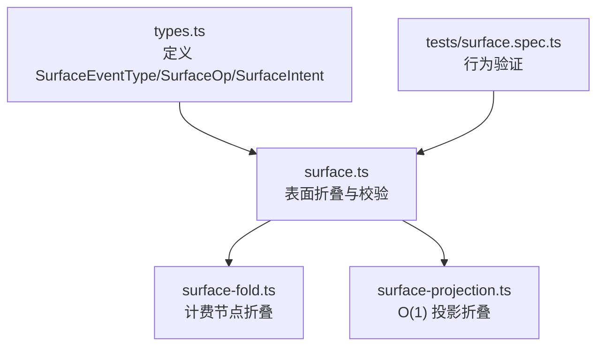
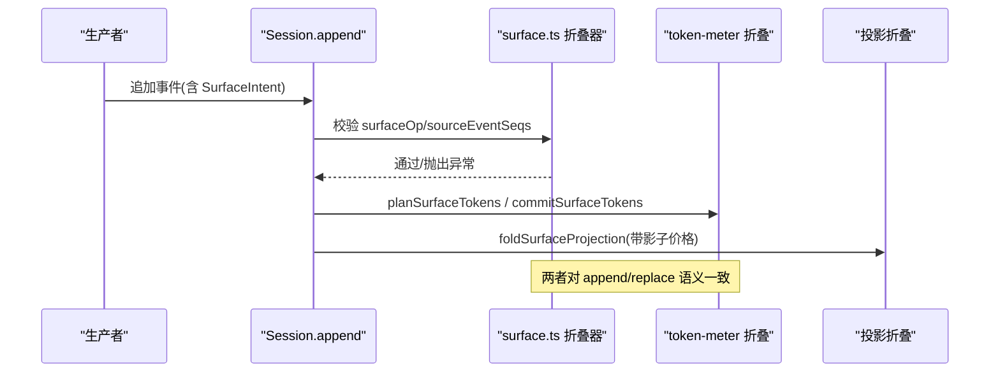
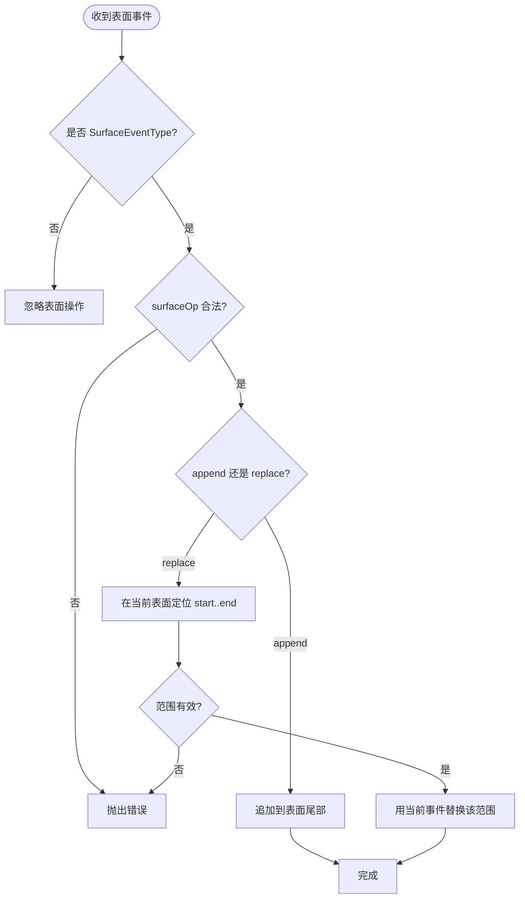
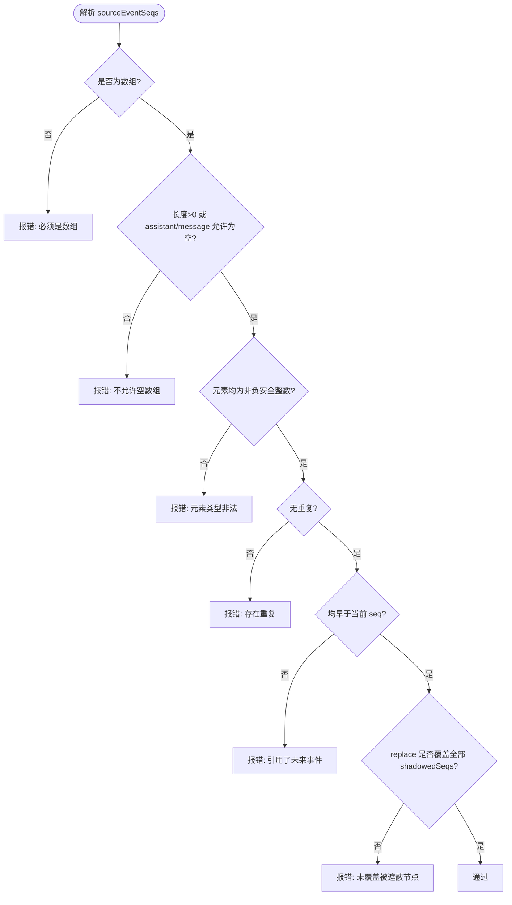
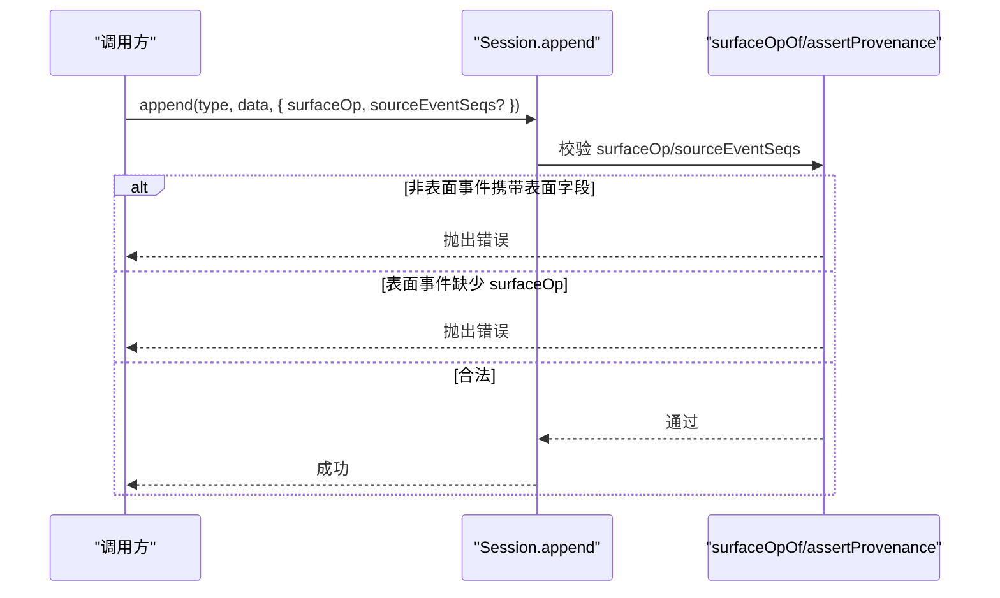
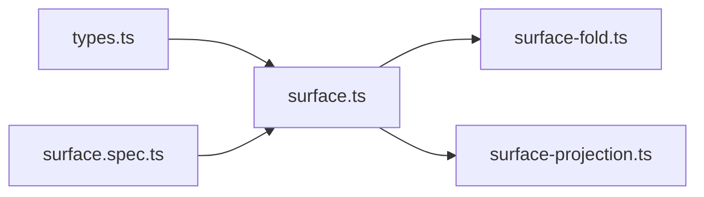

# 表面操作机制

<cite>
**本文引用的文件**
- [packages/core/session/src/types.ts](file://packages/core/session/src/types.ts)
- [packages/core/session/src/surface.ts](file://packages/core/session/src/surface.ts)
- [packages/llm/token-meter/src/surface-fold.ts](file://packages/llm/token-meter/src/surface-fold.ts)
- [packages/llm/token-meter/src/surface-projection.ts](file://packages/llm/token-meter/src/surface-projection.ts)
- [packages/core/session/tests/surface.spec.ts](file://packages/core/session/tests/surface.spec.ts)
</cite>

## 目录
1. [简介](#简介)
2. [项目结构](#项目结构)
3. [核心组件](#核心组件)
4. [架构总览](#架构总览)
5. [详细组件分析](#详细组件分析)
6. [依赖关系分析](#依赖关系分析)
7. [性能考量](#性能考量)
8. [故障排查指南](#故障排查指南)
9. [结论](#结论)
10. [附录：使用示例与最佳实践](#附录使用示例与最佳实践)

## 简介
本文件聚焦 DeepSeek Harness 的“表面（Surface）”操作机制，解释三类消息产生事件如何进入模型可见的有序视图，以及两种插入方式（append、replace）的工作原理。文档还说明 sourceEventSeqs 的引用管理约束，以及如何通过 SurfaceIntent 控制事件的表面插入方式，并给出复杂替换场景的处理要点。

## 项目结构
围绕表面操作的核心实现位于 session 包与 token-meter 包：
- types.ts：定义 SurfaceEventType、SurfaceOp、SurfaceIntent、SessionEvent 等类型契约。
- surface.ts：实现表面折叠、校验、增量管理器，提供 deriveEventMessage、foldSurface、SurfaceManager 等能力。
- surface-fold.ts：面向计费的有界表面折叠，按节点计价并支持追加/替换。
- surface-projection.ts：面向投影单元的 O(1) 状态表面折叠，基于“影子价格”协议处理替换。
- tests/surface.spec.ts：覆盖 sourceEventSeqs 校验、tool/result 重写限制等关键行为。



图表来源
- [packages/core/session/src/types.ts:335-381](file://packages/core/session/src/types.ts#L335-L381)
- [packages/core/session/src/surface.ts:1-114](file://packages/core/session/src/surface.ts#L1-L114)
- [packages/llm/token-meter/src/surface-fold.ts:1-122](file://packages/llm/token-meter/src/surface-fold.ts#L1-L122)
- [packages/llm/token-meter/src/surface-projection.ts:1-95](file://packages/llm/token-meter/src/surface-projection.ts#L1-L95)
- [packages/core/session/tests/surface.spec.ts:81-149](file://packages/core/session/tests/surface.spec.ts#L81-L149)

章节来源
- [packages/core/session/src/types.ts:335-381](file://packages/core/session/src/types.ts#L335-L381)
- [packages/core/session/src/surface.ts:1-114](file://packages/core/session/src/surface.ts#L1-L114)

## 核心组件
- SurfaceEventType：限定可出现在模型可见表面的事件类型集合，仅包含 user/message、assistant/message、tool/result。
- SurfaceOp：描述事件如何进入表面，包括 append（尾部追加）和 replace（范围替换）。
- SurfaceIntent：调用 Session.append 时声明表面意图，包含 surfaceOp 与可选的 sourceEventSeqs。
- deriveEventMessage：将单个事件投影为 LLM 消息（空内容 assistant/message 不产出消息）。
- foldSurface：对完整日志执行表面折叠，返回当前 nodes 序列与替换历史。
- SurfaceManager：增量式表面视图，支持 validateNext 预校验与 nodes/replaceGeneration 只读访问。
- 计费折叠（surface-fold.ts）：为每个表面节点计算启发式 token 数，支持追加与替换的 delta 更新。
- 投影折叠（surface-projection.ts）：以 O(1) 状态维护累计 token，借助“影子价格”协议处理替换。

章节来源
- [packages/core/session/src/types.ts:335-381](file://packages/core/session/src/types.ts#L335-L381)
- [packages/core/session/src/surface.ts:70-114](file://packages/core/session/src/surface.ts#L70-L114)
- [packages/core/session/src/surface.ts:387-460](file://packages/core/session/src/surface.ts#L387-L460)
- [packages/llm/token-meter/src/surface-fold.ts:25-122](file://packages/llm/token-meter/src/surface-fold.ts#L25-L122)
- [packages/llm/token-meter/src/surface-projection.ts:26-95](file://packages/llm/token-meter/src/surface-projection.ts#L26-L95)

## 架构总览
表面机制由“事件日志 + 表面折叠”构成：日志是追加不可变的唯一事实源；表面是模型可见的有序视图，通过 append/replace 构建。所有外部重建（历史、计费、投影）都复用同一投影规则 deriveEventMessage，保证一致性。



图表来源
- [packages/core/session/src/surface.ts:184-208](file://packages/core/session/src/surface.ts#L184-L208)
- [packages/core/session/src/surface.ts:320-379](file://packages/core/session/src/surface.ts#L320-L379)
- [packages/llm/token-meter/src/surface-fold.ts:86-122](file://packages/llm/token-meter/src/surface-fold.ts#L86-L122)
- [packages/llm/token-meter/src/surface-projection.ts:66-95](file://packages/llm/token-meter/src/surface-projection.ts#L66-L95)

## 详细组件分析

### SurfaceEventType 与消息产生事件
- 仅 user/message、assistant/message、tool/result 可进入表面。
- deriveEventMessage 将这三类事件映射为 LLM 消息；assistant/message 若内容为空则不产出消息（用于承载 usage 等元信息）。

章节来源
- [packages/core/session/src/surface.ts:14-28](file://packages/core/session/src/surface.ts#L14-L28)
- [packages/core/session/src/surface.ts:70-114](file://packages/core/session/src/surface.ts#L70-L114)

### SurfaceOp：append 与 replace
- append：将事件作为新节点追加到表面尾部。适用于正常用户输入、助手回复、工具结果。
- replace：用当前事件替换当前表面中从 start 到 end（闭区间）的一段节点。start/end 必须是当前表面中的节点 seq。该操作常用于压缩（compaction）或工具结果局部重写。



图表来源
- [packages/core/session/src/surface.ts:184-208](file://packages/core/session/src/surface.ts#L184-L208)
- [packages/core/session/src/surface.ts:245-266](file://packages/core/session/src/surface.ts#L245-L266)
- [packages/core/session/src/surface.ts:361-379](file://packages/core/session/src/surface.ts#L361-L379)

章节来源
- [packages/core/session/src/types.ts:351-366](file://packages/core/session/src/types.ts#L351-L366)
- [packages/core/session/src/surface.ts:184-208](file://packages/core/session/src/surface.ts#L184-L208)
- [packages/core/session/src/surface.ts:245-266](file://packages/core/session/src/surface.ts#L245-L266)
- [packages/core/session/src/surface.ts:361-379](file://packages/core/session/src/surface.ts#L361-L379)

### sourceEventSeqs 引用关系管理
- 作用：记录当前事件所依赖的早期事件 seq 集合（例如 assistant/message 由多个 chunk 组成；replace 需声明被遮蔽的节点）。
- 约束：
  - 非表面事件不得携带 surfaceOp/sourceEventSeqs。
  - 若存在 sourceEventSeqs，必须是非负安全整数数组，无重复，且全部早于当前事件。
  - 除 assistant/message 允许显式空数组外，其他表面事件不允许空数组。
  - 对于 replace，sourceEventSeqs 必须包含所有被遮蔽的表面节点（即 shadowedSeqs 的超集）。
- 工具结果重写限制：tool/result 的 replace 只能改写 content，不能修改 toolCallId、isError 等其他字段。



图表来源
- [packages/core/session/src/surface.ts:210-243](file://packages/core/session/src/surface.ts#L210-L243)
- [packages/core/session/src/surface.ts:286-318](file://packages/core/session/src/surface.ts#L286-L318)
- [packages/core/session/tests/surface.spec.ts:81-149](file://packages/core/session/tests/surface.spec.ts#L81-L149)

章节来源
- [packages/core/session/src/surface.ts:210-243](file://packages/core/session/src/surface.ts#L210-L243)
- [packages/core/session/src/surface.ts:286-318](file://packages/core/session/src/surface.ts#L286-L318)
- [packages/core/session/tests/surface.spec.ts:81-149](file://packages/core/session/tests/surface.spec.ts#L81-L149)

### SurfaceIntent 接口与控制流程
- 在调用 Session.append 时，通过 SurfaceIntent 指定 surfaceOp 与 sourceEventSeqs。
- 对非表面事件类型，编译器与运行时都会拒绝 surfaceOp/sourceEventSeqs。
- 对表面事件类型，缺少 surfaceOp 会报错；非法 surfaceOp 也会报错。



图表来源
- [packages/core/session/src/types.ts:368-381](file://packages/core/session/src/types.ts#L368-L381)
- [packages/core/session/src/surface.ts:184-208](file://packages/core/session/src/surface.ts#L184-L208)
- [packages/core/session/src/surface.ts:210-243](file://packages/core/session/src/surface.ts#L210-L243)

章节来源
- [packages/core/session/src/types.ts:368-381](file://packages/core/session/src/types.ts#L368-L381)
- [packages/core/session/src/surface.ts:184-208](file://packages/core/session/src/surface.ts#L184-L208)
- [packages/core/session/src/surface.ts:210-243](file://packages/core/session/src/surface.ts#L210-L243)

### 复杂替换场景与工具结果重写
- 工具结果重写：tool/result 的 replace 必须恰好针对一个当前节点，且仅能变更 content，其他字段（如 toolCallId、isError）不可变。
- 多节点替换：replace 的范围 start..end 必须在当前表面中存在且 start <= end；否则报错。
- 覆盖完整性：replace 的 sourceEventSeqs 必须包含所有被遮蔽的节点 seq，否则报错。

章节来源
- [packages/core/session/src/surface.ts:245-266](file://packages/core/session/src/surface.ts#L245-L266)
- [packages/core/session/src/surface.ts:286-318](file://packages/core/session/src/surface.ts#L286-L318)
- [packages/core/session/tests/surface.spec.ts:151-200](file://packages/core/session/tests/surface.spec.ts#L151-L200)

### 计费与投影：append/replace 的一致性
- 计费折叠（surface-fold.ts）：对每个表面节点计算启发式 token，append 直接累加，replace 计算 delta = 新节点 token - 被替换节点 token 之和。
- 投影折叠（surface-projection.ts）：以 O(1) 状态维护累计 token，通过“影子价格”协议（紧接在 replace 之前的 compaction/* 事件声明被替换范围的 token 数）精确处理替换；若无相邻影子价格，历史回放退化为漂移但不失败。

```mermaid
classDiagram
class SurfaceFoldResult {
+number[] nodes
+SurfaceFoldReplacement[] replacements
}
class SurfaceManager {
+validateNext(event)
+nodes readonly number[]
+replaceGeneration readonly number
}
class MeterSurfaceNode {
+seq number
+heuristicTokens number
+imageFreeTokens number
+images ImageAttachmentRef[]
}
class ShadowPriceClaim {
+start number
+end number
+tokens number
}
SurfaceManager --> SurfaceFoldResult : "生成/演进"
MeterSurfaceNode <.. SurfaceFoldResult : "节点序列"
ShadowPriceClaim <.. "投影折叠" : "相邻补偿"
```

图表来源
- [packages/core/session/src/surface.ts:116-165](file://packages/core/session/src/surface.ts#L116-L165)
- [packages/core/session/src/surface.ts:387-460](file://packages/core/session/src/surface.ts#L387-L460)
- [packages/llm/token-meter/src/surface-fold.ts:25-122](file://packages/llm/token-meter/src/surface-fold.ts#L25-L122)
- [packages/llm/token-meter/src/surface-projection.ts:26-95](file://packages/llm/token-meter/src/surface-projection.ts#L26-L95)

章节来源
- [packages/llm/token-meter/src/surface-fold.ts:86-122](file://packages/llm/token-meter/src/surface-fold.ts#L86-L122)
- [packages/llm/token-meter/src/surface-projection.ts:66-95](file://packages/llm/token-meter/src/surface-projection.ts#L66-L95)

## 依赖关系分析
- surface.ts 依赖 types.ts 的类型契约，并导出 deriveEventMessage、foldSurface、SurfaceManager 等供上层消费。
- token-meter 的两个模块分别复用 deriveEventMessage 与 isSurfaceEvent，确保计费与投影与主表面逻辑一致。
- 测试文件覆盖 sourceEventSeqs 与 tool/result 重写的关键边界条件，保障实现正确性。



图表来源
- [packages/core/session/src/types.ts:335-381](file://packages/core/session/src/types.ts#L335-L381)
- [packages/core/session/src/surface.ts:1-114](file://packages/core/session/src/surface.ts#L1-L114)
- [packages/llm/token-meter/src/surface-fold.ts:1-24](file://packages/llm/token-meter/src/surface-fold.ts#L1-L24)
- [packages/llm/token-meter/src/surface-projection.ts:1-24](file://packages/llm/token-meter/src/surface-projection.ts#L1-L24)
- [packages/core/session/tests/surface.spec.ts:1-20](file://packages/core/session/tests/surface.spec.ts#L1-L20)

章节来源
- [packages/core/session/src/surface.ts:1-114](file://packages/core/session/src/surface.ts#L1-L114)
- [packages/llm/token-meter/src/surface-fold.ts:1-24](file://packages/llm/token-meter/src/surface-fold.ts#L1-L24)
- [packages/llm/token-meter/src/surface-projection.ts:1-24](file://packages/llm/token-meter/src/surface-projection.ts#L1-L24)
- [packages/core/session/tests/surface.spec.ts:1-20](file://packages/core/session/tests/surface.spec.ts#L1-L20)

## 性能考量
- 追加路径 O(1)：append 直接推入尾部。
- 替换路径 O(n)：需要在当前表面查找 start/end 索引并 splice 替换；n 为当前表面节点数。
- 计费与投影：
  - 计费折叠对每个节点进行启发式估算，整体复杂度与表面节点数线性相关。
  - 投影折叠保持 O(1) 状态，通过影子价格协议避免保存每节点价格，适合持久化检查点。

[本节为通用指导，无需特定文件来源]

## 故障排查指南
常见错误及原因：
- 非表面事件携带 surfaceOp/sourceEventSeqs：类型不符，应移除这些字段。
- 表面事件缺少 surfaceOp：必须声明 append 或 replace。
- sourceEventSeqs 非法：非数组、空数组（非 assistant/message）、重复项、非安全整数、引用未来事件。
- replace 范围无效：start/end 不在当前表面或 start > end。
- tool/result 重写越界：仅允许修改 content，其他字段不可变。
- 替换覆盖不完整：sourceEventSeqs 未包含所有被遮蔽节点。

章节来源
- [packages/core/session/src/surface.ts:184-208](file://packages/core/session/src/surface.ts#L184-L208)
- [packages/core/session/src/surface.ts:210-243](file://packages/core/session/src/surface.ts#L210-L243)
- [packages/core/session/src/surface.ts:245-266](file://packages/core/session/src/surface.ts#L245-L266)
- [packages/core/session/src/surface.ts:286-318](file://packages/core/session/src/surface.ts#L286-L318)
- [packages/core/session/tests/surface.spec.ts:81-200](file://packages/core/session/tests/surface.spec.ts#L81-L200)

## 结论
DeepSeek Harness 的表面操作机制通过严格的类型与运行时校验，确保只有三类消息产生事件可以进入模型可见表面，并以 append/replace 两种方式构建有序视图。sourceEventSeqs 提供了可靠的溯源与替换覆盖保证，SurfaceIntent 则在写入端明确控制插入策略。计费与投影模块复用相同的投影规则，保证了历史、计量与展示的一致性。

[本节为总结，无需特定文件来源]

## 附录：使用示例与最佳实践
以下示例以“代码片段路径”形式给出，便于对照实现位置与上下文：

- 创建用户消息并追加到表面
  - 参考路径：[packages/core/session/tests/surface.spec.ts:22-42](file://packages/core/session/tests/surface.spec.ts#L22-L42)

- 创建助手消息并追加到表面（含 source 与 usage）
  - 参考路径：[packages/core/session/tests/surface.spec.ts:29-40](file://packages/core/session/tests/surface.spec.ts#L29-L40)

- 工具结果的重写（仅改 content）
  - 参考路径：[packages/core/session/tests/surface.spec.ts:151-200](file://packages/core/session/tests/surface.spec.ts#L151-L200)

- 替换操作的 sourceEventSeqs 校验（完整覆盖被遮蔽节点）
  - 参考路径：[packages/core/session/tests/surface.spec.ts:81-149](file://packages/core/session/tests/surface.spec.ts#L81-L149)

- 使用 SurfaceManager 增量推进表面视图
  - 参考路径：[packages/core/session/src/surface.ts:397-460](file://packages/core/session/src/surface.ts#L397-L460)

- 计费折叠的追加与替换
  - 参考路径：[packages/llm/token-meter/src/surface-fold.ts:86-122](file://packages/llm/token-meter/src/surface-fold.ts#L86-L122)

- 投影折叠的影子价格协议
  - 参考路径：[packages/llm/token-meter/src/surface-projection.ts:66-95](file://packages/llm/token-meter/src/surface-projection.ts#L66-L95)

最佳实践建议：
- 始终为消息产生事件设置正确的 surfaceOp；非表面事件不要携带表面字段。
- 对 assistant/message，若确知内容为空，可显式传入空的 sourceEventSeqs；其他事件应避免空数组。
- 使用 replace 时，务必确保 start/end 在当前表面存在且顺序正确，并在 sourceEventSeqs 中包含所有被遮蔽节点。
- 工具结果重写仅允许修改 content，避免误改其他字段导致校验失败。
- 在需要持久化或跨进程共享的状态下，优先使用投影折叠（O(1) 状态），配合影子价格协议保证准确性。

[本节为实践指引，无需特定文件来源]