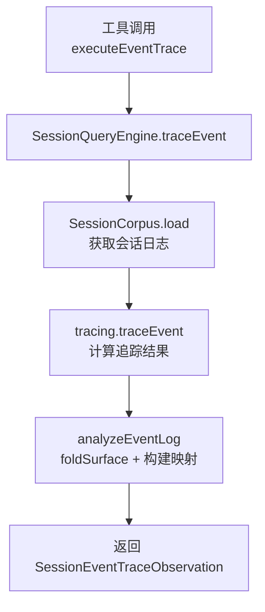
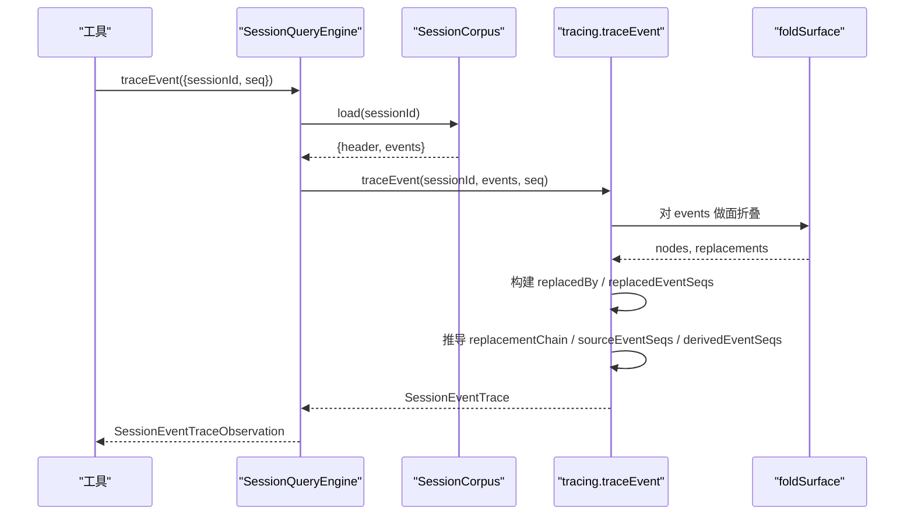
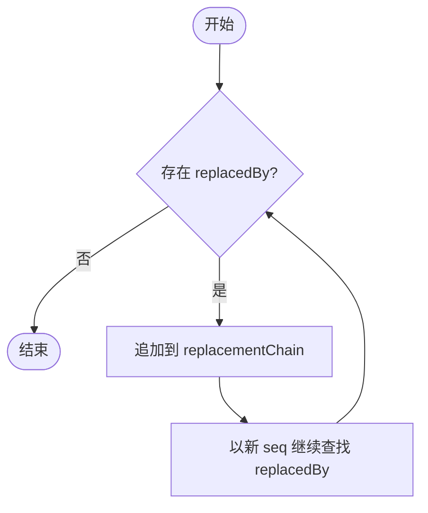
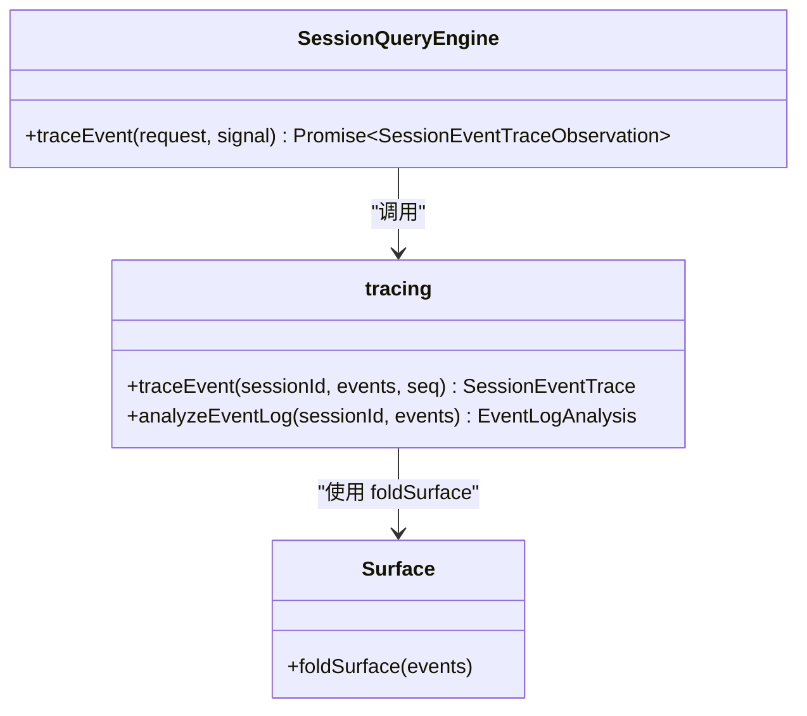
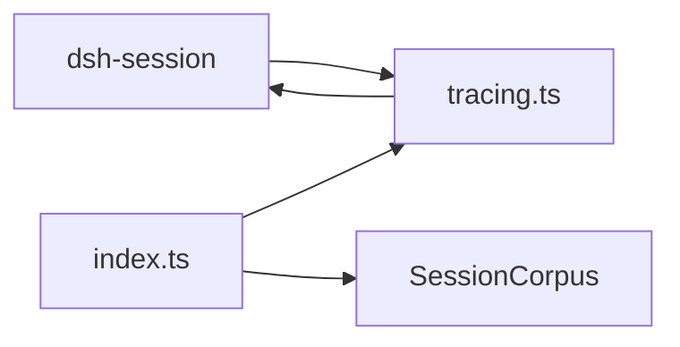

# 事件关系追踪

<cite>
**本文引用的文件**
- [types.ts](file://packages/session-query/session-query/src/types.ts)
- [tracing.ts](file://packages/session-query/session-query/src/tracing.ts)
- [index.ts](file://packages/session-query/session-query/src/index.ts)
- [operations.ts](file://packages/session-query/tool-session-query/src/operations.ts)
- [session-query.md](file://docs/subsystems/session-query.md)
- [session-query.zh.md](file://docs/subsystems/session-query.zh.md)
- [surface.ts](file://packages/core/session/src/surface.ts)
- [tracing.spec.ts](file://packages/session-query/session-query/tests/tracing.spec.ts)
</cite>

## 目录
1. [简介](#简介)
2. [项目结构](#项目结构)
3. [核心组件](#核心组件)
4. [架构总览](#架构总览)
5. [详细组件分析](#详细组件分析)
6. [依赖关系分析](#依赖关系分析)
7. [性能考量](#性能考量)
8. [故障排查指南](#故障排查指南)
9. [结论](#结论)
10. [附录：代码示例与用法](#附录代码示例与用法)

## 简介
本文件聚焦 DeepSeek Harness 的“事件关系追踪”能力，围绕 SessionEventTrace 的结构、事件位置替换与引用关系、replacementChain 构建逻辑、SessionEventTraceRequest 查询接口、事件关系图构建算法（直接链接与间接依赖识别），以及调试和问题排查中的应用场景进行系统化说明。内容基于 session-query 子系统的类型定义、实现与测试用例，确保可追溯、可验证。

## 项目结构
事件关系追踪的核心位于 session-query 包，主要涉及以下职责划分：
- 类型与契约：SessionEventTrace、SessionEventTraceRequest、SessionEventRecord 等定义在 types.ts。
- 追踪算法：traceEvent、analyzeEventLog、eventRecords 等实现在 tracing.ts。
- 服务门面：SessionQueryEngine.traceEvent 将请求路由到追踪实现，并绑定会话头观察结果，位于 index.ts。
- 工具侧调用：tool-session-query 中的 executeEventTrace 将 traceEvent 暴露为工具操作，位于 operations.ts。
- 文档与契约说明：docs/subsystems/session-query.* 提供对外契约与错误码说明。
- 表面折叠与替换规则：core/session/src/surface.ts 定义了 surfaceOp 与 replace 语义，是 replacementChain 的基础。
- 行为验证：tests/tracing.spec.ts 通过具体事件序列断言追踪结果。

图表来源
- [operations.ts:200-214](file://packages/session-query/tool-session-query/src/operations.ts#L200-L214)
- [index.ts:306-320](file://packages/session-query/session-query/src/index.ts#L306-L320)
- [tracing.ts:65-105](file://packages/session-query/session-query/src/tracing.ts#L65-L105)
- [tracing.ts:175-214](file://packages/session-query/session-query/src/tracing.ts#L175-L214)

章节来源
- [types.ts:96-124](file://packages/session-query/session-query/src/types.ts#L96-L124)
- [tracing.ts:1-249](file://packages/session-query/session-query/src/tracing.ts#L1-L249)
- [index.ts:306-320](file://packages/session-query/session-query/src/index.ts#L306-L320)
- [operations.ts:200-214](file://packages/session-query/tool-session-query/src/operations.ts#L200-L214)
- [session-query.md:293-331](file://docs/subsystems/session-query.md#L293-L331)

## 核心组件
- SessionEventTraceRequest：指定要追踪的目标会话与会话内事件序号。
- SessionEventTrace：描述目标事件的轻量记录及其与位置替换、源事件、派生事件的关系。
- SessionEventRecord：对单个事件的轻量投影，包含 sessionId、seq、type、time、surface。
- analyzeEventLog：对完整原始日志执行一次面折叠，产出 records、replacedBy、replacedEventSeqs、currentSeqs。
- traceEvent：基于 analyzeEventLog 的结果，构建 replacementChain、sourceEventSeqs、derivedEventSeqs。
- SessionQueryEngine.traceEvent：封装为可被工具调用的 API，附带会话头观察。

章节来源
- [types.ts:96-124](file://packages/session-query/session-query/src/types.ts#L96-L124)
- [tracing.ts:65-105](file://packages/session-query/session-query/src/tracing.ts#L65-L105)
- [tracing.ts:175-214](file://packages/session-query/session-query/src/tracing.ts#L175-L214)
- [index.ts:306-320](file://packages/session-query/session-query/src/index.ts#L306-L320)

## 架构总览
事件关系追踪由“请求 -> 加载 -> 折叠 -> 关系构建 -> 返回”构成。关键路径如下：
- 入口：工具层调用 executeEventTrace，校验参数并授权后，调用 ctx.sessionQuery.traceEvent。
- 加载：SessionQueryEngine.traceEvent 通过 _corpus.load 获取当前会话的 header 与 events。
- 折叠与分析：tracing.traceEvent 调用 analyzeEventLog，使用 foldSurface 完成一次面折叠，得到 replacedBy 与 replacedEventSeqs 映射，同时标记每个事件的 surface。
- 关系构建：
  - replacementChain：从目标 seq 开始，沿 replacedBy 链向后迭代，直到无后继。
  - sourceEventSeqs：读取目标事件自身的 sourceEventSeqs 字段。
  - derivedEventSeqs：扫描目标之后所有事件，若其 sourceEventSeqs 包含目标 seq，则加入该列表。
- 返回：包装为 SessionEventTraceObservation，附带 session 头。

图表来源
- [operations.ts:200-214](file://packages/session-query/tool-session-query/src/operations.ts#L200-L214)
- [index.ts:306-320](file://packages/session-query/session-query/src/index.ts#L306-L320)
- [tracing.ts:65-105](file://packages/session-query/session-query/src/tracing.ts#L65-L105)
- [tracing.ts:175-214](file://packages/session-query/session-query/src/tracing.ts#L175-L214)

## 详细组件分析

### SessionEventTrace 字段详解
- target：目标事件的轻量记录，包含 sessionId、seq、type、time、surface。surface 表示该事件在当前模型上下文中的位置状态：
  - current：处于当前模型上下文。
  - shadowed：被后续替换事件覆盖。
  - log-only：仅存在于原始日志中，不参与模型上下文。
- replacedBy：可选。如果目标事件被某个位置替换事件覆盖，则该字段指向立即覆盖它的事件序号。
- replacementChain：从 immediate replacement 到最终替换的完整替换链。例如目标被 seq=4 覆盖，而 seq=4 又被 seq=8 覆盖，则 chain 为 [4, 8]。
- replacedEventSeqs：当目标事件自身执行了位置替换时，列出被该替换直接移除的表面节点序号。
- sourceEventSeqs：目标事件直接引用的更早事件序号，按记录顺序排列。
- derivedEventSeqs：在目标事件之后出现、且直接以目标作为 source 的事件序号，按日志顺序排列。

这些字段共同刻画了一个事件在“位置替换”和“引用关系”两个维度上的直接关联。注意：derivedEventSeqs 只包含直接引用，不递归展开；replacementChain 是位置替换链，不是引用链。

章节来源
- [types.ts:96-124](file://packages/session-query/session-query/src/types.ts#L96-L124)
- [session-query.md:293-331](file://docs/subsystems/session-query.md#L293-L331)
- [session-query.zh.md:299-331](file://docs/subsystems/session-query.zh.md#L299-L331)

### 位置替换与引用关系
- 位置替换：由 surfaceOp 的 replace 操作触发，替换一个连续区间 [start, end] 内的表面节点。replace 事件必须声明其 shadowedSeqs（即被覆盖的序号集合），并在 sourceEventSeqs 中包含这些被覆盖的序号，以保证可追溯性。
- 引用关系：任何表面事件可通过 sourceEventSeqs 显式引用更早的事件。这是“来源”的直接证据；系统不会递归跟随 sourceEventSeqs 去构建传递闭包。
- 派生关系：对于给定目标 seq，所有在其之后出现且 sourceEventSeqs 包含该 seq 的事件，被视为“派生自”该目标。

章节来源
- [surface.ts:184-359](file://packages/core/session/src/surface.ts#L184-L359)
- [tracing.ts:87-103](file://packages/session-query/session-query/src/tracing.ts#L87-L103)
- [tracing.ts:175-214](file://packages/session-query/session-query/src/tracing.ts#L175-L214)

### replacementChain 构建逻辑
replacementChain 的构建遵循“从目标出发，沿 replacedBy 向后跳转”的规则：
1. 通过 analyzeEventLog 的 foldSurface 结果，建立 replacedBy 映射：每个被覆盖的 seq -> 覆盖它的替换事件 seq。
2. 从目标 seq 开始，查找 replacedBy[seq]，将其推入 replacementChain。
3. 继续以新 seq 为键查找 replacedBy，直到不存在为止。
4. 该链不包含目标本身，仅包含覆盖者序列。

图表来源
- [tracing.ts:80-85](file://packages/session-query/session-query/src/tracing.ts#L80-L85)
- [tracing.ts:191-199](file://packages/session-query/session-query/src/tracing.ts#L191-L199)

章节来源
- [tracing.ts:80-85](file://packages/session-query/session-query/src/tracing.ts#L80-L85)
- [tracing.ts:191-199](file://packages/session-query/session-query/src/tracing.ts#L191-L199)

### 事件关系图构建算法
- 直接链接：
  - 位置替换：replacedBy 与 replacedEventSeqs。
  - 引用来源：sourceEventSeqs。
  - 派生反向：derivedEventSeqs。
- 间接依赖：
  - 本追踪不递归跟随 sourceEventSeqs 构建传递闭包，因此 indirect dependency 不在单次 trace 结果中体现。如需间接依赖，可在上层自行遍历 derivedEventSeqs 或 sourceEventSeqs 多次查询。
- 复杂度：
  - 构建 replacedBy 与 replacedEventSeqs：O(N) 遍历折叠结果。
  - 构建 replacementChain：O(K)，K 为替换链长度。
  - 构建 derivedEventSeqs：O(M)，M 为目标之后的事件数。
  - 总体近似 O(N + M)。

章节来源
- [tracing.ts:87-103](file://packages/session-query/session-query/src/tracing.ts#L87-L103)
- [tracing.ts:175-214](file://packages/session-query/session-query/src/tracing.ts#L175-L214)

### 查询接口 SessionEventTraceRequest 使用方法
- 输入：{ sessionId, seq }。
- 输出：SessionEventTraceObservation，包含 session 头与 SessionEventTrace。
- 典型流程：
  1. 调用工具层 executeEventTrace，传入 sessionId 与 seq。
  2. 内部调用 ctx.sessionQuery.traceEvent。
  3. 返回后可根据 replacedBy/replacementChain 定位覆盖历史，根据 sourceEventSeqs 定位来源，根据 derivedEventSeqs 定位下游影响。

章节来源
- [types.ts:96-102](file://packages/session-query/session-query/src/types.ts#L96-L102)
- [index.ts:306-320](file://packages/session-query/session-query/src/index.ts#L306-L320)
- [operations.ts:200-214](file://packages/session-query/tool-session-query/src/operations.ts#L200-L214)

### 类与函数关系图

图表来源
- [index.ts:306-320](file://packages/session-query/session-query/src/index.ts#L306-L320)
- [tracing.ts:65-105](file://packages/session-query/session-query/src/tracing.ts#L65-L105)
- [tracing.ts:175-214](file://packages/session-query/session-query/src/tracing.ts#L175-L214)

## 依赖关系分析
- 外部依赖：
  - dsh-session：提供 SessionEvent、SurfaceEvent、foldSurface 等基础能力。
  - dsh-session-title：标题折叠（与本追踪无直接耦合）。
- 内部依赖：
  - SessionCorpus：负责跨 live/persisted 源的选择与一致性加载。
  - filters/documents/extraction：用于搜索与文本提取，非追踪必需。
- 耦合点：
  - tracing.ts 强依赖 foldSurface 的契约（surfaceOp 合法性、shadowedSeqs 完整性）。
  - index.ts 将追踪结果与会话头观察绑定，保证一致性。

图表来源
- [tracing.ts:1-12](file://packages/session-query/session-query/src/tracing.ts#L1-L12)
- [index.ts:1-52](file://packages/session-query/session-query/src/index.ts#L1-L52)

章节来源
- [tracing.ts:1-12](file://packages/session-query/session-query/src/tracing.ts#L1-L12)
- [index.ts:1-52](file://packages/session-query/session-query/src/index.ts#L1-L52)

## 性能考量
- 单次追踪的时间复杂度近似 O(N + M)，N 为日志长度，M 为目标之后事件数量。
- 空间复杂度：
  - replacedBy 与 replacedEventSeqs 映射占用 O(U)，U 为被覆盖事件数。
  - derivedEventSeqs 最多 O(M)。
- 建议：
  - 在大日志上优先缩小目标范围（如先 listEvents 过滤 surface=current/shadowed）。
  - 避免重复构造大对象，尽量复用已加载的 events。
  - 对衍生关系，仅在需要时计算 derivedEventSeqs。

## 故障排查指南
常见错误与定位方法：
- SESSION_QUERY_EVENT_NOT_FOUND：目标 seq 不存在或索引越界。检查 sessionId 与 seq 是否正确。
- SESSION_QUERY_INVALID_SURFACE：日志不符合表面折叠契约（如 surfaceOp 非法、shadowedSeqs 不完整、sourceEventSeqs 非法）。需检查事件生成逻辑与 surface.ts 约束。
- SESSION_QUERY_SESSION_NOT_FOUND：会话不存在。检查会话创建与可用性。
- SESSION_QUERY_INVALID_LINEAGE：会话血缘存在环或无法解析父会话。检查 parentSession 设置。
- SESSION_QUERY_PERSISTENCE_FAILED：持久化后端不可用。重试或切换 live 源。
- SESSION_QUERY_SOURCE_CONFLICT：live 与 persisted 源不一致。清理冲突或重新加载。

定位步骤：
1. 使用 readEvent 获取目标事件及前后窗口，确认事件上下文。
2. 使用 listEvents 查看 surface 分类，判断目标是否为 current/shadowed/log-only。
3. 使用 traceEvent 获取 replacedBy/replacementChain/sourceEventSeqs/derivedEventSeqs，逐步回溯。
4. 若怀疑日志损坏，使用 readSession 重放验证。

章节来源
- [session-query.md:333-357](file://docs/subsystems/session-query.md#L333-L357)
- [tracing.spec.ts:389-490](file://packages/session-query/session-query/tests/tracing.spec.ts#L389-L490)

## 结论
事件关系追踪通过“位置替换链”与“引用关系”双通道，精确刻画了会话事件中目标的覆盖历史、来源与下游影响。replacementChain 提供了从目标到最终可见位置的清晰路径；sourceEventSeqs 与 derivedEventSeqs 提供了直接的前向与后向引用关系。结合 SessionQueryEngine.traceEvent 的统一接口，开发者可以在调试与问题排查中快速定位异常来源与影响范围。

## 附录：代码示例与用法
以下为基于测试用例的行为示例（不展示源码内容，仅提供路径参考）：
- 示例：追踪一条被覆盖的用户消息，并验证其替换链与来源关系
  - 参考：[tracing.spec.ts:283-325](file://packages/session-query/session-query/tests/tracing.spec.ts#L283-L325)
- 示例：验证 detached 返回值的隔离性（修改一次结果不影响下一次）
  - 参考：[tracing.spec.ts:327-344](file://packages/session-query/session-query/tests/tracing.spec.ts#L327-L344)
- 示例：验证 persisted/live 源选择与失败语义
  - 参考：[tracing.spec.ts:346-387](file://packages/session-query/session-query/tests/tracing.spec.ts#L346-L387)
- 示例：无效 surface 日志的多类拒绝场景
  - 参考：[tracing.spec.ts:419-490](file://packages/session-query/session-query/tests/tracing.spec.ts#L419-L490)

使用建议：
- 先调用 traceEvent 获取 direct links，再根据需要调用 readEvent 查看上下文。
- 对复杂替换链，结合 replacementChain 与 replacedEventSeqs 重建覆盖过程。
- 对下游影响，遍历 derivedEventSeqs 并递归查询其 sourceEventSeqs，以构建更完整的依赖图（需在应用层实现）。