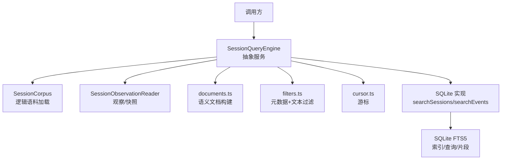
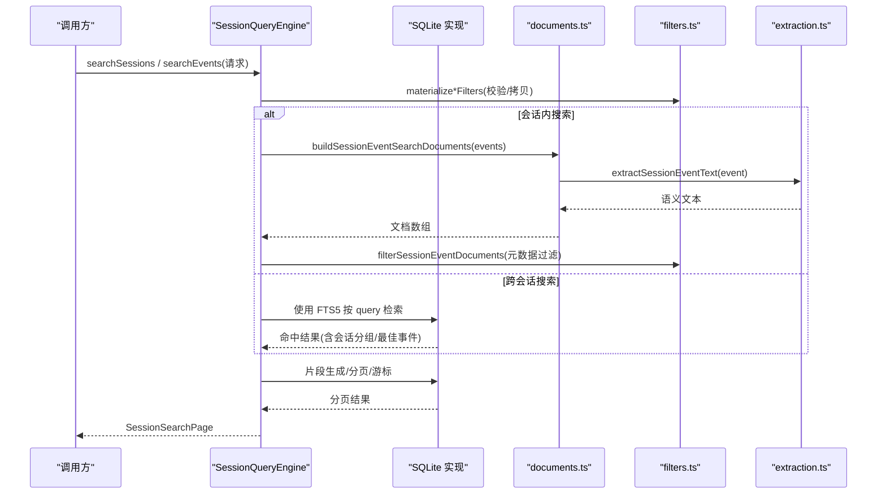
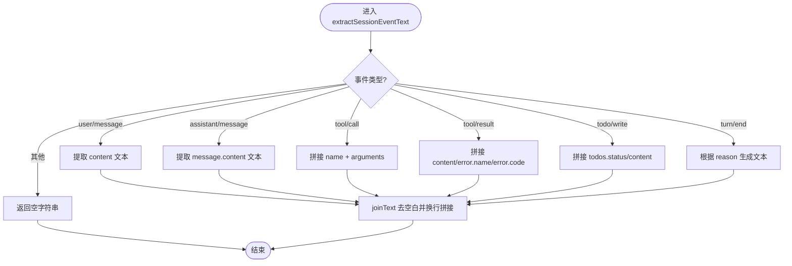
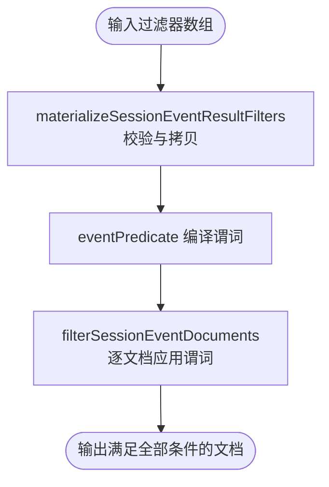
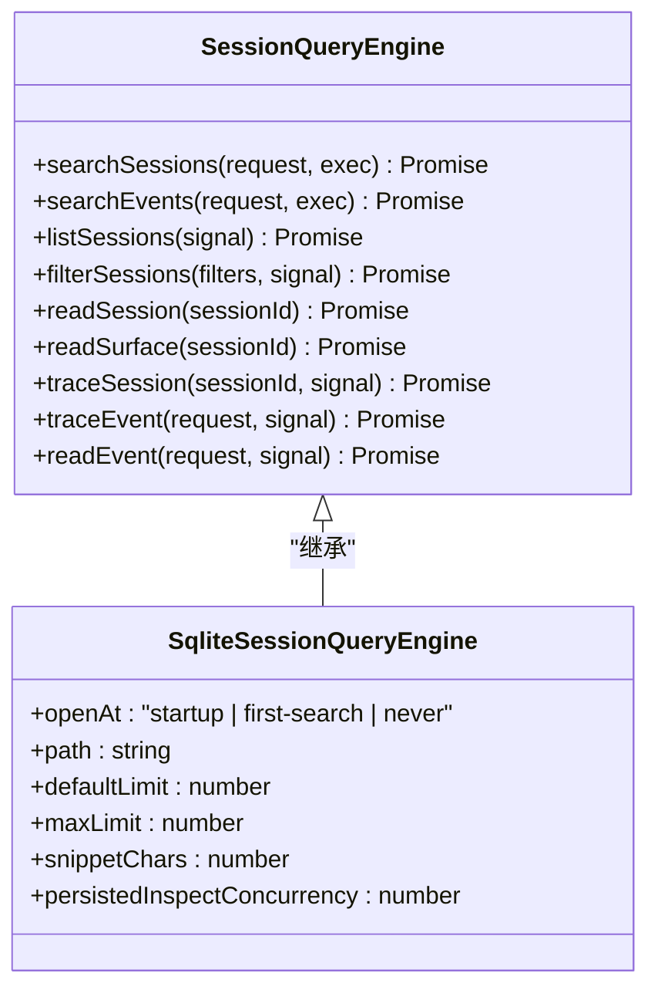
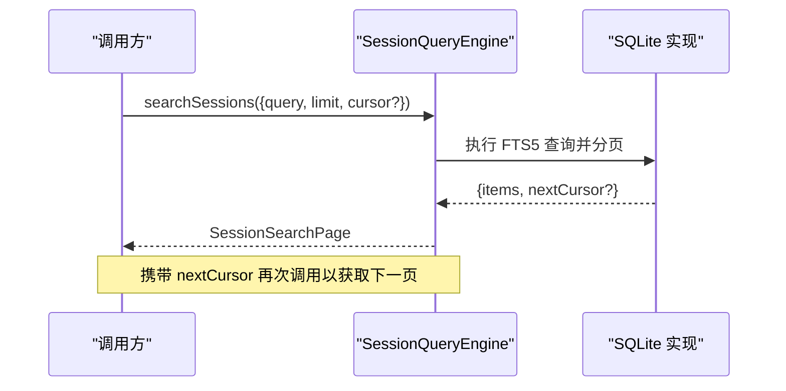
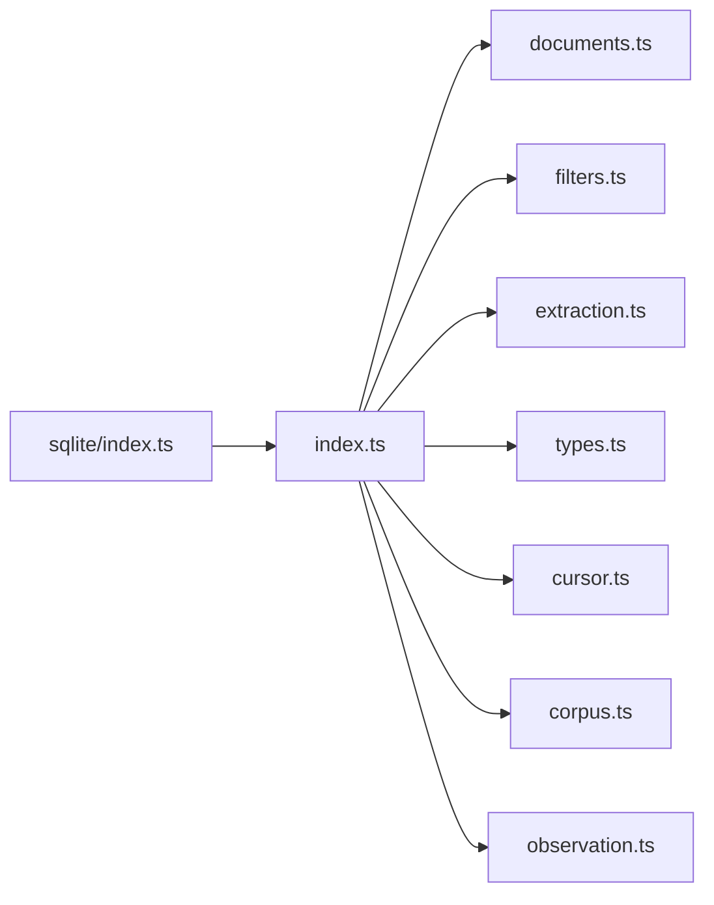

# 事件搜索系统

<cite>
**本文引用的文件**
- [packages/session-query/session-query/src/index.ts](file://packages/session-query/session-query/src/index.ts)
- [packages/session-query/session-query/src/documents.ts](file://packages/session-query/session-query/src/documents.ts)
- [packages/session-query/session-query/src/filters.ts](file://packages/session-query/session-query/src/filters.ts)
- [packages/session-query/session-query/src/extraction.ts](file://packages/session-query/session-query/src/extraction.ts)
- [packages/session-query/session-query/src/types.ts](file://packages/session-query/session-query/src/types.ts)
- [packages/session-query/session-query/src/cursor.ts](file://packages/session-query/session-query/src/cursor.ts)
- [packages/session-query/session-query-sqlite/src/index.ts](file://packages/session-query/session-query-sqlite/src/index.ts)
</cite>

## 目录
1. [简介](#简介)
2. [项目结构](#项目结构)
3. [核心组件](#核心组件)
4. [架构总览](#架构总览)
5. [详细组件分析](#详细组件分析)
6. [依赖关系分析](#依赖关系分析)
7. [性能考虑](#性能考虑)
8. [故障排查指南](#故障排查指南)
9. [结论](#结论)
10. [附录](#附录)

## 简介
本文件面向 DeepSeek Harness 的事件搜索系统，聚焦跨会话与会话内两种搜索模式、语义文档构建、过滤器组合、全文检索实现（含 SQLite 全文索引生命周期）、以及分页与游标管理。目标是帮助读者在不深入源码的情况下理解并正确使用该子系统，同时为二次开发提供清晰的扩展点与优化建议。

## 项目结构
事件搜索系统由“提供者无关的查询抽象”和“SQLite 全文检索实现”两部分组成：
- 抽象层（session-query）：定义统一的 SessionQueryEngine 抽象类，提供精确读取、过滤、追踪能力，并暴露跨会话与会话内全文搜索的抽象接口。
- 实现层（session-query-sqlite）：基于 SQLite FTS5 提供全文检索、片段生成、分页与游标等具体行为。

图表来源
- [packages/session-query/session-query/src/index.ts:87-148](file://packages/session-query/session-query/src/index.ts#L87-L148)
- [packages/session-query/session-query/src/documents.ts:15-54](file://packages/session-query/session-query/src/documents.ts#L15-L54)
- [packages/session-query/session-query/src/filters.ts:18-38](file://packages/session-query/session-query/src/filters.ts#L18-L38)
- [packages/session-query/session-query-sqlite/src/index.ts:85-114](file://packages/session-query/session-query-sqlite/src/index.ts#L85-L114)

章节来源
- [packages/session-query/session-query/src/index.ts:87-148](file://packages/session-query/session-query/src/index.ts#L87-L148)
- [packages/session-query/session-query-sqlite/src/index.ts:85-114](file://packages/session-query/session-query-sqlite/src/index.ts#L85-L114)

## 核心组件
- 抽象服务 SessionQueryEngine：封装跨会话与会话内搜索的统一入口，提供 list/filter/trace/read 等精确操作，以及 searchSessions/searchEvents 两个抽象方法供具体后端实现。
- 语义文档构建 buildSessionEventSearchDocuments：将原始事件序列投影为可搜索的轻量文档，包含 sessionId、seq、type、time、surface 及 text。
- 过滤器 filters：提供 session 级与 event 级过滤，支持 seq/time/type/surface/text 的组合，且所有条件以 AND 连接，列表值内部为 OR。
- 文本提取 extraction：从第一方事件中抽取“语义文本”，忽略结构性边界、流式分块与未知事件，保证索引与匹配稳定可控。
- 类型与请求响应 types：定义 SessionEventSearchDocument、SessionEventResultFilter、SessionSearchRequest、SessionEventSearchRequest、SessionSearchPage 等契约。
- 游标 cursor：用于分页的不可见延续标记，确保相同规范化请求下的确定性翻页。

章节来源
- [packages/session-query/session-query/src/index.ts:87-148](file://packages/session-query/session-query/src/index.ts#L87-L148)
- [packages/session-query/session-query/src/documents.ts:15-54](file://packages/session-query/session-query/src/documents.ts#L15-L54)
- [packages/session-query/session-query/src/filters.ts:18-38](file://packages/session-query/session-query/src/filters.ts#L18-L38)
- [packages/session-query/session-query/src/extraction.ts:15-44](file://packages/session-query/session-query/src/extraction.ts#L15-L44)
- [packages/session-query/session-query/src/types.ts:215-280](file://packages/session-query/session-query/src/types.ts#L215-L280)

## 架构总览
下图展示跨会话与会话内搜索在抽象层与 SQLite 实现层的交互流程，包括请求参数、过滤阶段、全文检索、片段生成与分页返回。

图表来源
- [packages/session-query/session-query/src/index.ts:128-148](file://packages/session-query/session-query/src/index.ts#L128-L148)
- [packages/session-query/session-query/src/documents.ts:35-54](file://packages/session-query/session-query/src/documents.ts#L35-L54)
- [packages/session-query/session-query/src/filters.ts:75-98](file://packages/session-query/session-query/src/filters.ts#L75-L98)
- [packages/session-query/session-query/src/extraction.ts:15-44](file://packages/session-query/session-query/src/extraction.ts#L15-L44)
- [packages/session-query/session-query-sqlite/src/index.ts:85-114](file://packages/session-query/session-query-sqlite/src/index.ts#L85-L114)

## 详细组件分析

### 跨会话 vs 会话内搜索：区别与使用场景
- 跨会话搜索 searchSessions
  - 目标：在所有逻辑会话中按全文查询进行检索，并按会话分组，返回每个会话的“最强匹配事件”。
  - 适用场景：全局检索、审计回溯、跨会话关联定位。
  - 输入：query、可选 sessionFilters/eventFilters、limit、cursor。
  - 输出：SessionSearchPage<SessionSearchHit>，其中 bestMatch 为该会话的最佳事件片段。
- 会话内搜索 searchEvents
  - 目标：针对单个会话的完整日志进行全文检索，直接返回匹配事件及其片段。
  - 适用场景：单会话调试、错误定位、上下文回顾。
  - 输入：sessionId、query、filters、limit、cursor。
  - 输出：SessionEventSearchPage，包含 session 头与命中事件片段。

章节来源
- [packages/session-query/session-query/src/index.ts:128-148](file://packages/session-query/session-query/src/index.ts#L128-L148)
- [packages/session-query/session-query/src/types.ts:241-280](file://packages/session-query/session-query/src/types.ts#L241-L280)

### SessionEventSearchDocument 结构与 text 字段语义
- 结构字段
  - sessionId：所属会话标识。
  - seq：单调递增的事件序号。
  - type：事件类型。
  - time：事件时间戳（毫秒）。
  - surface：事件在折叠后的模型表面中的位置（current/shadowed/log-only）。
  - text：第一方语义文本，用于扫描过滤与全文索引。
- text 字段的语义文本提取机制
  - 仅对第一方事件抽取可搜索文本，忽略结构性边界、流式分块与未知事件。
  - 用户消息、助手消息、工具调用/结果、待办写入、回合结束原因等会贡献文本。
  - 文本通过换行拼接，去除空白后保留有效片段，避免噪声。

图表来源
- [packages/session-query/session-query/src/extraction.ts:15-44](file://packages/session-query/session-query/src/extraction.ts#L15-L44)
- [packages/session-query/session-query/src/extraction.ts:66-89](file://packages/session-query/session-query/src/extraction.ts#L66-L89)

章节来源
- [packages/session-query/session-query/src/documents.ts:35-54](file://packages/session-query/session-query/src/documents.ts#L35-L54)
- [packages/session-query/session-query/src/extraction.ts:15-44](file://packages/session-query/session-query/src/extraction.ts#L15-L44)
- [packages/session-query/session-query/src/types.ts:215-219](file://packages/session-query/session-query/src/types.ts#L215-L219)

### SessionEventResultFilter 使用方法与组合逻辑
- 支持的过滤器种类
  - seq：按事件序号范围过滤（from/to 闭区间）。
  - time：按事件时间范围过滤（from/to 闭区间）。
  - type：按事件类型集合过滤（OR 关系）。
  - surface：按表面位置过滤（current/shadowed/log-only），集合内 OR。
  - text：按语义文本进行大小写不敏感、空白符灵活的匹配。
- 组合逻辑
  - 多个过滤器之间为 AND；同一过滤器的 values 列表为 OR。
  - 文本过滤器会将输入按空白切分并转义特殊字符，生成安全的正则表达式进行匹配。
- 使用建议
  - 先做元数据过滤（seq/time/type/surface），再做文本过滤，减少扫描面。
  - 合理设置 from/to 范围，避免全表扫描。
  - 文本查询尽量使用短语或关键词组合，避免过长模糊串。

图表来源
- [packages/session-query/session-query/src/filters.ts:75-98](file://packages/session-query/session-query/src/filters.ts#L75-L98)
- [packages/session-query/session-query/src/filters.ts:140-162](file://packages/session-query/session-query/src/filters.ts#L140-L162)
- [packages/session-query/session-query/src/filters.ts:105-118](file://packages/session-query/session-query/src/filters.ts#L105-L118)

章节来源
- [packages/session-query/session-query/src/filters.ts:18-38](file://packages/session-query/session-query/src/filters.ts#L18-L38)
- [packages/session-query/session-query/src/filters.ts:75-98](file://packages/session-query/session-query/src/filters.ts#L75-L98)
- [packages/session-query/session-query/src/filters.ts:105-118](file://packages/session-query/session-query/src/filters.ts#L105-L118)
- [packages/session-query/session-query/src/types.ts:201-213](file://packages/session-query/session-query/src/types.ts#L201-L213)

### 全文搜索实现原理与 SQLite 全文索引生命周期
- 抽象接口
  - searchSessions：跨会话全文检索，按会话分组并返回最佳匹配事件。
  - searchEvents：会话内全文检索，返回命中事件与片段。
- SQLite 实现要点
  - 配置项 path：指定 FTS5 数据库路径，支持内存数据库。
  - openAt：控制何时打开 SQLite 模块与句柄（启动时/首次搜索时/禁用）。
  - defaultLimit/maxLimit：默认与最大页大小限制。
  - snippetChars：片段最大 Unicode 码点长度。
  - persistedInspectConcurrency：持久化日志并发检查上限。
- 生命周期管理
  - 可在服务激活时或首次搜索时打开索引，避免不必要的资源占用。
  - 禁用模式（never）下，exact 读取与过滤仍可用，但全文搜索不可用。
  - 同步 SQL 执行期间不可抢占，但在前后检查中止信号，保证队列取消及时生效。

图表来源
- [packages/session-query/session-query/src/index.ts:87-148](file://packages/session-query/session-query/src/index.ts#L87-L148)
- [packages/session-query/session-query-sqlite/src/index.ts:85-114](file://packages/session-query/session-query-sqlite/src/index.ts#L85-L114)

章节来源
- [packages/session-query/session-query-sqlite/src/index.ts:85-114](file://packages/session-query/session-query-sqlite/src/index.ts#L85-L114)
- [packages/session-query/session-query/src/index.ts:128-148](file://packages/session-query/session-query/src/index.ts#L128-L148)

### 高效文本搜索实践示例（代码片段路径）
以下为常见搜索模式的实现参考路径，便于快速定位到对应函数与类型定义：
- 模糊匹配（按空白切分的短语匹配）
  - 参考路径：[compileSessionTextFilter:105-118](file://packages/session-query/session-query/src/filters.ts#L105-L118)
- 大小写不敏感搜索
  - 参考路径：[compileSessionTextFilter 的正则标志 i/u:105-118](file://packages/session-query/session-query/src/filters.ts#L105-L118)
- 空白符灵活处理
  - 参考路径：[compileSessionTextFilter 的空白切分与转义:105-118](file://packages/session-query/session-query/src/filters.ts#L105-L118)
- 组合 seq/time/type/surface/text 过滤器
  - 参考路径：[materializeSessionEventResultFilters:75-98](file://packages/session-query/session-query/src/filters.ts#L75-L98)、[eventPredicate:140-162](file://packages/session-query/session-query/src/filters.ts#L140-L162)
- 会话内过滤扫描
  - 参考路径：[filterEvents -> _filterEvents -> buildSessionEventSearchDocuments -> filterSessionEventDocuments:254-276](file://packages/session-query/session-query/src/index.ts#L254-L276)
- 跨会话全文检索
  - 参考路径：[searchSessions 抽象声明:128-137](file://packages/session-query/session-query/src/index.ts#L128-L137)

章节来源
- [packages/session-query/session-query/src/filters.ts:105-118](file://packages/session-query/session-query/src/filters.ts#L105-L118)
- [packages/session-query/session-query/src/filters.ts:140-162](file://packages/session-query/session-query/src/filters.ts#L140-L162)
- [packages/session-query/session-query/src/index.ts:254-276](file://packages/session-query/session-query/src/index.ts#L254-L276)
- [packages/session-query/session-query/src/index.ts:128-137](file://packages/session-query/session-query/src/index.ts#L128-L137)

### 搜索结果的分页机制与游标管理
- 分页对象
  - SessionSearchPage：包含 items 与 nextCursor（最后一页无 nextCursor）。
  - SessionEventSearchPage：额外绑定 target session 头。
- 游标
  - SessionSearchCursor：不可见的延续标记，用于相同规范化请求下的确定性翻页。
- 行为约定
  - limit：每页最大条目数。
  - cursor：传入上一页返回的 nextCursor 继续下一页。
  - 排序与稳定性：由具体实现保证确定性顺序，跨会话按会话分组并以最佳事件排名。

图表来源
- [packages/session-query/session-query/src/types.ts:221-233](file://packages/session-query/session-query/src/types.ts#L221-L233)
- [packages/session-query/session-query/src/index.ts:128-148](file://packages/session-query/session-query/src/index.ts#L128-L148)
- [packages/session-query/session-query/src/cursor.ts:1-200](file://packages/session-query/session-query/src/cursor.ts#L1-L200)

章节来源
- [packages/session-query/session-query/src/types.ts:221-233](file://packages/session-query/session-query/src/types.ts#L221-L233)
- [packages/session-query/session-query/src/index.ts:128-148](file://packages/session-query/session-query/src/index.ts#L128-L148)
- [packages/session-query/session-query/src/cursor.ts:1-200](file://packages/session-query/session-query/src/cursor.ts#L1-L200)

## 依赖关系分析
- 模块耦合
  - index.ts 依赖 documents.ts、filters.ts、extraction.ts、types.ts、cursor.ts，以及底层 corpus/observation 组件。
  - SQLite 实现依赖抽象接口，并通过配置控制索引生命周期。
- 外部依赖
  - dsh-session：事件、会话、表面折叠等基础类型与能力。
  - dsh-session-title：标题折叠能力。
  - cordis：服务注入与上下文。
- 潜在循环依赖
  - 当前设计通过抽象与实现分离，避免循环依赖；index.ts 仅导出类型与函数，不反向依赖实现。

图表来源
- [packages/session-query/session-query/src/index.ts:1-73](file://packages/session-query/session-query/src/index.ts#L1-L73)
- [packages/session-query/session-query-sqlite/src/index.ts:85-114](file://packages/session-query/session-query-sqlite/src/index.ts#L85-L114)

章节来源
- [packages/session-query/session-query/src/index.ts:1-73](file://packages/session-query/session-query/src/index.ts#L1-L73)
- [packages/session-query/session-query-sqlite/src/index.ts:85-114](file://packages/session-query/session-query-sqlite/src/index.ts#L85-L114)

## 性能考虑
- 优先使用元数据过滤缩小范围：在文本匹配前先用 seq/time/type/surface 过滤，降低扫描成本。
- 合理使用页大小：结合业务场景设置 limit，避免单次返回过多数据。
- 文本查询优化：使用短语匹配与关键词组合，避免超长模糊串；利用空白灵活匹配提升召回率。
- 索引生命周期：根据部署策略选择 startup/first-search/never，平衡启动时间与资源占用。
- 并发控制：调整 persistedInspectConcurrency，避免持久化源过载。

## 故障排查指南
- 无效过滤器
  - 现象：抛出 SESSION_QUERY_INVALID_FILTER。
  - 排查：检查 kind 是否合法、values 是否为数组、range 是否有限且 from<=to。
  - 参考路径：[invalidFilter/validateRange/assertAllowedValues:171-239](file://packages/session-query/session-query/src/filters.ts#L171-L239)
- 文本过滤器为空或仅空白
  - 现象：抛出 SESSION_QUERY_INVALID_FILTER。
  - 排查：确保 text 包含非空白字符。
  - 参考路径：[compileSessionTextFilter 校验:105-118](file://packages/session-query/session-query/src/filters.ts#L105-L118)
- 事件不存在
  - 现象：SESSION_QUERY_EVENT_NOT_FOUND。
  - 排查：确认 sessionId 与 seq 正确，日志是否被截断或修复。
  - 参考路径：[_readEvent 异常分支:336-366](file://packages/session-query/session-query/src/index.ts#L336-L366)
- 全文搜索被禁用
  - 现象：searchSessions/searchEvents 失败，错误码指示搜索已禁用。
  - 排查：检查 openAt 配置是否为 never，或 SQLite 未初始化。
  - 参考路径：[Config.openAt 说明:85-114](file://packages/session-query/session-query-sqlite/src/index.ts#L85-L114)

章节来源
- [packages/session-query/session-query/src/filters.ts:171-239](file://packages/session-query/session-query/src/filters.ts#L171-L239)
- [packages/session-query/session-query/src/index.ts:336-366](file://packages/session-query/session-query/src/index.ts#L336-L366)
- [packages/session-query/session-query-sqlite/src/index.ts:85-114](file://packages/session-query/session-query-sqlite/src/index.ts#L85-L114)

## 结论
DeepSeek Harness 的事件搜索系统通过抽象与实现的清晰分层，提供了跨会话与会话内的统一搜索体验。其语义文本提取、严格的过滤器校验与组合、SQLite 全文索引的生命周期管理，以及稳定的分页与游标机制，共同保证了高性能与可维护性。推荐在生产环境中根据需求选择合适的 openAt 策略与页大小，并结合元数据过滤优化查询性能。

## 附录
- 关键类型速查
  - SessionEventSearchDocument：[定义:215-219](file://packages/session-query/session-query/src/types.ts#L215-L219)
  - SessionEventResultFilter：[定义:201-213](file://packages/session-query/session-query/src/types.ts#L201-L213)
  - SessionSearchRequest/SessionEventSearchRequest：[定义:241-267](file://packages/session-query/session-query/src/types.ts#L241-L267)
  - SessionSearchPage/SessionEventSearchPage：[定义:221-233](file://packages/session-query/session-query/src/types.ts#L221-L233)
- 常用函数路径
  - 构建语义文档：[buildSessionEventSearchDocuments:35-54](file://packages/session-query/session-query/src/documents.ts#L35-L54)
  - 文本提取：[extractSessionEventText:15-44](file://packages/session-query/session-query/src/extraction.ts#L15-L44)
  - 过滤器编译与应用：[compileSessionTextFilter:105-118](file://packages/session-query/session-query/src/filters.ts#L105-L118)、[filterSessionEventDocuments:32-38](file://packages/session-query/session-query/src/filters.ts#L32-L38)
  - 抽象搜索入口：[searchSessions/searchEvents:128-148](file://packages/session-query/session-query/src/index.ts#L128-L148)