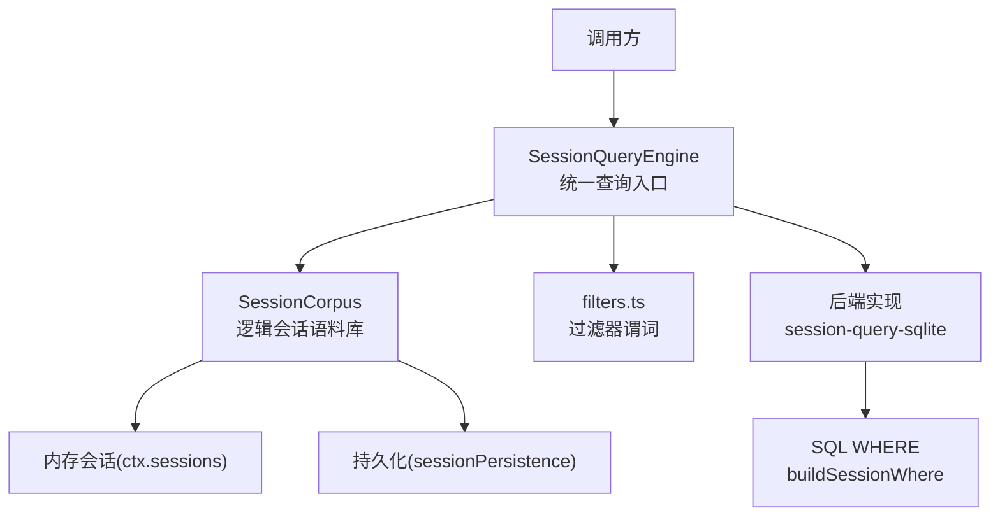
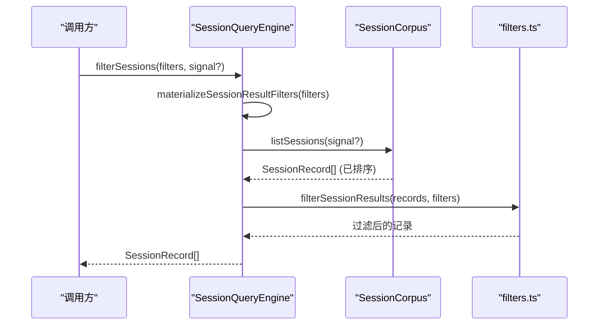
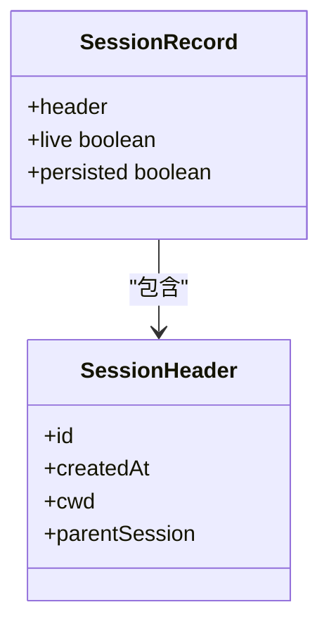
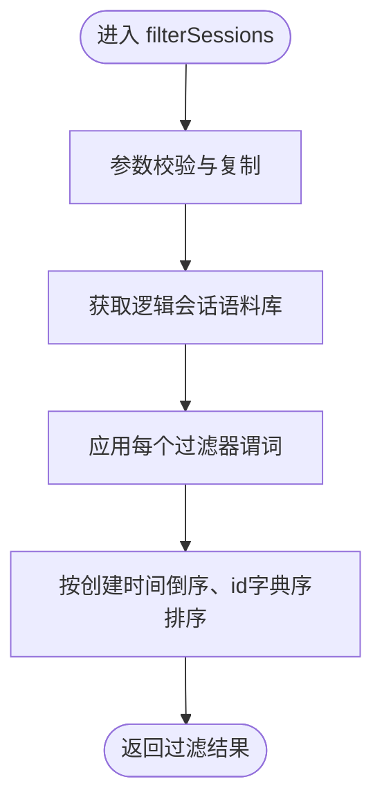
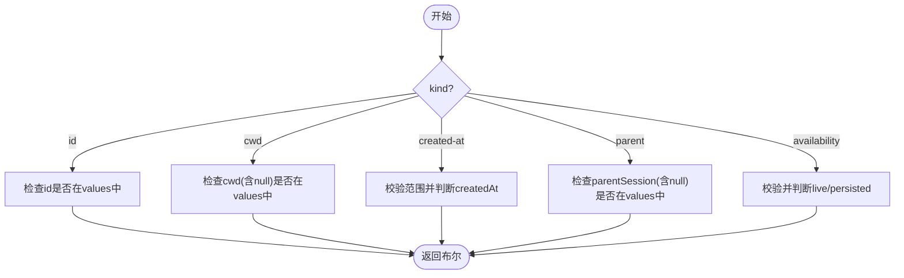
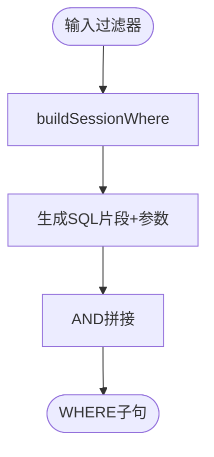
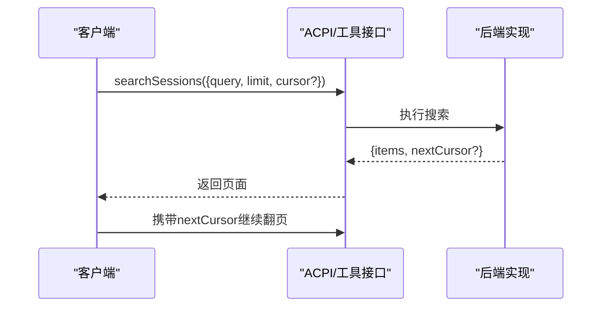
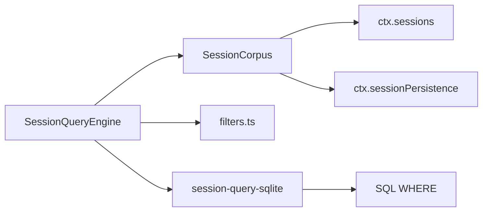

# 会话历史查询

<cite>
**本文引用的文件**
- [packages/session-query/session-query/src/index.ts](file://packages/session-query/session-query/src/index.ts)
- [packages/session-query/session-query/src/types.ts](file://packages/session-query/session-query/src/types.ts)
- [packages/session-query/session-query/src/filters.ts](file://packages/session-query/session-query/src/filters.ts)
- [packages/session-query/session-query/src/corpus.ts](file://packages/session-query/session-query/src/corpus.ts)
- [packages/session-query/session-query/src/cursor.ts](file://packages/session-query/session-query/src/cursor.ts)
- [packages/session-query/session-query-sqlite/src/query.ts](file://packages/session-query/session-query-sqlite/src/query.ts)
- [packages/extension/tool-cordis/src/api-catalog.ts](file://packages/extensions/tool-cordis/src/api-catalog.ts)
- [packages/acp/acp/src/index.ts](file://packages/acp/acp/src/index.ts)
</cite>

## 目录
1. [简介](#简介)
2. [项目结构](#项目结构)
3. [核心组件](#核心组件)
4. [架构总览](#架构总览)
5. [详细组件分析](#详细组件分析)
6. [依赖关系分析](#依赖关系分析)
7. [性能考虑](#性能考虑)
8. [故障排查指南](#故障排查指南)
9. [结论](#结论)
10. [附录：查询示例与最佳实践](#附录：查询示例与最佳实践)

## 简介
本文件面向DeepSeek Harness的“会话历史查询”能力，聚焦以下目标：
- 解释会话记录的结构与属性，特别是SessionRecord中live与persisted状态的含义。
- 详细说明filterSessions()方法的使用方式、SessionResultFilter各类型（id、cwd、created-at、parent、availability）及其组合逻辑。
- 阐述分页查询的实现原理，包括游标机制与结果排序规则。
- 提供构建复杂查询条件的具体示例路径（时间范围过滤、工作目录筛选、可用性检查）。
- 总结查询性能优化策略与最佳实践。

## 项目结构
会话历史查询由“抽象服务层 + 过滤器 + 语料库 + 后端实现”组成：
- 抽象服务层：SessionQueryEngine暴露统一API（如listSessions、filterSessions、searchSessions/searchEvents等），并封装对底层持久化与内存会话的访问。
- 过滤器：提供与后端无关的谓词编译与执行（id、cwd、created-at、parent、availability等）。
- 语料库：负责“内存优先”的逻辑会话集合解析，合并live与persisted来源，生成确定性排序的SessionRecord列表。
- 后端实现：以SQLite为例，将过滤器编译为SQL WHERE子句，并在索引上高效执行。
- 分页与游标：通过SessionSearchCursor在跨会话搜索中实现稳定分页。

图表来源
- [packages/session-query/session-query/src/index.ts:87-186](file://packages/session-query/session-query/src/index.ts#L87-L186)
- [packages/session-query/session-query/src/corpus.ts:53-77](file://packages/session-query/session-query/src/corpus.ts#L53-L77)
- [packages/session-query/session-query/src/filters.ts:18-24](file://packages/session-query/session-query/src/filters.ts#L18-L24)
- [packages/session-query/session-query-sqlite/src/query.ts:140-186](file://packages/session-query/session-query-sqlite/src/query.ts#L140-L186)

章节来源
- [packages/session-query/session-query/src/index.ts:87-186](file://packages/session-query/session-query/src/index.ts#L87-L186)
- [packages/session-query/session-query/src/corpus.ts:53-77](file://packages/session-query/session-query/src/corpus.ts#L53-L77)
- [packages/session-query/session-query/src/filters.ts:18-24](file://packages/session-query/session-query/src/filters.ts#L18-L24)
- [packages/session-query/session-query-sqlite/src/query.ts:140-186](file://packages/session-query/session-query-sqlite/src/query.ts#L140-L186)

## 核心组件
- SessionRecord：表示一个逻辑会话的轻量级快照，包含header、live、persisted三个字段。
  - header：来自“内存优先”语料库的选择结果，包含会话元数据（如id、createdAt、cwd、parentSession等）。
  - live：该会话当前是否存在于内存会话集合中。
  - persisted：该会话是否被当前持久化后端物化（可被列出或检查）。
- filterSessions(filters, signal?)：基于过滤器对完整逻辑会话语料进行过滤，返回按“创建时间倒序、id字典序”确定的SessionRecord数组。
- SessionResultFilter：支持id、cwd、created-at、parent、availability五种谓词；多个过滤器之间是AND关系，同一过滤器内的values是OR关系。
- 分页与游标：跨会话搜索返回SessionSearchPage，其中nextCursor用于下一页读取；排序遵循契约定义顺序（通常按相关性或时间）。

章节来源
- [packages/session-query/session-query/src/types.ts:23-31](file://packages/session-query/session-query/src/types.ts#L23-L31)
- [packages/session-query/session-query/src/index.ts:174-186](file://packages/session-query/session-query/src/index.ts#L174-L186)
- [packages/session-query/session-query/src/types.ts:179-199](file://packages/session-query/session-query/src/types.ts#L179-L199)
- [packages/session-query/session-query/src/types.ts:221-227](file://packages/session-query/session-query/src/types.ts#L221-L227)

## 架构总览
下图展示了filterSessions从调用到落地的关键流程：参数校验与复制、语料库列举、谓词应用与排序。

图表来源
- [packages/session-query/session-query/src/index.ts:174-186](file://packages/session-query/session-query/src/index.ts#L174-L186)
- [packages/session-query/session-query/src/index.ts:262-267](file://packages/session-query/session-query/src/index.ts#L262-L267)
- [packages/session-query/session-query/src/filters.ts:18-24](file://packages/session-query/session-query/src/filters.ts#L18-L24)
- [packages/session-query/session-query/src/corpus.ts:53-77](file://packages/session-query/session-query/src/corpus.ts#L53-L77)

章节来源
- [packages/session-query/session-query/src/index.ts:174-186](file://packages/session-query/session-query/src/index.ts#L174-L186)
- [packages/session-query/session-query/src/corpus.ts:53-77](file://packages/session-query/session-query/src/corpus.ts#L53-L77)
- [packages/session-query/session-query/src/filters.ts:18-24](file://packages/session-query/session-query/src/filters.ts#L18-L24)

## 详细组件分析

### SessionRecord结构与状态语义
- header：包含会话标识、创建时间、工作目录、父会话等元信息。
- live：true表示当前进程内存中存在该会话实例；false表示仅存在于持久化存储。
- persisted：true表示当前持久化后端能列出/检查该会话；false表示未物化或未找到。

图表来源
- [packages/session-query/session-query/src/types.ts:23-31](file://packages/session-query/session-query/src/types.ts#L23-L31)

章节来源
- [packages/session-query/session-query/src/types.ts:23-31](file://packages/session-query/session-query/src/types.ts#L23-L31)

### filterSessions()与SessionResultFilter
- 过滤器类型与含义：
  - id：精确匹配会话ID列表（OR）。
  - cwd：匹配工作目录（可为null，表示无工作目录）。
  - created-at：时间范围过滤（from/to均为闭区间）。
  - parent：匹配父会话ID（可为null）。
  - availability：按“live”或“persisted”筛选存在性。
- 组合逻辑：
  - 多个过滤器之间为AND关系。
  - 单个过滤器内values为OR关系。
- 执行过程：
  - 先materializeSessionResultFilters进行参数复制与校验。
  - 再filterSessionResults对语料库结果逐一应用谓词。

图表来源
- [packages/session-query/session-query/src/index.ts:174-186](file://packages/session-query/session-query/src/index.ts#L174-L186)
- [packages/session-query/session-query/src/filters.ts:18-24](file://packages/session-query/session-query/src/filters.ts#L18-L24)
- [packages/session-query/session-query/src/corpus.ts:299-301](file://packages/session-query/session-query/src/corpus.ts#L299-L301)

章节来源
- [packages/session-query/session-query/src/index.ts:174-186](file://packages/session-query/session-query/src/index.ts#L174-L186)
- [packages/session-query/session-query/src/filters.ts:18-24](file://packages/session-query/session-query/src/filters.ts#L18-L24)
- [packages/session-query/session-query/src/corpus.ts:299-301](file://packages/session-query/session-query/src/corpus.ts#L299-L301)

### 过滤器谓词实现细节
- id：检查record.header.id是否在values中。
- cwd：比较record.header.cwd（允许null）。
- created-at：使用validateRange确保from<=to且数值有效，matchesRange判断createdAt是否在范围内。
- parent：比较record.header.parentSession（允许null）。
- availability：校验值必须为'live'或'persisted'，并按record.live或record.persisted判定。

图表来源
- [packages/session-query/session-query/src/filters.ts:120-138](file://packages/session-query/session-query/src/filters.ts#L120-L138)
- [packages/session-query/session-query/src/filters.ts:215-231](file://packages/session-query/session-query/src/filters.ts#L215-L231)

章节来源
- [packages/session-query/session-query/src/filters.ts:120-138](file://packages/session-query/session-query/src/filters.ts#L120-L138)
- [packages/session-query/session-query/src/filters.ts:215-231](file://packages/session-query/session-query/src/filters.ts#L215-L231)

### 后端SQL编译（SQLite）
- buildSessionWhere将过滤器转换为SQL片段与参数绑定：
  - id -> session_id IN (...)
  - cwd -> cwd IS NULL / IN (...)
  - created-at -> created_at BETWEEN ... AND ...
  - parent -> parent_session IS NULL / IN (...)
  - availability -> live = 1 / persisted = 1
- 最终WHERE子句由所有过滤器AND拼接而成。

图表来源
- [packages/session-query/session-query-sqlite/src/query.ts:140-186](file://packages/session-query/session-query-sqlite/src/query.ts#L140-L186)

章节来源
- [packages/session-query/session-query-sqlite/src/query.ts:140-186](file://packages/session-query/session-query-sqlite/src/query.ts#L140-L186)

### 分页查询与游标机制
- 跨会话搜索返回SessionSearchPage，包含items与可选nextCursor。
- nextCursor为不透明字符串，用于下一次相同规范化请求的续读。
- 排序遵循契约定义顺序（例如按相关性或时间），在ACPI列表中可见按createdAt降序、sessionId字典序的排序策略。

图表来源
- [packages/acp/acp/src/index.ts:316-329](file://packages/acp/acp/src/index.ts#L316-L329)
- [packages/session-query/session-query/src/types.ts:221-227](file://packages/session-query/session-query/src/types.ts#L221-L227)
- [packages/session-query/session-query/src/cursor.ts:1-16](file://packages/session-query/session-query/src/cursor.ts#L1-L16)

章节来源
- [packages/acp/acp/src/index.ts:316-329](file://packages/acp/acp/src/index.ts#L316-L329)
- [packages/session-query/session-query/src/types.ts:221-227](file://packages/session-query/session-query/src/types.ts#L221-L227)
- [packages/session-query/session-query/src/cursor.ts:1-16](file://packages/session-query/session-query/src/cursor.ts#L1-L16)

## 依赖关系分析
- SessionQueryEngine依赖：
  - SessionCorpus：提供逻辑会话语料列举与加载。
  - filters.ts：提供与后端无关的谓词编译与执行。
  - 后端实现（如SQLite）：将过滤器编译为SQL并执行。
- 外部依赖：
  - ctx.sessions：内存会话集合。
  - ctx.sessionPersistence：持久化后端（可选）。

图表来源
- [packages/session-query/session-query/src/index.ts:87-113](file://packages/session-query/session-query/src/index.ts#L87-L113)
- [packages/session-query/session-query/src/corpus.ts:31-51](file://packages/session-query/session-query/src/corpus.ts#L31-L51)
- [packages/session-query/session-query-sqlite/src/query.ts:140-186](file://packages/session-query/session-query-sqlite/src/query.ts#L140-L186)

章节来源
- [packages/session-query/session-query/src/index.ts:87-113](file://packages/session-query/session-query/src/index.ts#L87-L113)
- [packages/session-query/session-query/src/corpus.ts:31-51](file://packages/session-query/session-query/src/corpus.ts#L31-L51)
- [packages/session-query/session-query-sqlite/src/query.ts:140-186](file://packages/session-query/session-query-sqlite/src/query.ts#L140-L186)

## 性能考虑
- 过滤器选择：
  - 优先使用id、cwd、parent等精确匹配，减少扫描范围。
  - created-at范围过滤应尽可能缩小时间窗口。
  - availability过滤可快速区分内存与持久化来源。
- 语料库列举：
  - listSessions返回已排序结果，避免上层重复排序。
  - 内存会话优先，避免不必要的持久化I/O。
- 后端优化：
  - SQLite侧通过buildSessionWhere生成高效WHERE子句，利用索引加速。
  - 合理使用limit与cursor分页，避免一次性拉取大量数据。
- 并发与取消：
  - 支持AbortSignal中断长时间查询。
  - 批量投影projectMany使用有限并发，避免资源争用。

[本节为通用指导，不直接分析具体文件]

## 故障排查指南
- 无效过滤器：
  - 未知kind或非法values会抛出SESSION_QUERY_INVALID_FILTER错误。
  - 时间范围from>to或非数值会触发范围校验错误。
- 会话不存在：
  - 当会话既不在内存也不在持久化时，抛出SESSION_QUERY_SESSION_NOT_FOUND。
- 持久化失败：
  - 持久化列表或检查失败会抛出SESSION_QUERY_PERSISTENCE_FAILED。
  - 损坏的会话会抛出SESSION_QUERY_CORRUPT_SESSION。
- 事件缺失：
  - 读取特定seq的事件时，若不存在则抛出SESSION_QUERY_EVENT_NOT_FOUND。

章节来源
- [packages/session-query/session-query/src/filters.ts:200-239](file://packages/session-query/session-query/src/filters.ts#L200-L239)
- [packages/session-query/session-query/src/corpus.ts:303-305](file://packages/session-query/session-query/src/corpus.ts#L303-L305)
- [packages/session-query/session-query/src/corpus.ts:252-290](file://packages/session-query/session-query/src/corpus.ts#L252-L290)
- [packages/session-query/session-query/src/index.ts:336-366](file://packages/session-query/session-query/src/index.ts#L336-L366)

## 结论
会话历史查询通过“内存优先”的逻辑会话语料库与后端无关的过滤器体系，提供了稳定、可扩展的查询能力。filterSessions()支持多种条件组合，配合SQLite后端的SQL编译，可实现高效过滤与分页。建议在生产环境中结合精确匹配、时间范围与可用性过滤，并使用游标分页控制数据量，以获得最佳性能与用户体验。

[本节为总结，不直接分析具体文件]

## 附录：查询示例与最佳实践
- 构建复杂查询条件（示例路径）：
  - 时间范围过滤：使用created-at过滤器，设置from与to。
    - 参考：[packages/session-query/session-query/src/filters.ts:126-129](file://packages/session-query/session-query/src/filters.ts#L126-L129)
  - 工作目录筛选：使用cwd过滤器，支持null表示无工作目录。
    - 参考：[packages/session-query/session-query/src/filters.ts:124-125](file://packages/session-query/session-query/src/filters.ts#L124-L125)
  - 可用性检查：使用availability过滤器，指定['live']或['persisted']。
    - 参考：[packages/session-query/session-query/src/filters.ts:132-134](file://packages/session-query/session-query/src/filters.ts#L132-L134)
  - 组合逻辑：多个过滤器AND，values OR。
    - 参考：[packages/session-query/session-query/src/filters.ts:18-24](file://packages/session-query/session-query/src/filters.ts#L18-L24)
- 分页查询：
  - 使用searchSessions返回nextCursor，携带至下次请求。
  - 参考：[packages/acp/acp/src/index.ts:316-329](file://packages/acp/acp/src/index.ts#L316-L329)
- 最佳实践：
  - 优先使用id、cwd、parent等精确匹配。
  - 限制created-at范围以减少扫描。
  - 使用availability快速定位内存或持久化来源。
  - 合理设置limit与cursor，避免大页传输。
  - 利用AbortSignal中断长查询。

章节来源
- [packages/session-query/session-query/src/filters.ts:18-24](file://packages/session-query/session-query/src/filters.ts#L18-L24)
- [packages/session-query/session-query/src/filters.ts:124-134](file://packages/session-query/session-query/src/filters.ts#L124-L134)
- [packages/acp/acp/src/index.ts:316-329](file://packages/acp/acp/src/index.ts#L316-L329)