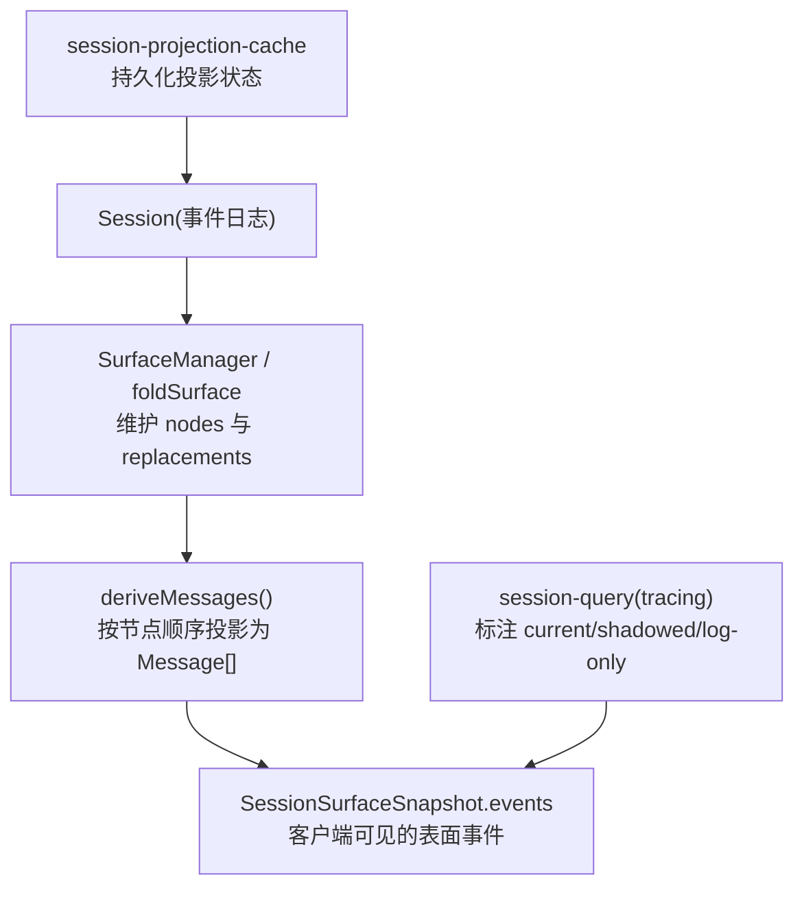
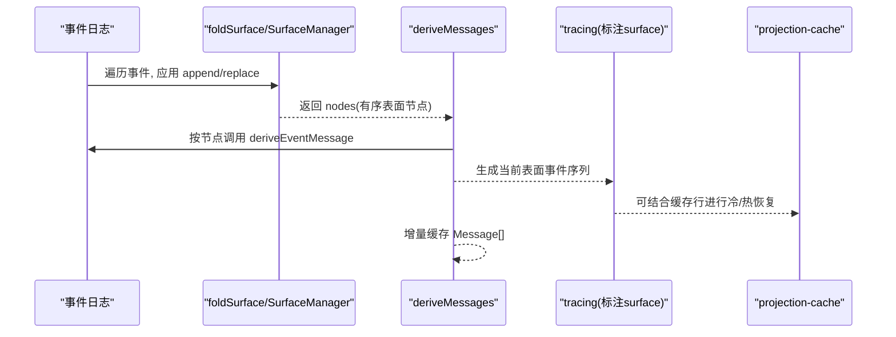
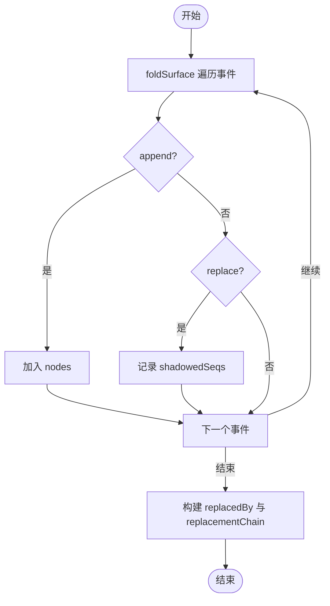
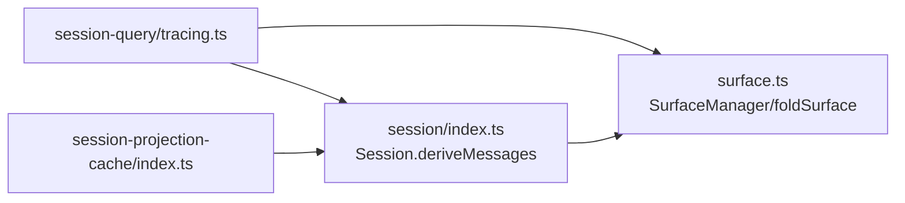

# 会话投影机制

<cite>
**本文引用的文件**
- [packages/core/session/src/surface.ts](file://packages/core/session/src/surface.ts)
- [packages/core/session/src/index.ts](file://packages/core/session/src/index.ts)
- [packages/session-query/session-query/src/types.ts](file://packages/session-query/session-query/src/types.ts)
- [packages/session-query/session-query/src/tracing.ts](file://packages/session-query/session-query/src/tracing.ts)
- [packages/session/session-projection-cache/src/index.ts](file://packages/session/session-projection-cache/src/index.ts)
- [docs/subsystems/session.zh.md](file://docs/subsystems/session.zh.md)
- [docs/subsystems/session-projection.zh.md](file://docs/subsystems/session-projection.zh.md)
</cite>

## 目录
1. [简介](#简介)
2. [项目结构](#项目结构)
3. [核心组件](#核心组件)
4. [架构总览](#架构总览)
5. [详细组件分析](#详细组件分析)
6. [依赖关系分析](#依赖关系分析)
7. [性能考虑](#性能考虑)
8. [故障排查指南](#故障排查指南)
9. [结论](#结论)
10. [附录](#附录)

## 简介
本文件聚焦 DeepSeek Harness 的“会话投影”能力：从不可变的事件日志中，按规则推导当前模型可见的消息表面（surface），并对外提供一致的快照与变更流。文档围绕以下目标展开：
- SessionSurfaceSnapshot 的结构与含义，尤其是 capturedThroughSeq 的作用与 events 数组的构建过程
- deriveMessages() 的实现逻辑：如何从原始事件日志推导当前模型表面
- SessionEventSurface 的三种类型（current、shadowed、log-only）及其在投影中的处理
- 消息折叠与替换链的处理机制：replacementChain 的追踪与最终状态确定
- 自定义投影逻辑与优化策略的代码示例路径
- 投影缓存机制与性能考量

## 项目结构
会话投影由三层协作完成：
- 事件源与表面层：Session 维护追加式事件日志；SurfaceManager/foldSurface 维护有序的消息表面节点序列，并记录替换历史
- 查询与追踪层：session-query 将事件日志折叠为 surface，标注每个事件的 surface 类型，并支持 replacementChain 追踪
- 持久化缓存层：session-projection-cache 对领域投影状态进行持久化，提供冷/热读取与增量恢复

图表来源
- [packages/core/session/src/surface.ts:387-395](file://packages/core/session/src/surface.ts#L387-L395)
- [packages/core/session/src/index.ts:724-745](file://packages/core/session/src/index.ts#L724-L745)
- [packages/session-query/session-query/src/tracing.ts:175-218](file://packages/session-query/session-query/src/tracing.ts#L175-L218)
- [packages/session/session-projection-cache/src/index.ts:85-113](file://packages/session/session-projection-cache/src/index.ts#L85-L113)

章节来源
- [docs/subsystems/session.zh.md:334-494](file://docs/subsystems/session.zh.md#L334-L494)
- [docs/subsystems/session-projection.zh.md:1-329](file://docs/subsystems/session-projection.zh.md#L1-L329)

## 核心组件
- SurfaceManager 与 foldSurface：负责从事件日志中重建有序的消息表面节点序列，并记录每次替换操作（被遮蔽的节点范围）
- deriveEventMessage：单事件到消息的纯投影函数，决定哪些事件进入模型上下文
- Session.deriveMessages：基于 SurfaceManager 的节点序列，增量缓存生成 Message[]
- session-query tracing：将事件标记为 current/shadowed/log-only，并构建 replacementChain
- session-projection-cache：对领域投影状态做持久化，支持 cold/hydrate/cached 读取与恢复

章节来源
- [packages/core/session/src/surface.ts:83-114](file://packages/core/session/src/surface.ts#L83-L114)
- [packages/core/session/src/surface.ts:387-395](file://packages/core/session/src/surface.ts#L387-L395)
- [packages/core/session/src/index.ts:724-745](file://packages/core/session/src/index.ts#L724-L745)
- [packages/session-query/session-query/src/tracing.ts:175-218](file://packages/session-query/session-query/src/tracing.ts#L175-L218)
- [packages/session/session-projection-cache/src/index.ts:85-113](file://packages/session/session-projection-cache/src/index.ts#L85-L113)

## 架构总览
下图展示从事件日志到最终消息表面的完整流程，包括替换、追踪与缓存。

图表来源
- [packages/core/session/src/surface.ts:387-395](file://packages/core/session/src/surface.ts#L387-L395)
- [packages/core/session/src/index.ts:724-745](file://packages/core/session/src/index.ts#L724-L745)
- [packages/session-query/session-query/src/tracing.ts:175-218](file://packages/session-query/session-query/src/tracing.ts#L175-L218)
- [packages/session/session-projection-cache/src/index.ts:85-113](file://packages/session/session-projection-cache/src/index.ts#L85-L113)

## 详细组件分析

### SessionSurfaceSnapshot 结构与 events 构建
- session: 同一观察切面下的克隆会话头，保证一致性
- capturedThroughSeq: 本次观察包含的最高原始日志 seq；空日志时为 null
- events: 按模型历史顺序排列的当前表面事件（已折叠后的结果）

events 的构建过程：
1) 通过 foldSurface 或 SurfaceManager.nodes 得到有序表面节点序列（仅包含参与模型上下文的节点）
2) 对每个节点调用 deriveEventMessage 投影为 Message
3) 过滤掉不产生消息的节点（如空内容 assistant/message）
4) 将结果作为 events 输出

capturedThroughSeq 的意义：
- 表示本次快照覆盖到的最新原始事件序号，便于消费者判断数据新鲜度与对齐后续增量

章节来源
- [packages/session-query/session-query/src/types.ts:34-41](file://packages/session-query/session-query/src/types.ts#L34-L41)
- [packages/core/session/src/surface.ts:387-395](file://packages/core/session/src/surface.ts#L387-L395)
- [packages/core/session/src/index.ts:724-745](file://packages/core/session/src/index.ts#L724-L745)

### deriveMessages() 实现逻辑
- 使用 SurfaceManager 维护的 nodes 序列作为唯一输入源
- 若 replaceGeneration 发生变化（发生替换），则清空并重建缓存
- 增量追加新节点的投影结果，避免重复计算
- 返回浅拷贝的 Message[]，内部对象共享且深冻结，保证不可变性与零二次克隆

算法要点：
- O(新增节点) 增量更新
- 替换时整体重建，确保一致性
- 投影函数 deriveEventMessage 是纯函数，外部可复用

章节来源
- [packages/core/session/src/index.ts:724-745](file://packages/core/session/src/index.ts#L724-L745)
- [packages/core/session/src/surface.ts:83-114](file://packages/core/session/src/surface.ts#L83-L114)

### SessionEventSurface 的三种类型及处理
- current：位于当前表面节点集合中的事件
- shadowed：曾被某个 replace 遮蔽的事件
- log-only：从未进入模型表面的事件（如 chunk、边界等）

处理流程：
- 先 foldSurface 得到 nodes 与 replacements
- 用 nodes 集合判定 current
- 用 replacements 映射被遮蔽事件到其替代者，判定 shadowed
- 其余为 log-only

章节来源
- [packages/session-query/session-query/src/types.ts:20-21](file://packages/session-query/session-query/src/types.ts#L20-L21)
- [packages/session-query/session-query/src/tracing.ts:175-218](file://packages/session-query/session-query/src/tracing.ts#L175-L218)
- [packages/core/session/src/surface.ts:116-134](file://packages/core/session/src/surface.ts#L116-L134)

### 消息折叠与替换链（replacementChain）
- foldSurface 会记录每次 replace 的 shadowedSeqs 与被替换范围
- tracing 根据 replacements 构建 replacedBy 映射，并沿链追溯至最终替代者，形成 replacementChain
- 最终状态由链条末端事件决定；若某事件未被任何后续 replace 覆盖，则为最终保留项

图表来源
- [packages/core/session/src/surface.ts:320-379](file://packages/core/session/src/surface.ts#L320-L379)
- [packages/core/session/src/surface.ts:387-395](file://packages/core/session/src/surface.ts#L387-L395)
- [packages/session-query/session-query/src/tracing.ts:175-218](file://packages/session-query/session-query/src/tracing.ts#L175-L218)

章节来源
- [packages/core/session/src/surface.ts:116-134](file://packages/core/session/src/surface.ts#L116-L134)
- [packages/core/session/src/surface.ts:320-379](file://packages/core/session/src/surface.ts#L320-L379)
- [packages/session-query/session-query/src/tracing.ts:175-218](file://packages/session-query/session-query/src/tracing.ts#L175-L218)

### 自定义投影逻辑与优化策略（代码示例路径）
- 定义纯 apply(state, event) 与 init(header)，保持同步与 JSON 状态
- 通过 ctx.sessionProjections.register 注册单元，声明 key、stateSchema、stateVersion
- 如需对外暴露视图，提供 wire.view(state) 与 viewSchema
- 利用 state 引用不变性（Object.is）减少下游工作
- 使用缓存服务：cachedSnapshot/hydratePrepared/coldSnapshot 进行冷/热读取与恢复

参考路径：
- 投影单元接口与注册表说明：[docs/subsystems/session-projection.zh.md:10-67](file://docs/subsystems/session-projection.zh.md#L10-L67)
- 注册表 API（register/snapshot/stateOf 等）：[docs/subsystems/session-projection.zh.md:176-323](file://docs/subsystems/session-projection.zh.md#L176-L323)
- 缓存服务 API（coldSnapshot/hydrate 等）：[docs/subsystems/session-projection.zh.md:112-174](file://docs/subsystems/session-projection.zh.md#L112-L174)

章节来源
- [docs/subsystems/session-projection.zh.md:10-67](file://docs/subsystems/session-projection.zh.md#L10-L67)
- [docs/subsystems/session-projection.zh.md:112-174](file://docs/subsystems/session-projection.zh.md#L112-L174)
- [docs/subsystems/session-projection.zh.md:176-323](file://docs/subsystems/session-projection.zh.md#L176-L323)

## 依赖关系分析
- Session 依赖 surface.ts 提供的 SurfaceManager/foldSurface/deriveEventMessage
- session-query 依赖 surface.ts 的折叠结果来标注 surface 类型与构建 replacementChain
- session-projection-cache 依赖 session-projection registry 的状态与事件驱动，提供持久化读写

图表来源
- [packages/core/session/src/index.ts:724-745](file://packages/core/session/src/index.ts#L724-L745)
- [packages/core/session/src/surface.ts:387-395](file://packages/core/session/src/surface.ts#L387-L395)
- [packages/session-query/session-query/src/tracing.ts:175-218](file://packages/session-query/session-query/src/tracing.ts#L175-L218)
- [packages/session/session-projection-cache/src/index.ts:85-113](file://packages/session/session-projection-cache/src/index.ts#L85-L113)

章节来源
- [packages/core/session/src/index.ts:724-745](file://packages/core/session/src/index.ts#L724-L745)
- [packages/core/session/src/surface.ts:387-395](file://packages/core/session/src/surface.ts#L387-L395)
- [packages/session-query/session-query/src/tracing.ts:175-218](file://packages/session-query/session-query/src/tracing.ts#L175-L218)
- [packages/session/session-projection-cache/src/index.ts:85-113](file://packages/session/session-projection-cache/src/index.ts#L85-L113)

## 性能考虑
- 增量缓存：deriveMessages 仅在 replaceGeneration 变化时重建，否则 O(新增节点)
- 纯函数投影：deriveEventMessage 无副作用，易于缓存与复用
- 不可变数据：Message 对象深冻结，避免二次克隆与并发修改风险
- 替换代价：replace 触发重建，但能正确维护一致性；应尽量减少大范围替换
- 缓存命中：session-projection-cache 的 cachedSnapshot/hydratePrepared 可减少冷读成本
- 事件驱动：registry 订阅一次 session/event，逐事件推进各单元状态，避免轮询

章节来源
- [packages/core/session/src/index.ts:724-745](file://packages/core/session/src/index.ts#L724-L745)
- [packages/core/session/src/surface.ts:387-395](file://packages/core/session/src/surface.ts#L387-L395)
- [docs/subsystems/session-projection.zh.md:112-174](file://docs/subsystems/session-projection.zh.md#L112-L174)

## 故障排查指南
- 事件序列不连续：foldSurface 会抛出错误，检查事件 seq 是否连续
- sourceEventSeqs 非法：必须为非负安全整数、无重复、全部早于当前事件；替换时必须包含所有被遮蔽节点
- tool/result 替换限制：只能改写 content，其他字段需保持一致
- 非 surface 事件携带 surfaceOp/sourceEventSeqs：会被拒绝
- 缓存写入失败：session-projection-cache 采用 fail-soft 策略，失败会记录警告并在下次写入自愈

章节来源
- [packages/core/session/src/surface.ts:184-208](file://packages/core/session/src/surface.ts#L184-L208)
- [packages/core/session/src/surface.ts:210-243](file://packages/core/session/src/surface.ts#L210-L243)
- [packages/core/session/src/surface.ts:286-318](file://packages/core/session/src/surface.ts#L286-L318)
- [packages/session/session-projection-cache/src/index.ts:85-113](file://packages/session/session-projection-cache/src/index.ts#L85-L113)

## 结论
会话投影以不可变事件日志为事实源，通过严格的表面折叠规则与纯投影函数，稳定地推导出当前模型可见的消息历史。借助 replaceGeneration 与增量缓存，deriveMessages 具备高效与一致性的双重保障；session-query 的 tracing 提供了细粒度的 surface 类型标注与替换链追踪；session-projection-cache 则在持久化层面提供冷/热读取与恢复能力。遵循这些设计原则，可在扩展自定义投影逻辑的同时，保持系统的高性能与强一致性。

## 附录
- 关键类型与 API 参考：
  - SessionSurfaceSnapshot：[packages/session-query/session-query/src/types.ts:34-41](file://packages/session-query/session-query/src/types.ts#L34-L41)
  - SessionEventSurface：[packages/session-query/session-query/src/types.ts:20-21](file://packages/session-query/session-query/src/types.ts#L20-L21)
  - deriveEventMessage：[packages/core/session/src/surface.ts:83-114](file://packages/core/session/src/surface.ts#L83-L114)
  - foldSurface：[packages/core/session/src/surface.ts:387-395](file://packages/core/session/src/surface.ts#L387-L395)
  - Session.deriveMessages：[packages/core/session/src/index.ts:724-745](file://packages/core/session/src/index.ts#L724-L745)
  - tracing 标注与 replacementChain：[packages/session-query/session-query/src/tracing.ts:175-218](file://packages/session-query/session-query/src/tracing.ts#L175-L218)
  - 投影缓存服务 API：[docs/subsystems/session-projection.zh.md:112-174](file://docs/subsystems/session-projection.zh.md#L112-L174)
  - 投影注册表 API：[docs/subsystems/session-projection.zh.md:176-323](file://docs/subsystems/session-projection.zh.md#L176-L323)