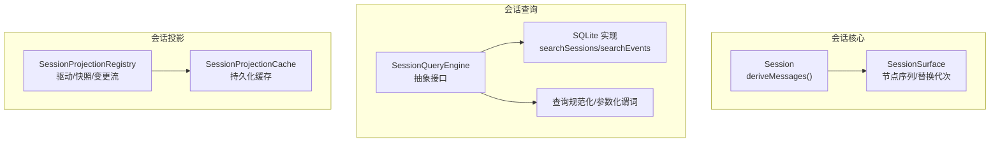
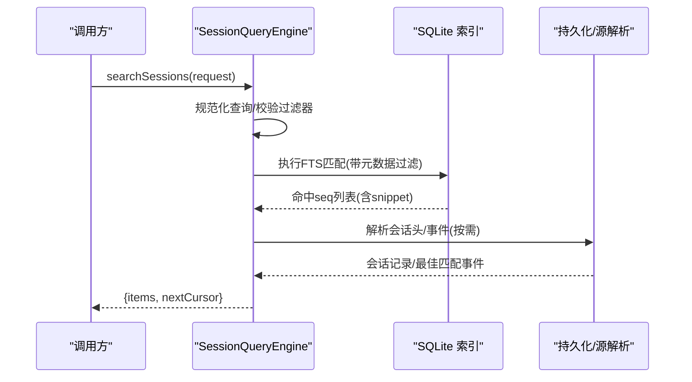
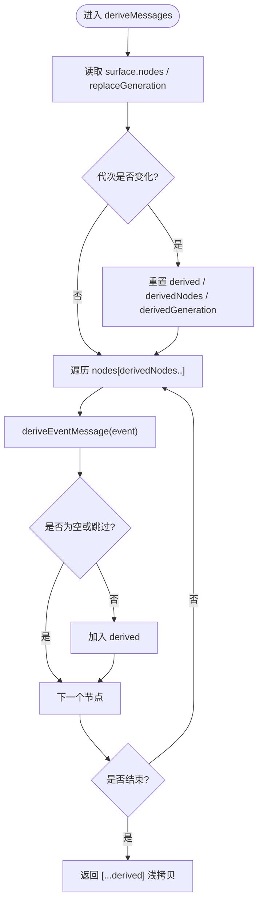
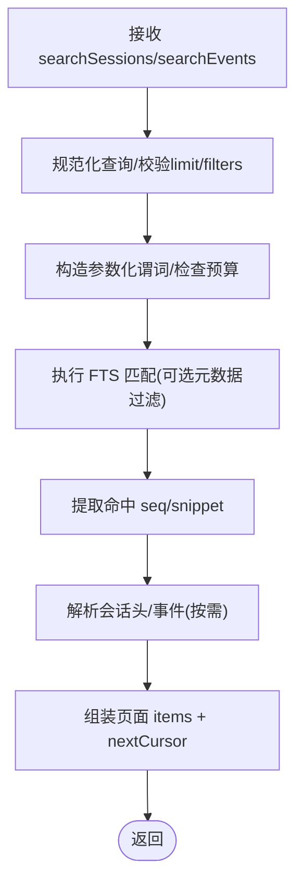
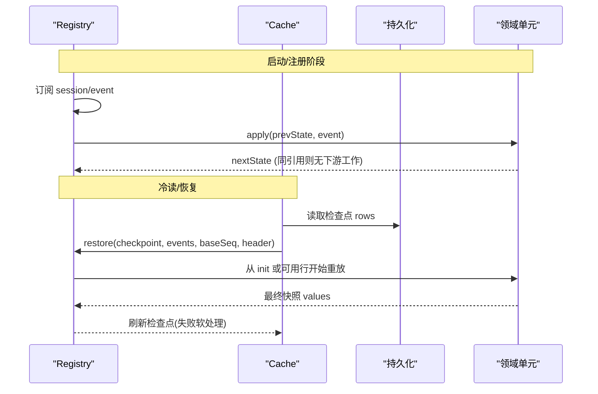
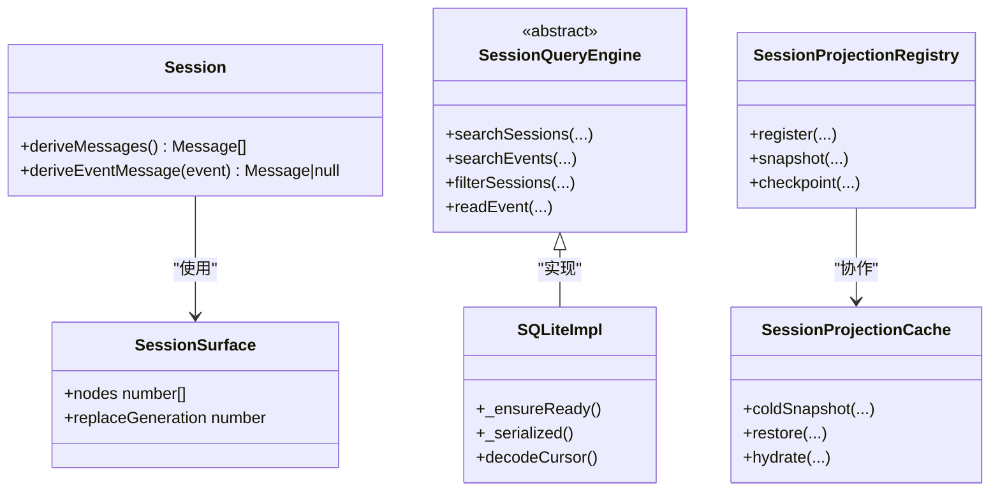

# 会话查询和投影

<cite>
**本文引用的文件**
- [packages/core/session/src/index.ts](file://packages/core/session/src/index.ts)
- [docs/subsystems/session-query.md](file://docs/subsystems/session-query.md)
- [docs/subsystems/session-projection.md](file://docs/subsystems/session-projection.md)
- [packages/session-query/session-query-sqlite/src/index.ts](file://packages/session-query/session-query-sqlite/src/index.ts)
- [packages/session-query/session-query-sqlite/src/query.ts](file://packages/session-query/session-query-sqlite/src/query.ts)
- [packages/session/session-projection/src/index.ts](file://packages/session/session-projection/src/index.ts)
</cite>

## 目录
1. [简介](#简介)
2. [项目结构](#项目结构)
3. [核心组件](#核心组件)
4. [架构总览](#架构总览)
5. [详细组件分析](#详细组件分析)
6. [依赖关系分析](#依赖关系分析)
7. [性能考量](#性能考量)
8. [故障排查指南](#故障排查指南)
9. [结论](#结论)
10. [附录](#附录)

## 简介
本文件面向 DeepSeek Harness 的“会话查询”与“会话投影”两大子系统，系统性说明：
- 会话历史查询的实现原理：分页、全文搜索、时间范围过滤、事件关系追踪、有界读取。
- 消息投影机制：deriveMessages() 的工作流程与缓存策略。
- 会话状态重建：从事件日志推导当前状态的方法与优化。
- 查询性能优化：索引构建、查询计划优化、结果集缓存。
- 实践示例：如何高效实现会话查询与自定义投影逻辑（以代码片段路径引用为主）。

## 项目结构
- 会话查询抽象与类型定义位于 session-query 包；SQLite 全文索引实现位于 session-query-sqlite 包。
- 会话投影注册表与持久化缓存位于 session/session-projection 与 session/session-projection-cache。
- 会话核心（Session、Surface、deriveMessages）位于 core/session。

图表来源
- [packages/core/session/src/index.ts:700-755](file://packages/core/session/src/index.ts#L700-L755)
- [packages/session-query/session-query-sqlite/src/index.ts:357-398](file://packages/session-query/session-query-sqlite/src/index.ts#L357-L398)
- [packages/session-query/session-query-sqlite/src/query.ts:1-64](file://packages/session-query/session-query-sqlite/src/query.ts#L1-L64)
- [packages/session/session-projection/src/index.ts:418-551](file://packages/session/session-projection/src/index.ts#L418-L551)

章节来源
- [docs/subsystems/session-query.md:1-504](file://docs/subsystems/session-query.md#L1-L504)
- [docs/subsystems/session-projection.md:1-329](file://docs/subsystems/session-projection.md#L1-L329)

## 核心组件
- 会话核心 Session 提供 deriveMessages()，基于 Surface 节点序列生成模型可见的消息历史，具备按替换代次失效的增量缓存。
- 会话查询引擎 SessionQueryEngine 提供跨会话/单会话全文检索、精确过滤、事件关系追踪、有界事件读取等能力；SQLite 后端负责全文索引生命周期与游标分页。
- 会话投影 Registry 订阅 session/event，对每个注册的纯函数单元 apply 事件，产出客户端视图；Cache 提供冷读、热恢复、检查点写入与只读快照。

章节来源
- [packages/core/session/src/index.ts:700-755](file://packages/core/session/src/index.ts#L700-L755)
- [docs/subsystems/session-query.md:103-218](file://docs/subsystems/session-query.md#L103-L218)
- [docs/subsystems/session-projection.md:9-103](file://docs/subsystems/session-projection.md#L9-L103)

## 架构总览
下图展示一次“跨会话全文搜索 + 分页”的调用链路与数据流：

图表来源
- [packages/session-query/session-query-sqlite/src/index.ts:357-398](file://packages/session-query/session-query-sqlite/src/index.ts#L357-L398)
- [packages/session-query/session-query-sqlite/src/query.ts:1-64](file://packages/session-query/session-query-sqlite/src/query.ts#L1-L64)
- [docs/subsystems/session-query.md:143-218](file://docs/subsystems/session-query.md#L143-L218)

## 详细组件分析

### 1) 消息投影：deriveMessages() 工作流程与缓存
- 工作流
  - 读取当前 Surface 节点序列与 replaceGeneration。
  - 若代次变化则清空缓存并重建；否则仅追加新节点。
  - 对每个新节点调用 deriveEventMessage() 投影为 Message，空内容 assistant/message 会被跳过。
  - 返回浅拷贝数组，内部 Message 对象共享且深冻结，避免二次克隆与不可变保护。
- 缓存策略
  - 以 surface.replaceGeneration 作为失效键，O(新增节点) 增量更新。
  - 当发生 compaction replace 时，被覆盖节点在推导中被剔除，缓存整体重建。
- 复杂度
  - 单次调用 O(n_new)，n_new 为自上次投影以来的新节点数。

图表来源
- [packages/core/session/src/index.ts:700-755](file://packages/core/session/src/index.ts#L700-L755)

章节来源
- [packages/core/session/src/index.ts:700-755](file://packages/core/session/src/index.ts#L700-L755)
- [docs/subsystems/session.zh.md:332-501](file://docs/subsystems/session.zh.md#L332-L501)

### 2) 会话查询：分页、全文搜索、时间范围过滤
- 分页与游标
  - 使用不透明 SessionSearchCursor，绑定规范化后的查询、元数据过滤器与 limit。
  - SQLite 端通过 base64url 编码的 JSON 游标携带 instance/scope/fingerprint/generation/offset，解码后校验版本与归属，过期会抛出 STALE_CURSOR。
- 全文搜索
  - 跨会话 searchSessions()：按最强匹配事件分组排序。
  - 单会话 searchEvents()：返回目标 header 与命中事件片段 snippet。
  - 文本扫描：provider-independent 的语义文本正则扫描（Unicode 大小写不敏感、空白灵活），与 FTS 提供者解耦。
- 时间范围过滤
  - 支持 seq/time 范围过滤，包含两端；与 type/surface/text 等条件组合为 AND/OR。
- 查询计划与限制
  - 变量绑定上限与 FTS5 外层谓词预算限制，防止过大请求导致计划退化。
  - 语句级串行化与 AbortSignal 支持，保证取消及时生效。

图表来源
- [packages/session-query/session-query-sqlite/src/query.ts:1-64](file://packages/session-query/session-query-sqlite/src/query.ts#L1-L64)
- [packages/session-query/session-query-sqlite/src/index.ts:959-998](file://packages/session-query/session-query-sqlite/src/index.ts#L959-L998)
- [docs/subsystems/session-query.md:103-218](file://docs/subsystems/session-query.md#L103-L218)

章节来源
- [docs/subsystems/session-query.md:103-218](file://docs/subsystems/session-query.md#L103-L218)
- [packages/session-query/session-query-sqlite/src/index.ts:357-398](file://packages/session-query/session-query-sqlite/src/index.ts#L357-L398)
- [packages/session-query/session-query-sqlite/src/index.ts:959-998](file://packages/session-query/session-query-sqlite/src/index.ts#L959-L998)

### 3) 会话状态重建：从事件日志推导当前状态
- 投影单元模型
  - 每个领域贡献一个 ProjectionDefinition：key、stateSchema、init(header)、apply(state, event)、可选 wire(view)。
  - 框架订阅 session/event，对所有已注册单元 eager apply；changed 时推送变更流。
- 冷读与恢复
  - coldSnapshot：从完整事件序列折叠出最终快照。
  - restore：基于检查点行（ver/seq/val）+ 尾部事件重放，计算最终快照并刷新检查点。
  - hydrate/hydratePrepared：将已就绪的状态安装到 prepared Session，后续发布复用这些单元。
- 一致性保障
  - 每次 snapshot 返回 asOfSeq 统一水位；viewCheckpoint 零 I/O 提供“最旧但正确”的值。
  - stateVersion 用于兼容检测，版本不匹配则丢弃旧行并全量重放。

图表来源
- [docs/subsystems/session-projection.md:9-103](file://docs/subsystems/session-projection.md#L9-L103)
- [packages/session/session-projection/src/index.ts:418-551](file://packages/session/session-projection/src/index.ts#L418-L551)

章节来源
- [docs/subsystems/session-projection.md:9-103](file://docs/subsystems/session-projection.md#L9-L103)
- [packages/session/session-projection/src/index.ts:418-551](file://packages/session/session-projection/src/index.ts#L418-L551)

### 4) 事件关系与有界读取
- 事件关系追踪 traceEvent：区分位置替换与被引用来源，返回 replacedBy、replacementChain、replacedEventSeqs、sourceEventSeqs、derivedEventSeqs。
- 有界读取 readEvent：指定 sessionId/seq 及 before/after，返回目标事件与上下文窗口。

章节来源
- [docs/subsystems/session-query.md:259-331](file://docs/subsystems/session-query.md#L259-L331)

## 依赖关系分析
- Session 依赖 Surface 管理消息节点序列与替换代次；deriveMessages() 仅依赖纯函数 deriveEventMessage。
- SessionQueryEngine 抽象由 SQLite 实现承载全文索引与游标分页；query.ts 提供参数化谓词与预算限制。
- SessionProjectionRegistry 依赖领域单元的纯 apply；SessionProjectionCache 负责持久化检查点与冷/热恢复。

图表来源
- [packages/core/session/src/index.ts:700-755](file://packages/core/session/src/index.ts#L700-L755)
- [packages/session-query/session-query-sqlite/src/index.ts:357-398](file://packages/session-query/session-query-sqlite/src/index.ts#L357-L398)
- [packages/session/session-projection/src/index.ts:418-551](file://packages/session/session-projection/src/index.ts#L418-L551)

章节来源
- [packages/core/session/src/index.ts:700-755](file://packages/core/session/src/index.ts#L700-L755)
- [packages/session-query/session-query-sqlite/src/index.ts:357-398](file://packages/session-query/session-query-sqlite/src/index.ts#L357-L398)
- [packages/session/session-projection/src/index.ts:418-551](file://packages/session/session-projection/src/index.ts#L418-L551)

## 性能考量
- 索引与查询计划
  - 使用 FTS5 进行全文检索，结合元数据过滤减少回表成本。
  - 限制外部谓词数量与绑定变量规模，避免查询计划退化。
  - 语句级串行化与 AbortSignal 确保并发安全与快速取消。
- 结果集与状态缓存
  - deriveMessages() 按 replaceGeneration 增量缓存，避免重复投影。
  - 投影检查点缓存（ver/seq/val）支持冷读快速恢复，减少全量重放。
  - viewCheckpoint 提供零 I/O 的只读快照，适合 listing 场景。
- 内存与序列化
  - 投影状态必须可 JSON 序列化；checkpoint 输出为分离的深拷贝，避免污染水位缓存。
  - 消息内容重用已冻结的事件数据，无需二次深拷贝。

章节来源
- [packages/session-query/session-query-sqlite/src/query.ts:1-64](file://packages/session-query/session-query-sqlite/src/query.ts#L1-L64)
- [packages/session/session-projection/src/index.ts:418-551](file://packages/session/session-projection/src/index.ts#L418-L551)
- [packages/core/session/src/index.ts:700-755](file://packages/core/session/src/index.ts#L700-L755)

## 故障排查指南
- 常见错误码
  - SESSION_QUERY_INVALID_CURSOR / SESSION_QUERY_STALE_CURSOR：游标无效或过期，需重新发起查询。
  - SESSION_QUERY_INDEX_FAILED：索引打开失败，检查 SQLite 初始化与权限。
  - SESSION_QUERY_CORRUPT_SESSION / SESSION_QUERY_INVALID_SURFACE：事件日志或表面不一致，需修复或重放。
  - SESSION_QUERY_PERSISTENCE_FAILED：持久化写入失败，检查存储后端。
- 定位建议
  - 检查 normalize 后的查询与过滤器是否超出预算（变量/谓词限制）。
  - 确认 stateVersion 与 schema 一致，避免陈旧检查点导致恢复失败。
  - 关注 AbortSignal 传播，确保取消能中断长耗时操作。

章节来源
- [docs/subsystems/session-query.md:333-357](file://docs/subsystems/session-query.md#L333-L357)
- [packages/session-query/session-query-sqlite/src/index.ts:357-398](file://packages/session-query/session-query-sqlite/src/index.ts#L357-L398)
- [packages/session/session-projection/src/index.ts:418-551](file://packages/session/session-projection/src/index.ts#L418-L551)

## 结论
- 会话查询通过 provider-independent 的过滤器与 SQLite FTS 实现高性能分页与全文检索，并以游标保证稳定分页。
- 消息投影 deriveMessages() 以 Surface 节点序列为基础，采用替换代次驱动的增量缓存，兼顾正确性与性能。
- 会话状态重建借助检查点与尾部重放，实现冷/热路径的高效恢复，并通过 stateVersion 保障向后兼容。
- 通过预算限制、串行化、AbortSignal 与深冻结策略，系统在可扩展性、一致性与安全性之间取得平衡。

## 附录
- 参考实现路径（不含具体代码）
  - deriveMessages() 主循环与缓存失效：[packages/core/session/src/index.ts:700-755](file://packages/core/session/src/index.ts#L700-L755)
  - 游标解码与过期校验：[packages/session-query/session-query-sqlite/src/index.ts:959-998](file://packages/session-query/session-query-sqlite/src/index.ts#L959-L998)
  - 查询预算与参数化谓词：[packages/session-query/session-query-sqlite/src/query.ts:1-64](file://packages/session-query/session-query-sqlite/src/query.ts#L1-L64)
  - 投影注册/快照/恢复：[packages/session/session-projection/src/index.ts:418-551](file://packages/session/session-projection/src/index.ts#L418-L551)
  - 会话查询 API 契约与类型：[docs/subsystems/session-query.md:103-504](file://docs/subsystems/session-query.md#L103-L504)
  - 会话投影契约与 API：[docs/subsystems/session-projection.md:9-329](file://docs/subsystems/session-projection.md#L9-L329)