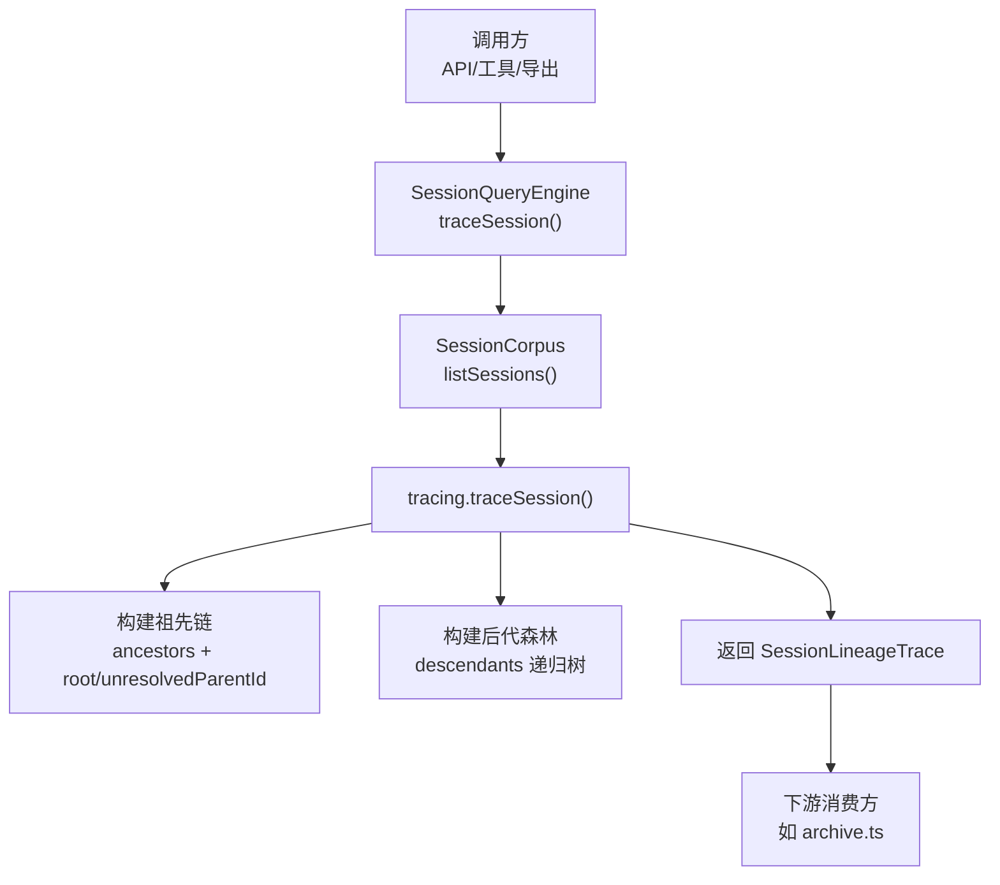
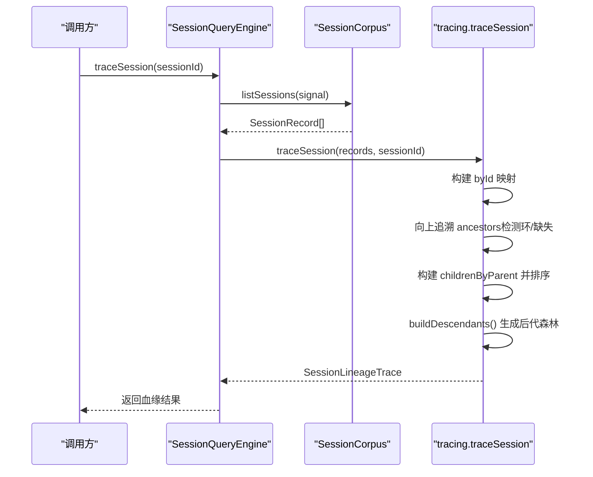
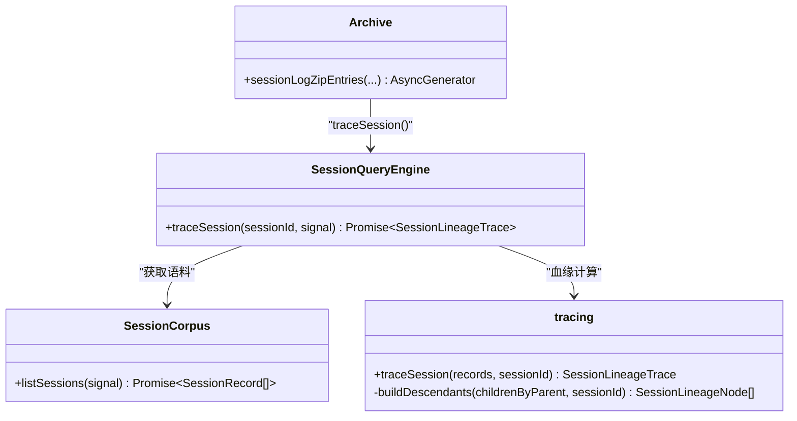

# 会话血缘追踪

<cite>
**本文引用的文件**
- [types.ts](file://packages/session-query/session-query/src/types.ts)
- [tracing.ts](file://packages/session-query/session-query/src/tracing.ts)
- [index.ts](file://packages/session-query/session-query/src/index.ts)
- [archive.ts](file://packages/session-query/session-log-export/src/archive.ts)
- [session-query.md](file://docs/subsystems/session-query.md)
- [2026-07-13-session-query-tracing.zh.md](file://.agents/notes/implemented/feature/2026-07-13-session-query-tracing.zh.md)
</cite>

## 目录
1. [简介](#简介)
2. [项目结构](#项目结构)
3. [核心组件](#核心组件)
4. [架构总览](#架构总览)
5. [详细组件分析](#详细组件分析)
6. [依赖关系分析](#依赖关系分析)
7. [性能考量](#性能考量)
8. [故障排查指南](#故障排查指南)
9. [结论](#结论)
10. [附录：使用示例与最佳实践](#附录使用示例与最佳实践)

## 简介
本文件聚焦 DeepSeek Harness 的“会话血缘追踪”能力，系统性解释 SessionLineageTrace、SessionLineageNode 的结构与语义，阐述父子关系的识别与验证流程，说明 complete 标志位如何区分完整血缘链与缺失父会话的情形，并提供向上追溯祖先、向下探索后代的查询与分析方法。同时总结大图遍历的性能优化策略与最佳实践。

## 项目结构
会话血缘追踪的核心实现位于 session-query 包中，对外通过统一的查询服务暴露 traceSession 接口；下游消费方（如日志导出）基于返回的血缘树进行子会话遍历与资源收集。

图表来源
- [index.ts:300-304](file://packages/session-query/session-query/src/index.ts#L300-L304)
- [tracing.ts:113-173](file://packages/session-query/session-query/src/tracing.ts#L113-L173)
- [archive.ts:219-266](file://packages/session-query/session-log-export/src/archive.ts#L219-L266)

章节来源
- [index.ts:87-113](file://packages/session-query/session-query/src/index.ts#L87-L113)
- [tracing.ts:113-173](file://packages/session-query/session-query/src/tracing.ts#L113-L173)
- [archive.ts:219-266](file://packages/session-query/session-log-export/src/archive.ts#L219-L266)

## 核心组件
- SessionRecord：会话轻量记录，包含 header、live/persisted 标识。
- SessionLineageNode：递归节点，包含 session 与 descendants 子树。
- SessionLineageTrace：目标会话的血缘快照，包含 target、ancestors、descendants，并通过判别式字段表达是否完整。

关键要点
- ancestors：从直接父会话向外延伸的已知父链（按“最近→最远”顺序）。
- descendants：以目标会话的直接子会话为根的完整后代森林（兄弟排序稳定）。
- complete 判别式：
  - complete: true 时携带 root（完整血缘链的根会话）。
  - complete: false 时携带 unresolvedParentId（第一个不在逻辑语料中的父会话 ID）。

章节来源
- [types.ts:24-31](file://packages/session-query/session-query/src/types.ts#L24-L31)
- [types.ts:66-94](file://packages/session-query/session-query/src/types.ts#L66-L94)
- [session-query.md:220-257](file://docs/subsystems/session-query.md#L220-L257)

## 架构总览
会话血缘追踪是一次性视图：不维护反向索引或持久状态，每次调用基于一次完整的逻辑语料列表进行计算。

图表来源
- [index.ts:300-304](file://packages/session-query/session-query/src/index.ts#L300-L304)
- [tracing.ts:113-173](file://packages/session-query/session-query/src/tracing.ts#L113-L173)

## 详细组件分析

### SessionLineageTrace 结构与作用
- target：被追踪的目标会话记录（已克隆，避免外部修改影响内部状态）。
- ancestors：从直接父会话到根（或断点）的已知父链，顺序为“最近→最远”。
- descendants：以目标会话的直接子会话为根的递归后代森林。兄弟排序规则：先按创建时间升序，再按会话 ID 字典序，保证确定性输出。
- complete 判别式：
  - complete: true：存在完整父链，附带 root（完整血缘链的根会话）。
  - complete: false：父链在可见语料中断开，附带 unresolvedParentId（首个不可解析的父会话 ID）。

用途
- 向上追溯：通过 ancestors 快速定位父级上下文，必要时结合 root 获取整条链起点。
- 向下探索：通过 descendants 递归遍历子会话树，用于导出、统计、审计等场景。

章节来源
- [types.ts:66-94](file://packages/session-query/session-query/src/types.ts#L66-L94)
- [session-query.md:220-257](file://docs/subsystems/session-query.md#L220-L257)

### SessionLineageNode 递归结构与子树构建
- 每个节点包含 session（当前会话记录）和 descendants（直接子节点的数组）。
- 子树构建算法：
  - 将全部会话按 parentSession 分组，得到 childrenByParent。
  - 对每个父会话的子列表按创建时间与 ID 排序，确保稳定顺序。
  - 使用栈式 DFS 从目标会话开始，逐层展开其直接子节点及其后代，形成递归树。

复杂度
- 时间：O(N) 构建 byId 与 childrenByParent；排序代价取决于分支宽度与深度，整体近似 O(N log N) 最坏情况（当大量会话共享同一父会话时）。
- 空间：O(N) 存储映射与结果树。

章节来源
- [tracing.ts:147-159](file://packages/session-query/session-query/src/tracing.ts#L147-L159)
- [tracing.ts:220-244](file://packages/session-query/session-query/src/tracing.ts#L220-L244)

### 血缘关系建立过程：父子识别与验证
- 父子识别：依据会话头部的 parentSession 字段建立父子关系。
- 循环检测：向上追溯祖先时使用 visited set，若发现重复访问则抛出无效血缘错误。
- 缺失父会话：若遇到不在语料中的父会话，停止向上追溯并标记 incomplete，返回 unresolvedParentId。
- 目标不存在：若目标会话不在语料中，抛出未找到错误。

章节来源
- [tracing.ts:126-145](file://packages/session-query/session-query/src/tracing.ts#L126-L145)
- [tracing.ts:117-124](file://packages/session-query/session-query/src/tracing.ts#L117-L124)

### complete 标志位的语义与使用
- complete: true：
  - 表示从目标会话出发，所有父会话均可在逻辑语料中找到，root 指向完整血缘链的根。
  - 适用于需要完整上下文的场景（例如回溯根因、展示全链路）。
- complete: false：
  - 表示父链在可见语料中断开，unresolvedParentId 指出第一个无法解析的父会话 ID。
  - 适用于部分可见场景（例如跨进程/跨实例的父子关系），可提示上层做降级处理。

章节来源
- [types.ts:74-94](file://packages/session-query/session-query/src/types.ts#L74-L94)
- [tracing.ts:165-172](file://packages/session-query/session-query/src/tracing.ts#L165-L172)

### 向上追溯祖先与向下探索后代：查询与分析
- 向上追溯：
  - 读取 ancestors 数组，按“最近→最远”顺序获得父链。
  - 若 complete: true，可通过 root 获取整条链的起点。
- 向下探索：
  - 读取 descendants 数组，递归遍历 node.descendants 以获取子树。
  - 典型用法：导出子会话日志、聚合子任务指标、审计子代理行为。

章节来源
- [tracing.ts:126-145](file://packages/session-query/session-query/src/tracing.ts#L126-L145)
- [tracing.ts:220-244](file://packages/session-query/session-query/src/tracing.ts#L220-L244)
- [archive.ts:232-259](file://packages/session-query/session-log-export/src/archive.ts#L232-L259)

## 依赖关系分析
- SessionQueryEngine.traceSession：入口封装，负责获取语料并委托 tracing 模块。
- tracing.traceSession：血缘计算核心，完成祖先链与后代森林构建。
- SessionCorpus.listSessions：提供一次性完整会话列表，保证一致性观察。
- 下游消费方（如 archive.ts）：基于血缘树进行流式导出，边遍历边读取持久化数据。

图表来源
- [index.ts:300-304](file://packages/session-query/session-query/src/index.ts#L300-L304)
- [tracing.ts:113-173](file://packages/session-query/session-query/src/tracing.ts#L113-L173)
- [archive.ts:219-266](file://packages/session-query/session-log-export/src/archive.ts#L219-L266)

章节来源
- [index.ts:87-113](file://packages/session-query/session-query/src/index.ts#L87-L113)
- [tracing.ts:113-173](file://packages/session-query/session-query/src/tracing.ts#L113-L173)
- [archive.ts:219-266](file://packages/session-query/session-log-export/src/archive.ts#L219-L266)

## 性能考量
- 单次语料观察：traceSession 仅调用一次 listSessions，避免多次 IO 带来的不一致与开销。
- 线性构建：byId 与 childrenByParent 均为 O(N) 构建，适合大规模会话集合。
- 排序成本：兄弟排序在最坏情况下可能带来额外开销，但通常可控；建议限制单父会话下的子会话数量或在上层分页/裁剪。
- 栈安全：后代构建使用显式栈而非递归，避免深树导致的调用栈溢出（测试覆盖至数千层深度）。
- 内存占用：结果包含克隆的记录与树结构，建议在消费端按需遍历与丢弃中间结果，避免长期持有大对象。
- 取消支持：traceSession 接受 AbortSignal，可在大数据量场景下及时中止。

章节来源
- [tracing.ts:113-173](file://packages/session-query/session-query/src/tracing.ts#L113-L173)
- [tracing.ts:220-244](file://packages/session-query/session-query/src/tracing.ts#L220-L244)
- [index.ts:300-304](file://packages/session-query/session-query/src/index.ts#L300-L304)

## 故障排查指南
常见错误与处理建议
- 会话未找到：目标会话不在当前语料中，检查会话是否存在或是否已被清理。
- 无效血缘（环路）：检测到祖先链中出现环，需检查会话头部是否正确设置 parentSession。
- 持久化失败：底层持久化不可用导致语料列举失败，检查后端健康与权限。
- 事件表面无效：事件日志不符合表面折叠契约，需修复事件写入逻辑。

章节来源
- [tracing.ts:117-124](file://packages/session-query/session-query/src/tracing.ts#L117-L124)
- [tracing.ts:126-145](file://packages/session-query/session-query/src/tracing.ts#L126-L145)
- [tracing.ts:175-214](file://packages/session-query/session-query/src/tracing.ts#L175-L214)

## 结论
会话血缘追踪通过一次性的逻辑语料观察，提供确定性的祖先链与后代森林，既能满足向上溯源，也能支撑向下扩展的消费场景。complete 判别式清晰表达血缘完整性，配合取消信号与栈安全的遍历实现，使该能力在大图场景下具备良好性能与稳定性。

## 附录：使用示例与最佳实践

### 向上追溯祖先（示例路径）
- 调用 traceSession 获取 SessionLineageTrace。
- 读取 ancestors 数组，按顺序获得父链。
- 若 complete: true，可使用 root 作为整条链的起点。

参考实现位置
- [index.ts:300-304](file://packages/session-query/session-query/src/index.ts#L300-L304)
- [tracing.ts:126-145](file://packages/session-query/session-query/src/tracing.ts#L126-L145)

### 向下探索后代（示例路径）
- 读取 descendants 数组，递归遍历 node.descendants。
- 典型应用：导出子会话日志、聚合子任务指标。

参考实现位置
- [tracing.ts:220-244](file://packages/session-query/session-query/src/tracing.ts#L220-L244)
- [archive.ts:232-259](file://packages/session-query/session-log-export/src/archive.ts#L232-L259)

### 大图遍历最佳实践
- 使用迭代式遍历（栈）避免递归过深。
- 按需消费：边遍历边处理，避免一次性加载整个树。
- 控制扇出：对高扇出节点进行分页或采样。
- 利用取消信号：在长时间运行或大数据量场景中及时中止。
- 关注排序稳定性：兄弟顺序由创建时间与 ID 决定，便于调试与复现。

章节来源
- [tracing.ts:220-244](file://packages/session-query/session-query/src/tracing.ts#L220-L244)
- [archive.ts:219-266](file://packages/session-query/session-log-export/src/archive.ts#L219-L266)