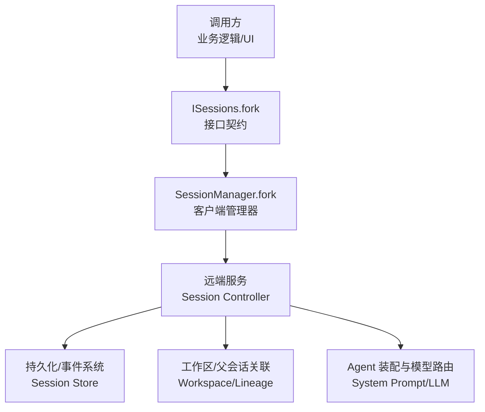
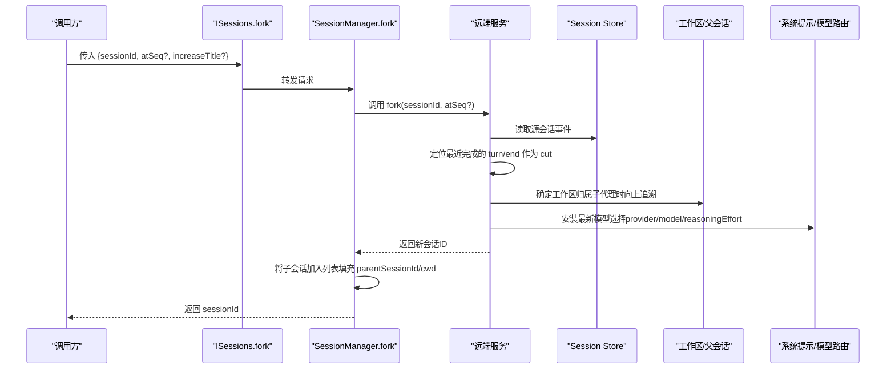
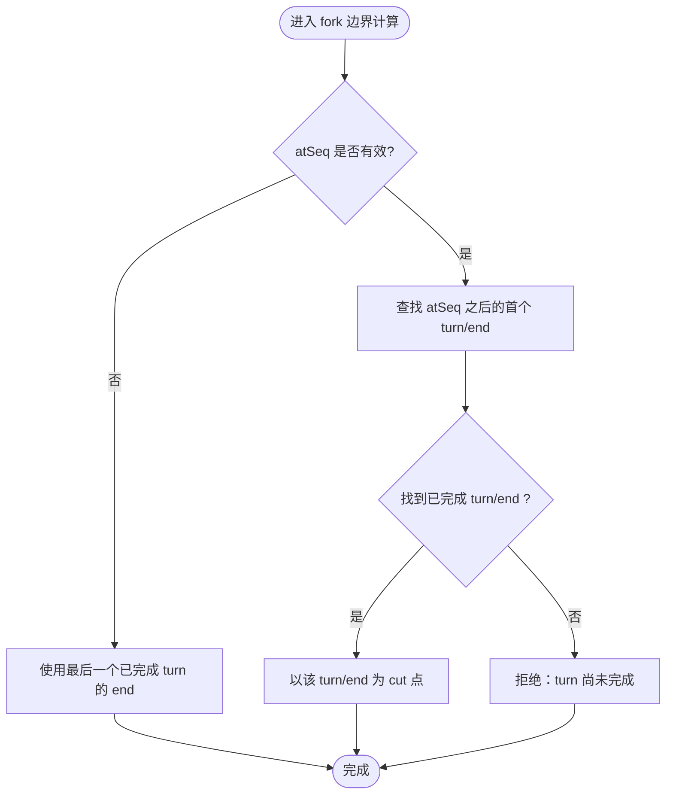
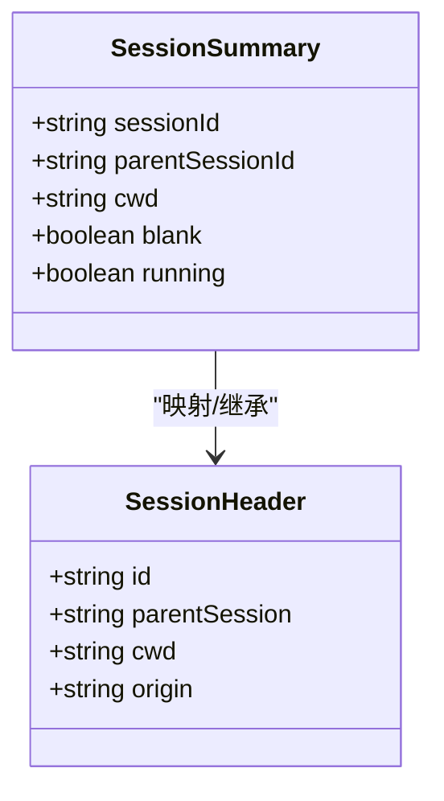
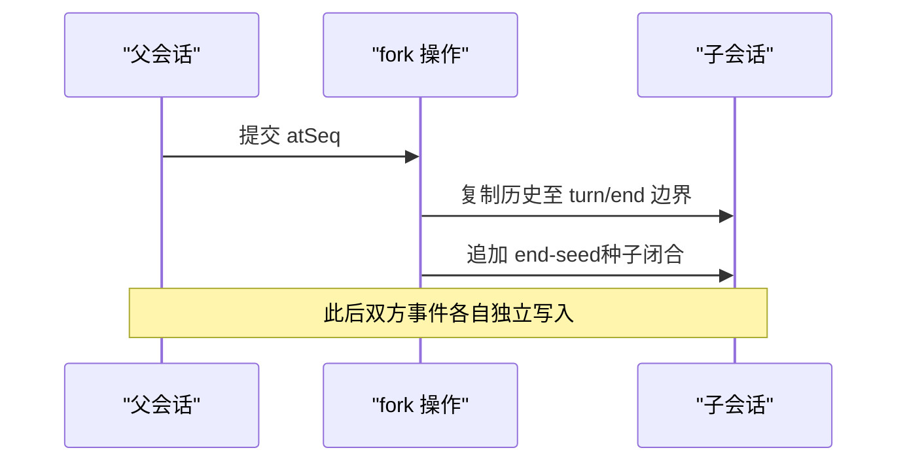
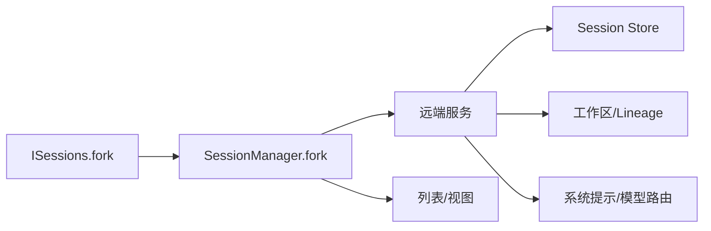

# 会话分支机制

<cite>
**本文引用的文件**
- [packages/api/session-controller/src/client/sessions/manager.ts](file://packages/api/session-controller/src/client/sessions/manager.ts)
- [packages/api/session-controller/src/client/contract/sessions.ts](file://packages/api/session-controller/src/client/contract/sessions.ts)
- [packages/api/session-controller/tests/session-fork.host.spec.ts](file://packages/api/session-controller/tests/session-fork.host.spec.ts)
- [packages/extensions/tool-cordis/src/api-catalog.ts](file://packages/extensions/tool-cordis/src/api-catalog.ts)
</cite>

## 目录
1. [简介](#简介)
2. [项目结构](#项目结构)
3. [核心组件](#核心组件)
4. [架构总览](#架构总览)
5. [详细组件分析](#详细组件分析)
6. [依赖关系分析](#依赖关系分析)
7. [性能考量](#性能考量)
8. [故障排查指南](#故障排查指南)
9. [结论](#结论)
10. [附录：使用示例与最佳实践](#附录使用示例与最佳实践)

## 简介
本文件系统性阐述 DeepSeek Harness 的“会话分支（fork）”机制，聚焦以下要点：
- fork() 的实现原理与控制流
- 边界选择策略（boundary），尤其是必须在 turn 边界处进行分支的限制与原因
- 父子关系的建立过程与元数据继承（cwd、parentSession、seedLength 等）
- 分支后的事件隔离机制，确保父子会话的事件日志独立性与一致性
- 具体使用方式：从指定序列号 atSeq 分支、处理分支冲突与不可用场景

## 项目结构
围绕会话分支的关键代码位于 session-controller 客户端层与测试用例中：
- 客户端接口定义：ISessions.fork 暴露给上层功能包调用
- 客户端管理器：SessionManager.fork 负责将请求转发到远端并维护列表状态
- 测试用例：session-fork.host.spec.ts 覆盖边界选择、子代理归属、模型路由继承等行为

图表来源
- [packages/api/session-controller/src/client/contract/sessions.ts:87-97](file://packages/api/session-controller/src/client/contract/sessions.ts#L87-L97)
- [packages/api/session-controller/src/client/sessions/manager.ts:593-625](file://packages/api/session-controller/src/client/sessions/manager.ts#L593-L625)

章节来源
- [packages/api/session-controller/src/client/contract/sessions.ts:87-97](file://packages/api/session-controller/src/client/contract/sessions.ts#L87-L97)
- [packages/api/session-controller/src/client/sessions/manager.ts:593-625](file://packages/api/session-controller/src/client/sessions/manager.ts#L593-L625)

## 核心组件
- ISessions.fork：对外暴露的会话分支能力，支持按 atSeq 锚定 cut 点，并可控制是否递增继承标题。
- SessionManager.fork：实现客户端侧的分支流程，包括参数透传、结果合并入列表、以及子会话元数据（如 cwd、parentSessionId）回填。
- 测试用例：验证分支边界、子代理归属、模型路由继承、异常路径等。

章节来源
- [packages/api/session-controller/src/client/contract/sessions.ts:87-97](file://packages/api/session-controller/src/client/contract/sessions.ts#L87-L97)
- [packages/api/session-controller/src/client/sessions/manager.ts:593-625](file://packages/api/session-controller/src/client/sessions/manager.ts#L593-L625)
- [packages/api/session-controller/tests/session-fork.host.spec.ts:87-288](file://packages/api/session-controller/tests/session-fork.host.spec.ts#L87-L288)

## 架构总览
下图展示一次 fork 调用的端到端时序，涵盖客户端到远端的交互、边界计算、元数据继承与列表更新。

图表来源
- [packages/api/session-controller/src/client/contract/sessions.ts:87-97](file://packages/api/session-controller/src/client/contract/sessions.ts#L87-L97)
- [packages/api/session-controller/src/client/sessions/manager.ts:593-625](file://packages/api/session-controller/src/client/sessions/manager.ts#L593-L625)
- [packages/api/session-controller/tests/session-fork.host.spec.ts:87-288](file://packages/api/session-controller/tests/session-fork.host.spec.ts#L87-L288)

## 详细组件分析

### 边界选择（boundary）策略与 turn 边界限制
- 规则摘要
  - 分支必须在“已完成的 turn”边界进行；cut 点为 atSeq 之后第一个 turn/end 事件。
  - 若 atSeq 未提供或超出尾部，则回退到“最后一个已完成 turn”的结束位置。
  - 若 atSeq 指向当前仍在进行的 turn（未完成），则拒绝分支，返回“不可用”错误。
- 原因说明
  - 保证每个分支都是完整对话轮次的快照，避免在 turn 中间截断导致语义不完整。
  - 便于后续事件回放、压缩与查询的一致性。
- 行为验证
  - 省略 atSeq 或 past-end 时，取最后一个已完成 turn 的结尾。
  - 对 open turn 的 in-log 锚点直接拒绝。
  - 对 aborted turn 可“穿过”其终止点，将其视为已关闭。

图表来源
- [packages/api/session-controller/tests/session-fork.host.spec.ts:189-253](file://packages/api/session-controller/tests/session-fork.host.spec.ts#L189-L253)

章节来源
- [packages/api/session-controller/tests/session-fork.host.spec.ts:189-253](file://packages/api/session-controller/tests/session-fork.host.spec.ts#L189-L253)

### 父子关系建立与元数据继承
- 父子关系
  - 子会话 header.parentSession 指向源会话 ID，形成清晰的 lineage。
  - 对于 subagent 派生的源，子会话会附着到最近的“拥有工作区的祖先”，以确保工作区上下文正确。
- 元数据继承
  - cwd：子会话继承源会话的工作目录，保证文件系统上下文一致。
  - parentSession：记录父会话 ID，用于列表嵌套与回溯。
  - seedLength：通过“end-seed”事件体现历史种子长度，使子会话具备一致的初始上下文。
  - 模型路由：子会话安装源会话记录的“最新模型选择”（provider/model/reasoningEffort），确保推理行为一致。
- 列表状态同步
  - 客户端在收到 fork 成功后立即将子会话插入列表，并回填 parentSessionId 与 cwd，以便 UI 可立即导航。

图表来源
- [packages/api/session-controller/src/client/sessions/manager.ts:614-620](file://packages/api/session-controller/src/client/sessions/manager.ts#L614-L620)
- [packages/api/session-controller/tests/session-fork.host.spec.ts:87-144](file://packages/api/session-controller/tests/session-fork.host.spec.ts#L87-L144)

章节来源
- [packages/api/session-controller/src/client/sessions/manager.ts:614-620](file://packages/api/session-controller/src/client/sessions/manager.ts#L614-L620)
- [packages/api/session-controller/tests/session-fork.host.spec.ts:87-144](file://packages/api/session-controller/tests/session-fork.host.spec.ts#L87-L144)

### 事件隔离机制
- 独立性
  - 子会话仅包含截至 cut 点的历史事件，并在其后追加“end-seed”事件，表示历史种子闭合。
  - 子会话后续产生的事件不会回流到父会话，保证父子事件日志完全隔离。
- 一致性
  - 由于 cut 点位于 turn 边界，子会话的历史片段是完整且自洽的，便于回放与压缩。
  - 子会话的模型选择与系统提示在创建时即安装完毕，避免运行时漂移。

图表来源
- [packages/api/session-controller/tests/session-fork.host.spec.ts:87-101](file://packages/api/session-controller/tests/session-fork.host.spec.ts#L87-L101)

章节来源
- [packages/api/session-controller/tests/session-fork.host.spec.ts:87-101](file://packages/api/session-controller/tests/session-fork.host.spec.ts#L87-L101)

### API 与错误码
- 接口
  - ISessions.fork(opts): 接受 sessionId、可选 atSeq、可选 increaseTitle。
- 错误码
  - bad-request：非法 atSeq（如负数或非整数）。
  - fork-unavailable：目标 turn 尚未完成，无法在该点分支。
  - workspace-attach-failed：工作区附加失败（当子会话需绑定到某工作区时）。
  - 其他常见错误（如 session-not-found、model-unavailable 等）由统一错误字典管理。

章节来源
- [packages/api/session-controller/src/client/contract/sessions.ts:87-97](file://packages/api/session-controller/src/client/contract/sessions.ts#L87-L97)
- [packages/extensions/tool-cordis/src/api-catalog.ts:4795-5311](file://packages/extensions/tool-cordis/src/api-catalog.ts#L4795-L5311)

## 依赖关系分析
- 客户端层
  - ISessions 定义对外契约，SessionManager 实现具体流程。
- 服务端/存储层
  - 远端服务负责读取源会话事件、计算 cut 点、组装子会话头信息、安装模型路由。
- 工作区与 lineage
  - 子代理场景下，子会话会被附着到最近的拥有工作区的祖先，确保上下文正确。
- 列表与 UI
  - 客户端在 fork 成功后立即更新本地列表，回填 parentSessionId 与 cwd，提升响应性。

图表来源
- [packages/api/session-controller/src/client/contract/sessions.ts:87-97](file://packages/api/session-controller/src/client/contract/sessions.ts#L87-L97)
- [packages/api/session-controller/src/client/sessions/manager.ts:593-625](file://packages/api/session-controller/src/client/sessions/manager.ts#L593-L625)

章节来源
- [packages/api/session-controller/src/client/contract/sessions.ts:87-97](file://packages/api/session-controller/src/client/contract/sessions.ts#L87-L97)
- [packages/api/session-controller/src/client/sessions/manager.ts:593-625](file://packages/api/session-controller/src/client/sessions/manager.ts#L593-L625)

## 性能考量
- 边界计算复杂度
  - 线性扫描事件日志寻找 atSeq 之后的首个 turn/end，时间复杂度 O(n)。
  - 建议对高频分支场景考虑索引或缓存最近完成 turn 的位置。
- 列表更新与渲染
  - 客户端在 fork 成功后立即插入子会话，减少等待时间；但需注意列表重建开销。
- 事件回放与压缩
  - 基于 turn 边界的 cut 有利于后续压缩与回放，降低不一致风险。

[本节为通用指导，不直接分析具体文件]

## 故障排查指南
- 常见问题
  - “turn 尚未完成”：atSeq 指向当前进行中的 turn，需等待 turn 完成后再分支。
  - “非法 atSeq”：检查 atSeq 是否为非负整数。
  - “工作区附加失败”：确认目标工作区存在且可访问。
- 定位方法
  - 查看 ISessions.fork 的错误码与 details。
  - 检查源会话事件序列，确认是否存在有效的 turn/end。
  - 核对子会话 header 的 parentSession、cwd 是否正确继承。

章节来源
- [packages/api/session-controller/tests/session-fork.host.spec.ts:213-253](file://packages/api/session-controller/tests/session-fork.host.spec.ts#L213-L253)
- [packages/extensions/tool-cordis/src/api-catalog.ts:4795-5311](file://packages/extensions/tool-cordis/src/api-catalog.ts#L4795-L5311)

## 结论
DeepSeek Harness 的会话分支机制以“turn 边界”为核心约束，确保分支历史片段的完整性与一致性。通过明确的边界选择策略、严格的父子关系建立与元数据继承、以及事件隔离机制，系统在复杂多轮对话与子代理场景中提供了稳定可靠的分支能力。客户端层的即时列表更新进一步提升了用户体验。

[本节为总结，不直接分析具体文件]

## 附录：使用示例与最佳实践
- 基本用法
  - 从指定序列号 atSeq 分支：调用 ISessions.fork({ sessionId, atSeq })，确保 atSeq 指向已完成 turn 的某个事件。
  - 省略 atSeq：自动回退到最后一个已完成 turn 的结尾。
- 处理分支冲突与不可用
  - 遇到 fork-unavailable：等待 turn 完成或调整 atSeq。
  - 遇到 bad-request：校验 atSeq 合法性。
  - 遇到 workspace-attach-failed：检查工作区可用性与权限。
- 最佳实践
  - 始终在 turn 边界进行分支，避免在 turn 中间截断。
  - 对频繁分支的场景，缓存最近完成 turn 的位置以减少扫描成本。
  - 在 UI 中及时显示分支结果，并提供“重试/调整 atSeq”的操作入口。

章节来源
- [packages/api/session-controller/src/client/contract/sessions.ts:87-97](file://packages/api/session-controller/src/client/contract/sessions.ts#L87-L97)
- [packages/api/session-controller/tests/session-fork.host.spec.ts:87-288](file://packages/api/session-controller/tests/session-fork.host.spec.ts#L87-L288)