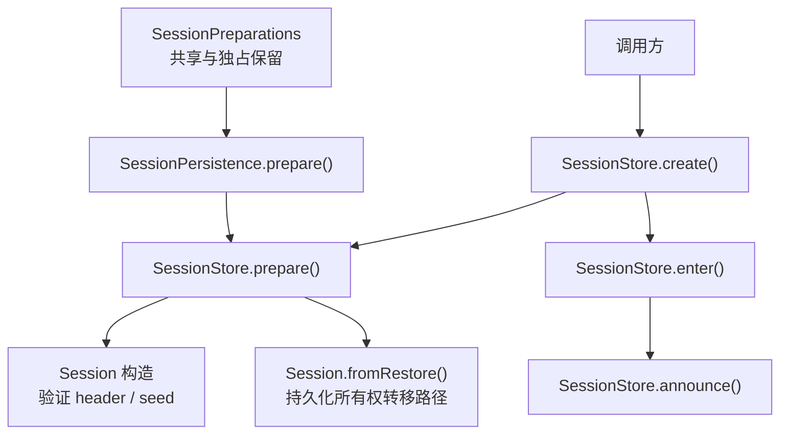
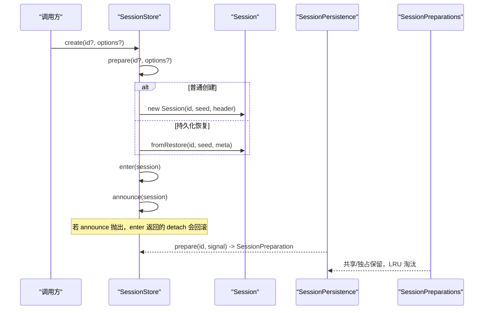
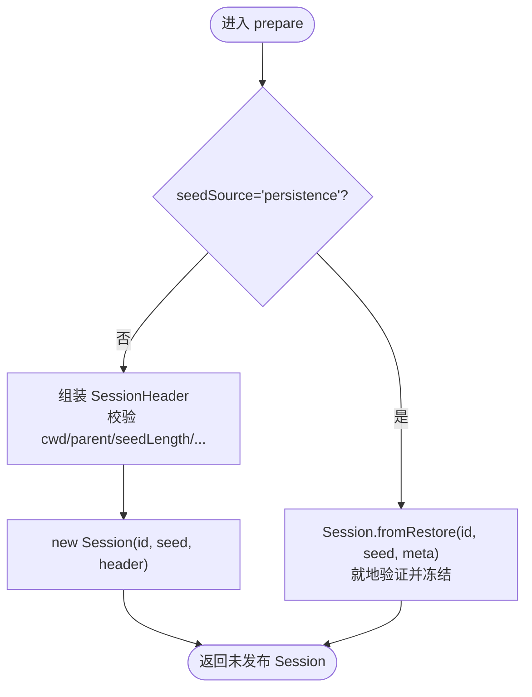
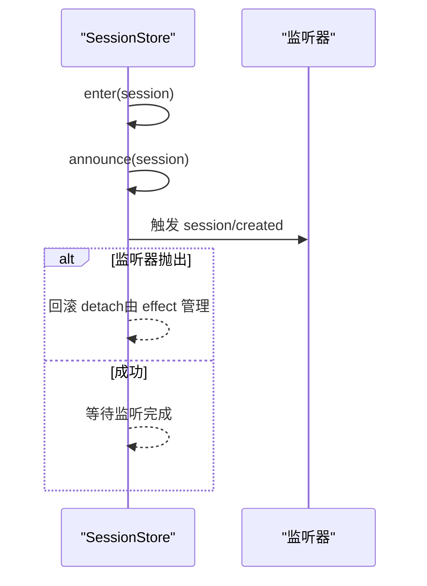
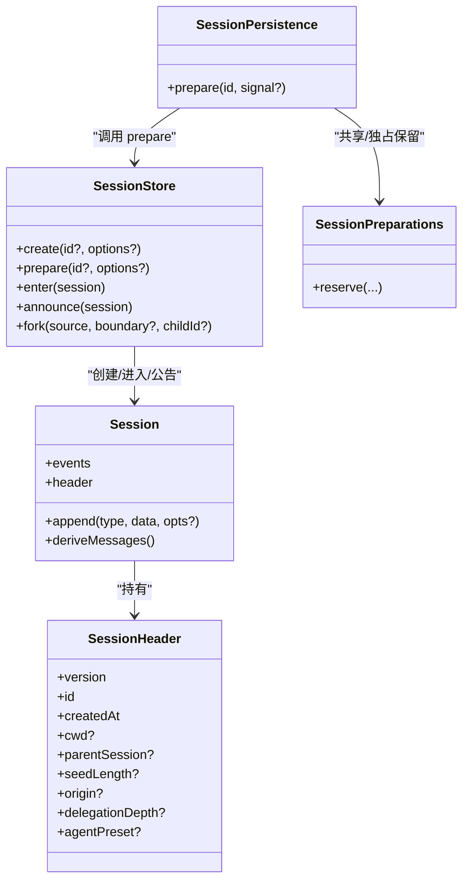

# 会话创建与初始化

<cite>
**本文引用的文件**
- [packages/core/session/src/index.ts](file://packages/core/session/src/index.ts)
- [packages/core/session/src/types.ts](file://packages/core/session/src/types.ts)
- [packages/session/session-persistence/src/index.ts](file://packages/session/session-persistence/src/index.ts)
- [packages/session/session-persistence/src/preparations.ts](file://packages/session/session-persistence/src/preparations.ts)
- [packages/core/session/tests/session.spec.ts](file://packages/core/session/tests/session.spec.ts)
- [packages/session/session-persistence/tests/persistence.spec.ts](file://packages/session/session-persistence/tests/persistence.spec.ts)
- [docs/subsystems/persistence.zh.md](file://docs/subsystems/persistence.zh.md)
</cite>

## 目录
1. [简介](#简介)
2. [项目结构](#项目结构)
3. [核心组件](#核心组件)
4. [架构总览](#架构总览)
5. [详细组件分析](#详细组件分析)
6. [依赖关系分析](#依赖关系分析)
7. [性能考量](#性能考量)
8. [故障排查指南](#故障排查指南)
9. [结论](#结论)
10. [附录](#附录)

## 简介
本文聚焦 DeepSeek Harness 的“会话创建与初始化”过程，围绕 SessionStore 的 create() 与 prepare() 方法展开，解释它们在会话 ID 生成、元数据验证、工作目录处理、种子事件（seed events）重放/分支/恢复等场景下的差异与协作。同时说明会话头（SessionHeader）的构建流程，包括版本、创建时间、父会话关系等字段的设置；并提供错误处理策略与示例路径，帮助读者正确创建会话并处理重复 ID、无效路径等异常。

## 项目结构
本主题涉及的核心代码位于 session 核心包与会话持久化层：
- 会话核心：SessionStore、Session、类型定义与校验逻辑
- 会话持久化：prepare 的恢复路径、准备对象的生命周期管理
- 测试与文档：覆盖生命周期、并发安全、恢复与重放行为

图表来源
- [packages/core/session/src/index.ts:828-887](file://packages/core/session/src/index.ts#L828-L887)
- [packages/session/session-persistence/src/index.ts:176-199](file://packages/session/session-persistence/src/index.ts#L176-L199)
- [packages/session/session-persistence/src/preparations.ts:1-42](file://packages/session/session-persistence/src/preparations.ts#L1-L42)

章节来源
- [packages/core/session/src/index.ts:828-887](file://packages/core/session/src/index.ts#L828-L887)
- [packages/session/session-persistence/src/index.ts:176-199](file://packages/session/session-persistence/src/index.ts#L176-L199)
- [packages/session/session-persistence/src/preparations.ts:1-42](file://packages/session/session-persistence/src/preparations.ts#L1-L42)

## 核心组件
- SessionStore：内存中的会话存储与服务入口，提供 create()/prepare()/enter()/announce()/fork() 等方法，负责会话生命周期与发布钩子。
- Session：不可变事件日志与会话头封装，负责种子事件校验、表面（surface）一致性、消息推导等。
- SessionHeader：不可变的存储元数据，包含版本、ID、创建时间、cwd、parentSession、seedLength、origin、delegationDepth、agentPreset 等。
- SessionPersistence.prepare()：从持久化后端加载元数据与事件，通过 SessionStore.prepare() 以“所有权转移”模式构建未发布的 Session。
- SessionPreparations：对未发布会话的准备进行共享与独占保留，避免重复加载与竞争。

章节来源
- [packages/core/session/src/index.ts:423-756](file://packages/core/session/src/index.ts#L423-L756)
- [packages/core/session/src/index.ts:790-1157](file://packages/core/session/src/index.ts#L790-L1157)
- [packages/core/session/src/types.ts:61-140](file://packages/core/session/src/types.ts#L61-L140)
- [packages/session/session-persistence/src/index.ts:176-199](file://packages/session/session-persistence/src/index.ts#L176-L199)
- [packages/session/session-persistence/src/preparations.ts:1-42](file://packages/session/session-persistence/src/preparations.ts#L1-L42)

## 架构总览
下图展示会话创建的关键调用链与职责边界：create() 是便捷入口，内部组合 prepare()+enter()+announce()；prepare() 仅做校验与构建，不进入存储；fromRestore() 用于持久化恢复场景，直接接管所有权。

图表来源
- [packages/core/session/src/index.ts:828-887](file://packages/core/session/src/index.ts#L828-L887)
- [packages/core/session/src/index.ts:911-994](file://packages/core/session/src/index.ts#L911-L994)
- [packages/session/session-persistence/src/index.ts:176-199](file://packages/session/session-persistence/src/index.ts#L176-L199)
- [packages/session/session-persistence/src/preparations.ts:1-42](file://packages/session/session-persistence/src/preparations.ts#L1-L42)

## 详细组件分析

### SessionStore.create() vs SessionStore.prepare()
- create(id?, options?)
  - 用途：便捷创建并立即进入存储，随后发布 session/created。
  - 行为：内部调用 prepare()，再在 effect 中顺序执行 enter() 与 announce()；若 announce 抛出，effect 会回滚已 yield 的 detach，避免泄漏。
  - 适用场景：大多数业务侧快速创建会话。
- prepare(id?, options?)
  - 用途：仅校验与构建未发布的 Session，不进入 store。
  - 行为：
    - 生成或接受会话 ID；若未指定则自增 counter 生成 session-<n>，确保唯一。
    - 检查是否已存在同 ID 会话，存在则抛错。
    - 当 options.seedSource === 'persistence' 时，走 fromRestore() 路径，要求传入 fresh detached 的事件与元数据，并在内部就地验证并冻结。
    - 否则组装 SessionHeader（version、id、createdAt、cwd、parentSession、seedLength、origin、delegationDepth、agentPreset），并构造 Session。
  - 适用场景：需要精细控制生命周期（如与 agent 工厂 effect 合并）、恢复/重放/分支前准备、或与其他步骤组合的事务式创建。

章节来源
- [packages/core/session/src/index.ts:828-887](file://packages/core/session/src/index.ts#L828-L887)
- [packages/core/session/src/index.ts:841-887](file://packages/core/session/src/index.ts#L841-L887)

### 会话头（SessionHeader）构建与验证
- 构建
  - version：固定为 SESSION_FORMAT_VERSION。
  - id：来自传入或 prepare 生成的会话 ID。
  - createdAt：默认 Date.now()，可被 meta.createdAt 覆盖。
  - cwd：可选，必须为绝对路径。
  - parentSession：可选，字符串。
  - seedLength：可选，非负安全整数，表示继承的前缀长度。
  - origin：可选，仅允许 'subagent'。
  - delegationDepth：可选，非负安全整数。
  - agentPreset：可选，字符串。
- 验证
  - 严格类型与取值范围校验；非 JSON 可序列化对象会被拒绝。
  - 恢复路径（fromRestore）额外要求 plain object（原型为 Object.prototype 或 null）。
- 冻结
  - 使用 deepFreeze 保证不可变，防止后续篡改。

章节来源
- [packages/core/session/src/index.ts:95-157](file://packages/core/session/src/index.ts#L95-L157)
- [packages/core/session/src/types.ts:61-99](file://packages/core/session/src/types.ts#L61-L99)

### 种子事件（seed events）处理机制
- 重放（replay）
  - 通过 create(id, { seed }) 将已有事件序列作为初始历史导入。
  - 构造时会逐一校验事件信封、seq 连续性（从 0 开始）、表面（surface）约束，并追加 session/end-seed 标记（除非末尾已是该标记）。
  - firstLiveSeq 记录本次进程首次写入的位置，便于区分种子与后续真实写入。
- 分支（fork）
  - fork(source, boundary?, childId?) 基于源会话的稳定前缀创建子会话。
  - 自动设置 parentSession、cwd 继承、seedLength=切片长度，确保可追溯的父子关系。
  - 边界校验：必须是有效 seq、不能落在 open turn 中间。
- 恢复（resume/resurrection）
  - 通过 SessionPersistence.prepare() 加载持久化的 meta 与 events，并以 seedSource:'persistence' 调用 SessionStore.prepare()，走 fromRestore() 路径。
  - 该路径要求传入的对象图是 fresh detached 且无可变别名，内部就地验证并冻结，避免二次拷贝。
  - SessionPreparations 提供共享与独占保留，避免重复加载与竞态。

图表来源
- [packages/core/session/src/index.ts:861-887](file://packages/core/session/src/index.ts#L861-L887)
- [packages/core/session/src/index.ts:497-546](file://packages/core/session/src/index.ts#L497-L546)
- [packages/session/session-persistence/src/index.ts:176-199](file://packages/session/session-persistence/src/index.ts#L176-L199)
- [packages/session/session-persistence/src/preparations.ts:1-42](file://packages/session/session-persistence/src/preparations.ts#L1-L42)

章节来源
- [packages/core/session/src/index.ts:497-546](file://packages/core/session/src/index.ts#L497-L546)
- [packages/core/session/src/index.ts:1079-1136](file://packages/core/session/src/index.ts#L1079-L1136)
- [packages/session/session-persistence/src/index.ts:176-199](file://packages/session/session-persistence/src/index.ts#L176-L199)
- [docs/subsystems/persistence.zh.md:143-175](file://docs/subsystems/persistence.zh.md#L143-L175)

### 生命周期：enter() 与 announce()
- enter(session)
  - 将 prepare 得到的 Session 加入 store，安装发布钩子，返回 detach 处置器。
  - 再次检查 ID 冲突，防止 stale prepared 覆盖 live entry。
- announce(session)
  - 仅对已进入的会话发出一次 session/created。
  - 若监听器同步抛出，视为否决；detach 会在 finally 中配对释放，确保资源不泄漏。
  - 禁止重复或递归 announce。

图表来源
- [packages/core/session/src/index.ts:911-994](file://packages/core/session/src/index.ts#L911-L994)

章节来源
- [packages/core/session/src/index.ts:911-994](file://packages/core/session/src/index.ts#L911-L994)
- [packages/core/session/tests/session.spec.ts:1129-1179](file://packages/core/session/tests/session.spec.ts#L1129-L1179)

### 错误处理与最佳实践
- 重复 ID 检测
  - prepare() 与 enter() 均会检查是否存在同 ID 会话，存在即抛错。
  - fork() 对子 ID 同样进行检查，失败返回 SessionForkError。
- 无效路径验证
  - meta.cwd 必须为绝对路径，否则在 header 验证阶段抛错。
- 非 JSON 可序列化元数据
  - 任何非 lossless-JSON 的 header 或事件将被拒绝。
- 恢复路径的所有权
  - seedSource:'persistence' 要求传入 fresh detached 的数据，内部就地验证并冻结，调用方不得保留可变别名。
- 并发与幂等
  - enter() 返回的 detach 是幂等的；announce() 只允许一次。
  - SessionPreparations 提供共享与独占保留，避免重复加载。

章节来源
- [packages/core/session/src/index.ts:861-887](file://packages/core/session/src/index.ts#L861-L887)
- [packages/core/session/src/index.ts:911-994](file://packages/core/session/src/index.ts#L911-L994)
- [packages/core/session/src/index.ts:1079-1136](file://packages/core/session/src/index.ts#L1079-L1136)
- [packages/core/session/tests/session.spec.ts:1129-1211](file://packages/core/session/tests/session.spec.ts#L1129-L1211)
- [packages/session/session-persistence/tests/persistence.spec.ts:528-556](file://packages/session/session-persistence/tests/persistence.spec.ts#L528-L556)
- [packages/session/session-persistence/tests/persistence.spec.ts:749-779](file://packages/session/session-persistence/tests/persistence.spec.ts#L749-L779)

## 依赖关系分析
- SessionStore 依赖 Session 与类型定义，负责生命周期管理与事件分发。
- Session 依赖 surface 管理器与消息推导逻辑，确保事件一致性与可推导性。
- SessionPersistence.prepare() 依赖 SessionStore.prepare() 实现恢复路径，并通过 SessionPreparations 管理准备对象的共享与保留。

图表来源
- [packages/core/session/src/index.ts:790-1157](file://packages/core/session/src/index.ts#L790-L1157)
- [packages/core/session/src/index.ts:423-756](file://packages/core/session/src/index.ts#L423-L756)
- [packages/core/session/src/types.ts:61-140](file://packages/core/session/src/types.ts#L61-L140)
- [packages/session/session-persistence/src/index.ts:176-199](file://packages/session/session-persistence/src/index.ts#L176-L199)
- [packages/session/session-persistence/src/preparations.ts:1-42](file://packages/session/session-persistence/src/preparations.ts#L1-L42)

章节来源
- [packages/core/session/src/index.ts:790-1157](file://packages/core/session/src/index.ts#L790-L1157)
- [packages/core/session/src/index.ts:423-756](file://packages/core/session/src/index.ts#L423-L756)
- [packages/core/session/src/types.ts:61-140](file://packages/core/session/src/types.ts#L61-L140)
- [packages/session/session-persistence/src/index.ts:176-199](file://packages/session/session-persistence/src/index.ts#L176-L199)
- [packages/session/session-persistence/src/preparations.ts:1-42](file://packages/session/session-persistence/src/preparations.ts#L1-L42)

## 性能考量
- 事件追加与快照
  - append() 在热路径上只做必要校验与深冻结，事件日志追加后缓存失效，下次读取重建快照。
  - deriveMessages() 基于 surface 节点增量推导，避免全量重算。
- 恢复路径优化
  - fromRestore() 就地验证并冻结，避免二次拷贝；SessionPreparations 复用已准备对象，减少重复 I/O。
- 并发安全
  - enter()/announce() 有严格的互斥与状态位保护，避免重复公告与并发附加导致的竞态。

[本节为通用性能讨论，无需特定文件引用]

## 故障排查指南
- 常见错误与定位
  - “session already exists”：prepare() 或 enter() 检测到同 ID 会话已存在。检查 ID 生成策略与并发创建。
  - “cwd must be an absolute path”：meta.cwd 不是绝对路径。修正为绝对路径。
  - “not losslessly JSON-serializable”：传入的 header 或事件包含 BigInt/函数/循环引用等。改为纯 JSON 可序列化结构。
  - “already announced”：重复或递归调用 announce()。确保每个会话只公告一次。
  - “not found / not live”：fork() 或查询时源会话不存在或不是当前 store 的实例。
- 恢复与重放问题
  - 恢复时报错：确认 seedSource:'persistence' 传入的是 fresh detached 的数据，且未被其他线程修改。
  - 重放不一致：检查 seed 的 seq 是否连续从 0 开始，以及 surface 约束是否满足。
- 调试建议
  - 使用测试用例中的断言思路，逐步缩小问题范围（例如先验证 header，再验证 seed，最后验证 surface）。
  - 关注 firstLiveSeq 与 session/end-seed 的位置，确认种子与真实写入的分界。

章节来源
- [packages/core/session/src/index.ts:95-157](file://packages/core/session/src/index.ts#L95-L157)
- [packages/core/session/src/index.ts:497-546](file://packages/core/session/src/index.ts#L497-L546)
- [packages/core/session/src/index.ts:911-994](file://packages/core/session/src/index.ts#L911-L994)
- [packages/core/session/src/index.ts:1079-1136](file://packages/core/session/src/index.ts#L1079-L1136)
- [packages/core/session/tests/session.spec.ts:1129-1211](file://packages/core/session/tests/session.spec.ts#L1129-L1211)
- [packages/session/session-persistence/tests/persistence.spec.ts:528-556](file://packages/session/session-persistence/tests/persistence.spec.ts#L528-L556)

## 结论
- create() 适合快速创建并立即进入存储的场景；prepare() 提供更细粒度的控制，适合与外部 effect 组合、恢复/重放/分支前的准备。
- SessionHeader 的构建与验证贯穿整个生命周期，确保元数据的完整性与一致性。
- 种子事件在重放、分支、恢复三种场景下分别有不同的处理路径，但都遵循一致的校验与冻结策略。
- 通过 enter()/announce() 的严格生命周期管理，保证了会话的幂等、安全与可回滚。

[本节为总结性内容，无需特定文件引用]

## 附录
- 关键 API 参考路径
  - SessionStore.create(): [packages/core/session/src/index.ts:828-839](file://packages/core/session/src/index.ts#L828-L839)
  - SessionStore.prepare(): [packages/core/session/src/index.ts:841-887](file://packages/core/session/src/index.ts#L841-L887)
  - SessionStore.enter()/announce(): [packages/core/session/src/index.ts:911-994](file://packages/core/session/src/index.ts#L911-L994)
  - Session.fromRestore(): [packages/core/session/src/index.ts:493-495](file://packages/core/session/src/index.ts#L493-L495)
  - SessionPersistence.prepare(): [packages/session/session-persistence/src/index.ts:176-199](file://packages/session/session-persistence/src/index.ts#L176-L199)
  - SessionPreparations: [packages/session/session-persistence/src/preparations.ts:1-42](file://packages/session/session-persistence/src/preparations.ts#L1-L42)
  - 类型定义（SessionHeader/CreateSessionOptions/PrepareSessionOptions）: [packages/core/session/src/types.ts:61-140](file://packages/core/session/src/types.ts#L61-L140)

[本节为索引性内容，无需特定文件引用]