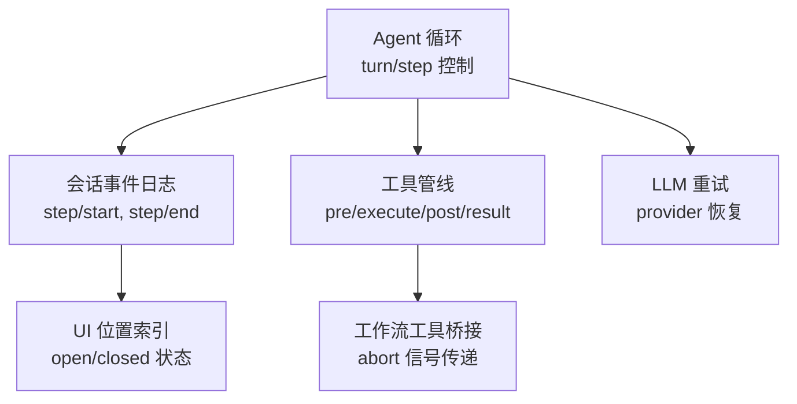
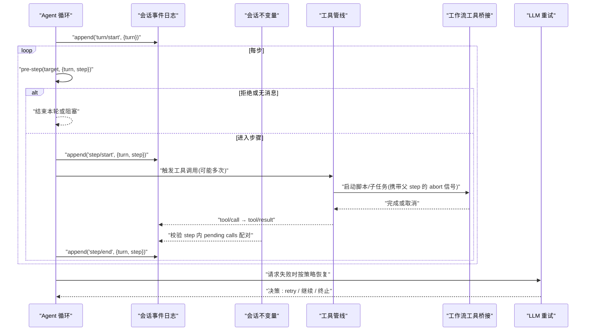
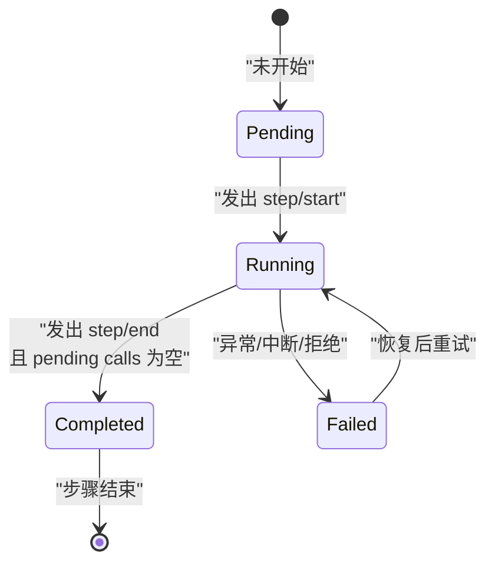
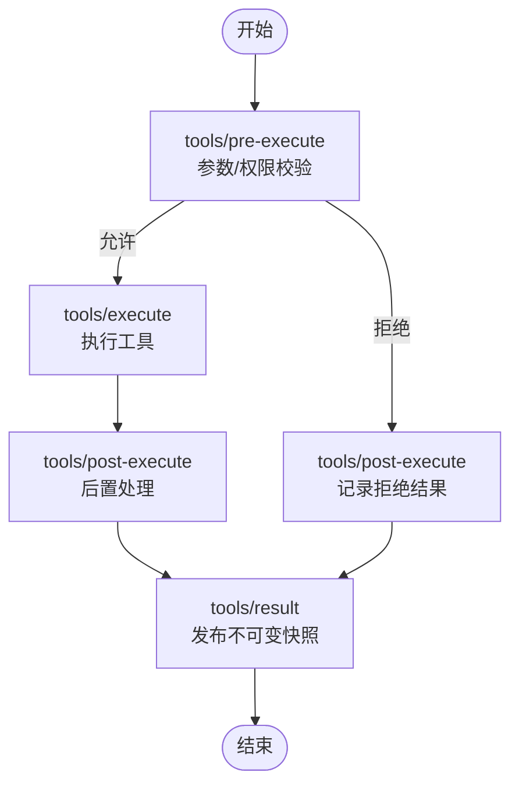
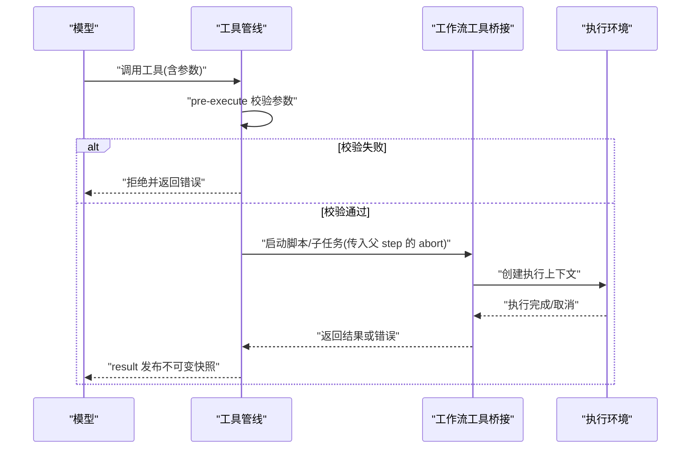
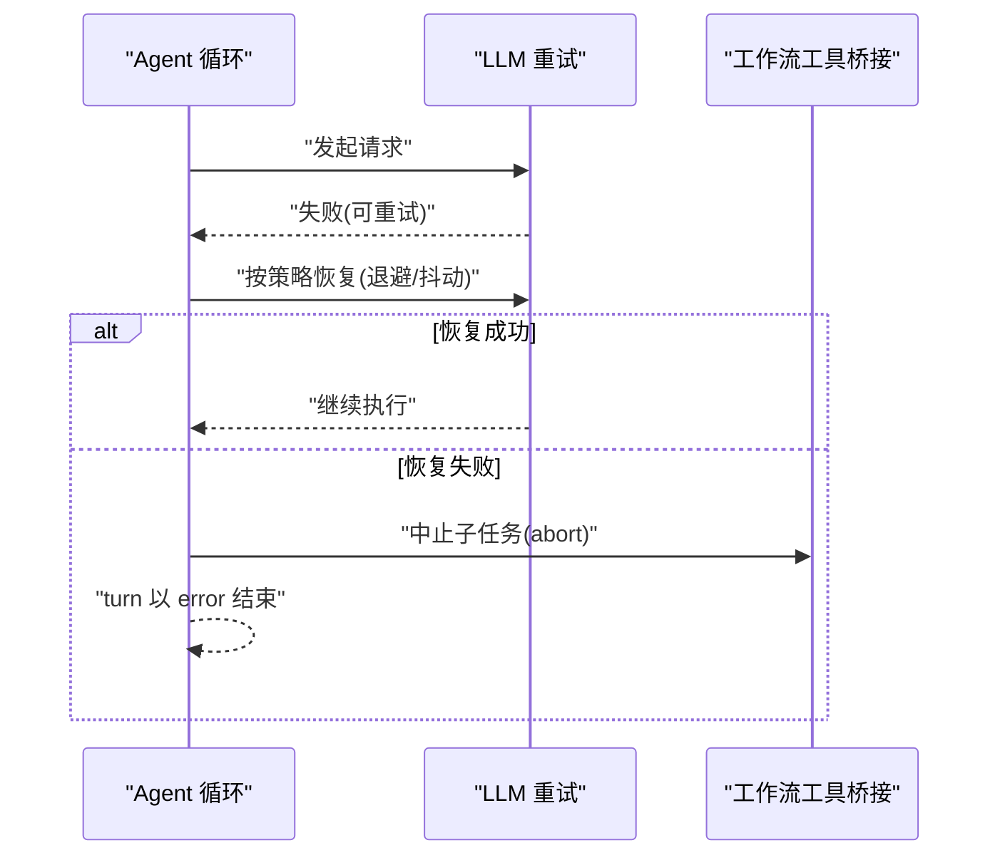
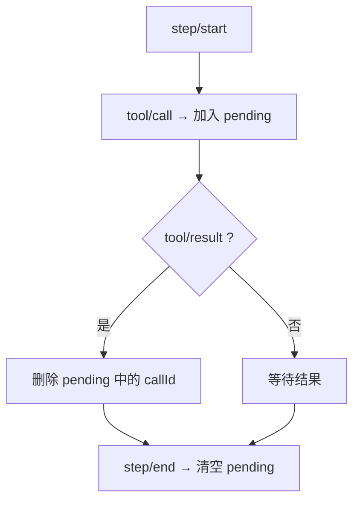
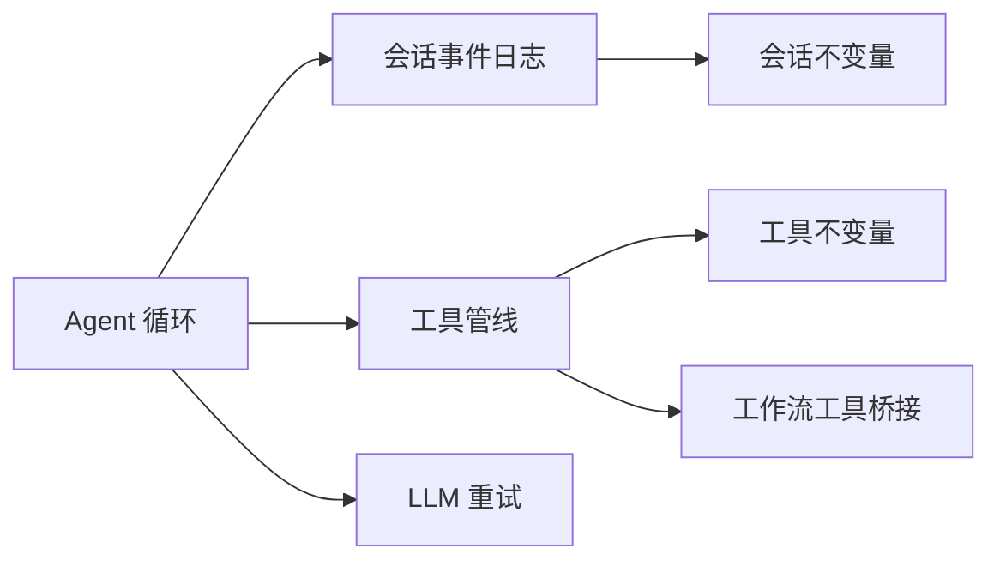

# Step执行流程

<cite>
**本文引用的文件**
- [packages/core/session/src/invariant.ts](file://packages/core/session/src/invariant.ts)
- [packages/core/agent-loop/src/agent.ts](file://packages/core/agent-loop/src/agent.ts)
- [packages/core/tools/src/invariant.ts](file://packages/core/tools/src/invariant.ts)
- [packages/workflow/tool-workflow/src/index.ts](file://packages/workflow/tool-workflow/src/index.ts)
- [packages/llm/llm-retry/src/index.ts](file://packages/llm/llm-retry/src/index.ts)
- [packages/core/agent-loop/tests/interception.spec.ts](file://packages/core/agent-loop/tests/interception.spec.ts)
- [packages/core/agent-loop/tests/coverage-edges.spec.ts](file://packages/core/agent-loop/tests/coverage-edges.spec.ts)
- [apps/cli/tests/profiles/headless/tests/expected/provider-retry/input.json](file://apps/cli/tests/profiles/headless/tests/expected/provider-retry/input.json)
- [packages/client/ui-conversation/src/client/conversation/location-index.ts](file://packages/client/ui-conversation/src/client/conversation/location-index.ts)
</cite>

## 目录
1. [简介](#简介)
2. [项目结构](#项目结构)
3. [核心组件](#核心组件)
4. [架构总览](#架构总览)
5. [详细组件分析](#详细组件分析)
6. [依赖关系分析](#依赖关系分析)
7. [性能考虑](#性能考虑)
8. [故障排查指南](#故障排查指南)
9. [结论](#结论)
10. [附录](#附录)

## 简介
本文件聚焦 DeepSeek Harness 中“Step”的执行流程，系统性说明 step/start 与 step/end 事件的管理、step 的状态转换（pending、running、completed、failed）、以及工具调用的生命周期（注册、参数校验、执行环境、结果返回）。同时给出异常与中断处理模式：重试机制、超时处理、错误恢复等，并配合时序图与流程图帮助理解。

## 项目结构
围绕 Step 执行的关键代码分布在以下模块：
- 会话不变量校验：确保 turn/step/tool-call/result 的严格配对与顺序
- Agent 循环：驱动 turn 与 step 的开启与关闭
- 工具管线不变量：约束 tools/pre-execute、tools/execute、tools/post-execute、tools/result 的顺序与冻结语义
- 工作流工具桥接：将父 step 的中断信号传递给脚本运行实例
- LLM 重试：在请求失败时按策略进行恢复
- UI 位置索引：根据 step/start 与 step/end 维护步骤的 open/closed 状态

图表来源
- [packages/core/agent-loop/src/agent.ts:252-288](file://packages/core/agent-loop/src/agent.ts#L252-L288)
- [packages/core/session/src/invariant.ts:94-112](file://packages/core/session/src/invariant.ts#L94-L112)
- [packages/core/tools/src/invariant.ts:94-119](file://packages/core/tools/src/invariant.ts#L94-L119)
- [packages/workflow/tool-workflow/src/index.ts:280-299](file://packages/workflow/tool-workflow/src/index.ts#L280-L299)
- [packages/llm/llm-retry/src/index.ts:156-179](file://packages/llm/llm-retry/src/index.ts#L156-L179)
- [packages/client/ui-conversation/src/client/conversation/location-index.ts:388-416](file://packages/client/ui-conversation/src/client/conversation/location-index.ts#L388-L416)

章节来源
- [packages/core/agent-loop/src/agent.ts:252-288](file://packages/core/agent-loop/src/agent.ts#L252-L288)
- [packages/core/session/src/invariant.ts:94-112](file://packages/core/session/src/invariant.ts#L94-L112)
- [packages/core/tools/src/invariant.ts:94-119](file://packages/core/tools/src/invariant.ts#L94-L119)
- [packages/workflow/tool-workflow/src/index.ts:280-299](file://packages/workflow/tool-workflow/src/index.ts#L280-L299)
- [packages/llm/llm-retry/src/index.ts:156-179](file://packages/llm/llm-retry/src/index.ts#L156-L179)
- [packages/client/ui-conversation/src/client/conversation/location-index.ts:388-416](file://packages/client/ui-conversation/src/client/conversation/location-index.ts#L388-L416)

## 核心组件
- 会话不变量：维护 turn/step 的打开/关闭与 tool/call-result 的成对关系，保证每个 step 内 pending 的 tool call 集合在 step/end 时被清空
- Agent 循环：负责 turn 的开启、step 的推进、step/start 与 step/end 的事件发布，以及 pre-step 拦截决策
- 工具管线不变量：强制 tools/pre-execute → tools/execute → tools/post-execute → tools/result 的顺序，并要求最终快照不可变
- 工作流工具桥接：将父 step 的 abort 信号透传到脚本引擎，确保父 step 中止时子 run 也取消
- LLM 重试：在 provider 层失败时依据策略进行恢复，支持 always 模式与可重试错误码过滤
- UI 位置索引：基于 step/start 与 step/end 维护步骤的 open/closed 状态，供前端展示

章节来源
- [packages/core/session/src/invariant.ts:22-39](file://packages/core/session/src/invariant.ts#L22-L39)
- [packages/core/agent-loop/src/agent.ts:252-288](file://packages/core/agent-loop/src/agent.ts#L252-L288)
- [packages/core/tools/src/invariant.ts:15-30](file://packages/core/tools/src/invariant.ts#L15-L30)
- [packages/workflow/tool-workflow/src/index.ts:280-299](file://packages/workflow/tool-workflow/src/index.ts#L280-L299)
- [packages/llm/llm-retry/src/index.ts:156-179](file://packages/llm/llm-retry/src/index.ts#L156-L179)
- [packages/client/ui-conversation/src/client/conversation/location-index.ts:388-416](file://packages/client/ui-conversation/src/client/conversation/location-index.ts#L388-L416)

## 架构总览
下图展示了从 Agent 循环到工具执行再到结果回写的全链路交互，包括 step 的生命周期与工具调用生命周期。

图表来源
- [packages/core/agent-loop/src/agent.ts:252-288](file://packages/core/agent-loop/src/agent.ts#L252-L288)
- [packages/core/session/src/invariant.ts:94-143](file://packages/core/session/src/invariant.ts#L94-L143)
- [packages/core/tools/src/invariant.ts:94-119](file://packages/core/tools/src/invariant.ts#L94-L119)
- [packages/workflow/tool-workflow/src/index.ts:280-299](file://packages/workflow/tool-workflow/src/index.ts#L280-L299)
- [packages/llm/llm-retry/src/index.ts:156-179](file://packages/llm/llm-retry/src/index.ts#L156-L179)

## 详细组件分析

### Step 状态机与事件管理
- 状态定义
  - pending：尚未发出 step/start
  - running：已发出 step/start，等待 step/end
  - completed：正常发出 step/end，且该 step 内所有 tool/call 均有对应 result
  - failed：因异常或中断导致 step 无法完成；若被上层恢复，则可能重新进入 running
- 关键事件
  - step/start：标记 step 进入 running，开始计数下一个 step 编号
  - step/end：清理该 step 内的 pending tool calls，推进 nextStep，step 回到 closed
- 不变量约束
  - step/start 必须发生在当前 turn 内，且 step 编号递增
  - step/end 必须匹配当前 open step，否则报错
  - 任何 assistant/chunk、assistant/message、tool/call、tool/result 都必须在 open step 内

图表来源
- [packages/core/session/src/invariant.ts:94-112](file://packages/core/session/src/invariant.ts#L94-L112)
- [packages/core/agent-loop/src/agent.ts:252-288](file://packages/core/agent-loop/src/agent.ts#L252-L288)

章节来源
- [packages/core/session/src/invariant.ts:94-112](file://packages/core/session/src/invariant.ts#L94-L112)
- [packages/core/agent-loop/src/agent.ts:252-288](file://packages/core/agent-loop/src/agent.ts#L252-L288)

### 工具调用生命周期
- 阶段顺序
  - tools/pre-execute：参数校验、权限检查、拦截决策
  - tools/execute：实际执行
  - tools/post-execute：后置处理、结果包装
  - tools/result：发布不可变的执行快照与结果
- 不变量约束
  - 每个执行对象 exec 的阶段必须单调前进：pre → execute → post → result
  - 发布前 exec 与 result 必须冻结，name 与 callId 非空
  - code-dispatch 相关事件必须在 open turn 内，且 rootCallId/parentCallId/subCallId 一致

图表来源
- [packages/core/tools/src/invariant.ts:94-119](file://packages/core/tools/src/invariant.ts#L94-L119)
- [packages/core/tools/src/invariant.ts:17-30](file://packages/core/tools/src/invariant.ts#L17-L30)

章节来源
- [packages/core/tools/src/invariant.ts:94-119](file://packages/core/tools/src/invariant.ts#L94-L119)
- [packages/core/tools/src/invariant.ts:17-30](file://packages/core/tools/src/invariant.ts#L17-L30)

### 工具注册、参数验证、执行环境与结果返回
- 工具注册：通过工具上下文注册具体实现，暴露给模型调用
- 参数验证：在 tools/pre-execute 中进行，失败可直接拒绝并产出错误结果
- 执行环境：工作流工具桥接将父 step 的 abort 信号注入子 run，确保中断传播
- 结果返回：tools/result 发布不可变快照，包含 content 与 isError 标志

图表来源
- [packages/workflow/tool-workflow/src/index.ts:280-299](file://packages/workflow/tool-workflow/src/index.ts#L280-L299)
- [packages/core/tools/src/invariant.ts:94-119](file://packages/core/tools/src/invariant.ts#L94-L119)

章节来源
- [packages/workflow/tool-workflow/src/index.ts:280-299](file://packages/workflow/tool-workflow/src/index.ts#L280-L299)
- [packages/core/tools/src/invariant.ts:94-119](file://packages/core/tools/src/invariant.ts#L94-L119)

### 异常与中断处理：重试、超时、错误恢复
- 重试机制
  - 当 LLM 请求失败时，llm-retry 插件依据 provider 的 retryPolicy 决定是否重试
  - 支持 always 模式与可重试错误码过滤；使用指数退避与抖动，避免风暴
- 超时与中断
  - 父 step 的 abort 信号会桥接到工作流子 run，确保及时取消
  - 若上游决定停止，下游回调会被中止，防止后续状态变更
- 错误恢复
  - agent-loop 在 request-error 事件中协调恢复；若无可用恢复动作，则 turn 以 error 原因结束
  - 测试覆盖显示：无恢复动作时，失败 turn 保持终端状态

图表来源
- [packages/llm/llm-retry/src/index.ts:156-179](file://packages/llm/llm-retry/src/index.ts#L156-L179)
- [packages/workflow/tool-workflow/src/index.ts:280-299](file://packages/workflow/tool-workflow/src/index.ts#L280-L299)
- [packages/core/agent-loop/tests/coverage-edges.spec.ts:421-440](file://packages/core/agent-loop/tests/coverage-edges.spec.ts#L421-L440)

章节来源
- [packages/llm/llm-retry/src/index.ts:156-179](file://packages/llm/llm-retry/src/index.ts#L156-L179)
- [packages/workflow/tool-workflow/src/index.ts:280-299](file://packages/workflow/tool-workflow/src/index.ts#L280-L299)
- [packages/core/agent-loop/tests/coverage-edges.spec.ts:421-440](file://packages/core/agent-loop/tests/coverage-edges.spec.ts#L421-L440)
- [apps/cli/tests/profiles/headless/tests/expected/provider-retry/input.json:1-8](file://apps/cli/tests/profiles/headless/tests/expected/provider-retry/input.json#L1-L8)

### 步骤与工具的强关联：pending calls 与 step 边界
- 每个 step 内维护 pending tool calls 集合
- tool/call 加入集合，tool/result 删除对应项
- step/end 时必须清空集合，否则视为不一致
- 这保证了 step 的原子性与可观测性

图表来源
- [packages/core/session/src/invariant.ts:122-143](file://packages/core/session/src/invariant.ts#L122-L143)
- [packages/core/session/src/invariant.ts:167-185](file://packages/core/session/src/invariant.ts#L167-L185)

章节来源
- [packages/core/session/src/invariant.ts:122-143](file://packages/core/session/src/invariant.ts#L122-L143)
- [packages/core/session/src/invariant.ts:167-185](file://packages/core/session/src/invariant.ts#L167-L185)

### 前端展示：步骤 open/closed 状态
- UI 根据 step/start 与 step/end 更新步骤节点状态
- step/end 或已有 end 时标记为 closed，否则为 open
- 用于界面渲染与用户交互

章节来源
- [packages/client/ui-conversation/src/client/conversation/location-index.ts:388-416](file://packages/client/ui-conversation/src/client/conversation/location-index.ts#L388-L416)

## 依赖关系分析
- Agent 循环依赖会话事件日志与工具管线
- 会话不变量依赖 session 事件流，确保 turn/step/tool-call/result 的一致性
- 工具管线依赖 invariant 约束，确保执行顺序与结果不可变
- 工作流工具桥接依赖父 step 的 abort 信号，确保中断传播
- LLM 重试依赖 provider 的错误码与策略配置

图表来源
- [packages/core/agent-loop/src/agent.ts:252-288](file://packages/core/agent-loop/src/agent.ts#L252-L288)
- [packages/core/session/src/invariant.ts:94-143](file://packages/core/session/src/invariant.ts#L94-L143)
- [packages/core/tools/src/invariant.ts:94-119](file://packages/core/tools/src/invariant.ts#L94-L119)
- [packages/workflow/tool-workflow/src/index.ts:280-299](file://packages/workflow/tool-workflow/src/index.ts#L280-L299)
- [packages/llm/llm-retry/src/index.ts:156-179](file://packages/llm/llm-retry/src/index.ts#L156-L179)

章节来源
- [packages/core/agent-loop/src/agent.ts:252-288](file://packages/core/agent-loop/src/agent.ts#L252-L288)
- [packages/core/session/src/invariant.ts:94-143](file://packages/core/session/src/invariant.ts#L94-L143)
- [packages/core/tools/src/invariant.ts:94-119](file://packages/core/tools/src/invariant.ts#L94-L119)
- [packages/workflow/tool-workflow/src/index.ts:280-299](file://packages/workflow/tool-workflow/src/index.ts#L280-L299)
- [packages/llm/llm-retry/src/index.ts:156-179](file://packages/llm/llm-retry/src/index.ts#L156-L179)

## 性能考虑
- 重试策略应限制最大次数与延迟上限，避免雪崩
- 使用指数退避与抖动降低并发冲突
- 工具执行应尽量幂等，便于安全重试
- 在 pre-execute 阶段尽早失败，减少无效执行成本
- 利用 abort 信号及时释放资源，避免长时间占用

## 故障排查指南
- 常见错误
  - step/end 时仍有 pending tool calls：检查 tool/result 是否遗漏或 callId 不匹配
  - tools/result 未冻结：确保发布前冻结 exec 与 result
  - 工具阶段顺序错误：确认 pre → execute → post → result 的调用顺序
- 调试建议
  - 观察 session/event 流，核对 turn/step/tool 的配对
  - 在 pre-execute 中打印参数与决策，快速定位拒绝原因
  - 结合 LLM 重试日志，分析失败码与恢复路径
- 参考场景
  - 无恢复动作时的失败 turn：turn 以 error 原因结束
  - 提供重试输入用例：provider-retry 场景下的行为验证

章节来源
- [packages/core/session/src/invariant.ts:94-143](file://packages/core/session/src/invariant.ts#L94-L143)
- [packages/core/tools/src/invariant.ts:94-119](file://packages/core/tools/src/invariant.ts#L94-L119)
- [packages/core/agent-loop/tests/coverage-edges.spec.ts:421-440](file://packages/core/agent-loop/tests/coverage-edges.spec.ts#L421-L440)
- [apps/cli/tests/profiles/headless/tests/expected/provider-retry/input.json:1-8](file://apps/cli/tests/profiles/headless/tests/expected/provider-retry/input.json#L1-L8)

## 结论
Step 执行流程通过严格的不变量约束与清晰的状态机设计，确保了 turn/step 的原子性与工具调用的可观测性。Agent 循环驱动 step 的推进，工具管线保障执行顺序与结果不可变，工作流桥接实现中断传播，LLM 重试提供稳健的恢复能力。遵循这些模式可有效提升系统的可靠性与可维护性。

## 附录
- 示例参考
  - 步骤拒绝与后续入队：见 interception 测试
  - 无恢复动作的失败 turn：见 coverage-edges 测试
  - 提供者重试输入用例：见 provider-retry input.json

章节来源
- [packages/core/agent-loop/tests/interception.spec.ts:365-400](file://packages/core/agent-loop/tests/interception.spec.ts#L365-L400)
- [packages/core/agent-loop/tests/coverage-edges.spec.ts:421-440](file://packages/core/agent-loop/tests/coverage-edges.spec.ts#L421-L440)
- [apps/cli/tests/profiles/headless/tests/expected/provider-retry/input.json:1-8](file://apps/cli/tests/profiles/headless/tests/expected/provider-retry/input.json#L1-L8)