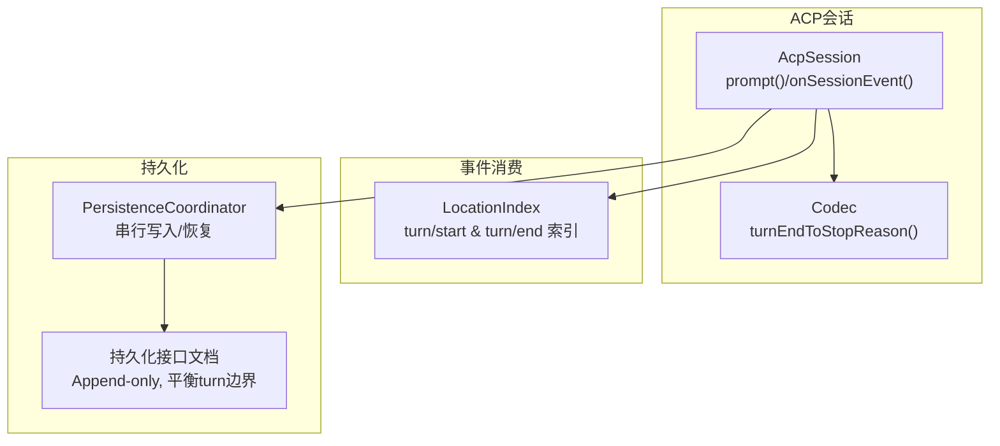
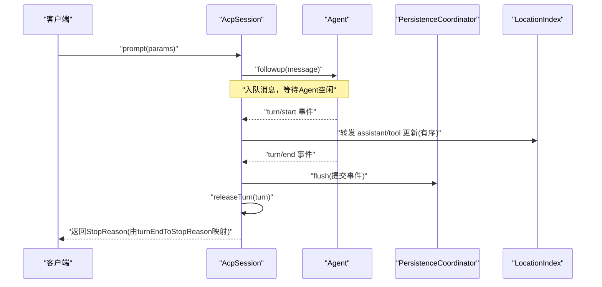
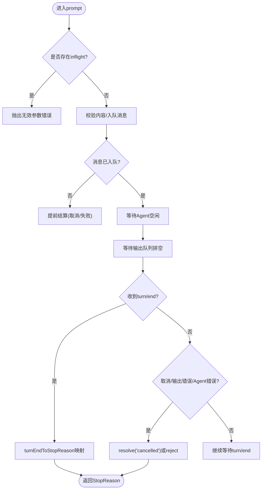
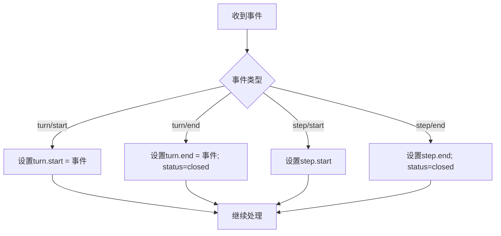
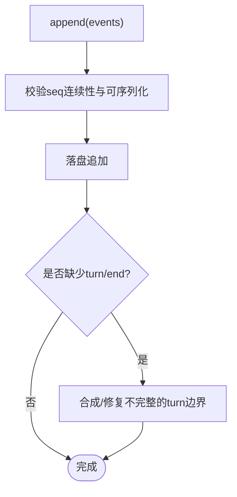
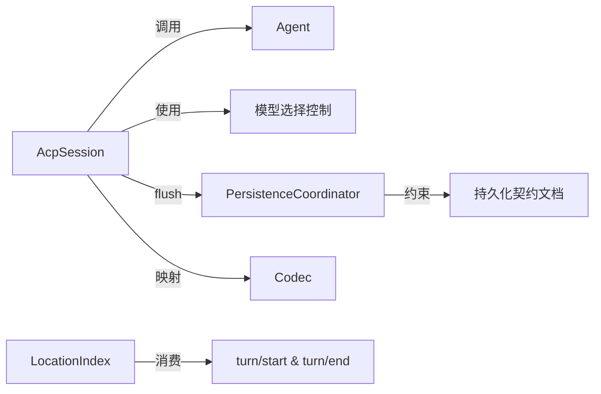

# Turn管理机制

<cite>
**本文引用的文件**
- [packages/acp/acp/src/session.ts](file://packages/acp/acp/src/session.ts)
- [packages/acp/acp/src/codec.ts](file://packages/acp/acp/src/codec.ts)
- [packages/client/ui-conversation/src/client/conversation/location-index.ts](file://packages/client/ui-conversation/src/client/conversation/location-index.ts)
- [packages/core/session/tests/invariant.spec.ts](file://packages/core/session/tests/invariant.spec.ts)
- [packages/session/session-persistence/src/coordinator.ts](file://packages/session/session-persistence/src/coordinator.ts)
- [docs/subsystems/persistence.zh.md](file://docs/subsystems/persistence.zh.md)
</cite>

## 目录
1. [简介](#简介)
2. [项目结构](#项目结构)
3. [核心组件](#核心组件)
4. [架构总览](#架构总览)
5. [详细组件分析](#详细组件分析)
6. [依赖关系分析](#依赖关系分析)
7. [性能考量](#性能考量)
8. [故障排查指南](#故障排查指南)
9. [结论](#结论)
10. [附录](#附录)

## 简介
本文件聚焦于DeepSeek Harness中的Turn（轮次）管理机制，系统阐述turn的创建、开始、执行、结束与清理的生命周期；解释turn/start与turn/end事件的触发时机与处理逻辑；说明turn与session的关系、多turn并发控制与资源隔离；并提供错误处理、超时与取消等场景的最佳实践指引。

## 项目结构
围绕turn管理的关键代码分布在以下模块：
- ACP会话层：负责将外部请求编排为Agent turn，维护inflight状态、输出顺序与终止原因映射。
- 事件消费层：UI与索引根据turn/start与turn/end构建可视化的对话时间线与导航。
- 持久化协调层：保证append-only日志的连续性，确保每个turn以turn/end闭合，支持冷启动恢复与并发写入串行化。
- 类型与契约：定义TurnEndReason并映射到ACP协议语义。

图表来源
- [packages/acp/acp/src/session.ts:246-334](file://packages/acp/acp/src/session.ts#L246-L334)
- [packages/acp/acp/src/codec.ts:14-34](file://packages/acp/acp/src/codec.ts#L14-L34)
- [packages/client/ui-conversation/src/client/conversation/location-index.ts:264-280](file://packages/client/ui-conversation/src/client/conversation/location-index.ts#L264-L280)
- [packages/session/session-persistence/src/coordinator.ts:578-606](file://packages/session/session-persistence/src/coordinator.ts#L578-L606)
- [docs/subsystems/persistence.zh.md:296-331](file://docs/subsystems/persistence.zh.md#L296-L331)

章节来源
- [packages/acp/acp/src/session.ts:246-334](file://packages/acp/acp/src/session.ts#L246-L334)
- [packages/client/ui-conversation/src/client/conversation/location-index.ts:264-280](file://packages/client/ui-conversation/src/client/conversation/location-index.ts#L264-L280)
- [packages/session/session-persistence/src/coordinator.ts:578-606](file://packages/session/session-persistence/src/coordinator.ts#L578-L606)
- [docs/subsystems/persistence.zh.md:296-331](file://docs/subsystems/persistence.zh.md#L296-L331)

## 核心组件
- AcpSession：封装一次会话的Agent生命周期，维护单条inflight prompt，按序投递assistant/tool更新，并在turn结束时释放模型槽位、计算停止原因。
- Codec：将内部TurnEndReason映射为ACP协议的StopReason，统一对外语义。
- LocationIndex：消费turn/start与turn/end事件，构建turn与step的时间线位置索引，驱动UI渲染与导航。
- PersistenceCoordinator：对每个session的写路径进行串行化，保证append-only与连续seq，并在load/prepare时修复不完整的尾段，确保log以turn/end闭合。

章节来源
- [packages/acp/acp/src/session.ts:98-118](file://packages/acp/acp/src/session.ts#L98-L118)
- [packages/acp/acp/src/codec.ts:14-34](file://packages/acp/acp/src/codec.ts#L14-L34)
- [packages/client/ui-conversation/src/client/conversation/location-index.ts:264-280](file://packages/client/ui-conversation/src/client/conversation/location-index.ts#L264-L280)
- [packages/session/session-persistence/src/coordinator.ts:578-606](file://packages/session/session-persistence/src/coordinator.ts#L578-L606)

## 架构总览
下图展示从用户请求到turn完成的全链路：

图表来源
- [packages/acp/acp/src/session.ts:246-334](file://packages/acp/acp/src/session.ts#L246-L334)
- [packages/acp/acp/src/session.ts:348-392](file://packages/acp/acp/src/session.ts#L348-L392)
- [packages/acp/acp/src/codec.ts:14-34](file://packages/acp/acp/src/codec.ts#L14-L34)
- [packages/session/session-persistence/src/coordinator.ts:578-606](file://packages/session/session-persistence/src/coordinator.ts#L578-L606)

## 详细组件分析

### AcpSession：turn生命周期与并发控制
- 创建与会话恢复：通过create/resume装配Agent与MCP服务，安装模型选择控制。
- 单次prompt准入：同一会话仅允许一个inflight prompt，拒绝重复入队；支持请求级取消信号。
- 事件处理：
  - assistant/message、tool/call、tool/result按outputTail顺序投递，避免乱序。
  - turn/end时记录endReason并释放模型turn槽位。
- 结算策略：在admission完成、Agent空闲、输出队列排空后，依据cancel/outputError/agentError/endReason决定resolve或reject。
- 关闭流程：取消inflight、等待子代理清理、flush持久化、释放Agent。

图表来源
- [packages/acp/acp/src/session.ts:246-334](file://packages/acp/acp/src/session.ts#L246-L334)
- [packages/acp/acp/src/session.ts:348-392](file://packages/acp/acp/src/session.ts#L348-L392)
- [packages/acp/acp/src/session.ts:486-526](file://packages/acp/acp/src/session.ts#L486-L526)
- [packages/acp/acp/src/codec.ts:14-34](file://packages/acp/acp/src/codec.ts#L14-L34)

章节来源
- [packages/acp/acp/src/session.ts:98-118](file://packages/acp/acp/src/session.ts#L98-L118)
- [packages/acp/acp/src/session.ts:246-334](file://packages/acp/acp/src/session.ts#L246-L334)
- [packages/acp/acp/src/session.ts:348-392](file://packages/acp/acp/src/session.ts#L348-L392)
- [packages/acp/acp/src/session.ts:431-471](file://packages/acp/acp/src/session.ts#L431-L471)
- [packages/acp/acp/src/session.ts:486-526](file://packages/acp/acp/src/session.ts#L486-L526)
- [packages/acp/acp/src/codec.ts:14-34](file://packages/acp/acp/src/codec.ts#L14-L34)

### 事件消费：turn/start与turn/end的UI索引
- 当收到turn/start时，创建或更新对应turn的start事件引用；收到turn/end时设置end事件并标记closed。
- step/start与step/end同理，用于细粒度步骤导航。
- 该索引支撑聊天界面的时间线、折叠与跳转。

图表来源
- [packages/client/ui-conversation/src/client/conversation/location-index.ts:264-280](file://packages/client/ui-conversation/src/client/conversation/location-index.ts#L264-L280)

章节来源
- [packages/client/ui-conversation/src/client/conversation/location-index.ts:264-280](file://packages/client/ui-conversation/src/client/conversation/location-index.ts#L264-L280)

### 持久化：turn边界的平衡与恢复
- 持久化接口要求append-only且连续seq，load/prepare需保证最终log以turn/end闭合，未完成的尾段会被合成性闭合或截断。
- PersistenceCoordinator对每个session的写操作串行化，避免并发flush交错；同时提供准备态复用与冷恢复。

图表来源
- [docs/subsystems/persistence.zh.md:296-331](file://docs/subsystems/persistence.zh.md#L296-L331)
- [packages/session/session-persistence/src/coordinator.ts:578-606](file://packages/session/session-persistence/src/coordinator.ts#L578-L606)

章节来源
- [docs/subsystems/persistence.zh.md:296-331](file://docs/subsystems/persistence.zh.md#L296-L331)
- [packages/session/session-persistence/src/coordinator.ts:578-606](file://packages/session/session-persistence/src/coordinator.ts#L578-L606)

### 与Session的关系与并发隔离
- 每个AcpSession绑定一个Agent与Session，拥有独立的inflight slot与outputTail队列，天然实现同会话内turn串行。
- 不同会话之间互不影响；跨会话的并发由上层调度器控制。
- 持久化层按session id串行化写路径，避免同一session的并发写入竞争。

章节来源
- [packages/acp/acp/src/session.ts:98-118](file://packages/acp/acp/src/session.ts#L98-L118)
- [packages/acp/acp/src/session.ts:246-334](file://packages/acp/acp/src/session.ts#L246-L334)
- [packages/session/session-persistence/src/coordinator.ts:578-606](file://packages/session/session-persistence/src/coordinator.ts#L578-L606)

## 依赖关系分析
- AcpSession依赖：
  - Agent：执行turn，产生assistant/tool事件与turn边界。
  - LLM模型选择控制：按turn pin路由与推理强度。
  - 持久化：flush提交事件，保障turn边界完整。
  - Codec：将内部终止原因映射为ACP协议语义。
- UI消费：
  - LocationIndex订阅turn/start与turn/end，构建时间线。
- 持久化：
  - Coordinator保证append-only与恢复一致性。

图表来源
- [packages/acp/acp/src/session.ts:246-334](file://packages/acp/acp/src/session.ts#L246-L334)
- [packages/acp/acp/src/codec.ts:14-34](file://packages/acp/acp/src/codec.ts#L14-L34)
- [packages/client/ui-conversation/src/client/conversation/location-index.ts:264-280](file://packages/client/ui-conversation/src/client/conversation/location-index.ts#L264-L280)
- [packages/session/session-persistence/src/coordinator.ts:578-606](file://packages/session/session-persistence/src/coordinator.ts#L578-L606)
- [docs/subsystems/persistence.zh.md:296-331](file://docs/subsystems/persistence.zh.md#L296-L331)

章节来源
- [packages/acp/acp/src/session.ts:246-334](file://packages/acp/acp/src/session.ts#L246-L334)
- [packages/acp/acp/src/codec.ts:14-34](file://packages/acp/acp/src/codec.ts#L14-L34)
- [packages/client/ui-conversation/src/client/conversation/location-index.ts:264-280](file://packages/client/ui-conversation/src/client/conversation/location-index.ts#L264-L280)
- [packages/session/session-persistence/src/coordinator.ts:578-606](file://packages/session/session-persistence/src/coordinator.ts#L578-L606)
- [docs/subsystems/persistence.zh.md:296-331](file://docs/subsystems/persistence.zh.md#L296-L331)

## 性能考量
- 输出顺序：通过outputTail串行化assistant/tool更新，避免UI抖动与重绘风暴。
- 会话级串行：同一session的prompt仅一个inflight，降低锁竞争与上下文切换。
- 持久化串行：按session id串行写路径，减少磁盘争用与恢复复杂度。
- 建议：
  - 批量工具调用尽量在同一turn内完成，减少turn切换开销。
  - 长任务拆分为多个step而非多turn，便于UI步进展示与恢复。
  - 合理设置模型推理强度与max tokens，避免频繁中断。

[本节为通用指导，无需具体文件引用]

## 故障排查指南
- 常见症状与定位
  - 多次prompt被拒：检查是否已有inflight prompt未结算。
  - 输出乱序：确认是否绕过outputTail直接通知。
  - 无法恢复：检查持久化log是否以turn/end闭合，必要时查看load/prepare修复逻辑。
- 典型问题
  - 取消未生效：确认requestSignal是否正确传递，以及是否在admission阶段即被中止。
  - 超时/中断：关注turn/end reason为max-tokens或interrupted时的分支处理。
  - 并发写入冲突：确保不同session的写入由Coordinator串行化，避免同一session并发append。
- 参考行为
  - 测试用例验证了open turn的边界约束与恢复行为。

章节来源
- [packages/core/session/tests/invariant.spec.ts:405-421](file://packages/core/session/tests/invariant.spec.ts#L405-L421)
- [packages/acp/acp/src/session.ts:246-334](file://packages/acp/acp/src/session.ts#L246-L334)
- [packages/acp/acp/src/session.ts:486-526](file://packages/acp/acp/src/session.ts#L486-L526)

## 结论
Turn机制以“单会话单inflight + 有序输出 + 持久化平衡”为核心原则，确保：
- turn/start与turn/end严格成对出现，支持冷启动恢复。
- 同会话内turn串行执行，跨会话并发安全。
- 对外暴露稳定的ACP语义，屏蔽内部复杂状态。
遵循上述模式可实现健壮、可恢复、易观测的对话式Agent运行环境。

[本节为总结，无需具体文件引用]

## 附录
- 关键API与事件
  - AcpSession.prompt：发起一轮turn，返回StopReason。
  - AcpSession.onSessionEvent：消费assistant/tool/turn事件，维护状态与顺序。
  - turn/start、turn/end：turn生命周期的起止事件。
  - turnEndToStopReason：内部终止原因到ACP协议的映射。
- 最佳实践清单
  - 始终等待whenIdle与outputTail后再结算prompt。
  - 在close中先cancel再flush，确保资源释放顺序正确。
  - 对长耗时任务采用step划分，避免超长turn导致恢复困难。
  - 利用LocationIndex提供的turn/step索引优化UI交互。

[本节为补充信息，无需具体文件引用]