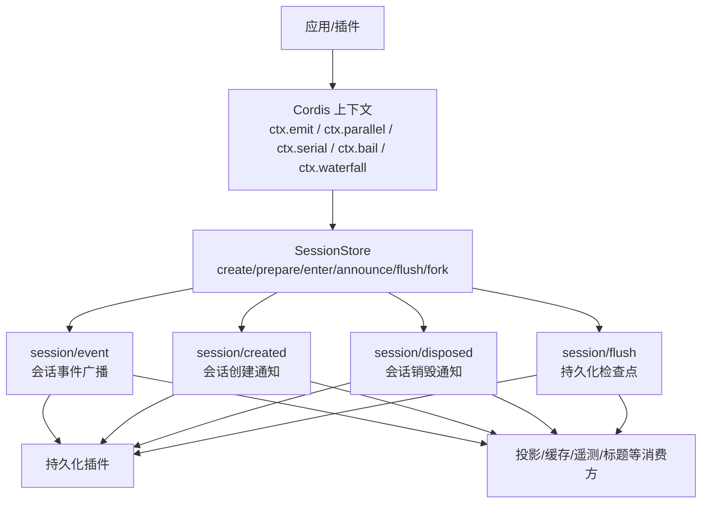
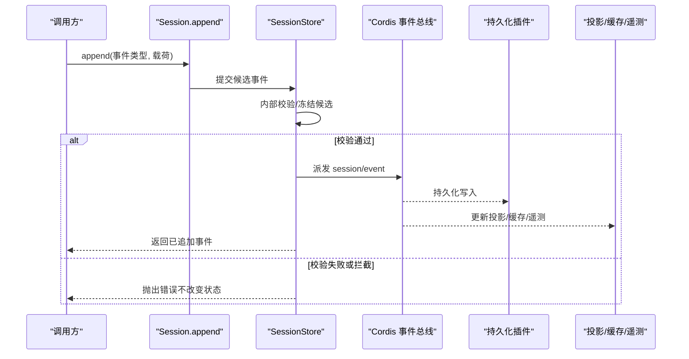
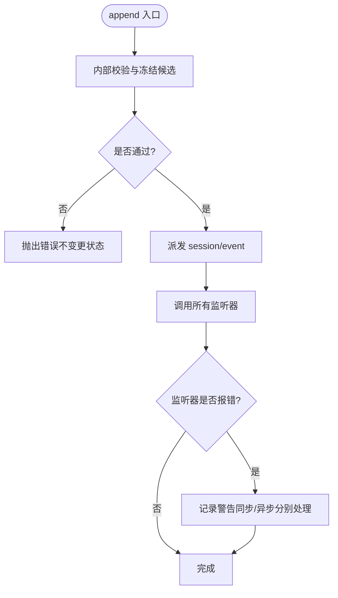
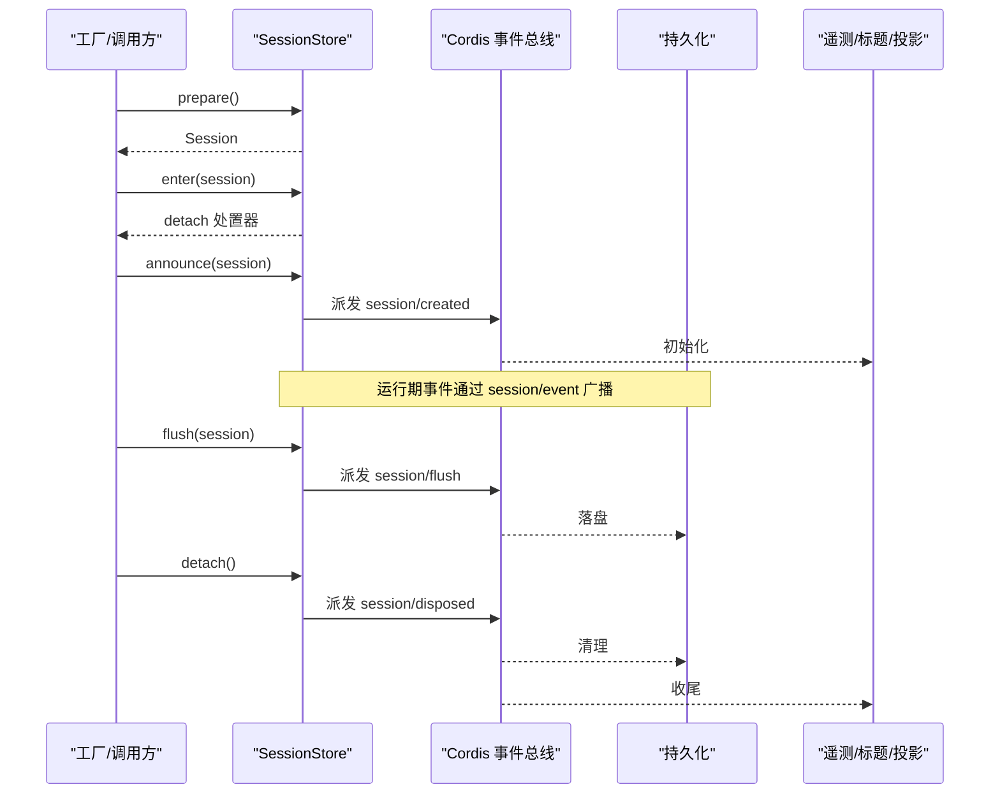
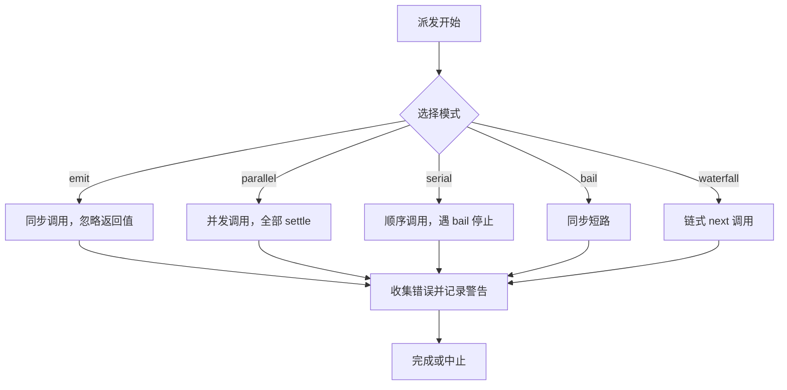
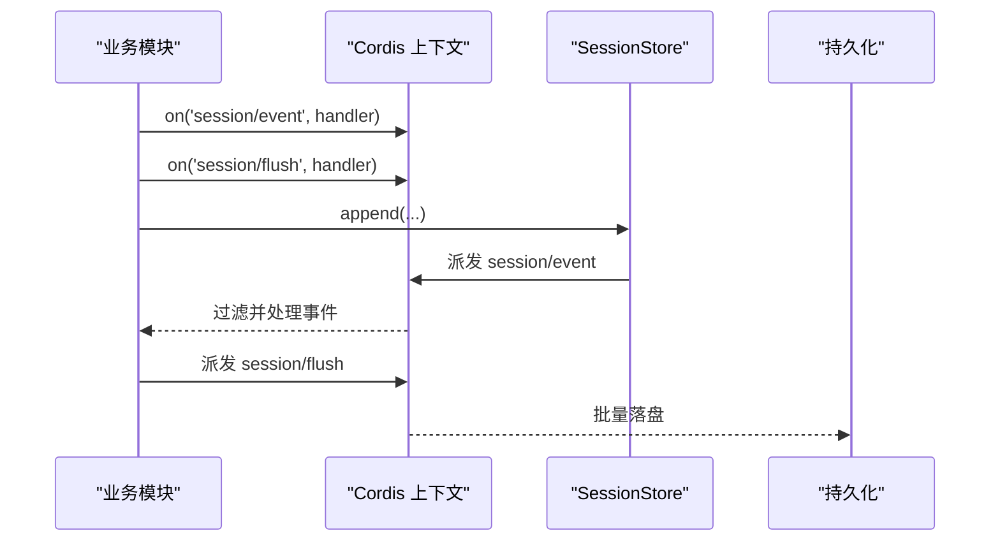
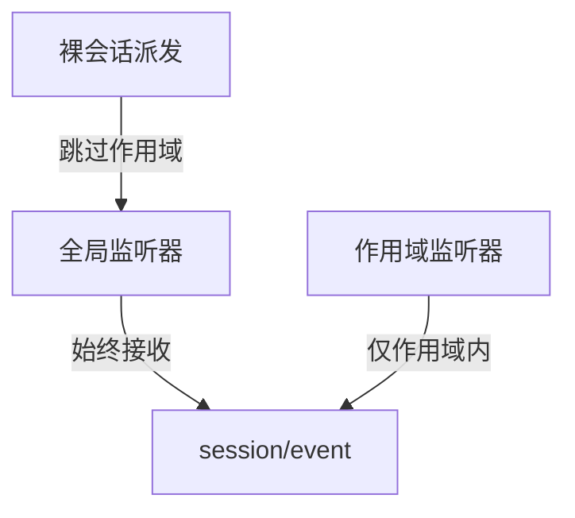
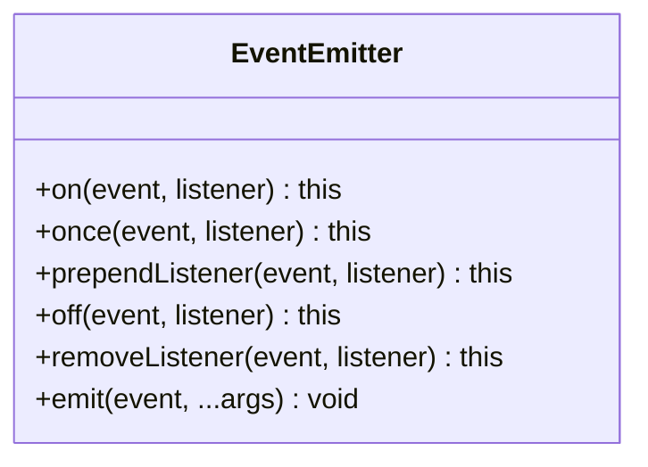
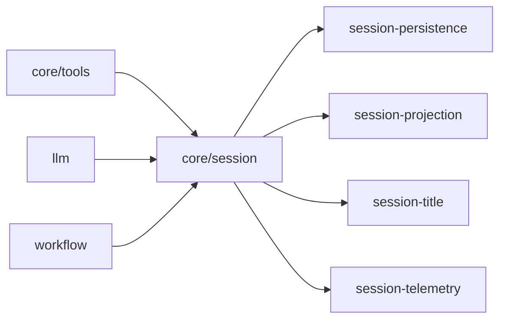

# 事件发布机制

<cite>
**本文引用的文件**
- [docs/cordis-api/events.md](file://docs/cordis-api/events.md)
- [docs/event-producer-consumer.md](file://docs/event-producer-consumer.md)
- [docs/subsystems/session.md](file://docs/subsystems/session.md)
- [packages/core/session/tests/session.spec.ts](file://packages/core/session/tests/session.spec.ts)
- [packages/core/session/tests/scoped.spec.ts](file://packages/core/session/tests/scoped.spec.ts)
- [packages/experimental/webworker-runtime/src/node/builtin_modules/implemented/events.ts](file://packages/experimental/webworker-runtime/src/node/builtin_modules/implemented/events.ts)
</cite>

## 目录
1. [简介](#简介)
2. [项目结构](#项目结构)
3. [核心组件](#核心组件)
4. [架构总览](#架构总览)
5. [详细组件分析](#详细组件分析)
6. [依赖关系分析](#依赖关系分析)
7. [性能考量](#性能考量)
8. [故障排查指南](#故障排查指南)
9. [结论](#结论)
10. [附录](#附录)

## 简介
本文件围绕 DeepSeek Harness 的事件发布机制，聚焦 session/event 总线的工作原理与使用方式。内容涵盖：
- 事件发布、订阅与分发的整体流程
- 事件类型定义与消息格式（内置事件与扩展点）
- 异步处理模式与错误处理策略（含队列、重试与死信思路）
- 事件驱动业务逻辑的实践示例（监听器注册、过滤、批量处理）

## 项目结构
DeepSeek Harness 将“会话事件”作为系统内最重要的数据流之一。session 模块负责创建、进入、宣布与销毁会话，并通过统一的 `session/event` 事件对外广播会话内的所有事件；同时提供 `session/created`、`session/disposed`、`session/flush` 等生命周期与持久化相关事件。Cordis 上下文提供统一的事件分发 API（emit/parallel/serial/bail/waterfall），各子系统通过声明式事件表进行生产者/消费者解耦。

图表来源
- [docs/subsystems/session.md:744-868](file://docs/subsystems/session.md#L744-L868)
- [docs/cordis-api/events.md:8-123](file://docs/cordis-api/events.md#L8-L123)

章节来源
- [docs/subsystems/session.md:744-868](file://docs/subsystems/session.md#L744-L868)
- [docs/cordis-api/events.md:8-123](file://docs/cordis-api/events.md#L8-L123)

## 核心组件
- Cordis 事件分发 API
  - 同步 emit：忽略返回值，适合副作用型通知
  - 并行 parallel：等待所有监听器完成
  - 串行 serial：按序执行，遇到 bail 值即停止
  - bail：同步短路返回首个非空结果
  - waterfall：链式拦截器模式，最后一个参数为 next 回调
- SessionStore 会话管理
  - create/prepare/enter/announce：构建并激活会话，安装发布钩子
  - flush：触发持久化检查点
  - fork：基于源会话的某个边界生成子会话
- 事件矩阵（Producer/Consumer）
  - 文档化的事件清单，标注每个事件的派发模式、声明位置、派发方与监听方

章节来源
- [docs/cordis-api/events.md:8-123](file://docs/cordis-api/events.md#L8-L123)
- [docs/event-producer-consumer.md:8-74](file://docs/event-producer-consumer.md#L8-L74)
- [docs/subsystems/session.md:744-868](file://docs/subsystems/session.md#L744-L868)

## 架构总览
下图展示了从“会话事件写入”到“多消费方处理”的端到端流程，包括内部校验、冻结、发布与异常隔离。

图表来源
- [packages/core/session/tests/session.spec.ts:1413-1516](file://packages/core/session/tests/session.spec.ts#L1413-L1516)
- [docs/subsystems/session.md:744-868](file://docs/subsystems/session.md#L744-L868)

## 详细组件分析

### 事件总线与分发模式
- 分发模式
  - emit：同步、忽略返回值
  - parallel：并发执行，全部 settle 后返回
  - serial：顺序执行，遇 bail 值提前结束
  - bail：同步短路
  - waterfall：链式拦截，最后参数为 next
- 适用场景
  - 通知类：emit
  - 聚合结果：parallel
  - 可中断流水线：serial/bail
  - 拦截/改写：waterfall

章节来源
- [docs/cordis-api/events.md:8-123](file://docs/cordis-api/events.md#L8-L123)

### 会话事件总线（session/event）
- 作用：将会话内的所有事件以统一通道广播给所有订阅者
- 特点：
  - 事件在提交前会进行内部校验与冻结，确保不可变性与一致性
  - 监听器中抛错会被捕获并记录警告，不会中断主流程
  - 支持重入保护：同一 append 期间禁止再次 append
  - 支持延迟分离：detach 会在派发解析、提交与观察者发布之后才生效
- 典型消费方：持久化、投影、缓存、遥测、标题计算、审批、计划等

图表来源
- [packages/core/session/tests/session.spec.ts:1395-1411](file://packages/core/session/tests/session.spec.ts#L1395-L1411)
- [packages/core/session/tests/session.spec.ts:1413-1516](file://packages/core/session/tests/session.spec.ts#L1413-L1516)
- [packages/core/session/tests/session.spec.ts:1518-1538](file://packages/core/session/tests/session.spec.ts#L1518-L1538)

章节来源
- [packages/core/session/tests/session.spec.ts:1395-1411](file://packages/core/session/tests/session.spec.ts#L1395-L1411)
- [packages/core/session/tests/session.spec.ts:1413-1516](file://packages/core/session/tests/session.spec.ts#L1413-L1516)
- [packages/core/session/tests/session.spec.ts:1518-1538](file://packages/core/session/tests/session.spec.ts#L1518-L1538)

### 会话生命周期事件
- session/created：会话创建后仅派发一次，用于初始化各子系统
- session/disposed：会话销毁时派发，用于清理资源
- session/flush：持久化检查点，由存储层拥有者统一调度，避免竞态
- announce：确保在 enter 之后且仅一次地派发 created

图表来源
- [docs/subsystems/session.md:744-868](file://docs/subsystems/session.md#L744-L868)

章节来源
- [docs/subsystems/session.md:744-868](file://docs/subsystems/session.md#L744-L868)

### 事件类型与消息格式
- 内置事件
  - 会话生命周期：session/created、session/disposed、session/flush
  - 会话事件流：session/event（承载具体业务事件，如 turn/start、request/context 等）
  - 其他领域事件：agent/*、tools/*、llm/stream、workflow/* 等（见事件矩阵）
- 自定义事件扩展
  - 通过 Cordis 上下文声明事件类型并在对应模块派发
  - 使用事件矩阵维护声明、派发方与监听方的映射，便于追踪与维护
- 消息格式
  - session/event 的载荷为会话事件对象，包含类型与数据字段
  - 事件在派发前被冻结，保证监听器只读访问

章节来源
- [docs/event-producer-consumer.md:8-74](file://docs/event-producer-consumer.md#L8-L74)
- [docs/subsystems/session.md:744-868](file://docs/subsystems/session.md#L744-L868)

### 异步模式与错误处理
- 异步模式
  - parallel：适用于独立副作用的并发处理（如持久化、遥测）
  - serial/bail：适用于需要顺序控制或短路决策的场景
  - waterfall：适用于拦截/改写链（如权限、审计、压缩）
- 错误处理策略
  - 监听器抛错会被捕获并记录警告，不中断主流程
  - 内部派发失败（如校验失败）会直接抛出，阻止状态变更
  - 重入保护：在 append 发布期间禁止再次 append
  - 延迟分离：detach 在派发解析、提交与观察者发布后才生效，避免时序问题

图表来源
- [docs/cordis-api/events.md:8-123](file://docs/cordis-api/events.md#L8-L123)
- [packages/core/session/tests/session.spec.ts:1395-1411](file://packages/core/session/tests/session.spec.ts#L1395-L1411)

章节来源
- [docs/cordis-api/events.md:8-123](file://docs/cordis-api/events.md#L8-L123)
- [packages/core/session/tests/session.spec.ts:1395-1411](file://packages/core/session/tests/session.spec.ts#L1395-L1411)

### 事件队列、重试与死信
- 队列
  - 当前实现未暴露显式队列；事件通过事件总线即时派发，持久化由 session/flush 统一触发
- 重试
  - 未在事件层内置通用重试；可在监听器侧对幂等操作实现重试
- 死信
  - 未实现死信队列；可通过日志与监控定位失败路径，结合外部系统实现归档
- 建议
  - 对关键持久化操作增加幂等键与重试
  - 对高吞吐场景考虑批量化 flush，降低 IO 压力

[本节为概念性说明，不直接分析具体文件]

### 代码级示例与实践
- 监听器注册
  - 使用 ctx.on('session/event', handler) 订阅会话事件
  - 使用 ctx.once('session/created', handler) 一次性订阅创建事件
- 事件过滤
  - 在监听器内根据 event.type 进行分支处理
  - 可使用全局监听与范围监听组合，实现细粒度过滤
- 批量处理
  - 在 session/flush 中集中落盘，减少频繁 IO
  - 对高频事件（如 llm/stream）采用缓冲与合并策略

图表来源
- [docs/subsystems/session.md:744-868](file://docs/subsystems/session.md#L744-L868)
- [docs/event-producer-consumer.md:8-74](file://docs/event-producer-consumer.md#L8-L74)

章节来源
- [docs/subsystems/session.md:744-868](file://docs/subsystems/session.md#L744-L868)
- [docs/event-producer-consumer.md:8-74](file://docs/event-producer-consumer.md#L8-L74)

### 作用域与事件可见性
- 全局监听：在所有上下文中均可收到事件
- 作用域监听：仅在指定作用域内生效，避免无关噪声
- 裸会话派发：无主体会话的事件不会被作用域监听器接收

图表来源
- [packages/core/session/tests/scoped.spec.ts:35-62](file://packages/core/session/tests/scoped.spec.ts#L35-L62)

章节来源
- [packages/core/session/tests/scoped.spec.ts:35-62](file://packages/core/session/tests/scoped.spec.ts#L35-L62)

### 最小 EventEmitter（WebWorker 环境）
- 提供 on/once/prependListener/off/removeListener/emit 等基础能力
- 行为遵循 Node 风格：prepend 优先、once 自动移除、off 支持 once 包装函数识别
- 用途：在受限环境中模拟事件机制，保障 harness 代码可移植性

图表来源
- [packages/experimental/webworker-runtime/src/node/builtin_modules/implemented/events.ts:17-91](file://packages/experimental/webworker-runtime/src/node/builtin_modules/implemented/events.ts#L17-L91)

章节来源
- [packages/experimental/webworker-runtime/src/node/builtin_modules/implemented/events.ts:17-91](file://packages/experimental/webworker-runtime/src/node/builtin_modules/implemented/events.ts#L17-L91)

## 依赖关系分析
- 事件矩阵显示各子系统之间的松耦合关系：声明、派发与监听解耦
- 会话模块为核心枢纽，连接持久化、投影、遥测、标题等多个消费方
- 工具链、工作流、LLM 等子系统通过标准事件协作，避免直接依赖

图表来源
- [docs/event-producer-consumer.md:8-74](file://docs/event-producer-consumer.md#L8-L74)
- [docs/subsystems/session.md:744-868](file://docs/subsystems/session.md#L744-L868)

章节来源
- [docs/event-producer-consumer.md:8-74](file://docs/event-producer-consumer.md#L8-L74)
- [docs/subsystems/session.md:744-868](file://docs/subsystems/session.md#L744-L868)

## 性能考量
- 并发与顺序
  - 使用 parallel 提升吞吐，但需确保监听器幂等与可并发
  - 使用 serial/bail 控制顺序与短路，避免不必要开销
- 批量化
  - 利用 session/flush 集中落盘，减少 IO 次数
  - 对高频事件（如流式输出）进行合并与节流
- 内存与冻结
  - 事件在派发前冻结，避免监听器修改导致不一致
  - 注意大对象传递时的拷贝成本，必要时拆分事件

[本节提供通用指导，不直接分析具体文件]

## 故障排查指南
- 监听器抛错
  - 现象：控制台出现警告，提示同步/异步监听器异常
  - 处理：检查监听器实现，确保异常捕获与降级
- 重入保护
  - 现象：在 session/event 监听器中再次 append 会触发警告
  - 处理：避免重入，或将后续操作延后到下一轮事件循环
- 内部派发失败
  - 现象：append 抛出错误，事件未追加
  - 处理：检查事件载荷是否符合规范，确保不可变与合法字段
- 延迟分离
  - 现象：detach 在派发完成后才生效，确保最终一致性
  - 处理：不要在监听器中依赖立即分离语义

章节来源
- [packages/core/session/tests/session.spec.ts:1395-1411](file://packages/core/session/tests/session.spec.ts#L1395-L1411)
- [packages/core/session/tests/session.spec.ts:1518-1538](file://packages/core/session/tests/session.spec.ts#L1518-L1538)
- [packages/core/session/tests/session.spec.ts:1540-1567](file://packages/core/session/tests/session.spec.ts#L1540-L1567)

## 结论
DeepSeek Harness 的事件发布机制以 Cordis 上下文为核心，配合 SessionStore 提供的会话事件总线，实现了高内聚、低耦合的系统协作。通过多种分发模式与严格的错误处理策略，系统在可扩展性、一致性与可观测性方面具备良好基础。对于生产环境，建议结合批量化 flush、幂等与监控告警，进一步提升稳定性与性能。

## 附录
- 快速参考
  - 事件分发 API：emit/parallel/serial/bail/waterfall
  - 会话事件：session/event、session/created、session/disposed、session/flush
  - 事件矩阵：查看各事件的生产者与消费者关系
- 实践建议
  - 使用 session/flush 做批量化持久化
  - 在监听器中进行事件过滤与聚合
  - 对关键路径添加监控与日志

[本节为概览性内容，不直接分析具体文件]