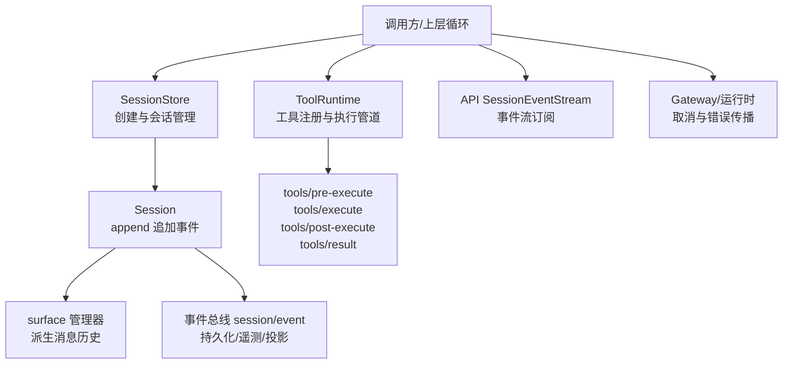
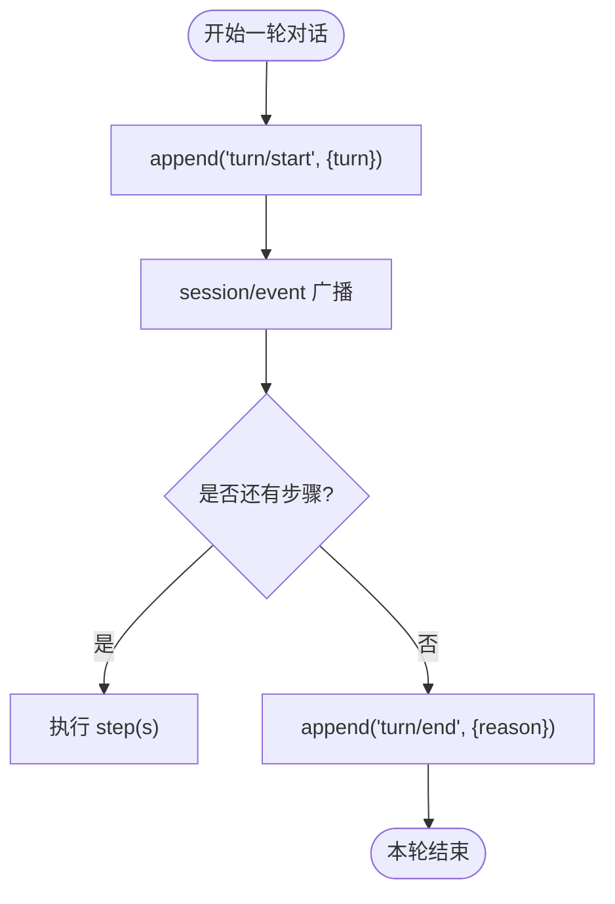
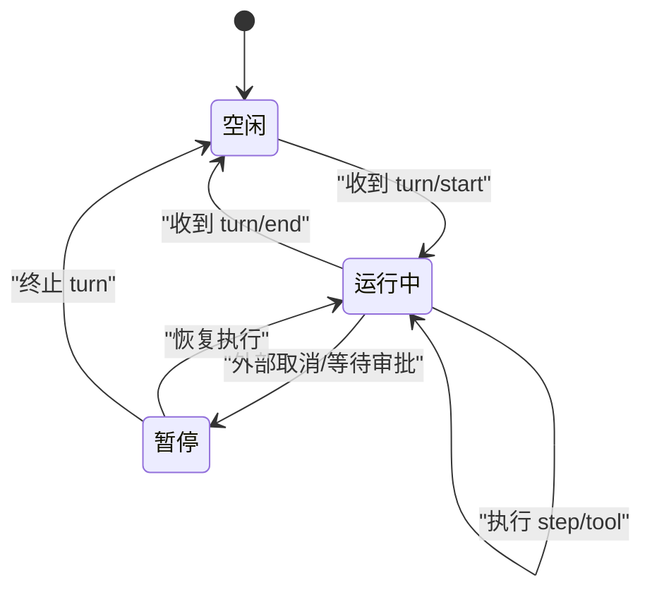
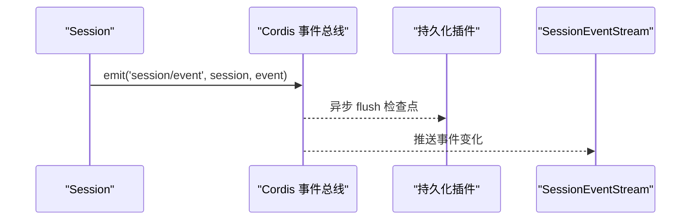
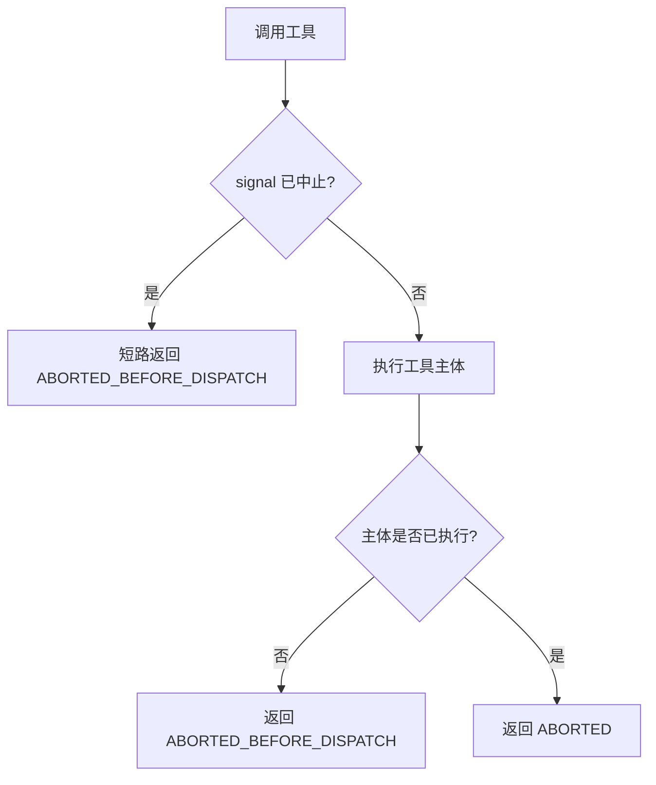
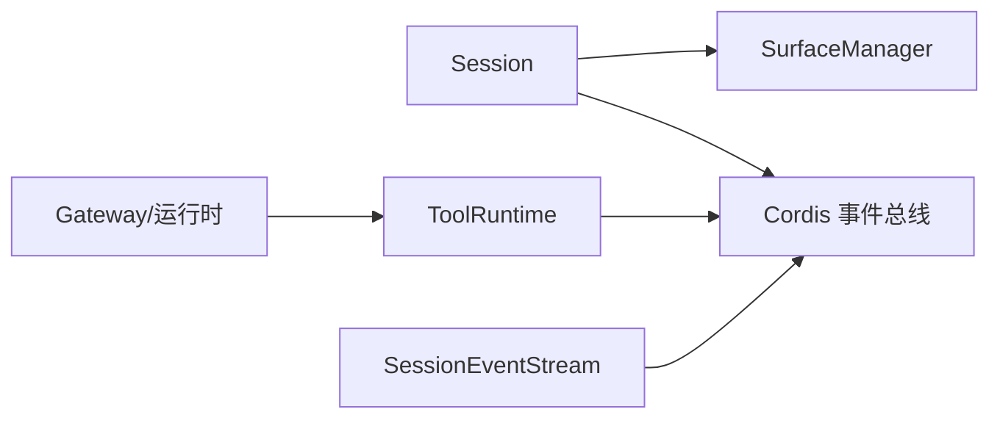

# 会话执行流程

<cite>
**本文引用的文件**
- [packages/core/session/src/index.ts](file://packages/core/session/src/index.ts)
- [packages/core/tools/src/index.ts](file://packages/core/tools/src/index.ts)
- [docs/event-producer-consumer.zh.md](file://docs/event-producer-consumer.zh.md)
- [packages/api/session-controller/src/client/transport.ts](file://packages/api/session-controller/src/client/transport.ts)
- [packages/api/gateway/src/index.ts](file://packages/api/gateway/src/index.ts)
- [packages/experimental/webworker-runtime/src/node/builtin_modules/implemented/abort-error.ts](file://packages/experimental/webworker-runtime/src/node/builtin_modules/implemented/abort-error.ts)
- [packages/core/agent-loop/tests/resume.spec.ts](file://packages/core/agent-loop/tests/resume.spec.ts)
- [packages/core/tools/tests/tools.spec.ts](file://packages/core/tools/tests/tools.spec.ts)
- [packages/core/tools/tests/ptc.spec.ts](file://packages/core/tools/tests/ptc.spec.ts)
</cite>

## 目录
1. [简介](#简介)
2. [项目结构](#项目结构)
3. [核心组件](#核心组件)
4. [架构总览](#架构总览)
5. [详细组件分析](#详细组件分析)
6. [依赖关系分析](#依赖关系分析)
7. [性能考虑](#性能考虑)
8. [故障排查指南](#故障排查指南)
9. [结论](#结论)
10. [附录](#附录)

## 简介
本文件聚焦 DeepSeek Harness 的“会话执行流程”，围绕 turn 的开始与结束、step 的执行生命周期、工具调用生命周期、会话状态机（空闲/运行中/暂停等）、事件总线（session/event）以及异常与中断处理进行系统化说明。文档以代码级事实为依据，配合时序图、流程图和类图帮助读者理解从用户输入到模型响应、再到持久化的完整链路。

## 项目结构
DeepSeek Harness 将“会话”作为事件溯源的核心：所有变更通过追加不可变事件完成，并通过 surface 机制派生 LLM 消息历史；工具执行通过注册表与管道（pre-execute / execute / post-execute / result）组织；API 层提供事件流订阅能力；网关与运行时提供取消与错误传播。



图表来源
- [packages/core/session/src/index.ts:423-756](file://packages/core/session/src/index.ts#L423-L756)
- [packages/core/tools/src/index.ts:137-208](file://packages/core/tools/src/index.ts#L137-L208)
- [packages/api/session-controller/src/client/transport.ts:132-164](file://packages/api/session-controller/src/client/transport.ts#L132-L164)
- [packages/api/gateway/src/index.ts:135-166](file://packages/api/gateway/src/index.ts#L135-L166)

章节来源
- [packages/core/session/src/index.ts:1-120](file://packages/core/session/src/index.ts#L1-L120)
- [packages/core/tools/src/index.ts:1-120](file://packages/core/tools/src/index.ts#L1-L120)
- [docs/event-producer-consumer.zh.md:8-76](file://docs/event-producer-consumer.zh.md#L8-L76)

## 核心组件
- 会话与会话存储：Session 负责追加事件、维护 surface 与派生消息；SessionStore 负责会话生命周期、作用域与事件派发。
- 工具运行时：ToolRuntime 提供工具注册、执行管道与结果发布，贯穿 pre/around/post/result 阶段。
- 事件总线：session/event 为追加后通知通道；session/flush 用于持久化检查点；session/created/disposed 用于生命周期。
- API 事件流：SessionEventStream 将会话事件以页式游标方式推送给客户端。
- 取消与错误：AbortSignal 贯穿工具执行；网关与运行时提供取消语义与标准化错误。

章节来源
- [packages/core/session/src/index.ts:423-756](file://packages/core/session/src/index.ts#L423-L756)
- [packages/core/tools/src/index.ts:137-208](file://packages/core/tools/src/index.ts#L137-L208)
- [packages/api/session-controller/src/client/transport.ts:132-164](file://packages/api/session-controller/src/client/transport.ts#L132-L164)
- [docs/event-producer-consumer.zh.md:48-68](file://docs/event-producer-consumer.zh.md#L48-L68)

## 架构总览
下图展示一次典型执行：上层触发 turn/start，进入 step 执行并可能发起工具调用；工具执行经过管道并最终产出 tool/result；随后 step/end 与 turn/end 闭合本轮。

```mermaid
sequenceDiagram
participant Loop as "上层循环"
participant Sess as "Session"
participant Tools as "ToolRuntime"
participant Bus as "事件总线"
participant API as "SessionEventStream"
Loop->>Sess : append("turn/start", {turn})
Sess-->>Bus : session/event(turn/start)
Bus-->>API : 推送至客户端
Loop->>Sess : append("step/start", {turn, step})
Sess-->>Bus : session/event(step/start)
Loop->>Tools : execute({name, args, signal})
Tools-->>Bus : tools/pre-execute / tools/execute / tools/post-execute
Tools-->>Bus : tools/result(成功或失败)
Loop->>Sess : append("step/end", {turn, step})
Sess-->>Bus : session/event(step/end)
Loop->>Sess : append("turn/end", {turn, reason})
Sess-->>Bus : session/event(turn/end)
```

图表来源
- [packages/core/session/src/index.ts:602-653](file://packages/core/session/src/index.ts#L602-L653)
- [packages/core/tools/src/index.ts:137-208](file://packages/core/tools/src/index.ts#L137-L208)
- [packages/api/session-controller/src/client/transport.ts:132-164](file://packages/api/session-controller/src/client/transport.ts#L132-L164)

## 详细组件分析

### Turn 的开始与结束
- 开始：上层在合适时机向 Session.append 写入 turn/start，携带 turn 编号。该事件会立即进入日志并被 session/event 广播。
- 结束：当一轮对话逻辑完成（无论成功、中断或错误），写入 turn/end，包含 reason（如 completed、interrupted）。
- 约束：append 路径是热路径，不阻塞 I/O；事件数据会被深冻结以保证可重放性；同一时间不允许重入 append。



图表来源
- [packages/core/session/src/index.ts:602-653](file://packages/core/session/src/index.ts#L602-L653)
- [packages/core/agent-loop/tests/resume.spec.ts:127-139](file://packages/core/agent-loop/tests/resume.spec.ts#L127-L139)

章节来源
- [packages/core/session/src/index.ts:602-653](file://packages/core/session/src/index.ts#L602-L653)
- [packages/core/agent-loop/tests/resume.spec.ts:127-139](file://packages/core/agent-loop/tests/resume.spec.ts#L127-L139)

### Step 的执行与工具调用生命周期
- step/start 与 step/end：每步开始前记录 step/start，完成后记录 step/end，二者成对出现，便于 UI 与诊断。
- 工具调用：由 ToolRuntime.execute 驱动，依次经历：
  - tools/pre-execute：准入/审批/改写上下文
  - tools/execute：超时、重试、指标等 around 包装
  - tools/post-execute：结果接受/替换/阻断
  - tools/result：最终结果观察（冻结快照）
- 取消：exec.signal 贯穿整个管道；若调用前已中止，直接短路返回；若调用后中止，根据是否已执行主体决定错误码。

```mermaid
sequenceDiagram
participant Loop as "上层循环"
participant Tools as "ToolRuntime"
participant Pre as "pre-execute"
participant Exec as "execute"
participant Post as "post-execute"
participant Res as "result"
Loop->>Pre : tools/pre-execute(exec)
alt 允许
Pre-->>Exec : next()
Exec-->>Post : 返回结果
Post-->>Res : 接受/替换/阻断
Res-->>Loop : 最终结果
else 拒绝/询问
Pre-->>Loop : deny/ask
end
```

图表来源
- [packages/core/tools/src/index.ts:137-208](file://packages/core/tools/src/index.ts#L137-L208)
- [packages/core/tools/tests/tools.spec.ts:1579-1612](file://packages/core/tools/tests/tools.spec.ts#L1579-L1612)
- [packages/core/tools/tests/ptc.spec.ts:983-1012](file://packages/core/tools/tests/ptc.spec.ts#L983-L1012)

章节来源
- [packages/core/tools/src/index.ts:137-208](file://packages/core/tools/src/index.ts#L137-L208)
- [packages/core/tools/tests/tools.spec.ts:1579-1612](file://packages/core/tools/tests/tools.spec.ts#L1579-L1612)
- [packages/core/tools/tests/ptc.spec.ts:983-1012](file://packages/core/tools/tests/ptc.spec.ts#L983-L1012)

### 会话状态机（空闲/运行中/暂停）
- 空闲：无活跃 turn，等待新的 turn/start。
- 运行中：存在未结束的 turn（至少一个 turn/start 未匹配 turn/end），期间可包含多个 step。
- 暂停：通常由外部取消或审批/问题等待导致；内部仍保持 turn 打开，直到恢复或终止。
- 转换条件：
  - 空闲 → 运行中：收到 turn/start
  - 运行中 → 运行中：继续执行 step/tool
  - 运行中 → 空闲：收到 turn/end（reason=completed/interrupted/error）
  - 运行中 ↔ 暂停：由外部控制信号（取消、审批）影响后续步骤调度



[本节为概念性说明，不直接分析具体文件]

### 事件发布机制（session/event 总线）
- 追加即发布：Session.append 成功后立即通过 session/event 广播，持久化插件在 session/flush 时落盘。
- 作用域过滤：支持按 agent/scope 过滤监听者，避免无关事件扩散。
- 客户端订阅：SessionEventStream 基于远程会话地址拉取事件页，转换为客户端可消费的变化。



图表来源
- [packages/core/session/src/index.ts:379-410](file://packages/core/session/src/index.ts#L379-L410)
- [packages/core/session/src/index.ts:602-653](file://packages/core/session/src/index.ts#L602-L653)
- [packages/api/session-controller/src/client/transport.ts:132-164](file://packages/api/session-controller/src/client/transport.ts#L132-L164)
- [docs/event-producer-consumer.zh.md:48-68](file://docs/event-producer-consumer.zh.md#L48-L68)

章节来源
- [packages/core/session/src/index.ts:379-410](file://packages/core/session/src/index.ts#L379-L410)
- [packages/core/session/src/index.ts:602-653](file://packages/core/session/src/index.ts#L602-L653)
- [packages/api/session-controller/src/client/transport.ts:132-164](file://packages/api/session-controller/src/client/transport.ts#L132-L164)
- [docs/event-producer-consumer.zh.md:48-68](file://docs/event-producer-consumer.zh.md#L48-L68)

### 异常与中断处理（取消、错误恢复）
- 取消传播：AbortSignal 贯穿工具执行；若调用前已中止，直接短路并返回预定义错误码；若调用后中止，根据是否已执行主体选择不同错误码。
- 网关/运行时取消：网关层封装取消语义，区分“业务取消”与“传输取消”。
- 错误恢复：工具管道保证即使 pre/post 抛出，也会以错误结果形式 settle，确保下游能观察到一致的结果形态。



图表来源
- [packages/core/tools/src/index.ts:469-474](file://packages/core/tools/src/index.ts#L469-L474)
- [packages/core/tools/tests/tools.spec.ts:1579-1612](file://packages/core/tools/tests/tools.spec.ts#L1579-L1612)
- [packages/core/tools/tests/ptc.spec.ts:1590-1612](file://packages/core/tools/tests/ptc.spec.ts#L1590-L1612)
- [packages/api/gateway/src/index.ts:135-166](file://packages/api/gateway/src/index.ts#L135-L166)
- [packages/experimental/webworker-runtime/src/node/builtin_modules/implemented/abort-error.ts:1-14](file://packages/experimental/webworker-runtime/src/node/builtin_modules/implemented/abort-error.ts#L1-L14)

章节来源
- [packages/core/tools/src/index.ts:469-474](file://packages/core/tools/src/index.ts#L469-L474)
- [packages/core/tools/tests/tools.spec.ts:1579-1612](file://packages/core/tools/tests/tools.spec.ts#L1579-L1612)
- [packages/core/tools/tests/ptc.spec.ts:1590-1612](file://packages/core/tools/tests/ptc.spec.ts#L1590-L1612)
- [packages/api/gateway/src/index.ts:135-166](file://packages/api/gateway/src/index.ts#L135-L166)
- [packages/experimental/webworker-runtime/src/node/builtin_modules/implemented/abort-error.ts:1-14](file://packages/experimental/webworker-runtime/src/node/builtin_modules/implemented/abort-error.ts#L1-L14)

## 依赖关系分析
- Session 依赖 surface 管理器与事件总线；ToolRuntime 依赖 Cordis 事件系统与工具定义；API 层依赖远程会话地址与分页协议；网关/运行时提供取消与错误类型。
- 事件矩阵显示 session/event 被广泛订阅，用于持久化、遥测、UI 投影等。



图表来源
- [packages/core/session/src/index.ts:423-756](file://packages/core/session/src/index.ts#L423-L756)
- [packages/core/tools/src/index.ts:137-208](file://packages/core/tools/src/index.ts#L137-L208)
- [packages/api/session-controller/src/client/transport.ts:132-164](file://packages/api/session-controller/src/client/transport.ts#L132-L164)
- [docs/event-producer-consumer.zh.md:48-68](file://docs/event-producer-consumer.zh.md#L48-L68)

章节来源
- [docs/event-producer-consumer.zh.md:48-68](file://docs/event-producer-consumer.zh.md#L48-L68)

## 性能考虑
- 追加即发布：Session.append 不阻塞 I/O，持久化通过 session/flush 批量落盘，降低热路径开销。
- 深冻结与只读视图：事件与消息历史深冻结，避免复制与并发修改成本。
- 作用域过滤：减少不必要的事件分发与处理。
- 工具管道：pre/around/post/result 各阶段职责清晰，便于插入缓存、重试、指标等轻量策略而不影响主流程。

[本节提供通用指导，不直接分析具体文件]

## 故障排查指南
- 事件顺序与完整性：确认 turn/start 与 turn/end、step/start 与 step/end 成对出现；可通过测试断言验证事件序列。
- 取消与错误：
  - 若工具未执行即失败，检查 signal 是否在调用前已中止。
  - 若工具主体已执行但被取消，应返回 ABORTED；否则为 ABORTED_BEFORE_DISPATCH。
  - 网关层取消会封装为特定错误类型，便于区分。
- 事件丢失或重复：检查 session/event 订阅是否正确；确认持久化插件在 session/flush 时正确落盘。

章节来源
- [packages/core/agent-loop/tests/resume.spec.ts:127-139](file://packages/core/agent-loop/tests/resume.spec.ts#L127-L139)
- [packages/core/tools/tests/tools.spec.ts:1579-1612](file://packages/core/tools/tests/tools.spec.ts#L1579-L1612)
- [packages/core/tools/tests/ptc.spec.ts:983-1012](file://packages/core/tools/tests/ptc.spec.ts#L983-L1012)
- [packages/api/gateway/src/index.ts:135-166](file://packages/api/gateway/src/index.ts#L135-L166)

## 结论
DeepSeek Harness 的会话执行以事件溯源为核心，通过 Session 的不可变日志与 surface 派生实现可靠的历史重建；Turn/Step 边界清晰，工具执行管道提供灵活的策略扩展；事件总线与 API 流支撑实时观测与持久化；取消与错误在多层传递中保持一致性与可诊断性。遵循本文所述流程与最佳实践，可在复杂交互中保持高可靠性与可观测性。

## 附录
- 关键事件类型参考：
  - turn/start、turn/end
  - step/start、step/end
  - session/event、session/flush、session/created、session/disposed
  - tools/pre-execute、tools/execute、tools/post-execute、tools/result
- 相关实现位置：
  - 会话与事件：packages/core/session/src/index.ts
  - 工具管道：packages/core/tools/src/index.ts
  - 事件矩阵：docs/event-producer-consumer.zh.md
  - 事件流订阅：packages/api/session-controller/src/client/transport.ts
  - 取消与错误：packages/api/gateway/src/index.ts、packages/experimental/webworker-runtime/src/node/builtin_modules/implemented/abort-error.ts