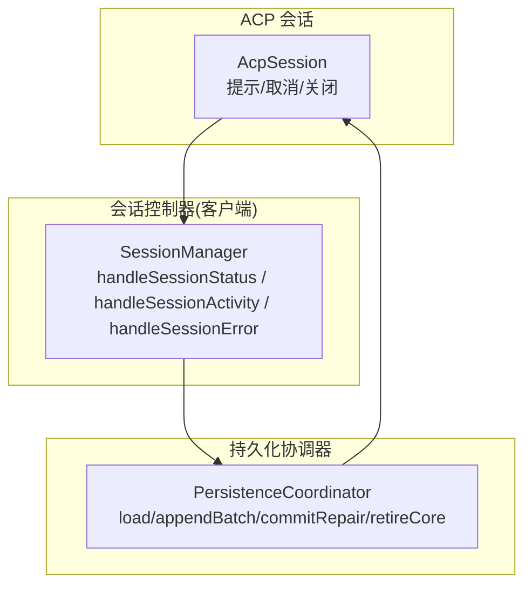
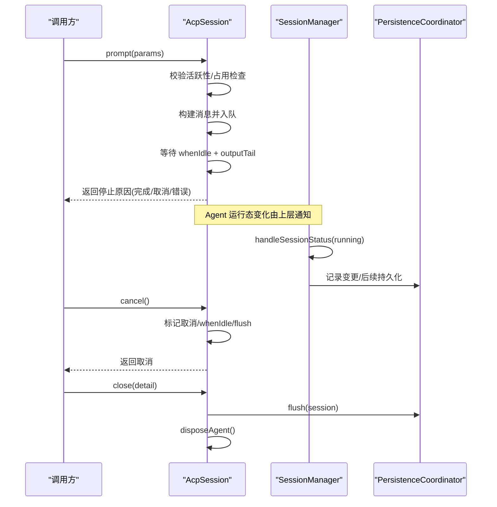
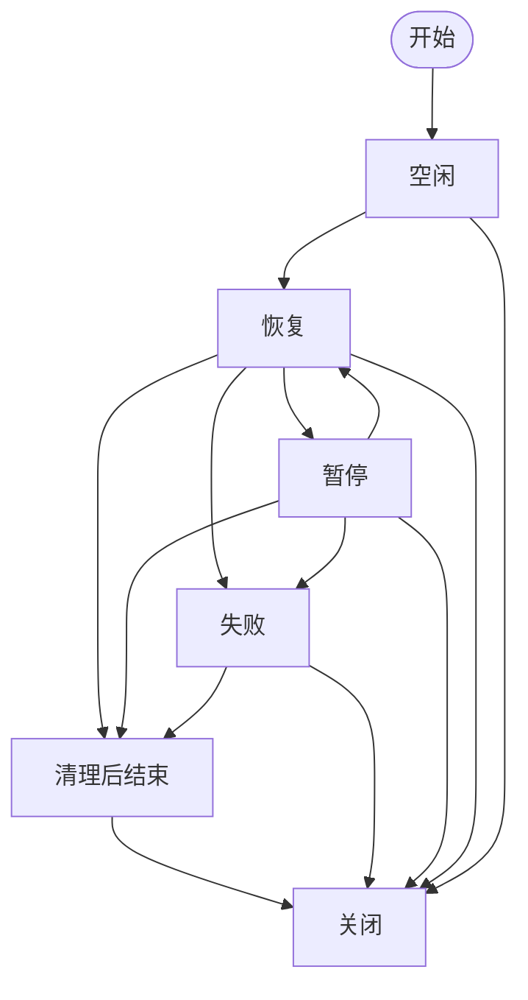
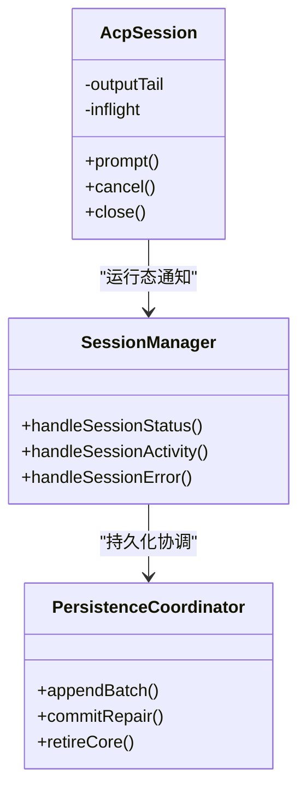

# 状态转换模型

<cite>
**本文引用的文件**
- [packages/acp/acp/src/session.ts](file://packages/acp/acp/src/session.ts)
- [packages/api/session-controller/src/client/sessions/manager.ts](file://packages/api/session-controller/src/client/sessions/manager.ts)
- [packages/session/session-persistence/src/coordinator.ts](file://packages/session/session-persistence/src/coordinator.ts)
</cite>

## 目录
1. [简介](#简介)
2. [项目结构](#项目结构)
3. [核心组件](#核心组件)
4. [架构总览](#架构总览)
5. [详细组件分析](#详细组件分析)
6. [依赖关系分析](#依赖关系分析)
7. [性能考量](#性能考量)
8. [故障排查指南](#故障排查指南)
9. [结论](#结论)
10. [附录：自定义状态转换示例](#附录自定义状态转换示例)

## 简介
本文件为 DeepSeek Harness 的会话状态转换模型提供系统化文档，聚焦于“空闲、运行中、暂停、完成、错误”等状态的定义与含义，明确合法迁移路径与非法操作阻止机制，并说明状态转换时的事件发布与副作用处理，确保一致性与数据完整性。同时给出可操作的实现指引，帮助你在现有基础上扩展或定制状态转换逻辑（如状态验证、转换钩子、持久化）。

## 项目结构
围绕会话生命周期与状态机，代码主要分布在以下模块：
- ACP 会话层：负责一次提示请求的生命周期编排、输出顺序投递、终止与关闭。
- 会话控制器客户端：维护会话列表与活动状态，响应 Agent 运行态变化。
- 持久化协调器：负责会话日志的加载、写入批处理、崩溃修复与回收。

图表来源
- [packages/acp/acp/src/session.ts:246-334](file://packages/acp/acp/src/session.ts#L246-L334)
- [packages/api/session-controller/src/client/sessions/manager.ts:769-796](file://packages/api/session-controller/src/client/sessions/manager.ts#L769-L796)
- [packages/session/session-persistence/src/coordinator.ts:1230-1260](file://packages/session/session-persistence/src/coordinator.ts#L1230-L1260)

章节来源
- [packages/acp/acp/src/session.ts:246-334](file://packages/acp/acp/src/session.ts#L246-L334)
- [packages/api/session-controller/src/client/sessions/manager.ts:769-796](file://packages/api/session-controller/src/client/sessions/manager.ts#L769-L796)
- [packages/session/session-persistence/src/coordinator.ts:1230-1260](file://packages/session/session-persistence/src/coordinator.ts#L1230-L1260)

## 核心组件
- AcpSession：封装一次 ACP 会话的创建、恢复、提示提交、取消、事件投影与关闭；维护“进行中”提示槽位与输出队列，保证有序投递与最终结算。
- SessionManager：维护会话列表与活动状态，接收 Agent 运行态变更并更新 UI/目录活动；暴露错误上报入口。
- PersistenceCoordinator：统一缓冲、序列化、采用、修复与回收；负责将事件批量追加到后端、在关闭时刷新与释放资源。

章节来源
- [packages/acp/acp/src/session.ts:98-172](file://packages/acp/acp/src/session.ts#L98-L172)
- [packages/api/session-controller/src/client/sessions/manager.ts:769-796](file://packages/api/session-controller/src/client/sessions/manager.ts#L769-L796)
- [packages/session/session-persistence/src/coordinator.ts:1230-1260](file://packages/session/session-persistence/src/coordinator.ts#L1230-L1260)

## 架构总览
下图展示从用户提示到会话结束的状态流转与关键交互点。

图表来源
- [packages/acp/acp/src/session.ts:246-334](file://packages/acp/acp/src/session.ts#L246-L334)
- [packages/acp/acp/src/session.ts:336-341](file://packages/acp/acp/src/session.ts#L336-L341)
- [packages/acp/acp/src/session.ts:431-471](file://packages/acp/acp/src/session.ts#L431-L471)
- [packages/api/session-controller/src/client/sessions/manager.ts:769-796](file://packages/api/session-controller/src/client/sessions/manager.ts#L769-L796)
- [packages/session/session-persistence/src/coordinator.ts:1230-1260](file://packages/session/session-persistence/src/coordinator.ts#L1230-L1260)

## 详细组件分析

### 状态定义与语义
- 空闲（idle）：无进行中的提示，Agent 处于就绪态。
- 运行中（running）：已提交提示且 Agent 正在执行工作。
- 暂停（paused）：被外部中断或主动暂停（例如用户取消），等待恢复或结束。
- 完成（completed）：一轮或多轮对话正常结束，返回明确的完成原因。
- 错误（error）：发生不可恢复错误，需上报并可能触发清理。

这些状态通过 AcpSession 的提示生命周期、取消与关闭流程，以及 SessionManager 的运行态通知共同体现。

章节来源
- [packages/acp/acp/src/session.ts:246-334](file://packages/acp/acp/src/session.ts#L246-L334)
- [packages/acp/acp/src/session.ts:336-341](file://packages/acp/acp/src/session.ts#L336-L341)
- [packages/acp/acp/src/session.ts:431-471](file://packages/acp/acp/src/session.ts#L431-L471)
- [packages/api/session-controller/src/client/sessions/manager.ts:769-796](file://packages/api/session-controller/src/client/sessions/manager.ts#L769-L796)

### 状态迁移规则与合法性
- 空闲 → 运行中：成功提交提示后进入运行中。
- 运行中 → 完成：当 turn/end 指示完成时结算。
- 运行中 → 暂停：收到取消信号或外部中断，进入暂停；若不再恢复则走向完成或错误。
- 运行中 → 错误：内部错误或输出投递失败导致错误结算。
- 任意状态 → 关闭：close 会强制取消、等待空闲、刷新持久化并释放资源。

非法操作阻止机制：
- 重复提示：同一会话仅允许一个进行中的提示，重复提交会被拒绝。
- 关闭中禁止新操作：会话进入关闭阶段后，任何新提示将被拒绝。
- 未排队即取消：若消息尚未入队，取消不会再次调用 Agent 取消。

章节来源
- [packages/acp/acp/src/session.ts:246-334](file://packages/acp/acp/src/session.ts#L246-L334)
- [packages/acp/acp/src/session.ts:473-484](file://packages/acp/acp/src/session.ts#L473-L484)

### 事件发布与副作用处理
- 输出顺序：所有 assistant/tool 相关更新通过 outputTail 串行投递，避免乱序。
- 错误隔离：单个更新投递失败不影响 Agent 继续执行，仅记录警告并在结算时反映。
- 持久化：关闭时先 flush 再释放资源，确保日志完整；协调器负责批写与崩溃修复。

章节来源
- [packages/acp/acp/src/session.ts:348-392](file://packages/acp/acp/src/session.ts#L348-L392)
- [packages/acp/acp/src/session.ts:431-471](file://packages/acp/acp/src/session.ts#L431-L471)
- [packages/session/session-persistence/src/coordinator.ts:1230-1260](file://packages/session/session-persistence/src/coordinator.ts#L1230-L1260)

### 状态机流程图（基于实际实现）

图表来源
- [packages/acp/acp/src/session.ts:246-334](file://packages/acp/acp/src/session.ts#L246-L334)
- [packages/acp/acp/src/session.ts:336-341](file://packages/acp/acp/src/session.ts#L336-L341)
- [packages/acp/acp/src/session.ts:431-471](file://packages/acp/acp/src/session.ts#L431-L471)

## 依赖关系分析
- AcpSession 依赖 Agent 的 followup/cancel/whenIdle 能力，并通过 outputTail 管理输出顺序。
- SessionManager 监听 Agent 运行态变化，更新会话列表活动与 UI。
- PersistenceCoordinator 提供统一的持久化抽象，协调批写、修复与回收。

图表来源
- [packages/acp/acp/src/session.ts:246-334](file://packages/acp/acp/src/session.ts#L246-L334)
- [packages/api/session-controller/src/client/sessions/manager.ts:769-796](file://packages/api/session-controller/src/client/sessions/manager.ts#L769-L796)
- [packages/session/session-persistence/src/coordinator.ts:1230-1260](file://packages/session/session-persistence/src/coordinator.ts#L1230-L1260)

章节来源
- [packages/acp/acp/src/session.ts:246-334](file://packages/acp/acp/src/session.ts#L246-L334)
- [packages/api/session-controller/src/client/sessions/manager.ts:769-796](file://packages/api/session-controller/src/client/sessions/manager.ts#L769-L796)
- [packages/session/session-persistence/src/coordinator.ts:1230-1260](file://packages/session/session-persistence/src/coordinator.ts#L1230-L1260)

## 性能考量
- 输出顺序与背压：outputTail 串行化输出，避免并发导致的乱序；必要时可通过批处理降低 I/O 压力。
- 批写策略：持久化协调器支持延迟批写，减少频繁落盘开销。
- 资源释放：关闭流程严格等待空闲与输出队列排空，避免竞态与资源泄漏。

[本节为通用指导，不直接分析具体文件]

## 故障排查指南
常见问题与定位要点：
- 提示被拒绝：检查是否已有进行中的提示或会话是否处于关闭中。
- 输出丢失或乱序：确认 outputTail 链是否被异常中断；查看日志中的投递失败警告。
- 持久化不一致：关注协调器的批写与修复流程，确保 flush 在关闭前完成。
- 错误传播：turn/end 的错误会在结算时转化为内部错误；输出投递失败也会在上层被捕获并报告。

章节来源
- [packages/acp/acp/src/session.ts:473-484](file://packages/acp/acp/src/session.ts#L473-L484)
- [packages/acp/acp/src/session.ts:348-392](file://packages/acp/acp/src/session.ts#L348-L392)
- [packages/session/session-persistence/src/coordinator.ts:1230-1260](file://packages/session/session-persistence/src/coordinator.ts#L1230-L1260)

## 结论
DeepSeek Harness 的会话状态机以 AcpSession 为核心，结合 SessionManager 的运行态管理与 PersistenceCoordinator 的持久化保障，实现了清晰、健壮且可扩展的状态转换模型。通过严格的迁移规则、有序的事件投递与完善的关闭流程，系统在一致性、可靠性与可观测性方面具备良好基础。

[本节为总结，不直接分析具体文件]

## 附录：自定义状态转换示例
以下示例展示如何在现有基础上扩展状态转换逻辑，包括状态验证、转换钩子与持久化。

- 状态验证
  - 在提示提交前增加业务校验（如权限、配额、上下文有效性），失败则提前拒绝。
  - 参考位置：提示入口与活跃性检查处。

- 转换钩子
  - 在进入运行中、暂停、完成、错误等状态时插入钩子，用于审计、指标上报或副作用触发。
  - 可在输出投递前后、whenIdle 等待前后、关闭流程中设置钩子。

- 持久化
  - 在状态变更时记录状态快照或审计事件，确保可回溯。
  - 使用协调器的 appendBatch 与 commitRepair 保证一致性。

- 示例步骤（概念性）
  1) 在提示入口处添加前置验证，失败返回无效参数错误。
  2) 在输出投递完成后记录“运行中”状态事件。
  3) 在 whenIdle 与 outputTail 完成后记录“完成/错误”状态事件。
  4) 在 close 流程中确保 flush 成功后再释放资源。

章节来源
- [packages/acp/acp/src/session.ts:246-334](file://packages/acp/acp/src/session.ts#L246-L334)
- [packages/acp/acp/src/session.ts:348-392](file://packages/acp/acp/src/session.ts#L348-L392)
- [packages/acp/acp/src/session.ts:431-471](file://packages/acp/acp/src/session.ts#L431-L471)
- [packages/session/session-persistence/src/coordinator.ts:1230-1260](file://packages/session/session-persistence/src/coordinator.ts#L1230-L1260)