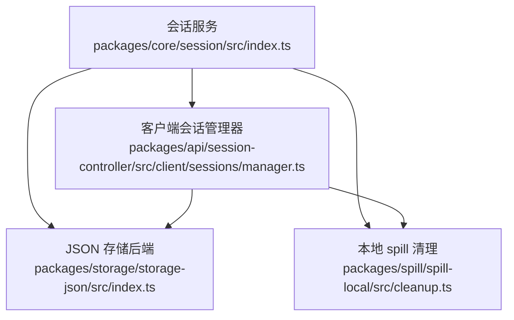
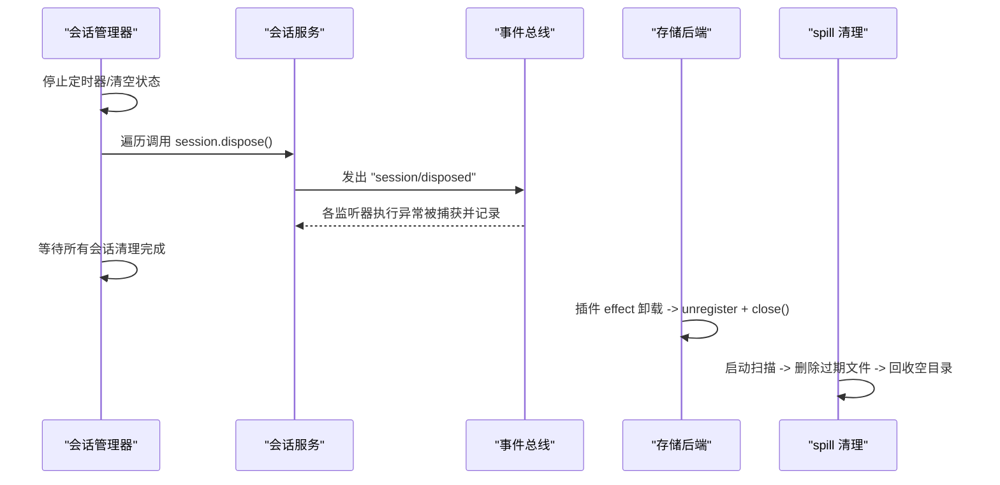
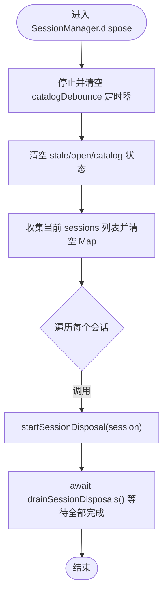
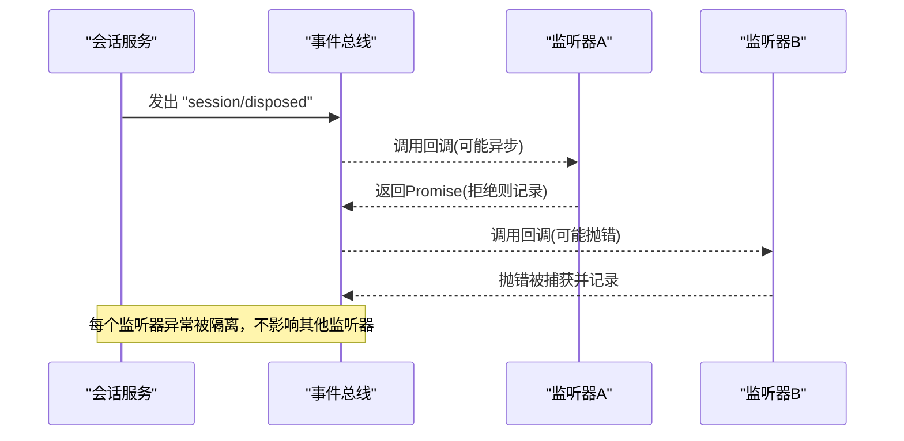
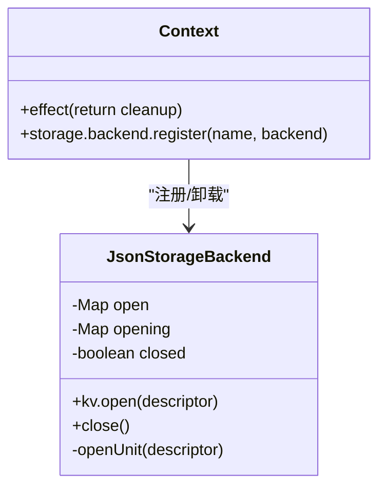
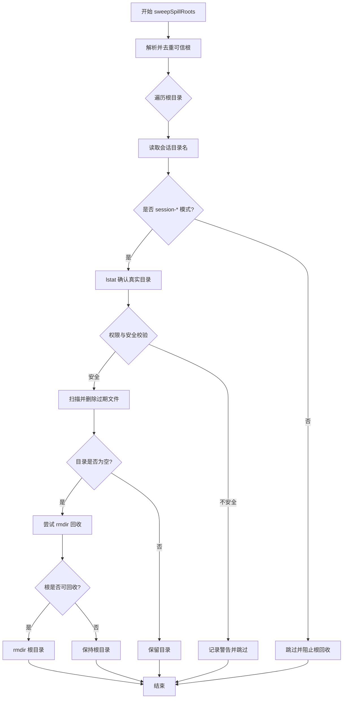
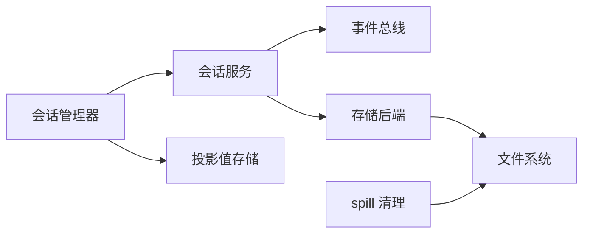

# 会话清理与资源释放

<cite>
**本文引用的文件**
- [packages/core/session/src/index.ts](file://packages/core/session/src/index.ts)
- [packages/api/session-controller/src/client/sessions/manager.ts](file://packages/api/session-controller/src/client/sessions/manager.ts)
- [packages/storage/storage-json/src/index.ts](file://packages/storage/storage-json/src/index.ts)
- [packages/spill/spill-local/src/cleanup.ts](file://packages/spill/spill-local/src/cleanup.ts)
</cite>

## 目录
1. [简介](#简介)
2. [项目结构](#项目结构)
3. [核心组件](#核心组件)
4. [架构总览](#架构总览)
5. [详细组件分析](#详细组件分析)
6. [依赖关系分析](#依赖关系分析)
7. [性能考量](#性能考量)
8. [故障排查指南](#故障排查指南)
9. [结论](#结论)
10. [附录](#附录)

## 简介
本文聚焦 DeepSeek Harness 的“会话销毁与资源释放”机制，围绕以下目标展开：
- 会话销毁生命周期：解释 dispose() 调用时机、顺序与幂等性。
- 事件发布钩子管理：监听器移除、事件总线解绑、异常隔离与回滚语义。
- 存储后端清理：持久化数据关闭、临时文件（spill）扫描与过期删除。
- 内存资源释放：事件日志、缓存投影、定时器与并发清理。
- 异常处理与回滚：清理失败时的保护策略、泄漏防护与可观测性。

## 项目结构
与会话清理相关的代码主要分布在四个模块：
- 会话服务与事件系统：packages/core/session/src/index.ts
- 客户端会话管理器：packages/api/session-controller/src/client/sessions/manager.ts
- JSON 存储后端：packages/storage/storage-json/src/index.ts
- 本地溢出（spill）启动清理：packages/spill/spill-local/src/cleanup.ts

图表来源
- [packages/core/session/src/index.ts:1-87](file://packages/core/session/src/index.ts#L1-L87)
- [packages/api/session-controller/src/client/sessions/manager.ts:248-277](file://packages/api/session-controller/src/client/sessions/manager.ts#L248-L277)
- [packages/storage/storage-json/src/index.ts:104-119](file://packages/storage/storage-json/src/index.ts#L104-L119)
- [packages/spill/spill-local/src/cleanup.ts:274-362](file://packages/spill/spill-local/src/cleanup.ts#L274-L362)

章节来源
- [packages/core/session/src/index.ts:1-87](file://packages/core/session/src/index.ts#L1-L87)
- [packages/api/session-controller/src/client/sessions/manager.ts:248-277](file://packages/api/session-controller/src/client/sessions/manager.ts#L248-L277)
- [packages/storage/storage-json/src/index.ts:104-119](file://packages/storage/storage-json/src/index.ts#L104-L119)
- [packages/spill/spill-local/src/cleanup.ts:274-362](file://packages/spill/spill-local/src/cleanup.ts#L274-L362)

## 核心组件
- 会话服务（SessionStore/Session）：维护事件溯源日志、派生消息缓存、表面投影；提供 session/created、session/event、session/flush、session/disposed 等事件。
- 客户端会话管理器（SessionManager）：维护会话实例集合、定时器、队列与投影值存储；集中调度会话 drop/dispose 并等待所有清理完成。
- JSON 存储后端（JsonStorageBackend）：注册/注销 KV 单元，close() 时关闭所有打开的单元；插件 effect 在卸载时自动执行 unregister + close。
- 本地 spill 清理（cleanup）：启动时扫描过期文件、安全校验根目录与会话目录、删除过期文件并在空目录时回收根目录；全部操作为 best-effort，不抛出异常。

章节来源
- [packages/core/session/src/index.ts:423-756](file://packages/core/session/src/index.ts#L423-L756)
- [packages/api/session-controller/src/client/sessions/manager.ts:92-277](file://packages/api/session-controller/src/client/sessions/manager.ts#L92-L277)
- [packages/storage/storage-json/src/index.ts:38-119](file://packages/storage/storage-json/src/index.ts#L38-L119)
- [packages/spill/spill-local/src/cleanup.ts:158-432](file://packages/spill/spill-local/src/cleanup.ts#L158-L432)

## 架构总览
会话销毁从上层管理器触发，逐层向下释放：
- SessionManager.dispose() 停止定时器、清空状态、遍历所有会话实例调用其 dispose()，并等待所有清理 Promise 完成。
- 会话服务在销毁阶段发出 session/disposed 事件，供持久化、遥测等订阅者收尾。
- 存储后端在插件 effect 卸载时执行 unregister 与 backend.close()，确保文件句柄释放。
- spill 清理在进程启动或 fiber 拥有作用域内运行，按策略删除过期文件并回收目录。

图表来源
- [packages/api/session-controller/src/client/sessions/manager.ts:248-277](file://packages/api/session-controller/src/client/sessions/manager.ts#L248-L277)
- [packages/core/session/src/index.ts:996-1005](file://packages/core/session/src/index.ts#L996-L1005)
- [packages/storage/storage-json/src/index.ts:109-119](file://packages/storage/storage-json/src/index.ts#L109-L119)
- [packages/spill/spill-local/src/cleanup.ts:274-362](file://packages/spill/spill-local/src/cleanup.ts#L274-L362)

## 详细组件分析

### 会话销毁生命周期与 dispose() 调用时机
- 调用时机
  - 当会话不再需要时，由 SessionManager.drop() 或 dispose() 触发。
  - SessionManager.dispose() 会先停止所有 catalogDebounce 定时器，再对每个会话实例调用 startSessionDisposal(session)，并等待 drainSessionDisposals() 完成。
- 清理顺序
  - 先释放管理器级资源（定时器、缓存、队列）。
  - 再并行发起各会话的 dispose()，并通过 allSettled 等待全部完成。
  - 会话服务内部在 append 与创建/销毁路径中通过事件钩子通知外部订阅者，确保持久化与观测侧同步。
- 幂等性与安全性
  - 管理器级别的 clear() 与 Set 去重保证重复调用不会导致二次释放。
  - 会话事件监听器的异常被捕获并记录，避免影响其他监听器与主流程。

图表来源
- [packages/api/session-controller/src/client/sessions/manager.ts:248-277](file://packages/api/session-controller/src/client/sessions/manager.ts#L248-L277)

章节来源
- [packages/api/session-controller/src/client/sessions/manager.ts:242-277](file://packages/api/session-controller/src/client/sessions/manager.ts#L242-L277)

### 事件发布钩子的管理机制
- 事件类型
  - session/created：会话创建公告，支持同步拒绝与配对释放。
  - session/event：追加后 fire-and-forget 的事件流，观察者失败不影响提交。
  - session/flush：可等待的并行持久化检查点。
  - session/disposed：会话离开存储时发出一次，用于最终清理。
- 监听器隔离
  - 使用 collectSessionCallbacks 获取快照，invokeContainedSessionObservers 逐个调用并捕获异常，将错误以 warn 形式记录。
  - 对于 session/created 的返回 Promise 拒绝，仅记录而不回滚已发生的同步边界。
- 解绑与移除
  - 会话销毁时发出 session/disposed，允许持久化与观测侧进行解绑与收尾。
  - 客户端事件总线测试表明，移除监听器遵循 Node 行为，支持按名称移除与 off 方法。

图表来源
- [packages/core/session/src/index.ts:996-1005](file://packages/core/session/src/index.ts#L996-L1005)
- [packages/core/session/src/index.ts:374-397](file://packages/core/session/src/index.ts#L374-L397)

章节来源
- [packages/core/session/src/index.ts:42-86](file://packages/core/session/src/index.ts#L42-L86)
- [packages/core/session/src/index.ts:374-397](file://packages/core/session/src/index.ts#L374-L397)
- [packages/core/session/src/index.ts:996-1005](file://packages/core/session/src/index.ts#L996-L1005)

### 存储后端的清理过程
- 注册与卸载
  - apply(ctx, config) 注册 json 后端到存储中心，并通过 ctx.effect 返回清理函数：unregister + backend.close()。
- 关闭流程
  - JsonStorageBackend.close() 标记 closed，等待所有 in-flight opening 完成，然后关闭所有 open 的 KvUnit。
  - 若 open 期间后端被关闭，新打开的单元会被立即关闭并抛出 StorageError('closed')。
- 磁盘操作
  - 存储后端负责文件句柄与单元关闭；spill 清理负责过期文件与目录回收。

图表来源
- [packages/storage/storage-json/src/index.ts:38-119](file://packages/storage/storage-json/src/index.ts#L38-L119)

章节来源
- [packages/storage/storage-json/src/index.ts:104-119](file://packages/storage/storage-json/src/index.ts#L104-L119)
- [packages/storage/storage-json/src/index.ts:38-90](file://packages/storage/storage-json/src/index.ts#L38-L90)

### 本地 spill 清理（磁盘操作）
- 启动扫描
  - sweepSpillRoots(options) 接收 roots、cutoffMs 与 warn 回调，遍历受信任根与会话目录，删除过期文件。
- 安全策略
  - resolveRoot 校验目录权限与祖先保护，防止跨用户替换风险。
  - 仅匹配精确模式的 session-* 目录，避免误删无关条目。
  - unlinkIdempotent 将 ENOENT 视为成功，容忍并发竞争。
- 回收策略
  - 会话目录为空时尝试 rmdir 回收；发现默认根（dsh-spill-<6字符>）且为空时一并回收。
  - 所有 IO 失败均被包含并记录，永不向调用方抛出异常。

图表来源
- [packages/spill/spill-local/src/cleanup.ts:274-362](file://packages/spill/spill-local/src/cleanup.ts#L274-L362)
- [packages/spill/spill-local/src/cleanup.ts:158-208](file://packages/spill/spill-local/src/cleanup.ts#L158-L208)
- [packages/spill/spill-local/src/cleanup.ts:379-432](file://packages/spill/spill-local/src/cleanup.ts#L379-L432)

章节来源
- [packages/spill/spill-local/src/cleanup.ts:158-432](file://packages/spill/spill-local/src/cleanup.ts#L158-L432)

### 内存资源释放策略
- 事件日志与派生缓存
  - Session.append() 将事件加入不可变日志，并更新 eventsSnapshot；deriveMessages() 基于 surface 节点增量构建消息历史，避免重复计算。
  - 会话销毁时通过事件钩子通知持久化与观测侧，释放相关引用。
- 定时器与队列
  - SessionManager.dispose() 停止 catalogDebounce 定时器，清空 catalogStale/openCatalogs，避免悬挂定时任务。
  - 队列与作业映射在会话移除时清理，减少内存占用。
- 并发清理
  - 使用 Promise.allSettled 等待所有会话清理完成，确保无悬挂 Promise。
  - 存储后端 close() 等待所有 in-flight opening 完成后再关闭单元，避免竞态。

章节来源
- [packages/core/session/src/index.ts:548-756](file://packages/core/session/src/index.ts#L548-L756)
- [packages/api/session-controller/src/client/sessions/manager.ts:248-277](file://packages/api/session-controller/src/client/sessions/manager.ts#L248-L277)
- [packages/storage/storage-json/src/index.ts:82-90](file://packages/storage/storage-json/src/index.ts#L82-L90)

## 依赖关系分析
- 会话服务依赖事件总线与 scope 过滤，确保监听器仅在合适范围内收到事件。
- 客户端管理器依赖远程会话接口与投影值存储，协调 UI 与宿主状态。
- 存储后端依赖文件系统与原子写入策略，确保数据一致性。
- spill 清理依赖操作系统 API 与严格的安全策略，确保只清理受信任目录。

图表来源
- [packages/core/session/src/index.ts:42-86](file://packages/core/session/src/index.ts#L42-L86)
- [packages/api/session-controller/src/client/sessions/manager.ts:92-143](file://packages/api/session-controller/src/client/sessions/manager.ts#L92-L143)
- [packages/storage/storage-json/src/index.ts:38-119](file://packages/storage/storage-json/src/index.ts#L38-L119)
- [packages/spill/spill-local/src/cleanup.ts:274-362](file://packages/spill/spill-local/src/cleanup.ts#L274-L362)

章节来源
- [packages/core/session/src/index.ts:42-86](file://packages/core/session/src/index.ts#L42-L86)
- [packages/api/session-controller/src/client/sessions/manager.ts:92-143](file://packages/api/session-controller/src/client/sessions/manager.ts#L92-L143)
- [packages/storage/storage-json/src/index.ts:38-119](file://packages/storage/storage-json/src/index.ts#L38-L119)
- [packages/spill/spill-local/src/cleanup.ts:274-362](file://packages/spill/spill-local/src/cleanup.ts#L274-L362)

## 性能考量
- 事件追加路径非阻塞：append() 不等待 I/O，持久化通过 session/flush 异步落盘。
- 派生消息缓存：deriveMessages() 增量构建，避免全量重建。
- 清理幂等与最佳努力：spill 清理与存储关闭均容忍并发竞争，避免阻塞主流程。
- 定时器与批量刷新：SessionManager 使用 debounce 与 interval 控制刷新频率，降低频繁 I/O。

[本节为通用指导，无需特定文件引用]

## 故障排查指南
- 事件监听器异常
  - 现象：session/disposed 或 session/event 监听器抛错或被拒绝。
  - 处理：框架捕获并记录警告，不中断其他监听器；检查监听器实现中的异步拒绝与同步抛错。
- 存储后端关闭失败
  - 现象：backend.close() 期间有 in-flight open 未完成。
  - 处理：等待 allSettled 完成后再次关闭；检查是否有未释放的单元句柄。
- spill 清理失败
  - 现象：删除文件或目录时报错（如 ENOTEMPTY、ENOENT）。
  - 处理：这些错误被视为并发竞争或权限问题，已被包含并记录；检查目录权限与是否存在并发写入。
- 会话管理器清理挂起
  - 现象：dispose() 长时间未完成。
  - 处理：检查是否有悬挂定时器或未完成的会话清理 Promise；确认所有会话实例均已正确 drop。

章节来源
- [packages/core/session/src/index.ts:996-1005](file://packages/core/session/src/index.ts#L996-L1005)
- [packages/storage/storage-json/src/index.ts:82-90](file://packages/storage/storage-json/src/index.ts#L82-L90)
- [packages/spill/spill-local/src/cleanup.ts:196-208](file://packages/spill/spill-local/src/cleanup.ts#L196-L208)
- [packages/api/session-controller/src/client/sessions/manager.ts:248-277](file://packages/api/session-controller/src/client/sessions/manager.ts#L248-L277)

## 结论
DeepSeek Harness 的会话清理与资源释放机制通过分层设计实现了高可靠性与可观测性：
- 会话管理器集中调度清理，确保定时器与状态一致释放。
- 事件系统提供安全的发布钩子，异常隔离与回滚语义明确。
- 存储后端与 spill 清理分别负责句柄释放与磁盘回收，采用 best-effort 策略避免阻塞。
- 内存资源通过缓存与增量构建优化，配合并发清理保证性能与稳定性。

[本节为总结，无需特定文件引用]

## 附录
- 关键流程参考
  - 会话管理器 dispose：[packages/api/session-controller/src/client/sessions/manager.ts:248-277](file://packages/api/session-controller/src/client/sessions/manager.ts#L248-L277)
  - 会话事件发布与销毁：[packages/core/session/src/index.ts:42-86](file://packages/core/session/src/index.ts#L42-L86), [packages/core/session/src/index.ts:996-1005](file://packages/core/session/src/index.ts#L996-L1005)
  - 存储后端注册与关闭：[packages/storage/storage-json/src/index.ts:104-119](file://packages/storage/storage-json/src/index.ts#L104-L119), [packages/storage/storage-json/src/index.ts:82-90](file://packages/storage/storage-json/src/index.ts#L82-L90)
  - spill 清理与回收：[packages/spill/spill-local/src/cleanup.ts:274-362](file://packages/spill/spill-local/src/cleanup.ts#L274-L362), [packages/spill/spill-local/src/cleanup.ts:379-432](file://packages/spill/spill-local/src/cleanup.ts#L379-L432)

[本节为附录，无需特定文件引用]