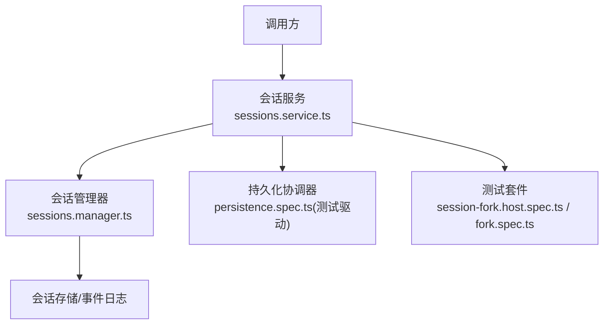
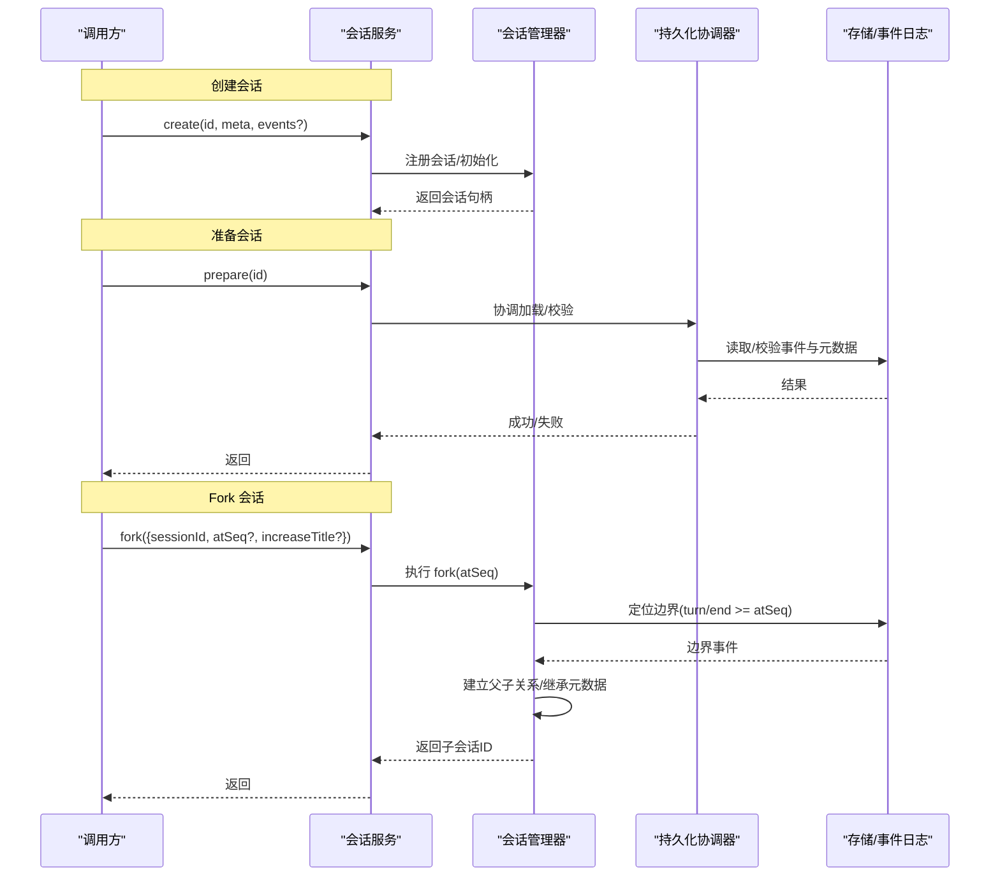
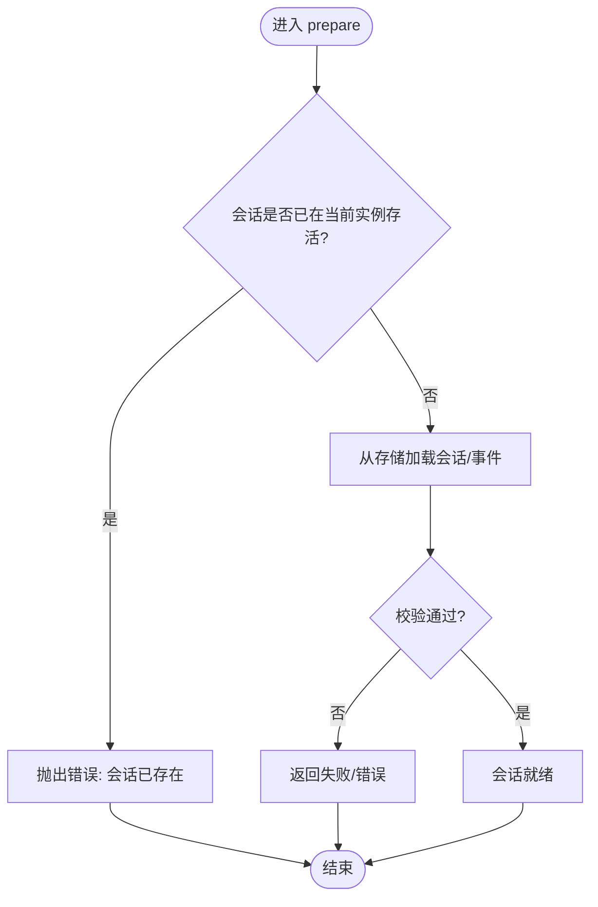
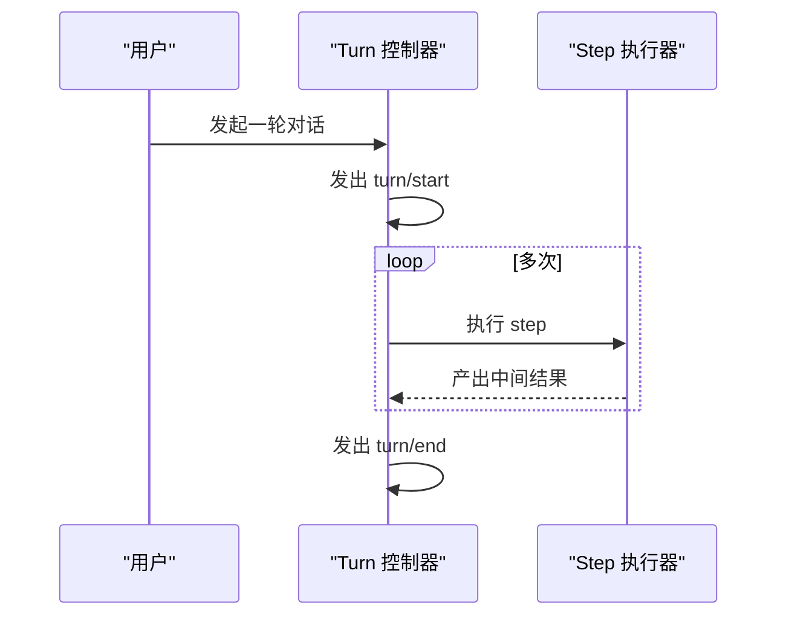
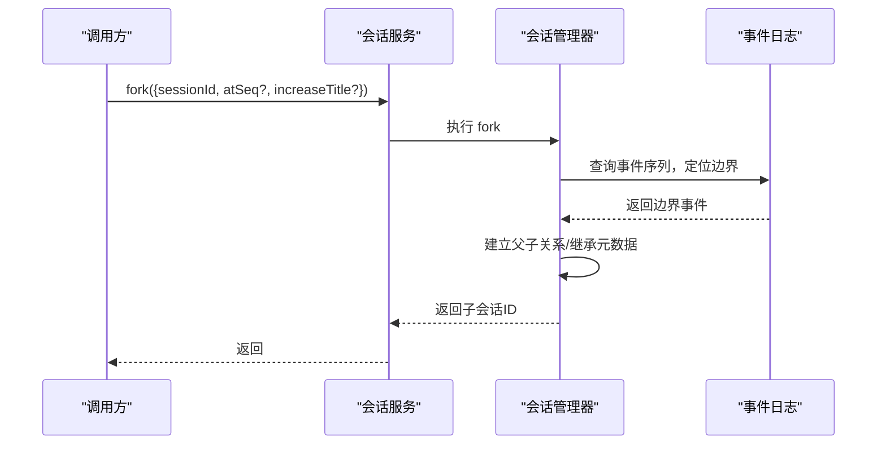
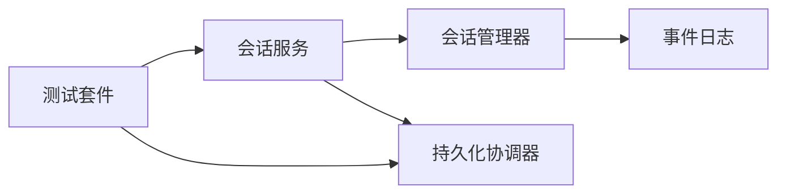

# 会话生命周期管理

<cite>
**本文引用的文件**
- [packages/api/session-controller/src/client/sessions/service.ts](file://packages/api/session-controller/src/client/sessions/service.ts)
- [packages/api/session-controller/tests/session-fork.host.spec.ts](file://packages/api/session-controller/tests/session-fork.host.spec.ts)
- [packages/core/session/tests/fork.spec.ts](file://packages/core/session/tests/fork.spec.ts)
- [packages/session/session-persistence/tests/persistence.spec.ts](file://packages/session/session-persistence/tests/persistence.spec.ts)
</cite>

## 目录
1. [简介](#简介)
2. [项目结构](#项目结构)
3. [核心组件](#核心组件)
4. [架构总览](#架构总览)
5. [详细组件分析](#详细组件分析)
6. [依赖关系分析](#依赖关系分析)
7. [性能考量](#性能考量)
8. [故障排查指南](#故障排查指南)
9. [结论](#结论)
10. [附录](#附录)

## 简介
本文件聚焦 DeepSeek Harness 的“会话生命周期管理”，围绕以下目标展开：
- 解释会话创建流程，明确 create() 与 prepare() 的区别与适用场景。
- 说明会话状态转换：turn 的开始/结束、step 的执行流程。
- 阐述 fork 机制：边界选择、父子关系建立、元数据继承。
- 介绍清理与资源释放：事件发布钩子管理与存储后端清理。
- 提供可操作的代码示例路径，展示如何正确管理会话生命周期并处理异常。

## 项目结构
与会话生命周期相关的核心实现集中在以下模块：
- API 层会话服务：负责对外暴露会话操作（创建、准备、fork 等），协调底层管理器。
- 持久化协调器：负责在准备阶段与存储后端交互，确保一致性。
- 测试用例：覆盖 fork 边界、错误分支、以及 prepare 并发/竞态场景。

图表来源
- [packages/api/session-controller/src/client/sessions/service.ts:413-439](file://packages/api/session-controller/src/client/sessions/service.ts#L413-L439)
- [packages/session/session-persistence/tests/persistence.spec.ts:558-581](file://packages/session/session-persistence/tests/persistence.spec.ts#L558-L581)

章节来源
- [packages/api/session-controller/src/client/sessions/service.ts:413-439](file://packages/api/session-controller/src/client/sessions/service.ts#L413-L439)
- [packages/session/session-persistence/tests/persistence.spec.ts:558-581](file://packages/session/session-persistence/tests/persistence.spec.ts#L558-L581)

## 核心组件
- 会话服务（ClientSessions）：提供 create、prepare、fork 等能力；fork 支持按事件序列号锚定切分点，并可递增继承标题。
- 持久化协调器（PersistenceCoordinator）：在 prepare 过程中保证“本地已存在”与“从存储恢复”的一致性，避免重复或冲突。
- 会话管理器（SessionManager）：由服务委托执行具体 fork 逻辑，包括边界选择、父子关系建立、元数据继承。
- 测试断言：验证 fork 的边界行为、错误码、以及 prepare 的竞态保护。

章节来源
- [packages/api/session-controller/src/client/sessions/service.ts:413-439](file://packages/api/session-controller/src/client/sessions/service.ts#L413-L439)
- [packages/session/session-persistence/tests/persistence.spec.ts:558-581](file://packages/session/session-persistence/tests/persistence.spec.ts#L558-L581)

## 架构总览
下图展示了会话创建、准备与 fork 的整体协作关系，以及关键数据流。

图表来源
- [packages/api/session-controller/src/client/sessions/service.ts:413-439](file://packages/api/session-controller/src/client/sessions/service.ts#L413-L439)
- [packages/session/session-persistence/tests/persistence.spec.ts:558-581](file://packages/session/session-persistence/tests/persistence.spec.ts#L558-L581)

## 详细组件分析

### 会话创建：create() 与 prepare() 的区别与使用场景
- create()
  - 用途：在内存中创建新会话，可选附带初始事件与元数据。适用于全新对话、测试构造、或基于已有快照快速重建。
  - 特点：立即生效，不依赖存储后端；适合本地构建与回放。
- prepare()
  - 用途：将“待准备”的会话与持久化状态对齐，确保其可被后续操作安全使用。
  - 特点：会访问存储后端进行校验/加载；若会话已在运行实例中存在，会拒绝重复准备以避免冲突。

图表来源
- [packages/session/session-persistence/tests/persistence.spec.ts:558-581](file://packages/session/session-persistence/tests/persistence.spec.ts#L558-L581)

章节来源
- [packages/session/session-persistence/tests/persistence.spec.ts:558-581](file://packages/session/session-persistence/tests/persistence.spec.ts#L558-L581)

### 会话状态转换：turn 的开始/结束与 step 执行
- turn/start 与 turn/end
  - 表示一次用户交互到模型响应的完整回合。fork 的边界通常选择在“已完成回合”的 turn/end 处，以保证语义完整性。
- step
  - 表示 turn 内部的一次原子执行单元（如工具调用、消息生成等）。多个 step 组成一个 turn。
- 典型流程
  - turn/start → 若干 step → turn/end
  - fork 时以 atSeq 锚定，找到首个 turn/end 且 seq ≥ atSeq 的位置作为切分点。

图表来源
- [packages/api/session-controller/tests/session-fork.host.spec.ts:87-101](file://packages/api/session-controller/tests/session-fork.host.spec.ts#L87-L101)

章节来源
- [packages/api/session-controller/tests/session-fork.host.spec.ts:87-101](file://packages/api/session-controller/tests/session-fork.host.spec.ts#L87-L101)

### Fork 机制：边界选择、父子关系与元数据继承
- 边界选择
  - 通过 atSeq 指定锚点，系统定位“首个 turn/end 且 seq ≥ atSeq”的事件作为切分边界，确保只复制已完成的上下文。
- 父子关系建立
  - 子会话记录父会话 ID，形成 lineage，便于追溯与审计。
- 元数据继承
  - 工作目录 cwd、标题 title 等元数据可继承；支持在 fork 时递增标题以避免冲突。

图表来源
- [packages/api/session-controller/src/client/sessions/service.ts:413-439](file://packages/api/session-controller/src/client/sessions/service.ts#L413-L439)
- [packages/api/session-controller/tests/session-fork.host.spec.ts:87-101](file://packages/api/session-controller/tests/session-fork.host.spec.ts#L87-L101)

章节来源
- [packages/api/session-controller/src/client/sessions/service.ts:413-439](file://packages/api/session-controller/src/client/sessions/service.ts#L413-L439)
- [packages/api/session-controller/tests/session-fork.host.spec.ts:87-101](file://packages/api/session-controller/tests/session-fork.host.spec.ts#L87-L101)

### 清理与资源释放：事件钩子与存储后端
- 事件发布钩子
  - 会话生命周期内会发布 turn/start、user/message、turn/end、session/end-seed 等事件，供订阅者消费。
- 存储后端清理
  - 会话关闭后应释放相关资源，避免泄漏；在 fork 场景中，子会话拥有独立的事件流与元数据空间。
- 最佳实践
  - 在 turn/end 之后再进行 fork，确保边界稳定。
  - 对 prepare 的竞态进行防御：若会话已在当前实例存活，应拒绝重复准备。

章节来源
- [packages/api/session-controller/tests/session-fork.host.spec.ts:87-101](file://packages/api/session-controller/tests/session-fork.host.spec.ts#L87-L101)
- [packages/session/session-persistence/tests/persistence.spec.ts:558-581](file://packages/session/session-persistence/tests/persistence.spec.ts#L558-L581)

### 异常与错误处理
- 未知会话 ID
  - 当 fork 的目标会话不存在时，抛出“会话未找到”错误。
- 非活跃实例
  - 当传入的 Session 对象并非当前实例中的“活实例”时，抛出“非活实例”错误。
- 重复准备
  - 当 prepare 发现会话已在当前实例存活时，拒绝重复准备，避免状态不一致。

章节来源
- [packages/core/session/tests/fork.spec.ts:211-233](file://packages/core/session/tests/fork.spec.ts#L211-L233)
- [packages/session/session-persistence/tests/persistence.spec.ts:558-581](file://packages/session/session-persistence/tests/persistence.spec.ts#L558-L581)

## 依赖关系分析
- 会话服务依赖会话管理器执行 fork，并在 prepare 阶段依赖持久化协调器。
- 测试用例覆盖 fork 的边界与错误分支，以及 prepare 的竞态保护。
- 事件日志为 fork 的边界选择提供依据，确保语义完整性。

图表来源
- [packages/api/session-controller/src/client/sessions/service.ts:413-439](file://packages/api/session-controller/src/client/sessions/service.ts#L413-L439)
- [packages/session/session-persistence/tests/persistence.spec.ts:558-581](file://packages/session/session-persistence/tests/persistence.spec.ts#L558-L581)

章节来源
- [packages/api/session-controller/src/client/sessions/service.ts:413-439](file://packages/api/session-controller/src/client/sessions/service.ts#L413-L439)
- [packages/session/session-persistence/tests/persistence.spec.ts:558-581](file://packages/session/session-persistence/tests/persistence.spec.ts#L558-L581)

## 性能考量
- 边界选择复杂度
  - 以 atSeq 为锚点定位 turn/end 的事件，时间复杂度与事件日志长度相关；建议对高频 fork 场景考虑索引或缓存策略。
- 事件流大小
  - 大会话的长事件流会增加 fork 成本；可通过压缩、归档或分段策略降低开销。
- 并发准备
  - prepare 需避免重复加载；利用“已存在即拒绝”的策略减少冗余 I/O。

[本节为通用指导，不直接分析具体文件]

## 故障排查指南
- 现象：fork 报错“会话未找到”
  - 检查传入的 sessionId 是否存在于当前实例。
  - 参考：[packages/core/session/tests/fork.spec.ts:211-233](file://packages/core/session/tests/fork.spec.ts#L211-L233)
- 现象：fork 报错“非活实例”
  - 确认传入的 Session 对象是否为当前实例中的活实例。
  - 参考：[packages/core/session/tests/fork.spec.ts:211-233](file://packages/core/session/tests/fork.spec.ts#L211-L233)
- 现象：prepare 失败
  - 检查会话是否已在当前实例存活；若是，应改为直接使用而非再次准备。
  - 参考：[packages/session/session-persistence/tests/persistence.spec.ts:558-581](file://packages/session/session-persistence/tests/persistence.spec.ts#L558-L581)
- 现象：fork 边界不符合预期
  - 调整 atSeq，确保落在已完成回合的 turn/end 附近；观察事件序列以确认切分点。
  - 参考：[packages/api/session-controller/tests/session-fork.host.spec.ts:87-101](file://packages/api/session-controller/tests/session-fork.host.spec.ts#L87-L101)

章节来源
- [packages/core/session/tests/fork.spec.ts:211-233](file://packages/core/session/tests/fork.spec.ts#L211-L233)
- [packages/session/session-persistence/tests/persistence.spec.ts:558-581](file://packages/session/session-persistence/tests/persistence.spec.ts#L558-L581)
- [packages/api/session-controller/tests/session-fork.host.spec.ts:87-101](file://packages/api/session-controller/tests/session-fork.host.spec.ts#L87-L101)

## 结论
- create() 用于即时创建新会话；prepare() 用于将待准备会话与存储对齐，二者职责清晰。
- turn/start→step→turn/end 构成基本执行单元；fork 以 atSeq 锚定至已完成回合的 turn/end，保证语义一致。
- fork 支持父子关系与元数据继承，配合事件日志可实现精确回溯与分支。
- 清理与释放需关注事件钩子与存储后端；测试覆盖了常见异常路径，可作为排错依据。

[本节为总结性内容，不直接分析具体文件]

## 附录
- 推荐实践
  - 在 turn/end 之后进行 fork，避免截断未完成回合。
  - 对 prepare 做幂等保护：若会话已存在则跳过。
  - 合理设置 atSeq，结合事件日志定位期望边界。
- 参考路径
  - 会话服务 fork 接口定义与参数说明：[packages/api/session-controller/src/client/sessions/service.ts:413-439](file://packages/api/session-controller/src/client/sessions/service.ts#L413-L439)
  - fork 边界与父子关系验证：[packages/api/session-controller/tests/session-fork.host.spec.ts:87-101](file://packages/api/session-controller/tests/session-fork.host.spec.ts#L87-L101)
  - prepare 竞态保护：[packages/session/session-persistence/tests/persistence.spec.ts:558-581](file://packages/session/session-persistence/tests/persistence.spec.ts#L558-L581)
  - fork 错误分支：[packages/core/session/tests/fork.spec.ts:211-233](file://packages/core/session/tests/fork.spec.ts#L211-L233)