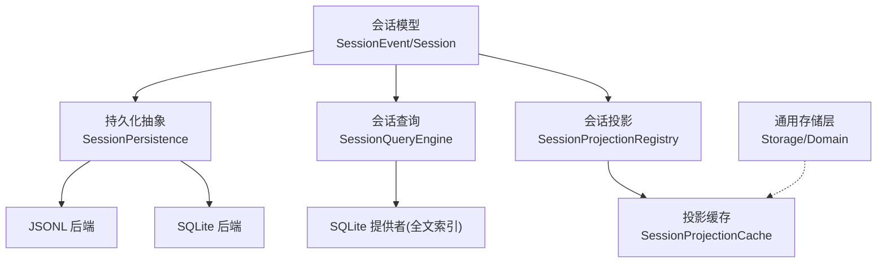
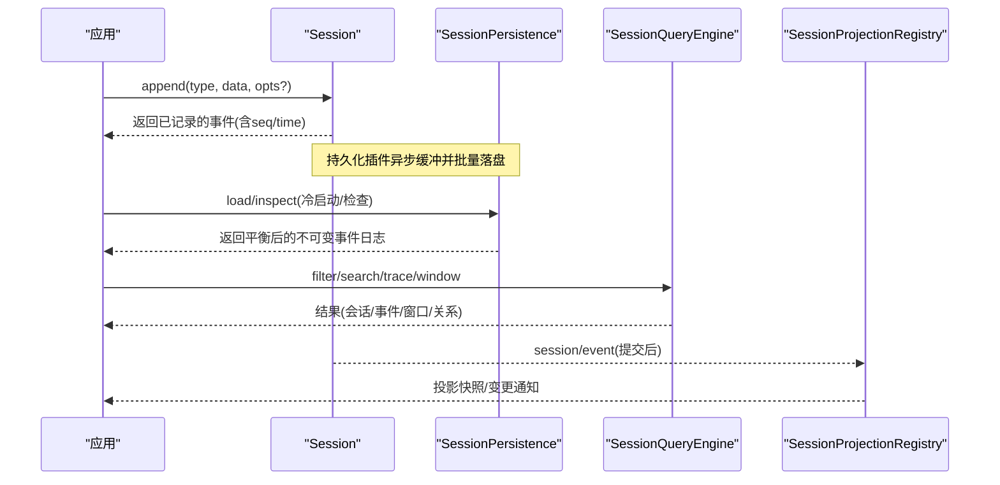
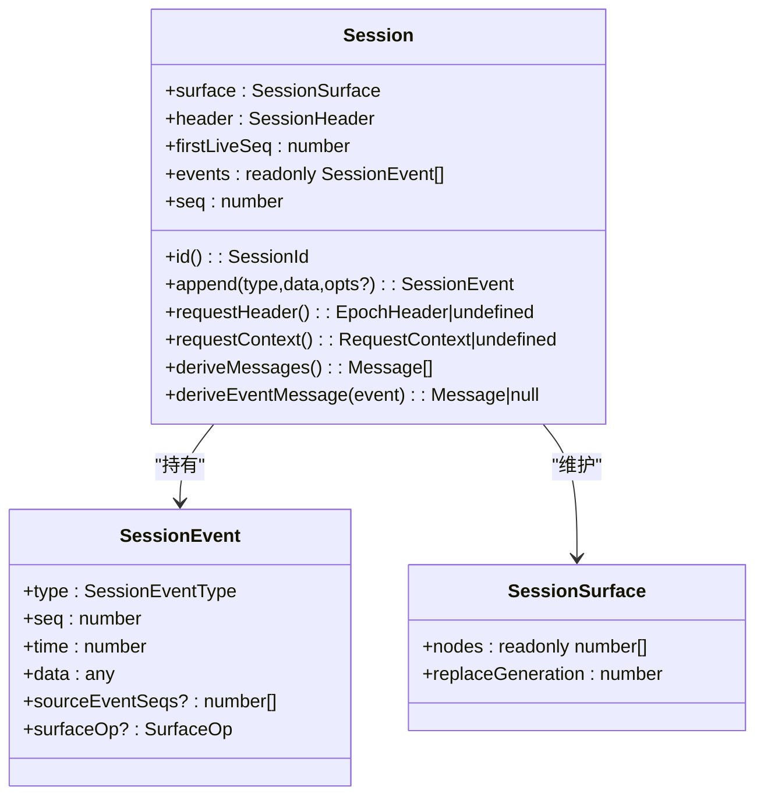
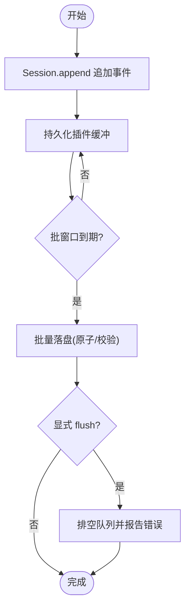
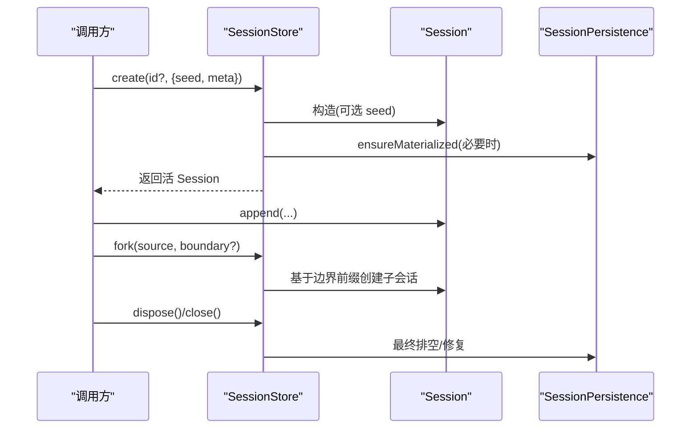
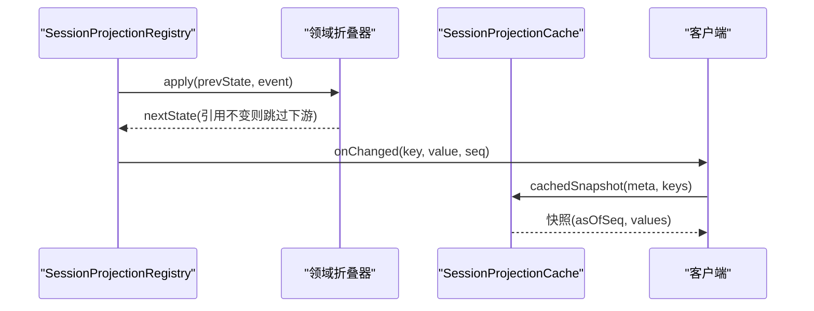
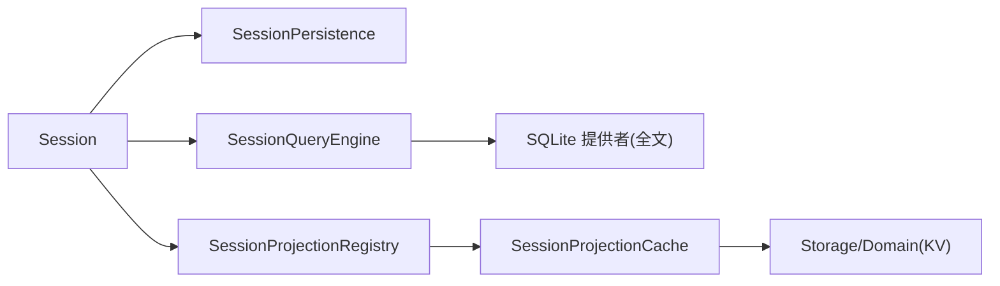

# 会话管理

<cite>
**本文引用的文件**
- [session.md](file://docs/subsystems/session.md)
- [persistence.md](file://docs/subsystems/persistence.md)
- [session-query.md](file://docs/subsystems/session-query.md)
- [session-projection.md](file://docs/subsystems/session-projection.md)
- [storage.md](file://docs/subsystems/storage.md)
- [persistence.spec.ts](file://packages/session/session-persistence/tests/persistence.spec.ts)
</cite>

## 目录
1. [简介](#简介)
2. [项目结构](#项目结构)
3. [核心组件](#核心组件)
4. [架构总览](#架构总览)
5. [详细组件分析](#详细组件分析)
6. [依赖关系分析](#依赖关系分析)
7. [性能考量](#性能考量)
8. [故障排查指南](#故障排查指南)
9. [结论](#结论)
10. [附录：操作示例与自定义持久化后端](#附录：操作示例与自定义持久化后端)

## 简介
本文件面向 DeepSeek Harness 的“会话管理系统”，围绕追加式事件日志（SessionEvent）的设计与实现，系统阐述会话状态的持久化机制（内存、磁盘与恢复策略）、会话生命周期（创建、更新、fork、清理）、以及会话查询与投影（历史消息检索与上下文重建）。文档同时提供可落地的代码级参考路径，帮助读者在现有接口上扩展或替换持久化后端。

## 项目结构
与会话管理相关的子系统与文档位于 docs/subsystems 下，并配套若干实现与测试包：
- 会话模型与事件：session.md
- 持久化抽象与后端：persistence.md
- 会话查询与全文检索：session-query.md
- 会话投影（派生状态）：session-projection.md
- 通用存储层（KV/域）：storage.md
- 持久化测试与内存后端示例：packages/session/session-persistence/tests/persistence.spec.ts

图表来源
- [session.md:1-133](file://docs/subsystems/session.md#L1-L133)
- [persistence.md:1-405](file://docs/subsystems/persistence.md#L1-L405)
- [session-query.md:1-504](file://docs/subsystems/session-query.md#L1-L504)
- [session-projection.md:1-329](file://docs/subsystems/session-projection.md#L1-L329)
- [storage.md:1-238](file://docs/subsystems/storage.md#L1-L238)

章节来源
- [session.md:1-133](file://docs/subsystems/session.md#L1-L133)
- [persistence.md:1-405](file://docs/subsystems/persistence.md#L1-L405)
- [session-query.md:1-504](file://docs/subsystems/session-query.md#L1-L504)
- [session-projection.md:1-329](file://docs/subsystems/session-projection.md#L1-L329)
- [storage.md:1-238](file://docs/subsystems/storage.md#L1-L238)

## 核心组件
- Session 与 SessionEvent：以追加式事件日志作为唯一事实源；所有 LLM 消息历史均由事件推导，不单独存储。
- 持久化抽象 SessionPersistence：定义 locate/create/append/prepare/load/inspect/readFrom/list/listSnapshots 等能力，支持 JSONL 与 SQLite 两种后端。
- 会话查询 SessionQueryEngine：提供跨会话列表、过滤、全文检索、事件窗口读取、事件关系追踪等。
- 会话投影 SessionProjectionRegistry：订阅 session/event，按单位纯函数折叠事件，输出客户端可见的完整值快照与变更流。
- 通用存储 Storage：为投影缓存等提供 KV/域能力，解耦具体介质。

章节来源
- [session.md:178-579](file://docs/subsystems/session.md#L178-L579)
- [persistence.md:9-405](file://docs/subsystems/persistence.md#L9-L405)
- [session-query.md:9-504](file://docs/subsystems/session-query.md#L9-L504)
- [session-projection.md:9-329](file://docs/subsystems/session-projection.md#L9-L329)
- [storage.md:9-238](file://docs/subsystems/storage.md#L9-L238)

## 架构总览
会话管理的核心是“事件溯源 + 多后端持久化 + 查询/投影”的分层设计：
- 写入路径：应用调用 Session.append(type, data, opts?) 将事件追加到内存日志；持久化插件异步缓冲并在批处理窗口内落盘。
- 恢复路径：冷启动时通过 SessionPersistence.load/inspect 加载并修复中断的 turn，返回平衡的不可变逻辑视图。
- 查询路径：SessionQueryEngine 基于“活优先”的逻辑语料库进行过滤、全文检索、事件窗口读取与关系追踪。
- 投影路径：SessionProjectionRegistry 订阅事件，驱动各领域折叠器产出完整值快照，并通过缓存服务持久化。

图表来源
- [session.md:401-492](file://docs/subsystems/session.md#L401-L492)
- [persistence.md:9-405](file://docs/subsystems/persistence.md#L9-L405)
- [session-query.md:367-504](file://docs/subsystems/session-query.md#L367-L504)
- [session-projection.md:100-329](file://docs/subsystems/session-projection.md#L100-L329)

## 详细组件分析

### 追加式事件日志（SessionEvent）设计与实现
- 事件词汇表 SessionEventMap：包含 turn/step 边界、用户消息、助手消息、工具调用/结果、请求头/上下文、种子结束标记等；支持通过声明合并扩展。
- 事件类型 SessionEvent<T>：区分型联合，包含单调 seq、时间戳与数据；表面事件携带 sourceEventSeqs 与 surfaceOp，用于有序表面投影与压缩替换。
- 表面与投影：SurfaceEventType 仅 user/message、assistant/message、tool/result；SurfaceOp 支持 append 与 replace；SessionSurface 维护当前有序节点序列与替换代数。
- 推导历史：deriveMessages() 基于表面节点生成模型可见的消息数组，缓存并按需重建；deriveEventMessage(event) 提供逐事件投影规则。

图表来源
- [session.md:178-579](file://docs/subsystems/session.md#L178-L579)

章节来源
- [session.md:9-133](file://docs/subsystems/session.md#L9-L133)
- [session.md:178-579](file://docs/subsystems/session.md#L178-L579)

### 会话状态持久化机制
- 抽象接口 SessionPersistence：统一 locate/create/append/prepare/load/inspect/readFrom/list/listSnapshots；支持 raw artifact 读取与轻量 revision 比较。
- 批处理与刷新：session/event 同步通知，持久化插件异步缓冲；首个待写事件开启固定批窗口，后续事件加入而不重置截止；session/flush 触发排空与错误观察。
- 崩溃恢复：冷加载发现未闭合的 turn/start 时，不会截断日志，而是合成 turn/end{kind:'interrupted'} 保持平衡；对 live id 则拒绝而非注入中断边界。
- 元数据 SessionHeader：版本、cwd、父会话、seedLength、origin、delegationDepth、agentPreset 等，独立于事件日志，不参与 deriveMessages。
- 后端实现：JSONL（每会话追加日志，原子写入、压缩帧、恢复）与 SQLite（分块存储、重构逻辑流、拒绝旧 schema）。

图表来源
- [persistence.md:9-405](file://docs/subsystems/persistence.md#L9-L405)

章节来源
- [persistence.md:9-405](file://docs/subsystems/persistence.md#L9-L405)

### 会话生命周期管理（创建、更新、fork、清理）
- 创建：ctx.sessions.create(id?, options?) 支持 seed 与 meta；prepare+enter+announce 组合用于精细控制发布顺序。
- 更新：通过 Session.append 追加事件；请求头/上下文通过 request/header 与 request/context 事件增量折叠。
- Fork：ctx.sessions.fork(source, boundary?, childSessionId?) 接受活 Session 或 ID，选择 inclusive 边界，要求边界外无打开 turn，创建子会话并继承 cwd 等元信息。
- 清理：dispose 会执行最终排空；对于热会话，关闭前确保已平衡；冷会话由 persistence 负责修复。

图表来源
- [session.md:505-563](file://docs/subsystems/session.md#L505-L563)
- [persistence.md:9-405](file://docs/subsystems/persistence.md#L9-L405)

章节来源
- [session.md:505-563](file://docs/subsystems/session.md#L505-L563)
- [persistence.md:9-405](file://docs/subsystems/persistence.md#L9-L405)

### 会话查询与投影（历史检索与上下文重建）
- 查询：SessionQueryEngine 提供 listSessions、filterSessions、searchSessions、searchEvents、readEvent、traceEvent 等；支持会话/事件级过滤器、全文检索、游标分页、事件窗口与关系追踪。
- 投影：SessionProjectionRegistry 订阅 session/event，驱动各领域 ProjectionDefinition.apply(state, event) 产出完整值快照；Snapshot 提供一致切面；Change Feed 推送变更。
- 缓存：SessionProjectionCache 提供 coldSnapshot/hydratePrepared/write/cachedSnapshot 等，结合 domain storage 做持久化与失效恢复。

图表来源
- [session-projection.md:9-329](file://docs/subsystems/session-projection.md#L9-L329)
- [session-query.md:367-504](file://docs/subsystems/session-query.md#L367-L504)

章节来源
- [session-query.md:9-504](file://docs/subsystems/session-query.md#L9-L504)
- [session-projection.md:9-329](file://docs/subsystems/session-projection.md#L9-L329)

## 依赖关系分析
- Session 依赖持久化抽象进行落盘与恢复；不直接耦合具体后端。
- SessionQueryEngine 依赖“活优先”逻辑语料库，底层可由 SQLite 提供者实现全文索引。
- SessionProjectionRegistry 依赖 session/event 事件流与各领域折叠器；其缓存依赖通用存储层（domain/KV）。
- 存储层 Storage 提供后端路由与域能力，被投影缓存等消费。

图表来源
- [persistence.md:231-405](file://docs/subsystems/persistence.md#L231-L405)
- [session-query.md:367-504](file://docs/subsystems/session-query.md#L367-L504)
- [session-projection.md:100-329](file://docs/subsystems/session-projection.md#L100-L329)
- [storage.md:9-238](file://docs/subsystems/storage.md#L9-L238)

章节来源
- [persistence.md:231-405](file://docs/subsystems/persistence.md#L231-L405)
- [session-query.md:367-504](file://docs/subsystems/session-query.md#L367-L504)
- [session-projection.md:100-329](file://docs/subsystems/session-projection.md#L100-L329)
- [storage.md:9-238](file://docs/subsystems/storage.md#L9-L238)

## 性能考量
- 事件追加热路径不阻塞 I/O：持久化插件异步缓冲，批窗口减少落盘次数。
- 表面投影缓存：deriveMessages 对每个表面节点仅投影一次，替换时代价可控。
- 查询优化：SessionQueryEngine 使用游标分页与语义文本扫描，避免全量解析；SQLite 提供者支持高效全文检索。
- 投影缓存：SessionProjectionCache 在关键边界（创建、turn/end、dispose）写回，降低冷读成本。

[本节为通用指导，无需特定文件引用]

## 故障排查指南
- 格式拒绝：当后端遇到无法解释的版本或未知事件类型时，抛出 SessionFormatUnsupportedError，提示升级方向而非误判损坏。
- 崩溃恢复：冷加载检测到未闭合 turn 时，合成 interrupted 结束；live id 拒绝而非注入中断边界。
- 批写失败：后台写入被拒会保留事件并暂停自动重试；显式 flush 立即重试并通过 agent/error 与日志上报。
- 投影缓存不一致：缓存写入失败为软失败，下次写入自愈；coldSnapshot/hydratePrepared 保证一致性切面。

章节来源
- [persistence.md:92-145](file://docs/subsystems/persistence.md#L92-L145)
- [persistence.md:231-405](file://docs/subsystems/persistence.md#L231-L405)
- [session-projection.md:112-174](file://docs/subsystems/session-projection.md#L112-L174)

## 结论
DeepSeek Harness 的会话管理以追加式事件日志为核心，通过抽象持久化层实现多后端兼容与稳健恢复；查询与投影分别提供高效的检索与派生状态能力。该设计在保证一致性与可恢复性的同时，兼顾了可扩展性与性能。

[本节为总结性内容，无需特定文件引用]

## 附录：操作示例与自定义持久化后端

以下示例均基于仓库中已定义的接口与实现，给出“如何操作会话数据”和“如何实现自定义持久化后端”的路径指引。为避免泄露实现细节，此处不粘贴代码正文，仅提供文件与行号定位。

- 创建会话并追加事件
  - 使用 ctx.sessions.create 创建会话，传入可选 seed 与 meta；随后通过 Session.append 追加事件。
  - 参考路径：[session.md:738-800](file://docs/subsystems/session.md#L738-L800)、[session.md:401-492](file://docs/subsystems/session.md#L401-L492)

- 从持久化恢复会话
  - 使用 ctx.sessionPersistence.prepare/load/inspect 获取不可变逻辑会话；prepare 会提交修复并返回可发布的准备对象。
  - 参考路径：[persistence.md:143-207](file://docs/subsystems/persistence.md#L143-L207)、[persistence.md:306-348](file://docs/subsystems/persistence.md#L306-L348)

- Fork 会话
  - 使用 ctx.sessions.fork(source, boundary?, childSessionId?) 基于边界前缀创建子会话，确保边界不在打开的 turn 内。
  - 参考路径：[session.md:505-512](file://docs/subsystems/session.md#L505-L512)

- 查询历史与事件窗口
  - 使用 ctx.sessionQuery.readEvent 读取目标事件及前后上下文；使用 filterSessions/filterEvents 进行过滤；使用 searchSessions/searchEvents 进行全文检索。
  - 参考路径：[session-query.md:259-331](file://docs/subsystems/session-query.md#L259-L331)、[session-query.md:367-504](file://docs/subsystems/session-query.md#L367-L504)

- 构建投影与缓存
  - 注册领域折叠器（ProjectionDefinition），通过 ctx.sessionProjections.snapshot 获取一致快照；使用 SessionProjectionCache.coldSnapshot/hydratePrepared/write 进行持久化。
  - 参考路径：[session-projection.md:9-67](file://docs/subsystems/session-projection.md#L9-L67)、[session-projection.md:112-174](file://docs/subsystems/session-projection.md#L112-L174)

- 自定义持久化后端
  - 实现 SessionPersistence 抽象接口，遵循 append-only、连续 seq、JSON 可序列化、崩溃恢复等契约；可选择是否支持 raw artifacts。
  - 参考路径：[persistence.md:231-405](file://docs/subsystems/persistence.md#L231-L405)
  - 内存后端示例（测试用）：MemoryPersistence 基于 Map 模拟持久化，展示 create/append/load/inspect/readFrom/list/listSnapshots 的基本行为。
  - 参考路径：[persistence.spec.ts:64-220](file://packages/session/session-persistence/tests/persistence.spec.ts#L64-L220)

- 通用存储（KV/域）用于投影缓存
  - 通过 ctx.storage 注册后端并挂载 domain，使用 DomainFacility.open(spec) 打开域，读写记录并监听 domain/changed 事件。
  - 参考路径：[storage.md:9-238](file://docs/subsystems/storage.md#L9-L238)

章节来源
- [session.md:401-512](file://docs/subsystems/session.md#L401-L512)
- [persistence.md:143-405](file://docs/subsystems/persistence.md#L143-L405)
- [session-query.md:259-504](file://docs/subsystems/session-query.md#L259-L504)
- [session-projection.md:9-174](file://docs/subsystems/session-projection.md#L9-L174)
- [storage.md:9-238](file://docs/subsystems/storage.md#L9-L238)
- [persistence.spec.ts:64-220](file://packages/session/session-persistence/tests/persistence.spec.ts#L64-L220)