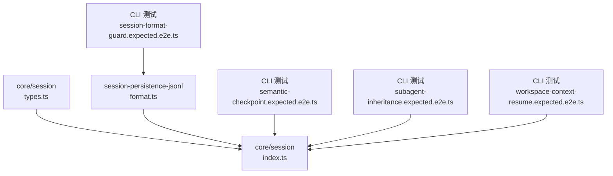
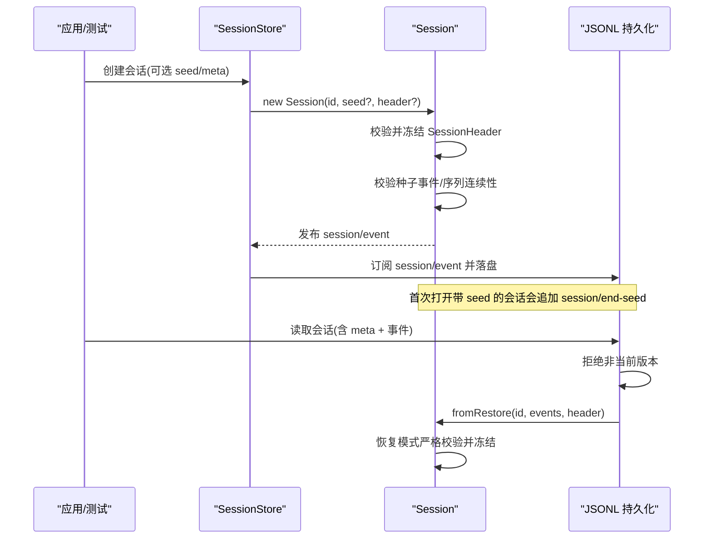
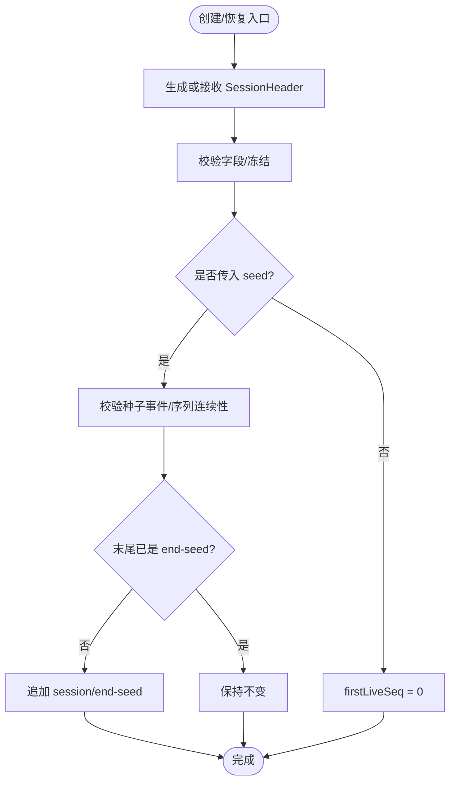
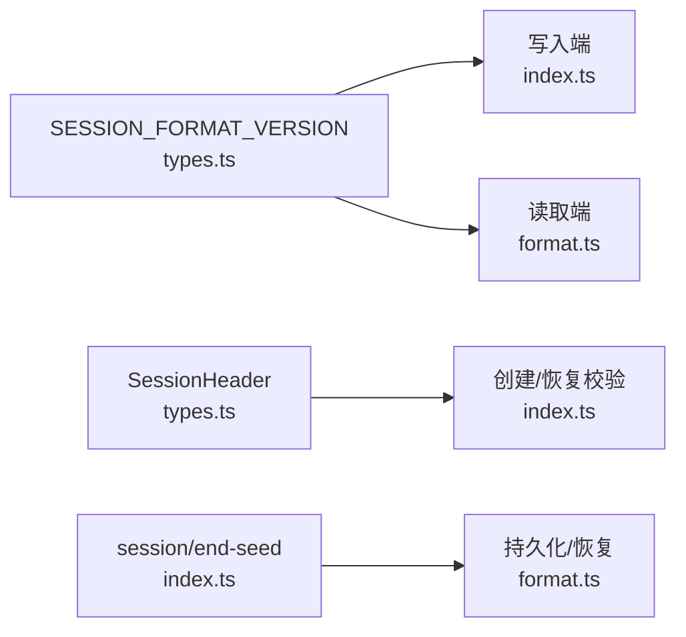

# 会话元数据管理

<cite>
**本文引用的文件**
- [packages/core/session/src/index.ts](file://packages/core/session/src/index.ts)
- [packages/core/session/src/types.ts](file://packages/core/session/src/types.ts)
- [packages/session/session-persistence-jsonl/src/format.ts](file://packages/session/session-persistence-jsonl/src/format.ts)
- [apps/cli/tests/profiles/headless/tests/semantic-checkpoint.expected.e2e.ts](file://apps/cli/tests/profiles/headless/tests/semantic-checkpoint.expected.e2e.ts)
- [apps/cli/tests/profiles/headless/tests/session-format-guard.expected.e2e.ts](file://apps/cli/tests/profiles/headless/tests/session-format-guard.expected.e2e.ts)
- [apps/cli/tests/profiles/headless/tests/subagent-inheritance.expected.e2e.ts](file://apps/cli/tests/profiles/headless/tests/subagent-inheritance.expected.e2e.ts)
- [apps/cli/tests/profiles/headless/tests/workspace-context-resume.expected.e2e.ts](file://apps/cli/tests/profiles/headless/tests/workspace-context-resume.expected.e2e.ts)
</cite>

## 目录
1. [简介](#简介)
2. [项目结构](#项目结构)
3. [核心组件](#核心组件)
4. [架构总览](#架构总览)
5. [详细组件分析](#详细组件分析)
6. [依赖关系分析](#依赖关系分析)
7. [性能考量](#性能考量)
8. [故障排查指南](#故障排查指南)
9. [结论](#结论)
10. [附录：操作示例与最佳实践](#附录：操作示例与最佳实践)

## 简介
本文件围绕 DeepSeek Harness 的“会话元数据管理系统”展开，聚焦 SessionHeader 的设计理念、字段语义、生命周期管理、验证规则与兼容性策略，并说明其在会话恢复、重放与调试中的作用。文档同时提供面向实践的元数据操作建议与排错要点，帮助读者在创建、持久化、恢复与回放会话时正确维护元数据一致性。

## 项目结构
与会话元数据相关的核心实现位于 core/session 包，类型定义集中在 types.ts；JSONL 持久化后端在 session-persistence-jsonl 包中负责版本检查与加载流程；测试用例覆盖种子边界、子代理继承、工作目录恢复等场景。

图表来源
- [packages/core/session/src/types.ts:33-99](file://packages/core/session/src/types.ts#L33-L99)
- [packages/core/session/src/index.ts:95-157](file://packages/core/session/src/index.ts#L95-L157)
- [packages/session/session-persistence-jsonl/src/format.ts:259-280](file://packages/session/session-persistence-jsonl/src/format.ts#L259-L280)
- [apps/cli/tests/profiles/headless/tests/semantic-checkpoint.expected.e2e.ts:27-30](file://apps/cli/tests/profiles/headless/tests/semantic-checkpoint.expected.e2e.ts#L27-L30)
- [apps/cli/tests/profiles/headless/tests/session-format-guard.expected.e2e.ts:68-72](file://apps/cli/tests/profiles/headless/tests/session-format-guard.expected.e2e.ts#L68-L72)
- [apps/cli/tests/profiles/headless/tests/subagent-inheritance.expected.e2e.ts:34-36](file://apps/cli/tests/profiles/headless/tests/subagent-inheritance.expected.e2e.ts#L34-L36)
- [apps/cli/tests/profiles/headless/tests/workspace-context-resume.expected.e2e.ts:51-53](file://apps/cli/tests/profiles/headless/tests/workspace-context-resume.expected.e2e.ts#L51-L53)

章节来源
- [packages/core/session/src/types.ts:33-99](file://packages/core/session/src/types.ts#L33-L99)
- [packages/core/session/src/index.ts:95-157](file://packages/core/session/src/index.ts#L95-L157)
- [packages/session/session-persistence-jsonl/src/format.ts:259-280](file://packages/session/session-persistence-jsonl/src/format.ts#L259-L280)

## 核心组件
- SessionHeader（会话头）：不可变、经校验的存储元数据，包含格式版本、会话 ID、创建时间、工作目录、父会话、种子长度、子代理来源、委托深度、Agent 预设等。
- SessionStore / Session：事件溯源式会话对象，维护追加型日志、有序表面（surface）、派生消息历史，以及首条“活事件”位置 firstLiveSeq。
- JSONL 持久化后端：在加载时执行格式版本拒绝策略，确保只读取当前构建可安全解析的版本。

章节来源
- [packages/core/session/src/types.ts:33-99](file://packages/core/session/src/types.ts#L33-L99)
- [packages/core/session/src/index.ts:423-546](file://packages/core/session/src/index.ts#L423-L546)
- [packages/session/session-persistence-jsonl/src/format.ts:259-280](file://packages/session/session-persistence-jsonl/src/format.ts#L259-L280)

## 架构总览
下图展示了从创建到持久化、再到恢复的关键路径，以及元数据在各阶段的流转与校验点。

图表来源
- [packages/core/session/src/index.ts:95-157](file://packages/core/session/src/index.ts#L95-L157)
- [packages/core/session/src/index.ts:497-546](file://packages/core/session/src/index.ts#L497-L546)
- [packages/session/session-persistence-jsonl/src/format.ts:259-280](file://packages/session/session-persistence-jsonl/src/format.ts#L259-L280)

## 详细组件分析

### SessionHeader 设计与字段语义
- version：磁盘格式版本，写入时取自常量 SESSION_FORMAT_VERSION；加载时由持久化后端强制匹配，不兼容即拒绝。
- id：会话唯一标识，与 Session.id 一致。
- createdAt：创建时间的 Unix 毫秒数（非负安全整数）。
- cwd：创建时的绝对工作目录（可选），必须为绝对路径。
- parentSession：父会话 ID（可选），用于血缘追踪。
- seedLength：继承自种子的事件数量（可选），区分“父历史”和“子工作”。
- origin：子代理来源标记（可选，固定值 'subagent'）。
- delegationDepth：委托深度（可选），跨重启/恢复保持递归预算。
- agentPreset：Agent 预设 ID（可选），决定工具与提示词，需持久化以保证恢复一致性。

这些字段共同构成“会话上下文快照”，不参与对话事件日志，但驱动恢复、重放、调试与权限/能力边界控制。

章节来源
- [packages/core/session/src/types.ts:33-99](file://packages/core/session/src/types.ts#L33-L99)
- [packages/core/session/src/index.ts:95-157](file://packages/core/session/src/index.ts#L95-L157)

### 元数据生命周期：创建 → 持久化 → 恢复
- 创建阶段
  - 若未提供 header，则自动生成最小 header（version=SESSION_FORMAT_VERSION、id、createdAt）。
  - 对输入 header 进行深拷贝、JSON 序列化校验、字段校验并冻结。
- 种子边界
  - 当以 seed 构造 Session 且末尾不是 session/end-seed 时，自动追加该标记，表示“之前的事件来自种子”。
  - firstLiveSeq 记录进程内第一条“活事件”的位置，便于区分种子与后续追加。
- 持久化
  - 通过 store 事件流将事件与元数据交由后端保存；后端在加载时执行版本拒绝。
- 恢复阶段
  - fromRestore 使用更严格的“纯 JSON 原型”检查，再调用通用校验器，确保恢复后的元数据与事件完全可信。

图表来源
- [packages/core/session/src/index.ts:149-157](file://packages/core/session/src/index.ts#L149-L157)
- [packages/core/session/src/index.ts:497-546](file://packages/core/session/src/index.ts#L497-L546)

章节来源
- [packages/core/session/src/index.ts:149-157](file://packages/core/session/src/index.ts#L149-L157)
- [packages/core/session/src/index.ts:497-546](file://packages/core/session/src/index.ts#L497-L546)

### 验证规则与约束条件
- 版本控制
  - 写入端统一使用 SESSION_FORMAT_VERSION；读取端在解析首行 meta 前即检查版本，不匹配直接拒绝，避免误判为“损坏日志”。
- 字段约束
  - version 必须等于当前版本；id 必须与传入一致；createdAt 为非负安全整数；cwd 必须存在且为绝对路径；parentSession 若存在须为字符串；seedLength/delegationDepth 为非负安全整数；origin 仅允许 'subagent'；agentPreset 为字符串。
- 事件与表面
  - 种子事件需满足 JSON 可无损序列化、seq 连续、表面节点合法性；恢复路径要求对象原型为 Object.prototype。
- 向后兼容
  - 采用“失败关闭”策略：未知或不兼容版本一律拒绝；新增普通事件类型不会导致版本升级，但未知事件类型会被已知事件守卫拒绝。

章节来源
- [packages/core/session/src/types.ts:33-56](file://packages/core/session/src/types.ts#L33-L56)
- [packages/core/session/src/index.ts:95-157](file://packages/core/session/src/index.ts#L95-L157)
- [packages/session/session-persistence-jsonl/src/format.ts:259-280](file://packages/session/session-persistence-jsonl/src/format.ts#L259-L280)

### 在恢复、重放与调试中的作用
- 恢复
  - 通过 parentSession、seedLength 区分父子历史；cwd 保证工作目录一致性；agentPreset 保证工具/提示词一致。
- 重放
  - session/end-seed 标记了种子与活事件的边界；firstLiveSeq 提供进程内精确分界；表面机制保证派生消息历史稳定。
- 调试
  - 通过 header 快速定位会话来源、工作目录、委托深度与 Agent 预设；结合事件日志与 surface 节点，可精确定位问题发生阶段。

章节来源
- [packages/core/session/src/index.ts:423-546](file://packages/core/session/src/index.ts#L423-L546)
- [apps/cli/tests/profiles/headless/tests/semantic-checkpoint.expected.e2e.ts:27-30](file://apps/cli/tests/profiles/headless/tests/semantic-checkpoint.expected.e2e.ts#L27-L30)
- [apps/cli/tests/profiles/headless/tests/subagent-inheritance.expected.e2e.ts:34-36](file://apps/cli/tests/profiles/headless/tests/subagent-inheritance.expected.e2e.ts#L34-L36)
- [apps/cli/tests/profiles/headless/tests/workspace-context-resume.expected.e2e.ts:51-53](file://apps/cli/tests/profiles/headless/tests/workspace-context-resume.expected.e2e.ts#L51-L53)

## 依赖关系分析
- core/session 提供类型与运行时校验；session-persistence-jsonl 在加载时执行版本拒绝；测试用例覆盖典型场景。
- 关键耦合点：
  - 版本常量 SESSION_FORMAT_VERSION 是写端与读端的单一事实源。
  - SessionHeader 校验逻辑被创建与恢复两条路径复用。
  - 种子边界通过 session/end-seed 与 firstLiveSeq 协同，贯穿持久化与恢复。

图表来源
- [packages/core/session/src/types.ts:33-56](file://packages/core/session/src/types.ts#L33-L56)
- [packages/core/session/src/index.ts:95-157](file://packages/core/session/src/index.ts#L95-L157)
- [packages/session/session-persistence-jsonl/src/format.ts:259-280](file://packages/session/session-persistence-jsonl/src/format.ts#L259-L280)

章节来源
- [packages/core/session/src/types.ts:33-56](file://packages/core/session/src/types.ts#L33-L56)
- [packages/core/session/src/index.ts:95-157](file://packages/core/session/src/index.ts#L95-L157)
- [packages/session/session-persistence-jsonl/src/format.ts:259-280](file://packages/session/session-persistence-jsonl/src/format.ts#L259-L280)

## 性能考量
- 元数据校验与冻结发生在创建/恢复边界，避免在热路径重复计算。
- 种子事件一次性校验并冻结，保证后续 append 路径无额外复制。
- 表面与派生消息缓存按“新节点增量”更新，降低历史重建成本。
- 持久化后端在加载时尽早拒绝不兼容版本，减少无效解码开销。

[本节为通用指导，不直接分析具体文件]

## 故障排查指南
- 版本不兼容
  - 现象：加载会话时报“格式版本不支持/需要升级 harness”。
  - 原因：meta.version 不等于当前 SESSION_FORMAT_VERSION。
  - 处理：升级 harness 或使用同版本工具链重新打开。
- 工作目录非法
  - 现象：创建/恢复时报“cwd 必须为绝对路径”。
  - 处理：确保传入 cwd 为绝对路径。
- 种子序列不连续
  - 现象：构造 Session 时报“seed seq 不连续”。
  - 处理：确保 seed 的 seq 从 0 开始且连续。
- 非 JSON 可序列化数据
  - 现象：append 或种子校验时报“非 JSON 可序列化”。
  - 处理：移除 BigInt、函数、Symbol、循环引用等不可序列化值。

章节来源
- [packages/session/session-persistence-jsonl/src/format.ts:259-280](file://packages/session/session-persistence-jsonl/src/format.ts#L259-L280)
- [packages/core/session/src/index.ts:95-157](file://packages/core/session/src/index.ts#L95-L157)
- [packages/core/session/src/index.ts:497-546](file://packages/core/session/src/index.ts#L497-L546)
- [apps/cli/tests/profiles/headless/tests/session-format-guard.expected.e2e.ts:68-72](file://apps/cli/tests/profiles/headless/tests/session-format-guard.expected.e2e.ts#L68-L72)

## 结论
SessionHeader 作为会话的不可变元数据快照，贯穿创建、持久化、恢复与重放全过程。通过严格的版本控制、字段校验与种子边界标记，系统在保证一致性的同时，提供了强大的可恢复性与可观测性。遵循本文的最佳实践，可在多环境、多进程与跨重启场景中可靠地管理与诊断会话。

[本节为总结性内容，不直接分析具体文件]

## 附录：操作示例与最佳实践
- 创建会话
  - 设置 version 为 SESSION_FORMAT_VERSION；提供 id、createdAt；可选 cwd、parentSession、seedLength、origin、delegationDepth、agentPreset。
  - 参考示例路径：
    - [semantic-checkpoint.expected.e2e.ts:27-30](file://apps/cli/tests/profiles/headless/tests/semantic-checkpoint.expected.e2e.ts#L27-L30)
    - [subagent-inheritance.expected.e2e.ts:34-36](file://apps/cli/tests/profiles/headless/tests/subagent-inheritance.expected.e2e.ts#L34-L36)
    - [workspace-context-resume.expected.e2e.ts:51-53](file://apps/cli/tests/profiles/headless/tests/workspace-context-resume.expected.e2e.ts#L51-L53)
- 恢复会话
  - 先读取 meta 与事件；在加载前检查版本；再用 fromRestore 构造 Session。
  - 参考路径：
    - [format.ts:259-280](file://packages/session/session-persistence-jsonl/src/format.ts#L259-L280)
    - [index.ts:497-546](file://packages/core/session/src/index.ts#L497-L546)
- 重放与调试
  - 使用 session/end-seed 与 firstLiveSeq 区分种子与活事件；结合 surface 节点定位派生消息。
  - 参考路径：
    - [index.ts:423-546](file://packages/core/session/src/index.ts#L423-L546)
- 最佳实践
  - 始终通过常量 SESSION_FORMAT_VERSION 写入版本，避免硬编码。
  - 确保 cwd 为绝对路径；仅在必要时携带 parentSession/seedLength。
  - 对 agentPreset、delegationDepth 等影响行为与能力的字段务必持久化。
  - 遇到版本不兼容错误优先升级 harness，而非尝试迁移旧日志。

章节来源
- [packages/core/session/src/types.ts:33-56](file://packages/core/session/src/types.ts#L33-L56)
- [packages/core/session/src/index.ts:95-157](file://packages/core/session/src/index.ts#L95-L157)
- [packages/core/session/src/index.ts:423-546](file://packages/core/session/src/index.ts#L423-L546)
- [packages/session/session-persistence-jsonl/src/format.ts:259-280](file://packages/session/session-persistence-jsonl/src/format.ts#L259-L280)
- [apps/cli/tests/profiles/headless/tests/semantic-checkpoint.expected.e2e.ts:27-30](file://apps/cli/tests/profiles/headless/tests/semantic-checkpoint.expected.e2e.ts#L27-L30)
- [apps/cli/tests/profiles/headless/tests/subagent-inheritance.expected.e2e.ts:34-36](file://apps/cli/tests/profiles/headless/tests/subagent-inheritance.expected.e2e.ts#L34-L36)
- [apps/cli/tests/profiles/headless/tests/workspace-context-resume.expected.e2e.ts:51-53](file://apps/cli/tests/profiles/headless/tests/workspace-context-resume.expected.e2e.ts#L51-L53)
- [apps/cli/tests/profiles/headless/tests/session-format-guard.expected.e2e.ts:68-72](file://apps/cli/tests/profiles/headless/tests/session-format-guard.expected.e2e.ts#L68-L72)