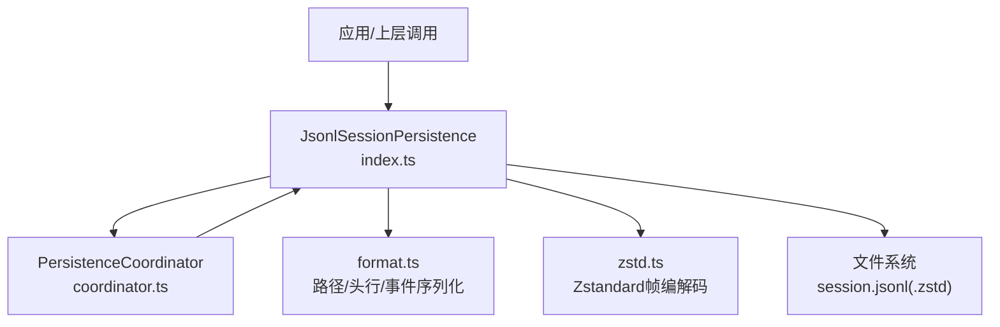
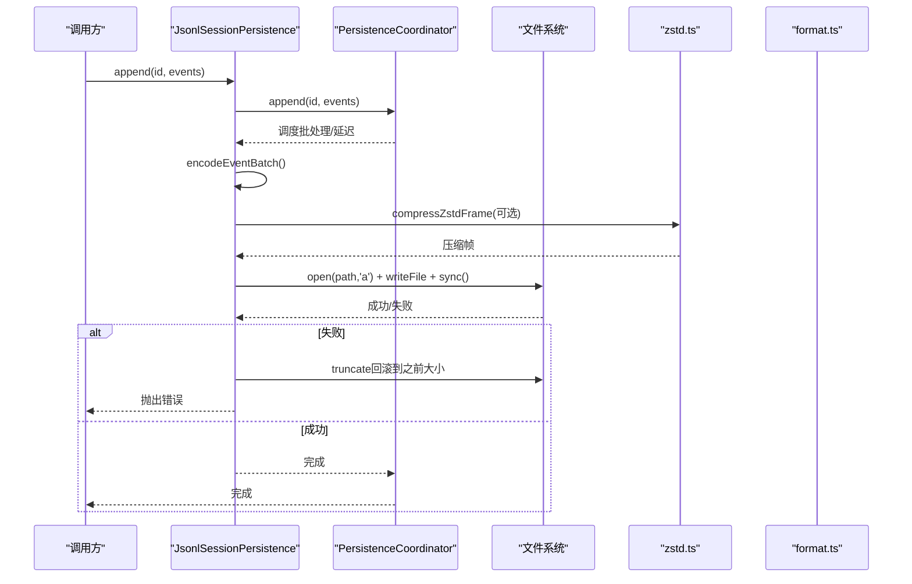
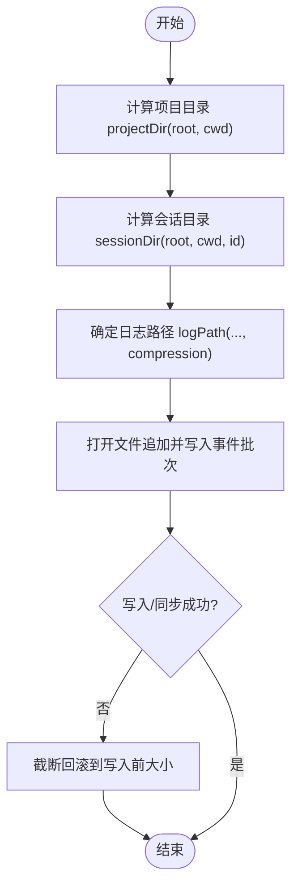
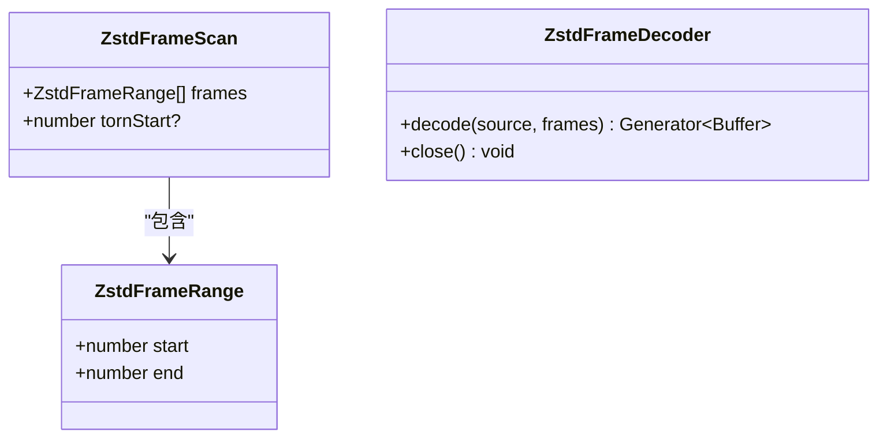
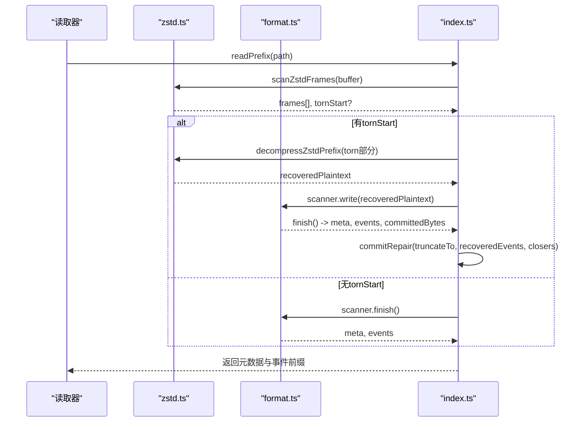
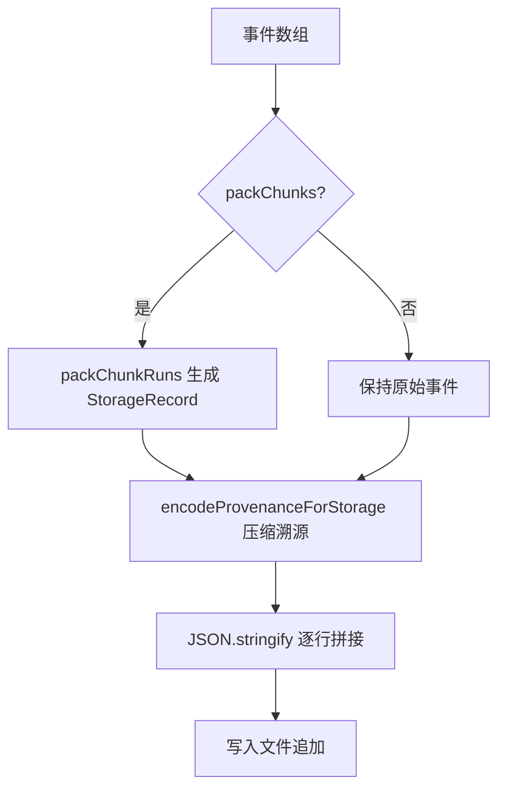
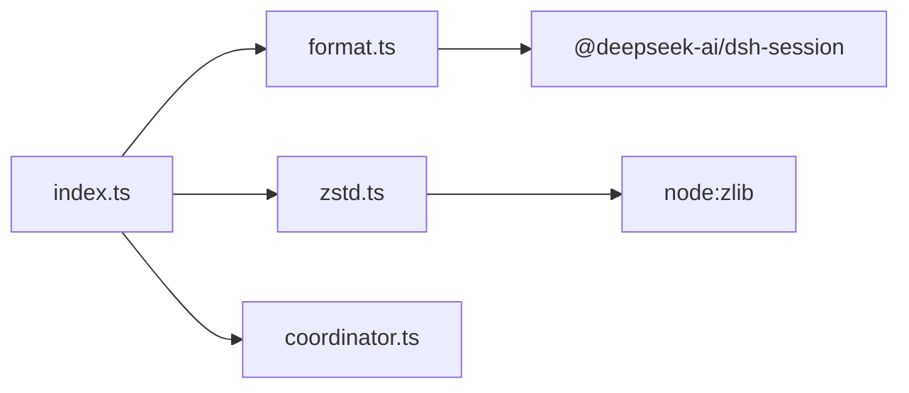

# JSONL存储后端

<cite>
**本文引用的文件**
- [packages/session/session-persistence-jsonl/src/index.ts](file://packages/session/session-persistence-jsonl/src/index.ts)
- [packages/session/session-persistence-jsonl/src/format.ts](file://packages/session/session-persistence-jsonl/src/format.ts)
- [packages/session/session-persistence-jsonl/src/zstd.ts](file://packages/session/session-persistence-jsonl/src/zstd.ts)
- [packages/session/session-persistence/src/coordinator.ts](file://packages/session/session-persistence/src/coordinator.ts)
- [packages/session/session-persistence/tests/persistence.spec.ts](file://packages/session/session-persistence/tests/persistence.spec.ts)
</cite>

## 目录
1. [简介](#简介)
2. [项目结构](#项目结构)
3. [核心组件](#核心组件)
4. [架构总览](#架构总览)
5. [详细组件分析](#详细组件分析)
6. [依赖关系分析](#依赖关系分析)
7. [性能考量](#性能考量)
8. [故障排除指南](#故障排除指南)
9. [结论](#结论)
10. [附录](#附录)

## 简介
本文件为 DeepSeek Harness 的 JSONL 存储后端提供系统化文档。该后端以“单会话追加式日志”为核心，将每个会话的元数据与事件序列持久化为一个可追加的文件；默认使用 Zstandard 压缩并以帧为单位组织，支持原子写入、崩溃恢复、批处理合并与冷启动缓存等特性。文档覆盖设计原理、配置项、文件系统布局、元数据管理、序列化/反序列化流程、使用示例、性能调优与故障排除。

## 项目结构
JSONL 存储后端位于 session-persistence-jsonl 包中，关键源文件如下：
- index.ts：后端主类、配置解析、协调器集成、读写路径与原子发布、崩溃修复、列表与快照等。
- format.ts：路径编码、项目/会话目录布局、头行（SessionHeader）序列化/反序列化、事件行序列化与扫描器。
- zstd.ts：Zstandard 帧扫描、压缩/解压、多帧解码器选择与不完整帧前缀恢复。
- coordinator.ts（上层协调器）：批处理延迟、准备态缓存、并发安全与重试策略。

图表来源
- [packages/session/session-persistence-jsonl/src/index.ts:123-210](file://packages/session/session-persistence-jsonl/src/index.ts#L123-L210)
- [packages/session/session-persistence-jsonl/src/format.ts:178-226](file://packages/session/session-persistence-jsonl/src/format.ts#L178-L226)
- [packages/session/session-persistence-jsonl/src/zstd.ts:48-156](file://packages/session/session-persistence-jsonl/src/zstd.ts#L48-L156)
- [packages/session/session-persistence/src/coordinator.ts:86-88](file://packages/session/session-persistence/src/coordinator.ts#L86-L88)

章节来源
- [packages/session/session-persistence-jsonl/src/index.ts:123-210](file://packages/session/session-persistence-jsonl/src/index.ts#L123-L210)
- [packages/session/session-persistence-jsonl/src/format.ts:178-226](file://packages/session/session-persistence-jsonl/src/format.ts#L178-L226)
- [packages/session/session-persistence-jsonl/src/zstd.ts:48-156](file://packages/session/session-persistence-jsonl/src/zstd.ts#L48-L156)
- [packages/session/session-persistence/src/coordinator.ts:86-88](file://packages/session/session-persistence/src/coordinator.ts#L86-L88)

## 核心组件
- JsonlSessionPersistence：实现 SessionPersistence 接口，封装 JSONL 物理存储细节，委托编排给 PersistenceCoordinator。
- format：负责路径安全编码、项目/会话目录布局、头行与事件行的序列化/反序列化、增量扫描器。
- zstd：实现 Zstandard 帧扫描、压缩/解压、多帧解码器生命周期管理与不完整帧前缀恢复。
- PersistenceCoordinator：统一批处理延迟、准备态缓存、并发控制、错误恢复与重试。

章节来源
- [packages/session/session-persistence-jsonl/src/index.ts:123-210](file://packages/session/session-persistence-jsonl/src/index.ts#L123-L210)
- [packages/session/session-persistence-jsonl/src/format.ts:178-226](file://packages/session/session-persistence-jsonl/src/format.ts#L178-L226)
- [packages/session/session-persistence-jsonl/src/zstd.ts:48-156](file://packages/session/session-persistence-jsonl/src/zstd.ts#L48-L156)
- [packages/session/session-persistence/src/coordinator.ts:86-88](file://packages/session/session-persistence/src/coordinator.ts#L86-L88)

## 架构总览
JSONL 后端采用“单文件追加日志 + 帧级压缩”的设计：
- 每个会话一个追加文件，首行为不可变头记录（SessionHeader），后续为事件行。
- 默认使用 Zstandard 帧压缩，每批事件或头+首批事件各自成帧，便于独立校验与恢复。
- 写入路径通过临时文件 + 原子链接/发布确保幂等与崩溃安全。
- 读取路径支持完整帧流式解码与不完整尾帧的前缀恢复，保证崩溃后仍可恢复已提交事件。

图表来源
- [packages/session/session-persistence-jsonl/src/index.ts:670-698](file://packages/session/session-persistence-jsonl/src/index.ts#L670-L698)
- [packages/session/session-persistence-jsonl/src/zstd.ts:111-122](file://packages/session/session-persistence-jsonl/src/zstd.ts#L111-L122)
- [packages/session/session-persistence/src/coordinator.ts:606-626](file://packages/session/session-persistence/src/coordinator.ts#L606-L626)

## 详细组件分析

### 追加式日志设计与单文件会话存储
- 单文件追加：每个会话对应一个追加文件，文件名后缀由压缩模式决定（.jsonl.zstd 或 .jsonl）。
- 头行与事件行：首行是类型标记为 session 的头记录，包含版本、ID、创建时间、工作目录、父会话、代理预设等元信息；后续行为事件行，支持打包连续 chunk 为 storage row。
- 路径布局：root → 项目目录（基于 cwd 的可读键）→ 会话目录（对 id 进行安全编码）→ session.jsonl(.zstd)。

图表来源
- [packages/session/session-persistence-jsonl/src/format.ts:178-210](file://packages/session/session-persistence-jsonl/src/format.ts#L178-L210)
- [packages/session/session-persistence-jsonl/src/index.ts:670-698](file://packages/session/session-persistence-jsonl/src/index.ts#L670-L698)

章节来源
- [packages/session/session-persistence-jsonl/src/format.ts:178-210](file://packages/session/session-persistence-jsonl/src/format.ts#L178-L210)
- [packages/session/session-persistence-jsonl/src/index.ts:670-698](file://packages/session/session-persistence-jsonl/src/index.ts#L670-L698)

### Zstandard 压缩实现
- 帧结构：每个头或事件批次被压缩为独立的 Zstandard 帧，带校验和，便于独立验证与恢复。
- 扫描与解码：scanZstdFrames 仅扫描帧边界而不解压内容；createZstdFrameDecoder 提供迭代式解码，按帧产出明文并释放资源。
- 不完整帧恢复：decompressZstdPrefix 使用 flush 模式从末尾不完整帧中提取可用明文，配合扫描器恢复已提交事件。

图表来源
- [packages/session/session-persistence-jsonl/src/zstd.ts:25-39](file://packages/session/session-persistence-jsonl/src/zstd.ts#L25-L39)
- [packages/session/session-persistence-jsonl/src/zstd.ts:124-145](file://packages/session/session-persistence-jsonl/src/zstd.ts#L124-L145)

章节来源
- [packages/session/session-persistence-jsonl/src/zstd.ts:48-156](file://packages/session/session-persistence-jsonl/src/zstd.ts#L48-L156)

### 原子写入机制与崩溃恢复
- 原子发布：POSIX 使用 link()+unlink() 而非 rename()，避免并发 clobber；Windows 使用专用 durable publish。
- 目录同步：在 POSIX 上 fsync 目录以确保新条目在断电后持久化。
- 崩溃恢复：读取时检测不完整帧，尝试恢复明文；若存在损坏尾部，则截断至安全偏移并补写合成关闭事件，同时记录告警。

图表来源
- [packages/session/session-persistence-jsonl/src/index.ts:320-429](file://packages/session/session-persistence-jsonl/src/index.ts#L320-L429)
- [packages/session/session-persistence-jsonl/src/zstd.ts:147-156](file://packages/session/session-persistence-jsonl/src/zstd.ts#L147-L156)
- [packages/session/session-persistence-jsonl/src/format.ts:305-427](file://packages/session/session-persistence-jsonl/src/format.ts#L305-L427)

章节来源
- [packages/session/session-persistence-jsonl/src/index.ts:529-608](file://packages/session/session-persistence-jsonl/src/index.ts#L529-L608)
- [packages/session/session-persistence-jsonl/src/index.ts:670-720](file://packages/session/session-persistence-jsonl/src/index.ts#L670-L720)
- [packages/session/session-persistence-jsonl/src/index.ts:320-429](file://packages/session/session-persistence-jsonl/src/index.ts#L320-L429)

### 元数据管理与事件序列化/反序列化
- 头行：type='session'，包含 version、id、createdAt、cwd、parentSession、seedLength、origin、delegationDepth、agentPreset 等字段；写入时去除可选字段为空的情况。
- 事件行：eventLines 将事件序列转换为 JSONL 文本；当 packChunks=true 时，连续的 assistant/chunk 等 delta 事件会被打包为 text-chunks/reasoning-chunks/tool-call-chunks storage row，减少体积且无损。
- 溯源压缩：sourceEventSeqs 在存储层以范围形式压缩，读取时再展开为 number[]。
- 扫描器：SessionLogScanner 增量解析事件行，维护 committedBytes 与事件序列号连续性，遇到不合法或 gap 即报错。

图表来源
- [packages/session/session-persistence-jsonl/src/format.ts:212-257](file://packages/session/session-persistence-jsonl/src/format.ts#L212-L257)
- [packages/session/session-persistence-jsonl/src/format.ts:305-427](file://packages/session/session-persistence-jsonl/src/format.ts#L305-L427)

章节来源
- [packages/session/session-persistence-jsonl/src/format.ts:35-88](file://packages/session/session-persistence-jsonl/src/format.ts#L35-L88)
- [packages/session/session-persistence-jsonl/src/format.ts:212-257](file://packages/session/session-persistence-jsonl/src/format.ts#L212-L257)
- [packages/session/session-persistence-jsonl/src/format.ts:305-427](file://packages/session/session-persistence-jsonl/src/format.ts#L305-L427)

### 配置选项与作用
- root：所有会话文件的根目录。必须可读；不存在时在首次物化时创建。建议指向稳定、权限受控的共享或本地目录。
- packChunks：是否将连续 chunk 事件打包为 storage row。开启可显著减小日志体积（实测约降低约60%），读取时无感知；关闭便于诊断。
- compression：物理编码，'zstd'（默认）或 'none'。zstd 提供带校验的帧压缩；none 为纯文本。
- preparedSessionCacheSize：冷启动会话准备态缓存容量，用于历史到继续的复用。需为正整数。
- writeBatchMaxDelayMs：固定批处理延迟窗口，非后端完成截止时间。需在允许范围内。

最佳实践
- 生产环境默认启用 zstd 与 packChunks，以获得更好的 I/O 与空间效率。
- 调试场景可设置 compression='none' 与 packChunks=false 以便直接查看行级事件。
- 根据负载调整 preparedSessionCacheSize 与 writeBatchMaxDelayMs：高吞吐场景适当增大批延迟以提升吞吐；低延迟要求场景减小批延迟以降低尾部延迟。

章节来源
- [packages/session/session-persistence-jsonl/src/index.ts:61-85](file://packages/session/session-persistence-jsonl/src/index.ts#L61-L85)
- [packages/session/session-persistence-jsonl/src/index.ts:128-135](file://packages/session/session-persistence-jsonl/src/index.ts#L128-L135)
- [packages/session/session-persistence/src/coordinator.ts:606-626](file://packages/session/session-persistence/src/coordinator.ts#L606-L626)
- [packages/session/session-persistence/tests/persistence.spec.ts:507-526](file://packages/session/session-persistence/tests/persistence.spec.ts#L507-L526)

### 文件组织结构与定位
- 项目目录：projectKey(cwd) 将工作目录映射为人类可读且安全的目录名；未定义 cwd 时使用 _no-cwd。
- 会话目录：encodeSegment(id) 对会话 ID 进行安全编码，防止路径穿越与冲突。
- 日志文件：session.jsonl（明文）或 session.jsonl.zstd（压缩）。
- locate(meta) 在不触碰文件系统的情况下返回绝对目标路径；list/listSnapshots 仅读取头行以扩展性列出会话。

章节来源
- [packages/session/session-persistence-jsonl/src/format.ts:149-210](file://packages/session/session-persistence-jsonl/src/format.ts#L149-L210)
- [packages/session/session-persistence-jsonl/src/index.ts:173-176](file://packages/session/session-persistence-jsonl/src/index.ts#L173-L176)
- [packages/session/session-persistence-jsonl/src/index.ts:462-525](file://packages/session/session-persistence-jsonl/src/index.ts#L462-L525)

### 使用示例
- 创建会话：调用 create(meta)，后端会物化头行与首个空批次（或首个事件批次），并原子发布。
- 追加事件：调用 append(id, events)，内部进行批处理与压缩写入。
- 加载会话：调用 load(id) 或 inspect(id, signal) 获取元数据与事件前缀；readRaw(id) 可获取原始 artifact 文本（含头行与完整帧明文）。
- 列举会话：list() 仅读取头行，适合大规模会话选择器。

章节来源
- [packages/session/session-persistence-jsonl/src/index.ts:178-210](file://packages/session/session-persistence-jsonl/src/index.ts#L178-L210)
- [packages/session/session-persistence-jsonl/src/index.ts:262-292](file://packages/session/session-persistence-jsonl/src/index.ts#L262-L292)
- [packages/session/session-persistence-jsonl/src/index.ts:462-486](file://packages/session/session-persistence-jsonl/src/index.ts#L462-L486)

## 依赖关系分析
- JsonlSessionPersistence 依赖 format.ts 进行路径与序列化，依赖 zstd.ts 进行帧压缩/解压，依赖 PersistenceCoordinator 进行批处理与缓存。
- format.ts 依赖 dsh-session 提供的 packChunkRuns、序列范围编解码与 SESSION_FORMAT_VERSION。
- zstd.ts 依赖 Node zlib 原生 API 与自定义解码器选择逻辑。

图表来源
- [packages/session/session-persistence-jsonl/src/index.ts:9-35](file://packages/session/session-persistence-jsonl/src/index.ts#L9-L35)
- [packages/session/session-persistence-jsonl/src/format.ts:11-16](file://packages/session/session-persistence-jsonl/src/format.ts#L11-L16)
- [packages/session/session-persistence-jsonl/src/zstd.ts:8-13](file://packages/session/session-persistence-jsonl/src/zstd.ts#L8-L13)

章节来源
- [packages/session/session-persistence-jsonl/src/index.ts:9-35](file://packages/session/session-persistence-jsonl/src/index.ts#L9-L35)
- [packages/session/session-persistence-jsonl/src/format.ts:11-16](file://packages/session/session-persistence-jsonl/src/format.ts#L11-L16)
- [packages/session/session-persistence-jsonl/src/zstd.ts:8-13](file://packages/session/session-persistence-jsonl/src/zstd.ts#L8-L13)

## 性能考量
- 压缩与打包：默认启用 zstd 与 packChunks 可显著降低磁盘占用与 I/O 带宽；读取时对大文件采用分帧解码与周期性 yield，避免阻塞事件循环。
- 批处理延迟：writeBatchMaxDelayMs 控制批合并窗口，较大值提升吞吐但增加尾部延迟；较小值降低延迟但可能增加小批量写入开销。
- 准备态缓存：preparedSessionCacheSize 影响冷启动复用命中率；在高并发重复访问场景下适当增大可减少重复解析与解压。
- 读取优化：list/listSnapshots 仅读取头行，避免全量解析；readFirstZstdLine 只解压首帧以快速识别会话。

[本节为通用指导，无需具体文件引用]

## 故障排除指南
- 格式版本不支持：当会话头携带当前构建无法读取的版本时，抛出 SessionFormatUnsupportedError，应升级 harness。
- 头行无效或为空：读取时若首帧不是恰好一行头记录，或 header 非法，将抛出错误；检查写入路径与压缩是否正确。
- 事件行解析失败：扫描器在 committed 区域遇到无法解析的行或 seq 不连续会报错；检查事件序列化与 packChunks 配置一致性。
- 并发写入冲突：materialize 阶段拒绝覆盖已有日志；若出现，说明会话已在磁盘存在，应先 load/resume。
- Windows 平台发布失败：publishNewFileWin32 失败时会清理临时文件并重抛错误；检查权限与路径有效性。

章节来源
- [packages/session/session-persistence-jsonl/src/format.ts:273-297](file://packages/session/session-persistence-jsonl/src/format.ts#L273-L297)
- [packages/session/session-persistence-jsonl/src/format.ts:379-410](file://packages/session/session-persistence-jsonl/src/format.ts#L379-L410)
- [packages/session/session-persistence-jsonl/src/index.ts:610-620](file://packages/session/session-persistence-jsonl/src/index.ts#L610-L620)
- [packages/session/session-persistence-jsonl/src/index.ts:588-608](file://packages/session/session-persistence-jsonl/src/index.ts#L588-L608)

## 结论
JSONL 存储后端以单文件追加日志为基础，结合 Zstandard 帧压缩、原子写入与崩溃恢复，提供了高效、可靠且可扩展的会话持久化方案。通过合理的配置（root、packChunks、compression、preparedSessionCacheSize、writeBatchMaxDelayMs）与良好的文件组织（项目→会话→日志），可在不同负载与可靠性需求下取得良好平衡。建议在生产环境默认启用压缩与打包，并根据实际吞吐与延迟目标调优批处理与缓存参数。

## 附录
- 路径与安全：encodeSegment 对所有字符进行安全编码，防止路径穿越与冲突；projectKey 将 cwd 映射为人类可读目录名。
- 头行字段：version、id、createdAt、cwd、parentSession、seedLength、origin、delegationDepth、agentPreset；可选字段缺失时省略。
- 事件行与溯源：sourceEventSeqs 在存储层压缩为范围，读取时展开；packChunkRuns 将连续 chunk 事件打包为 storage row。

章节来源
- [packages/session/session-persistence-jsonl/src/format.ts:123-169](file://packages/session/session-persistence-jsonl/src/format.ts#L123-L169)
- [packages/session/session-persistence-jsonl/src/format.ts:35-88](file://packages/session/session-persistence-jsonl/src/format.ts#L35-L88)
- [packages/session/session-persistence-jsonl/src/format.ts:212-257](file://packages/session/session-persistence-jsonl/src/format.ts#L212-L257)