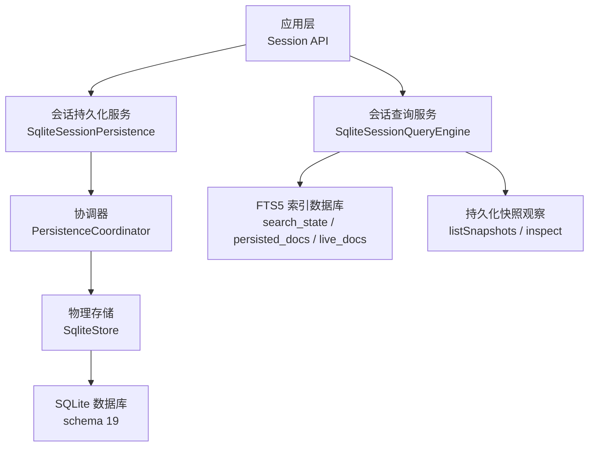
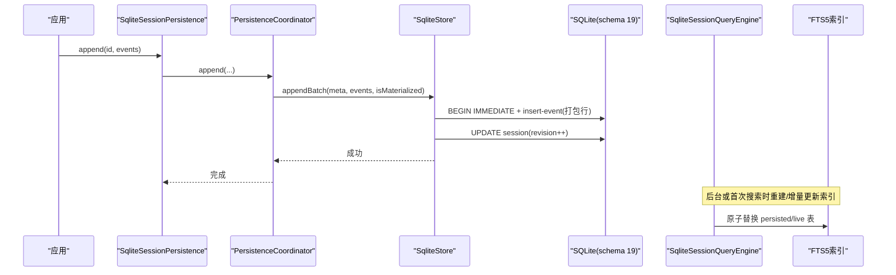
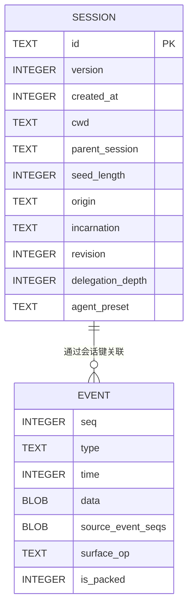
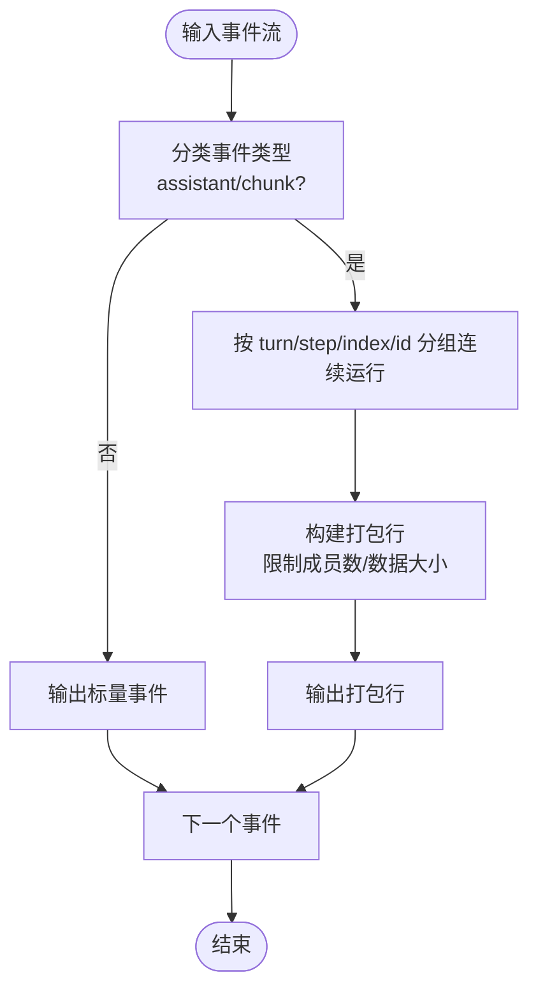
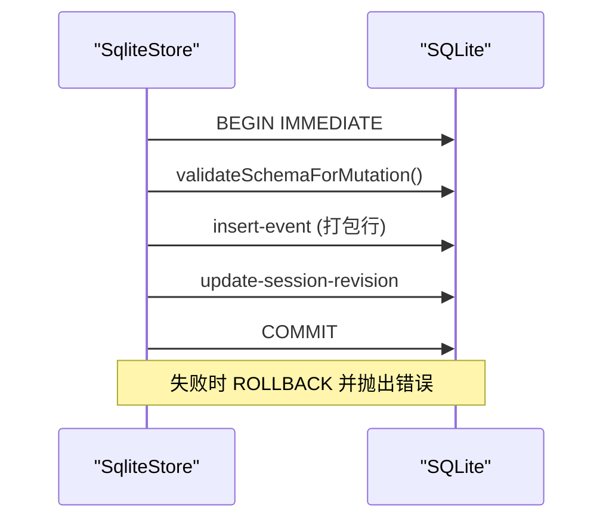
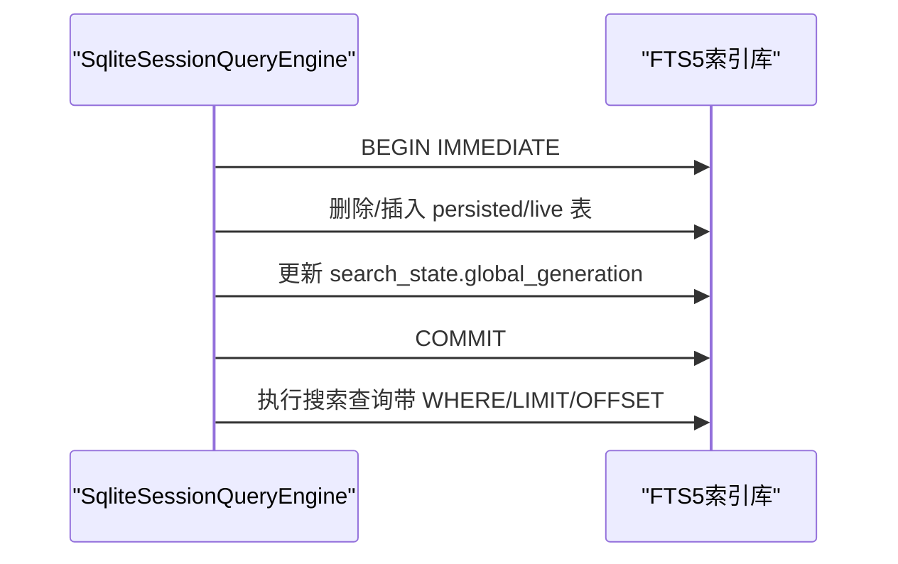
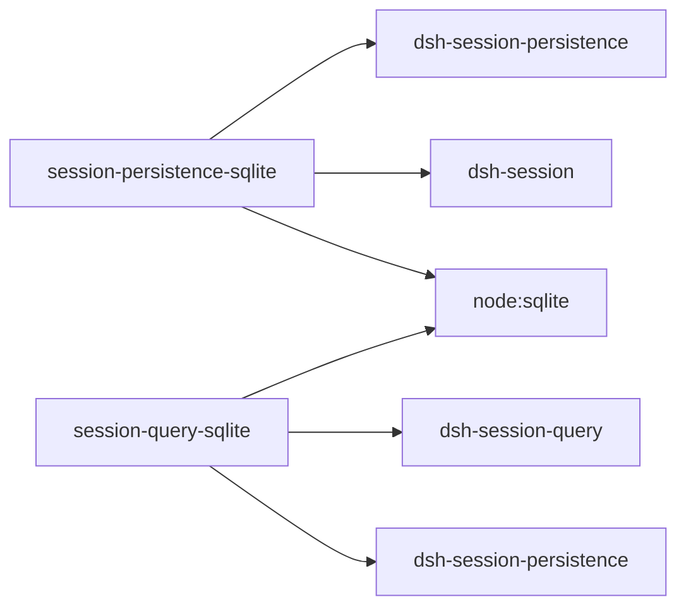

# SQLite存储后端

<cite>
**本文引用的文件**
- [packages/session/session-persistence-sqlite/src/index.ts](file://packages/session/session-persistence-sqlite/src/index.ts)
- [packages/session/session-persistence-sqlite/src/schema.ts](file://packages/session/session-persistence-sqlite/src/schema.ts)
- [packages/session/session-persistence-sqlite/src/store.ts](file://packages/session/session-persistence-sqlite/src/store.ts)
- [packages/session/session-persistence-sqlite/src/codec.ts](file://packages/session/session-persistence-sqlite/src/codec.ts)
- [packages/session-query/session-query-sqlite/src/index.ts](file://packages/session-query/session-query-sqlite/src/index.ts)
- [packages/session-query/session-query-sqlite/src/schema.ts](file://packages/session-query/session-query-sqlite/src/schema.ts)
- [packages/session/session-persistence-jsonl/src/index.ts](file://packages/session/session-persistence-jsonl/src/index.ts)
- [.agents/notes/implemented/architecture/2026-08-25-persistence-latency-and-page-size.zh.md](file://.agents/notes/implemented/architecture/2026-08-25-persistence-latency-and-page-size.zh.md)
</cite>

## 目录
1. [简介](#简介)
2. [项目结构](#项目结构)
3. [核心组件](#核心组件)
4. [架构总览](#架构总览)
5. [详细组件分析](#详细组件分析)
6. [依赖关系分析](#依赖关系分析)
7. [性能考量](#性能考量)
8. [故障排查指南](#故障排查指南)
9. [结论](#结论)
10. [附录：配置、迁移与最佳实践](#附录配置迁移与最佳实践)

## 简介
本文件为 DeepSeek Harness 的 SQLite 存储后端提供系统化技术文档，覆盖数据库 schema 设计、增量块存储机制、查询优化策略、事务处理、并发与连接管理、备份恢复、以及与 JSONL 后端的差异对比。目标是帮助开发者理解 SQLite 后端在会话持久化与检索中的角色、适用场景与调优要点。

## 项目结构
SQLite 相关实现分为两个主要包：
- 会话持久化后端：session-persistence-sqlite（负责事件追加、压缩打包、事务写入、元数据与事件行读写）
- 会话查询索引：session-query-sqlite（基于 FTS5 的全文检索索引，维护持久化与会话内存视图的合并结果）

图表来源
- [packages/session/session-persistence-sqlite/src/index.ts:54-141](file://packages/session/session-persistence-sqlite/src/index.ts#L54-L141)
- [packages/session/session-persistence-sqlite/src/store.ts:56-151](file://packages/session/session-persistence-sqlite/src/store.ts#L56-L151)
- [packages/session-query/session-query-sqlite/src/index.ts:196-313](file://packages/session-query/session-query-sqlite/src/index.ts#L196-L313)

章节来源
- [packages/session/session-persistence-sqlite/src/index.ts:1-145](file://packages/session/session-persistence-sqlite/src/index.ts#L1-L145)
- [packages/session-query/session-query-sqlite/src/index.ts:1-313](file://packages/session-query/session-query-sqlite/src/index.ts#L1-L313)

## 核心组件
- SqliteSessionPersistence：对外暴露 SessionPersistence 接口，封装配置校验、路径验证、以及通过 PersistenceCoordinator 组织写路径与缓存。
- SqliteStore：实现 PersistenceBackend<number>，负责打开/校验数据库、事务化批量追加、物理读取、修订号更新、修复提交等。
- Schema/Codec：定义 schema 版本、安全与耐久性设置、行解码、以及将连续 assistant/chunk 事件打包为紧凑的物理记录。
- SqliteSessionQueryEngine：基于 FTS5 的会话/事件搜索，维护持久化与会话内存的合并索引，支持分页、片段高亮、并发控制与可关闭模式。

章节来源
- [packages/session/session-persistence-sqlite/src/index.ts:37-141](file://packages/session/session-persistence-sqlite/src/index.ts#L37-L141)
- [packages/session/session-persistence-sqlite/src/store.ts:48-151](file://packages/session/session-persistence-sqlite/src/store.ts#L48-L151)
- [packages/session/session-persistence-sqlite/src/schema.ts:17-49](file://packages/session/session-persistence-sqlite/src/schema.ts#L17-L49)
- [packages/session/session-persistence-sqlite/src/codec.ts:32-46](file://packages/session/session-persistence-sqlite/src/codec.ts#L32-L46)
- [packages/session-query/session-query-sqlite/src/index.ts:88-125](file://packages/session-query/session-query-sqlite/src/index.ts#L88-L125)

## 架构总览
SQLite 后端采用“持久化 + 查询索引”的双库分离设计：
- 持久化库：以 schema 19 存储会话元数据与事件行，使用 WAL 模式与严格同步保证一致性；对连续的 assistant/chunk 事件进行打包压缩以减少体积并提升顺序写入吞吐。
- 查询库：独立 FTS5 索引，维护 persisted_sessions/persisted_docs 与 temp.live_sessions/temp.live_docs，按全局/本地 generation 原子更新，避免重复扫描，提高搜索稳定性与性能。

图表来源
- [packages/session/session-persistence-sqlite/src/store.ts:173-199](file://packages/session/session-persistence-sqlite/src/store.ts#L173-L199)
- [packages/session-query/session-query-sqlite/src/index.ts:395-481](file://packages/session-query/session-query-sqlite/src/index.ts#L395-L481)

## 详细组件分析

### 数据库 Schema 设计与安全性
- 版本与应用标识：schema 19，应用 ID 固定，启动时校验 user_version/application_id/user 对象集合，拒绝非预期数据库。
- 安全与耐久性：强制 trusted_schema=0、mmap_size=0、synchronous=FULL；journal_mode 支持 wal/delete/truncate/persist，默认 wal。
- 会话元数据表与会话键：会话头信息存储在单表中，通过内部自增 id 作为会话键，事件表通过会话键关联。
- 事件行：seq/type/time/data/source_event_seqs/surface_op/is_packed；is_packed 标记是否为打包行。

图表来源
- [packages/session/session-persistence-sqlite/src/schema.ts:22-46](file://packages/session/session-persistence-sqlite/src/schema.ts#L22-L46)
- [packages/session/session-persistence-sqlite/src/store.ts:288-297](file://packages/session/session-persistence-sqlite/src/store.ts#L288-L297)

章节来源
- [packages/session/session-persistence-sqlite/src/schema.ts:71-211](file://packages/session/session-persistence-sqlite/src/schema.ts#L71-L211)
- [packages/session/session-persistence-sqlite/src/store.ts:288-335](file://packages/session/session-persistence-sqlite/src/store.ts#L288-L335)

### 增量块存储机制（打包与解压）
- 打包目标：连续的 assistant/chunk 事件（text-delta/reasoning-delta/tool-call-delta）被聚合成 packed row，减少行数与序列化开销。
- 约束：每条打包行包含最小成员数、最大成员数、data 列 UTF-8 字节上限；时间差 dt 数组用于还原时间戳。
- 编码/解码：packChunkRuns 生成混合序列（标量事件与打包行），decodeStorageRecord 将打包行展开为逻辑事件序列。

图表来源
- [packages/session/session-persistence-sqlite/src/codec.ts:181-210](file://packages/session/session-persistence-sqlite/src/codec.ts#L181-L210)
- [packages/session/session-persistence-sqlite/src/codec.ts:276-322](file://packages/session/session-persistence-sqlite/src/codec.ts#L276-L322)

章节来源
- [packages/session/session-persistence-sqlite/src/codec.ts:1-344](file://packages/session/session-persistence-sqlite/src/codec.ts#L1-L344)

### 事务处理与一致性
- 写入事务：appendBatch 使用 BEGIN IMMEDIATE 获取独占写锁，校验 schema/app-id/version，插入打包行，递增 revision，COMMIT。
- 读事务：readTransaction 使用普通事务隔离读取，失败时统一回滚。
- 修复提交：commitRepair 删除损坏尾部或追加闭合事件，再次递增 revision。
- 修订号：revision 与 store identity/incarnation 组合成唯一 revision，便于上层检测变更。

图表来源
- [packages/session/session-persistence-sqlite/src/store.ts:173-199](file://packages/session/session-persistence-sqlite/src/store.ts#L173-L199)
- [packages/session/session-persistence-sqlite/src/store.ts:214-253](file://packages/session/session-persistence-sqlite/src/store.ts#L214-L253)
- [packages/session/session-persistence-sqlite/src/store.ts:305-328](file://packages/session/session-persistence-sqlite/src/store.ts#L305-L328)

章节来源
- [packages/session/session-persistence-sqlite/src/store.ts:173-335](file://packages/session/session-persistence-sqlite/src/store.ts#L173-L335)

### 查询优化策略（FTS5 索引）
- 双源合并：persisted_sessions/persisted_docs 与 temp.live_sessions/temp.live_docs 共同构成搜索结果；live 优先于 persisted。
- 原子更新：reconcile 阶段在 BEGIN IMMEDIATE 中批量删除/插入，更新 global_generation/local_generation，确保查询可见性一致。
- 分页与排序：按 match_count、document_length、time、seq 排序，支持 cursor 分页与 snippet 高亮。
- 可关闭模式：openAt 支持 startup/first-search/never，禁用时不导入 node:sqlite，避免资源占用。

图表来源
- [packages/session-query/session-query-sqlite/src/index.ts:395-481](file://packages/session-query/session-query-sqlite/src/index.ts#L395-L481)
- [packages/session-query/session-query-sqlite/src/index.ts:633-696](file://packages/session-query/session-query-sqlite/src/index.ts#L633-L696)

章节来源
- [packages/session-query/session-query-sqlite/src/index.ts:196-761](file://packages/session-query/session-query-sqlite/src/index.ts#L196-L761)
- [packages/session-query/session-query-sqlite/src/schema.ts:103-169](file://packages/session-query/session-query-sqlite/src/schema.ts#L103-L169)

### 连接池管理与并发
- 连接模型：每个 SqliteStore 持有单一 DatabaseSync 实例；通过 busyTimeoutMs 等待竞争锁，journal_mode 影响并发读写特性。
- 查询引擎串行化：_serialized 保证同一时刻仅一个搜索操作执行，避免并发冲突；_tail 队列串行化异步任务。
- 可选持久化绑定：optional persistence fiber 动态注入/移除，避免无后端时的额外开销。

章节来源
- [packages/session/session-persistence-sqlite/src/index.ts:32-49](file://packages/session/session-persistence-sqlite/src/index.ts#L32-L49)
- [packages/session/session-persistence-sqlite/src/store.ts:56-84](file://packages/session/session-persistence-sqlite/src/store.ts#L56-L84)
- [packages/session-query/session-query-sqlite/src/index.ts:371-393](file://packages/session-query/session-query-sqlite/src/index.ts#L371-L393)

### 备份与恢复
- 备份：WAL 模式下可通过 SQLite 原生备份接口复制数据库；建议先停止写入或使用只读连接。
- 恢复：直接拷贝 .db/.wal 文件并在相同 schema 版本下打开；若版本不匹配会拒绝打开。
- 索引恢复：FTS5 索引为派生数据，可按需重建；application_id 与 user_version 保护误用。

章节来源
- [packages/session/session-persistence-sqlite/src/schema.ts:152-185](file://packages/session/session-persistence-sqlite/src/schema.ts#L152-L185)
- [packages/session-query/session-query-sqlite/src/schema.ts:46-78](file://packages/session-query/session-query-sqlite/src/schema.ts#L46-L78)

## 依赖关系分析
- 持久化后端依赖：node:sqlite、@deepseek-ai/dsh-session-persistence（协调器）、@deepseek-ai/dsh-session（会话类型）。
- 查询引擎依赖：node:sqlite、@deepseek-ai/dsh-session-query（抽象引擎）、@deepseek-ai/dsh-session-persistence（快照观察）。
- 外部交互：文件系统权限校验（目录/文件所有者与权限）、进程级 emitWarning 过滤（避免实验性警告干扰）。

图表来源
- [packages/session/session-persistence-sqlite/src/index.ts:7-28](file://packages/session/session-persistence-sqlite/src/index.ts#L7-L28)
- [packages/session-query/session-query-sqlite/src/index.ts:7-24](file://packages/session-query/session-query-sqlite/src/index.ts#L7-L24)

章节来源
- [packages/session/session-persistence-sqlite/src/store.ts:458-492](file://packages/session/session-persistence-sqlite/src/store.ts#L458-L492)
- [packages/session-query/session-query-sqlite/src/index.ts:230-249](file://packages/session-query/session-query-sqlite/src/index.ts#L230-L249)

## 性能考量
- 存储体积：SQLite 在同等工作负载下较 JSONL 显著节省空间（基准显示约 46.8% 缩减），得益于打包行与 64 KiB page 利用率提升。
- 写入吞吐：SQLite 完整写入通常快于 JSONL；但更高压缩级别（如 level 19）会增加写入与 fork 耗时。
- 读取延迟：SQLite 后缀读取远快于 JSONL（顺序解析 vs 随机访问），适合频繁增量回放场景。
- 页面大小：新建数据库使用 64 KiB page，改善大行分布下的页利用率；历史库保持原 page size 以避免重写成本。

章节来源
- [.agents/notes/implemented/architecture/2026-08-25-persistence-latency-and-page-size.zh.md:31-65](file://.agents/notes/implemented/architecture/2026-08-25-persistence-latency-and-page-size.zh.md#L31-L65)

## 故障排查指南
- 数据库所有权/版本不匹配：启动时校验 application_id、user_version、用户对象集合，不匹配则拒绝打开。
- 并发忙锁：busyTimeoutMs 控制等待时长；journal_mode 选择影响锁行为；日志中出现 sqlite busy 时需检查并发写入频率。
- 索引不可用：openAt=never 时搜索将被拒绝；index 打开失败会抛出 SESSION_QUERY_INDEX_FAILED。
- 修复失败：commitRepair 要求 tornMarker 与实际尾部一致，否则报错；修复后需重新递增 revision。

章节来源
- [packages/session/session-persistence-sqlite/src/schema.ts:107-150](file://packages/session/session-persistence-sqlite/src/schema.ts#L107-L150)
- [packages/session/session-persistence-sqlite/src/store.ts:214-253](file://packages/session/session-persistence-sqlite/src/store.ts#L214-L253)
- [packages/session-query/session-query-sqlite/src/index.ts:321-332](file://packages/session-query/session-query-sqlite/src/index.ts#L321-L332)

## 结论
SQLite 后端通过 schema 19 的紧凑行模型、WAL 与严格同步、打包压缩与 FTS5 索引，提供了高吞吐写入、低延迟后缀读取与高效全文检索能力。相比 JSONL 后端，SQLite 更适合需要跨会话查询、强一致性与快速增量回放的工作负载；JSONL 则在简单追加、原始 artifact 直读与更轻量的部署场景中具备优势。实际选型应结合存储体积、读写延迟、并发模式与运维复杂度综合评估。

## 附录：配置、迁移与最佳实践

### 配置参数说明（SQLite 持久化）
- path：数据库路径或 :memory:
- journalMode：wal/delete/truncate/persist，默认 wal
- busyTimeoutMs：等待锁的最大毫秒数，默认 5000
- preparedSessionCacheSize：冷准备缓存大小
- writeBatchMaxDelayMs：事件合并窗口

章节来源
- [packages/session/session-persistence-sqlite/src/index.ts:37-67](file://packages/session/session-persistence-sqlite/src/index.ts#L37-L67)

### 配置参数说明（SQLite 查询）
- path：索引数据库路径或 :memory:
- openAt：startup/first-search/never
- journalMode：wal/delete/truncate/persist，默认 wal
- defaultLimit/maxLimit：分页限制
- snippetChars：片段长度
- persistedInspectConcurrency：持久化扫描并发度

章节来源
- [packages/session-query/session-query-sqlite/src/index.ts:88-125](file://packages/session-query/session-query-sqlite/src/index.ts#L88-L125)

### 迁移指南
- 版本升级：schema 19 拒绝其他版本；如需迁移，需重建数据库。
- 索引重建：FTS5 索引为派生数据，可按需重建；application_id 与 user_version 保护误用。
- 路径与权限：确保目录/文件所有者与权限符合安全校验（POSIX uid/mode 检查）。

章节来源
- [packages/session/session-persistence-sqlite/src/schema.ts:118-150](file://packages/session/session-persistence-sqlite/src/schema.ts#L118-L150)
- [packages/session-query/session-query-sqlite/src/schema.ts:55-78](file://packages/session-query/session-query-sqlite/src/schema.ts#L55-L78)
- [packages/session/session-persistence-sqlite/src/store.ts:422-448](file://packages/session/session-persistence-sqlite/src/store.ts#L422-L448)

### 最佳实践
- 使用 WAL 模式以获得更好的并发读性能。
- 合理设置 busyTimeoutMs，避免长时间阻塞。
- 利用打包行减少存储体积与 I/O 次数。
- 对高频搜索场景启用 FTS5 索引，并根据负载调整 persistedInspectConcurrency。
- 定期备份数据库与索引，注意 WAL 文件的完整性。

[本节为通用指导，无需特定文件来源]