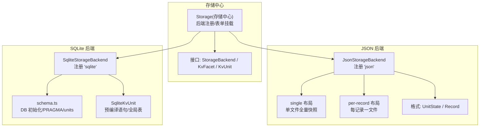
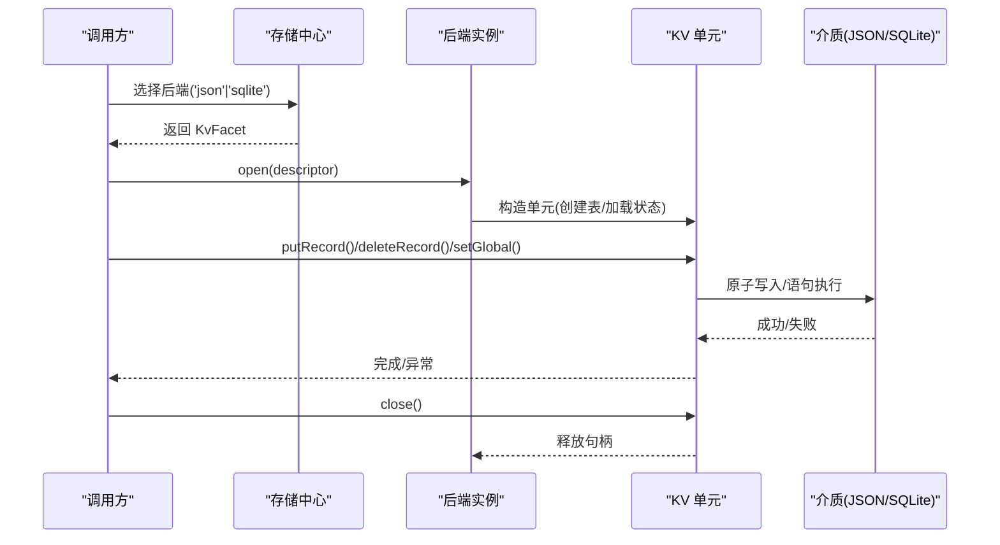
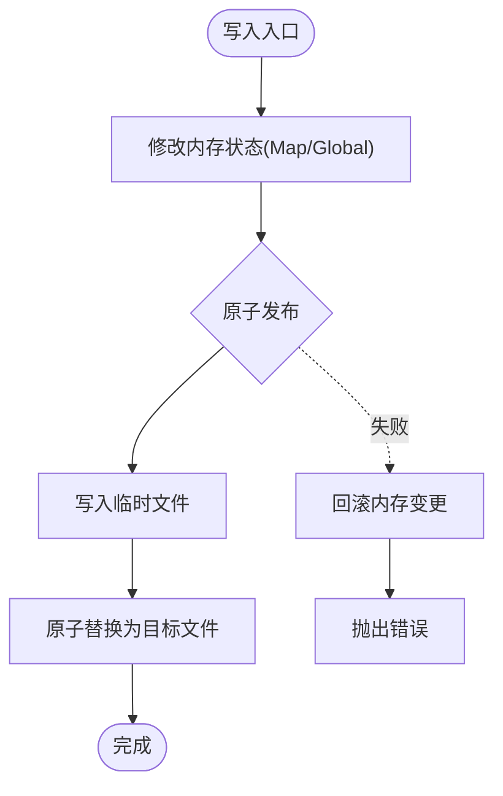
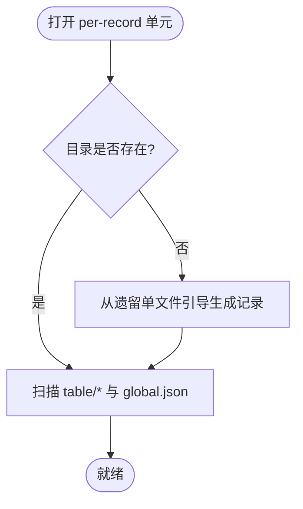
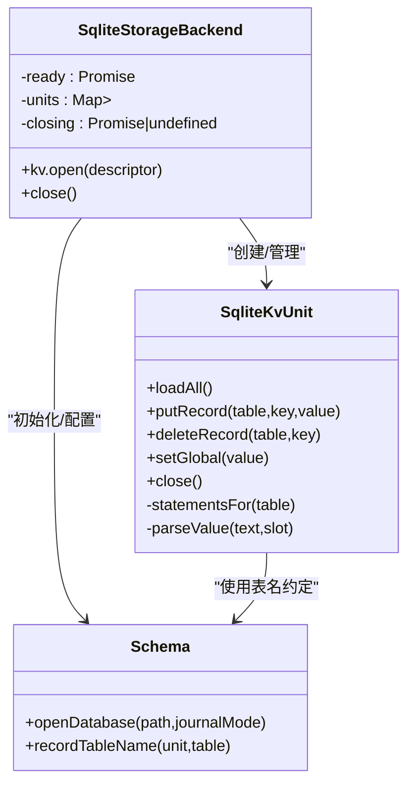
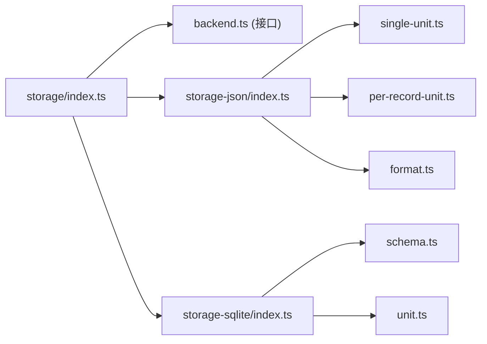

# 存储后端实现

<cite>
**本文引用的文件**
- [packages/storage/storage/src/backend.ts](file://packages/storage/storage/src/backend.ts)
- [packages/storage/storage/src/index.ts](file://packages/storage/storage/src/index.ts)
- [packages/storage/storage-json/src/index.ts](file://packages/storage/storage-json/src/index.ts)
- [packages/storage/storage-json/src/single-unit.ts](file://packages/storage/storage-json/src/single-unit.ts)
- [packages/storage/storage-json/src/per-record-unit.ts](file://packages/storage/storage-json/src/per-record-unit.ts)
- [packages/storage/storage-json/src/format.ts](file://packages/storage/storage-json/src/format.ts)
- [packages/storage/storage-sqlite/src/index.ts](file://packages/storage/storage-sqlite/src/index.ts)
- [packages/storage/storage-sqlite/src/schema.ts](file://packages/storage/storage-sqlite/src/schema.ts)
- [packages/storage/storage-sqlite/src/unit.ts](file://packages/storage/storage-sqlite/src/unit.ts)
</cite>

## 目录
1. [简介](#简介)
2. [项目结构](#项目结构)
3. [核心组件](#核心组件)
4. [架构总览](#架构总览)
5. [详细组件分析](#详细组件分析)
6. [依赖关系分析](#依赖关系分析)
7. [性能考量](#性能考量)
8. [故障排查指南](#故障排查指南)
9. [结论](#结论)
10. [附录：配置与最佳实践](#附录配置与最佳实践)

## 简介
本文件面向 DeepSeek Harness 的持久化存储后端，聚焦 JSONL/JSON 与 SQLite 两种 KV 存储后端的实现原理、数据布局、原子写入、崩溃恢复、并发与事务特性，以及适用场景与性能权衡。文档同时提供架构图、调用时序图、流程图和配置示例，帮助读者快速理解并正确选型与使用。

## 项目结构
存储子系统由“存储中心 + 多后端插件”构成：
- 存储中心（storage）定义统一接口 StorageBackend/KvFacet/KvUnit，并提供后端注册表与生命周期服务键。
- JSON 后端（storage-json）以文件系统为介质，支持 single 与 per-record 两种布局，通过原子写入保证一致性。
- SQLite 后端（storage-sqlite）以单数据库文件承载所有单元，按单元名派生物理表名，利用 SQLite 自身原子性与 WAL 模式保障一致性与并发。

图表来源
- [packages/storage/storage/src/index.ts:1-99](file://packages/storage/storage/src/index.ts#L1-L99)
- [packages/storage/storage/src/backend.ts:17-115](file://packages/storage/storage/src/backend.ts#L17-L115)
- [packages/storage/storage-json/src/index.ts:38-119](file://packages/storage/storage-json/src/index.ts#L38-L119)
- [packages/storage/storage-json/src/single-unit.ts:28-149](file://packages/storage/storage-json/src/single-unit.ts#L28-L149)
- [packages/storage/storage-json/src/per-record-unit.ts:47-276](file://packages/storage/storage-json/src/per-record-unit.ts#L47-L276)
- [packages/storage/storage-json/src/format.ts:15-124](file://packages/storage/storage-json/src/format.ts#L15-L124)
- [packages/storage/storage-sqlite/src/index.ts:50-169](file://packages/storage/storage-sqlite/src/index.ts#L50-L169)
- [packages/storage/storage-sqlite/src/schema.ts:61-121](file://packages/storage/storage-sqlite/src/schema.ts#L61-L121)
- [packages/storage/storage-sqlite/src/unit.ts:27-157](file://packages/storage/storage-sqlite/src/unit.ts#L27-L157)

章节来源
- [packages/storage/storage/src/index.ts:1-99](file://packages/storage/storage/src/index.ts#L1-L99)
- [packages/storage/storage/src/backend.ts:17-115](file://packages/storage/storage/src/backend.ts#L17-L115)

## 核心组件
- 存储中心（Storage）
  - 提供后端注册表（BackendRegistry），允许多个后端并存。
  - 暴露 storageBackendServiceKey 用于生命周期服务注入。
  - 支持数据形式（Forms）挂载，供上层领域层扩展。
- 后端契约（StorageBackend/KvFacet/KvUnit）
  - KvFacet.open：打开一个 KV 单元，校验名称、版本与表声明。
  - KvUnit：loadAll/putRecord/deleteRecord/setGlobal/close，要求每次调用在介质上原子且持久化。
  - 并发与顺序：单元不序列化并发写；写序由调用方（领域层写链）保证。

章节来源
- [packages/storage/storage/src/index.ts:17-99](file://packages/storage/storage/src/index.ts#L17-L99)
- [packages/storage/storage/src/backend.ts:17-115](file://packages/storage/storage/src/backend.ts#L17-L115)

## 架构总览
JSON 与 SQLite 后端均遵循同一 KV 契约，但介质与一致性模型不同：
- JSON 后端：文件系统介质，single 布局为单文件全量快照；per-record 布局为目录树，每记录独立文件。通过原子写入（先写临时再替换）确保崩溃安全。
- SQLite 后端：单数据库文件，units/unit_globals 元数据表 + 每个单元的 u_<unit>_<table> 记录表。通过 PRAGMA journal_mode=WAL 提升并发读写能力，每条语句天然原子。

图表来源
- [packages/storage/storage/src/index.ts:47-99](file://packages/storage/storage/src/index.ts#L47-L99)
- [packages/storage/storage-json/src/index.ts:38-119](file://packages/storage/storage-json/src/index.ts#L38-L119)
- [packages/storage/storage-sqlite/src/index.ts:55-169](file://packages/storage/storage-sqlite/src/index.ts#L55-L169)
- [packages/storage/storage-json/src/single-unit.ts:52-149](file://packages/storage/storage-json/src/single-unit.ts#L52-L149)
- [packages/storage/storage-json/src/per-record-unit.ts:180-276](file://packages/storage/storage-json/src/per-record-unit.ts#L180-L276)
- [packages/storage/storage-sqlite/src/unit.ts:27-157](file://packages/storage/storage-sqlite/src/unit.ts#L27-L157)

## 详细组件分析

### JSON 后端：single 布局（单文件全量快照）
- 介质布局
  - 路径：<root>/<name>.json，包含 unit 头（name/version）、global 与 tables 映射。
- 内存模型
  - 维护 UnitState（tables Map + global），作为权威状态。
- 写入流程
  - putRecord/deleteRecord/setGlobal 修改内存后，调用 publish 进行原子写入。
  - 原子写入采用“先写临时文件再替换”的策略，避免部分写入导致损坏。
- 崩溃恢复
  - 启动时读取文件解析为 UnitState；若文件不存在则视为空单元，首次写入才落盘。
  - 版本不匹配会拒绝打开，防止旧格式污染。
- 并发与顺序
  - 单元内不排队写操作；写序由调用方串行化。
  - close 会等待所有 in-flight 写入完成后释放。

图表来源
- [packages/storage/storage-json/src/single-unit.ts:74-149](file://packages/storage/storage-json/src/single-unit.ts#L74-L149)
- [packages/storage/storage-json/src/format.ts:28-88](file://packages/storage/storage-json/src/format.ts#L28-L88)

章节来源
- [packages/storage/storage-json/src/single-unit.ts:28-149](file://packages/storage/storage-json/src/single-unit.ts#L28-L149)
- [packages/storage/storage-json/src/format.ts:15-88](file://packages/storage/storage-json/src/format.ts#L15-L88)

### JSON 后端：per-record 布局（每记录一文件）
- 介质布局
  - 路径：<root>/<name>/，子目录 table/<key>.json，global.json 存放全局值。
- 无内存状态
  - 该单元不缓存状态；loadAll 实时扫描目录重建状态。
- 写入流程
  - 每个记录独立文件，putRecord 原子替换单个文件；deleteRecord 删除对应文件。
  - 关键路径需满足安全字符集，避免跨平台路径问题。
- 崩溃恢复与迁移
  - 首次打开若新目录为空，会从遗留的全局单文件（<root>/<name>.json）引导生成 per-record 文档，但不修改或删除原文件。
  - 对损坏或版本不符的记录文件，读取时视为缺失，不会破坏整个单元。
- 并发与顺序
  - 同样不排队写；close 等待 in-flight 写入完成。

图表来源
- [packages/storage/storage-json/src/per-record-unit.ts:47-172](file://packages/storage/storage-json/src/per-record-unit.ts#L47-L172)
- [packages/storage/storage-json/src/format.ts:97-124](file://packages/storage/storage-json/src/format.ts#L97-L124)

章节来源
- [packages/storage/storage-json/src/per-record-unit.ts:47-276](file://packages/storage/storage-json/src/per-record-unit.ts#L47-L276)
- [packages/storage/storage-json/src/format.ts:90-124](file://packages/storage/storage-json/src/format.ts#L90-L124)

### SQLite 后端：Schema、增量块与事务
- Schema 设计
  - units(name, version)：记录每个单元的格式版本。
  - unit_globals(unit, value)：每个单元的全局值。
  - 记录表：u_<unit>_<table>(key TEXT PRIMARY KEY, value TEXT NOT NULL)，value 为 JSON 文本。
- 数据库初始化
  - 创建目录与数据库文件（权限 0o600）。
  - 设置 PRAGMA foreign_keys=ON 与 journal_mode（默认 WAL）。
  - user_version 必须等于当前构建版本，否则拒绝打开。
- 单元材料化
  - 检查/写入 units 行，按 descriptor.tables 动态创建记录表。
  - 预编译 upsert/remove/selectAll 语句，减少重复开销。
- 事务与原子性
  - 每条语句天然原子；读全量 loadAll 遍历各表并解析 JSON。
  - 不支持显式事务边界，但可通过应用层组合多条语句实现逻辑事务。
- 并发与性能
  - WAL 模式提升并发读/写吞吐；适合本地磁盘。网络挂载可切换为 delete/truncate/persist。

图表来源
- [packages/storage/storage-sqlite/src/index.ts:55-169](file://packages/storage/storage-sqlite/src/index.ts#L55-L169)
- [packages/storage/storage-sqlite/src/schema.ts:61-121](file://packages/storage/storage-sqlite/src/schema.ts#L61-L121)
- [packages/storage/storage-sqlite/src/unit.ts:27-157](file://packages/storage/storage-sqlite/src/unit.ts#L27-L157)

章节来源
- [packages/storage/storage-sqlite/src/index.ts:50-169](file://packages/storage/storage-sqlite/src/index.ts#L50-L169)
- [packages/storage/storage-sqlite/src/schema.ts:1-121](file://packages/storage/storage-sqlite/src/schema.ts#L1-L121)
- [packages/storage/storage-sqlite/src/unit.ts:1-157](file://packages/storage/storage-sqlite/src/unit.ts#L1-L157)

### 对比：JSON 与 SQLite 后端
- 读写性能
  - JSON single：小单元、低并发写场景下简单高效；大单元写会重写整文件。
  - JSON per-record：细粒度更新，适合稀疏/大记录；频繁目录扫描可能带来 I/O 开销。
  - SQLite：高并发读写更优，WAL 模式降低锁竞争；适合大量记录与复杂查询需求。
- 存储空间
  - JSON 单文件可读性强，便于人工编辑；per-record 碎片化程度更高。
  - SQLite 以 B+ 树组织，空间利用率较高，但存在页大小等系统开销。
- 并发访问
  - JSON：进程内并发写需外部串行化；原子写入避免损坏。
  - SQLite：WAL 允许多读一写，适合高并发读/写混合负载。
- 扩展性
  - JSON：易于备份/迁移；但跨进程共享困难。
  - SQLite：单文件易迁移；需注意 WAL 共享内存文件在网络挂载上的限制。

[本节为概念性对比，不直接引用具体代码]

## 依赖关系分析
- 存储中心依赖后端注册表，JSON/SQLite 后端通过 apply 注册到 hub。
- JSON 后端依赖文件系统 API 与原子写入工具；per-record 布局还依赖目录遍历与递归创建。
- SQLite 后端依赖 node:sqlite 同步 API，并通过 schema.ts 管理 PRAGMA 与表结构。

图表来源
- [packages/storage/storage/src/index.ts:1-99](file://packages/storage/storage/src/index.ts#L1-L99)
- [packages/storage/storage/src/backend.ts:17-115](file://packages/storage/storage/src/backend.ts#L17-L115)
- [packages/storage/storage-json/src/index.ts:38-119](file://packages/storage/storage-json/src/index.ts#L38-L119)
- [packages/storage/storage-json/src/single-unit.ts:28-149](file://packages/storage/storage-json/src/single-unit.ts#L28-L149)
- [packages/storage/storage-json/src/per-record-unit.ts:47-276](file://packages/storage/storage-json/src/per-record-unit.ts#L47-L276)
- [packages/storage/storage-json/src/format.ts:15-124](file://packages/storage/storage-json/src/format.ts#L15-L124)
- [packages/storage/storage-sqlite/src/index.ts:50-169](file://packages/storage/storage-sqlite/src/index.ts#L50-L169)
- [packages/storage/storage-sqlite/src/schema.ts:61-121](file://packages/storage/storage-sqlite/src/schema.ts#L61-L121)
- [packages/storage/storage-sqlite/src/unit.ts:27-157](file://packages/storage/storage-sqlite/src/unit.ts#L27-L157)

章节来源
- [packages/storage/storage/src/index.ts:1-99](file://packages/storage/storage/src/index.ts#L1-L99)
- [packages/storage/storage-json/src/index.ts:38-119](file://packages/storage/storage-json/src/index.ts#L38-L119)
- [packages/storage/storage-sqlite/src/index.ts:50-169](file://packages/storage/storage-sqlite/src/index.ts#L50-L169)

## 性能考量
- JSON single 布局
  - 优点：结构简单、I/O 次数少；适合小单元与低频写。
  - 缺点：大单元写成本高；并发写需外部串行化。
- JSON per-record 布局
  - 优点：细粒度更新，局部写入；版本升级时仅丢弃陈旧记录。
  - 缺点：目录扫描与大量小文件 I/O 可能成为瓶颈。
- SQLite
  - 优点：WAL 模式提升并发；索引与查询优化能力强；适合大规模数据。
  - 注意：网络挂载建议关闭 WAL 或使用 rollback journal 模式；避免共享内存文件不可用。
- 通用建议
  - 将写序列化为单链（领域层已负责），避免并发写竞争。
  - 合理划分单元与表，控制单单元规模，提高缓存命中与 I/O 效率。
  - 监控 I/O 延迟与文件大小，适时拆分单元或切换后端。

[本节为通用指导，不直接引用具体代码]

## 故障排查指南
- 常见错误码与含义
  - closed：后端或单元已关闭，继续调用将拒绝。
  - malformed-medium：介质格式非法（JSON 解析失败、字段缺失、非对象等）。
  - version-mismatch：介质版本与期望版本不一致（JSON 单元头或 SQLite user_version）。
- 定位步骤
  - 确认单元名与表名符合命名规范（UNIT_NAME_RE）。
  - 检查 JSON 文件是否完整、可解析；per-record 布局中损坏记录会被忽略，不影响整体。
  - 检查 SQLite 的 journal_mode 与 user_version；必要时重建数据库或调整模式。
  - 关注 close 行为：后端 close 会等待 in-flight 写入完成，期间不应再次使用。
- 日志与诊断
  - 捕获 StorageError 的 cause 信息，结合路径与单元名定位问题。
  - 对 per-record 布局，检查目录结构与文件权限（0o700/0o600）。

章节来源
- [packages/storage/storage/src/error.ts:20-20](file://packages/storage/storage/src/error.ts#L20-L20)
- [packages/storage/storage-json/src/format.ts:47-88](file://packages/storage/storage-json/src/format.ts#L47-L88)
- [packages/storage/storage-sqlite/src/schema.ts:77-108](file://packages/storage/storage-sqlite/src/schema.ts#L77-L108)
- [packages/storage/storage-sqlite/src/unit.ts:86-97](file://packages/storage/storage-sqlite/src/unit.ts#L86-L97)

## 结论
- 若追求可移植、易读与简单部署，且数据规模较小、写并发不高，JSON 后端（尤其是 per-record）是良好选择。
- 若需要高并发读写、复杂查询与更好的空间利用率，SQLite 后端更合适；注意选择合适的 journal_mode 与部署环境。
- 无论选择哪种后端，都应遵循 KV 契约：写序由调用方保证、每次调用原子持久化、正确处理版本与格式校验。

[本节为总结性内容，不直接引用具体代码]

## 附录：配置与最佳实践

- JSON 后端配置要点
  - root：必须显式指定，避免散落到任意工作目录。
  - layout：
    - single：适合小单元、低频写。
    - per-record：适合大单元、稀疏记录与高频局部更新。
  - 权限：目录与文件建议使用严格权限（如 0o700/0o600）。
- SQLite 后端配置要点
  - path：可使用 ':memory:' 进行测试；生产建议使用持久化路径。
  - journalMode：
    - wal：默认，适合本地磁盘，提升并发。
    - delete/truncate/persist：适用于网络挂载等不支持 WAL 共享内存的场景。
  - 版本：user_version 必须与构建版本一致，否则拒绝打开。
- 最佳实践
  - 写串行化：确保同一单元的写操作串行执行，避免并发写竞争。
  - 单元拆分：按业务域拆分单元，控制单单元大小，提升性能与可维护性。
  - 备份策略：
    - JSON：直接复制文件或目录。
    - SQLite：关闭连接后进行冷备；或在 WAL 模式下谨慎处理共享内存文件。
  - 监控与告警：跟踪 I/O 延迟、文件大小、WAL 文件大小与错误率。

章节来源
- [packages/storage/storage-json/src/index.ts:22-36](file://packages/storage/storage-json/src/index.ts#L22-L36)
- [packages/storage/storage-sqlite/src/index.ts:23-48](file://packages/storage/storage-sqlite/src/index.ts#L23-L48)
- [packages/storage/storage-sqlite/src/schema.ts:22-29](file://packages/storage/storage-sqlite/src/schema.ts#L22-L29)