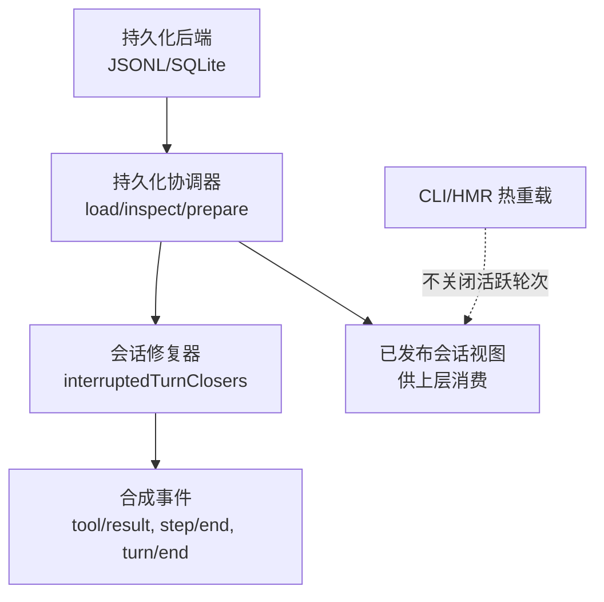
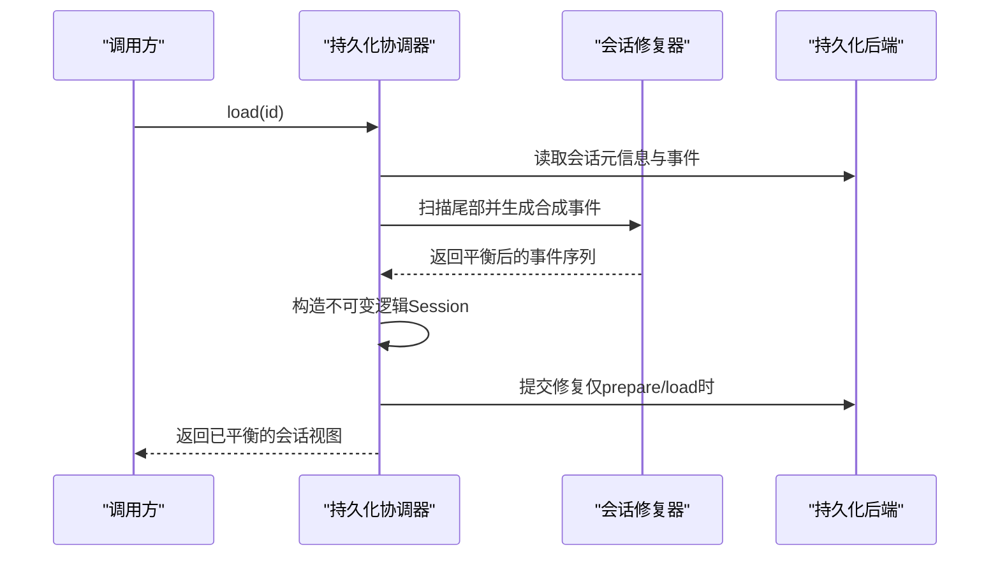
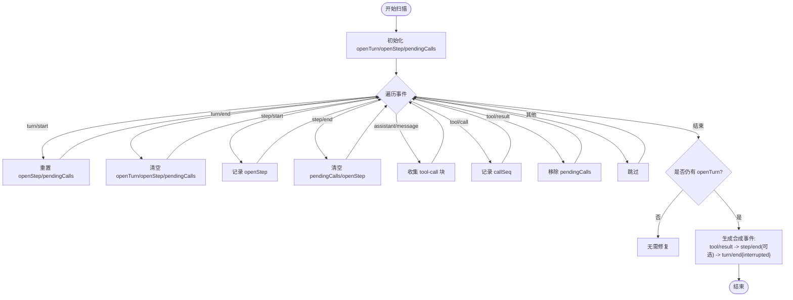
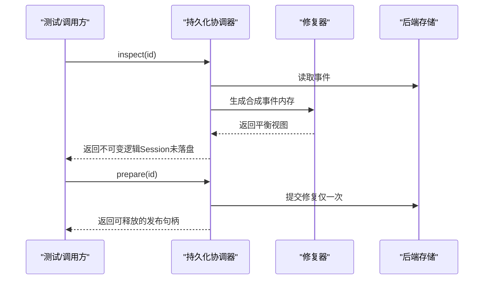

# 崩溃恢复机制

<cite>
**本文引用的文件**
- [packages/core/session/src/repair.ts](file://packages/core/session/src/repair.ts)
- [packages/core/session/src/types.ts](file://packages/core/session/src/types.ts)
- [packages/session/session-persistence/src/coordinator.ts](file://packages/session/session-persistence/src/coordinator.ts)
- [packages/session/session-persistence/tests/persistence.spec.ts](file://packages/session/session-persistence/tests/persistence.spec.ts)
- [packages/core/agent-loop/tests/coverage-edges.spec.ts](file://packages/core/agent-loop/tests/coverage-edges.spec.ts)
- [packages/llm/llm-retry/src/index.ts](file://packages/llm/llm-retry/src/index.ts)
- [apps/cli/src/profile-boot.ts](file://apps/cli/src/profile-boot.ts)
- [docs/subsystems/persistence.zh.md](file://docs/subsystems/persistence.zh.md)
</cite>

## 目录
1. [简介](#简介)
2. [项目结构](#项目结构)
3. [核心组件](#核心组件)
4. [架构总览](#架构总览)
5. [详细组件分析](#详细组件分析)
6. [依赖关系分析](#依赖关系分析)
7. [性能考量](#性能考量)
8. [故障排除指南](#故障排除指南)
9. [结论](#结论)

## 简介
本文件面向DeepSeek Harness的会话崩溃恢复系统，聚焦以下目标：
- 解释中断会话的检测与处理机制，特别是turn/start与turn/end的平衡检查。
- 完整阐述崩溃恢复流程：从检测到异常中断到生成合成turn/end事件的全过程。
- 说明恢复过程中的数据一致性保证：如何避免数据丢失与重复处理。
- 对比冷启动恢复与热重载恢复的不同策略。
- 提供错误处理示例与故障排除指南。

## 项目结构
围绕崩溃恢复的关键代码分布在以下模块：
- 会话修复器：负责扫描持久化日志尾部，检测未闭合的turn/step/tool调用，并生成确定性合成事件以闭合会话。
- 持久化协调器：负责加载、准备、提交恢复结果，确保并发安全与幂等性。
- 类型与语义：定义turn结束原因（含interrupted）、事件边界与版本控制。
- 测试与行为验证：覆盖“仅内存中配平”“仅在prepare时提交修复”“无重试动作时的终端状态”等关键场景。
- CLI/HMR：热重载路径不关闭正在进行的轮次，避免对活跃会话施加合成关闭。

图表来源
- [packages/session/session-persistence/src/coordinator.ts:772-798](file://packages/session/session-persistence/src/coordinator.ts#L772-L798)
- [packages/core/session/src/repair.ts:27-132](file://packages/core/session/src/repair.ts#L27-L132)
- [docs/subsystems/persistence.zh.md:17-19](file://docs/subsystems/persistence.zh.md#L17-L19)

章节来源
- [packages/session/session-persistence/src/coordinator.ts:772-798](file://packages/session/session-persistence/src/coordinator.ts#L772-L798)
- [packages/core/session/src/repair.ts:27-132](file://packages/core/session/src/repair.ts#L27-L132)
- [docs/subsystems/persistence.zh.md:17-19](file://docs/subsystems/persistence.zh.md#L17-L19)

## 核心组件
- 会话修复器（repair.ts）
  - 功能：扫描已提交的持久化事件前缀，检测未闭合的turn/step以及未完成的工具调用；按顺序生成合成tool/result、step/end、turn/end以闭合尾部。
  - 关键点：
    - 在turn边界重置待处理集合，防止历史调用泄漏到尾部修复。
    - 使用最后一条真实事件的seq与time作为合成事件的基准，保证时间单调且可复现。
    - 为未记录结果的tool调用生成带诊断信息的错误结果，区分“未开始”和“结果未知”。
- 持久化协调器（coordinator.ts）
  - 功能：提供load/inspect/prepare等接口，负责读取存储、构造不可变逻辑Session、提交恢复内容、并发保护与幂等提交。
  - 关键点：
    - inspect：仅构造不可变逻辑视图，不写入恢复内容；允许包含未闭合轮次的快照。
    - prepare/load：预留、提交修复，返回可释放的句柄；多次调用复用同一份准备结果，避免重复修复。
    - 并发：等待活跃会话退休、避免对活跃会话进行恢复写入。
- 类型与语义（types.ts）
  - 定义turn结束原因map，包含completed、aborted、blocked、error、max-tokens、interrupted等。
  - interrupted用于标识由持久化层在重启时闭合的异常中断turn。
- 测试与行为验证
  - 验证“inspect期间合成修复仅内存可见”“prepare时才提交一次”“无重试动作时turn以error终止”等。

章节来源
- [packages/core/session/src/repair.ts:27-132](file://packages/core/session/src/repair.ts#L27-L132)
- [packages/core/session/src/types.ts:152-177](file://packages/core/session/src/types.ts#L152-L177)
- [packages/session/session-persistence/tests/persistence.spec.ts:998-1040](file://packages/session/session-persistence/tests/persistence.spec.ts#L998-L1040)
- [packages/core/agent-loop/tests/coverage-edges.spec.ts:421-440](file://packages/core/agent-loop/tests/coverage-edges.spec.ts#L421-L440)

## 架构总览
崩溃恢复的整体流程如下：
1. 启动或访问会话时，持久化协调器尝试加载会话。
2. 若存在活跃会话，直接返回其快照；否则进入准备阶段。
3. 准备阶段读取持久化日志，构造不可变Session，并在内存中应用修复器生成合成事件，得到“逻辑上平衡”的事件序列。
4. 当调用prepare或load时，将内存中的修复提交到底层存储，确保只写一次。
5. 上层消费该逻辑视图，继续执行或回放。

图表来源
- [packages/session/session-persistence/src/coordinator.ts:772-798](file://packages/session/session-persistence/src/coordinator.ts#L772-L798)
- [packages/core/session/src/repair.ts:27-132](file://packages/core/session/src/repair.ts#L27-L132)

章节来源
- [packages/session/session-persistence/src/coordinator.ts:772-798](file://packages/session/session-persistence/src/coordinator.ts#L772-L798)
- [packages/core/session/src/repair.ts:27-132](file://packages/core/session/src/repair.ts#L27-L132)

## 详细组件分析

### 中断检测与turn/start–turn/end平衡检查
- 平衡规则
  - 每个turn必须成对出现turn/start与turn/end。
  - 每个step必须成对出现step/start与step/end。
  - assistant/message中的tool-call块需有对应的tool/result完成。
- 修复器行为
  - 遍历事件流，维护openTurn、openStep与pendingCalls。
  - 遇到assistant/message的tool-call块加入待完成集合；tool/call记录其seq以便溯源；tool/result移除对应条目。
  - 到达日志末尾时，若仍存在openTurn，则判定为崩溃尾部，需要合成闭合。
- 合成事件顺序
  - 先为所有未完成调用生成tool/result（区分“未开始”与“结果未知”）。
  - 再闭合openStep（如有）。
  - 最后追加turn/end { kind: 'interrupted' }。

图表来源
- [packages/core/session/src/repair.ts:27-132](file://packages/core/session/src/repair.ts#L27-L132)

章节来源
- [packages/core/session/src/repair.ts:27-132](file://packages/core/session/src/repair.ts#L27-L132)

### 崩溃恢复完整流程
- 触发点
  - 调用load/inspect/prepare时，协调器会读取持久化数据并构造逻辑Session。
- 内存中配平
  - 修复器生成合成事件，使逻辑视图始终平衡；但不会立即落盘。
- 提交修复
  - 仅在prepare或load时提交一次修复，避免重复写入。
- 并发与幂等
  - 通过预留与检查当前源是否变更，确保并发下只提交一次。
  - 外部持续写入可能延迟收敛，但最终会稳定。

图表来源
- [packages/session/session-persistence/tests/persistence.spec.ts:998-1040](file://packages/session/session-persistence/tests/persistence.spec.ts#L998-L1040)
- [packages/session/session-persistence/src/coordinator.ts:772-798](file://packages/session/session-persistence/src/coordinator.ts#L772-L798)

章节来源
- [packages/session/session-persistence/tests/persistence.spec.ts:998-1040](file://packages/session/session-persistence/tests/persistence.spec.ts#L998-L1040)
- [packages/session/session-persistence/src/coordinator.ts:772-798](file://packages/session/session-persistence/src/coordinator.ts#L772-L798)

### 数据一致性保证
- 避免数据丢失
  - 保留最后一次完整写入的turn及其全部步骤与工具输出；即使崩溃也尽量保留最大工作成果。
  - 为未记录的tool调用生成诊断性错误结果，提示下游是否需要重试或人工确认。
- 避免重复处理
  - 修复器基于确定性的扫描与顺序生成合成事件，结合seq/time复用最后真实事件，保证可重放与幂等。
  - 协调器在prepare/load时提交修复，并通过预留与当前源检查避免重复提交。
- 版本与校验
  - 会话格式版本在头信息中固化，加载时强制校验，防止旧运行时误读新日志。

章节来源
- [packages/core/session/src/types.ts:33-56](file://packages/core/session/src/types.ts#L33-L56)
- [packages/core/session/src/repair.ts:77-132](file://packages/core/session/src/repair.ts#L77-L132)
- [packages/session/session-persistence/src/coordinator.ts:772-798](file://packages/session/session-persistence/src/coordinator.ts#L772-L798)

### 冷启动恢复与热重载恢复策略
- 冷启动恢复
  - 适用于非活跃会话：协调器读取持久化日志，内存中配平，必要时提交修复，返回平衡视图。
  - 适合首次加载、离线回放、跨进程恢复等场景。
- 热重载恢复
  - HMR接管活跃前缀，不关闭其中正在进行的轮次；因此不会对活跃会话添加合成的中断边界。
  - 配置热重载不得杀死或降级运行中的应用，保持生命周期稳定。

章节来源
- [docs/subsystems/persistence.zh.md:17-19](file://docs/subsystems/persistence.zh.md#L17-L19)
- [apps/cli/src/profile-boot.ts:276-307](file://apps/cli/src/profile-boot.ts#L276-L307)

### 错误处理示例
- 无重试动作时的失败turn
  - 当请求错误且无下游重试动作时，turn以error终止，事件流中包含turn/end { kind: 'error' }。
- LLM重试策略
  - 支持always模式与可重试错误码列表；可组合下游专用恢复策略，最终决定是否重试。
- 工具调用中断
  - 合成tool/result携带诊断信息，指示“未开始”或“结果未知”，便于上层决策是否重试或人工介入。

章节来源
- [packages/core/agent-loop/tests/coverage-edges.spec.ts:421-440](file://packages/core/agent-loop/tests/coverage-edges.spec.ts#L421-L440)
- [packages/llm/llm-retry/src/index.ts:156-179](file://packages/llm/llm-retry/src/index.ts#L156-L179)
- [packages/core/session/src/repair.ts:89-123](file://packages/core/session/src/repair.ts#L89-L123)

## 依赖关系分析
- 修复器依赖LLM消息类型与工具调用ID，确保合成消息结构合法。
- 协调器依赖持久化后端实现读取与提交；通过预留机制避免并发冲突。
- 类型定义集中管理turn结束原因与版本控制，贯穿各层。

图表来源
- [packages/core/session/src/repair.ts:1-10](file://packages/core/session/src/repair.ts#L1-L10)
- [packages/core/session/src/types.ts:152-177](file://packages/core/session/src/types.ts#L152-L177)
- [packages/session/session-persistence/src/coordinator.ts:772-798](file://packages/session/session-persistence/src/coordinator.ts#L772-L798)

章节来源
- [packages/core/session/src/repair.ts:1-10](file://packages/core/session/src/repair.ts#L1-L10)
- [packages/core/session/src/types.ts:152-177](file://packages/core/session/src/types.ts#L152-L177)
- [packages/session/session-persistence/src/coordinator.ts:772-798](file://packages/session/session-persistence/src/coordinator.ts#L772-L798)

## 性能考量
- 修复器单次线性扫描，复杂度O(n)，n为事件数；合成事件数量与未完成调用数成正比。
- 协调器通过LRU缓存与复用准备结果，减少重复读取与重建成本。
- 提交修复仅在prepare/load时发生，避免频繁I/O。
- 外部持续写入可能导致收敛延迟，但设计保证最终一致。

[本节为通用指导，不直接分析具体文件]

## 故障排除指南
- 现象：会话加载后仍显示未闭合turn
  - 排查：确认是否调用的是inspect而非prepare/load；inspect不会提交修复。
  - 参考：[packages/session/session-persistence/tests/persistence.spec.ts:998-1040](file://packages/session/session-persistence/tests/persistence.spec.ts#L998-L1040)
- 现象：工具调用结果缺失导致下游报错
  - 排查：查看合成tool/result的诊断信息，判断是“未开始”还是“结果未知”，据此决定重试策略。
  - 参考：[packages/core/session/src/repair.ts:89-123](file://packages/core/session/src/repair.ts#L89-L123)
- 现象：热重载后会话状态异常
  - 排查：确认HMR未关闭活跃轮次；检查配置热重载是否影响运行中应用。
  - 参考：[docs/subsystems/persistence.zh.md:17-19](file://docs/subsystems/persistence.zh.md#L17-L19)、[apps/cli/src/profile-boot.ts:276-307](file://apps/cli/src/profile-boot.ts#L276-L307)
- 现象：请求错误但未重试
  - 排查：确认是否配置了重试策略；若无下游重试动作，turn将以error终止。
  - 参考：[packages/core/agent-loop/tests/coverage-edges.spec.ts:421-440](file://packages/core/agent-loop/tests/coverage-edges.spec.ts#L421-L440)、[packages/llm/llm-retry/src/index.ts:156-179](file://packages/llm/llm-retry/src/index.ts#L156-L179)

章节来源
- [packages/session/session-persistence/tests/persistence.spec.ts:998-1040](file://packages/session/session-persistence/tests/persistence.spec.ts#L998-L1040)
- [packages/core/session/src/repair.ts:89-123](file://packages/core/session/src/repair.ts#L89-L123)
- [docs/subsystems/persistence.zh.md:17-19](file://docs/subsystems/persistence.zh.md#L17-L19)
- [apps/cli/src/profile-boot.ts:276-307](file://apps/cli/src/profile-boot.ts#L276-L307)
- [packages/core/agent-loop/tests/coverage-edges.spec.ts:421-440](file://packages/core/agent-loop/tests/coverage-edges.spec.ts#L421-L440)
- [packages/llm/llm-retry/src/index.ts:156-179](file://packages/llm/llm-retry/src/index.ts#L156-L179)

## 结论
DeepSeek Harness的崩溃恢复机制通过“内存中配平+按需提交”的设计，在保证数据一致性的同时，兼顾了性能与并发安全。修复器精确检测并闭合未完成的turn/step与工具调用，协调器确保修复幂等提交，类型系统明确turn结束语义。冷启动恢复与热重载恢复采用不同策略，既保留了最大工作成果，又避免了干扰活跃会话。配合完善的错误处理与重试策略，系统在异常情况下仍能维持稳定的用户体验。