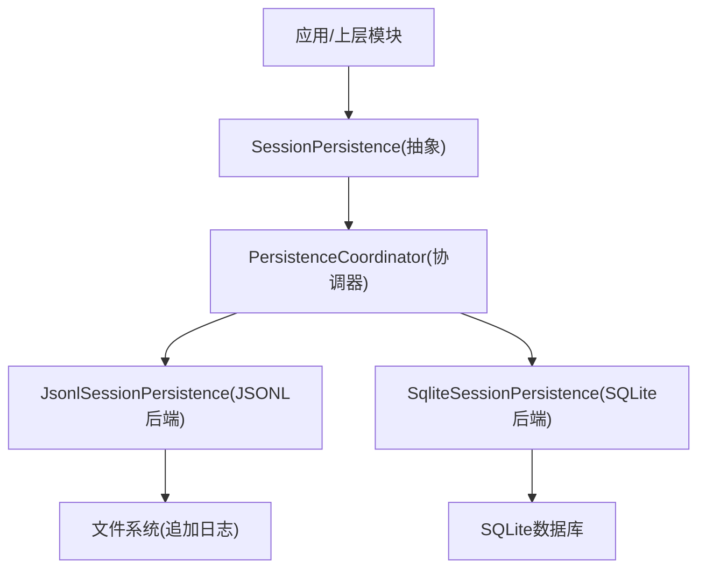
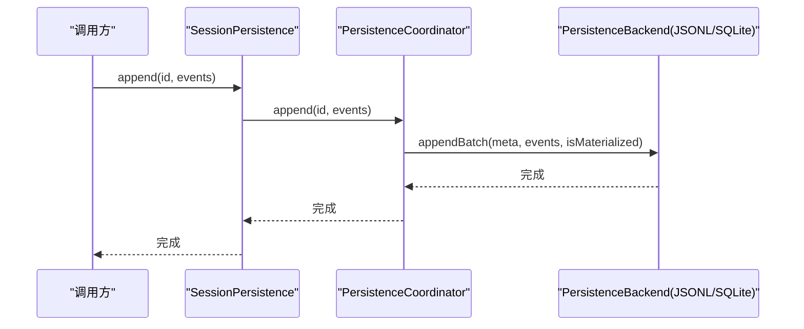
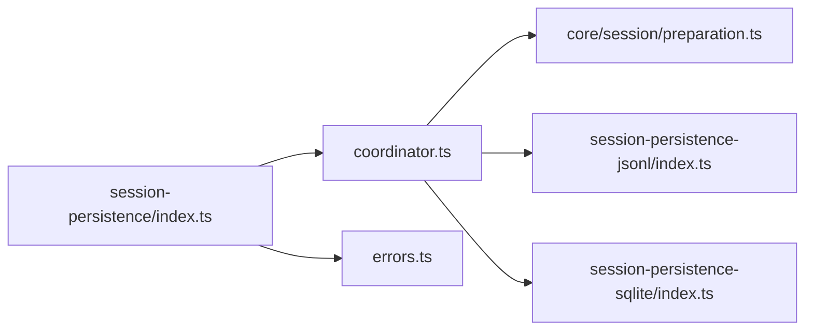

# 持久化API参考

<cite>
**本文引用的文件**
- [packages/session/session-persistence/src/index.ts](file://packages/session/session-persistence/src/index.ts)
- [packages/session/session-persistence/src/coordinator.ts](file://packages/session/session-persistence/src/coordinator.ts)
- [packages/session/session-persistence/src/errors.ts](file://packages/session/session-persistence/src/errors.ts)
- [packages/core/session/src/preparation.ts](file://packages/core/session/src/preparation.ts)
- [packages/session/session-persistence-jsonl/src/index.ts](file://packages/session/session-persistence-jsonl/src/index.ts)
- [packages/session/session-persistence-sqlite/src/index.ts](file://packages/session/session-persistence-sqlite/src/index.ts)
- [packages/session/session-persistence/tests/persistence.spec.ts](file://packages/session/session-persistence/tests/persistence.spec.ts)
</cite>

## 目录
1. [简介](#简介)
2. [项目结构](#项目结构)
3. [核心组件](#核心组件)
4. [架构总览](#架构总览)
5. [详细组件分析](#详细组件分析)
6. [依赖关系分析](#依赖关系分析)
7. [性能考量](#性能考量)
8. [故障排查指南](#故障排查指南)
9. [结论](#结论)
10. [附录：版本兼容与迁移指南](#附录：版本兼容与迁移指南)

## 简介
本参考文档面向 DeepSeek Harness 的“会话持久化”能力，聚焦 SessionPersistence 抽象接口及其实现、协调器与关键数据类型。内容覆盖 locate、create、append、prepare、load、inspect、borrowSession、readFrom、list、listSnapshots 等方法与属性；说明 SessionPreparation、SessionInspection、SessionRawArtifact 等类型的使用方式；提供调用约定、异常处理与资源管理建议；并给出版本兼容性与迁移指引。

## 项目结构
- 抽象服务定义位于 session-persistence 包，暴露 SessionPersistence 抽象类及关键类型（SessionInspection、SessionRawArtifact、SessionLocation、SessionPersistenceSnapshot、SessionPersistenceRevision）。
- 协调器 PersistenceCoordinator 负责写路径编排、缓存、修复、并发控制与生命周期管理。
- JSONL 后端 JsonlSessionPersistence 提供基于文件的追加式日志存储，支持原始工件读取。
- SQLite 后端 SqliteSessionPersistence 提供基于数据库的存储，无单会话独立工件。
- 测试用例 MemoryPersistence/ControlledBackend 展示了最小实现与行为契约。

图表来源
- [packages/session/session-persistence/src/index.ts:105-283](file://packages/session/session-persistence/src/index.ts#L105-L283)
- [packages/session/session-persistence/src/coordinator.ts:591-800](file://packages/session/session-persistence/src/coordinator.ts#L591-L800)
- [packages/session/session-persistence-jsonl/src/index.ts:123-210](file://packages/session/session-persistence-jsonl/src/index.ts#L123-L210)
- [packages/session/session-persistence-sqlite/src/index.ts:54-141](file://packages/session/session-persistence-sqlite/src/index.ts#L54-L141)

章节来源
- [packages/session/session-persistence/src/index.ts:1-286](file://packages/session/session-persistence/src/index.ts#L1-L286)
- [packages/session/session-persistence/src/coordinator.ts:1-220](file://packages/session/session-persistence/src/coordinator.ts#L1-L220)

## 核心组件
- SessionPersistence：抽象服务，定义会话持久化的统一接口。
- PersistenceCoordinator：跨后端的写路径编排器，负责批处理、序列化、冷启动恢复、准备态复用与发布。
- JsonlSessionPersistence：JSONL 文件后端，支持 raw 工件读取、压缩、原子发布与崩溃恢复。
- SqliteSessionPersistence：SQLite 后端，无 per-session 工件，通过 readFrom 高效读取后缀。
- SessionPreparation：封装未发布的 Session 与其提供者状态，确保资源释放与幂等销毁。
- 关键类型：SessionInspection、SessionRawArtifact、SessionLocation、SessionPersistenceSnapshot、SessionPersistenceRevision。

章节来源
- [packages/session/session-persistence/src/index.ts:18-283](file://packages/session/session-persistence/src/index.ts#L18-L283)
- [packages/core/session/src/preparation.ts:9-49](file://packages/core/session/src/preparation.ts#L9-L49)
- [packages/session/session-persistence-jsonl/src/index.ts:61-210](file://packages/session/session-persistence-jsonl/src/index.ts#L61-L210)
- [packages/session/session-persistence-sqlite/src/index.ts:37-141](file://packages/session/session-persistence-sqlite/src/index.ts#L37-L141)

## 架构总览
SessionPersistence 作为对外服务门面，内部委托给 PersistenceCoordinator。协调器维护每会话的状态机、写队列、准备态缓存与并发串行化，并将具体 I/O 委派给 PersistenceBackend（由 JSONL 或 SQLite 实现）。读路径支持 inspect/load/borrowSession/readFrom/list/listSnapshots；写路径支持 create/append/ensureMaterialized；可选 readRaw 用于 JSONL 后端。

图表来源
- [packages/session/session-persistence/src/index.ts:166-174](file://packages/session/session-persistence/src/index.ts#L166-L174)
- [packages/session/session-persistence/src/coordinator.ts:692-733](file://packages/session/session-persistence/src/coordinator.ts#L692-L733)
- [packages/session/session-persistence-jsonl/src/index.ts:431-439](file://packages/session/session-persistence-jsonl/src/index.ts#L431-L439)
- [packages/session/session-persistence-sqlite/src/index.ts:107-109](file://packages/session/session-persistence-sqlite/src/index.ts#L107-L109)

## 详细组件分析

### SessionPersistence 抽象接口与方法
- locate(meta): 返回后端特定的绝对工件位置（如 JSONL 的文件路径），某些后端（如 SQLite）返回 undefined。
- supportsRawArtifacts: 是否暴露 per-session 原始工件文本。
- readRaw(id, signal?): 读取后端原始工件文本（仅当 supportsRawArtifacts 为 true 时有效）。
- create(meta): 注册新会话元数据，可能延迟到首次 append 才落盘。
- ensureMaterialized(session): 将空会话也持久化（非所有后端支持）。
- append(id, events): 追加事件批次，要求 seq 连续且可 JSON 序列化。
- prepare(id, signal?): 准备一个未发布的 Session，供 resume 使用；内部会 load 并克隆 seed/meta。
- load(id): 加载平衡后的逻辑视图，必要时进行冷恢复（关闭中断 turn）。
- inspect(id, signal?): 只读检查，不提交恢复；对已 live 的会话返回其不可变快照。
- borrowSession(id, signal?): 借用一次 inspection 同时保留可复用的 prepared source。
- readFrom(id, fromSeq, signal?): 从指定 seq 起读取后缀，适合增量投影。
- list(signal?): 列出所有已物化会话的元数据。
- listSnapshots(signal?): 列出会话头与变更令牌 revision。

参数与返回值要点
- id: SessionId；events: readonly SessionEvent[]；signal?: AbortSignal。
- 返回 SessionInspection、SessionLocation、SessionRawArtifact、SessionPersistenceSnapshot 等。
- 异常：格式不支持、损坏、找不到、序列号不匹配、非 JSON 可序列化数据等。

章节来源
- [packages/session/session-persistence/src/index.ts:18-283](file://packages/session/session-persistence/src/index.ts#L18-L283)

### 协调器 PersistenceCoordinator
职责
- 写路径编排：批量缓冲、序列化校验、追加、事务性标记 materialized、cursor 推进。
- 准备态复用：LRU 缓存精确的 unpublished Session，避免重复解析。
- 冷启动修复：截断撕裂尾部、追加合成 closing 事件。
- 并发控制：按会话 ID 串行化操作，避免写入交错。
- 列表与快照：轻量 listing，revision 标识变更。

关键流程
- createCore：防止重复创建与磁盘冲突。
- appendCore：校验 seq 连续性，调用后端 appendBatch，更新 cursor。
- prepare/load：在存在 live session 时拒绝或回退到 live snapshot；支持 revision 重试收敛。
- readFrom：优先使用后端 seek 能力，否则回退到完整前缀扫描。

章节来源
- [packages/session/session-persistence/src/coordinator.ts:591-800](file://packages/session/session-persistence/src/coordinator.ts#L591-L800)
- [packages/session/session-persistence/src/coordinator.ts:800-1440](file://packages/session/session-persistence/src/coordinator.ts#L800-L1440)

### JSONL 后端 JsonlSessionPersistence
特性
- supportsRawArtifacts = true；locate 返回绝对路径。
- 支持 zstd 压缩与 packed chunks；原子发布（临时文件 + link/rename）。
- 崩溃恢复：检测撕裂帧，恢复完整记录，丢弃不完整尾。
- 列表优化：仅读取首行头信息，避免全量解析。

重要方法
- readRaw：解码物理编码（zstd/明文），返回 meta/filename/content。
- appendBatch/materializeHeader/commitRepair：文件级追加、初始化与修复。
- list/listSnapshots：仅读取头部与 stat 生成 revision。

章节来源
- [packages/session/session-persistence-jsonl/src/index.ts:123-210](file://packages/session/session-persistence-jsonl/src/index.ts#L123-L210)
- [packages/session/session-persistence-jsonl/src/index.ts:249-292](file://packages/session/session-persistence-jsonl/src/index.ts#L249-L292)
- [packages/session/session-persistence-jsonl/src/index.ts:431-486](file://packages/session/session-persistence-jsonl/src/index.ts#L431-L486)

### SQLite 后端 SqliteSessionPersistence
特性
- supportsRawArtifacts = false；locate 返回 undefined。
- 通过 store.list/listSnapshots 直接查询数据库元数据。
- readFrom 利用数据库索引/顺序读取后缀。

章节来源
- [packages/session/session-persistence-sqlite/src/index.ts:54-141](file://packages/session/session-persistence-sqlite/src/index.ts#L54-L141)

### 关键数据类型
- SessionInspection：包含不可变的 meta 与 events 快照。
- SessionRawArtifact：后端原始工件文本（meta/filename/content）。
- SessionLocation：后端工件定位（kind/path）。
- SessionPersistenceSnapshot：header + revision，用于轻量列举与变更感知。
- SessionPreparation：封装未发布 Session 与释放回调，[Symbol.dispose] 幂等释放。

章节来源
- [packages/session/session-persistence/src/index.ts:18-62](file://packages/session/session-persistence/src/index.ts#L18-L62)
- [packages/core/session/src/preparation.ts:9-49](file://packages/core/session/src/preparation.ts#L9-L49)

### 调用约定与错误处理
- 事件必须可 JSON 序列化；否则 append 抛出类型错误。
- seq 必须连续；不匹配将报错。
- 格式版本不支持：抛出 SessionFormatUnsupportedError（含 location 提示）。
- 数据损坏：抛出 SessionPersistenceCorruptionError。
- 不存在：抛出 SessionPersistenceNotFoundError。
- 取消：支持 AbortSignal，中途抛错需遵循信号语义。

章节来源
- [packages/session/session-persistence/src/coordinator.ts:36-81](file://packages/session/session-persistence/src/coordinator.ts#L36-L81)
- [packages/session/session-persistence/src/errors.ts:5-12](file://packages/session/session-persistence/src/errors.ts#L5-L12)

### 使用模式示例（以引用路径代替代码片段）
- 创建与会话追加
  - 参考：[packages/session/session-persistence-jsonl/src/index.ts:178-188](file://packages/session/session-persistence-jsonl/src/index.ts#L178-L188)
- 准备与恢复
  - 参考：[packages/session/session-persistence/src/index.ts:176-199](file://packages/session/session-persistence/src/index.ts#L176-L199)
  - 参考：[packages/core/session/src/preparation.ts:20-49](file://packages/core/session/src/preparation.ts#L20-L49)
- 只读检查与借用
  - 参考：[packages/session/session-persistence/src/index.ts:216-242](file://packages/session/session-persistence/src/index.ts#L216-L242)
- 原始工件读取（JSONL）
  - 参考：[packages/session/session-persistence-jsonl/src/index.ts:249-292](file://packages/session/session-persistence-jsonl/src/index.ts#L249-L292)
- 列表与快照
  - 参考：[packages/session/session-persistence-jsonl/src/index.ts:462-486](file://packages/session/session-persistence-jsonl/src/index.ts#L462-L486)
- 测试中的最小实现
  - 参考：[packages/session/session-persistence/tests/persistence.spec.ts:70-188](file://packages/session/session-persistence/tests/persistence.spec.ts#L70-L188)

## 依赖关系分析
- SessionPersistence 依赖 Cordis Context 与 dsh-session 类型。
- 协调器依赖 dsh-session 的事件/头结构与时间/超时常量。
- JSONL 后端依赖 Node fs/promises、zstd 编解码、平台特定发布工具。
- SQLite 后端依赖 schema 与 store 模块。

图表来源
- [packages/session/session-persistence/src/index.ts:1-15](file://packages/session/session-persistence/src/index.ts#L1-L15)
- [packages/session/session-persistence/src/coordinator.ts:8-25](file://packages/session/session-persistence/src/coordinator.ts#L8-L25)
- [packages/core/session/src/preparation.ts:1-7](file://packages/core/session/src/preparation.ts#L1-L7)
- [packages/session/session-persistence-jsonl/src/index.ts:9-35](file://packages/session/session-persistence-jsonl/src/index.ts#L9-L35)
- [packages/session/session-persistence-sqlite/src/index.ts:7-28](file://packages/session/session-persistence-sqlite/src/index.ts#L7-L28)

章节来源
- [packages/session/session-persistence/src/index.ts:1-15](file://packages/session/session-persistence/src/index.ts#L1-L15)
- [packages/session/session-persistence/src/coordinator.ts:8-25](file://packages/session/session-persistence/src/coordinator.ts#L8-L25)

## 性能考量
- 写路径批处理：默认最大等待窗口可配置，减少频繁落盘开销。
- 准备态缓存：默认保留若干冷准备会话，加速历史恢复。
- JSONL 压缩与打包：zstd 压缩与 packed chunks 显著减小体积；读取时按需解压。
- 列表优化：仅读取首行头信息，避免全量解析大日志。
- SQLite 后缀读取：readFrom 可直接从数据库读取 seq>=fromSeq 的事件，避免全量解析。

章节来源
- [packages/session/session-persistence-jsonl/src/index.ts:61-85](file://packages/session/session-persistence-jsonl/src/index.ts#L61-L85)
- [packages/session/session-persistence-jsonl/src/index.ts:462-486](file://packages/session/session-persistence-jsonl/src/index.ts#L462-L486)
- [packages/session/session-persistence-sqlite/src/index.ts:127-133](file://packages/session/session-persistence-sqlite/src/index.ts#L127-L133)

## 故障排查指南
- 找不到会话：捕获 SessionPersistenceNotFoundError，确认会话是否已创建或存在。
- 格式不支持：捕获 SessionFormatUnsupportedError，升级 harness 或选择兼容后端。
- 数据损坏：捕获 SessionPersistenceCorruptionError，检查日志完整性与崩溃恢复。
- 序列号不匹配：检查事件 seq 是否连续，确保先 load 再 append。
- 非 JSON 可序列化：确保 event.data 可被 JSON 序列化，否则会被拒绝。
- 取消与超时：正确使用 AbortSignal，并在长耗时操作中及时检查。

章节来源
- [packages/session/session-persistence/src/errors.ts:5-12](file://packages/session/session-persistence/src/errors.ts#L5-L12)
- [packages/session/session-persistence/src/coordinator.ts:36-81](file://packages/session/session-persistence/src/coordinator.ts#L36-L81)

## 结论
SessionPersistence 提供了统一的会话持久化抽象，配合 PersistenceCoordinator 实现了高可靠、可扩展的写路径与冷启动恢复。JSONL 与 SQLite 两种后端分别满足文件型与数据库型场景。通过 SessionPreparation、SessionInspection、SessionRawArtifact 等类型，调用方可安全地准备、检查与访问会话数据。遵循本文的调用约定与错误处理建议，可在生产环境中获得稳定一致的持久化体验。

## 附录：版本兼容与迁移指南
- 格式版本检查：若存储的会话格式版本高于当前 harness 支持范围，将拒绝打开并提示升级 harness；低于支持范围且无升级路径也会拒绝。
- 遗留事件类型：旧版 request/header-delta、mode/set、request/header(reason=fallback) 等不再支持，需在迁移中替换为当前事件模型。
- 消息身份迁移：旧版消息缺少 id/role/message 字段时，协调器会在加载阶段进行迁移与规范化。
- 迁移建议
  - 升级 harness 至支持目标格式的版本。
  - 对历史日志进行一次性转换或重新录制，确保事件类型与结构符合当前规范。
  - 对于 JSONL 后端，注意压缩与打包选项不影响读取兼容性；但需保证首帧头合法。
  - 对于 SQLite 后端，关注 schema 版本与 journalMode 设置，确保一致性。

章节来源
- [packages/session/session-persistence/src/coordinator.ts:48-81](file://packages/session/session-persistence/src/coordinator.ts#L48-L81)
- [packages/session/session-persistence-jsonl/src/index.ts:48-59](file://packages/session/session-persistence-jsonl/src/index.ts#L48-L59)
- [packages/session/session-persistence-sqlite/src/index.ts:37-49](file://packages/session/session-persistence-sqlite/src/index.ts#L37-L49)