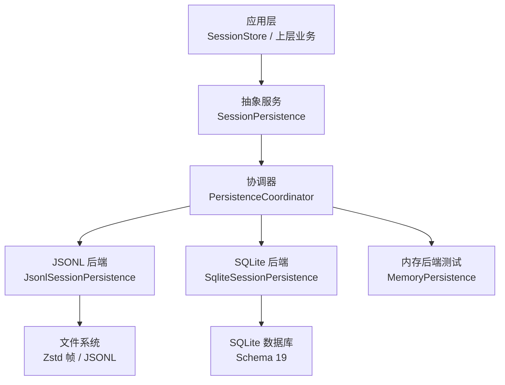
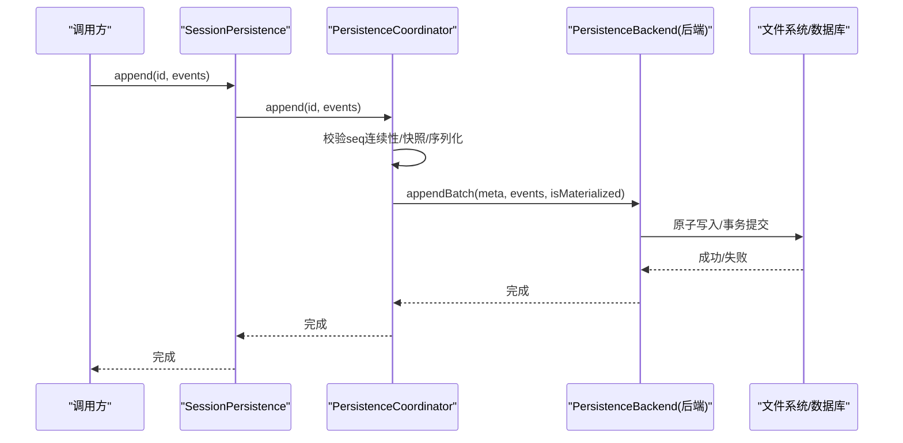
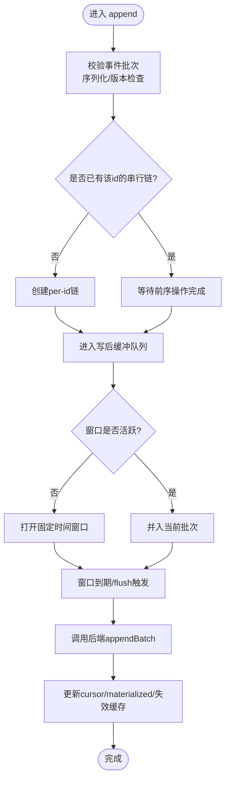
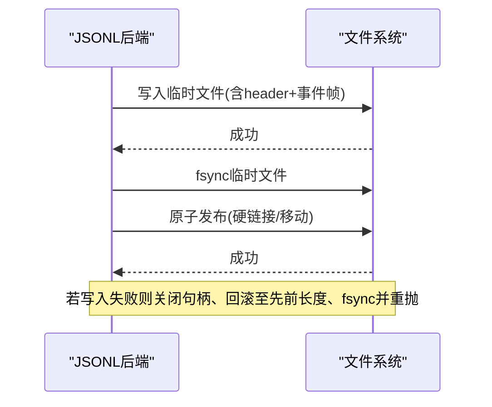
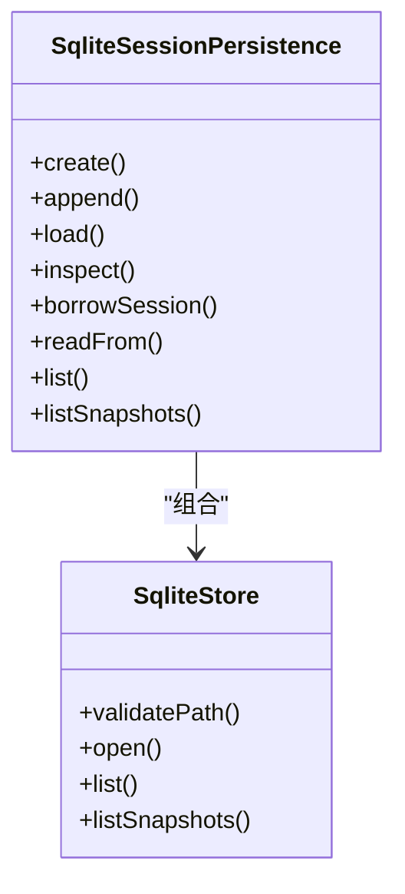
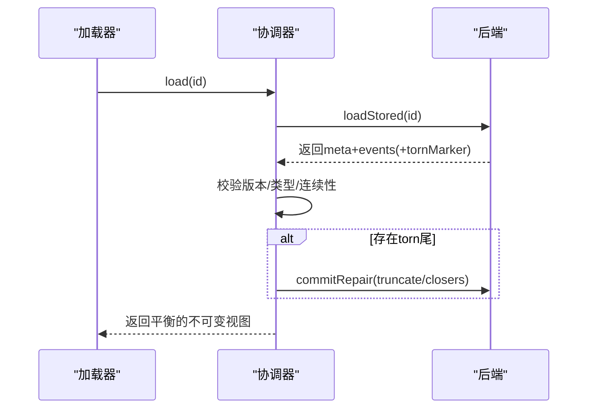
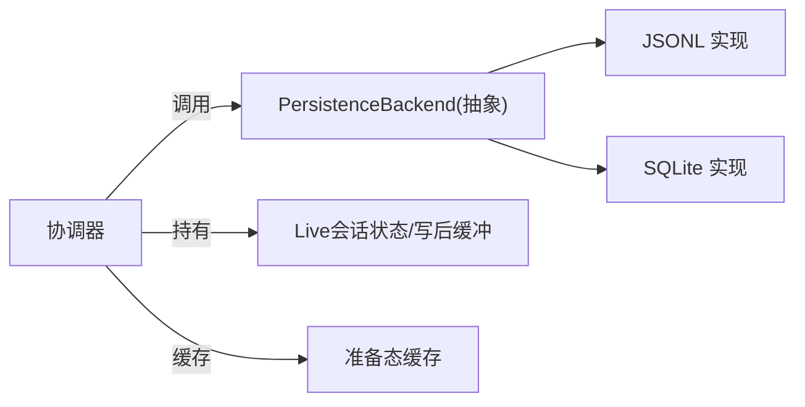

# 持久化存储

<cite>
**本文引用的文件**
- [packages/session/session-persistence/src/index.ts](file://packages/session/session-persistence/src/index.ts)
- [packages/session/session-persistence/src/coordinator.ts](file://packages/session/session-persistence/src/coordinator.ts)
- [packages/session/session-persistence-jsonl/src/index.ts](file://packages/session/session-persistence-jsonl/src/index.ts)
- [packages/session/session-persistence-sqlite/src/index.ts](file://packages/session/session-persistence-sqlite/src/index.ts)
- [packages/session/session-persistence-sqlite/src/store.ts](file://packages/session/session-persistence-sqlite/src/store.ts)
- [packages/session/session-persistence/tests/write-behind.spec.ts](file://packages/session/session-persistence/tests/write-behind.spec.ts)
- [packages/session-query/session-query-sqlite/src/index.ts](file://packages/session-query/session-query-sqlite/src/index.ts)
- [docs/subsystems/persistence.md](file://docs/subsystems/persistence.md)
- [.agents/notes/implemented/architecture/2026-08-08-bounded-session-persistence-write-batching.zh.md](file://.agents/notes/implemented/architecture/2026-08-08-bounded-session-persistence-write-batching.zh.md)
</cite>

## 目录
1. [简介](#简介)
2. [项目结构](#项目结构)
3. [核心组件](#核心组件)
4. [架构总览](#架构总览)
5. [详细组件分析](#详细组件分析)
6. [依赖关系分析](#依赖关系分析)
7. [性能考量](#性能考量)
8. [故障排查指南](#故障排查指南)
9. [结论](#结论)
10. [附录](#附录)

## 简介
本文件面向 DeepSeek Harness 的会话持久化系统，系统性阐述其设计原则、实现差异与恢复机制，并给出性能优化策略与扩展实践。核心要点包括：
- 追加式日志的不可变性与完整性保证：事件按顺序追加，崩溃恢复仅修复尾部不完整片段，已提交前缀不被改写。
- 多后端抽象：内存（测试用）、磁盘 JSONL、SQLite 三种后端共享同一服务契约与协调器编排逻辑。
- 会话恢复：断点续传、冷启动修复、HMR 热替换下的前缀采用与一致性保障。
- 性能优化：固定窗口批量写入、压缩存储（Zstandard 帧）、增量同步（readFrom 后缀读取）。
- 自定义后端与异常处理：通过实现 PersistenceBackend 钩子接入新介质，并遵循统一的错误语义。

## 项目结构
持久化子系统由“抽象服务 + 协调器 + 具体后端”构成：
- 抽象服务 SessionPersistence：定义 locate/create/append/prepare/load/inspect/readFrom/list/listSnapshots 等能力边界。
- 协调器 PersistenceCoordinator：统一编排写路径、批处理、序列化、恢复、资源释放等跨后端通用逻辑。
- 具体后端：
  - JSONL：每会话一个追加式日志文件，默认使用 Zstandard 分帧压缩，支持原子写入与崩溃修复。
  - SQLite：单库多会话，将可打包的事件段压缩为 schema 行，重建完整逻辑事件流。
  - 内存：用于测试与共享物化会话的轻量实现。

图表来源
- [packages/session/session-persistence/src/index.ts:100-283](file://packages/session/session-persistence/src/index.ts#L100-L283)
- [packages/session/session-persistence/src/coordinator.ts:578-628](file://packages/session/session-persistence/src/coordinator.ts#L578-L628)
- [packages/session/session-persistence-jsonl/src/index.ts:123-200](file://packages/session/session-persistence-jsonl/src/index.ts#L123-L200)
- [packages/session/session-persistence-sqlite/src/index.ts:54-141](file://packages/session/session-persistence-sqlite/src/index.ts#L54-L141)

章节来源
- [packages/session/session-persistence/src/index.ts:100-283](file://packages/session/session-persistence/src/index.ts#L100-L283)
- [packages/session/session-persistence/src/coordinator.ts:578-628](file://packages/session/session-persistence/src/coordinator.ts#L578-L628)
- [packages/session/session-persistence-jsonl/src/index.ts:123-200](file://packages/session/session-persistence-jsonl/src/index.ts#L123-L200)
- [packages/session/session-persistence-sqlite/src/index.ts:54-141](file://packages/session/session-persistence-sqlite/src/index.ts#L54-L141)

## 核心组件
- SessionPersistence（抽象服务）
  - 定义 append-only 的会话日志接口，明确 load 会提交必要的冷修复，inspect 不提交修复但返回平衡视图，readFrom 提供从指定 seq 的后缀读取能力。
  - 暴露 list/listSnapshots 以轻量观察元数据与变更标记（revision）。
- PersistenceCoordinator（协调器）
  - 维护 per-id 串行化链、写后缓冲（write-behind）、准备态缓存、生命周期回收与 dispose 排空。
  - 负责创建冲突检测、追加连续性校验、崩溃修复序列、HMR 种子采用与发布。
- 后端钩子 PersistenceBackend
  - 最小物理原语：loadStored/loadStoredFrom、appendBatch、commitRepair、list、locate、close 等。
  - 协调器只调用这些钩子，不感知具体介质细节。

章节来源
- [packages/session/session-persistence/src/index.ts:100-283](file://packages/session/session-persistence/src/index.ts#L100-L283)
- [packages/session/session-persistence/src/coordinator.ts:117-218](file://packages/session/session-persistence/src/coordinator.ts#L117-L218)
- [packages/session/session-persistence/src/coordinator.ts:578-628](file://packages/session/session-persistence/src/coordinator.ts#L578-L628)

## 架构总览
协调器是跨后端的核心编排者；各后端只需实现少量钩子即可复用全部正确性保障。JSONL 与 SQLite 在物理存储上差异显著，但在逻辑层面都提供一致的 append-only 日志与恢复语义。

图表来源
- [packages/session/session-persistence/src/coordinator.ts:692-733](file://packages/session/session-persistence/src/coordinator.ts#L692-L733)
- [packages/session/session-persistence/src/coordinator.ts:181-187](file://packages/session/session-persistence/src/coordinator.ts#L181-L187)

章节来源
- [packages/session/session-persistence/src/coordinator.ts:692-733](file://packages/session/session-persistence/src/coordinator.ts#L692-L733)

## 详细组件分析

### 抽象服务与会话恢复
- 关键语义
  - append：追加连续事件，resolve 后才视为持久化完成。
  - load：返回平衡的不可变视图，必要时提交冷修复（如关闭中断 turn）。
  - inspect：不提交修复，返回当前逻辑视图；对已 live 会话直接借用其快照。
  - readFrom：非阻塞的物理后缀读取，适合读模型增量同步。
  - prepare/borrowSession：为 resume 准备精确的未发布会话对象，避免重复解析与复制。
- 恢复与一致性
  - 冷加载时若发现未闭合的 turn，会在内存中合成 closers 并在需要时持久化关闭；已提交前缀绝不重写。
  - 版本拒绝：当格式版本不受支持或事件类型未知时，拒绝加载并提示升级方向。

章节来源
- [packages/session/session-persistence/src/index.ts:166-283](file://packages/session/session-persistence/src/index.ts#L166-L283)
- [docs/subsystems/persistence.md:9-19](file://docs/subsystems/persistence.md#L9-L19)
- [docs/subsystems/persistence.md:92-95](file://docs/subsystems/persistence.md#L92-L95)

### 协调器与写路径编排
- 并发与序列化
  - 每个 session id 拥有独立的 Promise 链，确保同一会话的 flush/append/load 不会交错。
- 批处理与延迟
  - 固定窗口合并：首个待写事件触发窗口，后续事件加入但不重置截止时间；到期后一次性写出。
  - 失败重试：自动重试暂停，新事件开启新窗口；显式 flush 立即排空。
- 准备态缓存与 LRU
  - 冷准备结果可被 reuse，减少重复解析/解压/验证成本。

图表来源
- [packages/session/session-persistence/src/coordinator.ts:692-733](file://packages/session/session-persistence/src/coordinator.ts#L692-L733)
- [packages/session/session-persistence/tests/write-behind.spec.ts:19-64](file://packages/session/session-persistence/tests/write-behind.spec.ts#L19-L64)
- [.agents/notes/implemented/architecture/2026-08-08-bounded-session-persistence-write-batching.zh.md:19-25](file://.agents/notes/implemented/architecture/2026-08-08-bounded-session-persistence-write-batching.zh.md#L19-L25)

章节来源
- [packages/session/session-persistence/src/coordinator.ts:692-733](file://packages/session/session-persistence/src/coordinator.ts#L692-L733)
- [packages/session/session-persistence/tests/write-behind.spec.ts:19-64](file://packages/session/session-persistence/tests/write-behind.spec.ts#L19-L64)
- [.agents/notes/implemented/architecture/2026-08-08-bounded-session-persistence-write-batching.zh.md:19-25](file://.agents/notes/implemented/architecture/2026-08-08-bounded-session-persistence-write-batching.zh.md#L19-L25)

### JSONL 后端（磁盘追加日志 + 压缩）
- 存储形态
  - 每会话一个日志文件，首行为 header，其后为事件行或压缩帧。
  - 默认启用 Zstandard 分帧压缩：header 一帧，每个持久化批次一帧，便于边界对齐与回滚。
- 原子性与崩溃恢复
  - 首次物化与首个批次原子提交；写入失败时回滚到先前字节长度并 fsync。
  - 崩溃尾修复：截断损坏帧，必要时追加合成 closers，已提交前缀保持不变。
- 定位与原始内容
  - locate 返回绝对路径；supportsRawArtifacts=true 时可读取原始文本。

图表来源
- [packages/session/session-persistence-jsonl/src/index.ts:622-651](file://packages/session/session-persistence-jsonl/src/index.ts#L622-L651)
- [packages/session/session-persistence-jsonl/src/index.ts:681-722](file://packages/session/session-persistence-jsonl/src/index.ts#L681-L722)

章节来源
- [packages/session/session-persistence-jsonl/src/index.ts:123-200](file://packages/session/session-persistence-jsonl/src/index.ts#L123-L200)
- [packages/session/session-persistence-jsonl/src/index.ts:622-651](file://packages/session/session-persistence-jsonl/src/index.ts#L622-L651)
- [packages/session/session-persistence-jsonl/src/index.ts:681-722](file://packages/session/session-persistence-jsonl/src/index.ts#L681-L722)

### SQLite 后端（单库多会话 + 压缩行）
- 存储形态
  - 单数据库文件，schema 19 将可打包的事件段压缩为 text/reasoning/tool-call chunks 行。
  - 不支持 raw artifact 暴露（supportsRawArtifacts=false），locate 返回 undefined。
- 初始化与路径校验
  - 启动时进行路径合法性与所有权校验，避免非法路径/符号链接/目录。
- 查询与增量
  - 支持 readFrom 直接按 seq 读取后缀，适合投影/索引增量同步。

图表来源
- [packages/session/session-persistence-sqlite/src/index.ts:54-141](file://packages/session/session-persistence-sqlite/src/index.ts#L54-L141)
- [packages/session/session-persistence-sqlite/src/store.ts:55-94](file://packages/session/session-persistence-sqlite/src/store.ts#L55-L94)

章节来源
- [packages/session/session-persistence-sqlite/src/index.ts:54-141](file://packages/session/session-persistence-sqlite/src/index.ts#L54-L141)
- [packages/session/session-persistence-sqlite/src/store.ts:55-94](file://packages/session/session-persistence-sqlite/src/store.ts#L55-L94)

### 内存后端（测试与共享物化）
- 用途
  - 基于 Map 的轻量实现，无 torn-tail 标记，用于单元测试与多个实例共享物化会话。
- 特点
  - 所有服务方法委托给协调器；后端钩子直接读写内存 store。

章节来源
- [packages/session/session-persistence/tests/persistence.spec.ts:64-127](file://packages/session/session-persistence/tests/persistence.spec.ts#L64-L127)

### 会话恢复机制（断点续传、崩溃恢复、一致性）
- 冷加载
  - 若存在未闭合 turn，则在内存中合成 closers；必要时持久化关闭，已提交前缀不变。
- HMR 热替换
  - 采用 live 前缀而不关闭活动 turn，保持运行期一致性。
- 版本与类型拒绝
  - 格式版本不受支持或出现未知事件类型时，拒绝加载并给出升级方向提示。
- 增量同步
  - readFrom 提供从 fromSeq 开始的稳定后缀读取，不触发修复与发布，适合外部读模型。

图表来源
- [packages/session/session-persistence/src/coordinator.ts:772-798](file://packages/session/session-persistence/src/coordinator.ts#L772-L798)
- [docs/subsystems/persistence.md:9-19](file://docs/subsystems/persistence.md#L9-L19)

章节来源
- [packages/session/session-persistence/src/coordinator.ts:772-798](file://packages/session/session-persistence/src/coordinator.ts#L772-L798)
- [docs/subsystems/persistence.md:9-19](file://docs/subsystems/persistence.md#L9-L19)

## 依赖关系分析
- 耦合与内聚
  - 协调器与后端通过 PersistenceBackend 解耦；后端仅关注物理原语，协调器专注编排。
  - JSONL/SQLite 均组合协调器，避免重复实现写路径与恢复逻辑。
- 外部依赖
  - JSONL 依赖 Node 文件系统与 zlib zstd 压缩。
  - SQLite 依赖 node:sqlite 与自身 schema 管理。
- 潜在循环
  - 协调器不反向依赖具体后端，仅依赖抽象钩子，避免循环依赖。

图表来源
- [packages/session/session-persistence/src/coordinator.ts:117-218](file://packages/session/session-persistence/src/coordinator.ts#L117-L218)
- [packages/session/session-persistence/src/coordinator.ts:578-628](file://packages/session/session-persistence/src/coordinator.ts#L578-L628)

章节来源
- [packages/session/session-persistence/src/coordinator.ts:117-218](file://packages/session/session-persistence/src/coordinator.ts#L117-L218)
- [packages/session/session-persistence/src/coordinator.ts:578-628](file://packages/session/session-persistence/src/coordinator.ts#L578-L628)

## 性能考量
- 批量写入
  - 固定窗口合并：首个事件触发窗口，后续事件并入但不重置截止时间；到期后一次写出。
  - 失败后自动重试暂停，新事件开启新窗口；显式 flush 立即排空。
- 压缩存储
  - JSONL 默认使用 Zstandard 分帧压缩，header 与每个批次独立帧，利于边界对齐与回滚。
- 增量同步
  - readFrom 支持从指定 seq 读取后缀，SQLite 可直接 seek，JSONL 仍解析全文但仅返回后缀。
- 准备态缓存
  - 冷准备结果可被 reuse，减少重复解析/解压/验证成本。

章节来源
- [packages/session/session-persistence/tests/write-behind.spec.ts:19-64](file://packages/session/session-persistence/tests/write-behind.spec.ts#L19-L64)
- [packages/session/session-persistence-jsonl/src/index.ts:622-651](file://packages/session/session-persistence-jsonl/src/index.ts#L622-L651)
- [packages/session/session-persistence/src/index.ts:244-263](file://packages/session/session-persistence/src/index.ts#L244-L263)
- [.agents/notes/implemented/architecture/2026-08-08-bounded-session-persistence-write-batching.zh.md:19-25](file://.agents/notes/implemented/architecture/2026-08-08-bounded-session-persistence-write-batching.zh.md#L19-L25)

## 故障排查指南
- 常见错误与含义
  - 格式版本不受支持：日志由更新版本的 harness 写入，需升级 harness。
  - 数据损坏：committed 前缀校验失败，应检查底层存储与权限。
  - 路径非法：SQLite 拒绝无效路径、符号链接或非真实目录。
- 诊断建议
  - JSONL：通过 locate 获取原始日志路径，结合 supportsRawArtifacts 查看原始内容。
  - SQLite：检查 journalMode、busyTimeoutMs 与路径所有权；确认 schema 版本兼容。
  - 批处理：若写入延迟过高，检查 writeBatchMaxDelayMs 与后端 I/O 瓶颈。
- 恢复步骤
  - 冷加载会自动修复断裂尾部；若持续失败，检查后端 commitRepair 是否成功落盘。
  - 对于 HMR 场景，确认未关闭活动 turn 且前缀一致。

章节来源
- [packages/session/session-persistence/src/coordinator.ts:36-81](file://packages/session/session-persistence/src/coordinator.ts#L36-L81)
- [packages/session/session-persistence-sqlite/tests/sqlite.spec.ts:827-861](file://packages/session/session-persistence-sqlite/tests/sqlite.spec.ts#L827-L861)
- [packages/session/session-persistence-jsonl/src/index.ts:681-722](file://packages/session/session-persistence-jsonl/src/index.ts#L681-L722)

## 结论
DeepSeek Harness 的会话持久化系统通过“抽象服务 + 协调器 + 后端钩子”的分层设计，实现了高内聚、低耦合与强一致性的追加式日志存储。JSONL 与 SQLite 在后端层面各有优势：前者具备直观的文件级原子性与压缩帧边界，后者具备结构化查询与高效增量读取。配合固定窗口批处理、压缩存储与 readFrom 增量同步，系统在吞吐、可靠性与可扩展性之间取得良好平衡。第三方可通过实现 PersistenceBackend 快速接入新介质，同时继承完整的恢复与一致性保障。

## 附录
- 自定义持久化后端示例（思路）
  - 实现 PersistenceBackend 钩子：loadStored/loadStoredFrom、appendBatch、commitRepair、list、locate、close。
  - 在构造函数中组合 PersistenceCoordinator，并将公开方法委托给协调器。
  - 参考 JSONL/SQLite 的实现组织方式，分离配置、存储与协调器。
- 处理持久化异常
  - 区分格式版本拒绝与数据损坏两类错误，向用户提示升级或修复方向。
  - 在 append 失败时确保回滚到先前长度并 fsync，使协调器可重试相同批次。
- 代码片段路径
  - 抽象服务定义：[packages/session/session-persistence/src/index.ts:100-283](file://packages/session/session-persistence/src/index.ts#L100-L283)
  - 协调器写路径：[packages/session/session-persistence/src/coordinator.ts:692-733](file://packages/session/session-persistence/src/coordinator.ts#L692-L733)
  - JSONL 原子写入与回滚：[packages/session/session-persistence-jsonl/src/index.ts:622-651](file://packages/session/session-persistence-jsonl/src/index.ts#L622-L651), [packages/session/session-persistence-jsonl/src/index.ts:681-722](file://packages/session/session-persistence-jsonl/src/index.ts#L681-L722)
  - SQLite 初始化与路径校验：[packages/session/session-persistence-sqlite/src/index.ts:89-97](file://packages/session/session-persistence-sqlite/src/index.ts#L89-L97), [packages/session/session-persistence-sqlite/src/store.ts:68-94](file://packages/session/session-persistence-sqlite/src/store.ts#L68-L94)
  - 批处理行为测试：[packages/session/session-persistence/tests/write-behind.spec.ts:19-64](file://packages/session/session-persistence/tests/write-behind.spec.ts#L19-L64)
  - 恢复与版本拒绝文档：[docs/subsystems/persistence.md:9-19](file://docs/subsystems/persistence.md#L9-L19), [docs/subsystems/persistence.md:92-95](file://docs/subsystems/persistence.md#L92-L95)