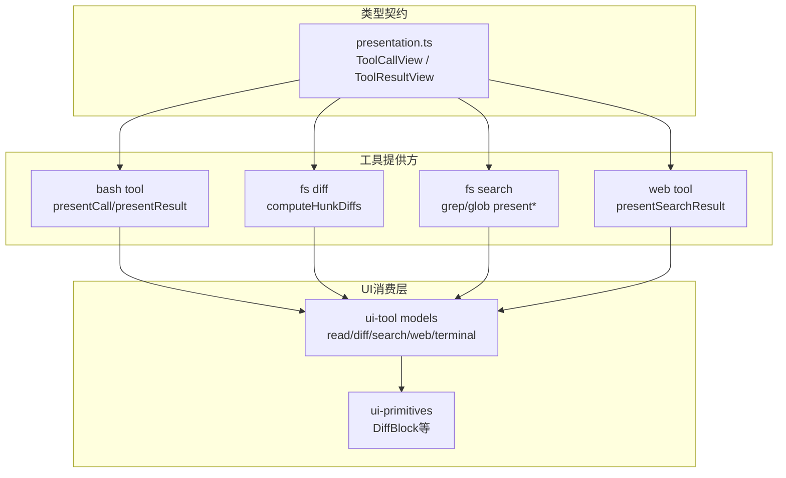
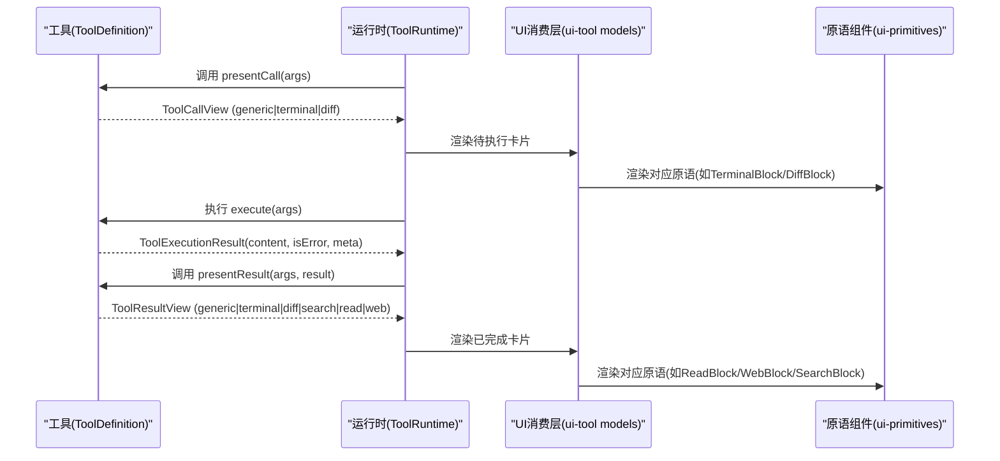
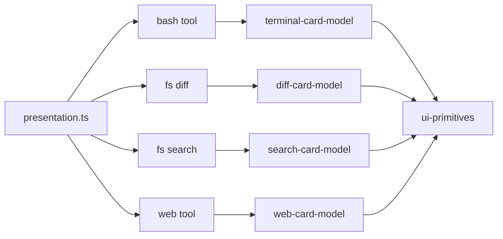

# 工具UI呈现

<cite>
**本文引用的文件**
- [packages/core/tools/src/presentation.ts](file://packages/core/tools/src/presentation.ts)
- [packages/core/tools/src/index.ts](file://packages/core/tools/src/index.ts)
- [packages/shell/tool-bash/src/index.ts](file://packages/shell/tool-bash/src/index.ts)
- [packages/fs/tool-fs/src/diff.ts](file://packages/fs/tool-fs/src/diff.ts)
- [packages/fs/tool-fs-search/src/index.ts](file://packages/fs/tool-fs-search/src/index.ts)
- [packages/web/tool-web/src/search.ts](file://packages/web/tool-web/src/search.ts)
- [packages/client/ui-tool/src/contract/slots.ts](file://packages/client/ui-tool/src/contract/slots.ts)
- [packages/client/ui-tool/src/client/tool/models/read-card-model.ts](file://packages/client/ui-tool/src/client/tool/models/read-card-model.ts)
- [packages/client/ui-tool/src/client/tool/models/diff-card-model.ts](file://packages/client/ui-tool/src/client/tool/models/diff-card-model.ts)
- [packages/client/ui-tool/src/client/tool/models/search-card-model.ts](file://packages/client/ui-tool/src/client/tool/models/search-card-model.ts)
- [packages/client/ui-tool/src/client/tool/models/web-card-model.ts](file://packages/client/ui-tool/src/client/tool/models/web-card-model.ts)
- [packages/client/ui-tool/src/client/tool/models/terminal-card-model.ts](file://packages/client/ui-tool/src/client/tool/models/terminal-card-model.ts)
- [packages/client/ui-primitives/src/DiffBlock.tsx](file://packages/client/ui-primitives/src/DiffBlock.tsx)
</cite>

## 目录
1. [简介](#简介)
2. [项目结构](#项目结构)
3. [核心组件](#核心组件)
4. [架构总览](#架构总览)
5. [详细组件分析](#详细组件分析)
6. [依赖关系分析](#依赖关系分析)
7. [性能考虑](#性能考虑)
8. [故障排查指南](#故障排查指南)
9. [结论](#结论)
10. [附录](#附录)

## 简介
本文件面向DeepSeek Harness的工具UI呈现系统，聚焦于“工具调用前后”的自定义用户界面能力。通过ToolCallView与ToolResultView接口，工具可以在执行前（pending）和执行后（completed）分别声明卡片渲染意图；前端桥接层根据card标签将意图映射为具体卡片：generic、terminal、diff、search、read、web。文档同时解释共享数据结构FileLocation、FileDiff、ReadFileLine的用途，并给出实现自定义工具卡片的实践路径与适配不同UI需求的建议。

## 项目结构
- 类型契约层：定义所有卡片与结果视图的类型，位于core/tools的presentation模块，供工具提供方与UI消费方共同遵守。
- 工具提供方：各工具在自身包内实现presentCall/presentResult，返回上述类型以驱动UI。
- UI消费层：ui-tool负责把会话快照中的call/result转换为模型（model），再交由ui-primitives原语组件渲染。

图表来源
- [packages/core/tools/src/presentation.ts:1-390](file://packages/core/tools/src/presentation.ts#L1-L390)
- [packages/shell/tool-bash/src/index.ts:95-118](file://packages/shell/tool-bash/src/index.ts#L95-L118)
- [packages/fs/tool-fs/src/diff.ts:22-57](file://packages/fs/tool-fs/src/diff.ts#L22-L57)
- [packages/fs/tool-fs-search/src/index.ts:1-161](file://packages/fs/tool-fs-search/src/index.ts#L1-L161)
- [packages/web/tool-web/src/search.ts:96-216](file://packages/web/tool-web/src/search.ts#L96-L216)
- [packages/client/ui-tool/src/client/tool/models/read-card-model.ts](file://packages/client/ui-tool/src/client/tool/models/read-card-model.ts)
- [packages/client/ui-tool/src/client/tool/models/diff-card-model.ts](file://packages/client/ui-tool/src/client/tool/models/diff-card-model.ts)
- [packages/client/ui-tool/src/client/tool/models/search-card-model.ts](file://packages/client/ui-tool/src/client/tool/models/search-card-model.ts)
- [packages/client/ui-tool/src/client/tool/models/web-card-model.ts](file://packages/client/ui-tool/src/client/tool/models/web-card-model.ts)
- [packages/client/ui-tool/src/client/tool/models/terminal-card-model.ts](file://packages/client/ui-tool/src/client/tool/models/terminal-card-model.ts)
- [packages/client/ui-primitives/src/DiffBlock.tsx:1-32](file://packages/client/ui-primitives/src/DiffBlock.tsx#L1-L32)

章节来源
- [packages/core/tools/src/presentation.ts:1-390](file://packages/core/tools/src/presentation.ts#L1-L390)
- [packages/core/tools/src/index.ts:109-135](file://packages/core/tools/src/index.ts#L109-L135)

## 核心组件
- ToolCallView：描述一次工具调用的“待执行”状态如何展示，包含generic、terminal、diff三种卡片。
- ToolResultView：描述一次工具调用的“已完成”状态如何展示，包含generic、terminal、diff、search、read、web六种卡片。
- 共享数据结构：
  - FileLocation：用于编辑器跟随高亮或跳转（path, line）。
  - FileDiff：单文件变更（path, oldText|null, newText）。
  - ReadFileLine：读取窗口的行单元（number, text）。

这些类型由工具提供方通过ToolDefinition.presentCall/presentResult返回，UI消费方按card分支渲染。

章节来源
- [packages/core/tools/src/presentation.ts:10-130](file://packages/core/tools/src/presentation.ts#L10-L130)
- [packages/core/tools/src/presentation.ts:132-390](file://packages/core/tools/src/presentation.ts#L132-L390)
- [packages/core/tools/src/index.ts:270-287](file://packages/core/tools/src/index.ts#L270-L287)

## 架构总览
工具调用生命周期与UI呈现的关键阶段：
- 执行前：工具提供presentCall，返回ToolCallView。UI据此显示“正在运行”的卡片。
- 执行中：工具体执行，可能产生中间输出（如终端输出流式追加）。
- 执行后：工具提供presentResult，返回ToolResultView。UI据此替换或增强“已完成”的卡片内容。

图表来源
- [packages/core/tools/src/index.ts:270-287](file://packages/core/tools/src/index.ts#L270-L287)
- [packages/core/tools/src/presentation.ts:46-140](file://packages/core/tools/src/presentation.ts#L46-L140)
- [packages/client/ui-tool/src/client/tool/models/terminal-card-model.ts](file://packages/client/ui-tool/src/client/tool/models/terminal-card-model.ts)
- [packages/client/ui-tool/src/client/tool/models/read-card-model.ts](file://packages/client/ui-tool/src/client/tool/models/read-card-model.ts)
- [packages/client/ui-tool/src/client/tool/models/diff-card-model.ts](file://packages/client/ui-tool/src/client/tool/models/diff-card-model.ts)
- [packages/client/ui-tool/src/client/tool/models/search-card-model.ts](file://packages/client/ui-tool/src/client/tool/models/search-card-model.ts)
- [packages/client/ui-tool/src/client/tool/models/web-card-model.ts](file://packages/client/ui-tool/src/client/tool/models/web-card-model.ts)

## 详细组件分析

### generic卡片（通用显示）
- 适用场景：大多数非特殊化的工具调用，作为默认卡片承载标题、类别图标、关键输入摘要、附加内容块以及文件跟随位置。
- 设计要点：
  - 标题应简洁可读，适合做卡片头/日志行。
  - kind用于选择图标或处理策略（read/edit/delete/move/search/execute/other）。
  - rawInput可展示关键输入（字符串或JSON对象）。
  - content可携带UI友好的内容块。
  - locations用于编辑器跟随（path, line）。
- 典型用法：后台任务、代码执行、其他通用操作。

章节来源
- [packages/core/tools/src/presentation.ts:48-75](file://packages/core/tools/src/presentation.ts#L48-L75)
- [packages/core/tools/src/presentation.ts:142-155](file://packages/core/tools/src/presentation.ts#L142-L155)

### terminal卡片（终端输出展示）
- 适用场景：前台命令执行（如bash/pwsh/terminal_send），需要显示工作目录、命令标题、描述和最终输出/退出码/信号。
- 设计要点：
  - title为命令本身，description为命令说明。
  - cwd可为绝对或相对路径，UI桥接层会结合会话工作区解析。
  - 完成态使用TerminalResultView，携带output、exitCode或signal。
- 示例参考：bash工具的presentCall将前台命令呈现为terminal卡片，后台任务呈现为generic卡片。

章节来源
- [packages/core/tools/src/presentation.ts:77-100](file://packages/core/tools/src/presentation.ts#L77-L100)
- [packages/core/tools/src/presentation.ts:157-176](file://packages/core/tools/src/presentation.ts#L157-L176)
- [packages/shell/tool-bash/src/index.ts:95-118](file://packages/shell/tool-bash/src/index.ts#L95-L118)

### diff卡片（文件变更对比）
- 适用场景：写文件或编辑文件（write/edit），在调用时即可基于参数生成“即将变更”的预览；完成后返回已应用的上下文hunks。
- 设计要点：
  - DiffCallView在调用时提供title与diffs（oldText=null表示新建或覆盖）。
  - DiffResultView在完成后提供实际应用的diffs（带上下文的hunk或整文件diff）。
  - computeHunkDiffs从before/after文本计算hunks，过滤无意义的换行标记，保持纯函数特性。
- UI侧：ui-primitives的DiffBlock负责渲染差异块，支持折叠与最大行数限制。

章节来源
- [packages/core/tools/src/presentation.ts:102-118](file://packages/core/tools/src/presentation.ts#L102-L118)
- [packages/core/tools/src/presentation.ts:178-190](file://packages/core/tools/src/presentation.ts#L178-L190)
- [packages/fs/tool-fs/src/diff.ts:22-57](file://packages/fs/tool-fs/src/diff.ts#L22-L57)
- [packages/client/ui-primitives/src/DiffBlock.tsx:1-32](file://packages/client/ui-primitives/src/DiffBlock.tsx#L1-L32)

### search卡片（搜索结果呈现）
- 适用场景：文件内容搜索（grep）与路径发现（glob），完成态以结构化数据呈现匹配项或路径列表，并携带截断提示。
- 设计要点：
  - SearchResultView包含两种shape：matches（按文件分组匹配行）与paths（扁平路径列表）。
  - truncated/total指示是否被截断及总数，避免UI误以为结果完整。
  - 工具提供presentCall（generic，kind=search）与presentResult（search卡片）。
- 示例参考：fs-search插件注册grep/glob工具，并提供presentGrepCall/presentGrepResult、presentGlobCall/presentGlobResult。

章节来源
- [packages/core/tools/src/presentation.ts:192-267](file://packages/core/tools/src/presentation.ts#L192-L267)
- [packages/fs/tool-fs-search/src/index.ts:1-161](file://packages/fs/tool-fs-search/src/index.ts#L1-L161)

### read卡片（文件读取显示）
- 适用场景：读取文件文本并以行窗口形式展示，支持语法高亮语言提示与“显示N/M”的导航信息。
- 设计要点：
  - ReadResultView携带path、offset、lines（ReadFileLine[]）、totalLines、可选lang与content回退。
  - ReadFileLine是行单元（number, text），保留文件原始行号。
  - UI侧通过read-card-model将resultView转为组件props，确保聊天行与详情面板一致渲染。
- 示例参考：read工具的结果通过presentationMeta持久化，presentResult将其窄化为ReadResultView。

章节来源
- [packages/core/tools/src/presentation.ts:120-130](file://packages/core/tools/src/presentation.ts#L120-L130)
- [packages/core/tools/src/presentation.ts:269-308](file://packages/core/tools/src/presentation.ts#L269-L308)
- [packages/client/ui-tool/src/client/tool/models/read-card-model.ts](file://packages/client/ui-tool/src/client/tool/models/read-card-model.ts)

### web卡片（网页检索结果）
- 适用场景：web_search与web_fetch的完成态结构化呈现，前者展示引用源与可选答案，后者展示抓取URL与HTTP状态。
- 设计要点：
  - WebResultView为card:'web'的联合，通过kind区分'search'与'fetch'。
  - WebSource包含url、title、snippet、publishedAt等字段，便于构建引用列表。
  - 工具提供presentSearchCall（generic，kind=search）与presentSearchResult（web卡片）。
- 示例参考：web工具将structured sources通过meta传递，presentSearchResult从中构造WebSearchResultView。

章节来源
- [packages/core/tools/src/presentation.ts:310-389](file://packages/core/tools/src/presentation.ts#L310-L389)
- [packages/web/tool-web/src/search.ts:96-216](file://packages/web/tool-web/src/search.ts#L96-L216)
- [packages/client/ui-tool/src/client/tool/models/web-card-model.ts](file://packages/client/ui-tool/src/client/tool/models/web-card-model.ts)

### presentCall与presentResult的作用
- presentCall：在工具执行前，基于参数生成“待执行”卡片，使UI能提前展示有意义的标题、描述、工作目录或变更预览。
- presentResult：在工具执行后，基于结果与元数据生成“已完成”卡片，替换或增强展示，例如终端输出、diff hunks、搜索结果、读取窗口、web引用等。
- 两者都必须是纯函数且可回放，因为会在实时流与日志回放中重复调用。

章节来源
- [packages/core/tools/src/index.ts:270-287](file://packages/core/tools/src/index.ts#L270-L287)
- [packages/core/tools/src/presentation.ts:42-46](file://packages/core/tools/src/presentation.ts#L42-L46)
- [packages/core/tools/src/presentation.ts:132-140](file://packages/core/tools/src/presentation.ts#L132-L140)

### 共享数据结构用法
- FileLocation：用于编辑器跟随（如read的offset行、diff的目标文件）。
- FileDiff：用于diff卡片的单文件变更（newText为变更后内容，oldText为变更前内容或null）。
- ReadFileLine：用于read卡片的行窗口（保留文件原始行号）。

章节来源
- [packages/core/tools/src/presentation.ts:17-40](file://packages/core/tools/src/presentation.ts#L17-L40)
- [packages/core/tools/src/presentation.ts:120-130](file://packages/core/tools/src/presentation.ts#L120-L130)

## 依赖关系分析
- 类型契约（presentation.ts）被工具提供方与UI消费方共同依赖。
- 工具提供方（bash、fs、web、fs-search）通过presentCall/presentResult产出统一类型。
- UI消费层（ui-tool models）将会话快照中的call/result转换为模型，再交给ui-primitives原语组件渲染。

图表来源
- [packages/core/tools/src/presentation.ts:1-390](file://packages/core/tools/src/presentation.ts#L1-L390)
- [packages/shell/tool-bash/src/index.ts:95-118](file://packages/shell/tool-bash/src/index.ts#L95-L118)
- [packages/fs/tool-fs/src/diff.ts:22-57](file://packages/fs/tool-fs/src/diff.ts#L22-L57)
- [packages/fs/tool-fs-search/src/index.ts:1-161](file://packages/fs/tool-fs-search/src/index.ts#L1-L161)
- [packages/web/tool-web/src/search.ts:96-216](file://packages/web/tool-web/src/search.ts#L96-L216)
- [packages/client/ui-tool/src/client/tool/models/terminal-card-model.ts](file://packages/client/ui-tool/src/client/tool/models/terminal-card-model.ts)
- [packages/client/ui-tool/src/client/tool/models/diff-card-model.ts](file://packages/client/ui-tool/src/client/tool/models/diff-card-model.ts)
- [packages/client/ui-tool/src/client/tool/models/search-card-model.ts](file://packages/client/ui-tool/src/client/tool/models/search-card-model.ts)
- [packages/client/ui-tool/src/client/tool/models/web-card-model.ts](file://packages/client/ui-tool/src/client/tool/models/web-card-model.ts)

章节来源
- [packages/core/tools/src/index.ts:109-135](file://packages/core/tools/src/index.ts#L109-L135)

## 性能考虑
- 大文件diff：computeHunkDiffs仅对变更区域生成hunks，避免全量比较；UI侧DiffBlock支持最大行数折叠，减少渲染压力。
- 搜索限制：grep/glob通过配置限制inline结果大小，超限时落盘并提示truncated/total，避免阻塞UI。
- 终端输出：TerminalResultView仅携带必要字段（output、exitCode/signal），UI在无能力时回退到围栏文本，降低复杂度。
- 读取窗口：ReadResultView只携带请求窗口内的行，配合totalLines实现分页展示，减少内存占用。

[本节为通用指导，不直接分析具体文件]

## 故障排查指南
- 未知card值：若UI遇到未识别的card，应回退到原始tool/result内容，保证兼容性。
- 缺失meta：web_search/web_fetch的presentResult需防御性检查meta是否存在与合法，否则返回undefined走generic路径。
- 错误结果：多数presentResult在isError时返回undefined，保持generic卡片并显示错误文本。
- 路径与cwd：terminal卡片的相对cwd由UI桥接层解析，工具不应假设绝对路径语义。

章节来源
- [packages/web/tool-web/src/search.ts:204-216](file://packages/web/tool-web/src/search.ts#L204-L216)
- [packages/core/tools/src/presentation.ts:132-140](file://packages/core/tools/src/presentation.ts#L132-L140)
- [packages/core/tools/src/presentation.ts:77-100](file://packages/core/tools/src/presentation.ts#L77-L100)

## 结论
通过ToolCallView与ToolResultView的tagged union设计，DeepSeek Harness实现了工具调用前后一致的UI呈现契约。generic、terminal、diff、search、read、web六类卡片覆盖了常见工具交互场景；presentCall与presentResult提供了强大的自定义能力。配合FileLocation、FileDiff、ReadFileLine等共享结构，UI消费方可稳定地将结构化数据转化为高质量的用户界面。

[本节为总结，不直接分析具体文件]

## 附录
- 自定义工具卡片实现步骤（示例路径）：
  - 在工具定义中添加presentCall，返回合适的ToolCallView（如generic或terminal）。
    - 参考：[packages/shell/tool-bash/src/index.ts:95-118](file://packages/shell/tool-bash/src/index.ts#L95-L118)
  - 在工具定义中添加presentResult，返回合适的ToolResultView（如diff、search、read、web）。
    - 参考：
      - [packages/fs/tool-fs/src/diff.ts:22-57](file://packages/fs/tool-fs/src/diff.ts#L22-L57)
      - [packages/fs/tool-fs-search/src/index.ts:1-161](file://packages/fs/tool-fs-search/src/index.ts#L1-L161)
      - [packages/web/tool-web/src/search.ts:96-216](file://packages/web/tool-web/src/search.ts#L96-L216)
  - 确保UI消费层存在对应的card分支与模型转换：
    - 参考：
      - [packages/client/ui-tool/src/client/tool/models/read-card-model.ts](file://packages/client/ui-tool/src/client/tool/models/read-card-model.ts)
      - [packages/client/ui-tool/src/client/tool/models/diff-card-model.ts](file://packages/client/ui-tool/src/client/tool/models/diff-card-model.ts)
      - [packages/client/ui-tool/src/client/tool/models/search-card-model.ts](file://packages/client/ui-tool/src/client/tool/models/search-card-model.ts)
      - [packages/client/ui-tool/src/client/tool/models/web-card-model.ts](file://packages/client/ui-tool/src/client/tool/models/web-card-model.ts)
      - [packages/client/ui-tool/src/client/tool/models/terminal-card-model.ts](file://packages/client/ui-tool/src/client/tool/models/terminal-card-model.ts)
  - 如需新增card，需在类型契约与UI消费层同步扩展，确保switch穷尽性。

章节来源
- [packages/core/tools/src/presentation.ts:1-390](file://packages/core/tools/src/presentation.ts#L1-L390)
- [packages/client/ui-tool/src/contract/slots.ts](file://packages/client/ui-tool/src/contract/slots.ts)