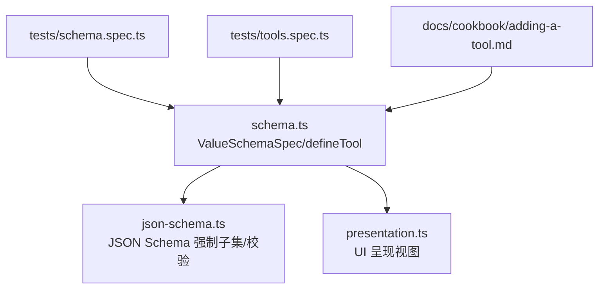
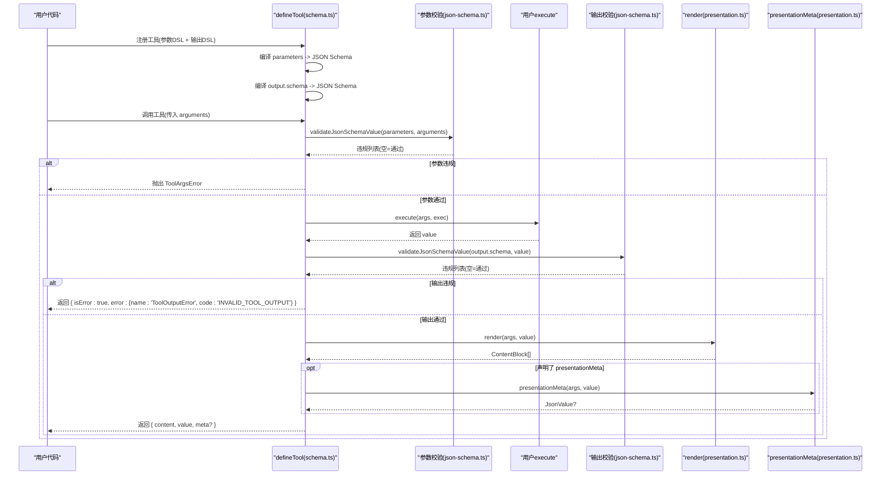
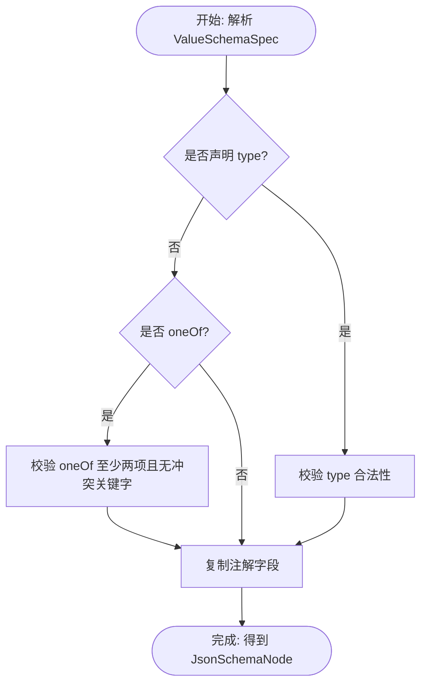
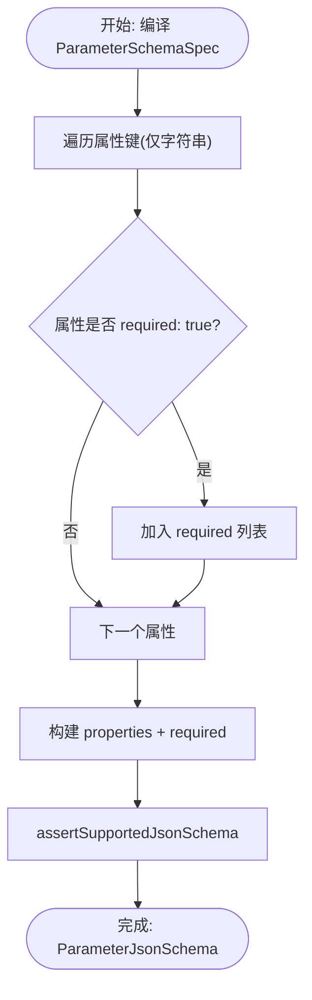
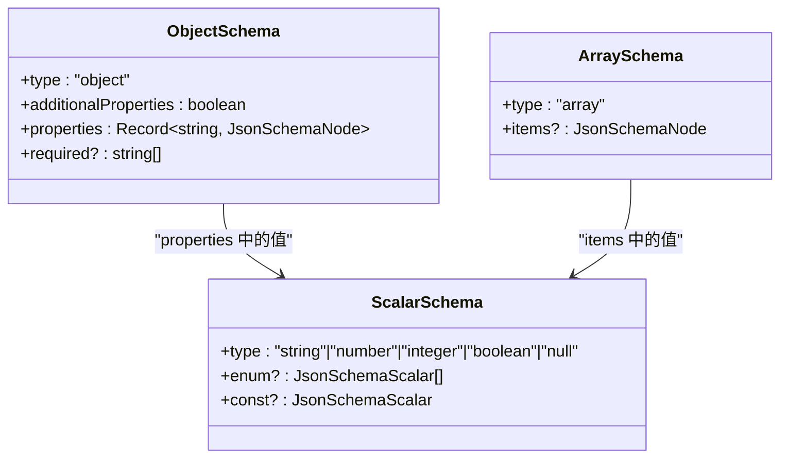
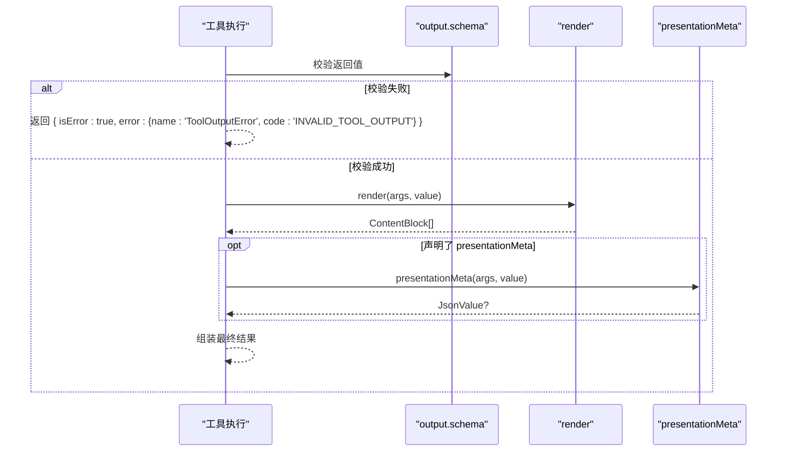
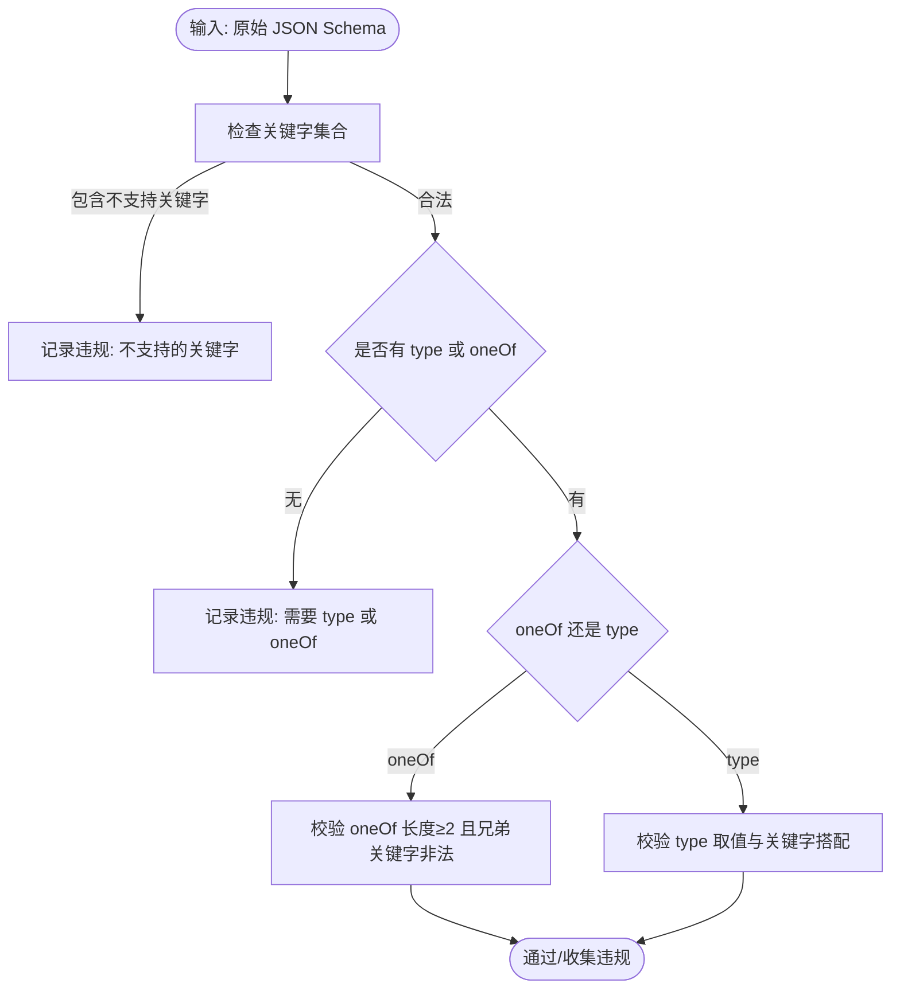
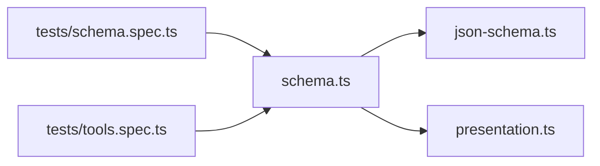

# 工具参数与输出验证

<cite>
**本文引用的文件**
- [packages/core/tools/src/schema.ts](file://packages/core/tools/src/schema.ts)
- [packages/core/tools/src/json-schema.ts](file://packages/core/tools/src/json-schema.ts)
- [packages/core/tools/src/presentation.ts](file://packages/core/tools/src/presentation.ts)
- [packages/core/tools/tests/schema.spec.ts](file://packages/core/tools/tests/schema.spec.ts)
- [packages/core/tools/tests/tools.spec.ts](file://packages/core/tools/tests/tools.spec.ts)
- [docs/cookbook/adding-a-tool.md](file://docs/cookbook/adding-a-tool.md)
</cite>

## 目录
1. [简介](#简介)
2. [项目结构](#项目结构)
3. [核心组件](#核心组件)
4. [架构总览](#架构总览)
5. [详细组件分析](#详细组件分析)
6. [依赖关系分析](#依赖关系分析)
7. [性能考量](#性能考量)
8. [故障排查指南](#故障排查指南)
9. [结论](#结论)
10. [附录：示例与最佳实践](#附录示例与最佳实践)

## 简介
本文件系统性说明 DeepSeek Harness 的工具参数与输出验证系统，重点覆盖：
- ValueSchemaSpec 类型系统与 JSON Schema 强制子集
- defineTool 的参数定义语法、required 处理、对象嵌套与数组约束
- 输出验证机制：ToolOutputDefinition 的作用、render 实现要求、presentationMeta 的使用场景
- 运行时验证流程与错误处理
- 复杂参数结构的定义方式与常见错误处理策略

## 项目结构
围绕工具参数与输出验证的核心代码位于 packages/core/tools 包中：
- schema.ts：作者级 ValueSchemaSpec DSL、参数编译、defineTool 实现、类型推断
- json-schema.ts：受支持的 JSON Schema 强制子集、校验器、错误类型
- presentation.ts：UI 呈现视图（与 output.presentationMeta 配合）
- tests/*：覆盖行为与边界用例

**图表来源**
- [packages/core/tools/src/schema.ts:1-618](file://packages/core/tools/src/schema.ts#L1-L618)
- [packages/core/tools/src/json-schema.ts:1-657](file://packages/core/tools/src/json-schema.ts#L1-L657)
- [packages/core/tools/src/presentation.ts:1-390](file://packages/core/tools/src/presentation.ts#L1-L390)
- [packages/core/tools/tests/schema.spec.ts:1-200](file://packages/core/tools/tests/schema.spec.ts#L1-L200)
- [packages/core/tools/tests/tools.spec.ts:233-310](file://packages/core/tools/tests/tools.spec.ts#L233-L310)
- [docs/cookbook/adding-a-tool.md:65-69](file://docs/cookbook/adding-a-tool.md#L65-L69)

**章节来源**
- [packages/core/tools/src/schema.ts:1-618](file://packages/core/tools/src/schema.ts#L1-L618)
- [packages/core/tools/src/json-schema.ts:1-657](file://packages/core/tools/src/json-schema.ts#L1-L657)
- [packages/core/tools/src/presentation.ts:1-390](file://packages/core/tools/src/presentation.ts#L1-L390)

## 核心组件
- ValueSchemaSpec：统一的值级 JSON Schema 作者 DSL，支持 string/number/integer/boolean/null/array/object/json/oneOf，并附带描述性注解。
- ParameterSchemaSpec：工具参数的隐式开放对象根，属性通过 required: true 标记必填。
- defineTool：将作者 DSL 编译为受控的 JSON Schema，并在执行前严格校验参数；同时封装输出 schema、render、presentationMeta 的调用与验证。
- JSON Schema 强制子集：仅允许 type/oneOf/properties/required/additionalProperties/items/enum/const 及注解关键字，拒绝不支持的关键字或组合。
- 输出验证：execute 返回值必须匹配 output.schema；render 负责模型侧内容生成；presentationMeta 提供可重放的结构化元数据。

**章节来源**
- [packages/core/tools/src/schema.ts:12-176](file://packages/core/tools/src/schema.ts#L12-L176)
- [packages/core/tools/src/schema.ts:432-458](file://packages/core/tools/src/schema.ts#L432-L458)
- [packages/core/tools/src/schema.ts:482-590](file://packages/core/tools/src/schema.ts#L482-L590)
- [packages/core/tools/src/json-schema.ts:1-56](file://packages/core/tools/src/json-schema.ts#L1-L56)
- [packages/core/tools/src/json-schema.ts:378-405](file://packages/core/tools/src/json-schema.ts#L378-L405)

## 架构总览
下图展示了从 defineTool 到参数校验、执行、输出校验与渲染的完整流程。

**图表来源**
- [packages/core/tools/src/schema.ts:545-617](file://packages/core/tools/src/schema.ts#L545-L617)
- [packages/core/tools/src/json-schema.ts:646-656](file://packages/core/tools/src/json-schema.ts#L646-L656)
- [packages/core/tools/tests/tools.spec.ts:233-310](file://packages/core/tools/tests/tools.spec.ts#L233-L310)

## 详细组件分析

### ValueSchemaSpec 类型系统与类型推断
- 支持类型：string、number、integer、boolean、null、array、object、json、oneOf。
- 注解字段：description、title、default、examples（不参与校验，但需为无损 JSON）。
- 对象节点必须显式声明 additionalProperties（true/false），避免意外开启“开放对象”。
- oneOf 至少两个分支，且不能与 type 并存。
- 类型推断：InferValue 根据 const/enum 推导精确字面量类型；InferArgs 根据 required: true 推导必填键；深度限制为 16 层，超出回退为 JsonValue。

**图表来源**
- [packages/core/tools/src/schema.ts:331-413](file://packages/core/tools/src/schema.ts#L331-L413)
- [packages/core/tools/src/json-schema.ts:226-376](file://packages/core/tools/src/json-schema.ts#L226-L376)

**章节来源**
- [packages/core/tools/src/schema.ts:12-176](file://packages/core/tools/src/schema.ts#L12-L176)
- [packages/core/tools/src/schema.ts:331-413](file://packages/core/tools/src/schema.ts#L331-L413)
- [packages/core/tools/tests/schema.spec.ts:14-34](file://packages/core/tools/tests/schema.spec.ts#L14-L34)
- [packages/core/tools/tests/schema.spec.ts:142-187](file://packages/core/tools/tests/schema.spec.ts#L142-L187)

### defineTool 参数定义语法与 required 处理
- 参数根为隐式开放对象，属性键为字符串；symbol 键会被拒绝。
- 属性上 required 只能为 true 或缺省；若存在则收集到 required 数组。
- 对象属性 properties 中的 required 同样被收集并投影到 JSON Schema。
- 编译过程使用任务图避免递归栈溢出，支持深层嵌套。

**图表来源**
- [packages/core/tools/src/schema.ts:274-329](file://packages/core/tools/src/schema.ts#L274-L329)
- [packages/core/tools/src/schema.ts:416-458](file://packages/core/tools/src/schema.ts#L416-L458)

**章节来源**
- [packages/core/tools/src/schema.ts:96-111](file://packages/core/tools/src/schema.ts#L96-L111)
- [packages/core/tools/src/schema.ts:274-329](file://packages/core/tools/src/schema.ts#L274-L329)
- [packages/core/tools/src/schema.ts:416-458](file://packages/core/tools/src/schema.ts#L416-L458)
- [packages/core/tools/tests/tools.spec.ts:2047-2071](file://packages/core/tools/tests/tools.spec.ts#L2047-L2071)

### 对象类型的嵌套定义与数组类型的约束
- 对象：必须显式 additionalProperties；可选 properties；required 在属性级别声明。
- 数组：items 为子 schema；未声明 items 接受任意 JSON 项。
- 循环引用检测：编译期拒绝循环 schema。

**图表来源**
- [packages/core/tools/src/json-schema.ts:31-56](file://packages/core/tools/src/json-schema.ts#L31-L56)
- [packages/core/tools/src/schema.ts:365-395](file://packages/core/tools/src/schema.ts#L365-L395)

**章节来源**
- [packages/core/tools/src/schema.ts:365-395](file://packages/core/tools/src/schema.ts#L365-L395)
- [packages/core/tools/tests/schema.spec.ts:36-58](file://packages/core/tools/tests/schema.spec.ts#L36-L58)
- [packages/core/tools/tests/schema.spec.ts:104-112](file://packages/core/tools/tests/schema.spec.ts#L104-L112)

### 输出验证机制：ToolOutputDefinition、render 与 presentationMeta
- output.schema：对 execute 返回值进行严格校验，不匹配则返回 INVALID_TOOL_OUTPUT 错误。
- render：将已校验的 canonical value 转换为模型侧内容块（ContentBlock[]）。
- presentationMeta：可选，用于直接顶层调用时携带可重放的结构化元数据（如 diff、read 窗口信息等）。
- 测试覆盖了 render/presentationMeta 抛错、hostile getter 等异常路径，均归类为 INVALID_TOOL_OUTPUT。

**图表来源**
- [packages/core/tools/src/schema.ts:482-590](file://packages/core/tools/src/schema.ts#L482-L590)
- [packages/core/tools/tests/tools.spec.ts:233-310](file://packages/core/tools/tests/tools.spec.ts#L233-L310)

**章节来源**
- [packages/core/tools/src/schema.ts:482-590](file://packages/core/tools/src/schema.ts#L482-L590)
- [packages/core/tools/tests/tools.spec.ts:233-310](file://packages/core/tools/tests/tools.spec.ts#L233-L310)
- [docs/cookbook/adding-a-tool.md:65-69](file://docs/cookbook/adding-a-tool.md#L65-L69)

### JSON Schema 强制子集：支持的类型、关键字与规则
- 支持类型：object、array、string、number、integer、boolean、null。
- 关键字：type、oneOf、properties、required、additionalProperties、items、enum、const。
- 注解：description、title、default、examples（需为无损 JSON）。
- 规则要点：
  - oneOf 至少两项，且不可与 type 共存；oneOf 旁禁止 properties/required/additionalProperties/items/enum/const。
  - object 的 required 名称必须在 properties 中声明。
  - enum/const 必须与 declared type 一致；当同时声明 enum 与 const 时，const 必须属于 enum。
  - 拒绝循环 schema 与非法原型链对象。

**图表来源**
- [packages/core/tools/src/json-schema.ts:76-87](file://packages/core/tools/src/json-schema.ts#L76-L87)
- [packages/core/tools/src/json-schema.ts:199-376](file://packages/core/tools/src/json-schema.ts#L199-L376)

**章节来源**
- [packages/core/tools/src/json-schema.ts:1-56](file://packages/core/tools/src/json-schema.ts#L1-L56)
- [packages/core/tools/src/json-schema.ts:199-376](file://packages/core/tools/src/json-schema.ts#L199-L376)
- [packages/core/tools/tests/schema.spec.ts:60-102](file://packages/core/tools/tests/schema.spec.ts#L60-L102)

## 依赖关系分析
- schema.ts 依赖 json-schema.ts 提供的 assertSupportedJsonSchema、validateJsonSchemaValue 等能力。
- defineTool 将作者 DSL 编译为受控 JSON Schema，并在执行前后分别校验参数与输出。
- presentation.ts 提供 UI 呈现视图类型，供 presentCall/presentResult 与 output.presentationMeta 协作。

**图表来源**
- [packages/core/tools/src/schema.ts:1-10](file://packages/core/tools/src/schema.ts#L1-L10)
- [packages/core/tools/src/json-schema.ts:1-16](file://packages/core/tools/src/json-schema.ts#L1-L16)
- [packages/core/tools/src/presentation.ts:1-9](file://packages/core/tools/src/presentation.ts#L1-L9)

**章节来源**
- [packages/core/tools/src/schema.ts:1-10](file://packages/core/tools/src/schema.ts#L1-L10)
- [packages/core/tools/src/json-schema.ts:1-16](file://packages/core/tools/src/json-schema.ts#L1-L16)
- [packages/core/tools/src/presentation.ts:1-9](file://packages/core/tools/src/presentation.ts#L1-L9)

## 性能考量
- 编译与校验采用任务图/帧栈模拟递归，避免深嵌套导致的调用栈溢出。
- 类型推断深度限制为 16 层，超出回退为 JsonValue，平衡类型精度与编译成本。
- 校验函数 validateJsonSchemaValue 为全函数（total），对任意输入均返回违规列表而非抛错，便于聚合诊断。

[本节为通用指导，无需特定文件来源]

## 故障排查指南
- 参数校验失败：抛出 ToolArgsError，包含 violations 数组，按 schema 遍历顺序列出所有路径问题。
- 输出校验失败：返回 { isError:true, error:{name:'ToolOutputError', code:'INVALID_TOOL_OUTPUT'} }，content 中包含具体路径违规信息。
- render/presentationMeta 抛错：同样归类为 INVALID_TOOL_OUTPUT，确保 UI 展示稳定。
- 常见错误：
  - 对象未声明 additionalProperties 导致编译失败。
  - oneOf 少于两项或与 type 同时声明。
  - enum/const 类型不匹配或 const 不在 enum 中。
  - 循环 schema 或非法原型链对象。

**章节来源**
- [packages/core/tools/src/schema.ts:460-480](file://packages/core/tools/src/schema.ts#L460-L480)
- [packages/core/tools/src/schema.ts:585-589](file://packages/core/tools/src/schema.ts#L585-L589)
- [packages/core/tools/tests/tools.spec.ts:233-310](file://packages/core/tools/tests/tools.spec.ts#L233-L310)
- [packages/core/tools/tests/schema.spec.ts:60-102](file://packages/core/tools/tests/schema.spec.ts#L60-L102)

## 结论
DeepSeek Harness 的工具参数与输出验证系统通过统一的 ValueSchemaSpec DSL 与严格的 JSON Schema 强制子集，实现了：
- 强类型与可推断的参数定义
- 安全的运行时参数与输出校验
- 清晰的错误分类与诊断信息
- 可扩展的 UI 呈现与结构化元数据传递

建议在设计工具时：
- 明确声明对象 openness（additionalProperties）
- 合理使用 oneOf 表达互斥结构
- 将人类可读解释放入 render，将程序化 API 放入 output.schema
- 利用 presentationMeta 传递可重放的 UI 元数据

[本节为总结性内容，无需特定文件来源]

## 附录：示例与最佳实践
- 定义复杂参数结构：
  - 使用 object + properties + required: true 组合嵌套对象
  - 使用 array + items 约束元素类型
  - 使用 oneOf 表达互斥分支
  - 参考：[packages/core/tools/tests/schema.spec.ts:36-58](file://packages/core/tools/tests/schema.spec.ts#L36-L58)、[packages/core/tools/tests/schema.spec.ts:142-187](file://packages/core/tools/tests/schema.spec.ts#L142-L187)

- 实现输出验证：
  - output.schema 描述 canonical value
  - render 将 canonical value 转为 ContentBlock[]
  - presentationMeta 可选，返回 JsonValue 作为结构化元数据
  - 参考：[packages/core/tools/src/schema.ts:482-590](file://packages/core/tools/src/schema.ts#L482-L590)、[packages/core/tools/tests/tools.spec.ts:233-310](file://packages/core/tools/tests/tools.spec.ts#L233-L310)

- 处理验证错误：
  - 捕获 ToolArgsError 并展示 violations
  - 对 INVALID_TOOL_OUTPUT 错误统一处理，避免崩溃
  - 参考：[packages/core/tools/src/schema.ts:460-480](file://packages/core/tools/src/schema.ts#L460-L480)、[packages/core/tools/tests/tools.spec.ts:233-310](file://packages/core/tools/tests/tools.spec.ts#L233-L310)

- 设计原则：
  - output.schema 作为程序化 API，render 负责人类可读解释
  - 参考：[docs/cookbook/adding-a-tool.md:65-69](file://docs/cookbook/adding-a-tool.md#L65-L69)

[本节为实践指引，结合上述文件路径定位具体实现与用例]