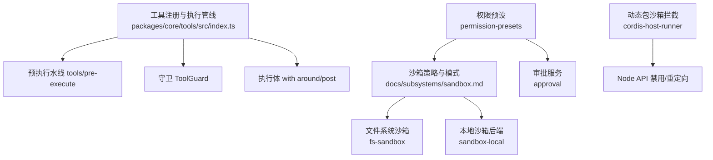
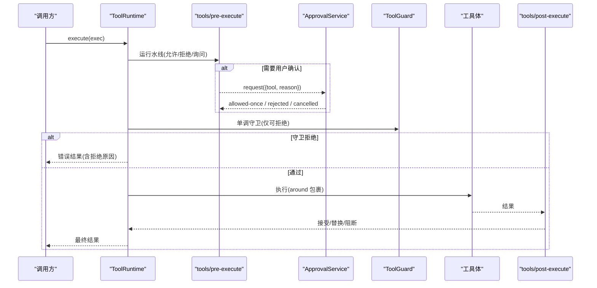
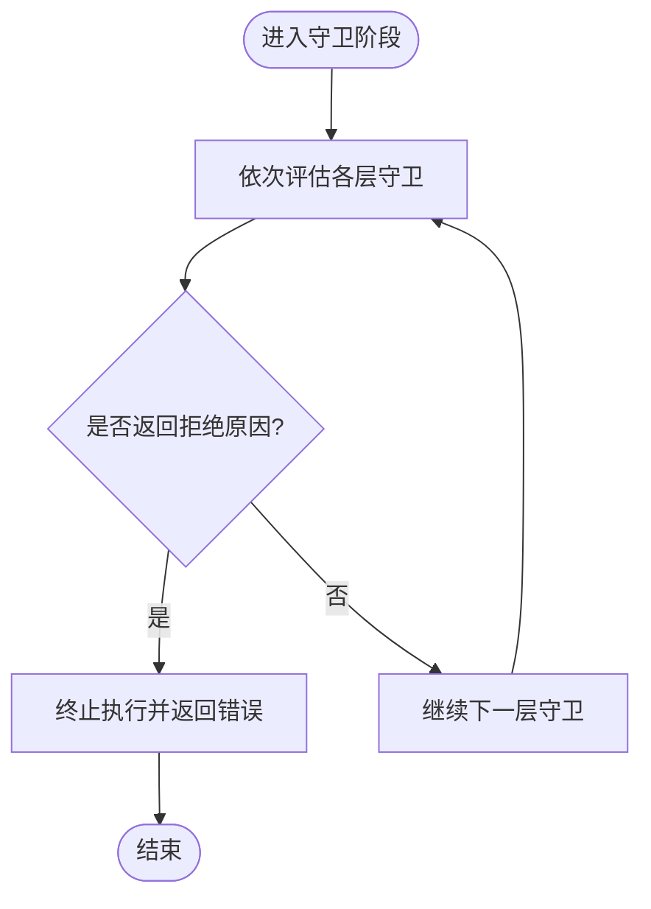
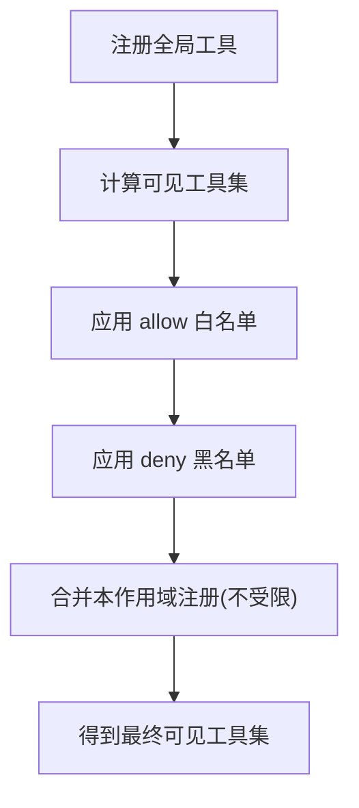
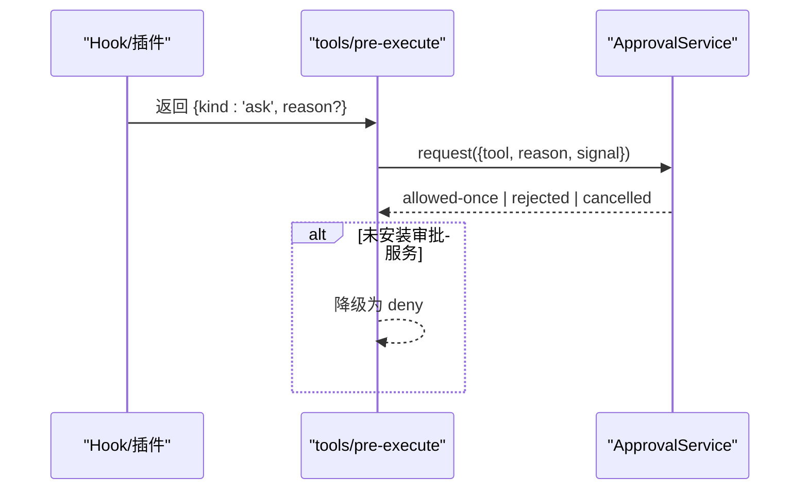
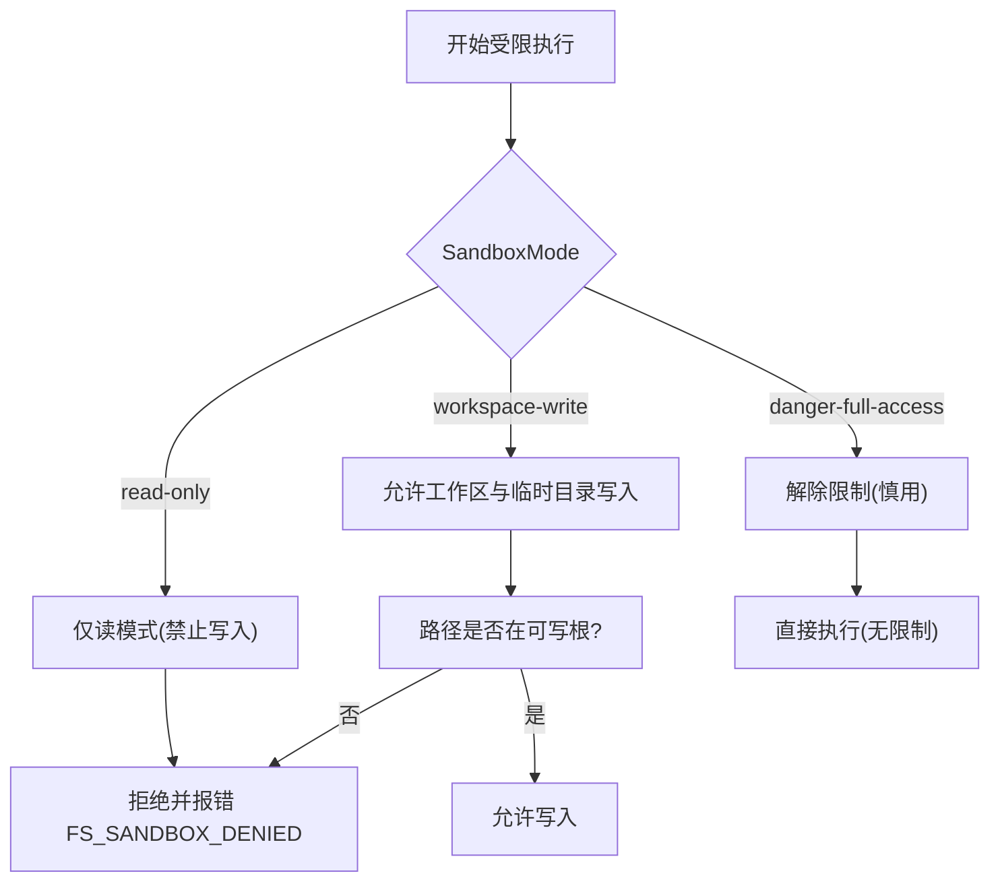
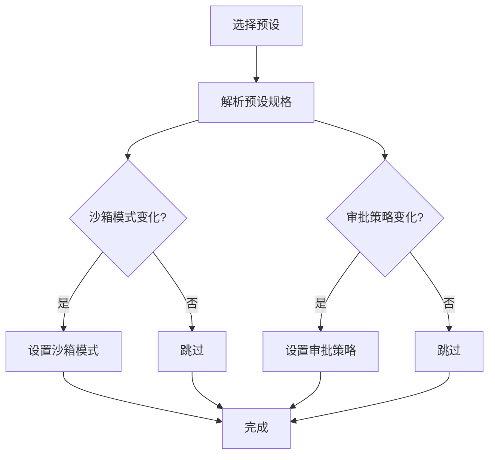
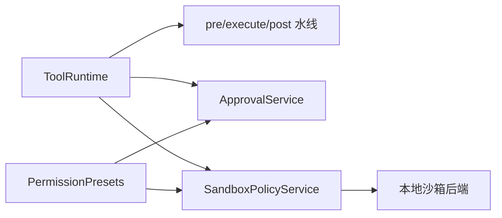

# 工具安全与权限控制

<cite>
**本文引用的文件**
- [packages/core/tools/src/index.ts](file://packages/core/tools/src/index.ts)
- [docs/subsystems/sandbox.md](file://docs/subsystems/sandbox.md)
- [packages/fs/fs-sandbox/tests/fs-sandbox.spec.ts](file://packages/fs/fs-sandbox/tests/fs-sandbox.spec.ts)
- [packages/sandbox/sandbox/src/roots.ts](file://packages/sandbox/sandbox/src/roots.ts)
- [packages/sandbox/sandbox-local/tests/landlock.e2e.ts](file://packages/sandbox/sandbox-local/tests/landlock.e2e.ts)
- [packages/sandbox/sandbox-local/tests/seatbelt.e2e.ts](file://packages/sandbox/sandbox-local/tests/seatbelt.e2e.ts)
- [packages/extensions/cordis-host-runner/src/sandbox.ts](file://packages/extensions/cordis-host-runner/src/sandbox.ts)
- [docs/subsystems/permission-presets.md](file://docs/subsystems/permission-presets.md)
- [packages/interaction/permission-presets/src/index.ts](file://packages/interaction/permission-presets/src/index.ts)
- [packages/hooks/hooks-claude-code/tests/bridge.spec.ts](file://packages/hooks/hooks-claude-code/tests/bridge.spec.ts)
- [snapshots/session/hook-cc-pretool-ask/workspace/hooks.json](file://snapshots/session/hook-cc-pretool-ask/workspace/hooks.json)
- [docs/subsystems/approval.md](file://docs/subsystems/approval.md)
</cite>

## 目录
1. [简介](#简介)
2. [项目结构](#项目结构)
3. [核心组件](#核心组件)
4. [架构总览](#架构总览)
5. [详细组件分析](#详细组件分析)
6. [依赖关系分析](#依赖关系分析)
7. [性能与安全考量](#性能与安全考量)
8. [故障排查指南](#故障排查指南)
9. [结论](#结论)
10. [附录：示例与最佳实践](#附录示例与最佳实践)

## 简介
本文件面向 DeepSeek Harness 的工具安全与权限控制系统，系统性说明以下能力：
- ToolGuard 守卫机制：守卫函数的实现方式、执行时机与单调拒绝语义。
- ToolRestriction 限制策略：allow/deny 列表配置方法、作用域与继承规则。
- 工具调用审批流程：tools/pre-execute 钩子中的 ask 决策、用户确认与降级策略。
- 沙箱环境下的执行限制：文件系统访问、网络请求与进程执行的权限控制边界。
- 实践指导：如何实现自定义权限检查、配置工具访问策略、处理权限拒绝情况。

## 项目结构
围绕“工具安全与权限控制”的关键代码与文档分布在如下位置：
- 工具注册与执行管线（pre-execute/guard/around/post）：packages/core/tools/src/index.ts
- 沙箱模式与执行策略：docs/subsystems/sandbox.md、packages/sandbox/sandbox/src/roots.ts
- 文件系统沙箱实现与测试：packages/fs/fs-sandbox/tests/fs-sandbox.spec.ts
- 本地沙箱后端（Landlock/Seatbelt/ACL）：packages/sandbox/sandbox-local/tests/*.ts
- 动态包沙箱对 Node API 的拦截：packages/extensions/cordis-host-runner/src/sandbox.ts
- 权限预设（沙箱+审批组合）：docs/subsystems/permission-presets.md、packages/interaction/permission-presets/src/index.ts
- 审批服务与 ask 行为：docs/subsystems/approval.md、hooks 用例与快照

图表来源
- [packages/core/tools/src/index.ts:704-1127](file://packages/core/tools/src/index.ts#L704-L1127)
- [docs/subsystems/sandbox.md:9-40](file://docs/subsystems/sandbox.md#L9-L40)
- [packages/interaction/permission-presets/src/index.ts:201-408](file://packages/interaction/permission-presets/src/index.ts#L201-L408)

章节来源
- [packages/core/tools/src/index.ts:704-1127](file://packages/core/tools/src/index.ts#L704-L1127)
- [docs/subsystems/sandbox.md:9-40](file://docs/subsystems/sandbox.md#L9-L40)

## 核心组件
- ToolRuntime：工具注册、可见性解析、执行管线调度、pre-execute/guard/around/post/result 事件编排。
- ToolGuard：在 pre-execute 之后、工具体之前执行的单调守卫，仅能拒绝不能放行。
- ToolRestriction：按 allow/deny 过滤全局工具，支持作用域叠加与继承。
- 审批服务 ApprovalService：提供 ask 决策的用户确认通道；缺失时 ask 降级为 deny。
- 沙箱子系统：以 SandboxMode 约束文件写入范围；通过本地后端（bwrap/Landlock/Seatbelt/ACL）落地。
- 权限预设：将沙箱模式与审批策略打包为可切换的“预设”，便于 UI 选择与审计。

章节来源
- [packages/core/tools/src/index.ts:704-1127](file://packages/core/tools/src/index.ts#L704-L1127)
- [docs/subsystems/approval.md:100-140](file://docs/subsystems/approval.md#L100-L140)
- [docs/subsystems/sandbox.md:9-40](file://docs/subsystems/sandbox.md#L9-L40)
- [docs/subsystems/permission-presets.md:9-48](file://docs/subsystems/permission-presets.md#L9-L48)

## 架构总览
工具调用的完整生命周期包含：参数冻结与可见性判定 → pre-execute 水线 → 审批 ask（可选）→ 守卫 ToolGuard → around 包装（超时/重试/指标）→ 工具体执行 → post-execute 结果处理 → 最终结果通知。

图表来源
- [packages/core/tools/src/index.ts:1458-1505](file://packages/core/tools/src/index.ts#L1458-L1505)
- [docs/subsystems/approval.md:100-140](file://docs/subsystems/approval.md#L100-L140)

## 详细组件分析

### ToolGuard 守卫机制
- 定义与作用：ToolGuard 是作用域感知的最终预分派策略，位于所有 tools/pre-execute 监听器之后、工具体之前。返回字符串即拒绝并携带原因；返回 undefined 表示不改变当前决策。由于没有“允许”返回值，后续监听器无法撤销之前的拒绝，保证单调性。
- 注册方式：通过 ctx.tools.guard(guard) 注册，支持全局或 agent 作用域；返回精确的清理函数用于有序销毁。
- 执行顺序：先全局层，再沿 agent 链自远及近逐层评估，首个拒绝即终止。
- 典型用途：基于上下文（如会话、模型、工具名、参数特征）做最终安全裁决。

图表来源
- [packages/core/tools/src/index.ts:704-712](file://packages/core/tools/src/index.ts#L704-L712)
- [packages/core/tools/src/index.ts:1109-1127](file://packages/core/tools/src/index.ts#L1109-L1127)

章节来源
- [packages/core/tools/src/index.ts:704-712](file://packages/core/tools/src/index.ts#L704-L712)
- [packages/core/tools/src/index.ts:1109-1127](file://packages/core/tools/src/index.ts#L1109-L1127)

### ToolRestriction 限制策略与继承
- 目标：对“全局工具”进行可见性过滤，不影响作用域内自身注册的工具与保留传输（如 run_code）。
- 配置项：
  - allow：白名单，仅保留指定名称的全局工具。
  - deny：黑名单，移除指定名称的全局工具。
- 规则：
  - 多个限制取交集；任一限制不允许则不可见。
  - 作用域内的注册不受限制影响（避免子代理必需的内部工具被误删）。
  - 保留的 PTC 传输名称不可出现在 allow/deny 中。
  - 未知名称会报错，防止拼写错误导致“看似生效实则无效”。
- 继承：限制作用于“继承面”，即父级与全局暴露的能力集合；子作用域可在其自身层追加新的限制。

图表来源
- [packages/core/tools/src/index.ts:1070-1096](file://packages/core/tools/src/index.ts#L1070-L1096)
- [packages/core/tools/src/index.ts:1151-1192](file://packages/core/tools/src/index.ts#L1151-L1192)

章节来源
- [packages/core/tools/src/index.ts:1070-1096](file://packages/core/tools/src/index.ts#L1070-L1096)
- [packages/core/tools/src/index.ts:1151-1192](file://packages/core/tools/src/index.ts#L1151-L1192)

### 工具调用审批流程（tools/pre-execute 与 ask）
- 水线：tools/pre-execute 可返回 allow/deny/ask。
- ask 决策：
  - 若挂载了审批服务，则发起用户确认；allowed-once 放行一次，rejected 拒绝，cancelled 取消。
  - 若无审批服务或未提供原因，ask 降级为 deny，并给出默认提示。
- 与守卫协作：即使 pre-execute 允许，仍可能被 ToolGuard 拒绝；守卫是最终的单调拒绝点。
- 钩子集成：可通过 hooks（如 PreToolUse）输出 permissionDecision=ask，驱动审批流。

图表来源
- [packages/core/tools/src/index.ts:1472-1505](file://packages/core/tools/src/index.ts#L1472-L1505)
- [packages/hooks/hooks-claude-code/tests/bridge.spec.ts:228-242](file://packages/hooks/hooks-claude-code/tests/bridge.spec.ts#L228-L242)
- [snapshots/session/hook-cc-pretool-ask/workspace/hooks.json:1-12](file://snapshots/session/hook-cc-pretool-ask/workspace/hooks.json#L1-L12)
- [docs/subsystems/approval.md:100-140](file://docs/subsystems/approval.md#L100-L140)

章节来源
- [packages/core/tools/src/index.ts:1472-1505](file://packages/core/tools/src/index.ts#L1472-L1505)
- [packages/hooks/hooks-claude-code/tests/bridge.spec.ts:228-242](file://packages/hooks/hooks-claude-code/tests/bridge.spec.ts#L228-L242)
- [snapshots/session/hook-cc-pretool-ask/workspace/hooks.json:1-12](file://snapshots/session/hook-cc-pretool-ask/workspace/hooks.json#L1-L12)
- [docs/subsystems/approval.md:100-140](file://docs/subsystems/approval.md#L100-L140)

### 沙箱环境下的执行限制
- 沙箱模式：
  - read-only：禁止写入（仅允许必要系统 sink）。
  - workspace-write：允许在工作区根与平台临时目录写入。
  - danger-full-access：解除限制（谨慎使用）。
- 文件系统访问：
  - 通过 SandboxedFileSystem 校验目标路径是否在可写根集合内；不在则抛出 FS_SANDBOX_DENIED。
  - writableRoots 统一推导可写根（工作区根 + /tmp + os.tmpdir()），确保不同后端一致性。
- 进程执行：
  - 通过 ctx.sandbox.confine(argv, policy) 包装命令，由本地后端（bwrap/Landlock/Seatbelt/ACL）实施强制隔离；报告 enforcement 完整性（full/partial）。
- 网络与进程可见性：
  - 动态包沙箱会禁用 require/fetch/setTimeout 等敏感 API，强制走 cordis 服务（web/bash/fs）以获得可控访问。

图表来源
- [docs/subsystems/sandbox.md:9-40](file://docs/subsystems/sandbox.md#L9-L40)
- [packages/fs/fs-sandbox/tests/fs-sandbox.spec.ts:66-195](file://packages/fs/fs-sandbox/tests/fs-sandbox.spec.ts#L66-L195)
- [packages/sandbox/sandbox/src/roots.ts:43-55](file://packages/sandbox/sandbox/src/roots.ts#L43-L55)
- [packages/extensions/cordis-host-runner/src/sandbox.ts:89-119](file://packages/extensions/cordis-host-runner/src/sandbox.ts#L89-L119)

章节来源
- [docs/subsystems/sandbox.md:9-40](file://docs/subsystems/sandbox.md#L9-L40)
- [packages/fs/fs-sandbox/tests/fs-sandbox.spec.ts:66-195](file://packages/fs/fs-sandbox/tests/fs-sandbox.spec.ts#L66-L195)
- [packages/sandbox/sandbox/src/roots.ts:43-55](file://packages/sandbox/sandbox/src/roots.ts#L43-L55)
- [packages/extensions/cordis-host-runner/src/sandbox.ts:89-119](file://packages/extensions/cordis-host-runner/src/sandbox.ts#L89-L119)

### 权限预设（沙箱+审批组合）
- 预设表：每个预设绑定 sandbox 模式与 approval 策略，并提供可选展示信息。
- 切换逻辑：set(session, name) 记录意图事件，并按需更新沙箱模式与审批策略；若当前已是有效值则不重复写入。
- 当前状态：current(events) 根据会话事件推导当前“实际”预设，若与任何预设不匹配则返回 custom。

图表来源
- [docs/subsystems/permission-presets.md:64-68](file://docs/subsystems/permission-presets.md#L64-L68)
- [packages/interaction/permission-presets/src/index.ts:391-408](file://packages/interaction/permission-presets/src/index.ts#L391-L408)

章节来源
- [docs/subsystems/permission-presets.md:64-68](file://docs/subsystems/permission-presets.md#L64-L68)
- [packages/interaction/permission-presets/src/index.ts:391-408](file://packages/interaction/permission-presets/src/index.ts#L391-L408)

## 依赖关系分析
- ToolRuntime 依赖：
  - 事件水线：tools/pre-execute、tools/execute、tools/post-execute、tools/result。
  - 审批服务：用于 ask 决策（可选，缺失时降级）。
  - 沙箱策略：文件系统与进程执行受 SandboxPolicy 与后端约束。
- 沙箱子系统依赖：
  - 本地后端：bwrap/Landlock（Linux）、Seatbelt（macOS）、ACL（Windows）。
  - 路径推导：writableRoots 统一可写根集合。
- 权限预设依赖：
  - 沙箱策略服务与审批服务，负责将“预设”映射到具体开关。

图表来源
- [packages/core/tools/src/index.ts:1458-1505](file://packages/core/tools/src/index.ts#L1458-L1505)
- [docs/subsystems/sandbox.md:152-187](file://docs/subsystems/sandbox.md#L152-L187)
- [packages/interaction/permission-presets/src/index.ts:201-408](file://packages/interaction/permission-presets/src/index.ts#L201-L408)

章节来源
- [packages/core/tools/src/index.ts:1458-1505](file://packages/core/tools/src/index.ts#L1458-L1505)
- [docs/subsystems/sandbox.md:152-187](file://docs/subsystems/sandbox.md#L152-L187)
- [packages/interaction/permission-presets/src/index.ts:201-408](file://packages/interaction/permission-presets/src/index.ts#L201-L408)

## 性能与安全考量
- 单调守卫：ToolGuard 只允许拒绝，避免复杂的状态回滚与竞态，提升安全性与可预测性。
- 参数冻结：在执行前对参数进行 JSON 快照与深冻结，减少副作用与序列化风险。
- 并发安全：工具可通过 isConcurrencySafe 声明可并行；否则默认串行，降低共享状态竞争。
- 沙箱最小化：默认 workspace-write 仅开放必要目录；read-only 严格禁止写入；danger-full-access 需谨慎启用。
- 审批降级：缺少审批服务时 ask 自动降级为 deny，避免“无人值守”的高风险操作。

[本节为通用指导，无需特定文件引用]

## 故障排查指南
- 工具不可见/未知工具：
  - 检查 ToolRestriction 的 allow/deny 是否拼写正确；未知名称会报错。
  - 确认 PTC 模式下仅 run_code 可直接调用，其他工具需在程序内调用。
- 审批 ask 未生效：
  - 确认已挂载审批服务；否则 ask 会降级为 deny。
  - 检查 hooks 是否正确输出 permissionDecision=ask。
- 文件写入被拒：
  - 确认当前沙箱模式与目标路径是否在可写根集合内；workspace-write 下仅工作区与临时目录可写。
  - 查看错误码 FS_SANDBOX_DENIED 定位拒绝原因。
- 进程执行失败：
  - 检查 ctx.sandbox.confine 返回的 enforcement 是否为 full；partial 可能意味着部分能力未完全受控。
  - 区分 runner failure 与 confinement denial，优先检查 runner 诊断。

章节来源
- [packages/core/tools/src/index.ts:1070-1096](file://packages/core/tools/src/index.ts#L1070-L1096)
- [packages/core/tools/src/index.ts:1323-1325](file://packages/core/tools/src/index.ts#L1323-L1325)
- [packages/fs/fs-sandbox/tests/fs-sandbox.spec.ts:66-195](file://packages/fs/fs-sandbox/tests/fs-sandbox.spec.ts#L66-L195)
- [docs/subsystems/sandbox.md:152-187](file://docs/subsystems/sandbox.md#L152-L187)

## 结论
DeepSeek Harness 通过“水线 + 守卫 + 沙箱 + 审批 + 预设”的分层设计，实现了从工具可见性、执行前决策、运行时隔离到用户确认的全链路安全控制。ToolGuard 提供单调拒绝保障，ToolRestriction 提供细粒度可见性控制，沙箱确保文件系统与进程的最小权限，审批服务提供人机协同的弹性策略，预设简化了部署与运维。遵循本文档的实践建议，可安全地扩展自定义权限检查、配置工具访问策略并妥善处理权限拒绝。

[本节为总结，无需特定文件引用]

## 附录：示例与最佳实践

- 实现自定义权限检查（ToolGuard）
  - 在工具注册后添加守卫，基于工具名、参数或上下文进行拒绝判断。
  - 参考路径：[packages/core/tools/src/index.ts:1109-1127](file://packages/core/tools/src/index.ts#L1109-L1127)

- 配置工具访问策略（ToolRestriction）
  - 使用 allow 白名单或 deny 黑名单限制全局工具；注意作用域与继承规则。
  - 参考路径：[packages/core/tools/src/index.ts:1070-1096](file://packages/core/tools/src/index.ts#L1070-L1096)

- 处理权限拒绝情况
  - 在 pre-execute 中返回 deny 或 ask；若无审批服务，ask 将降级为 deny。
  - 参考路径：[packages/core/tools/src/index.ts:1472-1505](file://packages/core/tools/src/index.ts#L1472-L1505)、[packages/hooks/hooks-claude-code/tests/bridge.spec.ts:228-242](file://packages/hooks/hooks-claude-code/tests/bridge.spec.ts#L228-L242)

- 沙箱下的文件访问策略
  - 使用 workspace-write 限制写入至工作区与临时目录；read-only 禁止写入。
  - 参考路径：[packages/fs/fs-sandbox/tests/fs-sandbox.spec.ts:66-195](file://packages/fs/fs-sandbox/tests/fs-sandbox.spec.ts#L66-L195)、[packages/sandbox/sandbox/src/roots.ts:43-55](file://packages/sandbox/sandbox/src/roots.ts#L43-L55)

- 进程执行与网络访问限制
  - 通过 ctx.sandbox.confine 包装命令；动态包沙箱禁用 require/fetch 等敏感 API。
  - 参考路径：[docs/subsystems/sandbox.md:152-187](file://docs/subsystems/sandbox.md#L152-L187)、[packages/extensions/cordis-host-runner/src/sandbox.ts:89-119](file://packages/extensions/cordis-host-runner/src/sandbox.ts#L89-L119)

- 使用权限预设快速切换策略
  - 通过 PermissionPresetService 切换预设，自动更新沙箱模式与审批策略。
  - 参考路径：[docs/subsystems/permission-presets.md:64-68](file://docs/subsystems/permission-presets.md#L64-L68)、[packages/interaction/permission-presets/src/index.ts:391-408](file://packages/interaction/permission-presets/src/index.ts#L391-L408)