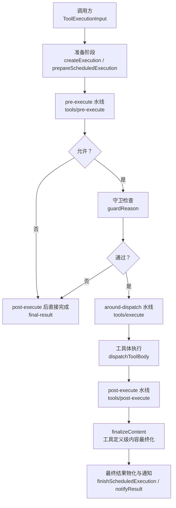
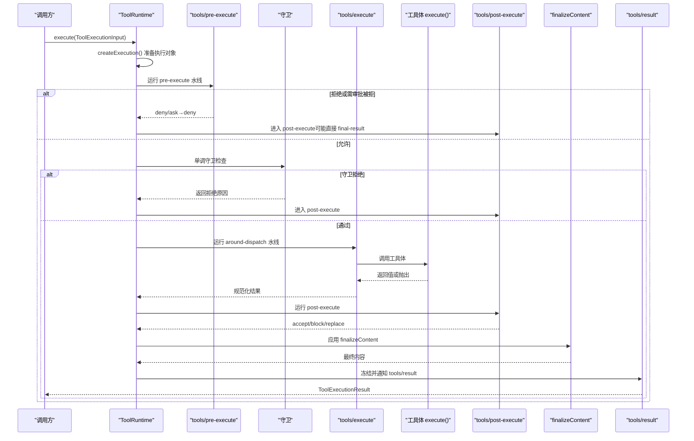

# 工具执行管道

<cite>
**本文引用的文件**
- [packages/core/tools/src/index.ts](file://packages/core/tools/src/index.ts)
- [packages/core/tools/tests/execution-mode.spec.ts](file://packages/core/tools/tests/execution-mode.spec.ts)
- [packages/core/tools/tests/tools.spec.ts](file://packages/core/tools/tests/tools.spec.ts)
- [docs/tool-execution-pipeline.zh.md](file://docs/tool-execution-pipeline.zh.md)
- [docs/subsystems/tools.zh.md](file://docs/subsystems/tools.zh.md)
- [.agents/notes/implemented/feature/2026-07-26-ptc-live-parallel-dispatch.zh.md](file://.agents/notes/implemented/feature/2026-07-26-ptc-live-parallel-dispatch.zh.md)
</cite>

## 目录
1. [简介](#简介)
2. [项目结构](#项目结构)
3. [核心组件](#核心组件)
4. [架构总览](#架构总览)
5. [详细组件分析](#详细组件分析)
6. [依赖关系分析](#依赖关系分析)
7. [性能与并发](#性能与并发)
8. [故障排查指南](#故障排查指南)
9. [结论](#结论)
10. [附录：示例与最佳实践](#附录示例与最佳实践)

## 简介
本文件系统性阐述 DeepSeek Harness 的工具执行管道，覆盖从 ToolExecutionInput 到 ToolExecutionResult 的完整生命周期。重点解释以下阶段与机制：
- pre-execute 钩子（tools/pre-execute）
- 守卫检查（monotonic guards）
- around-dispatch 包装器（tools/execute）
- post-execute 处理（tools/post-execute）
- finalizeContent 回调（工具定义级内容最终化）
- 执行模式选择（parallel/exclusive）与并发控制策略
- 错误处理（工具未找到、参数验证失败、执行超时/中止等）
并提供自定义执行包装器与结果处理的参考路径。

## 项目结构
围绕工具执行管道的关键代码集中在工具注册表与运行时中，并通过事件水线串联各阶段；测试用例覆盖了生命周期顺序、错误归一化与执行模式分类。

图表来源
- [packages/core/tools/src/index.ts:1341-1653](file://packages/core/tools/src/index.ts#L1341-L1653)
- [packages/core/tools/src/index.ts:1655-1861](file://packages/core/tools/src/index.ts#L1655-L1861)

章节来源
- [packages/core/tools/src/index.ts:1341-1653](file://packages/core/tools/src/index.ts#L1341-L1653)
- [packages/core/tools/src/index.ts:1655-1861](file://packages/core/tools/src/index.ts#L1655-L1861)
- [docs/tool-execution-pipeline.zh.md:10-60](file://docs/tool-execution-pipeline.zh.md#L10-L60)

## 核心组件
- ToolRuntime：工具注册表与执行管道中枢，负责输入准备、策略水线、调度、结果物化与通知。
- 事件水线：
  - tools/pre-execute：权限、沙箱、审批前置策略。
  - tools/execute：超时、重试、指标等 around-dispatch 包装点。
  - tools/post-execute：接受、替换、阻断、附加上下文。
  - tools/result：最终不可变结果的只读观察点。
- 工具定义 ToolDefinition：包含 schema、output.render/presentationMeta、execute、可选 finalizeContent、timeoutMs、isConcurrencySafe、presentCall/presentResult。
- 执行模式 ToolExecutionMode：{kind:'parallel'|'exclusive'}，由 isConcurrencySafe 判定。
- 错误类型与常量：ToolNotFoundError、ToolOutputError、TOOL_ABORTED、TOOL_ABORTED_BEFORE_DISPATCH。

章节来源
- [packages/core/tools/src/index.ts:221-288](file://packages/core/tools/src/index.ts#L221-L288)
- [packages/core/tools/src/index.ts:315-385](file://packages/core/tools/src/index.ts#L315-L385)
- [packages/core/tools/src/index.ts:469-581](file://packages/core/tools/src/index.ts#L469-L581)
- [packages/core/tools/src/index.ts:1341-1653](file://packages/core/tools/src/index.ts#L1341-L1653)

## 架构总览
下图展示一次工具调用的端到端流程，包括策略、守卫、分发、后置处理、内容最终化与结果通知。

图表来源
- [packages/core/tools/src/index.ts:1341-1653](file://packages/core/tools/src/index.ts#L1341-L1653)
- [packages/core/tools/src/index.ts:1655-1861](file://packages/core/tools/src/index.ts#L1655-L1861)

章节来源
- [packages/core/tools/src/index.ts:1341-1653](file://packages/core/tools/src/index.ts#L1341-L1653)
- [packages/core/tools/src/index.ts:1655-1861](file://packages/core/tools/src/index.ts#L1655-L1861)
- [docs/tool-execution-pipeline.zh.md:10-60](file://docs/tool-execution-pipeline.zh.md#L10-L60)

## 详细组件分析

### 执行入口与阶段编排
- 入口：ToolRuntime.execute 将输入交给 prepareExecution，再根据准备结果决定后续阶段。
- 准备阶段：createExecution 生成执行上下文、捕获 finalizeContent、冻结参数、记录取消状态；若处于 PTC 折叠且非嵌套调用则直接拒绝为 UNKNOWN_TOOL。
- 策略阶段：tools/pre-execute 水线可 allow/deny/ask；ask 通过审批服务（若存在）决策。
- 守卫阶段：单调守卫（guard）在 pre-execute 之后运行，任何守卫均可拒绝但无法“复活”已拒绝的调用。
- 分发阶段：tools/execute 水线用于超时、重试、指标等；内部调用 dispatchToolBody 执行工具体。
- 后置阶段：tools/post-execute 可接受、替换 content/value、阻断或附加 additionalContexts。
- 最终化阶段：applyFinalContent 调用工具定义的 finalizeContent；随后 finishScheduledExecution 进行结果物化与通知。

章节来源
- [packages/core/tools/src/index.ts:1341-1653](file://packages/core/tools/src/index.ts#L1341-L1653)
- [packages/core/tools/src/index.ts:1655-1861](file://packages/core/tools/src/index.ts#L1655-L1861)

### around-dispatch 包装器（tools/execute）
- 作用：在工具体前后插入通用逻辑（如超时、重试、度量），并可替换 exec.signal，但必须恢复信号并在自身范围内达到静默。
- 规范：waterfall 模式下，next() 返回的结果会被 normalizeDispatchResult 再次通过输出契约校验与渲染。
- 取消融合：dispatchToolBody 会将原始 caller signal 与 wrapper signal 融合，确保取消不丢失且不中断已启动的工作。

章节来源
- [packages/core/tools/src/index.ts:1531-1598](file://packages/core/tools/src/index.ts#L1531-L1598)
- [packages/core/tools/src/index.ts:1824-1843](file://packages/core/tools/src/index.ts#L1824-L1843)

### post-execute 与 finalizeContent
- post-execute：可接受成功结果（替换 content/value）、阻断（转为 isError 并携带 feedback）、附加 additionalContexts。
- finalizeContent：工具定义级同步内容最终化，仅在最终物化前调用一次，即使 pipeline 失败也会执行，用于对模型可见内容进行最后修正。

章节来源
- [packages/core/tools/src/index.ts:1600-1653](file://packages/core/tools/src/index.ts#L1600-L1653)
- [packages/core/tools/src/index.ts:1730-1780](file://packages/core/tools/src/index.ts#L1730-L1780)

### 执行模式（parallel/exclusive）与并发控制
- 模式判定：ToolRuntime.executionMode 基于工具定义的 isConcurrencySafe(args) 精确判断 true 才为 parallel，否则 exclusive。
- 默认安全原则：未声明、异常、非布尔真值均视为 exclusive。
- 并发上限：Config.maxParallelSubCalls 控制 run_code 程序内并行子调用数（默认 10）。
- 屏障语义：exclusive 调用形成排序屏障，独占执行；parallel 可在池内重叠执行。
- 调度行为：按提交顺序启动，有序阶段（prepare/finalize/finish）串行，around-dispatch/工具体可并发。

章节来源
- [packages/core/tools/src/index.ts:1268-1284](file://packages/core/tools/src/index.ts#L1268-L1284)
- [packages/core/tools/tests/execution-mode.spec.ts:27-141](file://packages/core/tools/tests/execution-mode.spec.ts#L27-L141)
- [docs/subsystems/tools.zh.md:243-253](file://docs/subsystems/tools.zh.md#L243-L253)
- [.agents/notes/implemented/feature/2026-07-26-ptc-live-parallel-dispatch.zh.md:13-20](file://.agents/notes/implemented/feature/2026-07-26-ptc-live-parallel-dispatch.zh.md#L13-L20)

### 错误处理机制
- 工具未找到：resolveExecution 找不到或 PTC 折叠导致不可见时，抛出 ToolNotFoundError（UNKNOWN_TOOL）。
- 参数/输出验证失败：参数快照失败或 output.schema 校验失败会转换为结构化错误（INVALID_ARGS/INVALID_TOOL_OUTPUT）。
- 执行超时/中止：
  - 工具体未启动即取消：返回 TOOL_ABORTED_BEFORE_DISPATCH。
  - 工具体已启动后取消：返回 TOOL_ABORTED，保留 prior 上下文。
- 任意抛出的统一归一化：toolErrorResult 将 Error/非 Error 统一为 {content, isError, error}，并尽量保留 name/code。

章节来源
- [packages/core/tools/src/index.ts:1220-1225](file://packages/core/tools/src/index.ts#L1220-L1225)
- [packages/core/tools/src/index.ts:1531-1559](file://packages/core/tools/src/index.ts#L1531-L1559)
- [packages/core/tools/src/index.ts:1869-1943](file://packages/core/tools/src/index.ts#L1869-L1943)
- [packages/core/tools/tests/tools.spec.ts:2402-2449](file://packages/core/tools/tests/tools.spec.ts#L2402-L2449)

### 数据流与结果物化
- 成功路径：工具体返回值经 snapshotToolValue → validateJsonSchemaValue → output.render → optional presentationMeta → materializeFinalResult 冻结。
- 失败路径：异常被捕获为 ToolExecutionFailure，content 为可读文本块，error 携带 message/info。
- 通知：notifyResult 冻结执行对象并触发 tools/result 观察者，观察者异常被隔离记录。

章节来源
- [packages/core/tools/src/index.ts:1791-1861](file://packages/core/tools/src/index.ts#L1791-L1861)
- [packages/core/tools/src/index.ts:1655-1675](file://packages/core/tools/src/index.ts#L1655-L1675)

## 依赖关系分析
- ToolRuntime 依赖：
  - 系统提示词（systemPrompt）以注入 PTC 折叠与 SDK 段。
  - codeRuntime（PTC 模式需要语言渲染器）。
  - 事件水线（ctx.waterfall）实现 pre/around/post 扩展点。
  - 范围层（ScopedLayers）实现工具注册、限制与守卫的作用域叠加。
- 外部交互：
  - 审批服务（approval）可选，缺失时 ask 降级为 deny。
  - 日志与诊断（logger）用于观察者异常与调试。

章节来源
- [packages/core/tools/src/index.ts:788-838](file://packages/core/tools/src/index.ts#L788-L838)
- [packages/core/tools/src/index.ts:1018-1028](file://packages/core/tools/src/index.ts#L1018-L1028)
- [packages/core/tools/src/index.ts:1688-1728](file://packages/core/tools/src/index.ts#L1688-L1728)

## 性能与并发
- 并发上限：maxParallelSubCalls 控制 run_code 子调用并发度（默认 10），设为 1 恢复严格串行。
- 安全优先：isConcurrencySafe 仅当显式返回 true 才允许并行；异常或非布尔真值一律 exclusive。
- 有序提交：结果按模型顺序提交，避免回放与历史错序；实时界面仍可显示进行中进度。
- 取消与排空：取消后不再启动新分发；已启动工作继续至静默，保证资源释放与一致性。

章节来源
- [packages/core/tools/src/index.ts:668-675](file://packages/core/tools/src/index.ts#L668-L675)
- [packages/core/tools/src/index.ts:1268-1284](file://packages/core/tools/src/index.ts#L1268-L1284)
- [.agents/notes/implemented/feature/2026-07-26-ptc-live-parallel-dispatch.zh.md:13-20](file://.agents/notes/implemented/feature/2026-07-26-ptc-live-parallel-dispatch.zh.md#L13-L20)

## 故障排查指南
- 工具未找到（UNKNOWN_TOOL）
  - 现象：调用名称不在可见集合或被 PTC 折叠拒绝。
  - 定位：检查 resolveExecution 与 collapses 判定；确认 scope 与 mode。
  - 参考：[packages/core/tools/src/index.ts:1220-1225](file://packages/core/tools/src/index.ts#L1220-L1225)
- 参数/输出校验失败
  - 现象：INVALID_ARGS 或 INVALID_TOOL_OUTPUT。
  - 定位：检查参数 JSON Schema 与 output.schema；关注 snapshotToolValue 与 validateJsonSchemaValue。
  - 参考：[packages/core/tools/src/index.ts:1791-1822](file://packages/core/tools/src/index.ts#L1791-L1822)
- 执行超时/中止
  - 现象：ABORTED 或 ABORTED_BEFORE_DISPATCH。
  - 定位：检查 callerSignal 与 wrapper signal 融合；确认工具体是否已开始。
  - 参考：[packages/core/tools/src/index.ts:1531-1559](file://packages/core/tools/src/index.ts#L1531-L1559), [packages/core/tools/src/index.ts:1917-1943](file://packages/core/tools/src/index.ts#L1917-L1943)
- 非 Error 抛出
  - 现象：message 丢失或格式异常。
  - 处理：toolErrorResult 统一归一化为可读文本块。
  - 参考：[packages/core/tools/tests/tools.spec.ts:2402-2449](file://packages/core/tools/tests/tools.spec.ts#L2402-L2449)

章节来源
- [packages/core/tools/src/index.ts:1220-1225](file://packages/core/tools/src/index.ts#L1220-L1225)
- [packages/core/tools/src/index.ts:1531-1559](file://packages/core/tools/src/index.ts#L1531-L1559)
- [packages/core/tools/src/index.ts:1791-1822](file://packages/core/tools/src/index.ts#L1791-L1822)
- [packages/core/tools/src/index.ts:1917-1943](file://packages/core/tools/src/index.ts#L1917-L1943)
- [packages/core/tools/tests/tools.spec.ts:2402-2449](file://packages/core/tools/tests/tools.spec.ts#L2402-L2449)

## 结论
DeepSeek Harness 的工具执行管道通过清晰的分阶段水线与严格的不变式，实现了可扩展的策略、安全的并发控制与稳健的错误处理。pre-execute/guard/around/post 的组合提供了强大的扩展能力，而 finalizeContent 与 result 通知保证了最终输出的确定性与可观测性。执行模式与安全侧原则确保了在高并发场景下的正确性与可预测性。

## 附录：示例与最佳实践

### 自定义 around-dispatch 包装器（示例路径）
- 目标：为工具调用添加超时、重试或指标收集。
- 步骤：
  - 订阅 tools/execute 水线，在 next() 前后插入逻辑。
  - 如需替换 exec.signal，务必在 finally 中恢复并等待自身范围内的异步工作静默。
  - 注意：wrapper 返回的结果将被 normalizeDispatchResult 再次校验与渲染。
- 参考路径：
  - [packages/core/tools/src/index.ts:1531-1598](file://packages/core/tools/src/index.ts#L1531-L1598)
  - [packages/core/tools/src/index.ts:1824-1843](file://packages/core/tools/src/index.ts#L1824-L1843)

### 处理工具执行结果（示例路径）
- 目标：在 post-execute 中替换 content/value 或阻断结果，并附加 additionalContexts。
- 步骤：
  - 订阅 tools/post-execute，根据业务规则返回 accept/block。
  - 注意：accept 不能同时提供 value 与 content；block 将把反馈转为 isError。
  - additionalContexts 会在结果中合并并按 FIFO 注入。
- 参考路径：
  - [packages/core/tools/src/index.ts:1730-1780](file://packages/core/tools/src/index.ts#L1730-L1780)

### 实现 finalizeContent（示例路径）
- 目标：对模型可见内容进行最后一次同步修正（例如截断过长文本、脱敏）。
- 步骤：
  - 在工具定义中提供 finalizeContent(exec, result)，仅能修改 content。
  - 该回调在每次执行结果物化前调用一次，即使 pipeline 失败也会执行。
- 参考路径：
  - [packages/core/tools/src/index.ts:236-247](file://packages/core/tools/src/index.ts#L236-L247)
  - [packages/core/tools/src/index.ts:1647-1653](file://packages/core/tools/src/index.ts#L1647-L1653)

### 并发与执行模式（示例路径）
- 目标：声明 isConcurrencySafe 以启用并行，或保守地保持 exclusive。
- 步骤：
  - 根据参数判断是否可并行（例如只读操作）。
  - 确保工具体无共享可变状态或具备并发安全。
- 参考路径：
  - [packages/core/tools/src/index.ts:1268-1284](file://packages/core/tools/src/index.ts#L1268-L1284)
  - [packages/core/tools/tests/execution-mode.spec.ts:27-141](file://packages/core/tools/tests/execution-mode.spec.ts#L27-L141)