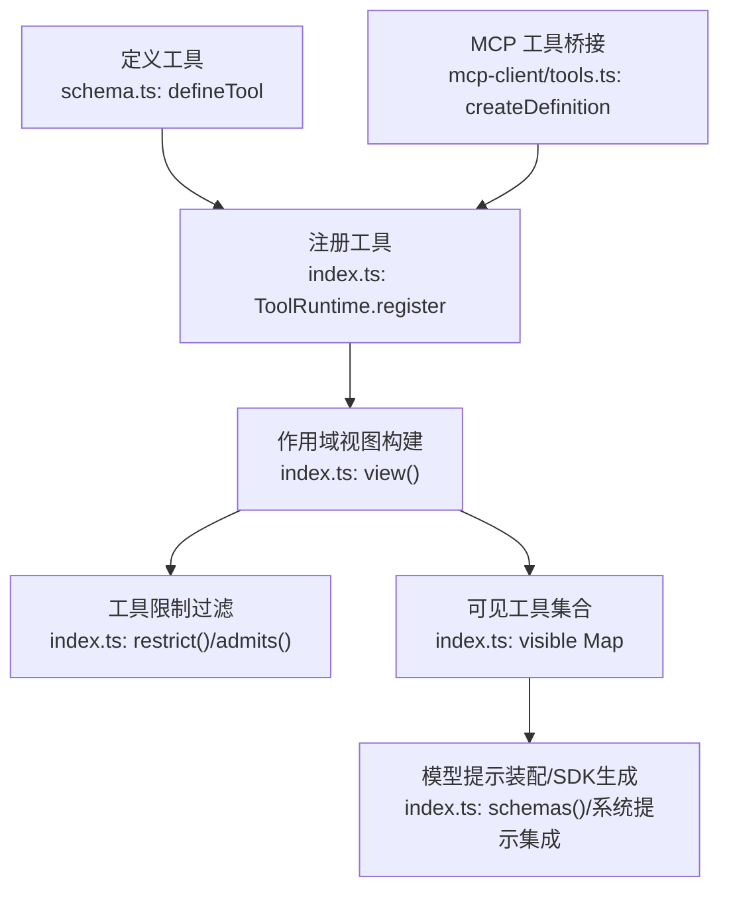
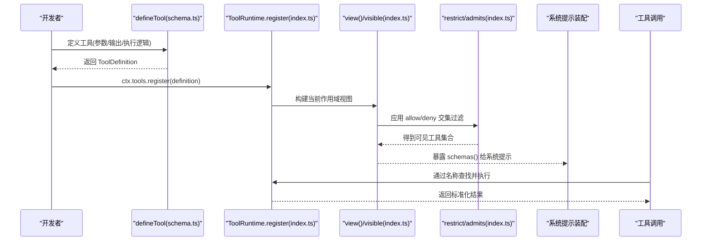
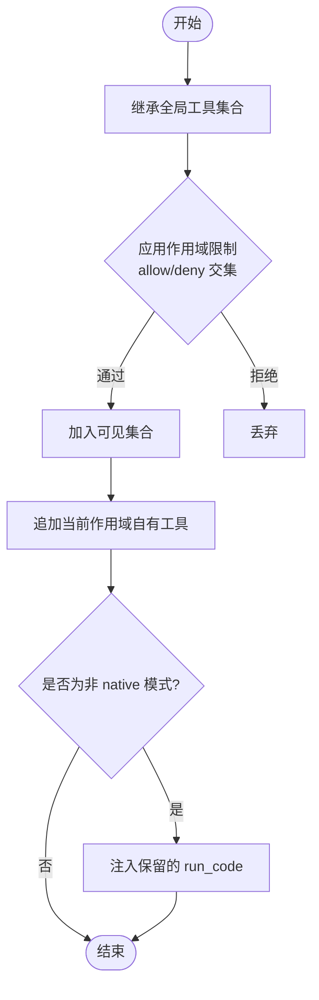
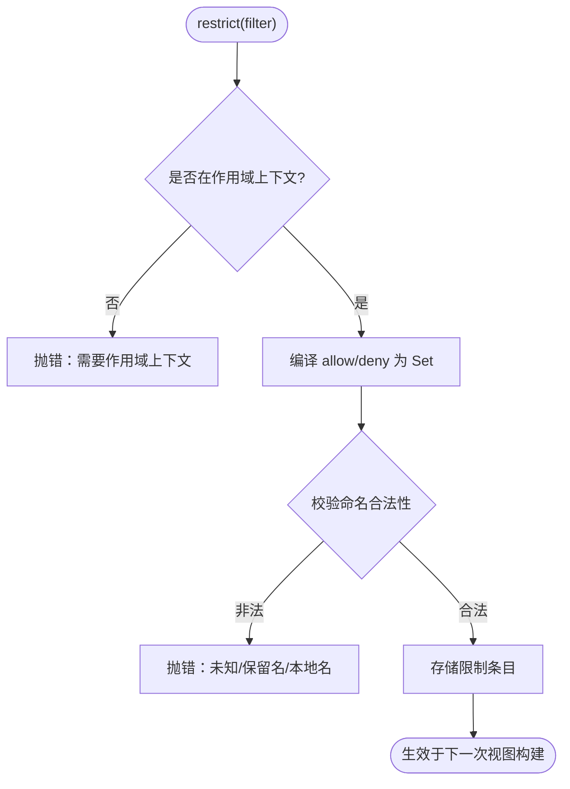
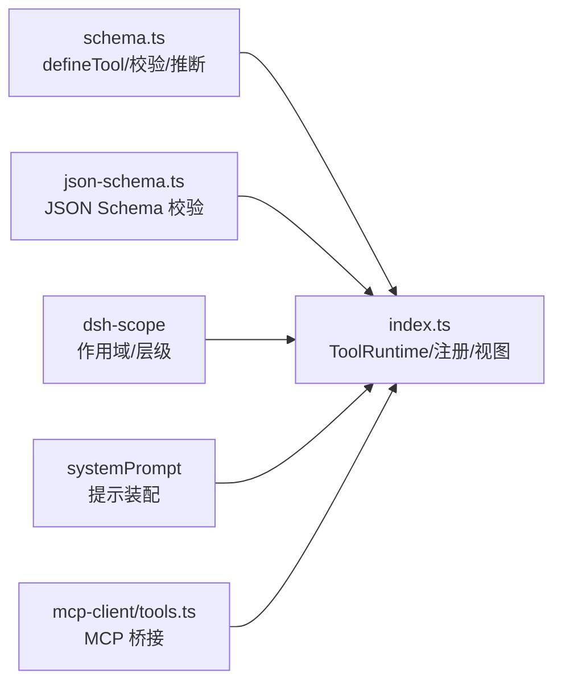

# 工具注册与发现

<cite>
**本文引用的文件**
- [packages/core/tools/src/index.ts](file://packages/core/tools/src/index.ts)
- [packages/core/tools/src/schema.ts](file://packages/core/tools/src/schema.ts)
- [packages/core/tools/tests/tools.spec.ts](file://packages/core/tools/tests/tools.spec.ts)
- [packages/core/tools/tests/scoped.spec.ts](file://packages/core/tools/tests/scoped.spec.ts)
- [packages/core/tools/tests/ptc.spec.ts](file://packages/core/tools/tests/ptc.spec.ts)
- [packages/mcp/mcp-client/src/tools.ts](file://packages/mcp/mcp-client/src/tools.ts)
- [docs/cookbook/adding-a-tool.md](file://docs/cookbook/adding-a-tool.md)
</cite>

## 目录
1. [简介](#简介)
2. [项目结构](#项目结构)
3. [核心组件](#核心组件)
4. [架构总览](#架构总览)
5. [详细组件分析](#详细组件分析)
6. [依赖关系分析](#依赖关系分析)
7. [性能考虑](#性能考虑)
8. [故障排查指南](#故障排查指南)
9. [结论](#结论)
10. [附录：示例与最佳实践](#附录示例与最佳实践)

## 简介
本文件聚焦 DeepSeek Harness 的“工具注册与发现”机制，系统性解释 ToolDefinition 接口字段、defineTool 的注册流程与参数验证/类型推断、工具发现算法（全局工具与作用域工具的优先级）、以及工具限制 ToolRestriction 的实现原理。文末提供可操作的代码示例路径与最佳实践建议，帮助读者快速上手并安全扩展工具能力。

## 项目结构
与工具注册与发现直接相关的核心位于 packages/core/tools 包，包含运行时注册表、执行管线、Schema DSL 与类型推断；MCP 客户端桥接层将外部 MCP 工具映射为 ToolDefinition；文档 cookbook 提供了作者级参考。

图表来源
- [packages/core/tools/src/schema.ts:545-617](file://packages/core/tools/src/schema.ts#L545-L617)
- [packages/core/tools/src/index.ts:1036-1060](file://packages/core/tools/src/index.ts#L1036-L1060)
- [packages/core/tools/src/index.ts:1152-1191](file://packages/core/tools/src/index.ts#L1152-L1191)
- [packages/mcp/mcp-client/src/tools.ts:244-263](file://packages/mcp/mcp-client/src/tools.ts#L244-L263)

章节来源
- [packages/core/tools/src/index.ts:1-120](file://packages/core/tools/src/index.ts#L1-L120)
- [packages/core/tools/src/schema.ts:1-120](file://packages/core/tools/src/schema.ts#L1-L120)
- [packages/mcp/mcp-client/src/tools.ts:231-263](file://packages/mcp/mcp-client/src/tools.ts#L231-L263)

## 核心组件
- ToolDefinition：已注册工具的契约，包含 name、description、parameters、output、execute 等核心属性，以及可选的 finalizeContent、timeoutMs、isConcurrencySafe、presentCall/presentResult。
- ToolOutputDefinition：输出契约，声明 output.schema、render、presentationMeta。
- ToolRuntime：工具注册表与执行管线，负责注册、作用域视图、限制过滤、调度与结果规范化。
- ToolRestriction：按作用域对全局工具进行 allow/deny 过滤，支持组合与独立提升。
- defineTool：带类型推断与严格校验的工具定义工厂，产出可直接注册的 ToolDefinition。

章节来源
- [packages/core/tools/src/index.ts:211-288](file://packages/core/tools/src/index.ts#L211-L288)
- [packages/core/tools/src/index.ts:681-702](file://packages/core/tools/src/index.ts#L681-L702)
- [packages/core/tools/src/schema.ts:482-536](file://packages/core/tools/src/schema.ts#L482-L536)

## 架构总览
工具从“定义→注册→作用域视图→限制过滤→可见集合→提示装配/调用”的完整链路如下：

图表来源
- [packages/core/tools/src/schema.ts:545-617](file://packages/core/tools/src/schema.ts#L545-L617)
- [packages/core/tools/src/index.ts:1036-1060](file://packages/core/tools/src/index.ts#L1036-L1060)
- [packages/core/tools/src/index.ts:1152-1191](file://packages/core/tools/src/index.ts#L1152-L1191)
- [packages/core/tools/src/index.ts:1070-1087](file://packages/core/tools/src/index.ts#L1070-L1087)

## 详细组件分析

### ToolDefinition 接口详解
- name：工具唯一标识，用于注册与发现。
- description：面向模型的描述，进入提示装配。
- parameters：参数 Schema，编译为 JSON Schema 并在执行前校验。
- output：输出契约
  - schema：成功值必须满足的 JSON Schema。
  - render：将规范值渲染为模型可读内容块。
  - presentationMeta：可选，持久化到 result.meta 的重放元数据。
- execute：执行函数，接收已校验的参数与执行上下文，返回规范值。
- 可选
  - finalizeContent：最终内容微调，覆盖默认渲染。
  - timeoutMs：协作式超时预算（毫秒）。
  - isConcurrencySafe：标记是否可与兄弟调用并行。
  - presentCall/presentResult：UI 呈现意图（pending/completed）。

章节来源
- [packages/core/tools/src/index.ts:211-288](file://packages/core/tools/src/index.ts#L211-L288)
- [packages/core/tools/src/schema.ts:482-536](file://packages/core/tools/src/schema.ts#L482-L536)

### defineTool：注册入口、参数验证与类型推断
- 输入：DefineToolOptions，包含 name、description、parameters、output、execute 及可选方法。
- 参数验证：
  - 将 author-facing 的 ParameterSchemaSpec 编译为 JSON Schema。
  - 在 execute 包装器中先校验参数，不合法则抛出 ToolArgsError。
  - 校验 output.schema 为受支持的 JSON Schema。
  - 校验 timeoutMs 为正有限数。
- 类型推断：
  - InferArgs<S> 从参数 Schema 推导 TypeScript 参数类型。
  - InferValue<O> 从输出 Schema 推导返回值类型。
  - presentCall/presentResult/isConcurrencySafe 也基于同一 Schema 做软校验，回放时失败回退为通用展示。
- 产物：返回可直接被 ctx.tools.register 使用的 ToolDefinition。

章节来源
- [packages/core/tools/src/schema.ts:432-458](file://packages/core/tools/src/schema.ts#L432-L458)
- [packages/core/tools/src/schema.ts:472-480](file://packages/core/tools/src/schema.ts#L472-L480)
- [packages/core/tools/src/schema.ts:545-617](file://packages/core/tools/src/schema.ts#L545-L617)

### 工具注册流程
- 注册 API：ctx.tools.register(definition)。
- 注册期校验：
  - 强制要求 output 存在且 render 为函数，presentationMeta 若存在须为函数。
  - 校验 output.schema 为受支持的 JSON Schema。
  - 校验 timeoutMs 为正有限数。
  - 保留名 RUN_CODE_NAME 不可注册或遮蔽。
- 作用域与生命周期：
  - 注册以 effect 形式挂载，fiber dispose 时自动注销。
  - 重复名称在同一层会抛错；可通过作用域隔离同名工具。
- 返回处置器：register 返回一个精确的注销函数，便于热替换或测试清理。

章节来源
- [packages/core/tools/src/index.ts:1036-1060](file://packages/core/tools/src/index.ts#L1036-L1060)
- [packages/core/tools/tests/tools.spec.ts:1978-2001](file://packages/core/tools/tests/tools.spec.ts#L1978-L2001)

### 工具发现算法与优先级
- 作用域链：从最远祖先到最近作用域依次合并工具，近作用域同名覆盖远作用域。
- 全局工具：所有全局注册的工具构成基础集合。
- 作用域工具：当前作用域新增的工具最后插入，可遮蔽同名的全局工具。
- 保留项：PTC 模式下的 run_code 传输工具不参与全局过滤，始终注入到非 native 模式的可见集合。
- 可见性计算：
  - knownNames：预过滤的能力名集合，用于提示顺序校验。
  - restrictableNames：当前全局可被 restrict 命名的集合。
  - visible：经过限制过滤后的最终可见工具集合。

图表来源
- [packages/core/tools/src/index.ts:1152-1191](file://packages/core/tools/src/index.ts#L1152-L1191)

章节来源
- [packages/core/tools/src/index.ts:1152-1191](file://packages/core/tools/src/index.ts#L1152-L1191)

### 工具限制 ToolRestriction：实现原理与规则
- 作用域限定：restrict 必须在 agent 作用域上下文中调用，否则抛错。
- 过滤器：
  - allow：仅保留指定全局工具。
  - deny：移除指定全局工具。
  - 两者可同时使用，按 allow 先于 deny 的顺序处理。
- 组合语义：多个限制取交集，任一限制拒绝即不可见。
- 命名校验：
  - 不允许命名保留名 run_code。
  - 不允许命名仅存在于当前作用域的本地工具。
  - 空过滤器视为错误（防止配置为空导致静默无效）。
- 动态性：全局注册表保持活跃，后续注册/卸载工具会实时影响受限视图。

图表来源
- [packages/core/tools/src/index.ts:1070-1087](file://packages/core/tools/src/index.ts#L1070-L1087)
- [packages/core/tools/tests/scoped.spec.ts:161-202](file://packages/core/tools/tests/scoped.spec.ts#L161-L202)

章节来源
- [packages/core/tools/src/index.ts:681-702](file://packages/core/tools/src/index.ts#L681-L702)
- [packages/core/tools/src/index.ts:1070-1087](file://packages/core/tools/src/index.ts#L1070-L1087)
- [packages/core/tools/tests/scoped.spec.ts:161-202](file://packages/core/tools/tests/scoped.spec.ts#L161-L202)

### MCP 工具桥接：createDefinition
- 将 MCP 工具转换为 ToolDefinition：
  - name：注册用公开名。
  - description：面向模型的描述。
  - parameters：MCP 输入 Schema。
  - output：根据 MCP 结构化输出能力构造。
  - execute：封装 MCP 客户端调用，携带超时与命名空间选项。
- 该桥接使外部 MCP 工具无缝纳入 Harness 工具生态。

章节来源
- [packages/mcp/mcp-client/src/tools.ts:231-263](file://packages/mcp/mcp-client/src/tools.ts#L231-L263)

## 依赖关系分析
- 类型与校验：
  - schema.ts 提供 ValueSchemaSpec/ParameterSchemaSpec 编译与 validateArgs。
  - index.ts 依赖 json-schema.ts 的 assertSupportedJsonSchema/validateJsonSchemaValue。
- 作用域与层级：
  - 使用 dsh-scope 的作用域链与层叠加，实现工具遮蔽与限制组合。
- 执行管线：
  - 注册后由 ToolRuntime 统一调度，支持 pre-execute/execute/post-execute/result 等事件钩子。
- 提示装配：
  - schemas() 暴露给系统提示组装，决定模型可见的工具列表。

图表来源
- [packages/core/tools/src/index.ts:1-30](file://packages/core/tools/src/index.ts#L1-L30)
- [packages/core/tools/src/schema.ts:1-20](file://packages/core/tools/src/schema.ts#L1-L20)
- [packages/mcp/mcp-client/src/tools.ts:231-263](file://packages/mcp/mcp-client/src/tools.ts#L231-L263)

章节来源
- [packages/core/tools/src/index.ts:1-30](file://packages/core/tools/src/index.ts#L1-L30)
- [packages/core/tools/src/schema.ts:1-20](file://packages/core/tools/src/schema.ts#L1-L20)

## 性能考虑
- 参数校验在 execute 包装器内完成，避免无效调用进入业务逻辑。
- 限制过滤在视图构建阶段一次性计算，复用 Set 结构提高匹配效率。
- 协作式超时 timeoutMs 配合 around-dispatch 信号融合，避免长任务阻塞。
- 并行安全标记 isConcurrencySafe 允许重叠调度，减少端到端延迟。

[本节为通用指导，无需具体文件引用]

## 故障排查指南
- 注册失败
  - 重复名称：同一层重复注册会抛错；可通过作用域隔离或使用返回的 dispose 函数热替换。
  - 缺少 output.render：注册时会抛 TypeError。
  - 非法 timeoutMs：必须为正有限数。
  - 保留名冲突：RUN_CODE_NAME 不可注册或遮蔽。
- 限制配置错误
  - 未处于作用域上下文：restrict 抛错。
  - 空过滤器：视为错误，需显式传入 allow/deny。
  - 命名不在 restrictableNames：包括本地工具或保留名，会抛错并列出已知全局工具。
- 执行期问题
  - 参数不合法：抛出 ToolArgsError，检查 parameters 定义与传入值。
  - 输出不合法：抛出 ToolOutputError，检查 output.schema 与 execute 返回值。
  - 取消与超时：确保 execute 监听 exec.signal 并及时退出。

章节来源
- [packages/core/tools/src/index.ts:1036-1060](file://packages/core/tools/src/index.ts#L1036-L1060)
- [packages/core/tools/src/index.ts:1070-1087](file://packages/core/tools/src/index.ts#L1070-L1087)
- [packages/core/tools/tests/tools.spec.ts:1978-2001](file://packages/core/tools/tests/tools.spec.ts#L1978-L2001)
- [packages/core/tools/tests/scoped.spec.ts:184-202](file://packages/core/tools/tests/scoped.spec.ts#L184-L202)

## 结论
DeepSeek Harness 的工具注册与发现机制以 ToolDefinition 为核心契约，通过 defineTool 提供强类型与严格校验，结合 ToolRuntime 的作用域视图与 ToolRestriction 的灵活过滤，实现了安全、可扩展、可观测的工具生态。MCP 桥接进一步打通外部工具能力。遵循本文档的注册流程、限制规则与最佳实践，可高效构建高质量工具。

[本节为总结，无需具体文件引用]

## 附录：示例与最佳实践

- 最小工具示例（作者参考）
  - 参见 cookbook 中的最小形状与执行契约说明，涵盖参数定义、输出渲染、执行逻辑与 UI 呈现要点。
  - 示例路径：[docs/cookbook/adding-a-tool.md](file://docs/cookbook/adding-a-tool.md)

- 单元测试中的注册与执行往返
  - 演示 defineTool 注册、schemas 导出、execute 调用与结果断言。
  - 示例路径：[packages/core/tools/tests/tools.spec.ts:2165-2204](file://packages/core/tools/tests/tools.spec.ts#L2165-L2204)

- 作用域工具与限制组合
  - 演示作用域工具可见性、多限制交集、独立提升与错误场景。
  - 示例路径：[packages/core/tools/tests/scoped.spec.ts:161-202](file://packages/core/tools/tests/scoped.spec.ts#L161-L202)

- PTC 模式下保留传输工具不受限制
  - 演示 run_code 在非 native 模式下始终可见，且不受 deny 列表影响。
  - 示例路径：[packages/core/tools/tests/ptc.spec.ts:249-277](file://packages/core/tools/tests/ptc.spec.ts#L249-L277)

- MCP 工具桥接
  - 将 MCP 工具转为 ToolDefinition，统一纳入 Harness 工具体系。
  - 示例路径：[packages/mcp/mcp-client/src/tools.ts:231-263](file://packages/mcp/mcp-client/src/tools.ts#L231-L263)

最佳实践清单
- 明确定义 output.schema 与 render，保证程序化 API 可用且模型可读。
- 使用 defineTool 获得强类型参数与返回值推断，减少运行时错误。
- 合理使用 ToolRestriction 控制全局工具可见性，避免误暴露敏感能力。
- 在 execute 中监听 exec.signal，实现协作式取消与超时。
- 通过 presentCall/presentResult 提供一致的 UI 体验，并保持纯函数特性以便回放。
- 利用 register 返回的 dispose 函数管理工具生命周期，支持热替换与测试清理。

章节来源
- [docs/cookbook/adding-a-tool.md:7-66](file://docs/cookbook/adding-a-tool.md#L7-L66)
- [packages/core/tools/tests/tools.spec.ts:2165-2204](file://packages/core/tools/tests/tools.spec.ts#L2165-L2204)
- [packages/core/tools/tests/scoped.spec.ts:161-202](file://packages/core/tools/tests/scoped.spec.ts#L161-L202)
- [packages/core/tools/tests/ptc.spec.ts:249-277](file://packages/core/tools/tests/ptc.spec.ts#L249-L277)
- [packages/mcp/mcp-client/src/tools.ts:231-263](file://packages/mcp/mcp-client/src/tools.ts#L231-L263)