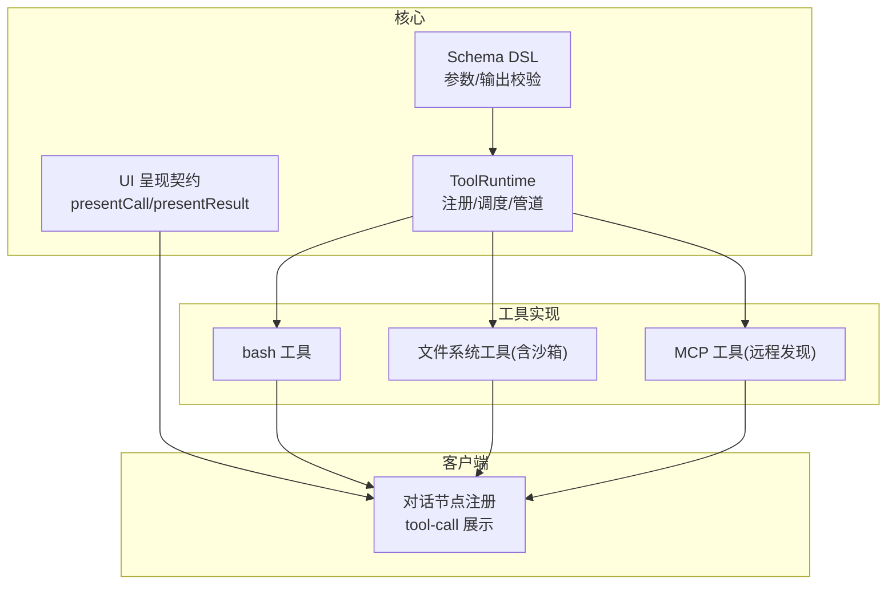
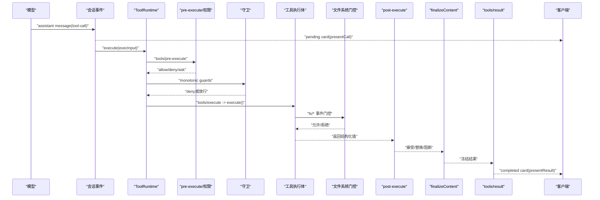
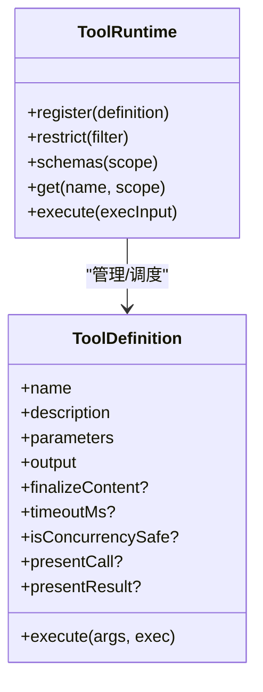
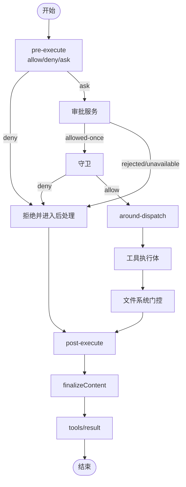
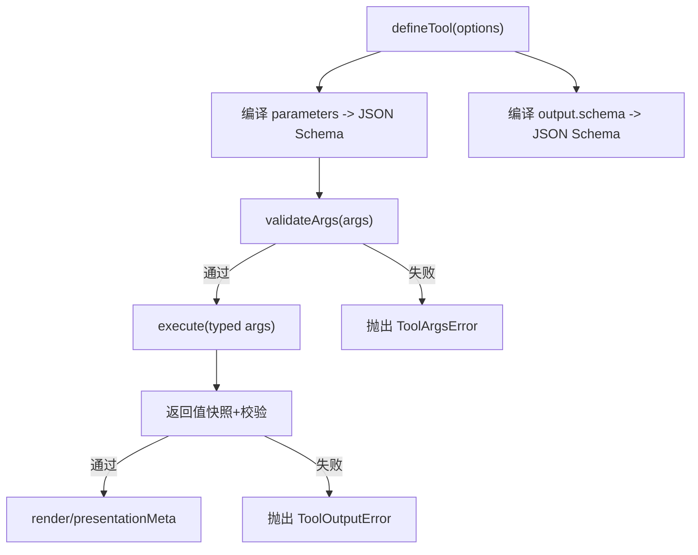
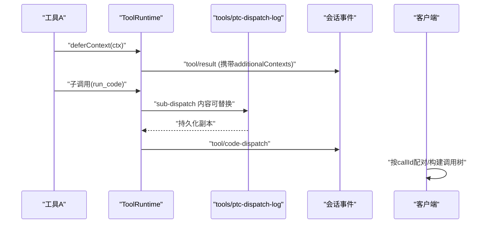
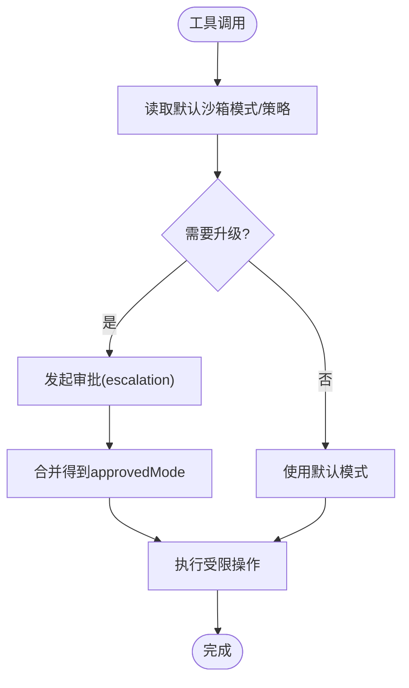
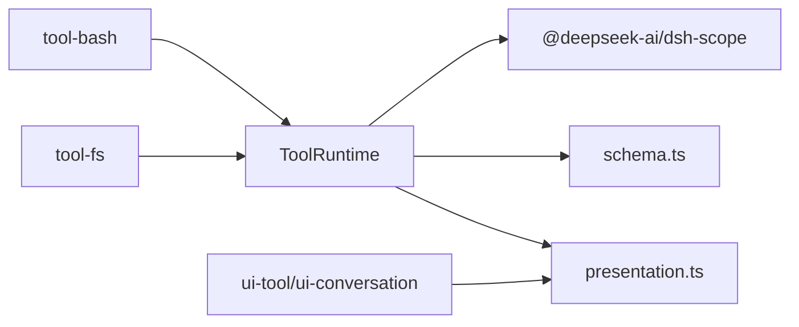

# 工具系统

<cite>
**本文引用的文件**
- [packages/core/tools/src/index.ts](file://packages/core/tools/src/index.ts)
- [packages/core/tools/src/schema.ts](file://packages/core/tools/src/schema.ts)
- [packages/core/tools/src/presentation.ts](file://packages/core/tools/src/presentation.ts)
- [docs/subsystems/tools.md](file://docs/subsystems/tools.md)
- [docs/tool-execution-pipeline.md](file://docs/tool-execution-pipeline.md)
- [packages/shell/tool-bash/src/index.ts](file://packages/shell/tool-bash/src/index.ts)
- [packages/fs/tool-fs/src/sandbox.ts](file://packages/fs/tool-fs/src/sandbox.ts)
- [packages/client/ui-chat/src/client/conversation-nodes/tool.ts](file://packages/client/ui-chat/src/client/conversation-nodes/tool.ts)
- [packages/mcp/mcp-client/src/index.ts](file://packages/mcp/mcp-client/src/index.ts)
</cite>

## 目录
1. [简介](#简介)
2. [项目结构](#项目结构)
3. [核心组件](#核心组件)
4. [架构总览](#架构总览)
5. [详细组件分析](#详细组件分析)
6. [依赖关系分析](#依赖关系分析)
7. [性能考量](#性能考量)
8. [故障排查指南](#故障排查指南)
9. [结论](#结论)
10. [附录：自定义工具开发示例与集成步骤](#附录自定义工具开发示例与集成步骤)

## 简介
本文件系统性阐述 DeepSeek Harness 的工具系统，覆盖工具注册与发现、执行管道（权限检查、沙箱执行、结果处理）、参数验证与类型系统（JSON Schema 定义与运行时校验）、工具间通信与数据共享机制，并提供自定义工具开发与现有工具集成的实践指引。目标是帮助开发者在不深入源码细节的情况下，理解并安全扩展工具能力。

## 项目结构
工具系统的核心位于 packages/core/tools，提供工具注册表、执行管道、参数/输出 Schema DSL、以及 UI 呈现契约；具体工具实现分布在 shell、fs、mcp 等包中；客户端负责将工具调用与结果映射到对话卡片与详情视图。

图表来源
- [packages/core/tools/src/index.ts:788-825](file://packages/core/tools/src/index.ts#L788-L825)
- [packages/core/tools/src/schema.ts:444-480](file://packages/core/tools/src/schema.ts#L444-L480)
- [packages/core/tools/src/presentation.ts:42-140](file://packages/core/tools/src/presentation.ts#L42-L140)
- [packages/shell/tool-bash/src/index.ts:190-200](file://packages/shell/tool-bash/src/index.ts#L190-L200)
- [packages/fs/tool-fs/src/sandbox.ts:95-108](file://packages/fs/tool-fs/src/sandbox.ts#L95-L108)
- [packages/mcp/mcp-client/src/index.ts:136-150](file://packages/mcp/mcp-client/src/index.ts#L136-L150)
- [packages/client/ui-chat/src/client/conversation-nodes/tool.ts:266-272](file://packages/client/ui-chat/src/client/conversation-nodes/tool.ts#L266-L272)

章节来源
- [docs/subsystems/tools.md:1-12](file://docs/subsystems/tools.md#L1-L12)
- [docs/tool-execution-pipeline.md:1-63](file://docs/tool-execution-pipeline.md#L1-L63)

## 核心组件
- ToolRuntime：工具注册表与执行管道，负责可见性过滤、预执行策略、守卫、环绕执行、后处理、内容最终化与结果通知。
- Schema DSL：统一的 JSON 值 Schema 描述语言，编译为受支持的原始 JSON Schema，用于参数与输出的声明与校验。
- UI 呈现契约：通过 presentCall/presentResult 声明“待执行/已完成”的渲染意图，供客户端统一渲染。
- 工具实现：如 bash、文件系统、MCP 等，遵循统一接口并通过注册表暴露给模型。
- 客户端：将 tool/call 与 tool/result 事件配对，构建递归调用树与卡片展示。

章节来源
- [packages/core/tools/src/index.ts:211-288](file://packages/core/tools/src/index.ts#L211-L288)
- [packages/core/tools/src/schema.ts:96-176](file://packages/core/tools/src/schema.ts#L96-L176)
- [packages/core/tools/src/presentation.ts:42-140](file://packages/core/tools/src/presentation.ts#L42-L140)

## 架构总览
工具从模型请求进入，经会话事件记录、UI 待执行卡片、权限与沙箱策略、守卫、执行体、文件系统门控、后处理、内容最终化、结果通知与完成卡片，形成完整流水线。PTC 模式通过 run_code 作为唯一可直调入口，内部再分发至各工具。

图表来源
- [docs/tool-execution-pipeline.md:8-60](file://docs/tool-execution-pipeline.md#L8-L60)
- [packages/core/tools/src/index.ts:137-208](file://packages/core/tools/src/index.ts#L137-L208)
- [packages/core/tools/src/index.ts:452-467](file://packages/core/tools/src/index.ts#L452-L467)

## 详细组件分析

### 工具注册与发现
- 注册：通过 ToolRuntime.register 注册 ToolDefinition，支持全局与作用域注册；作用域注册可遮蔽全局同名工具。
- 可见性：ToolRestriction 对继承的工具集合进行 allow/deny 过滤；reserved 名称（如 run_code）不受限制。
- 发现：schemas() 仅暴露模型可见字段（name/description/parameters），不泄露执行与呈现回调；get(name, scope) 按作用域解析实际定义。
- MCP 集成：MCP 客户端在 apply 时连接服务器并初始化工具发现，随后激活。

图表来源
- [packages/core/tools/src/index.ts:480-570](file://packages/core/tools/src/index.ts#L480-L570)
- [packages/core/tools/src/index.ts:714-755](file://packages/core/tools/src/index.ts#L714-L755)
- [packages/mcp/mcp-client/src/index.ts:136-150](file://packages/mcp/mcp-client/src/index.ts#L136-L150)

章节来源
- [packages/core/tools/src/index.ts:677-702](file://packages/core/tools/src/index.ts#L677-L702)
- [packages/core/tools/src/index.ts:1176-1205](file://packages/core/tools/src/index.ts#L1176-L1205)
- [packages/mcp/mcp-client/src/index.ts:136-150](file://packages/mcp/mcp-client/src/index.ts#L136-L150)

### 执行管道：权限检查、沙箱执行与结果处理
- pre-execute：允许/拒绝/询问（ask）。询问需审批服务返回 allowed-once 才继续。
- 守卫：单调性守卫，只能拒绝不能放行，防止顺序导致权限被后续监听器恢复。
- around-dispatch：超时、重试、指标等包装；可替换信号但不可移除。
- 工具执行体：必须遵守并发安全约定与取消信号。
- 文件系统门控：工具-fs 通过 fs/* 事件进行读前写检查等。
- post-execute：接受/替换内容或值、附加上下文、阻断。
- finalizeContent：定义级最后的内容不变式修正。
- tools/result：冻结的最终结果观察者。

图表来源
- [docs/tool-execution-pipeline.md:8-60](file://docs/tool-execution-pipeline.md#L8-L60)
- [packages/core/tools/src/index.ts:137-208](file://packages/core/tools/src/index.ts#L137-L208)
- [packages/fs/tool-fs/src/sandbox.ts:95-108](file://packages/fs/tool-fs/src/sandbox.ts#L95-L108)

章节来源
- [docs/tool-execution-pipeline.md:1-63](file://docs/tool-execution-pipeline.md#L1-L63)
- [packages/core/tools/src/index.ts:583-601](file://packages/core/tools/src/index.ts#L583-L601)
- [packages/fs/tool-fs/src/sandbox.ts:95-108](file://packages/fs/tool-fs/src/sandbox.ts#L95-L108)

### 参数验证与类型系统（JSON Schema 与运行时校验）
- 作者侧 DSL：ValueSchemaSpec/ParameterSchemaSpec 支持 string/number/integer/boolean/null/array/object/json/oneOf，对象需显式 additionalProperties。
- 编译：parameterSchemaSpecToJsonSchema/valueSchemaSpecToJsonSchema 将 DSL 编译为受支持的原始 JSON Schema。
- 校验：validateArgs 基于编译后的 schema 对模型传入参数进行严格校验；失败抛出 ToolArgsError(INVALID_ARGS)。
- 输出校验：工具返回值与 presentationMeta/render 产物均会被快照与校验，非法则转为 ToolOutputError(INVALID_TOOL_OUTPUT)。
- 类型推断：InferArgs/InferValue 提供编译期类型推导，便于 defineTool 获得无转换 typed args。

图表来源
- [packages/core/tools/src/schema.ts:444-480](file://packages/core/tools/src/schema.ts#L444-L480)
- [packages/core/tools/src/schema.ts:545-617](file://packages/core/tools/src/schema.ts#L545-L617)

章节来源
- [packages/core/tools/src/schema.ts:1-176](file://packages/core/tools/src/schema.ts#L1-L176)
- [packages/core/tools/src/schema.ts:444-480](file://packages/core/tools/src/schema.ts#L444-L480)
- [packages/core/tools/src/schema.ts:545-617](file://packages/core/tools/src/schema.ts#L545-L617)

### 工具间通信与数据共享
- 上下文延递：ToolRunContext.deferContext 可将嵌套调用的上下文或插件指令附加到当前工具结果之后，由循环追加。
- 子调用日志：PTC 模式下，run_code 的子调用可通过 tools/ptc-dispatch-log 修改持久化日志副本（不影响程序值与模型可见结果）。
- 会话事件：工具可在执行期间产生 todo/write、fs/observed、hook/invoked、tool/code-dispatch 等事件，供其他子系统消费。
- 客户端配对：客户端将 tool/call 与 tool/result 按 callId 配对，并从 Code Dispatch 事件重建 root/subcall 拓扑。

图表来源
- [packages/core/tools/src/index.ts:176-189](file://packages/core/tools/src/index.ts#L176-L189)
- [packages/core/tools/src/index.ts:350-371](file://packages/core/tools/src/index.ts#L350-L371)
- [packages/client/ui-chat/src/client/conversation-nodes/tool.ts:266-272](file://packages/client/ui-chat/src/client/conversation-nodes/tool.ts#L266-L272)

章节来源
- [packages/core/tools/src/index.ts:397-422](file://packages/core/tools/src/index.ts#L397-L422)
- [packages/core/tools/src/index.ts:176-189](file://packages/core/tools/src/index.ts#L176-L189)
- [packages/client/ui-chat/src/client/conversation-nodes/tool.ts:266-272](file://packages/client/ui-chat/src/client/conversation-nodes/tool.ts#L266-L272)

### 沙箱与权限（以 bash 与文件系统为例）
- bash 工具：根据配置启用后台运行、默认沙箱模式与升级目标；当存在 confining executor 时需注入 sandboxPolicy。
- 文件系统工具：在执行前评估 standing policy，必要时发起 escalation 审批，合并得到 approvedMode 后再执行。

图表来源
- [packages/shell/tool-bash/src/index.ts:190-200](file://packages/shell/tool-bash/src/index.ts#L190-L200)
- [packages/fs/tool-fs/src/sandbox.ts:95-108](file://packages/fs/tool-fs/src/sandbox.ts#L95-L108)

章节来源
- [packages/shell/tool-bash/src/index.ts:190-200](file://packages/shell/tool-bash/src/index.ts#L190-L200)
- [packages/fs/tool-fs/src/sandbox.ts:95-108](file://packages/fs/tool-fs/src/sandbox.ts#L95-L108)

## 依赖关系分析
- ToolRuntime 依赖 Scope/Layer 机制实现作用域遮蔽与可见性过滤。
- Schema DSL 依赖底层 JSON Schema 校验器，确保只接受受支持子集。
- 工具实现依赖宿主服务（如 shell、sandboxPolicy、codeRuntime）。
- 客户端依赖会话事件与工具呈现契约进行展示。

图表来源
- [packages/core/tools/src/index.ts:788-825](file://packages/core/tools/src/index.ts#L788-L825)
- [packages/core/tools/src/schema.ts:444-480](file://packages/core/tools/src/schema.ts#L444-L480)
- [packages/core/tools/src/presentation.ts:42-140](file://packages/core/tools/src/presentation.ts#L42-L140)

章节来源
- [packages/core/tools/src/index.ts:788-825](file://packages/core/tools/src/index.ts#L788-L825)

## 性能考量
- 并行与独占：工具可通过 isConcurrencySafe 声明是否可与兄弟调用并行；否则形成排他屏障。
- 最大并发：PTC 模式的 maxParallelSubCalls 控制 run_code 内子调用并发度（默认 10）。
- 取消传播：所有异步阶段需观察 exec.signal；注册表在 around-dispatch 前后融合 caller signal，避免脱离取消语义。
- 结果快照：成功路径对 value/content/meta 进行快照与冻结，减少后续拷贝成本并确保一致性。

[本节为通用指导，无需特定文件引用]

## 故障排查指南
- 未知工具：UNKNOWN_TOOL（ToolNotFoundError），检查工具是否已注册且对当前作用域可见。
- 参数非法：INVALID_ARGS（ToolArgsError），检查 parameters 定义与模型传入参数。
- 输出非法：INVALID_TOOL_OUTPUT（ToolOutputError），检查 output.schema 与 render/presentationMeta 返回值。
- 审批失败：pre-execute ask 未获 allowed-once 或被拒绝，检查审批服务与策略。
- 沙箱拒绝：escalation 未批准或模式不合法，检查 sandboxPolicy 与升级目标。
- 取消相关：ABORTED_BEFORE_DISPATCH / ABORTED，检查上游取消信号与工具体是否正确响应。

章节来源
- [packages/core/tools/src/index.ts:469-523](file://packages/core/tools/src/index.ts#L469-L523)
- [docs/tool-execution-pipeline.md:8-60](file://docs/tool-execution-pipeline.md#L8-L60)

## 结论
DeepSeek Harness 的工具系统通过清晰的注册/发现、严格的 Schema 校验、可扩展的执行管道与统一的 UI 呈现契约，实现了安全、可观测、可组合的工具生态。借助作用域遮蔽、权限与沙箱、以及 PTC 模式，既能满足复杂业务需求，又能保证一致性与安全性。

[本节为总结，无需特定文件引用]

## 附录：自定义工具开发示例与集成步骤
以下示例以“伪代码”形式说明如何开发一个自定义工具并集成到系统中。请参照对应文件的 API 与流程进行实现。

- 定义参数与输出 Schema
  - 使用 ParameterSchemaSpec 描述参数，使用 ValueSchemaSpec 描述输出。
  - 参考路径：[packages/core/tools/src/schema.ts:96-176](file://packages/core/tools/src/schema.ts#L96-L176)、[packages/core/tools/src/schema.ts:444-480](file://packages/core/tools/src/schema.ts#L444-L480)

- 编写工具定义
  - 使用 defineTool 创建 ToolDefinition，包含 name、description、parameters、output、execute，可选 finalizeContent、presentCall、presentResult、isConcurrencySafe、timeoutMs。
  - 参考路径：[packages/core/tools/src/schema.ts:545-617](file://packages/core/tools/src/schema.ts#L545-L617)

- 注册工具
  - 通过 ctx.tools.register 注册；如需作用域遮蔽，请在 agent.ctx 下注册。
  - 参考路径：[packages/core/tools/src/index.ts:480-570](file://packages/core/tools/src/index.ts#L480-L570)

- 权限与沙箱
  - 若涉及敏感操作，结合 pre-execute 与守卫进行审批与限制；必要时接入 sandboxPolicy。
  - 参考路径：[packages/core/tools/src/index.ts:137-208](file://packages/core/tools/src/index.ts#L137-L208)、[packages/shell/tool-bash/src/index.ts:190-200](file://packages/shell/tool-bash/src/index.ts#L190-L200)、[packages/fs/tool-fs/src/sandbox.ts:95-108](file://packages/fs/tool-fs/src/sandbox.ts#L95-L108)

- 结果与 UI 呈现
  - 通过 presentCall/presentResult 提供待执行与完成态的渲染意图；客户端会据此生成卡片。
  - 参考路径：[packages/core/tools/src/presentation.ts:42-140](file://packages/core/tools/src/presentation.ts#L42-L140)、[packages/client/ui-chat/src/client/conversation-nodes/tool.ts:266-272](file://packages/client/ui-chat/src/client/conversation-nodes/tool.ts#L266-L272)

- 集成现有工具
  - 复用 bash、fs、MCP 等工具的注册与执行方式；MCP 工具通过 apply 连接并初始化工具发现。
  - 参考路径：[packages/mcp/mcp-client/src/index.ts:136-150](file://packages/mcp/mcp-client/src/index.ts#L136-L150)

章节来源
- [packages/core/tools/src/schema.ts:96-176](file://packages/core/tools/src/schema.ts#L96-L176)
- [packages/core/tools/src/schema.ts:444-480](file://packages/core/tools/src/schema.ts#L444-L480)
- [packages/core/tools/src/schema.ts:545-617](file://packages/core/tools/src/schema.ts#L545-L617)
- [packages/core/tools/src/index.ts:480-570](file://packages/core/tools/src/index.ts#L480-L570)
- [packages/shell/tool-bash/src/index.ts:190-200](file://packages/shell/tool-bash/src/index.ts#L190-L200)
- [packages/fs/tool-fs/src/sandbox.ts:95-108](file://packages/fs/tool-fs/src/sandbox.ts#L95-L108)
- [packages/core/tools/src/presentation.ts:42-140](file://packages/core/tools/src/presentation.ts#L42-L140)
- [packages/client/ui-chat/src/client/conversation-nodes/tool.ts:266-272](file://packages/client/ui-chat/src/client/conversation-nodes/tool.ts#L266-L272)
- [packages/mcp/mcp-client/src/index.ts:136-150](file://packages/mcp/mcp-client/src/index.ts#L136-L150)