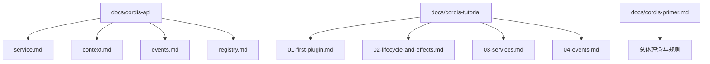
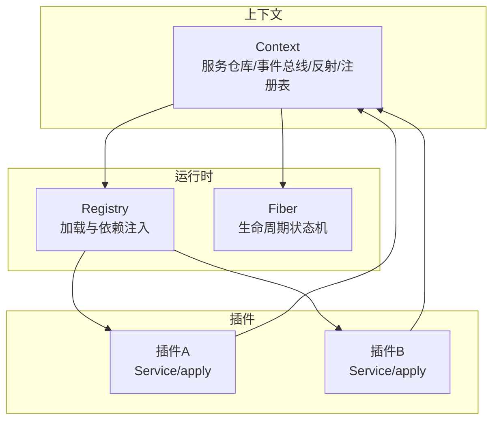
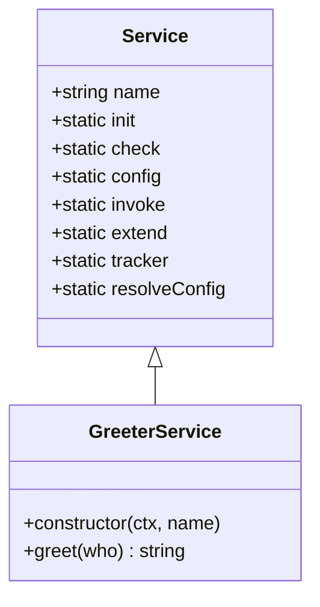
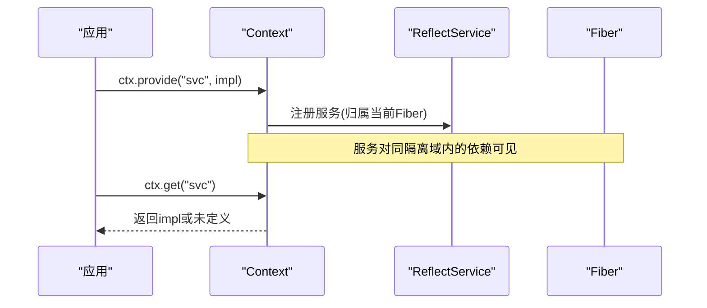
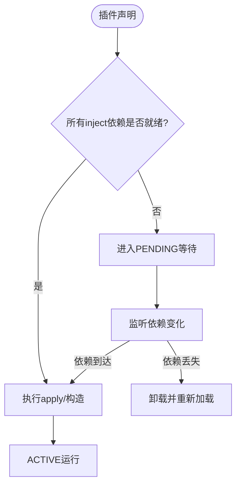
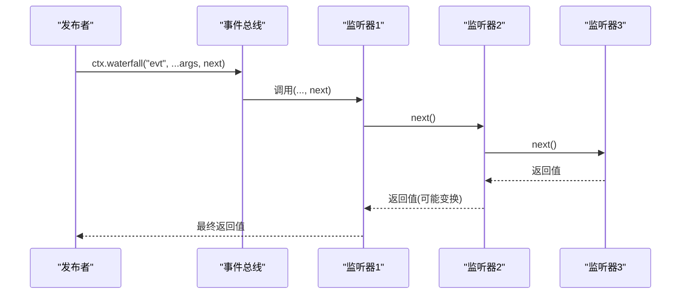
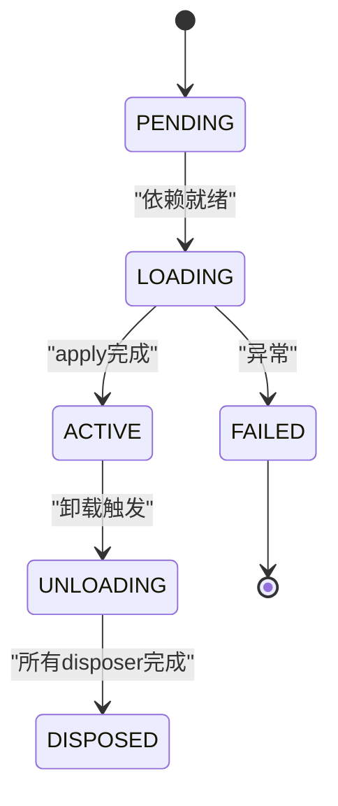
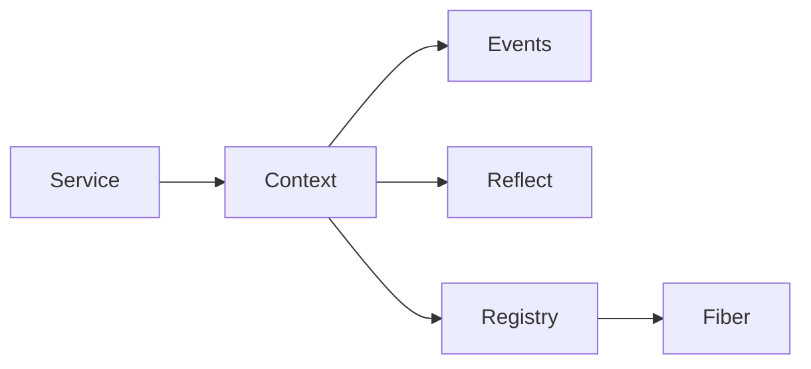

# Cordis框架核心

<cite>
**本文引用的文件**
- [docs/cordis-api/service.md](file://docs/cordis-api/service.md)
- [docs/cordis-api/context.md](file://docs/cordis-api/context.md)
- [docs/cordis-api/events.md](file://docs/cordis-api/events.md)
- [docs/cordis-api/registry.md](file://docs/cordis-api/registry.md)
- [docs/cordis-tutorial/01-first-plugin.md](file://docs/cordis-tutorial/01-first-plugin.md)
- [docs/cordis-tutorial/02-lifecycle-and-effects.md](file://docs/cordis-tutorial/02-lifecycle-and-effects.md)
- [docs/cordis-tutorial/03-services.md](file://docs/cordis-tutorial/03-services.md)
- [docs/cordis-tutorial/04-events.md](file://docs/cordis-tutorial/04-events.md)
- [docs/cordis-primer.md](file://docs/cordis-primer.md)
</cite>

## 目录
1. [简介](#简介)
2. [项目结构](#项目结构)
3. [核心组件](#核心组件)
4. [架构总览](#架构总览)
5. [详细组件分析](#详细组件分析)
6. [依赖关系分析](#依赖关系分析)
7. [性能考量](#性能考量)
8. [故障排查指南](#故障排查指南)
9. [结论](#结论)
10. [附录](#附录)

## 简介
本文件面向Cordis插件即服务（Plugin-as-a-Service）的核心概念，围绕以下主题展开：
- Service接口与“插件即服务”的设计思想
- Context作为服务仓库与上下文隔离
- 依赖注入机制与加载顺序管理
- 事件系统五种分发模式（emit、waterfall、parallel、serial、bail）的使用场景与返回值处理
- 可逆性效应：ctx.effect()与ctx.on()的注册与自动清理
- 通过教程示例展示如何定义服务、声明依赖和处理事件

## 项目结构
Cordis相关文档与教程位于docs目录下，API参考由脚本生成，涵盖Context、Service、Events、Registry等核心能力；教程从“第一个插件”到“生命周期与效应”、“服务”、“事件”逐步深入。

**图表来源**
- [docs/cordis-api/service.md:1-103](file://docs/cordis-api/service.md#L1-L103)
- [docs/cordis-api/context.md:1-365](file://docs/cordis-api/context.md#L1-L365)
- [docs/cordis-api/events.md:1-208](file://docs/cordis-api/events.md#L1-L208)
- [docs/cordis-api/registry.md:1-153](file://docs/cordis-api/registry.md#L1-L153)
- [docs/cordis-tutorial/01-first-plugin.md:1-96](file://docs/cordis-tutorial/01-first-plugin.md#L1-L96)
- [docs/cordis-tutorial/02-lifecycle-and-effects.md:1-99](file://docs/cordis-tutorial/02-lifecycle-and-effects.md#L1-L99)
- [docs/cordis-tutorial/03-services.md:1-99](file://docs/cordis-tutorial/03-services.md#L1-L99)
- [docs/cordis-tutorial/04-events.md:1-145](file://docs/cordis-tutorial/04-events.md#L1-L145)
- [docs/cordis-primer.md:1-46](file://docs/cordis-primer.md#L1-L46)

**章节来源**
- [docs/cordis-api/service.md:1-103](file://docs/cordis-api/service.md#L1-L103)
- [docs/cordis-api/context.md:1-365](file://docs/cordis-api/context.md#L1-L365)
- [docs/cordis-api/events.md:1-208](file://docs/cordis-api/events.md#L1-L208)
- [docs/cordis-api/registry.md:1-153](file://docs/cordis-api/registry.md#L1-L153)
- [docs/cordis-tutorial/01-first-plugin.md:1-96](file://docs/cordis-tutorial/01-first-plugin.md#L1-L96)
- [docs/cordis-tutorial/02-lifecycle-and-effects.md:1-99](file://docs/cordis-tutorial/02-lifecycle-and-effects.md#L1-L99)
- [docs/cordis-tutorial/03-services.md:1-99](file://docs/cordis-tutorial/03-services.md#L1-L99)
- [docs/cordis-tutorial/04-events.md:1-145](file://docs/cordis-tutorial/04-events.md#L1-L145)
- [docs/cordis-primer.md:1-46](file://docs/cordis-primer.md#L1-L46)

## 核心组件
- Context：应用根与子依赖容器，提供服务的读取、提供、拦截、隔离以及事件总线、日志、反射、插件注册等能力。
- Service：以命名方式暴露能力的基类，实例化时向Context注册自身，随所属fiber卸载而自动移除。
- Events：事件总线，支持emit、parallel、serial、bail、waterfall五种分发模式，并可通过ctx.on/once订阅。
- Registry：插件加载与依赖注入，支持函数、对象、类三种插件形态，并通过inject声明依赖，保证按需启动与热替换。

**章节来源**
- [docs/cordis-api/context.md:1-365](file://docs/cordis-api/context.md#L1-L365)
- [docs/cordis-api/service.md:1-103](file://docs/cordis-api/service.md#L1-L103)
- [docs/cordis-api/events.md:1-208](file://docs/cordis-api/events.md#L1-L208)
- [docs/cordis-api/registry.md:1-153](file://docs/cordis-api/registry.md#L1-L153)

## 架构总览
Cordis以Context为中心，将服务、事件、插件与生命周期统一管理。插件通过Service或apply形式贡献能力；依赖通过inject声明，由Registry确保在所需服务可用后才启动；事件用于松耦合通信；所有注册均为可逆效应，随fiber卸载自动清理。

**图表来源**
- [docs/cordis-api/context.md:1-365](file://docs/cordis-api/context.md#L1-L365)
- [docs/cordis-api/registry.md:1-153](file://docs/cordis-api/registry.md#L1-L153)
- [docs/cordis-tutorial/02-lifecycle-and-effects.md:68-82](file://docs/cordis-tutorial/02-lifecycle-and-effects.md#L68-L82)

## 详细组件分析

### 插件即服务（Service）
- 设计要点
  - 每个Service子类在构造时调用super(ctx, name)，立即向Context注册自身，名称为name。
  - 服务是“插件”，其生命周期绑定到当前fiber；当fiber卸载时，服务自动移除。
  - 通过TypeScript模块合并扩展Context类型，使ctx.<name>具备类型安全。
- 使用建议
  - 将稳定能力以Service暴露，消费者通过ctx.<name>访问，避免直接导入实现，便于配置切换提供者。
  - 服务名在同一应用中唯一，建议使用前缀或命名空间避免冲突。

**图表来源**
- [docs/cordis-api/service.md:1-103](file://docs/cordis-api/service.md#L1-L103)
- [docs/cordis-tutorial/03-services.md:1-99](file://docs/cordis-tutorial/03-services.md#L1-L99)

**章节来源**
- [docs/cordis-api/service.md:1-103](file://docs/cordis-api/service.md#L1-L103)
- [docs/cordis-tutorial/03-services.md:1-99](file://docs/cordis-tutorial/03-services.md#L1-L99)

### 上下文（Context）与服务仓库
- 设计要点
  - Context是代理对象：普通属性读取走服务解析器；extend/isolate/intercept创建子上下文而不修改父上下文。
  - 提供/获取服务：ctx.provide(name, value)注册当前fiber提供的服务；ctx.get(name, strict?)读取服务；ctx.set(name, value)覆盖已提供的值。
  - 计算属性与混入：ctx.accessor定义get/set钩子；ctx.mixin将某服务的成员直接暴露到ctx上。
  - 隔离与拦截：ctx.isolate(name, label)为指定服务创建独立作用域；ctx.intercept(name, config)为下游插件提供该服务的拦截配置。
- 使用建议
  - 通过isolate实现多实例或多租户的服务隔离；通过intercept在不改动上游的情况下注入配置。
  - 用mixin减少样板代码，例如将events的方法直接挂载到ctx。

**图表来源**
- [docs/cordis-api/context.md:235-365](file://docs/cordis-api/context.md#L235-L365)

**章节来源**
- [docs/cordis-api/context.md:1-365](file://docs/cordis-api/context.md#L1-L365)

### 依赖注入与加载顺序管理
- 设计要点
  - inject声明硬依赖：数组形式不传拦截配置；对象形式可为每个依赖指定拦截配置。
  - 加载时机：插件进入PENDING直到所有inject依赖就绪；依赖变化（卸载/热替换）会触发依赖方卸载并重载。
  - 可选依赖：使用ctx.get(name)探测是否存在，避免阻塞加载。
- 使用建议
  - 优先通过inject声明强依赖，保持加载顺序由依赖图决定而非配置文件顺序。
  - 对可选能力使用ctx.get进行防御式调用。

**图表来源**
- [docs/cordis-api/registry.md:8-56](file://docs/cordis-api/registry.md#L8-L56)
- [docs/cordis-tutorial/03-services.md:44-79](file://docs/cordis-tutorial/03-services.md#L44-L79)

**章节来源**
- [docs/cordis-api/registry.md:1-153](file://docs/cordis-api/registry.md#L1-L153)
- [docs/cordis-tutorial/03-services.md:1-99](file://docs/cordis-tutorial/03-services.md#L1-L99)

### 事件系统与分发模式
- 设计要点
  - 事件通过TypeScript声明合并加入Events接口，获得完整类型提示。
  - 五种分发模式：
    - emit：同步广播，忽略返回值。
    - parallel：并发执行所有监听器，全部settled后返回。
    - serial：按序await监听器，首个非空/非false/非undefined返回值停止后续。
    - bail：串行同步版本，遇到首个bail值停止。
    - waterfall：中间件风格，最后一个参数为next回调；不调用next即为否决（veto）。
- 使用建议
  - 观察型通知用emit；需要聚合结果用parallel；决策链用serial/bail；可插拔拦截/转换用waterfall。
  - 在waterfall中，仅观察/标注的监听器必须调用next，否则会导致下游行为被吞掉。

**图表来源**
- [docs/cordis-api/events.md:8-123](file://docs/cordis-api/events.md#L8-L123)
- [docs/cordis-tutorial/04-events.md:80-141](file://docs/cordis-tutorial/04-events.md#L80-L141)

**章节来源**
- [docs/cordis-api/events.md:1-208](file://docs/cordis-api/events.md#L1-L208)
- [docs/cordis-tutorial/04-events.md:1-145](file://docs/cordis-tutorial/04-events.md#L1-L145)
- [docs/cordis-primer.md:15-35](file://docs/cordis-primer.md#L15-L35)

### 可逆性效应：ctx.effect()与ctx.on()
- 设计要点
  - 所有通过Cordis API的注册都是效应：插件卸载时会按逆序自动清理。
  - ctx.effect(fn)：将外部资源（定时器、连接、watcher等）的生命周期交给Cordis管理，返回的disposer会在卸载时调用。
  - ctx.on/once：事件监听器也是效应，卸载时自动移除。
- 使用建议
  - 任何不在Cordis管理范围内的资源都应包裹在ctx.effect中，并确保返回正确的清理逻辑。
  - 若清理步骤有顺序要求，应在同一个effect内依次await，避免异步清理并发导致竞态。

**图表来源**
- [docs/cordis-tutorial/02-lifecycle-and-effects.md:68-82](file://docs/cordis-tutorial/02-lifecycle-and-effects.md#L68-L82)

**章节来源**
- [docs/cordis-tutorial/02-lifecycle-and-effects.md:1-99](file://docs/cordis-tutorial/02-lifecycle-and-effects.md#L1-L99)

### 具体示例路径（定义服务、声明依赖、处理事件）
- 定义服务：参见教程中的服务示例，包含Service子类、名称导出与apply挂载。
  - 参考路径：[docs/cordis-tutorial/03-services.md:7-43](file://docs/cordis-tutorial/03-services.md#L7-L43)
- 声明依赖：通过inject声明所需服务，确保apply执行时依赖已就绪。
  - 参考路径：[docs/cordis-tutorial/03-services.md:44-79](file://docs/cordis-tutorial/03-services.md#L44-L79)
- 处理事件：在服务中emit事件，并在其他插件中on订阅；演示waterfall中间件用法。
  - 参考路径：[docs/cordis-tutorial/04-events.md:7-79](file://docs/cordis-tutorial/04-events.md#L7-L79)
  - 参考路径：[docs/cordis-tutorial/04-events.md:94-141](file://docs/cordis-tutorial/04-events.md#L94-L141)

**章节来源**
- [docs/cordis-tutorial/03-services.md:1-99](file://docs/cordis-tutorial/03-services.md#L1-L99)
- [docs/cordis-tutorial/04-events.md:1-145](file://docs/cordis-tutorial/04-events.md#L1-L145)

## 依赖关系分析
- 组件耦合
  - Context聚合了事件、日志、反射、注册表等子系统，形成统一入口。
  - Registry依赖Context提供inject/plugin能力，并驱动Fiber生命周期。
  - Service与Context紧密耦合：服务通过Context注册与发现。
- 循环依赖
  - 通过“服务名”解耦消费端与提供端，避免直接导入造成的循环依赖。
- 外部集成点
  - 插件加载器读取cordis.yml，解析模块并挂载；热重载与配置变更通过依赖跟踪触发重加载。

**图表来源**
- [docs/cordis-api/context.md:1-365](file://docs/cordis-api/context.md#L1-L365)
- [docs/cordis-api/registry.md:1-153](file://docs/cordis-api/registry.md#L1-L153)

**章节来源**
- [docs/cordis-api/context.md:1-365](file://docs/cordis-api/context.md#L1-L365)
- [docs/cordis-api/registry.md:1-153](file://docs/cordis-api/registry.md#L1-L153)

## 性能考量
- 事件模式选择
  - emit适合高频、无回值的观测型通知，开销最小。
  - parallel适合需要并行收集结果的场景，注意监听器数量与耗时。
  - serial/bail适合决策链，尽早短路可减少不必要工作。
  - waterfall适合拦截/转换，但需确保仅观察型监听器调用next，避免意外短路。
- 依赖加载
  - 通过inject表达依赖，避免手动排序；依赖缺失时插件处于PENDING，不会阻塞事件循环。
- 效应清理
  - 多个异步disposer并发执行；如需顺序清理，请在同一effect内依次await。

[本节为通用指导，无需特定文件引用]

## 故障排查指南
- 插件未执行
  - 检查是否处于PENDING：缺少inject依赖会导致插件不启动。
  - 参考路径：[docs/cordis-tutorial/03-services.md:59-79](file://docs/cordis-tutorial/03-services.md#L59-L79)
- 事件未触发
  - 确认事件模式与调用方法匹配（如waterfall需传入next）。
  - 参考路径：[docs/cordis-api/events.md:8-123](file://docs/cordis-api/events.md#L8-L123)
- 资源泄漏
  - 未使用ctx.effect包装外部资源，或忘记返回disposer。
  - 参考路径：[docs/cordis-tutorial/02-lifecycle-and-effects.md:7-67](file://docs/cordis-tutorial/02-lifecycle-and-effects.md#L7-L67)
- 服务冲突
  - 同名服务重复提供或覆盖不当，检查ctx.provide与ctx.set的使用权限与作用域。
  - 参考路径：[docs/cordis-api/context.md:261-314](file://docs/cordis-api/context.md#L261-L314)

**章节来源**
- [docs/cordis-tutorial/02-lifecycle-and-effects.md:1-99](file://docs/cordis-tutorial/02-lifecycle-and-effects.md#L1-L99)
- [docs/cordis-tutorial/03-services.md:1-99](file://docs/cordis-tutorial/03-services.md#L1-L99)
- [docs/cordis-api/events.md:1-208](file://docs/cordis-api/events.md#L1-L208)
- [docs/cordis-api/context.md:235-365](file://docs/cordis-api/context.md#L235-L365)

## 结论
Cordis以Context为核心，将“插件即服务”的理念贯穿始终：通过Service暴露能力、通过Context管理服务仓库、通过Registry管理依赖与加载、通过事件系统进行松耦合通信、通过效应机制保障可逆性与可维护性。遵循这些原则，可以构建高内聚、低耦合、易测试且易于热替换的插件化系统。

[本节为总结性内容，无需特定文件引用]

## 附录
- 快速回顾：Cordis五大理念与分发模式速查
  - 参考路径：[docs/cordis-primer.md:7-27](file://docs/cordis-primer.md#L7-L27)
- 第一个插件与运行流程
  - 参考路径：[docs/cordis-tutorial/01-first-plugin.md:1-52](file://docs/cordis-tutorial/01-first-plugin.md#L1-L52)

**章节来源**
- [docs/cordis-primer.md:1-46](file://docs/cordis-primer.md#L1-L46)
- [docs/cordis-tutorial/01-first-plugin.md:1-96](file://docs/cordis-tutorial/01-first-plugin.md#L1-L96)