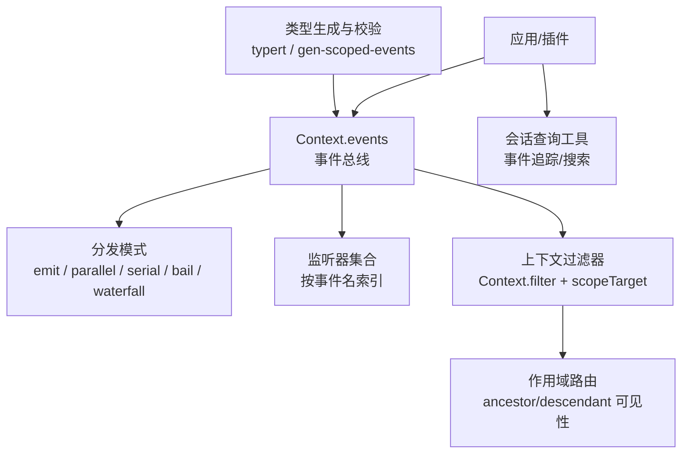
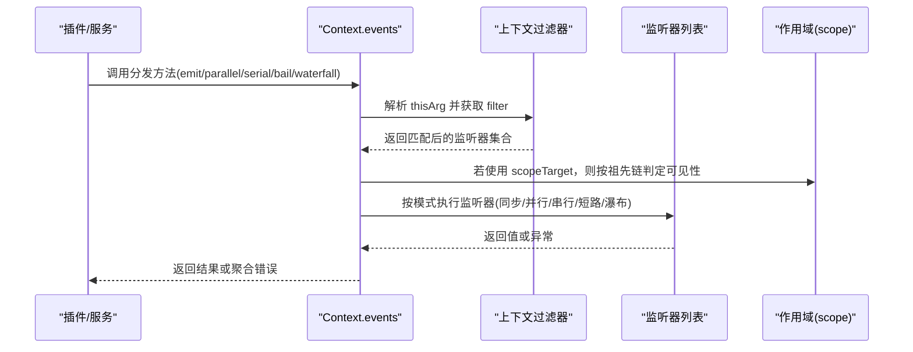
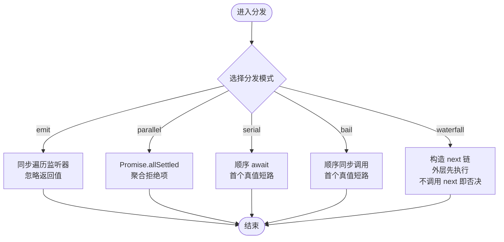
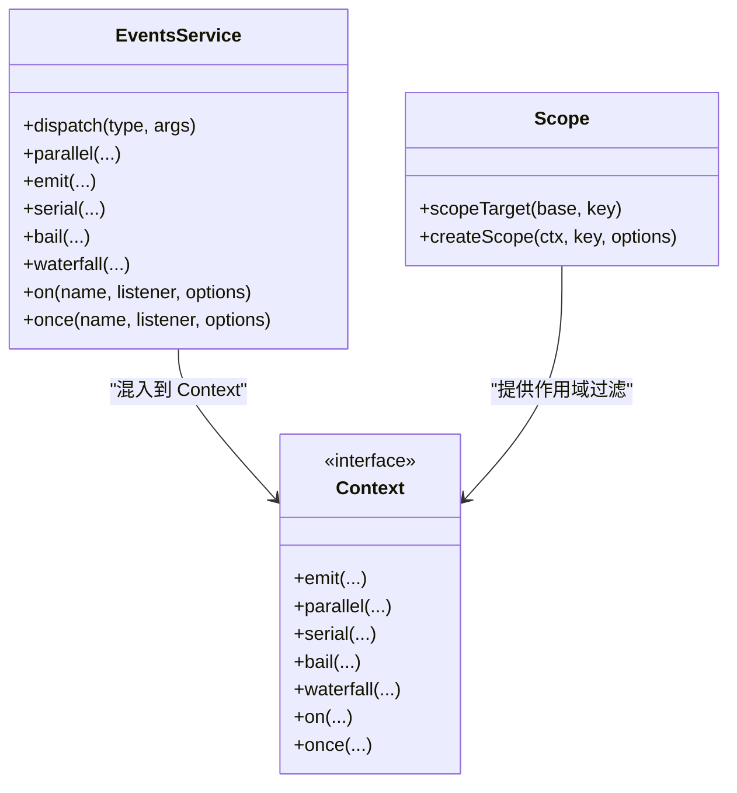
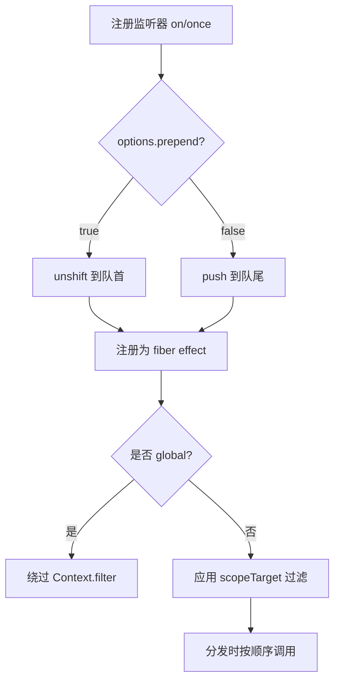
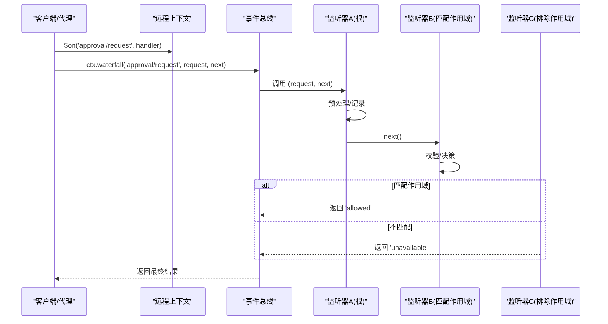
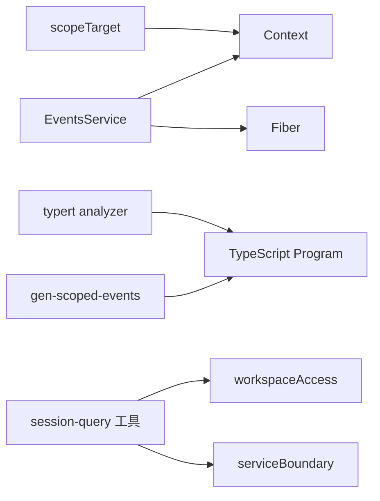

# 事件系统与通信

<cite>
**本文引用的文件**
- [events.ts](file://vendor/cordis/src/events.ts)
- [04-events.md](file://docs/cordis-tutorial/04-events.md)
- [events.zh.md](file://docs/cordis-api/events.zh.md)
- [dispatch.ts](file://packages/core/agent/src/dispatch.ts)
- [index.ts（scope）](file://packages/core/scope/src/index.ts)
- [operations.ts（session-query）](file://packages/session-query/tool-session-query/src/operations.ts)
- [index.ts（session-query 工具注册）](file://packages/session-query/tool-session-query/src/index.ts)
- [gen-scoped-events.ts](file://scripts/gen-scoped-events.ts)
- [analyzer.ts（typert）](file://packages/typert/generator/src/analyzer.ts)
- [cordis-catalog.ts（typert）](file://packages/typert/generator/src/cordis-catalog.ts)
</cite>

## 目录
1. [简介](#简介)
2. [项目结构](#项目结构)
3. [核心组件](#核心组件)
4. [架构总览](#架构总览)
5. [详细组件分析](#详细组件分析)
6. [依赖关系分析](#依赖关系分析)
7. [性能考量](#性能考量)
8. [故障排查指南](#故障排查指南)
9. [结论](#结论)
10. [附录：示例与最佳实践](#附录示例与最佳实践)

## 简介
本文件系统性梳理事件系统与通信机制，覆盖五种分发模式（emit、waterfall、parallel、serial、bail）的实现原理与使用场景；阐述类型安全设计（TypeScript 声明合并与运行时验证）；说明监听器注册与管理（优先级控制与条件过滤）；介绍事件调试与监控（事件流追踪与性能分析）；并提供定义事件、监听器与复杂事件流的实践指引。

## 项目结构
事件系统由 Cordis 事件总线提供基础能力，并通过 scope 模块实现基于上下文的路由与过滤；会话查询工具提供事件追踪能力；类型生成与校验脚本保障事件契约的完整性与一致性。

**图表来源**
- [events.ts:131-319](file://vendor/cordis/src/events.ts#L131-L319)
- [index.ts（scope）:158-185](file://packages/core/scope/src/index.ts#L158-L185)
- [operations.ts（session-query）:200-214](file://packages/session-query/tool-session-query/src/operations.ts#L200-L214)
- [gen-scoped-events.ts:163-229](file://scripts/gen-scoped-events.ts#L163-L229)

**章节来源**
- [events.ts:131-319](file://vendor/cordis/src/events.ts#L131-L319)
- [index.ts（scope）:158-185](file://packages/core/scope/src/index.ts#L158-L185)
- [operations.ts（session-query）:200-214](file://packages/session-query/tool-session-query/src/operations.ts#L200-L214)
- [gen-scoped-events.ts:163-229](file://scripts/gen-scoped-events.ts#L163-L229)

## 核心组件
- 事件总线 EventsService：维护监听器、分发策略、生命周期绑定与内部诊断事件。
- 上下文 Context 扩展：通过 declare module 注入 emit/parallel/serial/bail/waterfall/on/once 等方法。
- 作用域 scope：通过 scopeTarget 构建带过滤器的派发载体，实现“向上可见”的事件路由。
- 会话查询工具：提供事件追踪与检索能力，便于调试与审计。
- 类型生成与校验：从源码抽取 Events 接口并生成文档与运行时约束，确保事件契约一致。

**章节来源**
- [events.ts:34-109](file://vendor/cordis/src/events.ts#L34-L109)
- [events.ts:131-319](file://vendor/cordis/src/events.ts#L131-L319)
- [index.ts（scope）:158-185](file://packages/core/scope/src/index.ts#L158-L185)
- [operations.ts（session-query）:200-214](file://packages/session-query/tool-session-query/src/operations.ts#L200-L214)
- [analyzer.ts（typert）:1873-1900](file://packages/typert/generator/src/analyzer.ts#L1873-L1900)

## 架构总览
事件系统以 Context.events 为中心，所有插件通过 ctx.on 注册监听器，通过 ctx.emit/parallel/serial/bail/waterfall 触发事件。分发前会执行上下文过滤（Context.filter），结合 scopeTarget 的作用域规则决定哪些监听器可接收事件。内部事件 internal/dispatch 暴露分发过程，便于观测与诊断。

**图表来源**
- [events.ts:165-243](file://vendor/cordis/src/events.ts#L165-L243)
- [index.ts（scope）:158-185](file://packages/core/scope/src/index.ts#L158-L185)

## 详细组件分析

### 事件分发模式与语义
- emit：同步广播，不等待返回值或 Promise。适用于日志、指标等无副作用收集。
- parallel：并发执行所有监听器，统一 await 后聚合异常（AggregateError）。适用于独立且可并行的处理。
- serial：顺序等待每个监听器，首个非 null/false/undefined 的返回值即短路。适用于决策链。
- bail：serial 的同步版本，快速短路。
- waterfall：最后一个参数为 next 续接回调；监听器可选择调用 next() 继续链路或不调用以否决后续行为。适用于中间件式拦截与转换。

**图表来源**
- [events.ts:183-243](file://vendor/cordis/src/events.ts#L183-L243)
- [04-events.md:80-92](file://docs/cordis-tutorial/04-events.md#L80-L92)

**章节来源**
- [events.ts:183-243](file://vendor/cordis/src/events.ts#L183-L243)
- [04-events.md:80-92](file://docs/cordis-tutorial/04-events.md#L80-L92)

### 类型安全设计：声明合并与运行时验证
- 声明合并：通过 declare module '@deepseek-ai/cordis' 扩展 Context 与 Events 接口，使 ctx.emit/ctx.on 等具备强类型签名，事件名与参数在编译期受检。
- 类型生成：typert 扫描 Events 接口成员，提取签名与 JSDoc，生成参考文档与运行时类型引用；支持 @mode 标签标注分发模式。
- 范围化事件校验：gen-scoped-events 扫描所有 Events 成员，对 this: Scoped<Base> 的事件推导路由键，并在多义或缺失时抛出错误，保证作用域路由正确性。

**图表来源**
- [events.ts:34-109](file://vendor/cordis/src/events.ts#L34-L109)
- [events.ts:131-319](file://vendor/cordis/src/events.ts#L131-L319)
- [index.ts（scope）:137-185](file://packages/core/scope/src/index.ts#L137-L185)

**章节来源**
- [events.ts:34-109](file://vendor/cordis/src/events.ts#L34-L109)
- [analyzer.ts（typert）:1873-1900](file://packages/typert/generator/src/analyzer.ts#L1873-L1900)
- [gen-scoped-events.ts:163-229](file://scripts/gen-scoped-events.ts#L163-L229)

### 监听器注册与管理：优先级与条件过滤
- 优先级控制：on/once 支持 prepend 选项将监听器插入到队列头部，从而获得更高优先级；默认 push 追加到尾部。
- 条件过滤：
  - 全局监听器：options.global = true 可绕过 Context.filter 检查，始终接收事件。
  - 作用域过滤：通过 scopeTarget 构建的派发载体携带 filter，仅允许“当前作用域或其祖先作用域”的监听器接收事件，实现“向上可见”的隔离与组合。
- 生命周期管理：监听器作为 fiber 的 effect 注册，随 fiber 销毁自动移除，无需手动注销。

**图表来源**
- [events.ts:254-302](file://vendor/cordis/src/events.ts#L254-L302)
- [index.ts（scope）:158-185](file://packages/core/scope/src/index.ts#L158-L185)

**章节来源**
- [events.ts:254-302](file://vendor/cordis/src/events.ts#L254-L302)
- [index.ts（scope）:158-185](file://packages/core/scope/src/index.ts#L158-L185)

### 事件调试与监控：事件流追踪与性能分析
- 内部诊断事件：internal/dispatch 在非 internal 事件分发前触发，记录 mode、name、args、thisArg，可用于全量事件流观测。
- 会话事件追踪：通过 session_query.traceEvent 读取授权会话中某条事件的完整溯源信息（包括替换链、派生链等），配合工具呈现可读格式。
- 性能分析建议：
  - 高吞吐路径优先使用 emit 避免阻塞。
  - 可并行任务使用 parallel 提升吞吐，注意异常聚合。
  - 决策链使用 serial/bail 减少不必要分支。
  - 中间件式处理使用 waterfall，注意必须调用 next() 以避免静默吞掉默认行为。

**章节来源**
- [events.ts:165-175](file://vendor/cordis/src/events.ts#L165-L175)
- [operations.ts（session-query）:200-214](file://packages/session-query/tool-session-query/src/operations.ts#L200-L214)
- [index.ts（session-query 工具注册）:66-94](file://packages/session-query/tool-session-query/src/index.ts#L66-L94)

### 典型工作流：审批请求（waterfall）
以下序列图展示一个跨作用域的审批请求如何通过 waterfall 模式被多个监听器包装与决策。

**图表来源**
- [events.ts:234-243](file://vendor/cordis/src/events.ts#L234-L243)
- [index.ts（scope）:158-185](file://packages/core/scope/src/index.ts#L158-L185)

## 依赖关系分析
- EventsService 依赖 Context 与 Fiber，用于监听器生命周期管理与反射绑定。
- scope 模块通过 Context.filter 与 WeakMap 维护作用域父子关系，影响事件可达性。
- typert 与 gen-scoped-events 依赖 TypeScript Program 进行静态分析，产出类型与路由解析代码。
- 会话查询工具依赖 workspaceAccess 与 serviceBoundary 进行权限与边界控制。

**图表来源**
- [events.ts:131-319](file://vendor/cordis/src/events.ts#L131-L319)
- [index.ts（scope）:158-185](file://packages/core/scope/src/index.ts#L158-L185)
- [gen-scoped-events.ts:163-229](file://scripts/gen-scoped-events.ts#L163-L229)
- [operations.ts（session-query）:200-214](file://packages/session-query/tool-session-query/src/operations.ts#L200-L214)

**章节来源**
- [events.ts:131-319](file://vendor/cordis/src/events.ts#L131-L319)
- [index.ts（scope）:158-185](file://packages/core/scope/src/index.ts#L158-L185)
- [gen-scoped-events.ts:163-229](file://scripts/gen-scoped-events.ts#L163-L229)
- [operations.ts（session-query）:200-214](file://packages/session-query/tool-session-query/src/operations.ts#L200-L214)

## 性能考量
- 并发与阻塞：parallel 适合 I/O 密集型且相互独立的监听器；serial/bail 适合需要顺序控制的决策流程。
- 异常聚合：parallel 会将所有拒绝的 Promise 聚合为 AggregateError，需在上层妥善处理。
- 过滤成本：大量作用域嵌套会增加 filter 遍历开销，应合理划分作用域层级。
- 日志与追踪：internal/dispatch 可用于全量事件观测，但生产环境需谨慎开启以避免性能损耗。

[本节为通用指导，不直接分析具体文件]

## 故障排查指南
- 事件未触发：
  - 检查是否使用了 scopeTarget 派发且监听器不在祖先作用域内。
  - 确认监听器是否被正确注册为 fiber effect，且在 fiber 活跃期间。
- 短路行为不符合预期：
  - serial/bail 会在首个非 null/false/undefined 返回值处停止，请检查监听器返回值。
  - waterfall 中未调用 next() 会否决后续链路，确保观察型监听器调用 next()。
- 类型错误：
  - 确保 Events 接口成员签名与调用点一致；必要时重新运行类型生成脚本。
  - 对于作用域事件，确保 this: Scoped<Base> 与 scopeTarget 的 base/key 类型一致。
- 性能问题：
  - 评估是否可将串行逻辑改为并行；或在关键路径上减少 waterfall 深度。

**章节来源**
- [events.ts:183-243](file://vendor/cordis/src/events.ts#L183-L243)
- [index.ts（scope）:158-185](file://packages/core/scope/src/index.ts#L158-L185)
- [gen-scoped-events.ts:163-229](file://scripts/gen-scoped-events.ts#L163-L229)

## 结论
该事件系统通过五种分发模式满足多样化通信需求，结合声明合并与类型生成实现强类型契约，利用作用域与上下文过滤实现安全的模块化通信。借助 internal/dispatch 与会话事件追踪，可在开发与运维阶段高效定位问题。遵循最佳实践（如 waterfall 必须调用 next、合理使用并行与串行）可获得稳定且高性能的系统。

[本节为总结性内容，不直接分析具体文件]

## 附录：示例与最佳实践
- 定义事件与监听器：
  - 在插件中通过 declare module 扩展 Events 接口，声明事件名与监听器签名。
  - 使用 ctx.emit 发送通知；使用 ctx.on 订阅事件；使用 ctx.once 一次性监听。
- 使用 waterfall 做中间件式处理：
  - 每个监听器接收 next 续接回调；观察型监听器务必调用 next()。
  - 决策型监听器可通过不调用 next 来否决后续行为。
- 使用 scope 做作用域隔离：
  - 使用 scopeTarget 构建派发载体，确保只有祖先作用域的监听器能收到事件。
  - 结合 Context.filter 实现更细粒度的条件过滤。
- 调试与监控：
  - 订阅 internal/dispatch 以记录事件流。
  - 使用 session_query.traceEvent 查看事件溯源与替换链。

**章节来源**
- [04-events.md:7-92](file://docs/cordis-tutorial/04-events.md#L7-L92)
- [events.zh.md:51-139](file://docs/cordis-api/events.zh.md#L51-L139)
- [dispatch.ts:117-149](file://packages/core/agent/src/dispatch.ts#L117-L149)
- [operations.ts（session-query）:200-214](file://packages/session-query/tool-session-query/src/operations.ts#L200-L214)